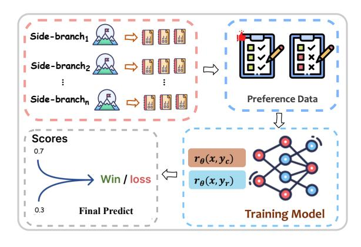
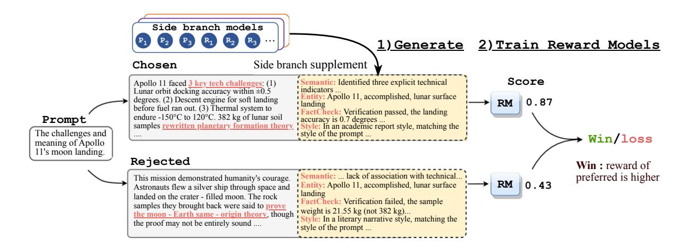
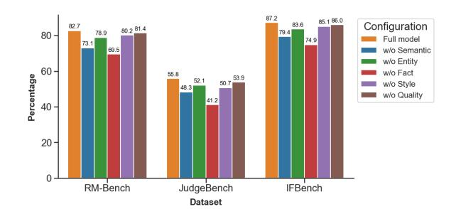

# Structural Reward Model: Enhancing Interpretability, Efficiency, and Scalability in Reward Modeling

Xiaoyu Liu1,\*, Di Liang1,2,†, Hongyu Shan† , Peiyang Liu‡ , Yonghao Liu†‡ Muling Wu† , Yuntao Li† , Xianjie Wu‡‡ , LI Miao† , Jiangrong Shen†‡‡ , Minlong Peng‡‡‡,2 \*Northeastern University, Boston, † Independent Developer, ‡Peiking University, †‡Jilin University, ‡‡Beihang University, †‡‡Xi'an Jiaotong University, ‡‡‡Baidu Inc {liu.xiaoyu7}@northeastern.edu, {liangd17,mlpeng16}@fudan.edu.cn

### Abstract

Reward Models (RMs) are key components for evaluating and guiding language model outputs. However, traditional scalar RMs often struggle with incorporating contextual and background information during inference, leading to incomplete evaluations. Generative RMs (GRMs) attempt to address these limitations by generating intermediate reasoning steps. Yet, their uncontrolled black-box nature and inefficiency due to sequential decoding hinder their industrial deployment. Industrial scenarios, such as search and recommendation systems, often involve single-domain tasks requiring evaluation along specific dimensions. In such contexts, diagnosing "bad cases" necessitates structured feedback to identify and optimize dimensionspecific issues. In this paper, we propose the Structural Reward Model (SRM), a modular and interpretable framework integrating side-branch models as auxiliary feature generators. By introducing fine-grained dimensions, SRMs enable interpretable and efficient evaluation, facilitating targeted diagnostics and optimization. This structured approach ensures adaptability and scalability for industrial applications. Through comprehensive experiments, we demonstrate that SRMs outperform scalar RMs and GRMs in robustness and alignment with human preferences. The modular design further supports efficient optimization for practical scenarios, allowing SRM to provide a practical reward modeling solution for industry.

### 1 Introduction

Large Language Models (LLMs) have demonstrated remarkable capabilities in generating human-like text across diverse tasks [\(OpenAI,](#page-8-0) [2024a\)](#page-8-0). However, ensuring these models deliver high-quality, contextually appropriate, and aligned responses continues to pose challenges [\(Ouyang](#page-8-1)

Figure 1: Overview of the Side Branch Models Enhanced Structural Reward Model architecture.

[et al.,](#page-8-1) [2022;](#page-8-1) [Casper et al.,](#page-6-0) [2023\)](#page-6-0). Reward Models (RMs) play a vital role in addressing this by evaluating and guiding outputs based on human preferences [\(Stiennon et al.,](#page-8-2) [2020\)](#page-8-2). Traditional scalar RMs score responses using only the prompt and the generated output as input signals. While effective in many scenarios, this reliance on limited input often results in incomplete evaluations, as they lack access to richer contextual information and background knowledge during inference.

Recent advancements, such as Generative Reward Models (GRMs) [\(Liu et al.,](#page-7-0) [2025;](#page-7-0) [Zhang et al.,](#page-9-0) [2025;](#page-9-0) [Wu et al.,](#page-9-1) [2025b](#page-9-1)[,c\)](#page-9-2), attempt to mitigate the limitations of scalar RMs by generating intermediate reasoning steps to inform the reward evaluation process. Despite their conceptual promise, GRMs face substantial challenges in practical industrial deployment due to their uncontrolled, black-box nature and inefficiency stemming from sequential decoding [\(Sinha and Lee,](#page-8-3) [2024\)](#page-8-3). These characteristics hinder interpretability and scalability, reducing their applicability in real-world scenarios like search or recommendation systems. For example, tasks in these industries often require assessments based on dimensions like relevance, timeliness, and authority [\(Zhang et al.,](#page-9-3) [2017;](#page-9-3) [Wu et al.,](#page-9-4) [2025e\)](#page-9-4). Di-

1[Equal contribution](#page-8-1)

2[Corresponding author: Di Liang, Minlong Peng.](#page-8-1)

agnosing "bad cases" in these settings necessitates structured feedback that can pinpoint specific dimensions for optimization [\(Lee et al.,](#page-7-1) [2015;](#page-7-1) [Wu](#page-9-5) [et al.,](#page-9-5) [2025d\)](#page-9-5). Without such interpretability, GRMs struggle to provide actionable insights.

To address the gaps in current reward modeling approaches, we introduce the Structural Reward Model (SRM) framework, as illustrated in Figure [1.](#page-0-0) The SRM integrates side-branch models as auxiliary feature generators inspired by the feature engineering principles from traditional machine learning paradigms [\(Lambert et al.,](#page-7-2) [2024a\)](#page-7-2). Unlike scalar RMs that rely solely on prompt-response pairs or GRMs that operate as black-box generators, SRMs utilize modular, interpretable components capable of extracting fine-grained signals from input data. These side-branch models capture additional dimensions of contextual cues, such as semantic understanding, entity augmentation, style consistency, alignment with external knowledge, and diversity of responses [\(Yao et al.,](#page-9-6) [2025\)](#page-9-6). By combining these complementary features, the SRM transforms reward evaluation from a simple scalar rating to a more flexible rating process.

The structured nature of SRMs addresses the inefficiencies and interpretability limitations of GRMs by enabling feature-specific diagnostics. For instance, in industrial scenarios like search and recommendation systems, SRMs facilitate pinpointing which evaluation dimension—whether relevance, timeliness, authority, or diversity—is causing suboptimal performance. Such modular interpretability allows for targeted optimization of dimension-specific components, ensuring adaptability and scalability in single-domain tasks prevalent in industry. Moreover, the framework's modular design supports parallel computations, significantly improving inference and evaluation efficiency compared to GRMs' sequential decoding approach. To validate the practical significance of SRMs, we conducted extensive experiments on public datasets and industrial benchmarks. The results demonstrate that SRMs outperform both scalar RMs and GRMs in accuracy, robustness, and alignment with human preferences. Furthermore, the modular architecture proves highly effective in diagnosing dimensional errors, enabling efficient optimization strategies for real-world applications.

In summary, our contributions are threefold: (1) We systematically analyze the limitations of traditional scalar RMs and GRMs, particularly their inadequate utilization of contextual information

and inefficiency in industrial scenarios; (2) We propose the novel Structural Reward Model (SRM), which employs side-branch models as interpretable feature generators to address these challenges; and (3) We validate the effectiveness of SRMs through extensive experiments, showcasing improvements in interpretability, efficiency, and scalability for industry applications.

### 2 Related Work

Reward models (RMs) and Verifiers. Traditionally, RMs and verifiers are trained as discriminative models through binary classification: given a prompt and a corresponding solution (or a pair of corresponding solutions), the model predicts either the correctness of the solution [\(Cobbe et al.,](#page-6-1) [2021;](#page-6-1) [Lightman et al.,](#page-7-3) [2023;](#page-7-3) [Wang et al.,](#page-8-4) [2023;](#page-8-4) [Uesato](#page-8-5) [et al.,](#page-8-5) [2022;](#page-8-5) [Liu et al.,](#page-7-4) [2023a;](#page-7-4) [Wang et al.,](#page-9-7) [2022;](#page-9-7) [Luo et al.,](#page-7-5) [2024;](#page-7-5) [Liang et al.,](#page-7-6) [2019a;](#page-7-6) [Liu et al.,](#page-7-7) [2023b;](#page-7-7) [Yu et al.,](#page-9-8) [2024\)](#page-9-8) or the preference between the two solutions [\(Stiennon et al.,](#page-8-2) [2020;](#page-8-2) [Nakano](#page-8-6) [et al.,](#page-8-6) [2021\)](#page-8-6). Concretely, the RM directly produces a numerical continuous-valued score, which is then plugged into a classification objective.

LLM-as-a-Judge. Verification as next-token prediction by *prompting* off-the-shelf LLMs to serve as a verifier, using either template[\(Zheng et al.,](#page-9-9) [2024;](#page-9-9) [Bai et al.,](#page-6-2) [2022;](#page-6-2) [Song et al.,](#page-8-7) [2022;](#page-8-7) [Kim et al.,](#page-7-8) [2023;](#page-7-8) [Gui et al.,](#page-6-3) [2018;](#page-6-3) [Liang et al.,](#page-7-9) [2019b;](#page-7-9) [Ling](#page-7-10) [et al.,](#page-7-10) [2024\)](#page-7-10) or many-shot in-context learning examples [\(Agarwal et al.,](#page-6-4) [2024\)](#page-6-4), but *without* specific training for the same [\(Li et al.,](#page-7-11) [2024b;](#page-7-11) [Ma et al.,](#page-8-8) [2022;](#page-8-8) [Gu et al.,](#page-6-5) [2024;](#page-6-5) [Xue et al.,](#page-9-10) [2024;](#page-9-10) [Hu et al.,](#page-6-6) [2025;](#page-6-6) [Wang et al.,](#page-9-11) [2025\)](#page-9-11). Our experiments reveal that employing more powerful LLMs as a judge functions worse than trained RM using weaker Gemma models. This finding underscores the critical importance of training verifiers, potentially due to more accurately calibrated uncertainty estimates [\(Kapoor et al.,](#page-7-12) [2024\)](#page-7-12). More broadly, even the strong proprietary LLMs, such as GPT-4 [\(Achiam](#page-6-7) [et al.,](#page-6-7) [2023\)](#page-6-7) and Gemini [\(Team et al.,](#page-8-9) [2024\)](#page-8-9), fall behind trained RMs on popular leaderboards [\(Lam](#page-7-2)[bert et al.,](#page-7-2) [2024a\)](#page-7-2), this gap is larger for reasoning. Using CoTs inreward models. Piror research has explored leveraging CoT reasoning to extract preference and verification signals using LLM-as-a-Judge [\(Yuan et al.,](#page-9-12) [2024;](#page-9-12) [Wu et al.,](#page-9-13) [2024;](#page-9-13) [Liu et al.,](#page-7-13) [2024c;](#page-7-13) [Wang et al.,](#page-9-14) [2024b;](#page-9-14) [Lee et al.,](#page-7-14) [2023;](#page-7-14) [Xue](#page-9-15) [et al.,](#page-9-15) [2023;](#page-9-15) [Sharma et al.,](#page-8-10) [2024\)](#page-8-10). Some methods rely on high-quality human data to train critique

models [\(Saunders et al.,](#page-8-11) [2022\)](#page-8-11), while others focus on training *discriminative* RMs for generating code critiques [\(McAleese et al.,](#page-8-12) [2024\)](#page-8-12). For instance, [Ye et al.](#page-9-16) [\(2024\)](#page-9-16) employs CoTs from a separate highly-capable LLM to enhance reward models. The current work of [Ankner et al.](#page-6-8) [\(2024\)](#page-6-8) trains an RM to generate response critiques for the generated preference pairs using a more capable LLM. These critiques are then passed as input into a discriminative RM head, separate from the base LLM [\(Cui](#page-6-9) [et al.,](#page-6-9) [2023;](#page-6-9) [Wu et al.,](#page-9-17) [2025a;](#page-9-17) [Dubois et al.,](#page-6-10) [2023\)](#page-6-10). However, these approaches neither unify generation and verification nor filter synthetic critiques for correctness, risking unreliable CoTs in reasoning. Unified Generation and Verification. DPO and GRPO [\(Rafailov et al.,](#page-8-13) [2024;](#page-8-13) [Zheng et al.,](#page-9-18) [2022;](#page-9-18) [Guo et al.,](#page-6-11) [2025\)](#page-6-11) and its application to learning verifiers in reasoning [\(Hosseini et al.,](#page-6-12) [2024\)](#page-6-12) aim to implicitly represent the reward using the logits of a policy that is trainable by reward-modeling loss. However, this approach has been shown to exhibit erroneous extrapolation in learned representations. Prior work has attempted to address these issues with additional techniques, such as iterative reasoning [\(Pang et al.,](#page-8-14) [2024;](#page-8-14) [Fei et al.,](#page-6-13) [2022;](#page-6-13) [Wu](#page-9-19) [et al.,](#page-9-19) [2025f\)](#page-9-19), reinforcement learning on incorrect trajectories [\(Setlur et al.,](#page-8-15) [2024\)](#page-8-15), and regularization methods [\(Pal et al.,](#page-8-16) [2024;](#page-8-16) [Li et al.,](#page-7-15) [2024c;](#page-7-15) [Liu et al.,](#page-7-4) [2023a;](#page-7-4) [Li et al.,](#page-7-16) [2024a;](#page-7-16) [Yang et al.,](#page-9-20) [2024\)](#page-9-20). Notably, [Yang et al.](#page-9-20) [\(2024\)](#page-9-20); [Wu et al.](#page-9-21) [\(2025g\)](#page-9-21) train a reward model with an auxiliary generative SFT loss. Unlike approaches that unify generation and verification, these methods avoid text generation during RM queries and rely on more complex training procedures [\(Meng et al.,](#page-8-17) [2024;](#page-8-17) [Mao et al.,](#page-8-18) [2025\)](#page-8-18).

### 3 Methodology

To address the limitations of traditional RM in capturing contextual and background information during the inference, we propose an enhanced Structural Reward Model (SRM) framework integrated with Side Branch Models (SBMs), as illustrated in Figur[e2.](#page-3-0) The framework leverages SBMs to generate auxiliary features, thereby augmenting the information available to the RM when evaluating the responses. The overall process is as follows: First, sample and filter the training data to obtain highquality datasets for SBMs training. The SBMs are then applied to the input prompt, chosen response, and rejected response to generate auxiliary features. Finally, these features are concatenated with the

original <prompt, chosen> and <prompt, rejected> pairs and fed into the standard RM for classification, as datailed in Algorith[m1.](#page-13-0)

#### 3.1 Design of Side-Branch Models

We design five different functional side-branch models, all of which are based on the LLaMA3- 8B large language model and obtained through LoRA [\(Hu et al.,](#page-6-14) [2022\)](#page-6-14) fine-tuning. The design motivation and details are shown in the Appendix [C.](#page-12-0) The specific types of side-branch models are as:

- 1) *Semantic Understanding Model* (SB-Semantic): Extracts the deep semantic information from the <prompt, response> pair, revealing underlying thematic structures.
- 2) *Entity Background Information Expansion Model* (SB-Entity): Leverages external knowledge graphs to expand the knowledge background of the core entities and their relational dynamics within the prompt and response.
- 3) *Fact-Checking Model* (SB-FactCheck): Verifies whether the factual statements in the response are consistent with the known facts and outputs an accuracy analysis text automatically.
- 4) *Style Matching Analysis Model* (SB-Style): Analyzes the style, tone, and wording of the response, evaluates its uniformity with the style of the prompt, and generates an analysis of the style similarity.
- 5) *Quality Assessment Model* (SB-Quality): Provides evaluation feedback on the diversity and creativity of the response to avoid generating single and repetitive content.

The methodology for collecting and cleaning the training data for side-branch models comprises the following systematic steps: Initially, we employ the Best-of-N (BoN) sampling strategy on a largescale prompt-response dataset to generate a comprehensive set of preliminary (prompt, response, auxiliary-text) training candidate triples:

$$\mathcal{D}_{\text{auxiliary-candidate}} = \{ (p, r, a^{(i)}) \mid i = 1, \dots, M \}$$
(1)

Subsequently, to ensure training data quality, we implement the "LLM-as-a-judge", utilizing a highperformance LLaMa3-8B judge model [1](#page-0-1) (denoted as o1) for rigorous quality assessment and screening of candidate data. For each candidate data point

1 <https://platform.openai.com/chat?models=o1>

Figure 2: Overview of the proposed Enhanced Structural Reward Model(SRM) framework integrated with Side Branch Models (SBMs). Given a prompt and candidate responses, the SBMs (Semantic Understanding, Entity Expansion, Fact-Checking, Style Matching, Quality Assessment) generate auxiliary textual contexts. These contexts augment the original input pairs, enabling the Reward Model to deliver evaluations with enhanced accuracy, robustness, and alignment with human preferences.

 $((p, r, a^{(i)}))$ , we input the triple into the judge model to generate a quality score (q) ranging from ([0, 1]):

$$q = o_1(p, r, a^{(i)}),$$
 (2)

The score magnitude directly correlates with the auxiliary text's  $(a^{(i)})$  quality and potential utility for side-branch model training. By establishing a predefined threshold  $(\tau)$ , we selectively retain only auxiliary texts exceeding this quality benchmark:

$$\mathcal{D}_{\text{auxiliary}} = \{ (p, r, a^{(i)}) \mid o_1(p, r, a^{(i)}) \ge \tau \}, (3)$$

Ultimately, we derive a refined, high-quality side-branch training dataset ( $\mathcal{D}_{\text{auxiliary}}$ ), which serves as the foundation for fine-tuning the corresponding side-branch model ( $SB_i$ ) through maximum likelihood optimization:

$$\mathcal{L}_{SB_{i}}(\phi_{i}) = -\frac{1}{|\mathcal{D}_{auxiliary}|} \sum_{(p,r,a)\in\mathcal{D}_{auxiliary}} \log P_{\phi_{i}}(a\mid p,r), \tag{4}$$

where  $\phi_i$  denotes the parameters of the *i*-th sidebranch model, and *a* represents the generated auxiliary text based on the prompt-response pair (p, r).

# 3.2 Construction and Training of the Enhanced Reward Model

Following the training of each side-branch model, we concatenate the output texts of the side-branch models with the original text pairs prompt, chosen> and and , reject> and , thereby obtaining the enhanced input representations:

$$x_{\text{chosen}} = p \oplus r_c \oplus t_c^{(1)} \oplus t_c^{(2)} \cdots \oplus t_c^{(N)},$$
  
$$x_{\text{reject}} = p \oplus r_j \oplus t_j^{(1)} \oplus t_j^{(2)} \cdots \oplus t_j^{(N)},$$
 (5)

where  $t_c^{(i)}$  and  $t_j^{(i)}$  represent the auxiliary texts generated by the *i*-th side-branch model with  $(p, r_c)$  and  $(p, r_i)$  as inputs respectively.

The standard Reward Model (RM) takes the enhanced inputs (i.e.,  $x_{\text{chosen}}$  and  $x_{\text{reject}}$ ) and then calculates the score values respectively:

$$s_c = RM(x_{\text{chosen}}; \theta), \quad s_j = RM(x_{\text{reject}}; \theta),$$
(6)

where  $\theta$  represents the trainable parameters of the reward model. These scores,  $s_c$  and  $s_j$ , quantify the model's preference for the chosen and rejected responses, respectively.

The optimization objective of the Bradley-Terry reward model is grounded in the Bradley-Terry pairwise comparison framework, which models the probability of the chosen response being preferred over the rejected response:

$$\mathcal{L}_{\text{BT-RM}}(\theta) = -\frac{1}{|\mathcal{D}_{t}|} \sum_{(p, r_{c}, r_{j}) \in \mathcal{D}_{t}} \log P(r_{c} \succ r_{j}|p),$$
(7)

where the probability  $P(r_c \succ r_i | p)$  is defined as:

$$P(r_c \succ r_j | p) = \frac{e^{s_c}}{e^{s_c} + e^{s_j}}.$$
 (8)

By minimizing this loss, the Bradley-Terry Reward Model learns to capture human preferences and generates more accurate evaluations.

| Model                            | RM-Bench |      | JudgeBench | IFBench |        |      | Overall |
|----------------------------------|----------|------|------------|---------|--------|------|---------|
|                                  | Normal   | Hard |            | Simple  | Normal | Hard |         |
| ArmoRM-Llama3-8B-v0.1            | 76.7     | 34.6 | 51.9       | 72.3    | 66.2   | 59.5 | 56.5    |
| INF-ORM-Llama3.1-70B             | 77.5     | 25.1 | 59.1       | 78.7    | 69.2   | 53.8 | 55.7    |
| Skywork-Reward-Llama-3.1-8B-v0.2 | 78.0     | 31.8 | 57.8       | 78.7    | 69.2   | 59.8 | 58.1    |
| Skywork-Reward-Gemma-2-27B       | 82.7     | 35.1 | 55.8       | 87.2    | 68.4   | 56.1 | 59.2    |
| Openai-GPT-4o                    | 71.4     | 27.9 | 64.6       | 85.1    | 66.2   | 54.4 | 56.3    |
| Openai-GPT-4o mini               | 60.5     | 15.0 | 51.9       | 70.2    | 59.4   | 51.9 | 45.9    |
| Llama3-8B Instruct               | 9.3      | 20.2 | 2.6        | 12.8    | 12.8   | 13.6 | 11.3    |
| w/ side-branch (SRM)             | 75.4     | 39.5 | 59.4       | 77.1    | 63.6   | 56.1 | 60.8    |
| internlm2-7b-reward              | 72.6     | 19.9 | 56.2       | 74.5    | 61.7   | 55.7 | 52.0    |
| w/ side-branch (SRM)             | 78.4     | 46.8 | 58.7       | 75.1    | 66.9   | 62.2 | 63.1    |
| internlm2-20b-reward             | 74.4     | 26.1 | 61.7       | 74.5    | 68.4   | 58.7 | 56.4    |
| w/ side-branch (SRM)             | 79.1     | 47.4 | 59.8       | 76.5    | 68.7   | 64.6 | 64.3    |

Table 1: The experimental results (%) of all investigated baselines and our proposed method. The overall score is calculated as the average of RM - Bench, JudgeBench, and the averaged score across three subsets of IFBench.

# 4 Experiments

#### 4.1 Experimental Setup

Evaluation Benchmarks Reward model benchmarks typically comprise an instruction-response pair, with the primary objective of identifying the superior response. We evaluate our approach on RM-Bench [\(Liu et al.,](#page-7-17) [2024b\)](#page-7-17), JudgeBench [\(Tan](#page-8-19) [et al.,](#page-8-19) [2024\)](#page-8-19), and a novel benchmark IFBENCH. RM-Bench and JudgeBench include response pairs that evaluate factual accuracy, with the former's chat subset used under both standard and challenging settings, and the latter's knowledge subset prioritized. IFBENCH is designed to assess how well RMs prioritize instruction-constrained response, aligning with the framework in [\(Peng et al.,](#page-8-20) [2025\)](#page-8-20).

Baselines We compare our approach against two baseline categories: (1) Regression-based RMs: Specifically trained to score responses and select the highest-ranked candidates, including advanced models such as ArmoRM [\(Wang et al.,](#page-8-21) [2024a\)](#page-8-21), INF-ORM-Llama3.1-70B [\(Infly,](#page-7-18) [2024\)](#page-7-18), Skywork-Reward [\(Liu et al.,](#page-7-19) [2024a\)](#page-7-19), and internlm2 reward [\(Cai et al.,](#page-6-15) [2024\)](#page-6-15). (2) Generative LLM-based RMs: Leveraging Large Language Models for response scoring or pairwise comparisons performing to identify the best response [\(Lambert et al.,](#page-7-20) [2024b\)](#page-7-20). We evaluate across proprietary models like GPT-4o [\(OpenAI,](#page-8-22) [2024b\)](#page-8-22) and GPT-4o mini [\(Ope](#page-8-0)[nAI,](#page-8-0) [2024a\)](#page-8-0), as well as open-source variants such as Llama3-8B-Instruct [\(Dubey et al.,](#page-6-16) [2024\)](#page-6-16). And for detailed comparison results and computational efficiency comparison with GRM, see Appendix [D.](#page-13-1)

#### 4.2 Experimental Results

The experimental results from Table [1](#page-4-0) demonstrates that Structural Reward Model substantially improves performance across benchmarks. First, the overall performance shows that introducing the side branch notably boosts the scores across all base models. For instance, the Llama3-8B Instruct model's overall score increases sharply from 11.3% to 60.8%. Similarly, the Internlm2-7B-Reward and Internlm2-20B-Reward models achieve significant gains of 11.1% and 7.9%, respectively, after applying our method. Second, in the RM-Bench benchmark, our side branch consistently delivers substantial performance improvements under both Normal and Hard settings. Specifically, under the Normal difficulty, the score of Llama3-8B Instruct rises from 9.3% to 75.4%, while it improves from 20.2% to 39.5% under the more challenging Hard level. This trend persists for Internlm2-based models, with Internlm2-20B-Reward showing a substantial increase from 26.1% to 47.4%, especially on the Hard setting. Third, in the JudgeBench knowledge subset evaluation, the side branch method provides consistent and positive gains. For example, Llama3-8B-Instruct improves from an initial 2.6% to 59.4%. Similarly, Internlm2-7B-Reward shows an improvement of 2.5%, and although Internlm2- 20B-Reward exhibits a slight decrease of 1.9%, it still maintains a relatively high overall performance. Finally, on the newly proposed IFBench benchmark across three different subsets (Simple, Normal, and Hard), adding the side branch clearly enhances performance, particularly in the more

challenging Normal and Hard subsets. For instance, Internlm2-7B-Reward achieves increases of 5.2% on the Normal level and 6.5% on the Hard level, while Internlm2-20B-Reward gains an evident improvement of 5.9% in the Hard subset.

## 4.3 Ablation Study

To evaluate the individual contributions of each side branch module within the enhanced structural reward model (SRM), we conducted an ablation study across three benchmarks: RM-Bench, JudgeBench, and IFBench, as summarized in Table [3.](#page-5-0) The removal of the Fact-Checking module precipitated the most substantial performance declines of 13.2%, 14.6%, and 12.3%, respectively. This underscores its critical role in ensuring factual consistency, which directly influences the RM's ability to discriminate between correct and incorrect responses. The Semantic Understanding module also proved pivotal, with its exclusion causing significant performance losses (9.6%, 7.5%, and 7.8%), confirming its essential function in alignment responses with the prompt's context and intent. Moreover, removing auxiliary modules such as Entity Expansion, Style Matching, and Quality Assessment resulted in smaller yet discernible performance declines (ranging from 1.3% to 5.1%), indicating their supportive roles in capturing nuanced response characteristics like richness, stylistic appropriateness, and clarity. Interestingly, the impact of module removal varied across benchmarks. JudgeBench demonstrated heightened sensitivity to Fact-Checking module removal, reflecting its emphasis on factual correctness. Conversely, RM-Bench and IFBench exhibited greater reliance on Semantic Understanding, aligning with their focus on contextual and comprehensive evaluation. These findings collectively validate the modular design of our framework, where core modules like Fact-Checking and Semantic Understanding constitute the backbone of the RM's performance, while auxiliary modules refine the evaluation by addressing complementary quality dimensions.

#### 4.4 Case Study

To demonstrate the effectiveness of integrating SBMs into the SRM, we present a qualitative case study in Table [3.](#page-11-0) The baseline reward model (RM) without SBMs erroneously favors the rejected response, assigning it a higher score (0.68 vs. 0.52) due to inadequate semantic and factual understanding. This underscores the limitations of conven-

Figure 3: Ablation study of side branch models (%)

tional RMs, which rely solely on surface-level textual features while failing to incorporate contextual information. However, after integrating the proposed side branch models into the reward model, we achieve significant improvements in evaluation accuracy. Specifically, the SBM modules individually provide critical contextual insights: *Semantic Understanding* identifies temporal relevance and conceptual alignment with the prompt; *Entity Expansion* provides additional entity-level information (e.g., coffee's cardiovascular benefits). These enhancements enable the SBM-augmented RM to prioritize the chosen response with markedly higher accuracy (0.91 vs. 0.32), objectively reflecting factual correctness, updated evidence, and semantic coherence. The scoring adjustment validates the effectiveness of our SBM-enhanced methodology.

## 5 Conclusion

In this paper, we introduced the Structural Reward Model (SRM), a novel approach to address the limitations of traditional scalar RMs and Generative RMs (GRMs) in reward modeling tasks. Unlike scalar RMs, which rely solely on promptresponse pairs, and GRMs, which operate as blackbox generators, SRMs leverage modular and interpretable side-branch models to generate auxiliary features that capture fine-grained contextual signals. This structured and modular design enables SRMs to provide domain-specific, dimension-aware evaluations, making them particularly suitable for industrial scenarios such as search and recommendation systems. Extensive experiments conducted on public datasets and industrial benchmarks validate the practical significance of SRMs, demonstrating superior performance in accuracy, robustness, alignment with human preferences, and dimensional error diagnosis compared to both scalar RMs and GRMs. And we hope SRM can inspire further innovation in structured, modular approaches.

## 6 Limitations

Despite the strong performance of our proposed SRM on multiple benchmarks, the framework has several limitations. The reliance on a set of predefined Side-Branch Models (SBMs) tailored for specific dimensions means their design requires significant domain knowledge, extensive tuning, and more computational resources than a scalar reward model. Additionally, the framework's effectiveness is highly dependent on high-quality training data, and our employment of "LLM-as-a-judge" strategy to score and filter data could introduce potential noise or bias. Finally, the current feature fusion method of concatenating auxiliary texts with the original input may not be optimal, as it can create excessively long sequences and increase the model's processing load, suggesting that more efficient fusion mechanisms could be explored in the future.

### References

- Josh Achiam, Steven Adler, Sandhini Agarwal, Lama Ahmad, Ilge Akkaya, Florencia Leoni Aleman, Diogo Almeida, Janko Altenschmidt, Sam Altman, Shyamal Anadkat, et al. 2023. Gpt-4 technical report. *arXiv preprint arXiv:2303.08774*.
- Rishabh Agarwal, Avi Singh, Lei Zhang, Bernd Bohnet, Luis Rosias, Stephanie Chan, Biao Zhang, Ankesh Anand, Zaheer Abbas, Azade Nova, John D. Co-Reyes, Eric Chu, Feryal Behbahani, Aleksandra Faust, and Hugo Larochelle. 2024. [Many-shot in](https://proceedings.neurips.cc/paper_files/paper/2024/file/8cb564df771e9eacbfe9d72bd46a24a9-Paper-Conference.pdf)[context learning.](https://proceedings.neurips.cc/paper_files/paper/2024/file/8cb564df771e9eacbfe9d72bd46a24a9-Paper-Conference.pdf) In *Advances in Neural Information Processing Systems*, volume 37, pages 76930–76966. Curran Associates, Inc.
- Zachary Ankner, Mansheej Paul, Brandon Cui, Jonathan D Chang, and Prithviraj Ammanabrolu. 2024. Critique-out-loud reward models. *arXiv preprint arXiv:2408.11791*.
- Yuntao Bai, Saurav Kadavath, Sandipan Kundu, Amanda Askell, Jackson Kernion, Andy Jones, Anna Chen, Anna Goldie, Azalia Mirhoseini, Cameron McKinnon, et al. 2022. Constitutional ai: Harmlessness from ai feedback. *arXiv preprint arXiv:2212.08073*.
- Zheng Cai, Maosong Cao, Haojiong Chen, Kai Chen, Keyu Chen, Xin Chen, Xun Chen, Zehui Chen, Zhi Chen, Pei Chu, et al. 2024. Internlm2 technical report. *arXiv preprint arXiv:2403.17297*.
- Stephen Casper, Xander Davies, Claudia Shi, Thomas Krendl Gilbert, Jérémy Scheurer, Javier Rando, Rachel Freedman, Tomasz Korbak, David Lindner, Pedro Freire, et al. 2023. Open problems and fundamental limitations of reinforcement

- learning from human feedback. *arXiv preprint arXiv:2307.15217*.
- Karl Cobbe, Vineet Kosaraju, Mohammad Bavarian, Mark Chen, Heewoo Jun, Lukasz Kaiser, Matthias Plappert, Jerry Tworek, Jacob Hilton, Reiichiro Nakano, et al. 2021. Training verifiers to solve math word problems. *arXiv preprint arXiv:2110.14168*.
- Ganqu Cui, Lifan Yuan, Ning Ding, Guanming Yao, Wei Zhu, Yuan Ni, Guotong Xie, Zhiyuan Liu, and Maosong Sun. 2023. Ultrafeedback: Boosting language models with high-quality feedback.
- Abhimanyu Dubey, Abhinav Jauhri, Abhinav Pandey, Abhishek Kadian, Ahmad Al-Dahle, Aiesha Letman, Akhil Mathur, Alan Schelten, Amy Yang, Angela Fan, et al. 2024. The llama 3 herd of models. *arXiv preprint arXiv:2407.21783*.
- Yann Dubois, Chen Xuechen Li, Rohan Taori, Tianyi Zhang, Ishaan Gulrajani, Jimmy Ba, Carlos Guestrin, Percy S Liang, and Tatsunori B Hashimoto. 2023. Alpacafarm: A simulation framework for methods that learn from human feedback. *Advances in Neural Information Processing Systems*, 36:30039–30069.
- Zichu Fei, Qi Zhang, Tao Gui, Di Liang, Sirui Wang, Wei Wu, and Xuan-Jing Huang. 2022. Cqg: A simple and effective controlled generation framework for multi-hop question generation. In *Proceedings of the 60th Annual Meeting of the Association for Computational Linguistics (Volume 1: Long Papers)*, pages 6896–6906.
- Jiawei Gu, Xuhui Jiang, Zhichao Shi, Hexiang Tan, Xuehao Zhai, Chengjin Xu, Wei Li, Yinghan Shen, Shengjie Ma, Honghao Liu, et al. 2024. A survey on llm-as-a-judge. *arXiv preprint arXiv:2411.15594*.
- Tao Gui, Qi Zhang, Jingjing Gong, Minlong Peng, Di Liang, Keyu Ding, and Xuan-Jing Huang. 2018. Transferring from formal newswire domain with hypernet for twitter pos tagging. In *Proceedings of the 2018 conference on empirical methods in natural language processing*, pages 2540–2549.
- Daya Guo, Dejian Yang, Haowei Zhang, Junxiao Song, Ruoyu Zhang, Runxin Xu, Qihao Zhu, Shirong Ma, Peiyi Wang, Xiao Bi, et al. 2025. Deepseek-r1: Incentivizing reasoning capability in llms via reinforcement learning. *arXiv preprint arXiv:2501.12948*.
- Arian Hosseini, Xingdi Yuan, Nikolay Malkin, Aaron Courville, Alessandro Sordoni, and Rishabh Agarwal. 2024. V-star: Training verifiers for self-taught reasoners. *arXiv preprint arXiv:2402.06457*.
- Edward J Hu, Yelong Shen, Phillip Wallis, Zeyuan Allen-Zhu, Yuanzhi Li, Shean Wang, Lu Wang, Weizhu Chen, et al. 2022. Lora: Low-rank adaptation of large language models. *ICLR*, 1(2):3.
- Renjun Hu, Yi Cheng, Libin Meng, Jiaxin Xia, Yi Zong, Xing Shi, and Wei Lin. 2025. Training an llm-as-ajudge model: Pipeline, insights, and practical lessons.

- In *Companion Proceedings of the ACM on Web Conference 2025*, pages 228–237.
- Infly. 2024. Inf-orm-llama3.1-70b. [https://](https://huggingface.co/infly/INF-ORM-Llama3.1-70B) [huggingface.co/infly/INF-ORM-Llama3.1-70B](https://huggingface.co/infly/INF-ORM-Llama3.1-70B). Accessed: 2025-02-04.
- Sanyam Kapoor, Nate Gruver, Manley Roberts, Katherine Collins, Arka Pal, Umang Bhatt, Adrian Weller, Samuel Dooley, Micah Goldblum, and Andrew Gordon Wilson. 2024. Large language models must be taught to know what they don't know. *arXiv preprint arXiv:2406.08391*.
- Seungone Kim, Jamin Shin, Yejin Cho, Joel Jang, Shayne Longpre, Hwaran Lee, Sangdoo Yun, Seongjin Shin, Sungdong Kim, James Thorne, et al. 2023. Prometheus: Inducing fine-grained evaluation capability in language models. In *The Twelfth International Conference on Learning Representations*.
- Nathan Lambert, Valentina Pyatkin, Jacob Morrison, LJ Miranda, Bill Yuchen Lin, Khyathi Chandu, Nouha Dziri, Sachin Kumar, Tom Zick, Yejin Choi, et al. 2024a. Rewardbench: Evaluating reward models for language modeling. *arXiv preprint arXiv:2403.13787*.
- Nathan Lambert, Valentina Pyatkin, Jacob Morrison, LJ Miranda, Bill Yuchen Lin, Khyathi Chandu, Nouha Dziri, Sachin Kumar, Tom Zick, Yejin Choi, et al. 2024b. Rewardbench: Evaluating reward models for language modeling. *arXiv preprint arXiv:2403.13787*.
- Harrison Lee, Samrat Phatale, Hassan Mansoor, Kellie Lu, Thomas Mesnard, Colton Bishop, Victor Carbune, and Abhinav Rastogi. 2023. Rlaif: Scaling reinforcement learning from human feedback with ai feedback. *arXiv e-prints*, pages arXiv–2309.
- Seyong Lee, Jeremy S Meredith, and Jeffrey S Vetter. 2015. Compass: A framework for automated performance modeling and prediction. In *Proceedings of the 29th ACM on International Conference on Supercomputing*, pages 405–414.
- Bo Li, Di Liang, and Zixin Zhang. 2024a. Comateformer: Combined attention transformer for semantic sentence matching. *arXiv preprint arXiv:2412.07220*.
- Dawei Li, Bohan Jiang, Liangjie Huang, Alimohammad Beigi, Chengshuai Zhao, Zhen Tan, Amrita Bhattacharjee, Yuxuan Jiang, Canyu Chen, Tianhao Wu, et al. 2024b. From generation to judgment: Opportunities and challenges of llm-as-a-judge. *arXiv preprint arXiv:2411.16594*.
- Liang Li, Qisheng Liao, Meiting Lai, Di Liang, and Shangsong Liang. 2024c. Local and global: Text matching via syntax graph calibration. In *ICASSP 2024-2024 IEEE International Conference on Acoustics, Speech and Signal Processing (ICASSP)*, pages 11571–11575. IEEE.

- Di Liang, Fubao Zhang, Qi Zhang, and Xuan-Jing Huang. 2019a. Asynchronous deep interaction network for natural language inference. In *Proceedings of the 2019 Conference on Empirical Methods in Natural Language Processing and the 9th International Joint Conference on Natural Language Processing (EMNLP-IJCNLP)*, pages 2692–2700.
- Di Liang, Fubao Zhang, Weidong Zhang, Qi Zhang, Jinlan Fu, Minlong Peng, Tao Gui, and Xuanjing Huang. 2019b. Adaptive multi-attention network incorporating answer information for duplicate question detection. In *Proceedings of the 42nd international ACM SIGIR conference on research and development in information retrieval*, pages 95–104.
- Hunter Lightman, Vineet Kosaraju, Yura Burda, Harri Edwards, Bowen Baker, Teddy Lee, Jan Leike, John Schulman, Ilya Sutskever, and Karl Cobbe. 2023. Let's verify step by step. *arXiv preprint arXiv:2305.20050*.
- Zhan Ling, Yunhao Fang, Xuanlin Li, Zhiao Huang, Mingu Lee, Roland Memisevic, and Hao Su. 2024. Deductive verification of chain-of-thought reasoning. *Advances in Neural Information Processing Systems*, 36.
- Chris Yuhao Liu, Liang Zeng, Jiacai Liu, Rui Yan, Jujie He, Chaojie Wang, Shuicheng Yan, Yang Liu, and Yahui Zhou. 2024a. Skywork-reward: Bag of tricks for reward modeling in llms. *arXiv preprint arXiv:2410.18451*.
- Yantao Liu, Zijun Yao, Rui Min, Yixin Cao, Lei Hou, and Juanzi Li. 2024b. Rm-bench: Benchmarking reward models of language models with subtlety and style. *arXiv preprint arXiv:2410.16184*.
- Yonghao Liu, Mengyu Li, Di Liang, Ximing Li, Fausto Giunchiglia, Lan Huang, Xiaoyue Feng, and Renchu Guan. 2024c. Resolving word vagueness with scenario-guided adapter for natural language inference. *arXiv preprint arXiv:2405.12434*.
- Yonghao Liu, Di Liang, Fang Fang, Sirui Wang, Wei Wu, and Rui Jiang. 2023a. Time-aware multiway adaptive fusion network for temporal knowledge graph question answering. In *ICASSP 2023-2023 IEEE International Conference on Acoustics, Speech and Signal Processing (ICASSP)*, pages 1–5. IEEE.
- Yonghao Liu, Di Liang, Mengyu Li, Fausto Giunchiglia, Ximing Li, Sirui Wang, Wei Wu, Lan Huang, Xiaoyue Feng, and Renchu Guan. 2023b. Local and global: Temporal question answering via information fusion. In *IJCAI*, pages 5141–5149.
- Zijun Liu, Peiyi Wang, Runxin Xu, Shirong Ma, Chong Ruan, Peng Li, Yang Liu, and Yu Wu. 2025. [Inference-time scaling for generalist reward model](https://arxiv.org/abs/2504.02495)[ing.](https://arxiv.org/abs/2504.02495) *Preprint*, arXiv:2504.02495.
- Liangchen Luo, Yinxiao Liu, Rosanne Liu, Samrat Phatale, Harsh Lara, Yunxuan Li, Lei Shu, Yun Zhu,

- Lei Meng, Jiao Sun, et al. 2024. Improve mathematical reasoning in language models by automated process supervision. *arXiv preprint arXiv:2406.06592*.
- Ruotian Ma, Yiding Tan, Xin Zhou, Xuanting Chen, Di Liang, Sirui Wang, Wei Wu, Tao Gui, and Qi Zhang. 2022. Searching for optimal subword tokenization in cross-domain ner. *arXiv preprint arXiv:2206.03352*.
- Xuqi Mao, Zhenying He, and X Sean Wang. 2025. Mapn: Enhancing heterogeneous sparse graph representation by mamba-based asynchronous aggregation. *arXiv preprint arXiv:2502.16454*.
- Nat McAleese, Rai Michael Pokorny, Juan Felipe Ceron Uribe, Evgenia Nitishinskaya, Maja Trebacz, and Jan Leike. 2024. Llm critics help catch llm bugs. *arXiv preprint arXiv:2407.00215*.
- Yu Meng, Mengzhou Xia, and Danqi Chen. 2024. Simpo: Simple preference optimization with a reference-free reward. *Advances in Neural Information Processing Systems*, 37:124198–124235.
- Reiichiro Nakano, Jacob Hilton, Suchir Balaji, Jeff Wu, Long Ouyang, Christina Kim, Christopher Hesse, Shantanu Jain, Vineet Kosaraju, William Saunders, et al. 2021. Webgpt: Browser-assisted questionanswering with human feedback. *arXiv preprint arXiv:2112.09332*.
- OpenAI. 2024a. [Gpt-4o mini: Advancing cost-efficient](https://openai.com/index/gpt-4o-mini-advancing-cost-efficient-intelligence/) [intelligence.](https://openai.com/index/gpt-4o-mini-advancing-cost-efficient-intelligence/) Accessed: 2025-02-04.
- OpenAI. 2024b. [Hello gpt-4o.](https://openai.com/index/hello-gpt-4o/) Accessed: 2025-02-04.
- Long Ouyang, Jeffrey Wu, Xu Jiang, Diogo Almeida, Carroll Wainwright, Pamela Mishkin, Chong Zhang, Sandhini Agarwal, Katarina Slama, Alex Ray, et al. 2022. Training language models to follow instructions with human feedback. *Advances in neural information processing systems*, 35:27730–27744.
- Arka Pal, Deep Karkhanis, Samuel Dooley, Manley Roberts, Siddartha Naidu, and Colin White. 2024. Smaug: Fixing failure modes of preference optimisation with dpo-positive. *arXiv preprint arXiv:2402.13228*.
- Richard Yuanzhe Pang, Weizhe Yuan, Kyunghyun Cho, He He, Sainbayar Sukhbaatar, and Jason Weston. 2024. Iterative reasoning preference optimization. *arXiv preprint arXiv:2404.19733*.
- Hao Peng, Yunjia Qi, Xiaozhi Wang, Zijun Yao, Bin Xu, Lei Hou, and Juanzi Li. 2025. Agentic reward modeling: Integrating human preferences with verifiable correctness signals for reliable reward systems. *arXiv preprint arXiv:2502.19328*.
- Rafael Rafailov, Archit Sharma, Eric Mitchell, Christopher D Manning, Stefano Ermon, and Chelsea Finn. 2024. Direct preference optimization: Your language model is secretly a reward model. *Advances in Neural Information Processing Systems*, 36.

- William Saunders, Catherine Yeh, Jeff Wu, Steven Bills, Long Ouyang, Jonathan Ward, and Jan Leike. 2022. Self-critiquing models for assisting human evaluators. *arXiv preprint arXiv:2206.05802*.
- Amrith Setlur, Saurabh Garg, Xinyang Geng, Naman Garg, Virginia Smith, and Aviral Kumar. 2024. Rl on incorrect synthetic data scales the efficiency of llm math reasoning by eight-fold. *arXiv preprint arXiv:2406.14532*.
- Archit Sharma, Sedrick Scott Keh, Eric Mitchell, Chelsea Finn, Kushal Arora, and Thomas Kollar. 2024. A critical evaluation of ai feedback for aligning large language models. *Advances in Neural Information Processing Systems*, 37:29166–29190.
- Sudhi Sinha and Young M Lee. 2024. Challenges with developing and deploying ai models and applications in industrial systems. *Discover Artificial Intelligence*, 4(1):55.
- Jian Song, Di Liang, Rumei Li, Yuntao Li, Sirui Wang, Minlong Peng, Wei Wu, and Yongxin Yu. 2022. Improving semantic matching through dependencyenhanced pre-trained model with adaptive fusion. *arXiv preprint arXiv:2210.08471*.
- Nisan Stiennon, Long Ouyang, Jeffrey Wu, Daniel Ziegler, Ryan Lowe, Chelsea Voss, Alec Radford, Dario Amodei, and Paul F Christiano. 2020. Learning to summarize with human feedback. *Advances in Neural Information Processing Systems*, 33:3008– 3021.
- Sijun Tan, Siyuan Zhuang, Kyle Montgomery, William Y Tang, Alejandro Cuadron, Chenguang Wang, Raluca Ada Popa, and Ion Stoica. 2024. Judgebench: A benchmark for evaluating llm-based judges. *arXiv preprint arXiv:2410.12784*.
- Gemini Team, Machel Reid, Nikolay Savinov, Denis Teplyashin, Timothy Lillicrap, Jean-baptiste Alayrac, Radu Soricut, Angeliki Lazaridou, Orhan Firat, Julian Schrittwieser, et al. 2024. Gemini 1.5: Unlocking multimodal understanding across millions of tokens of context. *arXiv e-prints*, pages arXiv–2403.
- Jonathan Uesato, Nate Kushman, Ramana Kumar, Francis Song, Noah Siegel, Lisa Wang, Antonia Creswell, Geoffrey Irving, and Irina Higgins. 2022. Solving math word problems with process-and outcomebased feedback. *arXiv preprint arXiv:2211.14275*.
- Haoxiang Wang, Wei Xiong, Tengyang Xie, Han Zhao, and Tong Zhang. 2024a. Interpretable preferences via multi-objective reward modeling and mixture-ofexperts. *arXiv preprint arXiv:2406.12845*.
- Peiyi Wang, Lei Li, Zhihong Shao, RX Xu, Damai Dai, Yifei Li, Deli Chen, Y Wu, and Zhifang Sui. 2023. Math-shepherd: A label-free step-by-step verifier for llms in mathematical reasoning. *arXiv preprint arXiv:2312.08935*.

- Sirui Wang, Di Liang, Jian Song, Yuntao Li, and Wei Wu. 2022. Dabert: Dual attention enhanced bert for semantic matching. *arXiv preprint arXiv:2210.03454*.
- Tianlu Wang, Ilia Kulikov, Olga Golovneva, Ping Yu, Weizhe Yuan, Jane Dwivedi-Yu, Richard Yuanzhe Pang, Maryam Fazel-Zarandi, Jason Weston, and Xian Li. 2024b. Self-taught evaluators. *arXiv preprint arXiv:2408.02666*.
- Yao Wang, Di Liang, and Minlong Peng. 2025. Not all parameters are created equal: Smart isolation boosts fine-tuning performance. *arXiv preprint arXiv:2508.21741*.
- Muling Wu, Qi Qian, Wenhao Liu, Xiaohua Wang, Zisu Huang, Di Liang, LI Miao, Shihan Dou, Changze Lv, Zhenghua Wang, et al. 2025a. Progressive mastery: Customized curriculum learning with guided prompting for mathematical reasoning. *arXiv preprint arXiv:2506.04065*.
- Tianhao Wu, Weizhe Yuan, Olga Golovneva, Jing Xu, Yuandong Tian, Jiantao Jiao, Jason Weston, and Sainbayar Sukhbaatar. 2024. Meta-rewarding language models: Self-improving alignment with llm-as-ameta-judge. *arXiv preprint arXiv:2407.19594*.
- Wangyu Wu, Zhenhong Chen, Xiaowen Ma, Wenqiao Zhang, Xianglin Qiu, Siqi Song, Xiaowei Huang, Fei Ma, and Jimin Xiao. 2025b. Contrastive prompt clustering for weakly supervised semantic segmentation. *arXiv preprint arXiv:2508.17009*.
- Wangyu Wu, Zhenhong Chen, Xianglin Qiu, Siqi Song, Xiaowei Huang, Fei Ma, and Jimin Xiao. 2025c. Llm-enhanced multimodal fusion for crossdomain sequential recommendation. *arXiv preprint arXiv:2506.17966*.
- Wangyu Wu, Xianglin Qiu, Siqi Song, Zhenhong Chen, Xiaowei Huang, Fei Ma, and Jimin Xiao. 2025d. Image augmentation agent for weakly supervised semantic segmentation. *Neurocomputing*, page 131314.
- Wangyu Wu, Siqi Song, Xianglin Qiu, Xiaowei Huang, Fei Ma, and Jimin Xiao. 2025e. Image fusion for cross-domain sequential recommendation. In *Companion Proceedings of the ACM Web Conference 2025*.
- Xianjie Wu, Jian Yang, Linzheng Chai, Ge Zhang, Jiaheng Liu, Xeron Du, Di Liang, Daixin Shu, Xianfu Cheng, Tianzhen Sun, et al. 2025f. Tablebench: A comprehensive and complex benchmark for table question answering. In *Proceedings of the AAAI Conference on Artificial Intelligence*, volume 39, pages 25497–25506.
- Xianjie Wu, Jian Yang, Tongliang Li, Shiwei Zhang, Yiyang Du, LinZheng Chai, Di Liang, and Zhoujun Li. 2025g. Unleashing potential of evidence in knowledge-intensive dialogue generation. In *ICASSP 2025-2025 IEEE International Conference on Acoustics, Speech and Signal Processing (ICASSP)*, pages 1–5. IEEE.

- Chao Xue, Di Liang, Pengfei Wang, and Jing Zhang. 2024. Question calibration and multi-hop modeling for temporal question answering. In *Proceedings of the AAAI Conference on Artificial Intelligence*, volume 38, pages 19332–19340.
- Chao Xue, Di Liang, Sirui Wang, Jing Zhang, and Wei Wu. 2023. Dual path modeling for semantic matching by perceiving subtle conflicts. In *ICASSP 2023- 2023 IEEE International Conference on Acoustics, Speech and Signal Processing (ICASSP)*, pages 1–5. IEEE.
- Rui Yang, Ruomeng Ding, Yong Lin, Huan Zhang, and Tong Zhang. 2024. Regularizing hidden states enables learning generalizable reward model for llms. *arXiv preprint arXiv:2406.10216*.
- Jing Yao, Xiaoyuan Yi, Shitong Duan, Jindong Wang, Yuzhuo Bai, Muhua Huang, Peng Zhang, Tun Lu, Zhicheng Dou, Maosong Sun, and Xing Xie. 2025. [Value compass benchmarks: A platform for fun](https://arxiv.org/abs/2501.07071)[damental and validated evaluation of llms values.](https://arxiv.org/abs/2501.07071) *Preprint*, arXiv:2501.07071.
- Zihuiwen Ye, Fraser Greenlee-Scott, Max Bartolo, Phil Blunsom, Jon Ander Campos, and Matthias Gallé. 2024. Improving reward models with synthetic critiques. *arXiv preprint arXiv:2405.20850*.
- Fei Yu, Anningzhe Gao, and Benyou Wang. 2024. Ovm, outcome-supervised value models for planning in mathematical reasoning. In *Findings of the Association for Computational Linguistics: NAACL 2024*, pages 858–875.
- Weizhe Yuan, Richard Yuanzhe Pang, Kyunghyun Cho, Sainbayar Sukhbaatar, Jing Xu, and Jason Weston. 2024. Self-rewarding language models. *arXiv preprint arXiv:2401.10020*.
- Bo-Wen Zhang, Xu-Cheng Yin, Fang Zhou, and Jian-Lin Jin. 2017. Building your own reading list anytime via embedding relevance, quality, timeliness and diversity. In *Proceedings of the 40th International ACM SIGIR Conference on Research and Development in Information Retrieval*, pages 1109–1112.
- Lunjun Zhang, Arian Hosseini, Hritik Bansal, Mehran Kazemi, Aviral Kumar, and Rishabh Agarwal. 2025. [Generative verifiers: Reward modeling as next-token](https://arxiv.org/abs/2408.15240) [prediction.](https://arxiv.org/abs/2408.15240) *Preprint*, arXiv:2408.15240.
- Lianmin Zheng, Wei-Lin Chiang, Ying Sheng, Siyuan Zhuang, Zhanghao Wu, Yonghao Zhuang, Zi Lin, Zhuohan Li, Dacheng Li, Eric Xing, et al. 2024. Judging llm-as-a-judge with mt-bench and chatbot arena. *Advances in Neural Information Processing Systems*, 36.
- Rui Zheng, Rong Bao, Yuhao Zhou, Di Liang, Sirui Wang, Wei Wu, Tao Gui, Qi Zhang, and Xuanjing Huang. 2022. Robust lottery tickets for pre-trained language models. *arXiv preprint arXiv:2211.03013*.

| RL Method | RM Type      | Accuracy (%) | Knowledge (%) | Hallucination (%)↓ | Creativity (%) | Complex (%) |
|-----------|--------------|--------------|---------------|--------------------|----------------|-------------|
|           | Vanilla-RM   | 78.1         | 78.8          | 14.5               | 75.2           | 61.2        |
| DPO       | SB-RM (ours) | 81.6 (+3.5)  | 81.9 (+3.1)   | 8.6 (−5.9)         | 79.5 (+4.3)    | 67.5 (+6.3) |
|           | Vanilla-RM   | 81.7         | 80.6          | 15.1               | 77.8           | 62.7        |
| PPO       | SB-RM (ours) | 84.0 (+2.3)  | 82.1 (+1.5)   | 8.8 (−6.3)         | 81.7 (+3.9)    | 68.9 (+6.2) |
|           | Vanilla-RM   | 82.2         | 80.6          | 13.7               | 78.5           | 62.9        |
| GRPO      | SB-RM (ours) | 84.4 (+2.2)  | 82.4 (+1.8)   | 8.2 (−5.5)         | 82.8 (+4.3)    | 68.4 (+5.5) |

Table 2: Comparative Analysis of Vanilla Reward Model and Structural Reward Model in Industrial Settings. The evaluation compares the performance of the Vanilla Reward Model (Vanilla-RM) and our proposed Side-Branch Enhanced Reward Model (SRM) using a comprehensive black-box test set of 150,000 realistic industrial samples. Key performance dimensions are highlighted with a green background, including: - Accuracy - Factual Knowledge - Hallucination Reduction - Creativity - Complex Reasoning. Blue values indicate the absolute percentage point improvements relative to the baseline model.

## A Evaluation in Industrial Applications

We conducted extensive evaluations of our proposed Side-Branch Models enhanced Structural Reward Model (SRM) within a realistic industrial scenario to assess its effectiveness in practical deployment environments.

#### A.1 Experiment Settings

Industrial Training Dataset. We constructed a real-world dataset comprising 1.8 million preference-labeled samples covering diverse scenarios frequently encountered in practical deployments, including mathematics, code generation, reasoning, instruction-following, STEM domains, standard NLP tasks, factual knowledge verification, hallucination control, multilingual applications, creative generation, and professional domain tasks. The dataset was meticulously annotated and reviewed by professional human annotators to ensure practical relevance and annotation accuracy.

Industrial Evaluation Dataset. Models were evaluated on an independent black-box test set consisting of approximately 150,000 annotated samples, representing the same usage scenarios as the training dataset but strictly excluded from the training process.

Overall Training Setting. To ensure robust evaluation, we employed three representative reinforcement learning methods which are widely used in industrial practice: Direct Preference Optimization (DPO), Proximal Policy Optimization (PPO), and Generalized Reinforcement from Preference Optimization (GRPO). For fair comparisons, we trained the same base model (InternLM2-20B) utilizing both our proposed SBM-RM and a vanilla Reward Model (Vanilla-RM).

### B Results Analysis

Table [2](#page-10-0) summarizes the evaluation results from an industrial deployment scenario. The assessment evaluates critical real-world application metrics, including overall accuracy, factual knowledge precision, hallucination reduction, creativity, and complex reasoning capabilities. We compare our proposed Side-Branch enhanced Structural Reward Model (SRM) against the standard Vanilla Reward Model (Vanilla-RM), employing three representative reinforcement learning algorithms prevalent in industrial practice: Direct Preference Optimization, Proximal Policy Optimization, and Generalized Reinforcement from Preference Optimization. The results consistently demonstrate that the proposed side-branch integration outperforms the baseline across all metrics and reinforcement learning methods. This confirms the effectiveness and generalizability of diverse auxiliary contexts provided by side branch models in industrial-scale scenarios, and the detailed analysis is as follows:

Accuracy and Knowledge Enhancement. Compared to baseline reward models, side branches notably enhance overall response accuracy and factual knowledge correctness. Under DPO training, accuracy increases by 3.5% and factual knowledge precision improves by 3.1%. PPO and GRPO training methods similarly show clear improvements, validating the robust contributions of side branch models (SB-Semantic and SB-Entity) in providing enriched semantic and contextual information.

| Category                | Original RM (Without SBMs) Structura RM (With SBMs)                                                                                                                                        |                                                                                                                  |  |  |
|-------------------------|-----------------------------------------------------------------------------------------------------------------------------------------------------------------------------------------------|------------------------------------------------------------------------------------------------------------------|--|--|
| Prompt (p)              | "Discuss the health effects of daily caffeine consumption."                                                                                                                                   |                                                                                                                  |  |  |
| Chosen Response (r_c)   | "Moderate caffeine intake (300-400mg/day) may enhance cogni tive performance. Recent studies suggest potential cardiovascular benefits when consumed without added sugars (NIH, 2023)." |                                                                                                                  |  |  |
| Rejected Response (r_j) | "Coffee causes heart disease and bone loss. A 1995 study proved caffeine directly weakens bones (Journal of Old Medicine)."                                                                |                                                                                                                  |  |  |
| Semantic Understanding  | Detected mismatch: outdated "1995 study," there is a timeli ness issue.                                                                                                           | Modern research shows that the semantic correlation between re sponse and prompt is high.                  |  |  |
| Entity Expansion        | < Coffee; Disadvantages; Stimu lates the stomach and intestines and affects the digestive system >                                                                                   | < Coffee; Benefits; Reduced Risk of Cardiovascular Disease >                                                  |  |  |
| Fact Checking           | Verification failed, Flagged re tracted study: "J OldMed (1995) retracted in 2005"                                                                                                      | Verification passed, the content is factually correct.                                                        |  |  |
| Style Analysis          | Single style-Academic style                                                                                                                                                                   | Single style-Academic style                                                                                      |  |  |
| Quality Assessment      | There is no repetition or redun dant expression, and the key in formation can be conveyed effi ciently.                                                                              | There is no repetition or redun dant expression, and the key in formation can be conveyed effi ciently. |  |  |
| Reward Model Scores     | r_c: 0.52 r_j: 0.68                                                                                                                                                                        | r_c: 0.91 r_j: 0.32                                                                                           |  |  |
| Final Judgment          | Incorrect: Preferred r_j Correct: Preferred r_c                                                                                                                                            |                                                                                                                  |  |  |

Table 3: Performance Evaluation: Reward Model Enhancement through Side-Branch Model Integration. Comparative analysis of reward model performance before and after integrating Side-Branch Models (SBMs), assessing: - Semantic Understanding - Entity Expansion - Fact-Checking - Stylistic Alignment - Overall Response Quality. SBM integration significantly improves reward model accuracy in discriminating response quality.

Hallucination Mitigation. A critical challenge in industrial LLM deployments is model hallucination. Our SRM significantly and consistently reduces hallucination rates across experimental settings, with decreases of 5.9% under DPO, 6.3% under PPO, and 5.5% under GRPO. This validates the SB-FactCheck side branch's effectiveness in penalizing hallucinations and producing more accurate and trustworthy model outputs.

Improvements in Creativity and Complex Reasoning. Our framework demonstrates clear improvements in creativity and complex reasoning benchmarks. Systematic gains are observed across all evaluated reinforcement learning methods, with

creativity measures increasing up to 4.3% under DPO and GRPO, and complex reasoning performances increasing approximately 6.3%(DPO), 6.2%(PPO), and 5.5%(GRPO). These improvements highlight the practical utility of SB-Quality and SB-Semantic models in assessing diverse, innovative, and reasoning-intensive model outputs.

In summary, the consistent superior performance across multiple benchmarks establishes the practical effectiveness of our enhanced Reward Model framework integrating Side Branch Models. The robustness across diverse reinforcement learning settings indicates significant generalizability and practical merits for industrial deployments.

Table 4: Industrial Defect Patterns and Corresponding Models

| Model        | Core Issue            | Representative Case                         | Frequency |
|--------------|-----------------------|---------------------------------------------|-----------|
| SB-Semantic  | Semantic mismatch     | "Portable charger" vs "Power bank" mismatch | 38.7%     |
| SB-Entity    | Knowledge deficiency  | Missing graphene fabric properties          | 22.1%     |
| SB-FactCheck | Factual inconsistency | Overstated battery life claims              | 15.4%     |
| SB-Style     | Tone discordance      | Technical specs in casual language          | 9.8%      |
| SB-Quality   | Content redundancy    | Repeated similar recommendations            | 13.2%     |

#### C Side-Branch Model Design Rationale

#### C.1 Industrial-Driven Design Methodology

When designing and optimizing Side-Branch Models (SBMs), we follow an industry-inspired, casedriven iterative process. Specifically, we conduct N-fold cross-validation on the training data to expose and analyze "bad cases," and then perform attribution analysis to identify core problem categories. These are further abstracted into generalizable issue patterns, which directly inform the targeted design of SBMs. This approach achieves a balance between addressing practical requirements and providing theoretical support, ensuring that the models not only tackle existing issues but also maintain generality and extensibility. Through extensive investigation on public training and evaluation datasets, we observe several recurring challenges that frequently cause discrepancies between reward model evaluation and human expectations:1) Difficulty in capturing deep semantic meaning or nuanced topics, leaving latent user intents unsatisfied; 2)Insufficient understanding of entity and relational background knowledge, compromising assessment of relevance; 3)Lack of fact consistency, leading to undetected factual errors or questionable statements; 4)Style or tone mismatches between response and prompt, degrading user experience; 5)Repetitive or low-diversity, lacking in novelty and reducing user satisfaction.

#### C.2 Defect-Centric Model Construction

Table 4 demonstrates how each side-branch model corresponds to specific industrial pain points. The SB-Semantic model addresses the most frequent issue (38.7% occurrence) where literal keyword matching fails to capture query intent, such as mismatching "waterproof sports earphones" with non-waterproof products. Our solution employs domain-adapted semantic encoding through a fine-tuned sentence-BERT model, calculating semantic

similarity via  $f_{\theta}(p,r) = \mathrm{Sim}_{\mathrm{cosine}}(E_d(p), E_d(r))$  where  $E_d$  represents our proprietary encoder. The SB-Entity branch combats knowledge gaps in 22.1% of cases through real-time knowledge graph augmentation. For each entity e in prompt/response pairs, we retrieve contextual knowledge  $\mathcal{K}(e) = \bigcup \mathrm{Neighbor}(e) \cup \mathrm{Attributes}(e)$  from a dynamically updated product KG that synchronizes with new item listings hourly.

#### C.3 Detail of the Five SBM Types

### **SB-Semantic (Semantic Understanding Model):**

The motivation arises from numerous real-world cases where reward models tend to perform superficial pattern matching instead of deep semantic comprehension, making them insensitive to subtle distinctions or implicit intents within responses. Attribution stems from both manual quality inspection results and user feedback, highlighting that deeper semantic understanding is crucial for raising relevance and user satisfaction. SB-Entity (Entity Background Enrichment Model): In practice, many tasks involve domain-specific background, proper nouns, or specialized entities. Deficiencies in external knowledge frequently render the reward model unable to deliver accurate judgments. Attribution analysis in high-background domains (e.g., finance, medicine, law) reveals that introducing knowledge graph or external knowledge enrichment can significantly mitigate such weaknesses. SB-FactCheck (Fact-Checking Model): For domains like medical QA, news dialogue, or professional counseling, factual errors may result in severe practical consequences (e.g., misleading users). Online negative feedback and user reports show that most "critical" bad cases involve factual inconsistency, necessitating explicit fact-checking side-branch intervention. SB-Style (Style Matching Analysis Model): Users often have clear preferences regarding interaction style, tone, and degree of professionalism. If the reward model evaluates only content while ignoring appropriate style matching, user discomfort or a decline in perceived trustworthiness may ensue. For customer service and omni-channel dialog scenarios, frequent negative feedback can be traced to mismatched or inappropriate response style. **SB-Quality (Quality Assessment Model):** Repetitive, low-quality, or unoriginal answers have a markedly negative impact on user engagement and platform reputation. Bad case analysis demonstrates that substantial user complaints stem from lack of diversity or novelty, underscoring the necessity of a dedicated assessment branch for these aspects.

### **Algorithm 1** Enhanced Reward Model with Side-Branch Models

Input: Prompt p, Chosen Response  $r_c$ , Rejected Response  $r_j$ , Side-Branch Models  $SB_i$ , Judge Model  $o_1$ , Threshold  $\tau$ 

**Output:** Enhanced Reward Model *RM* **Step 1: Train Side-Branch Models** 

• Sample candidate data:

$$\mathcal{D}_{\text{auxiliary-candidate}} = \{(p, r, a^{(i)}) \mid i = 1, \dots, M\}$$

• Filter using  $o_1$ :

$$\mathcal{D}_{\text{auxiliary}} = \{(p, r, a^{(i)}) \mid o_1(p, r, a^{(i)}) \ge \tau\}$$

• Fine-tune  $SB_i$ :

$$\mathcal{L}_{\mathrm{SB}_i}(\phi_i) = -\frac{1}{|\mathcal{D}_{\mathrm{a}}|} \sum_{\substack{r \ \alpha \ \mid \in \mathcal{D}_r}} \log P_{\phi_i}(a \mid p, r)$$

## **Step 2: Generate Auxiliary Features**

• Generate texts via  $SB_i$ :

$$x_{\text{chosen}} = p \oplus r_c \oplus t_c^{(1)} \oplus \cdots \oplus t_c^{(N)}$$
$$x_{\text{reject}} = p \oplus r_j \oplus t_j^{(1)} \oplus \cdots \oplus t_j^{(N)}$$

#### **Step 3: Train Enhanced Reward Model**

• Compute scores:

$$s_c = RM(x_{\text{chosen}}; \theta), \quad s_i = RM(x_{\text{reject}}; \theta)$$

• Optimize with loss:

$$\mathcal{L}_{\text{RM}}(\theta) = -\frac{1}{|\mathcal{D}_{\text{t}}|} \sum_{(p, r_c, r_j) \in \mathcal{D}_{\text{t}}} \log P(r_c \succ r_j | p)$$

return RM with SBs enhanced prediction

#### **D** Efficiency Improvement

Efficiency is a critical requirement for reward modeling in industrial applications, where large-scale inference and real-time feedback are essential. Traditional scalar RMs are computationally efficient due to their simple architecture, but often at the cost

| Method     | <b>Public Dataset</b> | Industrial Dataset |
|------------|-----------------------|--------------------|
| Scalar RM  | 18.7                  | 21.3               |
| GRM        | 92.5                  | 106.1              |
| SRM (Ours) | 22.8                  | 25.4               |

Table 5: Inference time (seconds per 1,000 samples) for different reward modeling methods.

of limited contextual comprehension. Conversely, GRMs introduce intermediate reasoning but suffer from high computational overhead, primarily because of the sequential decoding inherent to autoregressive generation. This bottleneck is particularly pronounced when evaluating large candidate pools or deploying on latency-sensitive tasks.

The proposed Structural Reward Model (SRM) framework addresses this challenge through its modular and parallelizable design. Unlike GRMs, where every evaluation must generate full reasoning chains before a scalar decision, SRM leverages specialized side-branch models to independently extract auxiliary features from the (prompt, response) pair and related context. Each side-branch model operates as a lightweight, targeted feature extractor, allowing all branches and the main RM to be computed in parallel. This results in significantly reduced inference latency and improved throughput. Specifically, given K auxiliary dimensions, the SRM initializes K side-branch modules. These modules are fine-tuned for their respective tasks and are optimized for efficient inference. During the evaluation phase, all side-branches simultaneously generate corresponding feature representations, which are then aggregated by a lightweight main RM head to produce the final reward score.

To empirically evaluate the efficiency gains, we benchmark SRM, scalar RM, and GRM on both public benchmarks and proprietary industrial datasets. Table 5 presents the inference time per 1,000 examples for each reward modeling method. The results indicate that SRM achieves up to 4× faster inference than GRM while providing substantially richer signal for downstream tasks. Moreover, SRM's design enables distributed deployment and scaling, making it suitable for large-scale, high-availability industry environments. In summary, SRM balances interpretability and contextual awareness with practical efficiency, enabling high-throughput, low-latency inference that is crucial for industrial-scale language model deployment.