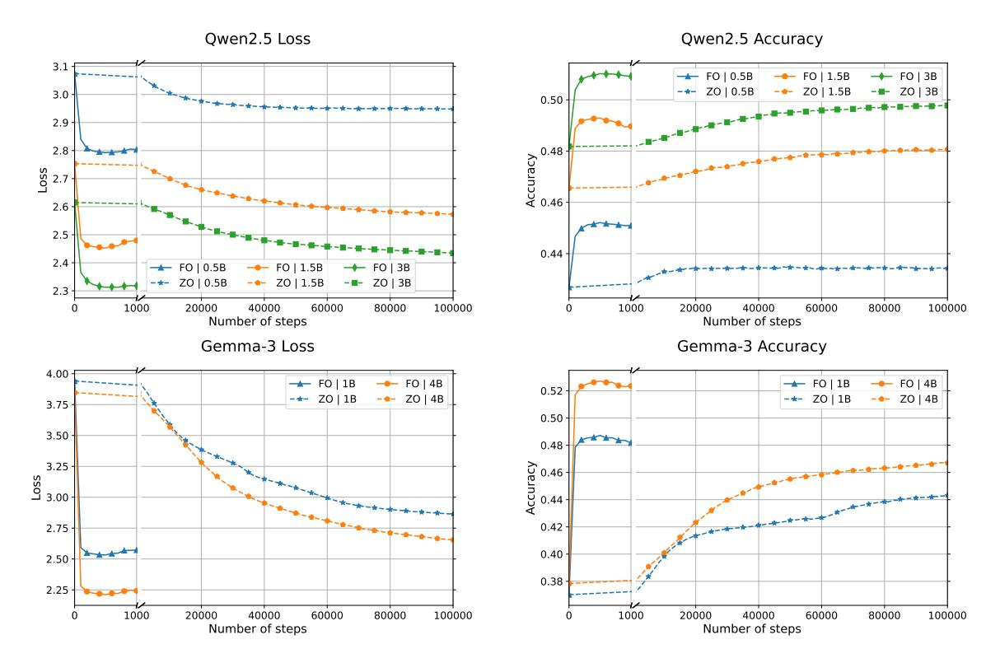
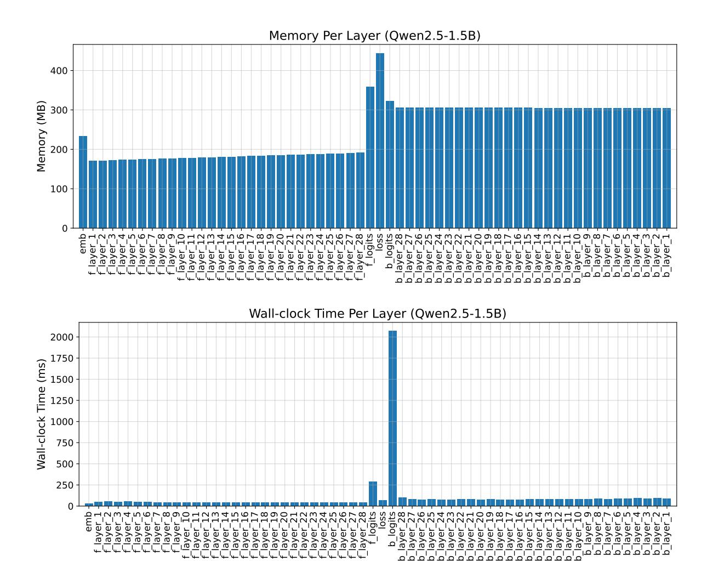
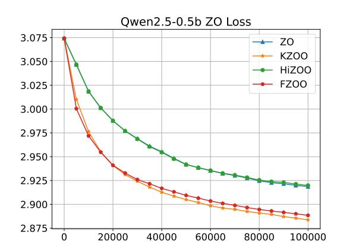
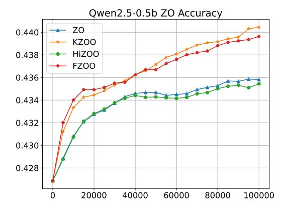

# Memory-Efficient Backpropagation for Fine-Tuning LLMs on Resource-Constrained Mobile Devices

Congzheng Song Apple csong4@apple.com

Xinyu Tang Apple xinyu\_tang3@apple.com

## Abstract

Fine-tuning large language models (LLMs) with backpropagation—even for a subset of parameters such as LoRA [\(Hu et al.,](#page-7-0) [2022\)](#page-7-0)—can be much more memory-consuming than inference and is often deemed impractical for resource-constrained mobile devices. Alternative methods, such as zeroth-order optimization (ZO), can greatly reduce the memory footprint but come at the cost of significantly slower model convergence (10× to 100× more steps than backpropagation). We propose a memoryefficient implementation of backpropagation (MeBP) on mobile devices that provides better trade-off between memory usage and compute time, while converging faster and achieving better performance than the ZO baseline. We verify the effectiveness of MeBP on an iPhone 15 Pro Max and show that various LLMs, ranging from 0.5B to 4B parameters, can be fine-tuned using less than 1GB of memory. We release an example of the MeBP implementation at <https://github.com/apple/ml-mebp>.

# 1 Introduction

Large language models (LLMs) have been successfully integrated into mobile devices to run inference on users' private data locally [\(Gunter et al.,](#page-7-1) [2024;](#page-7-1) [Gemini-Team et al.,](#page-7-2) [2025\)](#page-7-2). For applications such as personalization or federated learning [\(McMahan](#page-7-3) [et al.,](#page-7-3) [2017\)](#page-7-3), it is also desirable to fine-tune models on local private data on device to further improve utility [\(Kairouz et al.,](#page-7-4) [2021\)](#page-7-4). However, fine-tuning LLMs with backpropagation on mobile devices remains extremely challenging due to the significantly higher memory footprint compared to inference. These on-device training processes typically run in the background, which further limits memory usage due to operating system constraints [\(devel](#page-6-0)[oper.apple.com;](#page-6-0) [source.android.com\)](#page-8-0). In addition, total training compute time must be short to prevent the OS from interrupting or rescheduling the training process.

Existing works on memory-efficient on-device fine-tuning of LLMs have focused on approximating gradients with zeroth-order optimization (ZO) [\(Spall,](#page-8-1) [1992\)](#page-8-1), such as MeZO [\(Malladi et al.,](#page-7-5) [2023\)](#page-7-5), where the memory footprint is similar to vanilla inference, as no backpropagation is required. While ZO reduces memory usage in theory, ZO often suffers from slower and poorer convergence, leading to longer compute times and degraded model performance (Section [4\)](#page-3-0). Even with ZO, existing implementations require multiple gigabytes of memory to train a billion-scale LLM (e.g., OPT-1.3B [\(Zhang et al.,](#page-8-2) [2022\)](#page-8-2)), that is impractical for any production deployment [\(Peng et al.,](#page-7-6) [2024\)](#page-7-6).

In this work, we present a memory-efficient implementation of backpropagation (MeBP) for finetuning LLMs on mobile devices. The implementation is based on gradient checkpointing [\(Chen](#page-6-1) [et al.,](#page-6-1) [2016\)](#page-6-1), with various optimizations including lazy weight loading and decompression, as well as memory-mapped activation checkpoints. Our implementation ensures that no extra intermediate activations or uncompressed base model weights are kept in memory—they are only loaded when computation is needed. The total training memory footprint is thus reduced to that of backpropagation on a single checkpoint, which is feasible within the DRAM constraints of mobile devices.

We implement MeBP in iOS using Swift and evaluate its performance on an iPhone 15 Pro Max. We focus on the language modeling task and function calling task to compare MeBP with MeZO on a set of LLMs suitable for deployment on mobile devices, including Gemma3 [\(Gemma-Team et al.,](#page-7-7) [2025\)](#page-7-7) and Qwen2.5 [\(Qwen-Team et al.,](#page-7-8) [2025\)](#page-7-8). We demonstrate that MeBP converges faster and better than MeZO in terms of both the number of optimization steps and total compute wall-clock time. In addition, MeBP incurs only a slightly higher memory footprint than MeZO, making it more practical for on-device training.

### 2 Related Works

Memory efficient training. Training machine learning models incurs memory costs from model parameters, gradients, optimizer states, and intermediate values like activations. Each of these components offers opportunities for optimization to reduce memory usage during training. Prior works have proposed base model quantization [\(Dettmers](#page-6-2) [et al.,](#page-6-2) [2023\)](#page-6-2) and CPU offloading [\(Rajbhandari et al.,](#page-8-3) [2020\)](#page-8-3) to reduce the memory cost of model parameters. To reduce the memory cost of computing gradients, parameter-efficient fine-tuning (PEFT) methods such as LoRA [\(Hu et al.,](#page-7-0) [2022\)](#page-7-0) reduce trainable parameters to less than 1% of the total model parameters. These PEFT methods significantly lower gradient-related memory usage and achieve competitive performance compared to full model training for fine-tuning tasks. In-place weight updates with gradients during backpropagation—instead of updating model parameters after completing all backpropagation steps—can also reduce gradient memory cost [\(Lv et al.,](#page-7-9) [2024\)](#page-7-9). Prior works [\(Dettmers et al.,](#page-6-3) [2022;](#page-6-3) [Zhao et al.,](#page-8-4) [2024\)](#page-8-4) have also studied how to reduce the GPU memory cost for optimizer states such as AdamW [\(Kingma](#page-7-10) [and Ba,](#page-7-10) [2014\)](#page-7-10) under full-model training.

Reducing the memory cost of gradients, optimizer states, and intermediate activations can help narrow the memory usage gap between model training and vanilla model inference. Gradient checkpointing [\(Chen et al.,](#page-6-1) [2016\)](#page-6-1) significantly reduces the memory cost of intermediate activations by trading off memory usage for increased computation time through recomputation during backpropagation. [Malladi et al.](#page-7-5) [\(2023\)](#page-7-5) propose a memory-efficient version of zeroth-order optimization, MeZO, which estimates gradients via seeded random perturbations and therefore incurs only negligible additional memory cost compared to standard vanilla inference. However, zerothorder fine-tuning typically requires significantly more (10× to 100×) optimization steps than firstorder methods. Several follow-up works [\(Qin et al.,](#page-7-11) [2024;](#page-7-11) [Zhao et al.,](#page-8-5) [2025;](#page-8-5) [Dang et al.,](#page-6-4) [2025\)](#page-6-4) have been proposed to improve the convergence rate of MeZO.

On-device training. On-device training enables machine learning models to adapt to on-device data while preserving data privacy. [Lin et al.](#page-7-12) [\(2022\)](#page-7-12) fine-tuned a small convolutional neural network on tiny IoT devices with limited SRAM (e.g., 256KB) using quantization, PEFT methods, and systemalgorithm co-design. For language models with billions of parameters, PocketLLM [\(Peng et al.,](#page-7-6) [2024\)](#page-7-6) uses MeZO for on-device fine-tuning of LLMs, but it still incurs significant memory costs (6.5GB for OPT-1.3B [\(Zhang et al.,](#page-8-2) [2022\)](#page-8-2)), which is impractical for mobile devices.

# 3 Memory-Efficient Backpropagation

We focus on fine-tuning LLMs with LoRA [\(Hu](#page-7-0) [et al.,](#page-7-0) [2022\)](#page-7-0) in this paper. Therefore, the main memory bottlenecks lie in the model parameters and intermediate activations. Our goal is to keep the memory usage of fine-tuning within a reasonable range for a modern mobile device (e.g., less than 10% of the DRAM [\(Malladi et al.,](#page-7-13) [2012\)](#page-7-13) or less than 1GB, as suggested by PocketLLM [\(Peng](#page-7-6) [et al.,](#page-7-6) [2024\)](#page-7-6)).

There are three steps for fine-tuning LLMs with memory-efficient backpropagation (MeBP) on device: 1) compressing the model base weights (frozen parameters) to reduce disk space; 2) compiling the training graph with backpropagation and gradient checkpointing for memory optimization; and 3) implementing a memory-efficient runtime for executing the compiled training graph. We describe each step in detail below.

Base model weights compression. It is common practice to compress base model weights to reduce disk space usage when deploying LLMs on device. In our implementation, we use 4-bit symmetric mode INT4 quantization on non-LoRA parameters including the embeddings. We leave the investigation of more aggressive compression methods, such as 2-bit quantization-aware training [\(Liu et al.,](#page-7-14) [2025b\)](#page-7-14), to future work.

Gradient checkpointing compilation. To implement gradient checkpointing in MeBP, we begin by splitting the LLM into blocks where the memory of backpropagation on a single block (e.g. a transformer layer) is within the device memory constraints. For each block F producing activations to be checkpointed, we generate the backward graph by applying automatic differentiation [\(Bay](#page-6-5)[din et al.,](#page-6-5) [2018\)](#page-6-5) on the output of F. For example, let y = Fi(x, w) be the forward graph for block F<sup>i</sup> , for scalar s,

$$s = \sum (\frac{\partial E}{\partial y} \odot y)$$

#### <span id="page-2-2"></span>Algorithm 1 Memory-Efficient Backpropagation

**Inputs:** input data x, number of checkpoints n, forward checkpoint subgraphs [forward<sub>i</sub>], backward checkpoint subgraphs [backward<sub>i</sub>], LoRA trainable weights [lora\_weights<sub>i</sub>] for each checkpoints, compressed base model weights for each checkpoints [compressed\_base\_weights<sub>i</sub>]

```
procedure InitializeModel
    Memory map (mmap) all weights in [compressed_base_weights<sub>i</sub>]
end procedure
procedure LazyLoadAndDecompressWeights(i)
    Load mmaped compressed base weights, for checkpoint index i
    return decompress(compressed_base_model_weights<sub>i</sub>)
end procedure
{\bf procedure} Backpropagation(x)
    Initialize ckpts_storage \leftarrow \{x\}
    Load current LoRA trainable weights [lora_weights<sub>i</sub>]
    for each checkpoint index i \in [1, ..., n] do
                                                                                                > Forward pass to store all checkpoints
        Load base_weights_i \leftarrow LazyLoadAndDecompressWeights(i)
        Load mmaped ckpts_{i-1} from ckpts_storage
        Compute \mathsf{ckpts}_i \leftarrow \mathsf{forward}_i(\mathsf{lora\_weights}_i, \mathsf{base\_weights}_i, \mathsf{ckpts}_{i-1})
        Mmap ckpts<sub>i</sub> and add to ckpts_storage
    end for
    \textbf{Initialize lora\_grads} \leftarrow \emptyset, \texttt{ckpts\_grads}_{n+1} \leftarrow \texttt{nil}
    for each checkpoint index i \in [n, ..., 1] do
                                                                              ▶ Backward pass in reverse order to compute gradients
        Load \; \mathsf{base\_weights}_i \gets \mathsf{LazyLoadAndDecompressWeights}(i)
        Load mmaped ckpts_{i-1} from ckpts\_storage
        Compute (lora\_grads_i, ckpts\_grads_i) \leftarrow backward_i(lora\_weights_i, base\_weights_i, ckpts_{i-1}, ckpts\_grads_{i+1})
        Remove ckpts<sub>i</sub> from ckpts_storage
        Update lora_grads \leftarrow lora_grads \cup \{lora_grads_i\}
    end for
    return lora_grads
end procedure
```

where E denotes the final loss to be optimized and  $\odot$  denotes Hardmard product, we perform automatic differentiation on s:

$$\frac{\partial s}{\partial x} = \frac{\partial E}{\partial y} \cdot \frac{\partial y}{\partial x} = \frac{\partial E}{\partial x}$$

We can then produce a backward graph  $(\frac{\partial E}{\partial x}, \frac{\partial E}{\partial w}) = B_i(x, \frac{\partial E}{\partial y}, w)$  where  $\frac{\partial E}{\partial y}$  is outputted by the backward graph  $B_{i+1}$ . In other words, the inputs to the backward graphs are the checkpointed activations, gradients for the previous checkpoint and the corresponding trainable weights, and the outputs are the gradients of those inputs. The forward and backward graphs for all blocks are then serialized into a device runtime compatible format, e.g. Model Intermediate Language (MIL) representation or MLX exported function. During runtime, the serialized graphs will be described and compiled for computation.

**Runtime implementation.** Algorithm 1 outlines the runtime implementation of MeBP. The model is

first initialized using the InitializeModel function, after which the Backpropagation function is invoked for each data point in the training loop. During InitializeModel, the compressed base model weights are memory-mapped. To minimize memory footprint, the base model weights are not decompressed before the training loop begins. Instead, they are lazily decompressed and loaded on demand whenever required for computation. Note that for device runtime frameworks supporting computation with quantized weights, the decompression step can be skipped and only the compressed weights will be loaded on demand.

In the Backpropagation function, the forward compiled subgraphs are executed to store all necessary checkpoints, followed by the backward compiled subgraphs, which are executed in reverse order to compute the gradients using the stored checkpoints. The checkpoints are memory-mapped during the forward pass rather than kept in memory. Before each forward and backward pass, only the necessary base model weights are decompressed

<span id="page-2-0"></span>¹https://apple.github.io/coremltools/docsguides/source/model-intermediate-language.html

<span id="page-2-1"></span><sup>2</sup>https://ml-explore.github.io/mlx/build/html/ python/export.html

<span id="page-2-3"></span><sup>3</sup>https://ml-explore.github.io/mlx/build/html/ python/\_autosummary/mlx.core.quantized\_matmul. html

<span id="page-3-1"></span>

Figure 1: Convergence of Qwen2.5 (0.5B, 1.5B and 3B) and Gemma-3 (1B and 4B) fine-tuned with ZO and FO.

and loaded. As a result, the total memory usage is limited to the size of the required base model weights plus the peak memory usage for operations in each subgraph which is significantly less than the full size of the base model weights. The function describes gradient computation for a single data point. For batched inputs, gradient accumulation can be used to compute the gradient without increasing the memory footprint.

In MeBP, only a copy of the LoRA weights and their gradients is kept in memory for the optimizer. For LLMs ranging from 0.5B to 4B parameters, the size of the LoRA weights is typically in the range of dozens of megabytes, which is reasonable to store in memory. Optimizer states, such as momentum, can be memory-mapped and lazily loaded in a manner similar to the base model weights.

#### <span id="page-3-0"></span>4 Experiments

We consider MeZO as the baseline for demonstrating the performance of MeBP, as it is the only known optimization approach applied to LLM finetuning on mobile devices (Peng et al., 2024). We evaluate the utility of MeZO and MeBP through simulation on the server side and compare their performance on a mobile device, as detailed in the sections below.

#### <span id="page-3-2"></span>4.1 Utility Comparison

We compare the utility of first-order (FO) optimization (i.e., gradients via backpropagation) and zeroth-order (ZO) optimization on models in Gemma-3 and Qwen-2.5 with no more than 4B parameters, as mobile devices have constrained computing resources. For language modeling task, we use WikiText-2 dataset (Merity et al., 2017) and use loss and next token accuracy on the evaluation set for evaluation. For function calling task, we use ToolACE (Liu et al., 2025a) as the training set and Berkeley Function Calling (BFCL) (Patil et al., 2025) for evaluation. For simplicity, we consider single-turn task and we only use one userassistant turn from each sample in ToolACE. We use the single-turn live split in BFCL v4 because this live set is a user-contributed function documentation and queries and therefore more aligned with real-world scenarios. We use models before the instruction tuning for language model task and the instruction tuned model for function calling task. The sequence length is 256 for WikiText-2 and 512 for ToolACE. We ues 2, 048 samples as training set for WikiText-2 and 2,672 samples as training set for ToolACE. LoRA fine-tuning is applied to all linear layers in all transformer blocks, with a rank of 8. The total number of training steps is 1,000 for FO experiments and 100,000 for ZO experiments. These experiments are run on the server side as a simulation to compare utility only.

Results. Figure [1](#page-3-1) presents the results for WikiText-2. While the loss and next token accuracy for ZO exhibit a convergence trend, ZO converges significantly more slowly than FO. The FO method improves both metrics substantially within the first 100 steps, whereas ZO shows only a slight improvement after 1,000 steps. Even after 100,000 steps (i.e. 100× more optimization steps than FO), ZO still yields higher test loss and lower test accuracy than FO for the same model.

<span id="page-4-0"></span>

| Model     | FO     | ZO     | baseline |
|-----------|--------|--------|----------|
| Gemma3 1B | 33.01% | 15.10% | 11.92%   |

Table 1: Evaluation results on BFCLv4 live split for gemma-3-1b-it fine-tuned on ToolACE.

Table [1](#page-4-0) shows that fine-tuning on function calling data could improve the model function calling capability as both ZO and FO fine-tuned model achieve better performance than the no fine-tuned baseline (11.92%). However, similar to results in WikiText-2, even we use 100k steps for ZO and only 1k steps for FO, the improvements by FO is 7× compared to the improvement by ZO (21% vs 3%). We also run full parameter finetuning (FFT) on gemma-3-1b-it for the function calling and evaluate the fine-tuned model using the same evaluation setup. The FFT performance is 31.31%, that is not better than the LoRA fine-tuned result. This justifies our design choice with a focus on on-device fine-tuning LLMs with LoRA, as LoRA can achieve comparable performance as FFT on several tasks with less memory cost, that has been observed in previous works [\(Hu et al.,](#page-7-0) [2022\)](#page-7-0).

Several methods have been proposed to improve the convergence rate of ZO [\(Qin et al.,](#page-7-11) [2024;](#page-7-11) [Zhao](#page-8-5) [et al.,](#page-8-5) [2025;](#page-8-5) [Dang et al.,](#page-6-4) [2025\)](#page-6-4). We also ran experiments using these improved ZO methods on WikiText-2 using Qwen2.5-0.5B and summarize the results in Figure [3](#page-8-6) in Appendix [A.](#page-8-7) While these methods achieve faster convergence than vanilla ZO, the loss and next token accuracy remain worse than those of FO fine-tuned models. Moreover, these methods typically require more computation time per iteration due to additional forward passes needed for more accurate gradient estimation.

The utility results demonstrate that backpropagation converges significantly faster than ZO methods

for fine-tuning LLMs on language modeling tasks and function calling tasks, on a per-step basis. This makes it more suitable for mobile deployment in terms of compute time, provided that each FO optimization step is implemented efficiently.

### 4.2 Performance Comparison

Setup. We implement MeBP in iOS using Swift and evaluate its performance on an iPhone 15 Pro Max, which has 8GB of DRAM. For the MeZO baseline implementation, the forward graph is split into multiple subgraphs, and lazy decompression is applied to reduce the total memory usage of the base model weights. Each MeZO optimization step involves two forward passes. We set the batch size to 1 and the sequence length to 256. We checkpoint the model at every transformer layer, the final linear layer, and the cross-entropy loss layer. Memory usage is recorded using the iOS native function task\_vm\_info\_data\_t, which provides the peak memory footprint of the running process via phys\_footprint. We repeat the training process 10 times and report the average runtime and peak memory usage.

Results. Table [2](#page-5-0) summarizes the performance results. Overall, MeBP incurs 43% to 94% more computation time per gradient step compared to MeZO. However, given that MeZO requires more than 10× to 100× the number of steps compared to first-order optimization as shown in the previous utility comparison, MeBP converges much faster in terms of wall-clock time. MeBP uses up to 20% more memory than MeZO in the worst case, while the total memory usage for training is approximately 10× smaller than in previous mobile device implementations [\(Peng et al.,](#page-7-6) [2024\)](#page-7-6). All tested LLMs can be efficiently fine-tuned within 1GB of memory, making them suitable for background training on a mobile phone.

Decompression overhead. Table [3](#page-5-1) shows the decompression overhead for the forward and backward passes across different LLMs. Decompression accounts for 32% to 42% of the time in the forward pass, and 13% to 24% in the backward pass, as the backward pass involves additional operations for gradient computation. Although the overall compute time increases due to decompression in each pass, the memory savings are more significant as there is no need to store the uncompressed base model weights in memory, which range from 1 to 8GB for the LLMs evaluated.

<span id="page-5-0"></span>

|              |                       | Time (s) |       | Memory (MB) |         |
|--------------|-----------------------|----------|-------|-------------|---------|
| Model        | # of trainable params | MeZO     | MeBP  | MeZO        | MeBP    |
| Qwen2.5 0.5B | 4.39M                 | 2.68     | 3.85  | 318.93      | 320.17  |
| Qwen2.5 1.5B | 9.23M                 | 5.47     | 9.09  | 451.57      | 460.24  |
| Qwen2.5 3B   | 14.97M                | 10.28    | 17.96 | 554.10      | 661.78  |
| Gemma3 1B    | 6.52M                 | 4.88     | 9.48  | 563.64      | 569.00  |
| Gemma3 4B    | 14.90M                | 16.86    | 28.58 | 961.54      | 1029.49 |

Table 2: Per-gradient-step compute time and peak memory of MeZO and MeBP.

<span id="page-5-1"></span>

| Model        | Forward | Backward |
|--------------|---------|----------|
| Qwen2.5 0.5B | 34.91%  | 15.80%   |
| Qwen2.5 1.5B | 32.77%  | 17.86%   |
| Qwen2.5 3B   | 36.15%  | 21.15%   |
| Gemma3 1B    | 32.37%  | 13.27%   |
| Gemma3 4B    | 42.87%  | 24.18%   |

Table 3: Ratio of decompression time during each forward and backward pass.

Impact of sequence lengths. Sequence length can also impact performance metrics. We experiment with Qwen2.5 1.5B using sequence lengths of 128, 256, 512, and 1024, and summarize the results in Table [4.](#page-5-2) As sequence length increases, both compute time and memory footprint also increase due to the heavier computation workload. This suggests that data sources with shorter sequences, such as messages, brief emails, and user instruction prompts, are more suitable for fine-tuning on mobile devices. We leave the investigation of efficient fine-tuning on longer sequences on mobile devices to future work.

<span id="page-5-2"></span>

| Sequence | Time (s) |       | Memory (MB) |        |  |
|----------|----------|-------|-------------|--------|--|
| length   | MeZO     | MeBP  | MeZO        | MeBP   |  |
| 128      | 4.81     | 6.92  | 367.49      | 405.14 |  |
| 256      | 5.47     | 9.09  | 451.57      | 460.24 |  |
| 512      | 9.61     | 17.14 | 617.82      | 624.62 |  |
| 1024     | 18.18    | 34.40 | 986.00      | 994.09 |  |

Table 4: Impact of sequence length.

Per layer performance. Figure [2](#page-6-6) reports the per-layer(-checkpoint) performance metrics on Qwen2.5-1.5B. For the transformer layers, the backward pass uses approximately 50% more memory and is 30% slower than the corresponding forward pass. The memory bottleneck occurs at

the final linear layer and the loss layer, consistent with observations in previous work [\(Wijmans et al.,](#page-8-8) [2025\)](#page-8-8). The compute time bottleneck is also at the final linear layer, where computing the logits and their gradients involves matrix multiplication between two very large matrices (the embeddings and the sequence logits). Both the compute time and memory footprint of the loss function and final linear layer can potentially be optimized using fused kernels [\(Wijmans et al.,](#page-8-8) [2025\)](#page-8-8) or techniques such as sampled softmax [\(Jean et al.,](#page-7-18) [2015\)](#page-7-18). Another promising direction is hardware-specific implementation, such as the 1.58-bit LLM [\(Ma et al.,](#page-7-19) [2024\)](#page-7-19), which replaces floating-point addition and multiplication with integer addition. We leave the exploration of these techniques to future work.

For fine-tuning non-generative tasks, where the final layer does not involve heavy matrix multiplication, both compute time and memory footprint can be further reduced, shifting the bottleneck to the transformer layers instead.

### 5 Conclusion

We propose MeBP, a memory-efficient backpropagation method for fine-tuning LoRA adapters of LLMs on device. Built on gradient checkpointing, MeBP incorporates memory optimizations such as lazy weight decompression and memorymapped activations to enable exact gradient computation with better memory–compute trade-offs. Compared to ZO methods, MeBP achieves significantly faster convergence and better model utility, while maintaining a memory footprint comparable to MeZO on mobile devices. We validate MeBP on LLMs suitable for on-device deployment, demonstrating the feasibility of practical first-order finetuning of LLMs under tight memory constraints.

<span id="page-6-6"></span>

Figure 2: Per-layer memory footprint and wall-clock time. On the x-axis, emb stands for the embedding layer; layer name starts with f stands for forward and b for backward.

#### Limitations

Due to limited device availability, MeBP has only been verified on iOS using an iPhone 15 Pro Max. It requires the capabilities of the A17 Pro chip or newer. Performance metrics may vary on other mobile operating systems or hardware configurations.

For language modeling tasks, MeBP encounters a bottleneck at the final layer due to a large matrix multiplication, resulting in increased training time. Additionally, the current implementation does not scale well with sequence length, limiting its applicability to data types that inherently involve shorter inputs.

#### References

<span id="page-6-5"></span>Atilim Gunes Baydin, Barak A. Pearlmutter, Alexey Andreyevich Radul, and Jeffrey Mark Siskind. 2018. Automatic differentiation in machine learning: a

survey. *Journal of Machine Learning Research*, 18(153):1–43.

<span id="page-6-1"></span>Tianqi Chen, Bing Xu, Chiyuan Zhang, and Carlos Guestrin. 2016. Training deep nets with sublinear memory cost. *arXiv preprint arXiv:1604.06174*.

<span id="page-6-4"></span>Sizhe Dang, Yangyang Guo, Yanjun Zhao, Haishan Ye, Xiaodong Zheng, Guang Dai, and Ivor Tsang. 2025. Fzoo: Fast zeroth-order optimizer for finetuning large language models towards adam-scale speed. *arXiv preprint arXiv:2506.09034*.

<span id="page-6-3"></span>Tim Dettmers, Mike Lewis, Sam Shleifer, and Luke Zettlemoyer. 2022. 8-bit optimizers via block-wise quantization. In *International Conference on Learning Representations*.

<span id="page-6-2"></span>Tim Dettmers, Artidoro Pagnoni, Ari Holtzman, and Luke Zettlemoyer. 2023. QLoRA: Efficient finetuning of quantized LLMs. In *Thirty-seventh Conference on Neural Information Processing Systems*.

<span id="page-6-0"></span>developer.apple.com. Identifying high-memory use with jetsam event reports. https:

- [//developer.apple.com/documentation/](https://developer.apple.com/documentation/xcode/identifying-high-memory-use-with-jetsam-event-reports) [xcode/identifying-high-memory-use-with](https://developer.apple.com/documentation/xcode/identifying-high-memory-use-with-jetsam-event-reports)[jetsam-event-reports](https://developer.apple.com/documentation/xcode/identifying-high-memory-use-with-jetsam-event-reports). Accessed: 2025-07-01.
- <span id="page-7-2"></span>Gemini-Team, Rohan Anil, Sebastian Borgeaud, Jean-Baptiste Alayrac, Jiahui Yu, Radu Soricut, Johan Schalkwyk, Andrew M. Dai, Anja Hauth, Katie Millican, David Silver, Melvin Johnson, Ioannis Antonoglou, Julian Schrittwieser, Amelia Glaese, Jilin Chen, Emily Pitler, Timothy Lillicrap, Angeliki Lazaridou, and 1332 others. 2025. Gemini: A family of highly capable multimodal models.
- <span id="page-7-7"></span>Gemma-Team, Aishwarya Kamath, Johan Ferret, Shreya Pathak, Nino Vieillard, Ramona Merhej, Sarah Perrin, Tatiana Matejovicova, Alexandre Ramé, Morgane Rivière, Louis Rouillard, Thomas Mesnard, Geoffrey Cideron, Jean bastien Grill, Sabela Ramos, Edouard Yvinec, Michelle Casbon, Etienne Pot, Ivo Penchev, and 197 others. 2025. Gemma 3 technical report. *arXiv preprint arXiv:2503.19786*.
- <span id="page-7-1"></span>Tom Gunter, Zirui Wang, Chong Wang, Ruoming Pang, Andy Narayanan, Aonan Zhang, Bowen Zhang, Chen Chen, Chung-Cheng Chiu, David Qiu, and 1 others. 2024. Apple intelligence foundation language models. *arXiv preprint arXiv:2407.21075*.
- <span id="page-7-0"></span>Edward J Hu, yelong shen, Phillip Wallis, Zeyuan Allen-Zhu, Yuanzhi Li, Shean Wang, Lu Wang, and Weizhu Chen. 2022. LoRA: Low-rank adaptation of large language models. In *International Conference on Learning Representations*.
- <span id="page-7-18"></span>Sébastien Jean, Kyunghyun Cho, Roland Memisevic, and Yoshua Bengio. 2015. [On using very large tar](https://doi.org/10.3115/v1/P15-1001)[get vocabulary for neural machine translation.](https://doi.org/10.3115/v1/P15-1001) In *Proceedings of the 53rd Annual Meeting of the Association for Computational Linguistics and the 7th International Joint Conference on Natural Language Processing (Volume 1: Long Papers)*, pages 1–10.
- <span id="page-7-4"></span>Peter Kairouz, H Brendan McMahan, Brendan Avent, Aurélien Bellet, Mehdi Bennis, Arjun Nitin Bhagoji, Kallista Bonawitz, Zachary Charles, Graham Cormode, Rachel Cummings, and 1 others. 2021. Advances and open problems in federated learning. *Foundations and trends® in machine learning*, 14(1– 2):1–210.
- <span id="page-7-10"></span>Diederik P Kingma and Jimmy Ba. 2014. Adam: A method for stochastic optimization. *arXiv preprint arXiv:1412.6980*.
- <span id="page-7-12"></span>Ji Lin, Ligeng Zhu, Wei-Ming Chen, Wei-Chen Wang, Chuang Gan, and Song Han. 2022. On-device training under 256kb memory. In *Annual Conference on Neural Information Processing Systems (NeurIPS)*.
- <span id="page-7-16"></span>Weiwen Liu, Xu Huang, Xingshan Zeng, xinlong hao, Shuai Yu, Dexun Li, Shuai Wang, Weinan Gan, Zhengying Liu, Yuanqing Yu, Zezhong WANG, Yuxian Wang, Wu Ning, Yutai Hou, Bin Wang, Chuhan Wu, Wang Xinzhi, Yong Liu, Yasheng Wang, and 8 others. 2025a. ToolACE: Winning the points of LLM function calling. In *The Thirteenth International Conference on Learning Representations*.

- <span id="page-7-14"></span>Zechun Liu, Changsheng Zhao, Hanxian Huang, Sijia Chen, Jing Zhang, Jiawei Zhao, Scott Roy, Lisa Jin, Yunyang Xiong, Yangyang Shi, and 1 others. 2025b. Paretoq: Scaling laws in extremely low-bit llm quantization. *arXiv preprint arXiv:2502.02631*.
- <span id="page-7-9"></span>Kai Lv, Yuqing Yang, Tengxiao Liu, Qipeng Guo, and Xipeng Qiu. 2024. [Full parameter fine-tuning for](https://doi.org/10.18653/v1/2024.acl-long.445) [large language models with limited resources.](https://doi.org/10.18653/v1/2024.acl-long.445) In *Proceedings of the 62nd Annual Meeting of the Association for Computational Linguistics (Volume 1: Long Papers)*, pages 8187–8198. Association for Computational Linguistics.
- <span id="page-7-19"></span>Shuming Ma, Hongyu Wang, Lingxiao Ma, Lei Wang, Wenhui Wang, Shaohan Huang, Li Dong, Ruiping Wang, Jilong Xue, and Furu Wei. 2024. The era of 1-bit llms: All large language models are in 1.58 bits. *arXiv preprint arXiv:2402.17764*.
- <span id="page-7-13"></span>Krishna T. Malladi, Frank A. Nothaft, Karthika Periyathambi, Benjamin C. Lee, Christos Kozyrakis, and Mark Horowitz. 2012. [Towards energy-proportional](https://doi.org/10.1109/ISCA.2012.6237004) [datacenter memory with mobile dram.](https://doi.org/10.1109/ISCA.2012.6237004) In *2012 39th Annual International Symposium on Computer Architecture (ISCA)*, pages 37–48.
- <span id="page-7-5"></span>Sadhika Malladi, Tianyu Gao, Eshaan Nichani, Alex Damian, Jason D. Lee, Danqi Chen, and Sanjeev Arora. 2023. Fine-tuning language models with just forward passes. In *Advances in Neural Information Processing Systems*.
- <span id="page-7-3"></span>Brendan McMahan, Eider Moore, Daniel Ramage, Seth Hampson, and Blaise Aguera y Arcas. 2017. Communication-efficient learning of deep networks from decentralized data. In *Artificial intelligence and statistics*, pages 1273–1282. PMLR.
- <span id="page-7-15"></span>Stephen Merity, Caiming Xiong, James Bradbury, and Richard Socher. 2017. [Pointer sentinel mixture mod](https://openreview.net/forum?id=Byj72udxe)[els.](https://openreview.net/forum?id=Byj72udxe) In *International Conference on Learning Representations*.
- <span id="page-7-17"></span>Shishir G. Patil, Huanzhi Mao, Charlie Cheng-Jie Ji, Fanjia Yan, Vishnu Suresh, Ion Stoica, and Joseph E. Gonzalez. 2025. The berkeley function calling leaderboard (bfcl): From tool use to agentic evaluation of large language models. In *Forty-second International Conference on Machine Learning*.
- <span id="page-7-6"></span>Dan Peng, Zhihui Fu, and Jun Wang. 2024. Pocketllm: Enabling on-device fine-tuning for personalized llms. *arXiv preprint arXiv:2407.01031*.
- <span id="page-7-11"></span>Zhen Qin, Daoyuan Chen, Bingchen Qian, Bolin Ding, Yaliang Li, and Shuiguang Deng. 2024. [Federated](https://openreview.net/forum?id=cit0hg4sEz) [full-parameter tuning of billion-sized language mod](https://openreview.net/forum?id=cit0hg4sEz)[els with communication cost under 18 kilobytes.](https://openreview.net/forum?id=cit0hg4sEz) In *Forty-first International Conference on Machine Learning*.
- <span id="page-7-8"></span>Qwen-Team, An Yang, Baosong Yang, Beichen Zhang, Binyuan Hui, Bo Zheng, Bowen Yu, Chengyuan Li, Dayiheng Liu, Fei Huang, Haoran Wei, Huan Lin, Jian Yang, Jianhong Tu, Jianwei Zhang, Jianxin Yang,

Jiaxi Yang, Jingren Zhou, Junyang Lin, and 24 others. 2025. Qwen2.5 technical report. *arXiv preprint arXiv:2412.15115*.

<span id="page-8-3"></span>Samyam Rajbhandari, Jeff Rasley, Olatunji Ruwase, and Yuxiong He. 2020. Zero: memory optimizations toward training trillion parameter models. In *Proceedings of the International Conference for High Performance Computing, Networking, Storage and Analysis*, SC '20. IEEE Press.

<span id="page-8-0"></span>source.android.com. Low memory killer daemon. [https://source.android.com/docs/core/](https://source.android.com/docs/core/perf/lmkd) [perf/lmkd](https://source.android.com/docs/core/perf/lmkd). Accessed: 2025-07-01.

<span id="page-8-1"></span>James C. Spall. 1992. Multivariate stochastic approximation using a simultaneous perturbation gradient approximation. *IEEE Transactions on Automatic Control*, 37:332–341.

<span id="page-8-8"></span>Erik Wijmans, Brody Huval, Alexander Hertzberg, Vladlen Koltun, and Philipp Kraehenbuehl. 2025. [Cut your losses in large-vocabulary language mod](https://openreview.net/forum?id=E4Fk3YuG56)[els.](https://openreview.net/forum?id=E4Fk3YuG56) In *The Thirteenth International Conference on Learning Representations*.

<span id="page-8-2"></span>Susan Zhang, Stephen Roller, Naman Goyal, Mikel Artetxe, Moya Chen, Shuohui Chen, Christopher Dewan, Mona Diab, Xian Li, Xi Victoria Lin, and 1 others. 2022. Opt: Open pre-trained transformer language models. *arXiv preprint arXiv:2205.01068*.

<span id="page-8-4"></span>Jiawei Zhao, Zhenyu Zhang, Beidi Chen, Zhangyang Wang, Anima Anandkumar, and Yuandong Tian. 2024. Galore: Memory-efficient LLM training by gradient low-rank projection. In *Forty-first International Conference on Machine Learning*.

<span id="page-8-5"></span>Yanjun Zhao, Sizhe Dang, Haishan Ye, Guang Dai, Yi Qian, and Ivor Tsang. 2025. [Second-order fine](https://openreview.net/forum?id=bEqI61iBue)[tuning without pain for LLMs: A hessian informed](https://openreview.net/forum?id=bEqI61iBue) [zeroth-order optimizer.](https://openreview.net/forum?id=bEqI61iBue) In *The Thirteenth International Conference on Learning Representations*.

<span id="page-8-6"></span>



Figure 3: The performance of improved ZO methods (ZO [\(Malladi et al.,](#page-7-5) [2023\)](#page-7-5), KZOO [\(Qin et al.,](#page-7-11) [2024\)](#page-7-11), HiZOO [\(Zhao et al.,](#page-8-5) [2025\)](#page-8-5), FZOO [\(Dang et al.,](#page-6-4) [2025\)](#page-6-4)).

### <span id="page-8-7"></span>A Improved ZO Methods

For improved ZO methods, [Qin et al.](#page-7-11) [\(2024\)](#page-7-11) use more than one seed per iteration to provide better gradient estimation (KZOO). [Zhao et al.](#page-8-5) [\(2025\)](#page-8-5) leverage second-order information via the Hessian matrix (HiZOO), while [Dang et al.](#page-6-4) [\(2025\)](#page-6-4) use more gradient estimations per iteration, with each estimation requiring only one forward pass rather than two (FZOO). For fair comparison, we consider 4 gradient estimations per iteration for KZOO and 8 for FZOO. Both of them use 8 forward passes per iteration. For HiZOO, we follow the same setting as [Malladi et al.](#page-7-5) [\(2023\)](#page-7-5), using 1 gradient estimation (i.e., two forward passes). All other experimental settings are the same as those described in Section [4.1.](#page-3-2) We present the results in Figure [3.](#page-8-6) While these methods improve the convergence rate compared to vanilla ZO, they still exhibit a much slower convergence trend than the first-order (FO) method shown in Figure [1.](#page-3-1)