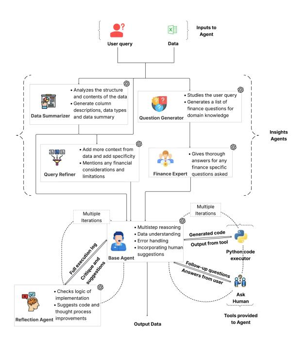
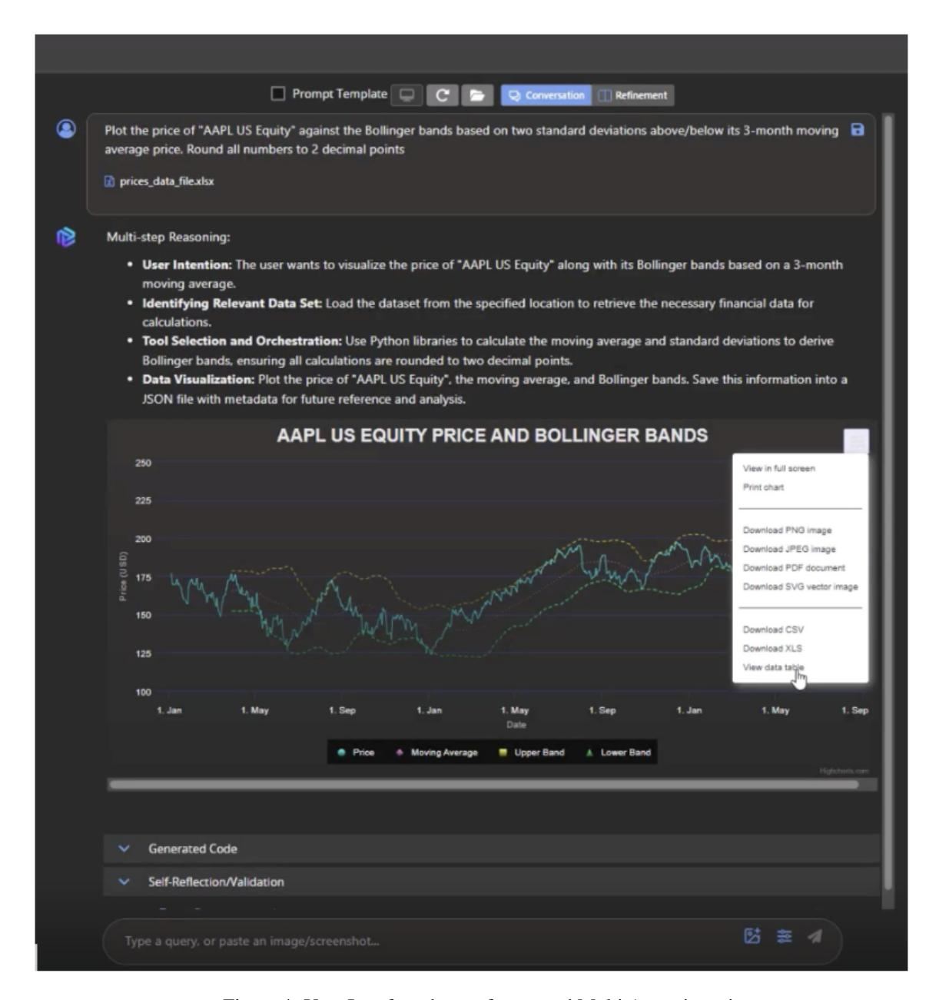
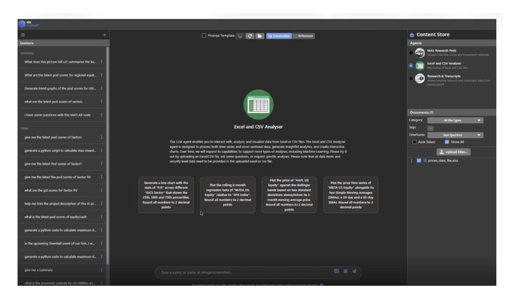

# A Multi-Agent Framework for Quantitative Finance : An Application to Portfolio Management Analytics

Sayani Kundu1 , Dushyant Sahoo1 , Victor Li2 , Jennifer Rabowsky2 , Amit Varshney1

1 JPMorgan Machine Learning Center of Excellence, 2 JPMorgan Asset and Wealth Management Correspondence: <amit.varshney@jpmchase.com>

## Abstract

Machine learning and artificial intelligence have been used widely within quantitative finance. However there is a scarcity of AI frameworks capable of autonomously performing complex tasks and quantitative analysis on structured data. This paper introduces a novel Multi-Agent framework tailored for such tasks which are routinely performed by portfolio managers and researchers within the asset management industry. Our framework facilitates mathematical modeling and data analytics by dynamically generating executable code. The framework's innovative multi-agent architecture includes specialized components and agents for reflection, summarization, and financial expertise which coordinate to enhance problem solving abilities. We present a comprehensive empirical evaluation on portfolio management-specific tasks, addressing a critical gap in current research. Our findings reveal that the proposed Multi-Agent framework vastly outperforms Single-Agent frameworks, demonstrating its practical utility across various task categories. By using dynamic code generation with the agent's multi-step reasoning capabilities, we broaden the range of tasks that can be successfully addressed.

### 1 Introduction

The rapid advancements in machine learning and artificial intelligence have significantly transformed the field of quantitative finance, particularly in portfolio management. Machine learning techniques have been successfully applied to various aspects such as alpha signal generation [\(Ma et al.,](#page-7-0) [2021\)](#page-7-0), portfolio construction [\(Jaeger et al.,](#page-7-1) [2021\)](#page-7-1), and factor modeling [\(Giglio et al.,](#page-7-2) [2022\)](#page-7-2), among others. Building on these foundations, recent developments in Large Language Models (LLMs) have opened up promising new avenues by enhancing reasoning and inference capabilities across diverse data and information sources. This paper introduces a multi-agent framework that integrates these

advancements, enabling the execution of complex quantitative tasks relevant to portfolio management and research, including statistical analysis, portfolio modeling, backtesting, and scenario analysis. By leveraging LLMs, the framework comprises a network of specialized agents that collaborate to perform tasks efficiently. The mathematical modeling and data analytics required for these tasks are facilitated by the generation of executable code by the model. Our framework addresses key challenges in financial modeling, such as domain understanding, logical code generation, and finance-specific query interpretation. Through instruction-based fine-tuning, we demonstrate the framework's ability to surpass standard LLM models and provide human-readable explanations for its predictions, thereby bridging the gap between machine learning advancements and practical applications in quantitative finance.

LLM agents have demonstrated remarkable success in areas such as summarization, where they distill complex information into concise and coherent narratives; code generation, where they produce executable scripts to automate analytical processes; and sentiment analysis, where they evaluate textual data to gauge public opinion and market sentiment, highlighting their potential to enhance efficiency and accuracy across various domains [\(Guo et al.,](#page-7-3) [2024\)](#page-7-3). Despite these successes, the deployment of LLM-powered data analysis tools in real-world scenarios has exposed several reliability issues, including hallucinations [\(Martino et al.,](#page-7-4) [2023;](#page-7-4) [Liu et al.,](#page-7-5) [2024\)](#page-7-5), subtle bugs [\(Wu et al.,](#page-8-0) [2024;](#page-8-0) [Yang et al.,](#page-8-1) [2021\)](#page-8-1), and a disconnect between the LLM's understanding of tasks and the user's under-articulated intents [\(Li et al.,](#page-7-6) [2024;](#page-7-6) [Wang et al.,](#page-8-2) [2018\)](#page-8-2). These shortcomings necessitate human oversight to verify and correct the data analysis process [\(Chopra](#page-7-7) [et al.,](#page-7-7) [2023;](#page-7-7) [Gu et al.,](#page-7-8) [2024;](#page-7-8) [Olausson et al.,](#page-7-9) [2024\)](#page-7-9). Although some approaches have attempted to use self-reflection to improve the reliability of code

| Issue Type                       | Detailed Behaviors of an LLM Agent                                        |
|----------------------------------|---------------------------------------------------------------------------|
| Incomplete workflow              | Misses some important steps, e.g., not excluding missing values when      |
|                                  | computing statistical quantities such as means                            |
| Wrong columns                    | Selects the wrong column(s)                                               |
| Incorrect portfolio calculations | Does not consider cash in the portfolio                                   |
| Incorrect financial ratios calcu | Miscalculates financial ratios such as P/E ratio due to incorrect formula |
| lation                           | application or data misinterpretation.                                    |
| Misinterpretation of financial   | Fails to accurately interpret balance sheets, or cash flow statements     |
| statements                       |                                                                           |

Table 1: Common issues in the code generated by OpenAI's GPT-4o for data analysis tasks.

generation, our findings indicate that this is not a comprehensive solution. Current models struggle to provide accurate and useful feedback on code errors, often resulting in tools that present raw data analysis code. This shifts the user's focus to lowlevel details rather than the overarching data analysis process [\(Olausson et al.,](#page-7-9) [2024\)](#page-7-9). Interviews with ChatGPT users reveal that individuals, especially those with limited coding skills, find it difficult to thoroughly review the code produced by LLMs, leading to undetected errors and potentially incorrect results. Additionally, rectifying code through conversation can become a cumbersome exchange, adding to inefficiency and frustration.

In particular, the performance of LLMs in portfolio and asset management analytics has not met expectations. Our initial research question was straightforward: how accurately do state-of-the-art LLMs comprehend basic analytical tasks common in investing, which are routinely performed by portfolio managers? To investigate this, we developed a benchmark consisting of 100 questions that a portfolio manager might pose to an analyst, expecting quick and accurate responses. Examples include inquiries like "get the return or Sharpe ratio", "the total value of those acquisitions", and "the number of targets headquartered in a specific country". We then tasked a mainstream LLM, OpenAI's GPT-4o [\(OpenAI,](#page-7-10) [2024\)](#page-7-10), with answering these questions.

The results revealed that while the answers were often partially correct, the overall accuracy was surprisingly low, with LLM not being able to answer more than 60 percent of the questions correctly. This poor performance was not due to a lack of access to necessary information, but rather the LLMs' inability to correctly process and reason with this information. Furthermore, LLMs frequently struggled with the nuances of financial modeling, such as distinguishing between business days and cal-

endar days, handling missing or sparse data, and performing portfolio analytics. As illustrated in Table [1,](#page-1-0) common issues in the code generated by GPT-4o for data analysis tasks include incomplete workflows, wrong column selections, unreasonable portfolio calculations, incorrect financial metrics calculation, and misinterpretation of financial statements. To address these challenges, our framework employs multiple agents to enable reasoning and provide explainable insights into financial decisionmaking processes, thereby enhancing the reliability and accuracy of LLM-powered tools in quantitative finance.

Our contributions are multifold:

- We present innovative multi-agent framework for quantitative portfolio management tasks.
- We provide an empirical evaluation on portfolio management specific tasks, filling a critical gap in current research.
- We analyze the success rate of LLM across different task categories, offering insights into their practical utility in portfolio management.
- We highlight the challenges and limitations of LLMs in this domain, providing a foundation for future improvements and research.

## 2 Related Work

In the realm of quantitative finance, code generation using Large Language Models (LLMs) has emerged as a powerful tool, facilitating the automation of complex modeling and data analytics tasks and enhancing decision-making processes [\(Nie et al.,](#page-7-11) [2024\)](#page-7-11). Recent studies have explored the use of LLMs for generating code that evaluates the semantic correctness of machine-generated outputs, exemplified by frameworks like CODE-JUDGE [\(Tong and Zhang,](#page-8-3) [2024\)](#page-8-3). These models

employ "slow thinking" techniques to conduct indepth analyses and provide reliable evaluations without relying on test cases. Additionally, agentic frameworks have been utilized to bolster reasoning capabilities in financial question answering, as demonstrated by the use of critic agents to refine and improve the accuracy of responses [\(Fatemi and](#page-7-12) [Hu,](#page-7-12) [2024\)](#page-7-12). These approaches underscore the potential of LLMs in managing complex financial tasks, laying the groundwork for developing more robust and interpretable financial analytics solutions.

Among proprietary models, Codex is arguably the most widely deployed, integrated within GitHub Copilot [\(Chen et al.,](#page-7-13) [2021\)](#page-7-13). Open-source alternatives like CodeBert [\(Feng et al.,](#page-7-14) [2020\)](#page-7-14) and PolyCoder [\(Xu et al.,](#page-8-4) [2022\)](#page-8-4) exist, though their functional correctness in code completion tasks is notably lower compared to Codex. To assess the functional correctness of code generation, [\(Chen](#page-7-13) [et al.,](#page-7-13) [2021\)](#page-7-13) introduced the HumanEval framework, which includes a Python dataset of hand-written programming problems and unit tests. Generated code is deemed correct when it passes the associated unit tests, with the fraction of passed samples reported as a quantitative measure.

Our paper builds upon these foundations, addressing the limitations observed in LLM performance for portfolio management analytics and highlighting the necessity for human oversight and improved interpretability in financial decisionmaking processes.

### 3 Methodology

In this paper, we introduce a novel multi-agent framework designed to enhance and automate portfolio management analytics by leveraging the capabilities of Large Language Models (LLMs). This framework addresses key challenges in financial modeling, such as data integration, risk assessment, and decision-making transparency.

Our Multi-Agent framework consists of a structured combination of multiple LLM-powered agents, each assigned a specific task. The user provides the Multi-Agent with a data file and a query to be answered in relation to the data. The core agent responsible for solving the problem is the Base-Agent, a ReAct agent [\(Yao et al.,](#page-8-5) [2023\)](#page-8-5), which serves as the decision-making hub, evaluating aggregated data to determine the appropriate course of action. Equipped with a Python code execution tool, the Base-Agent generates relevant

Figure 1: High-level schematic pipeline of Multi Agent

Python code to obtain the final answer to the user query. The tool receives this generated code and returns back the output of the code execution to the Base Agent. If there is an error encountered during execution, the error message will be returned to the agent. Depending on the tool's output, the agent can choose to continue the analysis with additional code generation, fix buggy code and retry, interrupt the process for human oversight via the Ask Human option, or conclude the process if the analysis is complete. The Ask Human tool offers an additional layer of validation, allowing human intervention to review and correct the analysis, ensuring reliability and accuracy. The Base-Agent can call the Ask Human tool to request clarification or feedback from the user in cases such as missing input files, absent columns, or other incomplete queries. This step is crucial in addressing the limitations observed in LLM performance for portfolio management analytics, where processing and reasoning with information have been a significant challenge.

Ahead of the Base-Agent's execution, we incorporate key components to enhance the information it receives. These components are the Data Summarizer, Question Generator, Finance Expert, and Query Refiner, collectively known as "Insights" Agents. Each plays a crucial role in processing and refining input data to ensure accurate and relevant outputs. The Question Generator and Finance

Expert work together to produce a compact and precise domain-specific knowledge base, identifying relevant financial definitions, formulae, and information needed by the Base-Agent. The Question Generator takes the user query as input and decides the most relevant financial definitions, formulae and information that the Base-Agent would need to answer the user query. The output from this Question Generator is a list of questions which then goes to the Finance Expert. This is turn answers these questions, including all important information, ensuring alignment with financial principles and practices. The two components generate the questions and answer them respectively to add context for the Base-Agent. The Data Summarizer analyzes the uploaded data file, deriving patterns and condensing large volumes of financial data into concise summaries, adding missing values and column definitions as needed. It operates similarly to the Base-Agent, with access to a Python code execution tool for inspecting the data file and drawing insights. The Query Refiner agent not only takes the user query as input but also utilizes the output of the Data Summarizer to generate a better quality query for the Base-Agent. It rephrases the original user query, enhancing clarity and focus, incorporating data-specific jargon, and adding disclaimers and recommendations. It produces an improved user query for the Base-Agent to answer. Appendix [A.1](#page-9-0) offers a detailed illustration of this process through a specific example. All the outputs from these agents are consolidated together to form a comprehensive user query with detailed information about data and domain. This is then sent to the Base Agent to answer the query using code generation.

Each of Insights components were introduced to improve the multi-agent's problem-solving capabilities. They were added to address the different categories of issues that were identified in the development set. The Data Summarizer, among other issues, helps to identify missing values in the data which can often be overlooked by the Base Agent because it only investigates the starting rows of a dataset before proceeding with any calculations. The input from the Data Summarizer helps the Base Agent be aware of the missing values and handle it in an appropriate manner. The Query Refiner adds value to our Agent when it encounters real-life, informally written queries from Portfolio Managers. Often PMs will not write complete and correct queries but write in a language that is more infor-

mal or colloquial. As an example, let's consider a dataset from a global trading organization that has Profit and Loss amounts and the corresponding trading desk and the desk's geographical region. A question from the user could be "what is the pnl from corporates na?". This question has no capitalization or explanation of the abbreviations. If this question is asked to the Base Agent it may try to find the total Profit and Loss (pnl) for a sector/desk called "corporates na" (which it may not find in the data), or it will ignore the word "corporates" and may try to find any row where the region is North America (na). However, the Query Refiner looks at the data summary and reconstructs the user query such that any ambiguity is removed. It will refine the query to be something like - "What is the total profit and loss of the Corporates desk in the Americas region?". This will allow the Base Agent to extract the correct rows and columns for the calculation. Similarly, the Question Generator and Finance Expert (acting as one component) improve performance when the user query involves complex and nuanced financial knowledge. The example presented in appendix [A.3](#page-9-1) about the "spot-prompt correlation" is an example where this component adds value. It was our observation that when financial knowledge was not separately added, the Base Agent tends to solve the problem incorrectly. Overall, the idea was to add components that are crucial in Portfolio analytics and management usecase – data interpretation, clarity of problem and financial knowledge. The selection of the Insights components was also influenced by the explainability and user experience on the UI for portfolio managers to not only get a solution to the problem but also be able to see a breakdown of reasoning of their choice.

Our framework also includes a Reflection Agent, which significantly enhances the robustness and accuracy of the Base-Agent's outputs. This agent iteratively validates and critiques the solutions generated, identifying potential errors or omissions and suggesting corrections and alternative approaches. By serving as an additional layer of scrutiny, the Reflection Agent acts as a supplementary check, ensuring the precision and completeness of the generated answers. Figure [1](#page-2-0) illustrates the high-level schematic diagram of the framework, showing how the data flows along the pipeline.

Our multi-agent framework not only enhances the accuracy and interpretability of financial and investment analytics but also ensures that the decision-making process is robust and reliable. By integrating sophisticated multiple agents and human oversight, the framework provides a comprehensive solution for complex task resolution. This approach not only improves modeling accuracy but also enhances the interpretability of quantitative analytics, paving the way for more informed and strategic investment decisions. Through this methodology, we aim to provide a robust and interpretable analytics solution that addresses the shortcomings of current LLM-powered tools, ultimately contributing to more effective portfolio and asset management modeling.

### 4 Evaluation

### 4.1 Data

Due to the highly domain-specific vocabulary prevalent in the field of portfolio and asset management, leveraging public datasets was not feasible. As a result, we chose to gather data internally and create synthetic data using template questions. This data generation was performed manually, with valuable input from portfolio managers and researchers to ensure the synthetic data was both realistic and pertinent. This approach involved crafting questions such as:

- Determine the average monthly conditional VaR (CVaR) at a 99% confidence level for the Relative Value strategy over 2010-2011.
- Calculate total return of a strategy where we invest 1 at the beginning and liquidate 1% of portfolio every month

More examples can be found in Appendix [A.2.](#page-9-2) Overall, our evaluation dataset contains 100 domain specific questions which were further categorized by their difficulty levels (namely, easy and hard) and the nature of analysis requested by the query (namely, finance or statistical). Out of the 100 questions, 63 were labeled as "hard" and 37 were labeled as "easy". Questions that either required complex or multi-step reasoning or deep finance expertise were labeled as "hard" and the rest were labeled as "easy". Similarly, 62 queries were labeled as "finance" as their focus was topics related to quantitative finance and and 38 were labeled as "statistics" as they focused on statistical analysis of data.

We used a separate development set of questions and analyses to refine the prompts and agent architecture. Throughout the research process, we

iterated on both the prompts and the architecture. These refinements were made exclusively using the development set. The above evaluation set was used solely for testing and reporting benchmarks.

### 4.2 Evaluation Strategy

In our experiments, we compared the final answers of 100 curated questions in our dataset with outputs from agentic frameworks. To facilitate quantitative comparison, we structured the questions to yield deterministic single or multi-valued numeric or string solutions, thereby avoiding subjective analysis. We determined the correctness of a solution by checking for exact matches to these values or strings in the agent's response. We did not evaluate the intermediate code generated by the agent to solve the primary question, as it can vary and is stochastic. For multi-valued answers, we ensured the questions required the answers to be in a specific order. This evaluation strategy was effective, as all our questions had fixed answers that needed to be present in the agent's output to be marked as correct.

To ensure a robust comparison, we evaluate four distinct models: (i) the Base-Agent, which utilizes a single tool-calling ReAct-based agent; (ii) the Base-Agent + Reflection, which enhances the Base-Agent with reflection capabilities; (iii) the Base-Agent + Insights, which augments the Base-Agent with "Insights"; and (iv) the Multi-Agent, our proposed model. Each agent is tasked with answering each question ten times, allowing us to measure both consistency and accuracy across multiple trials. This repeated testing provides insights into the reliability and precision of each model's responses. For each agent, we compute Pass@k metrics for k=1, 2, 5, and 10 [\(Kulal et al.,](#page-7-15) [2019\)](#page-7-15). We keep the underlying LLM constant across all our internal agents and across the 4 frameworks being compared, using OpenAI's GPT-4o model.

## 5 Results and Discussion

### 5.1 Overall Performance on the Full Dataset

Table [2](#page-5-0) presents the evaluation of our models against the dataset. The overall Pass@1 score generally improves as we add more intelligence to the model (i.e. the Refection and Insights components), with the Multi-Agent achieving the highest accuracy at 0.46, followed by the Base-Agent+Insights at 0.4389, Base-Agent+Refection at 0.39 and Base-Agent at 0.3959. We observe a similar trend for all other evaluation metrics as well with the Multi-

| Framework               | Pass@1 | Pass@2 | Pass@5 | Pass@10 |
|-------------------------|--------|--------|--------|---------|
| Base-Agent              | 39.59  | 45.55  | 51.85  | 55.0    |
| Base-Agent + Reflection | 39.00  | 46.62  | 53.13  | 56.0    |
| Base-Agent + Insights   | 43.89  | 53.84  | 64.87  | 72.0    |
| Multi-Agent             | 46.00  | 57.16  | 67.69  | 72.0    |

Table 2: Pass@k metrics for proposed Multi-Agent compared to Base solutions

Agent outperforming the Base-Agent for Pass@2 (0.5716 vs 0.4555), Pass@5 (0.6769 vs 0.5185) and Pass@10 (0.72 vs 0.55). These results highlight the effectiveness of our proposed Multi-Agent model in addressing the needs of portfolio managers, demonstrating a commendable improvement over the other models tested.

### 5.2 Performance Analysis by Question Type and Difficulty

Table [3](#page-6-0) presents the breakdown of the evaluation by different categories. We first focus on the difficulty level of the query. It is clearly evident that Multi-Agent achieves the highest score for all metrics compared to all other frameworks on queries that were labeled as "hard". Specifically, the Multi-Agent achieved 34% higher Pass@1 score compared to the Base-Agent (0.295 vs 0.222) and 58% higher Pass@10 score (0.603 vs 0.381). Significant improvement by Multi-Agent on hard queries is expected because these queries require either complex and multi-step reasoning or deep finance expertise or both for a successful solution and hence benefit from the Insights and the Reflection Agents. We explain how this is achieved by the Multi-Agent through an illustrative example in Appendix [A.3.](#page-9-1)

We observe a similar trend during the evaluation on "easy" queries. The Multi-Agent framework has the highest performance among all other frameworks based on the Pass@1 and Pass@2 metrics, although the relative improvement is not as large as in the case of "hard" queries. This is primarily due to the fact that the Base-Agent already scores relatively high on these queries. Interestingly, the incorporation of Reflection in our Multi-Agent framework results in a nuanced impact, as evidenced by the higher Pass@5 and Pass@10 scores of the Base-Agent + Insights framework over Multi-Agent. Reflection's influence on LLM-Agents has been varied in prior studies [\(Huang et al.,](#page-7-16) [2023\)](#page-7-16), suggesting that its effects can be context-dependent, offering unique advantages in certain scenarios.

Next, we analyze the performance of various

frameworks when grouped by the corresponding topics, i.e., "finance" vs. "statistics". Here, we observe a similar trend where the Multi-Agent achieves the highest performance, followed by the Base-Agent + Insights, then the Base-Agent + Reflection, while the Base-Agent has the worst performance. Similar to "easy" queries, we note that the Base-Agent + Insights has a slightly higher Pass@10 score compared to the Multi-Agent for "finance" queries. We attribute this to the fact that Reflection can occasionally have a mixed impact on the agent's performance.

The Multi-Agent model achieved an overall Pass@1 score of 46% which is quite significant in practical applications. This figure is influenced by the presence of numerous hard questions in the dataset, which affects the overall accuracy. However, when focusing on easier questions, the model's Pass@1 score (or accuracy) is notably higher, highlighting its effectiveness in real-world scenarios. Most inquiries posed by portfolio managers are on the easier side, making the framework highly applicable and valuable in practice. The inclusion of a human-in-the-loop approach further enhances the framework's utility, allowing for expert oversight and intervention when necessary, ensuring solutions are both accurate and actionable. This results in a substantial productivity boost for portfolio managers and researchers, as they can accomplish tasks with minor edits to the output produced by the framework.

#### 5.3 Evaluation using alternative models

As a next step, we compare the robustness of the Multi-Agent model with respect to the choice of LLM being used by replacing GPT-4o with the OpenAI o3-mini model. Subsequently, in Table [4,](#page-6-1) we compare the performance of the base agent against the multi-agent framework on the evaluation dataset.

We observe that while the improvement is smaller, our multi-agent framework still outperforms base agent across all metrics when the un-

| Category   | #questions | Framework               | Pass@1 | Pass@2 | Pass@5 | Pass@10 |
|------------|------------|-------------------------|--------|--------|--------|---------|
|            |            | Base Agent              | 0.692  | 0.754  | 0.820  | 0.838   |
| Easy       | 37         | Base-Agent + Reflection | 0.735  | 0.828  | 0.885  | 0.919   |
|            |            | Base-Agent + Insights   | 0.727  | 0.831  | 0.921  | 0.973   |
|            |            | Multi-Agent             | 0.740  | 0.850  | 0.912  | 0.919   |
|            |            | Base Agent              | 0.222  | 0.280  | 0.341  | 0.381   |
| Hard       | 63         | Base-Agent + Reflection | 0.187  | 0.254  | 0.324  | 0.349   |
|            |            | Base-Agent + Insights   | 0.270  | 0.367  | 0.489  | 0.571   |
|            |            | Multi-Agent             | 0.295  | 0.408  | 0.539  | 0.603   |
|            |            | Base Agent              | 0.411  | 0.486  | 0.563  | 0.597   |
| Finance    | 62         | Base-Agent + Reflection | 0.410  | 0.497  | 0.575  | 0.613   |
|            |            | Base-Agent + Insights   | 0.479  | 0.598  | 0.727  | 0.806   |
|            |            | Multi-Agent             | 0.498  | 0.623  | 0.733  | 0.774   |
|            |            | Base Agent              | 0.371  | 0.406  | 0.447  | 0.474   |
| Statistics | 38         | Base-Agent + Reflection | 0.358  | 0.416  | 0.46   | 0.474   |
|            |            | Base-Agent + Insights   | 0.374  | 0.442  | 0.521  | 0.579   |
|            |            | Multi-Agent             | 0.397  | 0.488  | 0.585  | 0.632   |

Table 3: Performance of 4 different agentic frameworks based on the difficulty level of the question[Easy/Hard] and type of problem to be solved [Statistical/Financial]. The frameworks being evaluated are - Base-Agent, Base-Agent with Reflection, Base-Agent with Insights and the Multi-Agent[Base-Agent + Insights + Reflection]

| Framework   | Pass@1 | Pass@2 | Pass@5 | Pass@10 |
|-------------|--------|--------|--------|---------|
| Base-Agent  | 35.60  | 46.02  | 58.48  | 65.0    |
| Multi-Agent | 36.70  | 49.51  | 61.70  | 68.0    |

Table 4: Pass@k metric for proposed Multi-Agent compared to Base Agent with o3-mini model

derlying LLM is o3-mini instead of GPT-4o. We did not modify the prompt between GPT-4o and o3 mini models, so any differences can be attributed to the inherent capabilities of the two models. The results show that GPT-4o provides stronger performance and greater relevance to real-world quantitative tasks. We believe that prompt iteration using a development set could further enhance the performance for both models and we will explore this as part of our future work.

### 6 Implementation & Deployment

Our framework is built upon LangGraph, an agent workflow framework officially launched by LangChain [\(Chase,](#page-7-17) [2022\)](#page-7-17). LangGraph defines workflows using graph structures, supports complex loops and conditional branches. This robust framework has been successfully deployed for portfolio managers, enhancing their data analysis capabilities. Figure [4](#page-11-0) and [5](#page-12-0) in Appendix [A.4](#page-9-3) provides a visual demonstration of the User Interface of the Mutli-Agent in action. More details can be found in Appendix [A.4.](#page-9-3) We have used Python 3.10 for our development and set the temperature for GPT-4o

experiments to be 0.

## 7 Conclusions

In this paper, we introduce a novel multi-agent framework designed to autonomously execute a wide variety of quantitative and analytics tasks performed by portfolio managers and researchers in the Asset Management industry. The framework leverages the capabilities of LLMs and comprises of an innovative multi-agent architecture that produces task specific code on the fly. Our approach addresses key challenges in portfolio management analytics, such as domain understanding, logical code generation, complex multi-step reasoning and financial-specific query interpretation. The key components of the framework are specifically designed and tuned for portfolio management analytics. We demonstrate the superiority of the multiagent framework on a dataset comprising of a wide range of tasks collected from the experts and practitioners of the field, where it outperforms out-ofthe-box agentic frameworks by 15-50% depending on the difficulty or the category of the task.

## Limitations

Improving the proposed agent's performance on hard questions is essential, requiring advancements in data manipulation, cleaning, and understanding. These enhancements are vital for thorough financial data analysis and will boost the agent's versatility, robustness, and effectiveness in real-world applications, thereby advancing portfolio management analytics. The current dataset, limited to 100 questions, constrains the ability to capture the full diversity and complexity of real-world portfolio management inquiries. Expanding the dataset will broaden the evaluation scope. Additionally, we plan to explore the capabilities and limitations of Large Language Models (LLMs) in complex financial analytics tasks beyond this study's scope. Furthermore, understanding the Reflection Agent's role and improving its functionality is crucial, as its impact appears context-dependent.

### Disclaimer

The views expressed here are those of the authors alone and not of JPMorgan Chase & Co. and its affiliates.

## References

Harrison Chase. 2022. [LangChain.](https://github.com/langchain-ai/langchain)

- Mark Chen, Jerry Tworek, Heewoo Jun, Qiming Yuan, Henrique Ponde De Oliveira Pinto, Jared Kaplan, Harri Edwards, Yuri Burda, Nicholas Joseph, Greg Brockman, and 1 others. 2021. Evaluating large language models trained on code. *arXiv preprint arXiv:2107.03374*.
- Bhavya Chopra, Ananya Singha, Anna Fariha, Sumit Gulwani, Chris Parnin, Ashish Tiwari, and Austin Z Henley. 2023. Conversational challenges in aipowered data science: Obstacles, needs, and design opportunities. *CoRR*.
- Sorouralsadat Fatemi and Yuheng Hu. 2024. Enhancing financial question answering with a multi-agent reflection framework. In *Proceedings of the 5th ACM International Conference on AI in Finance*, pages 530–537.
- Zhangyin Feng, Daya Guo, Duyu Tang, Nan Duan, Xiaocheng Feng, Ming Gong, Linjun Shou, Bing Qin, Ting Liu, Daxin Jiang, and 1 others. 2020. Codebert: A pre-trained model for programming and natural languages. In *Findings of the Association for Computational Linguistics: EMNLP 2020*, pages 1536– 1547.
- Stefano Giglio, Bryan Kelly, and Dacheng Xiu. 2022. Factor models, machine learning, and asset pricing.

- *Annual Review of Financial Economics*, 14(1):337– 368.
- Ken Gu, Ruoxi Shang, Tim Althoff, Chenglong Wang, and Steven M Drucker. 2024. How do analysts understand and verify ai-assisted data analyses? In *Proceedings of the 2024 CHI Conference on Human Factors in Computing Systems*, pages 1–22.
- Taicheng Guo, Xiuying Chen, Yaqi Wang, Ruidi Chang, Shichao Pei, Nitesh V Chawla, Olaf Wiest, and Xiangliang Zhang. 2024. Large language model based multi-agents: a survey of progress and challenges. In *Proceedings of the Thirty-Third International Joint Conference on Artificial Intelligence*, pages 8048– 8057.
- Jie Huang, Xinyun Chen, Swaroop Mishra, Huaixiu Steven Zheng, Adams Wei Yu, Xinying Song, and Denny Zhou. 2023. Large language models cannot self-correct reasoning yet. *arXiv preprint arXiv:2310.01798*.
- Markus Jaeger, Stephan Krügel, Dimitri Marinelli, Jochen Papenbrock, and Peter Schwendner. 2021. Interpretable machine learning for diversified portfolio construction. *The Journal of Financial Data Science*.
- Sumith Kulal, Panupong Pasupat, Kartik Chandra, Mina Lee, Oded Padon, Alex Aiken, and Percy S Liang. 2019. Spoc: Search-based pseudocode to code. *Advances in Neural Information Processing Systems*, 32.
- Boyan Li, Yuyu Luo, Chengliang Chai, Guoliang Li, and Nan Tang. 2024. The dawn of natural language to sql: Are we fully ready? *Proceedings of the VLDB Endowment*, 17(11):3318–3331.
- Fang Liu, Yang Liu, Lin Shi, Houkun Huang, Ruifeng Wang, Zhen Yang, and Li Zhang. 2024. Exploring and evaluating hallucinations in llm-powered code generation. *CoRR*.
- Yilin Ma, Ruizhu Han, and Weizhong Wang. 2021. Portfolio optimization with return prediction using deep learning and machine learning. *Expert Systems with Applications*, 165:113973.
- Ariana Martino, Michael Iannelli, and Coleen Truong. 2023. Knowledge injection to counter large language model (llm) hallucination. In *European Semantic Web Conference*, pages 182–185. Springer.
- Yuqi Nie, Yaxuan Kong, Xiaowen Dong, John M Mulvey, H Vincent Poor, Qingsong Wen, and Stefan Zohren. 2024. A survey of large language models for financial applications: Progress, prospects and challenges. *arXiv preprint arXiv:2406.11903*.
- Theo X Olausson, Jeevana Priya Inala, Chenglong Wang, Jianfeng Gao, and Armando Solar-Lezama. 2024. Is self-repair a silver bullet for code generation? In *ICLR*.
- OpenAI. 2024. Model release blog: Gpt-4o. Technical report, OpenAI. Accessed: 2025-06-23.

- Weixi Tong and Tianyi Zhang. 2024. Codejudge: Evaluating code generation with large language models. In *Proceedings of the 2024 Conference on Empirical Methods in Natural Language Processing*, pages 20032–20051.
- April Y Wang, Ryan Mitts, Philip J Guo, and Parmit K Chilana. 2018. Mismatch of expectations: How modern learning resources fail conversational programmers. In *Proceedings of the 2018 CHI Conference on Human Factors in Computing Systems*, pages 1–13.
- Yang Wu, Yao Wan, Hongyu Zhang, Yulei Sui, Wucai Wei, Wei Zhao, Guandong Xu, and Hai Jin. 2024. Automated data visualization from natural language via large language models: An exploratory study. *Proceedings of the ACM on Management of Data*, 2(3):1–28.
- Frank F Xu, Uri Alon, Graham Neubig, and Vincent Josua Hellendoorn. 2022. A systematic evaluation of large language models of code. In *Proceedings of the 6th ACM SIGPLAN international symposium on machine programming*, pages 1–10.
- Chenyang Yang, Shurui Zhou, Jin LC Guo, and Christian Kästner. 2021. Subtle bugs everywhere: Generating documentation for data wrangling code. In *2021 36th IEEE/ACM International Conference on Automated Software Engineering (ASE)*, pages 304–316. IEEE.
- Shunyu Yao, Jeffrey Zhao, Dian Yu, Nan Du, Izhak Shafran, Karthik Narasimhan, and Yuan Cao. 2023. React: Synergizing reasoning and acting in language models. In *International Conference on Learning Representations (ICLR)*.

### A Appendix

### A.1 Overview of Multi-Agent Execution

In the section, we present how different components of the Multi-Agent framework interact and coordinate to produce the correct response to a user query. We consider the following query as an example: "*Calculate the 3-month rolling correlation between stocks A and B*". Figure [2](#page-10-0) provides the sample output from each component. For brevity, we do not provide the entirety of the output but only present the important segments. For the above query, the "Data Summarizer" adds crucial information about the dataset such as the size of data, the frequency of the observations and also summarizes statistics of individual columns. Subsequently, the "Query Refiner" augments the query most notably by adding the directive that the analysis should be consistent with the temporal frequency of the dataset, i.e. daily. Finally, the "Question Generator" and the "Finance Expert" highlight that the query requires *rolling* correlation analysis and provide guidance on how to do so.

#### A.2 Dataset

In the below section, we give some examples of the questions in our dataset based on type and difficulty.

### A.2.1 "Easy" Questions

- Calculate the variance of the NFLX Equity.
- What is the correlation coefficient between Convertible Arbitrage and Fixed Income Arbitrage returns from 2010 to 2015?

#### A.2.2 "Hard" Questions

- What is the average annualized tracking error between the Long/Short Equity and Equity Market Neutral strategies over 2011-2012?
- Calculate the division based risk-adjusted operating margin for AAPL, using the standard deviation of operating margins as a measure of risk.

#### A.2.3 "Finance" Questions

- Calculate the debt-to-income ratio over the entire dataset.
- Calculate the risk-adjusted performance of CVX by determining its Treynor Ratio, using the average annual percentage change as the return, the standard deviation of its 52-week

high and low as the risk, and the average Federal Debt as a Percent of GDP as the market risk. Assuming the risk-free rate is 0.

### A.2.4 "Statistics" Questions

- Calculate the 3-month rolling correlation between 2 stocks.
- Perform regression analysis between the timeseries of a stock's returns and a macroeconomic factor.

#### A.3 How Multi-Agent framework adds value

In this section, we demonstrate why the "Insights" component of the Multi-Agent framework is crucial to get the correct response for queries that are either too complex or require deep expertise in finance. We consider the following task: *For a synthetic dataset containing prices of spot Oil prices and Oil futures contracts, calculate the correlation between spot and the closest futures contract*. Here, the key nuance that the agent needs to consider is that the closest futures contract changes as current date changes from one month to another. For example, during the month of May-2022 the June-2022 futures contract will be the closest contract and for the month of June-2022 the July-2022 contract would be the closest futures contract. As illustrated in Figure [3,](#page-10-1) this nuance is completely missed by the Base-Agent. However, the "Insights" component of the Multi-Agent provides the right definition and the methodology to compute the price of the prompt contract which subsequently is crucial for the Multi-Agent to produce the right code (see Figure [3\)](#page-10-1).

#### A.4 Deployment

The figure [4](#page-11-0) & [5](#page-12-0) illustrates user interaction with the system, offering a clear view of the interface. The demo highlights the intuitive design and functionality of the Multi-Agent, facilitating user engagement and oversight in the data analysis process. In production, it is essential that users receive the final code and answer, enabling them to verify results if they suspect inaccuracies. Error analysis has revealed that, at times, the system produces results that do not align with expected answers, and occasionally, the agent struggles to determine which columns to use. These discrepancies typically arise when the system fails to recognize or resolve one of the entities mentioned by the user and match it with the data to generate code.

| Component Name                                                                                                                                                                                                                                                                                                                                                                                                                                                                                                                                                                                                                              | Output                                                                                                                                                                                                                                                                                                                                                                                                                                                                                                                                                                                                                                                                                                                                           |  |  |
|---------------------------------------------------------------------------------------------------------------------------------------------------------------------------------------------------------------------------------------------------------------------------------------------------------------------------------------------------------------------------------------------------------------------------------------------------------------------------------------------------------------------------------------------------------------------------------------------------------------------------------------------|--------------------------------------------------------------------------------------------------------------------------------------------------------------------------------------------------------------------------------------------------------------------------------------------------------------------------------------------------------------------------------------------------------------------------------------------------------------------------------------------------------------------------------------------------------------------------------------------------------------------------------------------------------------------------------------------------------------------------------------------------|--|--|
| Original Query                                                                                                                                                                                                                                                                                                                                                                                                                                                                                                                                                                                                                              | Calculate the 3-month rolling correlation between stocks A and B                                                                                                                                                                                                                                                                                                                                                                                                                                                                                                                                                                                                                                                                                 |  |  |
| Data Summarizer                                                                                                                                                                                                                                                                                                                                                                                                                                                                                                                                                                                                                             | **Data Structure Overview**:  **Number of Rows**: 668 **Number of Columns**: 17  **Column Details**:  Column name - index  **Data Frequency**: Daily  **Data Relationships and Transformation**: - The dataset contains daily price data for various equities and indices.  **Recommendations**: - Ensure the 'index' column is set as the datetime index for time series analysis.  **Unique Column**: The 'index' column is unique for each row, serving as a unique identifier.  **Brief Summary of Data**: This dataset represents daily price data for various equities and indices from January 4, 2022, to August 30, 2024. Each row corresponds to a specific date, capturing the prices of different financial instruments on that day. |  |  |
| Query Refiner                                                                                                                                                                                                                                                                                                                                                                                                                                                                                                                                                                                                                               | please calculate the 3-month rolling correlation between the price or value of asset A and the price or value of asset B. The dataset consists of daily price data for various equities and indices, spanning from January 4, 2022, to August 30, 2024. Ensure that the 'index' column, which contains the date of the recorded data, is set as the datetime index to facilitate accurate time series analysis. The calculation should consider the daily frequency of the data and account for the temporal relationships inherent in the dataset.                                                                                                                                                                                              |  |  |
| Question Generator                                                                                                                                                                                                                                                                                                                                                                                                                                                                                                                                                                                                                          | 1. What is the definition of rolling correlation in financial terms, and how is it typically calculated? 2. What is the significance of using a 3-month period for calculating rolling correlation in financial analysis? 3. Are there specific financial formulas or models used to calculate rolling correlation between two assets? 4. What factors or data points are necessary to accurately calculate the rolling correlation between two assets? 5. Are there any industry standards or best practices for calculating rolling correlation in financial datasets?                                                                                                                                                                         |  |  |
| 1. **Definition of Rolling Correlation in Financial Terms:** Rolling correlation is a statistical measure used to assess the relationship between time series data sets over a specified rolling window period. It helps in understanding the correlation between two assets changes over time. This is particularly useful in financial markets where relationships between assets can vary due to changing market conditions. The rolling correlation is typically calculated by taking a fixed-size wind data points, computing the correlation for that window, and then moving the window for by one period to repeat the process. 2 3 |                                                                                                                                                                                                                                                                                                                                                                                                                                                                                                                                                                                                                                                                                                                                                  |  |  |

Figure 2: Outputs of different Insights components highlighting the added information received by the Base-Agent

| Framework                                  | Base-Agent                                                        | Multi-Agent                                                                                                                                                                                                                                                                                                                                                                                                                                                                                                                                                                                                                                                                                                            |
|--------------------------------------------|-------------------------------------------------------------------|------------------------------------------------------------------------------------------------------------------------------------------------------------------------------------------------------------------------------------------------------------------------------------------------------------------------------------------------------------------------------------------------------------------------------------------------------------------------------------------------------------------------------------------------------------------------------------------------------------------------------------------------------------------------------------------------------------------------|
| Additional information from Insight Agents | N/A                                                               | From Financial Expert:  Identifying the Closest Futures Contract to a Spot Price in Oil Trading:** In oil trading, the closest futures contract to a spot price is typically the front-month contract, which is the nearest contract to expiration. Traders often look at the futures curve to identify this contract. The front-month contract is usually the most liquid and actively traded, making it a good proxy for the spot price. Traders can use platforms like CME Group or ICE to find the current front-month contract for oil.                                                                                                                                                                           |
| Code generated                             | correlation = data['spot'].corr( <mark>data['2/1/22']</mark> ) | <pre>def find_closest_futures_date(spot_date, futures_dates):     # Calculate the difference in days between the spot date and each futures date     differences = [(futures_date - spot_date).days for futures_date in futures_dates]     # Find the index of the minimum positive difference     closest_index = np.argmin([diff if diff &gt; 0 else np.inf for diff in differences])     return futures_dates[closest_index]  # Extract futures dates from the column names futures_dates = pd.to_datetime(data.columns[2:], format='%m/%d/%y')  # Find the closest_futures_date for each spot_date data['closest_futures_date'] = data['index'].apply(lambda x: find_closest_futures_date(x, futures_dates))</pre> |
| Final output                               | 0.0255                                                            | 0.049                                                                                                                                                                                                                                                                                                                                                                                                                                                                                                                                                                                                                                                                                                                  |

Figure 3: Illustration of how the Multi-Agent's Insights are crucial for complex tasks

To mitigate these issues, we employ a "human in the loop" approach, presenting users with sim-

Figure 4: User Interface demo of proposed Multi Agent in action

plified parsing results, as demonstrated in the appendix. This approach allows users to identify instances where the system has incorrectly addressed their query. By incorporating user feedback, we aim to enhance the reliability and precision of the system, ensuring it meets the high standards required for practical applications in portfolio management.

The results emphasize the importance of continuous refinement and user involvement in the development process. Even the most accurate models can benefit from human oversight to ensure the highest level of accuracy and reliability in real-world scenarios.

Figure 5: User Interface demo of proposed Multi Agent in action