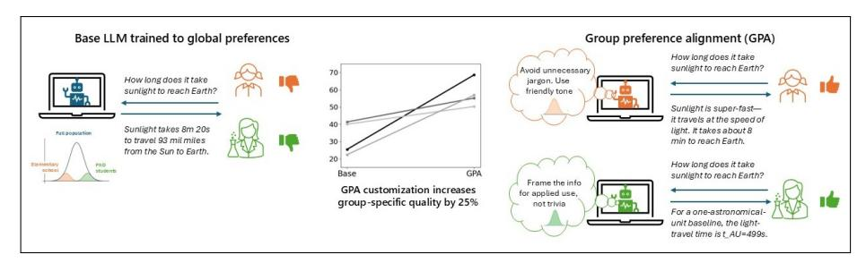
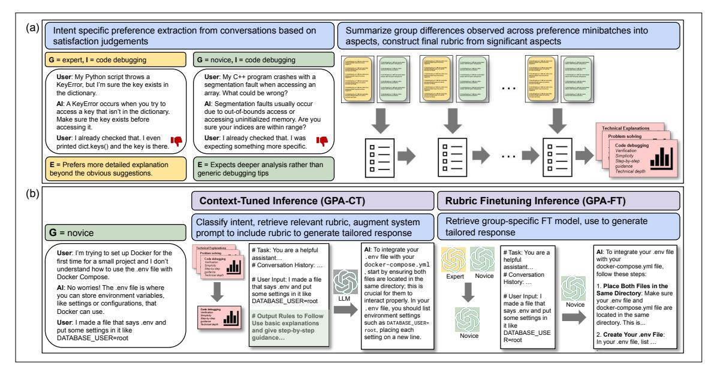
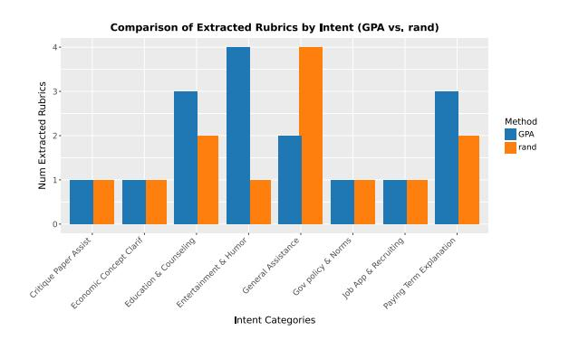
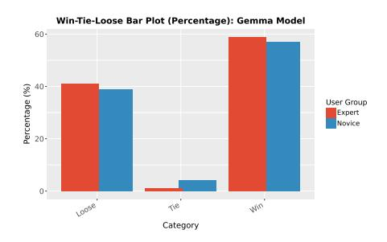
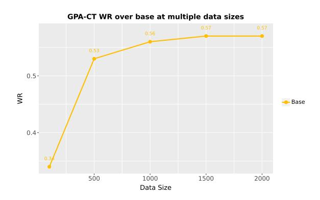

# <span id="page-0-0"></span>*Group Preference Alignment*: Customized LLM Response Generation from In-Situ Conversations

Ishani Mondal∗‡ , Jack W. Stokes∗⋄ , Sujay Kumar Jauhar∗⋄ , Mengting Wan<sup>⋄</sup> , Xiaofeng Xu<sup>⋄</sup> , Xia Song<sup>⋄</sup> , Jordan Boyd-Graber‡ , Jennifer Neville [∗∗](#page-0-0)⋄

‡ University of Maryland, College Park, <sup>⋄</sup>Microsoft Research, Redmond

# Abstract

LLMs often fail to meet the needs of diverse user groups due to their one-size-fits-all approach, and it's unclear when personalization is truly necessary. To address this, we propose Group Preference Alignment (GPA), a group-aware personalization framework that both detects when personalization is needed and adapts LLM responses accordingly. Our approach involves: (1) Group-Aware Preference Extraction, which distills divergent preferences from real-world conversation logs into interpretable rubrics, and (2) Tailored Response Generation, using (a) GPA-CT, which adapts responses using learnt rubrics, and (b) GPA-FT, which finetunes models using rubric-guided synthetic data. Automatic and human evaluations confirm that GPAimproves group alignment without compromising perfomance on standard instruction-following benchmarks.

## 1 Introduction

Large Language Models (LLMs) power a wide range of NLP applications, including conversational agents and content generation [\(Liu et al.,](#page-9-0) [2024;](#page-9-0) [Tian et al.,](#page-10-0) [2024;](#page-10-0) [Mondal et al.,](#page-9-1) [2024\)](#page-9-1). However, their one-size-fits-all training paradigm often fails to serve specialized needs of diverse user populations [\(Lucy et al.,](#page-9-2) [2024\)](#page-9-2). Most alignment methods rely on paired preference labels assigned by annotators [\(Ji et al.,](#page-9-3) [2024\)](#page-9-3), which reflect annotator biases rather than those of actual target users, hence causing dissatisfaction (Fig. [1\)](#page-1-0).

This mismatch leads to suboptimal outputs for two main reasons. First, the preference distribution of annotators may differ significantly from that of the target user group. For instance, expert users may expect technical precision while novices prefer explanatory detail; Japanese audiences may favor family-centric narratives, whereas U.S. audiences

<sup>∗</sup>This work started during Ishani's intership at Microsoft Research. Corresponding authors: imondal@umd.edu, [jstokes | sjauhar | jenneville]@microsoft.com.

tend to prefer individualistic themes. Second, user intent modulates preferences even within the same group: in education, experts may value concise rigor, while novices seek step-by-step analogies; in programming, experts prefer terse debugging tips, while novices need visual scaffolds /explanations.

Existing methods for group-aware adaptation [\(Balepur et al.,](#page-7-0) [2025;](#page-7-0) [Li et al.,](#page-9-4) [2024a\)](#page-9-4) primarily address the first issue by using personas as abstract user profiles or by incorporating group-level norms like culture to represent preferences. However, such proxies often lack fidelity and fail to capture the diverse range of preferences expressed in real-world in-situ conversational logs. Prior methods assume fixed groups and rarely check if group customization is indeed necessary.

To fill these gaps, we propose Group Preference Alignment (GPA)—a framework that learns preferences from real-world conversations. Unlike prior work [\(Balepur et al.,](#page-7-0) [2025;](#page-7-0) [Li et al.,](#page-9-4) [2024a\)](#page-9-4), GPA can be applied to arbitrarily defined groups and it can detect when personalization is needed. First, GPA extracts group-level preferences by analyzing large-scale interactions and summarizes them as interpretable, intent-specific rubrics (e.g., students prefer analogies; experts prefer technical terms). It then analyzes the extracted preferences for meaningful across-group differences. If no group difference is found (e.g., syntax error fixes are preferred by both novices and experts) the returned rubric is empty, which indicates there is no need for personalization. Second, when personalization is required, we introduce two ways to tailor responses: (1) **GPA-CT**, a training-free method that dynamically adjusts prompts during inference using retrieved rubrics, and (2) **GPA-FT** aligns groupspecific models with synthetic data generated with intent-specific rubric-based guidance. Specifically, each contrastive example pair highlights responses that align or misalign with a group's preferences.

We evaluate GPAon two multi-group conversa-

<span id="page-1-0"></span>

Figure 1: Illustration group-specific response adaptation in GPA, which improves performance by 25%.

tional datasets—WildChat [\(Zhao et al.,](#page-10-1) [2024\)](#page-10-1) and Microsoft Copilot logs—using both binary (expert vs. novice) and pluralistic (U.S., India, China) group settings. Using LLM-based persona evaluations [\(Koutcheme et al.,](#page-9-5) [2024;](#page-9-5) [Dong et al.,](#page-7-1) [2024\)](#page-7-1), we show that GPAoutperforms zero-shot, personabased, and static-rubric baselines in aligning to group preferences, while maintaining strong general performance on standard benchmarks [\(Zheng](#page-10-2) [et al.,](#page-10-2) [2023;](#page-10-2) [Li et al.,](#page-9-6) [2024b\)](#page-9-6).

## 2 Related Work

Customization of user interactions to better serve both individual and group preferences has a long history of research in fields that leverage language technology (see e.g., [\(Cho et al.,](#page-7-2) [2002;](#page-7-2) [Zhou et al.,](#page-10-3) [2012;](#page-10-3) [Teevan et al.,](#page-10-4) [2005;](#page-10-4) [Tabrizi et al.,](#page-9-7) [2018\)](#page-9-7)). Personalized LLM systems have also been applied to diverse applications, such as contextual query suggestion [\(Baek et al.,](#page-7-3) [2024\)](#page-7-3) and document creation [\(Mondal et al.,](#page-9-1) [2024\)](#page-9-1). While recent efforts have modeled individual preferences [\(Lee et al.,](#page-9-8) [2025\)](#page-9-8) and synthetic personas [\(Ge et al.,](#page-7-4) [2024\)](#page-7-4), group preference modeling remains underexplored.

Recently some attempts have been made at modeling a large number of individual characteristics at scale, such as with a thousand preferences [\(Lee](#page-9-8) [et al.,](#page-9-8) [2025\)](#page-9-8) or a million personas [\(Ge et al.,](#page-7-4) [2024\)](#page-7-4). However, the focus on modeling *group* preferences has been limited to a few recent research efforts [\(Feng et al.,](#page-7-5) [2024;](#page-7-5) [Zhao et al.,](#page-10-5) [2023;](#page-10-5) [Ramesh](#page-9-9) [et al.,](#page-9-9) [2024\)](#page-9-9). Crucially, none of these methods leverage real-world conversational data at scale to *learn* these group preferences. While some recent work has begun to incorporate feedback from insitu user-AI interactions in order to improve models [\(Shi et al.,](#page-9-10) [2024;](#page-9-10) [Li et al.,](#page-9-11) [2024c\)](#page-9-11), their focus has been different from modeling group preferences. Thus, to the best of our knowledge, our paper is the first attempt at using large-scale satisfaction signals from human-AI conversation logs to customize LLM responses with group preference alignment.

In this paper, we use LLMs as evaluators. Despite prior work pointing to some pitfalls with this approach, such as bias [\(Koo et al.,](#page-9-12) [2023\)](#page-9-12) and preferential scoring [\(Liu et al.,](#page-9-13) [2023\)](#page-9-13), using LLMs with judicious prompting for evaluation of language and information systems has become common practice [\(Zheng et al.,](#page-10-2) [2023;](#page-10-2) [Koutcheme et al.,](#page-9-5) [2024\)](#page-9-5). Recent efforts have applied the LLM-as-a-judge paradigm to evaluating a variety of applications such as translation [\(Kocmi and Federmann,](#page-9-14) [2023\)](#page-9-14) and summarization [\(Jain et al.,](#page-9-15) [2023\)](#page-9-15); notably these also include personalization [\(Dong et al.,](#page-7-1) [2024\)](#page-7-1).

# 3 Group Preference Alignment (GPA)

Our GPA framework (see Fig[.2\)](#page-2-0) enables contextaware, group-specific adaptation, ensuring more precise and effective model alignment beyond more conventional preference optimization using auxiliary annotators. Specifically, we hypothesize that intent-driven user preferences can be automatically extracted from real-world conversation logs between human and AI agents, enabling more effective model alignment than traditional methods that do not incorporate direct user feedback. Unlike RLHF [\(Ouyang et al.,](#page-9-16) [2022\)](#page-9-16) and RLAIF [\(Bai](#page-7-6) [et al.,](#page-7-6) [2022\)](#page-7-6), which optimize for majority preferences in the general population P, our approach leverages in-situ user judgments in a specific group G to achieve fine-grained, group-specific alignment. This will be of particular use when user needs deviate significantly from broader norms.

First, we consider two user groups G, G ′ . To make the idea of 'groups' concrete, we consider examples that highlight how our framework can be applied. In particular, we focus on cases where preference divergences are (a) well-documented and (b) evident in in-situ conversational logs—such as experts vs. novices prioritizing technical depth vs. step-by-step scaffolds, or U.S. vs. Chinese users favoring individualistic vs. culturally symbolic narratives. Importantly, we do not assume preferences are static or homogeneous; our methodology ac-

<span id="page-2-0"></span>

Figure 2: Illustration of (a) GPARubric Extraction (Sec. 3.1) showing how user preferences differ by group for same intent (e.g., debugging) and how we extract rubrics capturing these differences and (b) Response-Tailoring (Sec. 3.2) using learned rubrics to generate tailored responses: prompt-based (GPA-CT) and fine-tuned (GPA-FT).

commodates any group definition and detects divergence only when it arises in a meaningful way.

Next, consider that the groups generate queries for a specific intent  $\mathcal{I}$ . The LLM responses may receive user judgments  $\mathcal{J}_{\mathcal{G}}$ ,  $\mathcal{J}_{\mathcal{G}'}$  in the form of thumb feedback or implicit textual feedback (eg. thanking the AI). When these preferences diverge from the general population's judgments  $\mathcal{J}_P$ , aligning the model with group-specific signals will improve response relevance and user satisfaction. Note that if  $\mathcal{J}_{\mathcal{G}} \approx \mathcal{J}_P$ , alignment to  $\mathcal{J}_{\mathcal{G}}$  will simply reinforce existing preferences in the general population without degrading performance.

The overall GPA approach involves two main steps. First, we generate rubrics with group-aware preference extraction (Section 3.1). Our automatic rubric construction is guided by three principles: (a) interpretability—rubrics must clearly describe group-specific preferences so users and developers can understand them, (b) intent-specificity—rubrics must capture divergence within the same task/intent (e.g., debugging) to avoid over-generalization, and (c) groundedness—rubrics are extracted from real SAT/DSAT judgments rather than intuition. Second, we tailor responses based on extracted rubrics (Section 3.2).

#### <span id="page-2-1"></span>3.1 Group-Aware Preference Extraction

We extract intent-specific group preferences from multi-turn human-AI conversations using satisfaction judgments. Let  $C = \{C_1, \ldots, C_n\}$  denote a set of conversations, where each  $C_i =$ 

 $[U_1, A_1, \dots, U_t, A_t]$  contains alternating user and AI turns. Each conversation is annotated with an intent label  $\mathcal{I}_i$  (e.g., Code Debugging), a user satisfaction judgment  $\mathcal{J}_i \in [-1, +1]$  at one or more turns, and **group label**  $\mathcal{G}$  or  $\mathcal{G}'$  (e.g., Expert or Novice). As shown in Figure 2.a-left and explained briefly in Algorithm 1 (see Alg 2 for more details), we start by identifying user preferences at each turn using the observed satisfaction (SAT) or dissatisfaction (DSAT) judgments. For each rated turn, we prompt LLM to infer a preference **explanation**  $\mathcal{E}$ , capturing what the user expected (prompts in Table 15- 16). For example, group  $\mathcal{G}$ (expert) user may prefer 'more detailed explanation beyond the obvious suggestions,' whereas group  $\mathcal{G}'$ (novice) prefer 'deeper analysis rather than generic debugging tips.' These inferred explanations are recorded as tuples  $(\mathcal{I}, \mathcal{J}, \mathcal{E})$  (see yellow and green boxes).

Next (see Figure 2.a-right), we group preference explanations by **intent** and **user group**, then partition each group into **minibatches**. We prompt the LLM to **summarize group differences** by comparing each pair of group minibatches, identifying divergent **preference aspects**. Each aspect is assigned a **significance score** (Likert-style) by the LLM (prompt in Table 17). These **preference aspects** are incrementally refined across batches. The LLM updates previously extracted aspects with distinctions observed in new minibatches. Finally,

<span id="page-2-2"></span><sup>&</sup>lt;sup>1</sup>To simplify notation, we use *intent* to encode both *domain* (eg. education) and *task* (eg. summarization).

#### <span id="page-3-1"></span>**Algorithm 1** Group-Aware Preference Extraction

```
Input: Intent-specific (\mathcal{I}) conversations from user groups \mathcal{G}, \mathcal{G}', with user satisfaction judgments for each group \mathcal{G}, \mathcal{G}' do for each conversation \mathcal{C} do

Extract explanation \mathcal{E} of user preference based on feedback \mathcal{J} end for

Partition preference explanations into minibatches \mathcal{E}_M end for

Initialize rubric aspects \mathcal{A} = \emptyset for each pair of minibatches \mathcal{E}_{M_{\mathcal{G}}}, \mathcal{E}_{M_{\mathcal{G}'}}, do

Considering \mathcal{E}_{M_{\mathcal{G}}}, \mathcal{E}_{M_{\mathcal{G}'}}, \mathcal{A}, update contrastive aspects of preferences and score each \mathcal{A}_i \in \mathcal{A} wrt significance and for
```

**return**  $\mathcal{R}_{\mathcal{I}} = \{\mathcal{A}_i\}$  with score > threshold  $\ell$ 

aspects with scores above a threshold  $\ell$  are retained and aggregated into an intent-specific **rubric**. These rubrics capture interpretable dimensions of preference divergence across user groups for a given intent, such as 'Verification', 'Step-by-step guidance', or 'Technical depth'. These rubrics form the foundation for our personalized response generation approaches (Table 3.b and A.8).

#### <span id="page-3-0"></span>3.2 Response Tailoring

Building on the extracted rubrics, we propose two methods for response tailoring below.

A) GPA-CT-Dynamic Context-Tuning. Unlike traditional finetuning methods that require updating model weights, GPA-CT adapts the LLM's behavior on-the-fly using dynamic intent-specific prompt engineering. As illustrated in Figure 2.b-left and in Algorithm 3, the system first classifies the user's **group label**  $\mathcal{G}$  (e.g., novice) and **intent**  $\mathcal{I}$  (e.g., setting up Docker). Based on this context, it retrieves a relevant rubric  $\mathcal{R}_{\mathcal{I}}$  (e.g., 'Use basic explanations' and 'give step-by-step guidance'), which encodes preferred response attributes for that user group and task type. Next, we augment the LLM prompt with the retrieved rubric (prompt in Table 18). This enables LLM to generate a tailored **response** grounded in group-specific guidance. As as example, in Figure 2, the LLM responds with simplified, actionable instructions for using a .env file with docker-compose.yml.

**B) GPA-FT: Rubric-Guided Contrastive Data Generation and Finetuning.** Since it's unlikely the data will contain matched pairs of queries with both positive and negative judgments, we use the learned rubrics to generate a synthetic *matched* output for each sample that reflects the opposite

preference. We then use this augmented dataset in GPA-FT to align separate LLMs for each group. This ensures the models internalize each group's stylistic differences, enabling preference-aligned inference without prompt overhead (See Alg. 4 for training details).

GPA-FT first constructs matched training pairs using the rubrics  $\mathcal{R}_{\mathcal{I}_i}$  tailored to each group-intent combination. For each turn  $[U_j,A_j]$  with a preference judgment  $\mathcal{J}_j$ , we generate an alternative response  $A_j{}'$  for the same query to reflect the opposite judgment. I.e., if the user prefers  $A_j$ , we synthesize a dispreferred response using the other group's rubric (and vice versa) (see A.11 for quality assurance). For instance, if the user is a novice and prefers  $A_j$ , then we will use the expert rubrics to generate  $A_j{}'$ , assuming it will be dispreferred by the novice. These pairs  $(A_+,A_-)$  are added to a synthetic dataset  $\mathcal{D}_{\text{aug}}$  used for contrastive preference learning.

GPA-FT then trains group-specific models on the augmented data to favor the preferred responses using the DPO loss (Rafailov et al., 2024):  $\mathcal{L}_{\text{DPO}} = \log \frac{e^{f_{\theta}(S,A_{+})}}{e^{f_{\theta}(S,A_{+})} + e^{f_{\theta}(S,A_{-})}}$ . This yields one model  $P_{\theta_{\mathcal{G}}}$  per group  $\mathcal{G}$ , aligned with group-specific preferences. As depicted in Fig. 2.b-right, inference proceeds in three steps (see Algorithm 6): (i) classify the user group, (ii) retrieve the corresponding fine-tuned model, and (iii) generate a response using that model. As an example, in Figure 2, the novice group model produces a step-by-step explanation tailored to beginners. The generated response clearly reflects rubric dimensions like 'Verification' and 'Step-by-step guidance' drawn from the novice rubric.

### 4 Experimental Setup

We evaluate GPA using real-world conversational logs from Microsoft Copilot and Wildchat (Zhao et al. (2024)). For programming and software intent, we use 8000 Copilot conversations and 8200 WildChat conversations. We group conversations into expert (i.e.,  $\mathcal{G}$ ; Copilot: 2200, WildChat: 6000) and novice (i.e.,  $\mathcal{G}'$ ; Copilot: 5800, WildChat: 2000) groups by using an auxiliary expertise classifier.<sup>2</sup> Next, we consider Creative writing

<span id="page-3-2"></span><sup>&</sup>lt;sup>2</sup>Prompt in Table 19, Appendix. We manually inspected 100 random conversations and found that the classification was reliable ( $\kappa=0.88$  agreement computed between the first author and GPT-4o). Location-based groups were derived from metadata. We acknowledge possible misgroupings and show in Fig. 5 that misassigned labels reduce rubric quality,

<span id="page-4-0"></span>

| Model             | LLM Pref (W/L/T)                | LLM conf ≥ 75 | LLM Pref (W/L/T)                | LLM conf ≥ 75 |
|-------------------|---------------------------------|---------------|---------------------------------|---------------|
|                   | Intent=Programming/Group=Novice |               | Intent=Programming/Group=Expert |               |
| GPA-CT vs Base    | 65.82 / 25.00 / 9.18            | 67.53 / 32.47 | 57.10 / 42.04 / 0.86            | 57.46 / 42.54 |
| GPA-CT vs Persona | 60.44 / 31.96 / 7.60            | 73.97 / 26.3  | 61.10 / 38.30 / 0.6             | 61.91 / 38.09 |
| GPA-CT vs Static  | 56.43 / 37.43 / 6.14            | 80.00 / 20.00 | 57.38 / 41.47 / 1.6             | 59.05 / 40.95 |
| GPA-FT vs Base    | 71.29 / 25.87 / 2.84            | 68.05 / 31.95 | 53.17 / 40.62 / 5.56            | 56.15 / 43.84 |
| GPA-FT vs Persona | 70.98 / 27.76 / 1.26            | 68.84 / 31.16 | 58.80 / 40.62 / 5.0             | 59.62 / 40.37 |
| GPA-FT vs Static  | 66.88 / 32.18 / 0.95            | 60.64 / 39.36 | 59.65 / 39.77 / 0.56            | 57.72 / 42.27 |
| GPA-FT vs GPA-CT  | 63.09 / 36.59 / 0.32            | 57.59 / 42.41 | 53.12 / 38.35 / 0.28            | 58.99 / 41.00 |
|                   | Intent=Writing/Group=USA        |               | Intent=Writing/Group=China      |               |
| GPA-CT vs Base    | 45.5 / 53.5 / 1.0               | 54.1 / 45.9   | 58.5 / 23.9 / 17.6              | 88.57 / 11.42 |
| GPA-CT vs Persona | 55.5 / 42.5 / 2.0               | 59.5 / 40.5   | 53.6 / 28.73 / 17.60            | 60.0 / 40.00  |
| GPA-CT vs Static  | 67.02 / 31.00 / 1.98            | 67.10 / 32.90 | 52.11 / 32.3 / 15.59            | 68.57 / 31.43 |
| GPA-FT vs Base    | 55 / 26.5 / 18.5                | 62.2 / 37.8   | 55.22 / 20.84 / 23.94           | 60.95 / 39.04 |
| GPA-FT vs Persona | 77 / 21.5 / 1.5                 | 82.4 / 17.5   | 35.21 / 40.84 / 23.95           | 32.38 / 67.62 |
| GPA-FT vs Static  | 85 / 14.5 / 0.5                 | 88.5 / 11.5   | 28.16 / 54.92 / 16.92           | 47.61 / 52.39 |
| GPA-FT vs GPA-CT  | 85.5 / 14 / 0.5                 | 71.4 / 28.6   | 39.43 / 40.84 / 19.73           | 40.95 / 59.05 |

<sup>(</sup>a) Results on Wildchat Creative Writing and Copilot Programming using LLama-8b. W/L/T = win/lose/tie rates; Confidence by LLM score ≥ 75 [\(Dong et al.,](#page-7-1) [2024\)](#page-7-1).

| Intent                                 | Rubric / Aspect        |  |  |  |  |
|----------------------------------------|------------------------|--|--|--|--|
| Programming Domain (Expert vs. Novice) |                        |  |  |  |  |
| Info Requests                          | Detail and Specificity |  |  |  |  |
| Info Requests                          | Clarity and Directness |  |  |  |  |
| Info Requests                          | Comprehensiveness      |  |  |  |  |
| Info Seeking                           | Specificity            |  |  |  |  |
| Info Seeking                           | Error Handling         |  |  |  |  |
| Program Inquiry                        | Accuracy               |  |  |  |  |
| Program Inquiry                        | Critical Analysis      |  |  |  |  |
| Info Requests                          | Visual Aids / Examples |  |  |  |  |
| Info Seeking                           | Use of Examples        |  |  |  |  |
| Program Inquiry                        | Conciseness            |  |  |  |  |

(b) Rubric aspects with high significance (e.g., specificity, error handling) reflect strong divergence in expert vs. novice expectations, while low-significant aspects (e.g., use of examples, visual aids) indicate non-discriminative preferences. Green = High (≥ 4), Yellow = Moderate (3), Red = Low (≤ 2).

<span id="page-4-3"></span>Figure 3: GPA results. (a) LLM preference-based WR evaluation and (b) Examples of learned rubrics with significance.

| Model                                 | LLM Pref (W/L/T)                          | LLM conf ≥ 75                  | LLM Pref (W/L/T)                             | LLM conf ≥ 75                  |
|---------------------------------------|-------------------------------------------|--------------------------------|----------------------------------------------|--------------------------------|
|                                       | Intent=Programming/Group=Novice           |                                | Intent=Programming/Group=Expert              |                                |
| GPA-CT vs Base                        | 69.30 / 30.41 / 0.29                      | 57.97 / 42.03                  | 44.89 / 54.26 / 0.85                         | 46.96 / 53.04                  |
| GPA-CT vs Persona<br>GPA-CT vs Static | 57.02 / 42.98 / 0<br>57.54 / 41.87 / 0.58 | 54.30 / 45.70<br>53.00 / 47.00 | 58.24 / 40.63 / 1.13<br>56.25 / 42.90 / 0.85 | 59.24 / 40.76<br>63.64 / 36.36 |
| GPA-FT vs Base                        | 68.42 / 29.53 / 2.05                      | 64.26 / 35.74                  | 59.66 / 40.34/ 0                             | 56.76 / 43.24                  |
| GPA-FT vs Persona                     | 64.39 / 45.61/ 0                          | 52.90 / 47.10                  | 66.76 / 32.95 / 0.28                         | 69.39 / 30.61                  |
| GPA-FT vs Static                      | 64.33 / 34.80 / 0.88                      | 58.07 / 41.93                  | 67.61 / 32.10 / 0.28                         | 68.42 / 31.58                  |
| GPA-FT vs GPA-CT                      | 53.51 / 46.49 / 0                         | 54.26 / 45.74                  | 69.03 / 30.97 / 0                            | 67.64 / 32.36                  |

Table 1: GPA-CTand GPA-FTresults on the Microsoft Copilot dataset for Gemma for the Novice and Expert groups. The LLM expected confidence ≥ 75 is reported (as suggested by [Dong et al.](#page-7-1) [\(2024\)](#page-7-1)) and W/L/T=win/lose/tie.

*and editing* intent in WildChat and form user groups based on metadata, specifically *location*, partitioning users into USA (8000 conversations) and China (800 conversations). We partitioned the above datasets into 90:10 train:test splits to ensure no training signal leakage. Next, we use predicted Satisfaction (SAT) and Dissatisfaction (DSAT) judgments to learn divergent preferences on training data. Following [Lin et al.](#page-9-18) [\(2024\)](#page-9-18) and the taxonomy proposed by [Shi et al.](#page-9-10) [\(2024\)](#page-9-10), we used GPT-4o to classify bot responses resulting in a subsequent user SAT, DSAT, or NA. We finetune using synthetic data constructed from the full training set.

Models and **GPA** Baselines. For rubric extraction, we use GPT-4o and for tailored response generation (GPA-CTand GPA-FT), we use two base LLMs (M): gemma-2-9b-it[3](#page-4-1) [\(Team et al.,](#page-10-6) [2024\)](#page-10-6) and Meta-Llama-3-8B[4](#page-4-2) [\(Grattafiori et al.,](#page-7-7) [2024\)](#page-7-7). We compare GPA-CTand GPA-FTagainst several baselines: a) Zero-shot (Base) responses, b) Persona-Aware (Persona-G): which augments input prompt (Table [20\)](#page-22-1) with group-aware persona (G) information to mimic responses from specific groups through role-playing behavior, c) Persona-Criteria-Aware (Static-G): which uses model M to first generate preference criteria for G and G′ , and then append the generated criteria to prompt in Table [21.](#page-22-2) We discuss two more finetuned-baselines, training details, and choice of hyperparameters in Appendix [A.9,](#page-13-1) [A.1,](#page-11-0) and [A.2](#page-11-1) respectively.

# <span id="page-4-4"></span>5 Automatic Evaluation

To evaluate GPA, we pose five research questions. Each is designed to test a distinct aspect of our system's ability to align with diverse user preferences while preserving general instruction-following performance which we describe below.

RQ1: Does **GPA**effectively align responses with the preferences of different user groups? We

emphasizing the importance of reliable group inference.

<span id="page-4-1"></span><sup>3</sup> <https://huggingface.co/google/gemma-2-9b-it>

<span id="page-4-2"></span><sup>4</sup> <https://huggingface.co/meta-llama/Meta-Llama-3-8B>

measure alignment with group-specific preferences using Win–Tie–Lose (WTR) comparisons, judged by GPT-4o via Persona Role-Playing [\(Dong et al.,](#page-7-1) [2024\)](#page-7-1). We incorporate judgments with and without confidence estimation (Prompts in Tables [22,](#page-23-0) [23\)](#page-23-1). To mitigate positional bias, we average win rates by swapping response positions. Observations: Experimental Results in Table [3a](#page-4-0) show that GPA-FToutperforms all baselines in high-data settings (e.g., Novice and US Writing), while GPA-CTexcels in low-data regimes (e.g., China and Expert groups), outperforming GPA-FT. This demonstrates that while fine-tuning is more powerful when data is plentiful, GPA-CToffers robust customization even with minimal supervision. We highlight a *clear trade-off between sample efficiency and customization power*: GPA-FTis preferable in data-rich contexts, while GPA-CTis better suited for sparse group data or cold-start settings. Observations are generalizable across LLMs and domains (See [A.7\)](#page-13-2).

RQ2: Are base LMs inherently aligned with certain user groups more than others? We analyze the relative difficulty of outperforming base LLMs across demographic groups in Wildchat (Creative Writing) and Copilot (Programming). Observations: Expert and US groups are hardest to improve upon—e.g., GPA-FTachieves only 53.17% WinRate for Experts vs 71.29% for Novices (Table [3a\)](#page-4-0). This suggests that base LMs, like LLaMA and Gemma (Table [1\)](#page-4-3), are implicitly aligned toward expert-like and Western preferences. This underlines the need for group-aware adaptation methods to close preference gaps in inclusive AI systems.

RQ3: How data-efficient is **GPA-CT**in learning group preferences? We vary the number of training samples used for rubric extraction (100–2000 samples) in the Wildhat Programming domain and plot the learning curve (Figure [6\)](#page-18-1). We evaluate performance via WR on a held-out test set using Prompt 24. Observations: GPA-CTachieves stable WR with 1000 training examples, suggesting that GPA-CTis data-efficient which reinforces rubric-based preference modeling for real-world deployment in diverse settings where user data is limited.

RQ4: Can **GPA**reduce dissatisfaction in known problematic responses? We use DSAT (dissatisfaction) signals from real interactions in test set as a form of oracle-guided supervision. For each DSAT-

<span id="page-5-0"></span>

| Setup             | Win (%) | Lose (%) | Tie (%) |
|-------------------|---------|----------|---------|
| GPA-CT vs Base    | 69.61%  | 29.41%   | 0.98%   |
| GPA-CT vs Persona | 65.69%  | 33.33%   | 0.98%   |
| GPA-CT vs Static  | 76.70%  | 21.36%   | 1.94%   |

Table 2: WTR against baselines using Llama on Wildchat Programming, compared against reference DSAT indicating that our method can provide better responses.

labeled example, we test whether GPA-CTcan generate a less dissatisfactory response using Prompt [24,](#page-24-0) given the same conversational context. We report the results using WTR rates against baselines using LLaMA-generated outputs in Table [2.](#page-5-0) Observations: GPA-CTachieves the highest win rates over all baselines—76.70% over Static, 69.61% over Base, and 65.69% over Persona. DSAT-based evaluation provides a real-world signal of alignment failure. The consistent gains of GPA-CTdemonstrate its utility as a corrective mechanism for dissatisfaction-prone generation.

<span id="page-5-1"></span>

Figure 4: Illustrates how random shuffling of expertise labels impacts rubric generation. It reveals that, for most intents, randomization of the group labels results in extraction of fewer rubric items indicating robustness.

# RQ5: Does **GPA-FT**maintain general instructionfollowing ability on standard benchmarks? To ensure group-specific alignment does not come at the cost of general usability, we evaluate GPA-FTon MT-Bench [\(Zheng et al.,](#page-10-2) [2023\)](#page-10-2) and Arena-Hard [\(Li](#page-9-6) [et al.,](#page-9-6) [2024b\)](#page-9-6), using their default win-rate setting. Observations: As shown in Table [3,](#page-6-0) GPA-FTmaintains strong performance on both the benchmarks. On MT-Bench, Novice GPA-FT(8.33) slightly outperforms base model (8.32). On Arena-Hard, all groups show positive win–loss deltas, with China (+10.15%) and Novice (+10.01%) groups achieving highest gains. These results show that GPA-FTimproves group alignment without compromising general instruction-following, indicating no trade-off between personalization

<span id="page-6-0"></span>

| Model         | WR    | LR    | TR   | ∆ (%)  | MT-B |
|---------------|-------|-------|------|--------|------|
| Base          |       |       |      |        | 8.32 |
| Novice GPA-FT | 49.11 | 39.10 | 8.62 | +10.01 | 8.33 |
| Expert GPA-FT | 47.89 | 42.88 | 6.41 | +5.01  | 8.21 |
| US GPA-FT     | 47.56 | 43.80 | 8.64 | +3.76  | 8.26 |
| China GPA-FT  | 48.49 | 38.34 | 9.02 | +10.15 | 8.30 |

Table 3: Comparison against LLama Base on Arena-Hard Benchmark (Win/Lose/Tie, and Win-Lose ∆) and evaluation on MT-Bench (MT-B). It signifies that our fine-tuned models do not compromise the performances on standard instruction-following tasks.

<span id="page-6-2"></span>

| G     | Model     | WR v Base | WR v G<br>′ Rubrics   |
|-------|-----------|-----------|-----------------------|
| India | GPA-India | 64.5%     | –                     |
| USA   | GPA-India | 42.0%     | 58.0% (G<br>′ =USA)   |
| China | GPA-India | 39.2%     | 60.8% (G<br>′ =China) |

Table 4: One-vs-All Evaluation: GPA model trained only with India rubric evaluated across all groups, signifying the robustness of our approach.

and generalization.

# 6 Results Based on Human Evaluation

To validate the reliability of GPT-4o as an automatic evaluator and assess whether its judgments align with real user preferences, we conduct targeted human evaluations across cultural and expertise-based user groups. In the WildChat Creative Writing domain, four annotators (two each from India and the USA) rated 40 anonymized conversations for response preference. In Programming, six participants (2 novices, 4 experts) evaluated 30 interactions, each comparing noviceand expert-targeted responses (Instructions in Appendix [A.10\)](#page-15-2). We report inter-annotator agreement and GPT-4o's alignment with human judgments using Cohen's κ (Table [5\)](#page-6-1), finding moderate-tostrong agreement in both domains—supporting GPT-4o's reliability and the effectiveness of our group-specific alignment.

In Programming Domain, Human–GPT-4o agreement is the strongest, with 82% "better" outcomes, only 7% disagreements, and 10% ties; Human–Human results are nearly identical (79% / 9% / 13%), with = 0.77 and r = 0.71. For Programming (Expert), agreement is slightly lower but still solid (69% / 16% / 15%), again closely mirroring Human–Human agreement (73% / 14% / 13%), with = 0.72 and r = 0.68. Overall, Human–GPT-4o agreement tracks closely with Human–Human agreement across all groups, with highest reliability for novices, and most disagreements confined to

<span id="page-6-1"></span>

| Culture | Human-GPT-4o | Human-Human |
|---------|--------------|-------------|
| India   | 78.5%        | 0.79        |
| USA     | 68.5%        | 0.65        |
| Novice  | 81.2%        | 0.77        |
| Expert  | 73.5%        | 0.72        |

Table 5: Average agreement between GPT-4o and human preferences, and inter-rater agreement within humans on Writing and Programming Samples.

tie cases rather than strong preference judgments.

## 7 Robustness and Generalizability

**GPA**is generalizable beyond pre-determined, binary group boundaries. To test generalizability beyond binary groups, we ran a tri-group study on WildChat Creative Writing samples with users from USA, India, and China. GPA-CT, evaluated on 50 prompts per group with GPT-4o as judge, outperformed base model using group-specific rubrics, while groups learned for one group, then applied to another underperformed (e.g., India→USA: 42.0%). This confirms that group specific preferences are not-transferable (Table [7\)](#page-12-0). Next, to assess GPA's performance under partial group supervision, we conduct a one-vs-all evaluation where rubrics are extracted only for India group. GPAis then tested across prompts originating from India, USA, and China groups. Results (Table [4\)](#page-6-2) shows that GPAimproves alignment for India (64.5% WR vs. base), demonstrating scalability.

Preference rubrics degrade significantly when expertise labels are randomly flipped, indicating robustness. To test whether GPAcaptures meaningful group distinctions, we randomly perturb expertise labels and compare the resulting rubrics to those generated with correct labels (GPA). As shown in Figure [4,](#page-5-1) rubric validity—measured via a self-correcting evaluation prompt—drops sharply under randomization (rand), confirming GPA's robustness. We observe that valid rubric generation is most successful under the original setting (GPA). (More experiments on Reliability of Rubrics in Appendix [A.2](#page-11-1) and Appendix [A.3\)](#page-11-2).

## 8 Conclusion

We propose GPA, a framework that enables the development of more personalized and contextually aware LLMs by leveraging *in-situ* interaction logs and interpretable rubrics. Due to increased transparency, this approach can be scaled up in legal/healthcare and other such high-stake domains.

# Limitations

The present GPA framework has three main limitations that we will address in future work. First, our rubric extraction algorithm is linear in the number of intents, but quadratic in the group minibatches. To scale this to larger datasets the minibatch sizes will need to be increased proportionally or a subquadratic number of minibatches should be selected for comparison. Second, the process assumes that conversational preferences remain stable within each group, which may not always be the case. Rubrics may need to be periodically refreshed to reflect evolving tastes. Third, we have currently tested GPA in education, programming, and writing domains. There is still a need to test its effectiveness in highly specialized domains such as law or medicine, as well as in hyper-personalized scenarios (e.g., single person groups).

## References

<span id="page-7-3"></span>Jinheon Baek, Nirupama Chandrasekaran, Silviu Cucerzan, Allen Herring, and Sujay Kumar Jauhar. 2024. Knowledge-augmented large language models for personalized contextual query suggestion. In *Proceedings of the ACM on Web Conference 2024*, pages 3355–3366.

<span id="page-7-6"></span>Yuntao Bai, Andy Jones, Kamal Ndousse, Amanda Askell, Anna Chen, Nova DasSarma, Dawn Drain, Stanislav Fort, Deep Ganguli, Tom Henighan, Nicholas Joseph, Saurav Kadavath, Jackson Kernion, Tom Conerly, Sheer El-Showk, Nelson Elhage, Zac Hatfield-Dodds, Danny Hernandez, Tristan Hume, Scott Johnston, Shauna Kravec, Liane Lovitt, Neel Nanda, Catherine Olsson, Dario Amodei, Tom Brown, Jack Clark, Sam McCandlish, Chris Olah, Ben Mann, and Jared Kaplan. 2022. [Training](https://arxiv.org/abs/2204.05862) [a helpful and harmless assistant with reinforce](https://arxiv.org/abs/2204.05862)[ment learning from human feedback.](https://arxiv.org/abs/2204.05862) *Preprint*, arXiv:2204.05862.

<span id="page-7-0"></span>Nishant Balepur, Vishakh Padmakumar, Fumeng Yang, Shi Feng, Rachel Rudinger, and Jordan Lee Boyd-Graber. 2025. [Whose boat does it float? improving](https://arxiv.org/abs/2501.11549) [personalization in preference tuning via inferred user](https://arxiv.org/abs/2501.11549) [personas.](https://arxiv.org/abs/2501.11549) *Preprint*, arXiv:2501.11549.

<span id="page-7-2"></span>Yoon Ho Cho, Jae Kyeong Kim, and Soung Hie Kim. 2002. A personalized recommender system based on web usage mining and decision tree induction. *Expert systems with Applications*, 23(3):329–342.

<span id="page-7-1"></span>Yijiang River Dong, Tiancheng Hu, and Nigel Collier. 2024. [Can LLM be a personalized judge?](https://doi.org/10.18653/v1/2024.findings-emnlp.592) In *Findings of the Association for Computational Linguistics: EMNLP 2024*, pages 10126–10141, Miami, Florida, USA. Association for Computational Linguistics.

<span id="page-7-8"></span>Kawin Ethayarajh, Winnie Xu, Niklas Muennighoff, Dan Jurafsky, and Douwe Kiela. 2024. [Kto:](https://arxiv.org/abs/2402.01306) [Model alignment as prospect theoretic optimization.](https://arxiv.org/abs/2402.01306) *Preprint*, arXiv:2402.01306.

<span id="page-7-5"></span>Shangbin Feng, Taylor Sorensen, Yuhan Liu, Jillian Fisher, Chan Young Park, Yejin Choi, and Yulia Tsvetkov. 2024. Modular pluralism: Pluralistic alignment via multi-llm collaboration. *arXiv preprint arXiv:2406.15951*.

<span id="page-7-4"></span>Tao Ge, Xin Chan, Xiaoyang Wang, Dian Yu, Haitao Mi, and Dong Yu. 2024. [Scaling synthetic data](https://arxiv.org/abs/2406.20094) [creation with 1,000,000,000 personas.](https://arxiv.org/abs/2406.20094) *Preprint*, arXiv:2406.20094.

<span id="page-7-7"></span>Aaron Grattafiori, Abhimanyu Dubey, Abhinav Jauhri, Abhinav Pandey, Abhishek Kadian, Ahmad Al-Dahle, Aiesha Letman, Akhil Mathur, Alan Schelten, Alex Vaughan, Amy Yang, Angela Fan, Anirudh Goyal, Anthony Hartshorn, Aobo Yang, Archi Mitra, Archie Sravankumar, Artem Korenev, Arthur Hinsvark, Arun Rao, Aston Zhang, Aurelien Rodriguez, Austen Gregerson, Ava Spataru, Baptiste Roziere, Bethany Biron, Binh Tang, Bobbie Chern, Charlotte Caucheteux, Chaya Nayak, Chloe Bi, Chris Marra, Chris McConnell, Christian Keller, Christophe Touret, Chunyang Wu, Corinne Wong, Cristian Canton Ferrer, Cyrus Nikolaidis, Damien Allonsius, Daniel Song, Danielle Pintz, Danny Livshits, Danny Wyatt, David Esiobu, Dhruv Choudhary, Dhruv Mahajan, Diego Garcia-Olano, Diego Perino, Dieuwke Hupkes, Egor Lakomkin, Ehab AlBadawy, Elina Lobanova, Emily Dinan, Eric Michael Smith, Filip Radenovic, Francisco Guzmán, Frank Zhang, Gabriel Synnaeve, Gabrielle Lee, Georgia Lewis Anderson, Govind Thattai, Graeme Nail, Gregoire Mialon, Guan Pang, Guillem Cucurell, Hailey Nguyen, Hannah Korevaar, Hu Xu, Hugo Touvron, Iliyan Zarov, Imanol Arrieta Ibarra, Isabel Kloumann, Ishan Misra, Ivan Evtimov, Jack Zhang, Jade Copet, Jaewon Lee, Jan Geffert, Jana Vranes, Jason Park, Jay Mahadeokar, Jeet Shah, Jelmer van der Linde, Jennifer Billock, Jenny Hong, Jenya Lee, Jeremy Fu, Jianfeng Chi, Jianyu Huang, Jiawen Liu, Jie Wang, Jiecao Yu, Joanna Bitton, Joe Spisak, Jongsoo Park, Joseph Rocca, Joshua Johnstun, Joshua Saxe, Junteng Jia, Kalyan Vasuden Alwala, Karthik Prasad, Kartikeya Upasani, Kate Plawiak, Ke Li, Kenneth Heafield, Kevin Stone, Khalid El-Arini, Krithika Iyer, Kshitiz Malik, Kuenley Chiu, Kunal Bhalla, Kushal Lakhotia, Lauren Rantala-Yeary, Laurens van der Maaten, Lawrence Chen, Liang Tan, Liz Jenkins, Louis Martin, Lovish Madaan, Lubo Malo, Lukas Blecher, Lukas Landzaat, Luke de Oliveira, Madeline Muzzi, Mahesh Pasupuleti, Mannat Singh, Manohar Paluri, Marcin Kardas, Maria Tsimpoukelli, Mathew Oldham, Mathieu Rita, Maya Pavlova, Melanie Kambadur, Mike Lewis, Min Si, Mitesh Kumar Singh, Mona Hassan, Naman Goyal, Narjes Torabi, Nikolay Bashlykov, Nikolay Bogoychev, Niladri Chatterji, Ning Zhang, Olivier Duchenne, Onur Çelebi, Patrick Alrassy, Pengchuan Zhang, Pengwei Li, Petar Vasic, Peter Weng, Prajjwal Bhargava, Pratik Dubal,

Praveen Krishnan, Punit Singh Koura, Puxin Xu, Qing He, Qingxiao Dong, Ragavan Srinivasan, Raj Ganapathy, Ramon Calderer, Ricardo Silveira Cabral, Robert Stojnic, Roberta Raileanu, Rohan Maheswari, Rohit Girdhar, Rohit Patel, Romain Sauvestre, Ronnie Polidoro, Roshan Sumbaly, Ross Taylor, Ruan Silva, Rui Hou, Rui Wang, Saghar Hosseini, Sahana Chennabasappa, Sanjay Singh, Sean Bell, Seohyun Sonia Kim, Sergey Edunov, Shaoliang Nie, Sharan Narang, Sharath Raparthy, Sheng Shen, Shengye Wan, Shruti Bhosale, Shun Zhang, Simon Vandenhende, Soumya Batra, Spencer Whitman, Sten Sootla, Stephane Collot, Suchin Gururangan, Sydney Borodinsky, Tamar Herman, Tara Fowler, Tarek Sheasha, Thomas Georgiou, Thomas Scialom, Tobias Speckbacher, Todor Mihaylov, Tong Xiao, Ujjwal Karn, Vedanuj Goswami, Vibhor Gupta, Vignesh Ramanathan, Viktor Kerkez, Vincent Gonguet, Virginie Do, Vish Vogeti, Vítor Albiero, Vladan Petrovic, Weiwei Chu, Wenhan Xiong, Wenyin Fu, Whitney Meers, Xavier Martinet, Xiaodong Wang, Xiaofang Wang, Xiaoqing Ellen Tan, Xide Xia, Xinfeng Xie, Xuchao Jia, Xuewei Wang, Yaelle Goldschlag, Yashesh Gaur, Yasmine Babaei, Yi Wen, Yiwen Song, Yuchen Zhang, Yue Li, Yuning Mao, Zacharie Delpierre Coudert, Zheng Yan, Zhengxing Chen, Zoe Papakipos, Aaditya Singh, Aayushi Srivastava, Abha Jain, Adam Kelsey, Adam Shajnfeld, Adithya Gangidi, Adolfo Victoria, Ahuva Goldstand, Ajay Menon, Ajay Sharma, Alex Boesenberg, Alexei Baevski, Allie Feinstein, Amanda Kallet, Amit Sangani, Amos Teo, Anam Yunus, Andrei Lupu, Andres Alvarado, Andrew Caples, Andrew Gu, Andrew Ho, Andrew Poulton, Andrew Ryan, Ankit Ramchandani, Annie Dong, Annie Franco, Anuj Goyal, Aparajita Saraf, Arkabandhu Chowdhury, Ashley Gabriel, Ashwin Bharambe, Assaf Eisenman, Azadeh Yazdan, Beau James, Ben Maurer, Benjamin Leonhardi, Bernie Huang, Beth Loyd, Beto De Paola, Bhargavi Paranjape, Bing Liu, Bo Wu, Boyu Ni, Braden Hancock, Bram Wasti, Brandon Spence, Brani Stojkovic, Brian Gamido, Britt Montalvo, Carl Parker, Carly Burton, Catalina Mejia, Ce Liu, Changhan Wang, Changkyu Kim, Chao Zhou, Chester Hu, Ching-Hsiang Chu, Chris Cai, Chris Tindal, Christoph Feichtenhofer, Cynthia Gao, Damon Civin, Dana Beaty, Daniel Kreymer, Daniel Li, David Adkins, David Xu, Davide Testuggine, Delia David, Devi Parikh, Diana Liskovich, Didem Foss, Dingkang Wang, Duc Le, Dustin Holland, Edward Dowling, Eissa Jamil, Elaine Montgomery, Eleonora Presani, Emily Hahn, Emily Wood, Eric-Tuan Le, Erik Brinkman, Esteban Arcaute, Evan Dunbar, Evan Smothers, Fei Sun, Felix Kreuk, Feng Tian, Filippos Kokkinos, Firat Ozgenel, Francesco Caggioni, Frank Kanayet, Frank Seide, Gabriela Medina Florez, Gabriella Schwarz, Gada Badeer, Georgia Swee, Gil Halpern, Grant Herman, Grigory Sizov, Guangyi, Zhang, Guna Lakshminarayanan, Hakan Inan, Hamid Shojanazeri, Han Zou, Hannah Wang, Hanwen Zha, Haroun Habeeb, Harrison Rudolph, Helen Suk, Henry Aspegren, Hunter Goldman, Hongyuan Zhan, Ibrahim Damlaj, Igor Molybog, Igor Tufanov, Ilias Leontiadis,

Irina-Elena Veliche, Itai Gat, Jake Weissman, James Geboski, James Kohli, Janice Lam, Japhet Asher, Jean-Baptiste Gaya, Jeff Marcus, Jeff Tang, Jennifer Chan, Jenny Zhen, Jeremy Reizenstein, Jeremy Teboul, Jessica Zhong, Jian Jin, Jingyi Yang, Joe Cummings, Jon Carvill, Jon Shepard, Jonathan Mc-Phie, Jonathan Torres, Josh Ginsburg, Junjie Wang, Kai Wu, Kam Hou U, Karan Saxena, Kartikay Khandelwal, Katayoun Zand, Kathy Matosich, Kaushik Veeraraghavan, Kelly Michelena, Keqian Li, Kiran Jagadeesh, Kun Huang, Kunal Chawla, Kyle Huang, Lailin Chen, Lakshya Garg, Lavender A, Leandro Silva, Lee Bell, Lei Zhang, Liangpeng Guo, Licheng Yu, Liron Moshkovich, Luca Wehrstedt, Madian Khabsa, Manav Avalani, Manish Bhatt, Martynas Mankus, Matan Hasson, Matthew Lennie, Matthias Reso, Maxim Groshev, Maxim Naumov, Maya Lathi, Meghan Keneally, Miao Liu, Michael L. Seltzer, Michal Valko, Michelle Restrepo, Mihir Patel, Mik Vyatskov, Mikayel Samvelyan, Mike Clark, Mike Macey, Mike Wang, Miquel Jubert Hermoso, Mo Metanat, Mohammad Rastegari, Munish Bansal, Nandhini Santhanam, Natascha Parks, Natasha White, Navyata Bawa, Nayan Singhal, Nick Egebo, Nicolas Usunier, Nikhil Mehta, Nikolay Pavlovich Laptev, Ning Dong, Norman Cheng, Oleg Chernoguz, Olivia Hart, Omkar Salpekar, Ozlem Kalinli, Parkin Kent, Parth Parekh, Paul Saab, Pavan Balaji, Pedro Rittner, Philip Bontrager, Pierre Roux, Piotr Dollar, Polina Zvyagina, Prashant Ratanchandani, Pritish Yuvraj, Qian Liang, Rachad Alao, Rachel Rodriguez, Rafi Ayub, Raghotham Murthy, Raghu Nayani, Rahul Mitra, Rangaprabhu Parthasarathy, Raymond Li, Rebekkah Hogan, Robin Battey, Rocky Wang, Russ Howes, Ruty Rinott, Sachin Mehta, Sachin Siby, Sai Jayesh Bondu, Samyak Datta, Sara Chugh, Sara Hunt, Sargun Dhillon, Sasha Sidorov, Satadru Pan, Saurabh Mahajan, Saurabh Verma, Seiji Yamamoto, Sharadh Ramaswamy, Shaun Lindsay, Shaun Lindsay, Sheng Feng, Shenghao Lin, Shengxin Cindy Zha, Shishir Patil, Shiva Shankar, Shuqiang Zhang, Shuqiang Zhang, Sinong Wang, Sneha Agarwal, Soji Sajuyigbe, Soumith Chintala, Stephanie Max, Stephen Chen, Steve Kehoe, Steve Satterfield, Sudarshan Govindaprasad, Sumit Gupta, Summer Deng, Sungmin Cho, Sunny Virk, Suraj Subramanian, Sy Choudhury, Sydney Goldman, Tal Remez, Tamar Glaser, Tamara Best, Thilo Koehler, Thomas Robinson, Tianhe Li, Tianjun Zhang, Tim Matthews, Timothy Chou, Tzook Shaked, Varun Vontimitta, Victoria Ajayi, Victoria Montanez, Vijai Mohan, Vinay Satish Kumar, Vishal Mangla, Vlad Ionescu, Vlad Poenaru, Vlad Tiberiu Mihailescu, Vladimir Ivanov, Wei Li, Wenchen Wang, Wenwen Jiang, Wes Bouaziz, Will Constable, Xiaocheng Tang, Xiaojian Wu, Xiaolan Wang, Xilun Wu, Xinbo Gao, Yaniv Kleinman, Yanjun Chen, Ye Hu, Ye Jia, Ye Qi, Yenda Li, Yilin Zhang, Ying Zhang, Yossi Adi, Youngjin Nam, Yu, Wang, Yu Zhao, Yuchen Hao, Yundi Qian, Yunlu Li, Yuzi He, Zach Rait, Zachary DeVito, Zef Rosnbrick, Zhaoduo Wen, Zhenyu Yang, Zhiwei Zhao, and Zhiyu Ma. 2024. [The llama 3 herd](https://arxiv.org/abs/2407.21783) [of models.](https://arxiv.org/abs/2407.21783) *Preprint*, arXiv:2407.21783.

- <span id="page-9-15"></span>Sameer Jain, Vaishakh Keshava, Swarnashree Mysore Sathyendra, Patrick Fernandes, Pengfei Liu, Graham Neubig, and Chunting Zhou. 2023. Multidimensional evaluation of text summarization with incontext learning. *arXiv preprint arXiv:2306.01200*.
- <span id="page-9-3"></span>Jiaming Ji, Tianyi Qiu, Boyuan Chen, Borong Zhang, Hantao Lou, Kaile Wang, Yawen Duan, Zhonghao He, Jiayi Zhou, Zhaowei Zhang, Fanzhi Zeng, Kwan Yee Ng, Juntao Dai, Xuehai Pan, Aidan O'Gara, Yingshan Lei, Hua Xu, Brian Tse, Jie Fu, Stephen McAleer, Yaodong Yang, Yizhou Wang, Song-Chun Zhu, Yike Guo, and Wen Gao. 2024. [Ai alignment: A comprehensive survey.](https://arxiv.org/abs/2310.19852) *Preprint*, arXiv:2310.19852.
- <span id="page-9-14"></span>Tom Kocmi and Christian Federmann. 2023. Large language models are state-of-the-art evaluators of translation quality. *arXiv preprint arXiv:2302.14520*.
- <span id="page-9-12"></span>Ryan Koo, Minhwa Lee, Vipul Raheja, Jong Inn Park, Zae Myung Kim, and Dongyeop Kang. 2023. Benchmarking cognitive biases in large language models as evaluators. *arXiv preprint arXiv:2309.17012*.
- <span id="page-9-5"></span>Charles Koutcheme, Nicola Dainese, Sami Sarsa, Arto Hellas, Juho Leinonen, and Paul Denny. 2024. [Open](https://arxiv.org/abs/2405.05253) [source language models can provide feedback: Eval](https://arxiv.org/abs/2405.05253)[uating llms' ability to help students using gpt-4-as-a](https://arxiv.org/abs/2405.05253)[judge.](https://arxiv.org/abs/2405.05253) *Preprint*, arXiv:2405.05253.
- <span id="page-9-8"></span>Seongyun Lee, Sue Hyun Park, Seungone Kim, and Minjoon Seo. 2025. Aligning to thousands of preferences via system message generalization. *Advances in Neural Information Processing Systems*, 37:73783– 73829.
- <span id="page-9-4"></span>Cheng Li, Mengzhou Chen, Jindong Wang, Sunayana Sitaram, and Xing Xie. 2024a. [Culturellm: Incorpo](https://arxiv.org/abs/2402.10946)[rating cultural differences into large language models.](https://arxiv.org/abs/2402.10946) *Preprint*, arXiv:2402.10946.
- <span id="page-9-6"></span>Tianle Li, Wei-Lin Chiang, Evan Frick, Lisa Dunlap, Tianhao Wu, Banghua Zhu, Joseph E. Gonzalez, and Ion Stoica. 2024b. [From crowdsourced data to high](https://arxiv.org/abs/2406.11939)[quality benchmarks: Arena-hard and benchbuilder](https://arxiv.org/abs/2406.11939) [pipeline.](https://arxiv.org/abs/2406.11939) *Preprint*, arXiv:2406.11939.
- <span id="page-9-11"></span>Xinyu Li, Ruiyang Zhou, Zachary C Lipton, and Liu Leqi. 2024c. Personalized language modeling from personalized human feedback. *arXiv preprint arXiv:2402.05133*.
- <span id="page-9-18"></span>Ying-Chun Lin, Jennifer Neville, Jack Stokes, Longqi Yang, Tara Safavi, Mengting Wan, Scott Counts, Siddharth Suri, Reid Andersen, Xiaofeng Xu, Deepak Gupta, Sujay Kumar Jauhar, Xia Song, Georg Buscher, Saurabh Tiwary, Brent Hecht, and Jaime Teevan. 2024. [Interpretable user satisfaction estima](https://doi.org/10.18653/v1/2024.acl-long.598)[tion for conversational systems with large language](https://doi.org/10.18653/v1/2024.acl-long.598) [models.](https://doi.org/10.18653/v1/2024.acl-long.598) In *Proceedings of the 62nd Annual Meeting of the Association for Computational Linguistics (Volume 1: Long Papers)*, pages 11100–11115, Bangkok, Thailand. Association for Computational Linguistics.

- <span id="page-9-0"></span>Na Liu, Liangyu Chen, Xiaoyu Tian, Wei Zou, Kaijiang Chen, and Ming Cui. 2024. [From llm to con](https://arxiv.org/abs/2401.02777)[versational agent: A memory enhanced architecture](https://arxiv.org/abs/2401.02777) [with fine-tuning of large language models.](https://arxiv.org/abs/2401.02777) *Preprint*, arXiv:2401.02777.
- <span id="page-9-13"></span>Yiqi Liu, Nafise Sadat Moosavi, and Chenghua Lin. 2023. Llms as narcissistic evaluators: When ego inflates evaluation scores. *arXiv preprint arXiv:2311.09766*.
- <span id="page-9-2"></span>Li Lucy, Su Lin Blodgett, Milad Shokouhi, Hanna Wallach, and Alexandra Olteanu. 2024. ["one-size-fits](https://doi.org/10.18653/v1/2024.naacl-long.61)[all"? examining expectations around what constitute](https://doi.org/10.18653/v1/2024.naacl-long.61) ["fair" or "good" NLG system behaviors.](https://doi.org/10.18653/v1/2024.naacl-long.61) In *Proceedings of the 2024 Conference of the North American Chapter of the Association for Computational Linguistics: Human Language Technologies (Volume 1: Long Papers)*, pages 1054–1089, Mexico City, Mexico. Association for Computational Linguistics.
- <span id="page-9-1"></span>Ishani Mondal, Shwetha S, Anandhavelu Natarajan, Aparna Garimella, Sambaran Bandyopadhyay, and Jordan Boyd-Graber. 2024. [Presentations by the hu](https://aclanthology.org/2024.eacl-long.163/)[mans and for the humans: Harnessing LLMs for](https://aclanthology.org/2024.eacl-long.163/) [generating persona-aware slides from documents.](https://aclanthology.org/2024.eacl-long.163/) In *Proceedings of the 18th Conference of the European Chapter of the Association for Computational Linguistics (Volume 1: Long Papers)*, pages 2664–2684, St. Julian's, Malta. Association for Computational Linguistics.
- <span id="page-9-16"></span>Long Ouyang, Jeff Wu, Xu Jiang, Diogo Almeida, Carroll L. Wainwright, Pamela Mishkin, Chong Zhang, Sandhini Agarwal, Katarina Slama, Alex Ray, John Schulman, Jacob Hilton, Fraser Kelton, Luke Miller, Maddie Simens, Amanda Askell, Peter Welinder, Paul Christiano, Jan Leike, and Ryan Lowe. 2022. [Training language models to follow instructions with](https://arxiv.org/abs/2203.02155) [human feedback.](https://arxiv.org/abs/2203.02155) *Preprint*, arXiv:2203.02155.
- <span id="page-9-17"></span>Rafael Rafailov, Archit Sharma, Eric Mitchell, Stefano Ermon, Christopher D. Manning, and Chelsea Finn. 2024. [Direct preference optimization: Your lan](https://arxiv.org/abs/2305.18290)[guage model is secretly a reward model.](https://arxiv.org/abs/2305.18290) *Preprint*, arXiv:2305.18290.
- <span id="page-9-9"></span>Shyam Sundhar Ramesh, Yifan Hu, Iason Chaimalas, Viraj Mehta, Pier Giuseppe Sessa, Haitham Bou Ammar, and Ilija Bogunovic. 2024. Group robust preference optimization in reward-free rlhf. *arXiv preprint arXiv:2405.20304*.
- <span id="page-9-10"></span>Taiwei Shi, Zhuoer Wang, Longqi Yang, Ying-Chun Lin, Zexue He, Mengting Wan, Pei Zhou, Sujay Jauhar, Xiaofeng Xu, Xia Song, and Jennifer Neville. 2024. [Wildfeedback: Aligning llms with in-situ user inter](https://arxiv.org/abs/2408.15549)[actions and feedback.](https://arxiv.org/abs/2408.15549) *Preprint*, arXiv:2408.15549.
- <span id="page-9-7"></span>Shayan A Tabrizi, Azadeh Shakery, Hamed Zamani, and Mohammad Ali Tavallaei. 2018. Person: Personalized information retrieval evaluation based on citation networks. *Information Processing & Management*, 54(4):630–656.

<span id="page-10-6"></span>Gemma Team, Morgane Riviere, Shreya Pathak, Pier Giuseppe Sessa, Cassidy Hardin, Surya Bhupatiraju, Léonard Hussenot, Thomas Mesnard, Bobak Shahriari, Alexandre Ramé, Johan Ferret, Peter Liu, Pouya Tafti, Abe Friesen, Michelle Casbon, Sabela Ramos, Ravin Kumar, Charline Le Lan, Sammy Jerome, Anton Tsitsulin, Nino Vieillard, Piotr Stanczyk, Sertan Girgin, Nikola Momchev, Matt Hoffman, Shantanu Thakoor, Jean-Bastien Grill, Behnam Neyshabur, Olivier Bachem, Alanna Walton, Aliaksei Severyn, Alicia Parrish, Aliya Ahmad, Allen Hutchison, Alvin Abdagic, Amanda Carl, Amy Shen, Andy Brock, Andy Coenen, Anthony Laforge, Antonia Paterson, Ben Bastian, Bilal Piot, Bo Wu, Brandon Royal, Charlie Chen, Chintu Kumar, Chris Perry, Chris Welty, Christopher A. Choquette-Choo, Danila Sinopalnikov, David Weinberger, Dimple Vijaykumar, Dominika Rogozinska, ´ Dustin Herbison, Elisa Bandy, Emma Wang, Eric Noland, Erica Moreira, Evan Senter, Evgenii Eltyshev, Francesco Visin, Gabriel Rasskin, Gary Wei, Glenn Cameron, Gus Martins, Hadi Hashemi, Hanna Klimczak-Plucinska, Harleen Batra, Harsh Dhand, ´ Ivan Nardini, Jacinda Mein, Jack Zhou, James Svensson, Jeff Stanway, Jetha Chan, Jin Peng Zhou, Joana Carrasqueira, Joana Iljazi, Jocelyn Becker, Joe Fernandez, Joost van Amersfoort, Josh Gordon, Josh Lipschultz, Josh Newlan, Ju yeong Ji, Kareem Mohamed, Kartikeya Badola, Kat Black, Katie Millican, Keelin McDonell, Kelvin Nguyen, Kiranbir Sodhia, Kish Greene, Lars Lowe Sjoesund, Lauren Usui, Laurent Sifre, Lena Heuermann, Leticia Lago, Lilly McNealus, Livio Baldini Soares, Logan Kilpatrick, Lucas Dixon, Luciano Martins, Machel Reid, Manvinder Singh, Mark Iverson, Martin Görner, Mat Velloso, Mateo Wirth, Matt Davidow, Matt Miller, Matthew Rahtz, Matthew Watson, Meg Risdal, Mehran Kazemi, Michael Moynihan, Ming Zhang, Minsuk Kahng, Minwoo Park, Mofi Rahman, Mohit Khatwani, Natalie Dao, Nenshad Bardoliwalla, Nesh Devanathan, Neta Dumai, Nilay Chauhan, Oscar Wahltinez, Pankil Botarda, Parker Barnes, Paul Barham, Paul Michel, Pengchong Jin, Petko Georgiev, Phil Culliton, Pradeep Kuppala, Ramona Comanescu, Ramona Merhej, Reena Jana, Reza Ardeshir Rokni, Rishabh Agarwal, Ryan Mullins, Samaneh Saadat, Sara Mc Carthy, Sarah Cogan, Sarah Perrin, Sébastien M. R. Arnold, Sebastian Krause, Shengyang Dai, Shruti Garg, Shruti Sheth, Sue Ronstrom, Susan Chan, Timothy Jordan, Ting Yu, Tom Eccles, Tom Hennigan, Tomas Kocisky, Tulsee Doshi, Vihan Jain, Vikas Yadav, Vilobh Meshram, Vishal Dharmadhikari, Warren Barkley, Wei Wei, Wenming Ye, Woohyun Han, Woosuk Kwon, Xiang Xu, Zhe Shen, Zhitao Gong, Zichuan Wei, Victor Cotruta, Phoebe Kirk, Anand Rao, Minh Giang, Ludovic Peran, Tris Warkentin, Eli Collins, Joelle Barral, Zoubin Ghahramani, Raia Hadsell, D. Sculley, Jeanine Banks, Anca Dragan, Slav Petrov, Oriol Vinyals, Jeff Dean, Demis Hassabis, Koray Kavukcuoglu, Clement Farabet, Elena Buchatskaya, Sebastian Borgeaud, Noah Fiedel, Armand Joulin, Kathleen Kenealy, Robert Dadashi, and Alek Andreev. 2024. [Gemma 2: Improving](https://arxiv.org/abs/2408.00118) [open language models at a practical size.](https://arxiv.org/abs/2408.00118) *Preprint*, arXiv:2408.00118.

<span id="page-10-4"></span>Jaime Teevan, Susan T Dumais, and Eric Horvitz. 2005. Personalizing search via automated analysis of interests and activities. In *Proceedings of the 28th annual international ACM SIGIR conference on Research and development in information retrieval*, pages 449– 456.

<span id="page-10-0"></span>Yufei Tian, Tenghao Huang, Miri Liu, Derek Jiang, Alexander Spangher, Muhao Chen, Jonathan May, and Nanyun Peng. 2024. [Are large language mod](https://doi.org/10.18653/v1/2024.emnlp-main.978)[els capable of generating human-level narratives?](https://doi.org/10.18653/v1/2024.emnlp-main.978) In *Proceedings of the 2024 Conference on Empirical Methods in Natural Language Processing*, pages 17659–17681, Miami, Florida, USA. Association for Computational Linguistics.

<span id="page-10-5"></span>Siyan Zhao, John Dang, and Aditya Grover. 2023. Group preference optimization: Few-shot alignment of large language models. *arXiv preprint arXiv:2310.11523*.

<span id="page-10-1"></span>Wenting Zhao, Xiang Ren, Jack Hessel, Claire Cardie, Yejin Choi, and Yuntian Deng. 2024. [Wildchat:](https://arxiv.org/abs/2405.01470) [1m chatgpt interaction logs in the wild.](https://arxiv.org/abs/2405.01470) *Preprint*, arXiv:2405.01470.

<span id="page-10-2"></span>Lianmin Zheng, Wei-Lin Chiang, Ying Sheng, Siyuan Zhuang, Zhanghao Wu, Yonghao Zhuang, Zi Lin, Zhuohan Li, Dacheng Li, Eric P. Xing, Hao Zhang, Joseph E. Gonzalez, and Ion Stoica. 2023. [Judg](https://arxiv.org/abs/2306.05685)[ing llm-as-a-judge with mt-bench and chatbot arena.](https://arxiv.org/abs/2306.05685) *Preprint*, arXiv:2306.05685.

<span id="page-10-3"></span>Xujuan Zhou, Yue Xu, Yuefeng Li, Audun Josang, and Clive Cox. 2012. The state-of-the-art in personalized recommender systems for social networking. *Artificial Intelligence Review*, 37:119–132.

9

## A Appendix

We organize the appendix section into subsections to furnish additional details supporting our claims:

- Hyperparameters and Training Details for Reproducibility (Appendix [A.1\)](#page-11-0)
- Ablation of Threshold-Based Divergence (Appendix [A.2\)](#page-11-1)
- How reliable are the rubrics in Aligning the model outputs towards the target persona in GPA-CT(Appendix [A.3\)](#page-11-2)
- Additional Related Work (Appendix [A.4\)](#page-12-1)
- Why do we choose Intent-Specific Rubrics compared to Generic ones? (Appendix [A.5\)](#page-13-3)
- Algorithms and Pseudocode (Appendix [A.6\)](#page-13-4)
- Generalizability of Findings across different LLMs (Appendix [A.7\)](#page-13-2)
- Qualitative Examples of Extracted Rubrics (Appendix [A.8\)](#page-13-0)
- Choice of DPO over other preferenceoptimization algorithms (Appendix [A.9\)](#page-13-1)
- Human Evaluation Instructions and Other Details (Appendix [A.10\)](#page-15-2)
- Quality Assurance of Contrastive Responses (Appendix [A.11\)](#page-18-0)
- Prompts (Appendix [A.12\)](#page-18-2)

#### <span id="page-11-0"></span>A.1 Training Details

For DPO training, we used both LLama-3-8B-Instruct[5](#page-11-3) and Gemma-2-9b-it[6](#page-11-4) with finetuning applied to all layers, a sigmoid-based preference loss with beta = 0.1, and a learning rate of 5e-7 with cosine decay and a 10% warmup. Training was conducted for 3 epochs with a batch size of 1 and gradient accumulation steps of 8, using bfloat16 precision and DeepSpeed ZeRO Stage 3 for efficiency. We evaluated the model every 100 steps and logged every 10 steps to monitor convergence. To ensure a fair comparison, the exact same hyperparameter settings and infrastructure were used for KTO-based finetuning experiments across all groups. This parity guarantees that observed performance differences arise from the alignment objectives (DPO vs. KTO), not from confounding implementation or tuning discrepancies. These settings, combined with intent-specific rubrics and separate group-wise runs, helped ensure stable optimization and prevent overfitting.

## <span id="page-11-1"></span>A.2 How to Choose Divergence Threshold in Rubric-Extraction Algorithm?

Personalization is the most effective when there are meaningful differences in the expectations or preferences of user groups. However, applying personalization indiscriminately can lead to overfitting and degraded performance. We hypothesize that rubric divergence—the degree of disagreement between group-specific rubric ratings—can be used as a reliable signal for when personalization should be applied.

To test this hypothesis, we conducted an ablation study using 10 programming-related prompts from the WildChat dataset. For each prompt, we computed a rubric divergence score between novice and expert responses, based on Likert-scale ratings (ranging from 1 to 5) across rubric dimensions. We then varied a threshold for applying personalization based on this divergence score: personalization was applied only if the score exceeded the threshold.

To evaluate the quality of personalized versus general (non-personalized) responses, the first author, acting as a Programming-Expert Judge, compared both versions for each prompt. A response was considered *aligned* if: (a) the expert preferred the personalized version when personalization was applied, or (b) preferred the base version when personalization was not applied. We report the alignment accuracy across different divergence thresholds in Table [6.](#page-12-2)

We observe that applying personalization for all prompts (i.e., threshold = 5) resulted in overpersonalization, lowering alignment with expert preferences. In contrast, setting the threshold at moderate levels (e.g., 3 or 4) led to perfect alignment, indicating optimal application of personalization. However, applying personalization too conservatively (e.g., threshold = 2) caused underpersonalization, where useful personalization was omitted, thus reducing overall performance. These results support our hypothesis that rubric divergence is an effective signal for selectively triggering personalization.

## <span id="page-11-2"></span>A.3 How Reliable are the Rubrics in Aligning Model Outputs in **GPA-CT**?

While GPA-CTrelies on rubric-guided prompts to align model outputs with group-specific preferences, it is important to assess whether these rubrics consistently and reliably steer the model toward the intended persona. Moreover, it remains

<span id="page-11-3"></span><sup>5</sup> [http://huggingface.co/meta-llama/](http://huggingface.co/meta-llama/Meta-Llama-3-8B-Instruct) [Meta-Llama-3-8B-Instruct](http://huggingface.co/meta-llama/Meta-Llama-3-8B-Instruct)

<span id="page-11-4"></span><sup>6</sup> <https://huggingface.co/google/gemma-2-9b-it>

<span id="page-12-2"></span>

| Likert | Personalization Applied (%) | Alignment (%) | Over-Personalization (%) | Under-Personalization (%) |
|--------|-----------------------------|---------------|--------------------------|---------------------------|
| 5      | 100.0                       | 70.0          | 30.0                     | 0.0                       |
| 4      | 70.0                        | 100.0         | 0.0                      | 0.0                       |
| 3      | 60.0                        | 100.0         | 0.0                      | 0.0                       |
| 2      | 20.0                        | 60.0          | 0.0                      | 40.0                      |

<span id="page-12-0"></span>Table 6: Impact of varying rubric divergence thresholds on when personalization is applied. Moderate thresholds (3-4) maximize alignment while avoiding over- or under-personalization.

| Eval Group | Rubric Used  | Win Rate vs. Base | Win Rate vs. Other Groups' Rubrics |
|------------|--------------|-------------------|------------------------------------|
| USA        | USA Rubric   | 64.1%             | India: 42.3%, China: 39.5%         |
| India      | India Rubric | 61.8%             | China: 48.3%, USA: 28.8%           |
| China      | China Rubric | 58.2%             | India: 51.3%, USA: 41.8%           |

Table 7: GPA-CT evaluation using group-specific rubric prompts. Each model is evaluated on 50 samples per group, judged by GPT-4o. Results show that group-specific rubrics yield better alignment than rubrics from other groups.

unclear whether rubric prompts generalize across user groups or whether alignment is inherently group-sensitive.

To evaluate the robustness and specificity of rubric-guided alignment in GPA-CT, we performed a group-wise evaluation using context-tuned models trained for each target group: USA, India, and China. For each group, we applied three types of rubric prompts: a) The group's own rubric (e.g., USA model with USA rubric), b) Rubrics from other groups (e.g., USA model with India or China rubrics), c) A baseline with no rubric (base model). Each model was evaluated on 50 representative prompts per group. We used GPT-4o as an automatic evaluator to judge which output better aligned with the group's preferences. We report the pairwise win rates in Table [7.](#page-12-0) The results reveal two key insights: a) Models consistently performed best when paired with their own group's rubric prompt. For example, the USA-tuned model achieved a 64.1% win rate over the base when prompted with the USA rubric. b) Applying rubric prompts from other groups resulted in degraded performance. For instance, the USA model scored only 42.3% and 39.5% when conditioned on India and China rubrics, respectively.

This pattern was consistent across all groups, confirming that rubric-guided alignment is both effective and highly group-specific. These findings underscore the importance of pluralistic, contextaware preference modeling in instruction-tuned systems and caution against assuming that a single rubric generalizes across diverse user groups.

#### <span id="page-12-1"></span>A.4 Additional Related Work

In this paper, we use LLMs as evaluators to measure the quality of system generations. Despite prior work pointing to some pitfalls with this approach, such as bias [\(Koo et al.,](#page-9-12) [2023\)](#page-9-12) and preferential scoring [\(Liu et al.,](#page-9-13) [2023\)](#page-9-13), using LLMs with judicious prompting for evaluation of language and information systems has become common practice [\(Zheng et al.,](#page-10-2) [2023;](#page-10-2) [Koutcheme et al.,](#page-9-5) [2024\)](#page-9-5). Recent efforts have applied the LLM-as-a-judge paradigm to evaluating a variety of applications such as translation [\(Kocmi and Federmann,](#page-9-14) [2023\)](#page-9-14) and summarization [\(Jain et al.,](#page-9-15) [2023\)](#page-9-15); notably these also include personalization [\(Dong et al.,](#page-7-1) [2024\)](#page-7-1).

Recently some attempts have been made at modeling a large number of individual characteristics at scale, such as with a thousand preferences [\(Lee](#page-9-8) [et al.,](#page-9-8) [2025\)](#page-9-8) or a million personas [\(Ge et al.,](#page-7-4) [2024\)](#page-7-4). However, the focus on modeling *group* preferences has been limited to a few recent research efforts [\(Feng et al.,](#page-7-5) [2024;](#page-7-5) [Zhao et al.,](#page-10-5) [2023;](#page-10-5) [Ramesh](#page-9-9) [et al.,](#page-9-9) [2024\)](#page-9-9). Crucially, none of these methods leverage real-world conversational data at scale to *learn* these group preferences. While some recent work has begun to incorporate feedback from insitu user-AI interactions in order to improve models [\(Shi et al.,](#page-9-10) [2024;](#page-9-10) [Li et al.,](#page-9-11) [2024c\)](#page-9-11), their focus has been different from modeling group preferences. Thus, to the best of our knowledge, our paper is the first attempt at using large-scale satisfaction signals from human-AI conversation logs to customize LLM responses with group preference alignment.

<span id="page-13-5"></span>

Figure 5: Bar plot evaluating Gemma outputs from intent-aware rubric creation vs intent-unaware rubric creation using GPA-CT. Results shows that intent heavily impacts performance when GPAapproach is used to personalize responses on Microsoft Copilot test set.

# <span id="page-13-3"></span>A.5 Why do we choose Intent-Specific Rubrics compared to Generic ones?

To investigate the impact of intents in preference learning, we extracted rubrics from the Microsoft Copilot expertise groups in two ways: without considering intent and with intent-awareness. These rubrics were then used for context-tuning on a held-out test set, followed by WTR evaluation using Persona-based evaluation. The results in Figure 5 show a notable drop in WR when intent was not used, demonstrating that intent-aware rubric extraction leads to more personalized, contextually aligned responses.

#### <span id="page-13-4"></span>A.6 Algorithms and Pseudocode

This section summarizes the pseudocode for GPA-CTand GPA-FTmethods. Algorithm 2 depicts the procedure for extracting the group-aware preference rubric which is used in both methods. Inference for GPA-CTis next summarized in Algorithm 3. For GPA-FT, we next describe the training procedure in Algorithm 4, and the pseudocode for generating the augmentented training examples for finetuning using the rubric is shown in Algorithm 5. Finally, Algorithm 6 applies the fine tuned models for GPA-FTinference. We simply need to look up the appropriate group-aware model to use for generation.

# <span id="page-13-2"></span>A.7 Generalizability of Findings across different LLMs and Domains

Many of the results presented in Section 5 are computed with LLaMA. In Table 1, we report GPA-CTand GPA-FTresults for the Gemma model. The results demonstrate that both the GPA-CTand GPA-FTmethods perform well when Gemma is used as the base model.

GPAis generalizable across domain and user-groups. Results in Table 13 and Table 14 provide insights into GPA-CT's generalization across different cultural and expertise-based user groups, evaluated at varying EC (confidence) thresholds (65, 70, 75). The results compare GPA-CT against Base, Persona, and Static setups in two domains: India vs. US (Cultural Evaluation) and Education (Novice vs. Expert Evaluation).

#### <span id="page-13-0"></span>A.8 Qualitative Examples of Rubrics

Rubrics extracted for US/China groups for Creative Writing and Editing can be found in Table 9.

## <span id="page-13-1"></span>A.9 Comparing DPO and KTO Variants for GPA-FT

To optimize group-specific alignment in GPA-FT, we explore different fine-tuning strategies. While KTO (Ethayarajh et al., 2024) has been proposed as a general approach for aligning language models using SAT/DSAT feedback, it remains unclear how it performs relative to preference-optimized methods like DPO—particularly when enhanced with contrastive rubric-based augmentation.

We compare three strategies for each group. The first, KTO-G, fine-tunes the LLM on group-specific SAT and DSAT samples using the original KTO objective. The second, KTO-Augmented ( $G^+$ ), builds on this by augmenting the training set with contrastive pairs generated from group rubrics to reinforce stylistic distinctions. The third strategy, DPO-G, fine-tunes the model using Direct Preference Optimization (DPO) on group-specific preference-labeled pairs.

Each model is evaluated on its ability to generate outputs aligned with group preferences. We conduct pairwise win-rate comparisons using GPT-40 as an automatic evaluator. Specifically, we compare DPO against the base model, against KTO-G, and against KTO-Augmented. We also evaluate the improvements of KTO-Augmented and KTO-G over the base model. Results are reported in Table 11.

DPO consistently achieves the highest win rate, establishing itself as the most effective fine-tuning method for GPA-FT. It outperforms the base model with a 73.36% win rate and maintains strong advantages over KTO-based models, achieving 70.61% against KTO-G and 61.46% against KTO-Augmented. Notably, rubric-based augmentation improves the performance of KTO (with KTO-Augmented vs. Base reaching 67.63%), compared

#### <span id="page-14-0"></span>Algorithm 2 Group-Aware Preference Extraction

```
Require: Conversation set C; User groups \mathcal{G} and \mathcal{G}'; Intent labels \mathcal{I}; User judgments \mathcal{J}
Require: Likert scale threshold \ell; Minibatch size m
Ensure: Rubric R
  1: Step 1: Preference Extraction
  2: \mathcal{E}_{+} = []; \mathcal{E}_{-} = []
                                                                                                           ▶ Initialize explanation sets for positive and negative judgments
  3: for each conversation C_i \in \mathbf{C} with t_i turns do
  4:
             for j = [1..t_i] do
                    S_j = [U_1, A_1, \dots, U_j]_{C_i}
\nif \mathcal{J}(S_j) == +1 then
  5:
                                                                                                                                                            \triangleright Get dialogue history up to turn i
  6:
                          \mathcal{E}_{+} = \mathcal{E}_{+} \cup \{ \text{LLM.InferUserPreference} (S_{i}, \mathcal{J}(S_{i})) \}
  7:
                                                                                                                                   ▶ If user expressed satisfaction, extract a positive
       preference explanation
  8:
                    end if
  9:
                    if \mathcal{J}(S_j) == -1 then
                           \dot{\mathcal{E}}_- = \mathcal{E}_- \cup \{ \text{ LLM. InferUserPreference } (S_j, \mathcal{J}(S_j)) \}  \triangleright If user expressed dissatisfaction, extract a negative
10:
       preference explanation
11:
                    end if
12.
              end for
13: end for
14: # Group preferences \mathcal{E}_+ and \mathcal{E}_- by intent \mathcal{I}_k for each group
15: \mathcal{E}_{\mathcal{G},\mathcal{I}_k} = \{\mathcal{E}_+ \mid C_i \in \mathcal{G}, C_i \text{ matches } \mathcal{I}_k\} \cup \{\mathcal{E}_- \mid C_i \in \mathcal{G}, C_i \text{ matches } \mathcal{I}_k\} \triangleright \text{Collect positive and negative preferences for } \mathcal{E}_i \in \mathcal{E}_i
       group \mathcal{G} for each intent \mathcal{I}_k
16: \ \mathcal{E}_{\mathcal{G}',\mathcal{I}_k} = \{\mathcal{E}_+ \mid C_i \in \mathcal{G}', C_i \text{ matches } \mathcal{I}_k\} \cup \{\mathcal{E}_- \mid C_i \in \mathcal{G}', C_i \text{ matches } \mathcal{I}_k\}
                                                                                                                                                                                 \triangleright Repeat for group \mathcal{G}'
17: Step 2: Aspect-Based Rubric Construction
18: \mathcal{R} = []
                                                                                                                ▶ Initialize empty rubric to store divergent aspects per intent
19: for each intent \mathcal{I}_k \in \mathcal{I} do
20:
              # Uniformly partition each explanation set into minibatches
21:
              \mathcal{E}_{\mathcal{G},\mathcal{I}_k} = \{\mathcal{E}_{\mathcal{G},\mathcal{I}_k}^{n_1}, \dots, \mathcal{E}_{\mathcal{G},\mathcal{I}_k}^{n_1}\} s.t. \forall a \ |\mathcal{E}_{\mathcal{G},\mathcal{I}_k}^{\sigma}| = m \quad \triangleright Chunk group \mathcal{G}'s explanations for intent \mathcal{I}_k into minibatches of
       size m
              \mathcal{E}_{\mathcal{G}',\mathcal{I}_k} = \{\mathcal{E}^1_{\mathcal{G}',\mathcal{I}_k}, \dots, \mathcal{E}^{n_2}_{\mathcal{G}',\mathcal{I}_k}\} \text{ s.t. } \forall b \ |\mathcal{E}^b_{\mathcal{G}',\mathcal{I}_k}| = m
22:
                                                                                                                                                                        \triangleright Do the same for group \mathcal{G}'
              \mathcal{A}_{\mathcal{I}_k} = []; r_{\mathcal{I}_k} = \{\}
23:
                                                                                                                                ▶ Initialize aspect set and rating map for this intent
24:
              for each pair of minibatches (\mathcal{E}_{\mathcal{G},\mathcal{I}_k}^a,\mathcal{E}_{\mathcal{G}',\mathcal{I}_k}^b) do
                    [\mathcal{A}_{ab}, r_{ab}] = \text{LLM}. \text{ExtractAspectsAndLikert} (\mathcal{E}^a_{\mathcal{G}, \mathcal{I}_b}, \mathcal{E}^b_{\mathcal{G}', \mathcal{I}_b}, \mathcal{A}_{\mathcal{I}_k}) \triangleright \text{LLM} identifies divergent aspects and Likert
25:
       ratings from a pair of explanation batches
26:
                    \mathcal{A}_{\mathcal{I}_k} = \mathcal{A}_{ab}; r_{\mathcal{I}_k}[\mathcal{A}_{ab}] = r_{ab}
                                                                                                                                              ▶ Update the aspect list and score mapping
              end for
27:
28:
                                                                                                                                                                 ▶ Initialize rubric for this intent
              \mathcal{R}_{\mathcal{I}_k} = []
29:
              for each aspect A_k \in A_{\mathcal{I}_k} do
30:
                    if r_{\mathcal{I}_k}[\hat{\mathcal{A}}_k] > \ell then
                          \mathcal{R}_{\mathcal{I}_k} \leftarrow \mathcal{R}_{\mathcal{I}_k} \cup \{\mathcal{A}_k\}
31:
                                                                                      \triangleright Keep only those aspects with strong group divergence (above threshold \ell)
32.
                    end if
33:
              end for
34.
              \mathcal{R} \leftarrow \mathcal{R} \cup \{\mathcal{R}_{\mathcal{I}_{th}}\}
                                                                                                                                             ▶ Add rubric for this intent to global rubric
35: end for
36: return R
                                                                                                                        ▶ Return final set of intent-specific group-aware rubrics
```

#### <span id="page-14-1"></span>**Algorithm 3** GPA-CT: Inference

```
Require: Partial conversation S_i = [U_1, A_1, \dots, U_j] up to j^{th} user utterance Require: Rubric \mathcal{R}
Ensure: LLM answer A_j
1: Step 1: Classify user group and intent
2: \mathcal{I}_i = \text{Intent}(S_i)
3: \mathcal{G}_i = \text{Group}(S_i)
4: Step 2: Retrieve Rubric and Augment Prompt
5: \mathcal{R}_i = \mathcal{R}_{\mathcal{I}_i}
6: A_j = \text{LLM.ModifyPromptWithRubrics}(S_i, \mathcal{G}_i, \mathcal{R}_i)
7: return A_j
```

to 53.41% for KTO-G alone. However, even with augmentation, KTO falls short of DPO's effectiveness. These results demonstrate that while rubric augmentation enhances alignment, preference-optimized fine-tuning through DPO re-

mains the most robust approach for tailoring responses to group-specific expectations.

#### <span id="page-15-0"></span>Algorithm 4 GPA-FT Training

```
Require: Conversation set \mathbb{C}; User groups \mathcal{G} and \mathcal{G}'; Intent labels \mathcal{I}; User judgments \mathcal{J}; Rubrics \mathcal{R}
Require: Model_{Base} is the base LLM model
Ensure: Model_{FT} is fine-tuned model dictionary per group
 1: Step 1: Generate Synthetic Data
 2: for each group \mathcal{G}, \mathcal{G}' do
 3:
          T_{aug,\mathcal{G}} = []
 4: end for
 5: for each conversation C_i \in \mathbf{C} do
 6:
          \mathcal{I}_i = Intent(C_i)
 7:
          G_i = Group(C_i)
 8:
          for j = [1..t_i] do
 g.
               S_j = [U_1, A_1, \dots, U_j]_{C_i}
10:
               S_{j,aug} = \text{RubricGuidedDataGeneration}(S_j, \mathcal{I}_i, \mathcal{G}_i, \mathcal{R}[\mathcal{I}_i])
11:
               T_{aug,\mathcal{G}_i} = T_{aug,\mathcal{G}_i} \cup \{S_{j,aug}\}
12:
          end for
13: end for
14: Step 2: FineTune LLM for each group
15: Model_{FT} = \{\}
16: for each group \mathcal{G}, \mathcal{G}' do
          Model_{FT}[\mathcal{G}_i] = FineTuneLlm(Model_{Base}, T_{auq,\mathcal{G}_i}, \mathcal{J})
18: end for
```

#### <span id="page-15-3"></span>Algorithm 5 Rubric-Guided Data Generation

```
Require: Training example T = [S_i, A_j, \mathcal{J}(S_i)], where S_i = [U_1, A_1, \dots, U_j] is a conversation up to j^{th} user utterance, A_i
    is the AI response, and \mathcal{J}(S_i) is the user's preference judgement for A_j
Require: Intent \mathcal{I}_i, Group \mathcal{G}_i, Rubric \mathcal{R}_{\mathcal{I}_i}
Ensure: Augmented training data T_{aug}
 1: # Generate Augmented Training Example with Rubric
 2: if \mathcal{J}(S_i) == +1 then
 3.
         # Output is preferred by user, modify to include dispreferred group aspects
 4:
         A_{aug} = LLM.ModifyPromptWithRubrics(S_i, \mathcal{G}', \mathcal{R}_i)
 5:
         T_{aug} = [S_i, A_j, \mathcal{J}(S_i), A_{aug}, -1]
 6: end if
 7: if \mathcal{J}(S_i) == -1 then
 8:
         # Output is dispreferred by user, modify to include preferred group aspects
 9:
         A_{aug} = LLM.ModifyPromptWithRubrics(S_i, \mathcal{G}_i, \mathcal{R}_i)
10:
         T_{aug} = [S_i, A_i, \mathcal{J}(S_i), A_{aug}, +1]
11: end if
12: return T_{aug}
```

#### <span id="page-15-1"></span>**Algorithm 6** GPA-FT: Inference

```
Require: Partial conversation S_i = [U_1, A_1, \dots, U_j] up to j^{th} user utterance Require: Per-group, fine-tuned model dictionary Model_{FT} Ensure: LLM answer A_j

1: Step 1: Classify user group

2: \mathcal{G}_i = \operatorname{Group}(S_i)

3: Step 2: Retrieve Group-Aware Model and generate response

4: Model_{FT} = Model_{FT}[\mathcal{G}_i]

5: A_j = Model_{FT, \mathcal{D}_i}(S_i)

6: return A_j
```

# <span id="page-15-2"></span>**A.10 Human Evaluation Details: Instructions and Consent Form**

To assess the alignment of responses with user expertise, we conducted a human evaluation with participants categorized as either novice or expert programmers. Participants were recruited based on self-reported programming experience and familiarity with foundational concepts (e.g., variables, loops, functions). We asked 6 participants—2

novices and 4 experts. Novices were selected from introductory programming courses in the University, with less than one year of coding experience, and they were asked about familiarity of programming questions. Experts were drawn from graduate-level computer science programs (Computer Science PhD Students) with over 3 years of programming experience, and they were asked about familiarity of programming questions. Each participant

| Model                                                            | Novice                                          | Expert                                          |
|------------------------------------------------------------------|-------------------------------------------------|-------------------------------------------------|
| GPA-CT<br>vs Base<br>GPA-CT<br>vs Persona<br>GPA-CT<br>vs Static | 84.3 / 15.6<br>73.4 / 26.5<br>76.5 / 23.4       | 65.77 / 34.22<br>61.74 / 38.25<br>55.03 / 44.91 |
| GPA-FT<br>vs Base<br>GPA-FT<br>vs Persona<br>GPA-FT<br>vs Static | 64.51 / 35.48<br>51.62 / 48.38<br>45.12 / 54.83 | 54.12 / 45.88<br>63.54 / 36.45<br>58.86 / 41.13 |
| GPA-FT<br>vs GPA-CT                                              | 44.22 / 55.78                                   | 56.16 / 43.84                                   |

Table 8: Results for Wildchat with LLama. LLM expected confidence (EC) [LLM conf ≥ 75] W/L/T=win/lose/tie

was shown 30 programming-related interactions. For each prompt, two system-generated responses were presented: one tailored for novices and one for experts. The order was randomized to avoid bias. Participants were asked to choose the response they found more helpful and intuitive. Specifically, they rated Which response better fits their needs?

We measured the proportion of participants in each group who preferred responses aligned with their declared expertise. A higher alignment rate indicates effective personalization. Additionally, mismatches were analyzed to understand cross-group interpretability and potential generalization of explanations.

As shown in Table [5,](#page-6-1) both novice and expert participants predominantly preferred the responses tailored to their experience level, validating the rubric-driven contrastive response design.

Task Overview. You have been invited to participate in a human evaluation study that compares different AI-generated responses to programmingrelated questions. The goal of this study is to assess how well each response aligns with your own experience level and informational needs.

What You Will Do. You will be shown 30 short programming prompts (e.g., "What is a loop in Python?"). For each prompt, you will see two responses—labeled Response A and Response B. These responses are generated by AI models that attempt to cater to users with different levels of programming expertise.

Your task is simple:

Select the response that better fits your own understanding and experience.

### Important Notes.

• There are no right or wrong answers—please select based on your personal preference.

- The order of the responses (A/B) is randomized to avoid bias.
- You will not be told which response was generated for which profile.
- Please read carefully and make your selections thoughtfully.

Duration. The entire study takes approximately 20–25 minutes.

Confidentiality. Your responses are anonymous and will be used only for research purposes.

Thank you for your participation!

## Appendix: Participant Consent Form

Title of Study: Evaluating AI-Generated Programming Responses for Different User Profiles

Purpose of the Study. You are invited to take part in a research study designed to evaluate how well AI-generated responses align with the informational needs of users with different levels of programming experience (e.g., novice vs. expert). Your input will help us better understand how to build more personalized and useful AI systems.

What You Will Be Asked to Do. You will review 30 programming prompts, each followed by two AI-generated responses. You will be asked to select the response that better suits your understanding or preference. The study will take approximately 20–25 minutes.

Voluntary Participation. Your participation is entirely voluntary. You may withdraw at any time without penalty or loss of benefits.

<span id="page-17-0"></span>

| User Groups | Intent                    | Rubric Item                            | Description                                                                                                                                                                            |
|-------------|---------------------------|----------------------------------------|----------------------------------------------------------------------------------------------------------------------------------------------------------------------------------------|
| US vs China | Writing Assistance        | Personal Connection and Passion        | Western users seek vivid, personal en<br>gagement, while Eastern users prefer<br>clear and concise communication, em<br>phasizing empathy and understanding.                           |
|             |                           | Historical and Anecdotal Content       | Western users favor detailed historical<br>accounts with personal anecdotes, while<br>Eastern users prefer straightforward sum<br>maries with clear information.                       |
|             |                           | Perspective and Tone                   | Western users prefer second-person per<br>spective, addressing the audience di<br>rectly, while Eastern users expect the bot<br>to acknowledge and appreciate their con<br>tributions. |
|             |                           | Refinement in Narrative Style          | Western users prefer advanced vocabu<br>lary and polished narrative styles, while<br>Eastern users value clarity, conciseness,<br>and brevity.                                         |
| US vs China | Creative Content Creation | Story Continuation                     | US users prefer detailed and struc<br>tured script outlines, while Eastern users<br>expect more imaginative and action<br>packed continuations.                                        |
|             |                           | Role-Playing Engagement                | US users may expect the assistant to ask<br>for specifications, while Eastern users<br>expect immediate role-play engagement.                                                          |
|             |                           | Humour and Creative Titles             | Both groups enjoy humorous and cre<br>ative titles, but Eastern users emphasize<br>playful and whimsical text more.                                                                    |
|             |                           | Cultural Resonance and Poetic Elements | Both groups value cultural resonance,<br>but Eastern users place more emphasis<br>on poetic elements.                                                                                  |
| US vs India | Writing Assistance        | Acknowledgment and Appreciation        | Indian users expect explicit appreciation<br>and acknowledgment of their contribu<br>tions, while US users do not emphasize<br>this as much.                                           |
|             |                           | Personal Connection and Passion        | US users prefer vivid engagement with<br>emotions and enthusiasm, while Indian<br>users prioritize shared goals and inclu<br>sive language.                                            |
|             |                           | Engaging and Descriptive Style         | US users prefer engaging and descriptive<br>styles with coherence, while Indian users<br>focus on vivid and friendly tones.                                                            |
| US vs India | Creative Content Creation | Story Continuation                     | US users prefer structured and detailed<br>script outlines, while Indian users expect<br>more imaginative and action-packed sto<br>ries.                                               |
|             |                           | Bedtime Story Personalization          | US users expect generic stories, while<br>Indian users prefer more personalized<br>and interactive bedtime storytelling.                                                               |

Table 9: Rubric Items Differentiating the Preferences Across User Groups (Separated by Country/Cultural Context) in the domain of Creative Writing and Editing.

|         | Win Rates | Lose Rates | Tie Rates |
|---------|-----------|------------|-----------|
| GPA-FT  | 0.4848    | 0.2504     | 0.2648    |
| GPA-CT  | 0.4877    | 0.2470     | 0.2653    |
| Static  | 0.4283    | 0.3014     | 0.2703    |
| Persona | 0.4252    | 0.2491     | 0.3257    |
| Base    | 0.4333    | 0.5167     | 0.0500    |

Table 10: Normalized Win, Lose, and Tie Rates

<span id="page-18-3"></span>

| Comparison            | Win %  | Lose % |
|-----------------------|--------|--------|
| DPO vs Base           | 73.36% | 26.64% |
| DPO vs KTO-Augmented  | 61.46% | 38.54% |
| DPO vs KTO-Only       | 70.61% | 29.39% |
| KTO vs Base           | 53.41% | 46.59% |
| KTO-Augmented vs Base | 67.63% | 32.37% |

Table 11: Win/Loss Percentages of Different Finetuning Methods on Copilot Test Set justifying our best choice of DPO for our remaining GPA-FT experiments.

<span id="page-18-1"></span>

Figure 6: Learning Curve to show that GPA-CTis a dataefficient algorithm. We vary the training data size for extracting our preference rubrics on Wildhat Programming Domain and observe the WR over the base model on a held-out test set using Prompt [23](#page-23-1)

.

Confidentiality. Your responses will be recorded anonymously. No personal identifying information will be collected. Data will be stored securely and used solely for academic research and publication purposes.

Potential Risks and Benefits. There are no known risks associated with this study. You may not receive direct benefits, but your participation will contribute to research on improving AI-based communication systems.

Consent. By clicking "I Agree" or continuing with the survey, you indicate that:

• You have read and understood the information

above.

- You are at least 18 years old.
- You voluntarily agree to participate in the study.

## <span id="page-18-0"></span>A.11 Ensuring the Quality of Synthetic Contrastive Responses

To ensure the quality of the synthetic contrastive responses (Aaug) used for rubric-guided fine-tuning (GPA-FT), we adopt both extrinsic and intrinsic validation strategies. First, we evaluate the utility of Aaug through post-finetuning performance on standard instruction-following benchmarks. As shown in Table [12,](#page-19-1) GPA-FT models trained on Aaug match or outperform the base model on both general-purpose tasks (e.g., MT-Bench: 8.334 vs. 8.320) and group-specific tasks (e.g., Novice Win Rate: +10.01%, China Win Rate: +10.15%). These gains demonstrate that synthetic responses meaningfully support preference adaptation across diverse user intents and profiles.

Second, we conduct an intrinsic audit using a rubric-consistency filtering experiment. We prompt an LLM evaluator to label each Aaug response as either VALID or INVALID based on whether it (i) satisfies at least two rubric aspects and (ii) contains no toxic content. Retraining GPA-FT with only the filtered, high-quality subset yields results that closely mirror the unfiltered setup (e.g., MT-Bench: 8.26 vs. 8.26; Creative Writing Win Rate: 82.4% vs. 82.5%). This suggests that the majority of unfiltered Aaug responses already meet rubric criteria and contribute positively to model alignment. Overall, both benchmark-based and rubricbased evaluations affirm the high quality of Aaug and its effectiveness in enabling group-preference alignment without degrading general instructionfollowing abilities.

#### <span id="page-18-2"></span>A.12 Prompts

The GPA-CTand GPA-FTmethods use a number of LLM prompts which we describe in this appendix.

<span id="page-19-1"></span>

| Evaluation Setting      | Metric               | Unfiltered Aaug | Filtered Aaug |
|-------------------------|----------------------|-----------------|---------------|
| MT-Bench (General)      | Avg. Score           | 8.26            | 8.26          |
| Creative Writing (US)   | Win Rate vs. Base    | 62.2%           | 61.9%         |
| Creative Writing (US)   | Win Rate vs. Persona | 82.4%           | 82.5%         |
| Group-Specific (Novice) | Win Rate vs. Base    | +10.01%         | –             |
| Group-Specific (China)  | Win Rate vs. Base    | +10.15%         | –             |

<span id="page-19-0"></span>Table 12: Evaluation of unfiltered vs. rubric-filtered synthetic responses (Aaug) used in GPA-FT. Metrics show comparable performance, indicating that most unfiltered responses are already high-quality.

| Model                | EC = 65         | EC = 70         | EC = 75         |  |
|----------------------|-----------------|-----------------|-----------------|--|
| Llama-India and US   |                 |                 |                 |  |
| GPA-CT<br>vs Base    | 0.6057 / 0.3942 | 0.6038 / 0.3961 | 0.6352 / 0.3647 |  |
| GPA-CT<br>vs Persona | 0.6490 / 0.3509 | 0.6473 / 0.3526 | 0.6666 / 0.3333 |  |
| GPA-CT<br>vs Static  | 0.6473 / 0.3526 | 0.7222 / 0.2661 | 0.6666 / 0.3333 |  |

Table 13: Performance comparison of GPA-CT models prompt-tuned with India and US Persona at different EC levels

User preferences are inferred for both satisfaction and dissatisfaction judgments. The prompt for inferring user preference for satisfaction in line 8 of Algorithm [2](#page-14-0) can be found in the prompt in Table [15](#page-20-0) titled LLM.InferUserPreference (for SAT judgment). Similarly, inferring the user preference in line 10 of Algorithm [2](#page-14-0) under the dissatisfaction condition can be accomplished using the prompt titled LLM.InferUserPreference (for DSAT judgment). The aspects and likert rating are computed using the LLM.ExtractAspectsAndLikert prompt in Table [17.](#page-21-0) The LLM.ModifyPromptWithRubrics in Table [18](#page-21-1) is used to generate a response from the LLM. This prompt is used for GPA-CTinference in Algorithm [3](#page-14-1) and Rubric-Guided Data Generation in Algorithm [5.](#page-15-3) The *Persona* results are generated with the LLM.PersonaEvaluation prompt presented in Table [22](#page-23-0) and Table [23.](#page-23-1) The win-lose-tie rates for the results presented in Section [5](#page-4-4) are computed from the prompt in Table [22.](#page-23-0) Table [24](#page-24-0) provides the LLM.IndividualDSATEvaluation prompt. Finally, labeling a user's expertise in a conversation is accomplished using the LLM.ExpertiseLabellingPrompt prompt in Table [19.](#page-22-0)

sections/qualexamples

<span id="page-20-2"></span>

| Model                | EC = 65         | EC = 70         | EC = 75         |  |
|----------------------|-----------------|-----------------|-----------------|--|
| Education Domain     |                 |                 |                 |  |
| GPA-CT<br>vs Base    | 0.5259 / 0.4740 | 0.5259 / 0.4740 | 0.5229 / 0.4771 |  |
| GPA-CT<br>vs Persona | 0.5140 / 0.5259 | 0.5140 / 0.5259 | 0.5271 / 0.5229 |  |
| GPA-CT<br>vs Static  | 0.5519 / 0.4481 | 0.5519 / 0.4481 | 0.5490 / 0.4599 |  |

Table 14: Performance comparison of models in the Education Domain at different EC thresholds.

### <span id="page-20-0"></span>LLM.InferUserPreference (for SAT judgment)

#### # OVERVIEW

You will be given a conversation between a User and an AI agent. Your task is to assess the reasons of user's happiness based on the conversation history and the bot response.

## # TASK:

Classify the user's intent from the conversation {conversation history}. Also determine what the user expects from the bot and why the user finds the bot's response {user remarks} useful.

Determine based on whatever the user remarks after the bot's response {user remarks}.

#### # ANSWER FORMAT

Format your output as JSON Object where the keys are user-intent, user-expectation-from-bot and reasons-for-happiness. Do not output anything else except this.

Table 15: LLM.InferUserPreference (for SAT judgment)

## <span id="page-20-1"></span>LLM.InferUserPreference (for DSAT judgment)

## # OVERVIEW

You will be given a conversation between a User and an AI agent. Your task is to assess the reasons of user's frustration based on the conversation history and the bot response.

# # TASK:

Classify the user's intent from the conversation {conversation history}. Also determine what the user expects from the bot and why the user finds the bot's response {user remarks} frustrating.

Determine based on whatever the user remarks after the bot's response {user remarks}.

## # ANSWER FORMAT

Format your output as JSON Object where the keys are user-intent, user-expectation-from-bot and reasons-for-frustration. Do not output anything else except this.

Table 16: LLM.InferUserPreference (for DSAT judgment)

#### <span id="page-21-0"></span>LLM.ExtractAspectsAndLikert

#### # OVERVIEW

### # Task Overview:

You have to compare preference explanations of two user groups based on some aspects in {intent-name}, and provide ratings of 1-5 depending on how much different are their preference from the bot while interaction. You have to update the comparison output based on what was observed previously {previous-aspects} and the current observed differences in preference explanations between group 1 and group 2 described below. Make sure that if there is no observed datapoints for an aspect in either group, provide the least rating in that case.

# Primary Intent

Intent : {intent}

# Preference explanations of Group 1

{preferences-of-group 1}

# Preference explanations of Group 2

{preference-of-group 2}

# Annotation Guidelines on a scale of 1-5

- 1 : It indicates there is no observed difference between the preferences of two groups on this aspect,
- 2 : It indicates there is a minor difference between the preferences of two groups on this aspect,
- 3 : It indicates moderate difference between the preferences of two groups on this aspect,
- 4 : It indicates remarkable difference between the preferences of two groups on this aspect,
- 5 : It indicates undoubetedly stark difference between the preferences of two groups on this aspect.
- # Output Format

Format your output as JSON where keys are aspects and values are 1) ratings from 1-5 and 2) Interpretation of the rating in 2-3 sentences.

Table 17: LLM.ExtractAspectsAndLikert

#### <span id="page-21-1"></span>LLM.ModifyPromptWithRubrics

#### # OVERVIEW

# Task

You will be provided with a conversation between a user and bot. Based on the conversation history, you have to generate a suitable response. Make sure that you follow some rules while generating the response.

# Conversation History

{conversation-history}

# User Input

{user-input}

# Some Rules to Follow

{rubrics-for-intent-and-group}

# Output Format

Format your output as a JSON Object with response as key. Do not output anything else except this JSON.

Table 18: LLM.ModifyPromptWithRubrics

## <span id="page-22-0"></span>LLM.ExpertiseLabeling

## # OVERVIEW

#### # OVERVIEW

You will be given a conversation history between a User and an AI agent. Your task is to determine user's expertise in the subject of the conversation.

### # USER EXPERTISE

User expertise levels in a conversation subject range from novice, indicating a lack of familiarity with fundamental concepts, to expert or master, denoting a deep understanding of relevant vocabulary, concepts, and principles.

- Novice: A subject novice is a person who has little or no familiarity with a specific topic or domain. A subject novice may ask questions that are vague, general, irrelevant, or based on incorrect assumptions. A subject novice may also have difficulty understanding the terminology, concepts, or arguments of experts or more knowledgeable people in the subject. They may ask basic or general questions that can be answered by simple definitions, examples, or facts. They may not be aware of the sources, methods, concepts, or terminology that are relevant to the subject.
- Intermediate: A subject intermediate is someone who has some basic knowledge or familiarity with a certain topic, but not enough to be considered an expert or a novice. A subject intermediate can ask general questions that reflect their curiosity or interest in the topic, but not very specific or complex ones that require deeper understanding or analysis. A subject intermediate might have learned some terms or concepts related to the topic, but not how to apply them in different contexts or situations.
- Expert: A subject expert is someone who can apply relevant concepts and terminology to different scenarios and problems. They can analyze and interpret data, compare and contrast different methods or approaches, and justify their reasoning with evidence. The user also demonstrates curiosity and interest in the subject by asking questions that go beyond the surface level and explore the deeper implications and connections of the topic. He has a deep and comprehensive understanding of a specific topic or field, and can use specialized terms and references to communicate their knowledge. A subject expert can state accurate facts, provide relevant examples, and cite authoritative sources related to their topic or field.
- Unknown: There is not enough information to determine the user's expertise.

## ## OUTPUT FORMAT ##

Format your output as JSON Object with key as Expertise-label and values as either Novice, Intermediate, Expert or Unknown.

## INPUT ##

Conversation History

## OUTPUT ##

Table 19: Prompt to Classify Expertise

#### <span id="page-22-1"></span>LLM.PersonaRole-Playing

## # OVERVIEW

You will be given a conversation between a User and an AI agent. Your task is to generate response that would tailor to a {group} user in the {intent.domain} domain.

Table 20: Persona-Role Playing Response Generation

## <span id="page-22-2"></span>LLM.StaticPrompting

## # Overview

Tell me the expectations of a {group} user in a {intent.domain} domain from the chatbot. Answer in a few sentences.

## <span id="page-23-0"></span>LLM.PersonaEvaluation

## # OVERVIEW

# Task

Imagine yourself as a group user in the {intent.domain} domain. Based on your persona and the conversation history, you have to judge which response would you prefer among Option A and Option B along with the step-by-step reasoning.

# Conversation History

{conversation-history}

# Option A

option1

# Option B

option2

# Output Format

Format your output as a JSON Object with key as Reason and Output. Output the step-by-step reasoning and then Option A or Option B or can't decide. You should not output anything except the JSON.

Table 22: Prompt used for LLM-as-a-Personalized-Judge

## <span id="page-23-1"></span>LLM.PersonaEvaluationwithEC

## # OVERVIEW

# Task

Imagine yourself as a {group} user in the {intent.domain} domain. Based on your persona and the conversation history, you have to judge which response would you prefer among Option A and Option B along with the step-by-step reasoning.

Additionally, assess your confidence in this decision by assigning a certainty level from 1 to 100. Use the following guidelines to assign the certainty level:

1–20 (Uncertain): The user profile provides insufficient or minimal evidence. The decision is largely based on weak or indirect hints.

21–40 (Moderately Confident): There is noticeable evidence supporting a preference, though it is not comprehensive, and other interpretations are possible. 41–60 (Quite Confident): You find clear and convincing evidence that supports your prediction, though it is not entirely decisive.

61–80 (Confident): The user profile contains strong evidence that clearly supports your prediction, with very little ambiguity.

81–100 (Highly Confident): The user profile provides direct and explicit evidence that decisively supports your prediction

# Conversation History

{conversation-history}

# Option A

option1

# Option B

option2

# Output Format

Format your output as a JSON Object with keys as Reason, Output, Confidence. Output the step-by-step reasoning and then Option A or Option B and the confidence value from 1-100. You should not output anything except the JSON.

Table 23: Prompt used for LLM-as-a-Personalized-Judge with confidence [\(Dong et al.,](#page-7-1) [2024\)](#page-7-1)

## <span id="page-24-0"></span>LLM.IndividualDSATEvaluation

# OVERVIEW

# Task

In the conversation context between user and assistant: {conversation\_history}, based on user utterance : {user\_utterance}, when the bot responds : {bot\_response}, the user felt {judgment\_label}, then he provides a feedback by commenting {feedback\_comment}. You have to compare Option A and Option B and judge which response is very different from reference bot response {bot\_response}, such that the user will not provide a followup comment {feedback\_comment}.

# Option A {optionA} # Option B {optionB}

# Output Format

Format your output as a JSON Object with keys as Option and reasoning. Output either Option A or Option B or can't decide. You should not output anything except the JSON. Do not judge based on user expertise. Judge only based on which response is very different from reference bot response {bot\_response}.

Table 24: Individual DSAT Evaluation