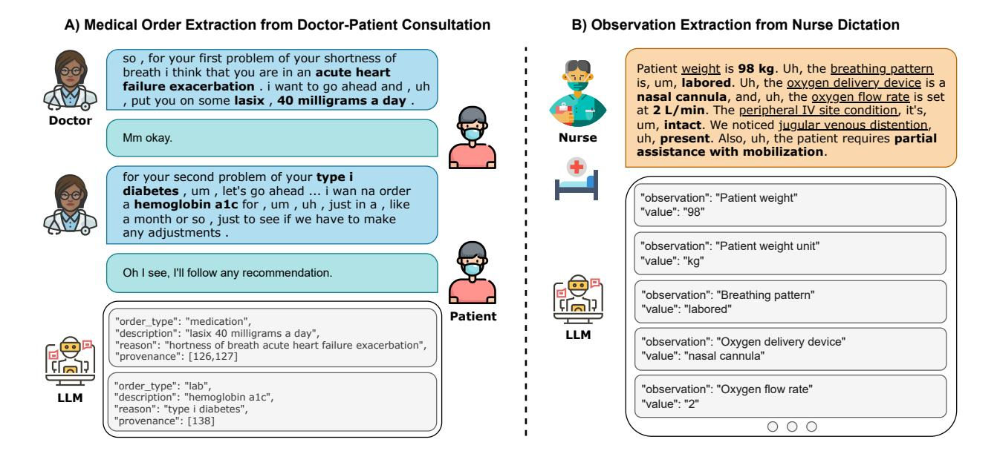
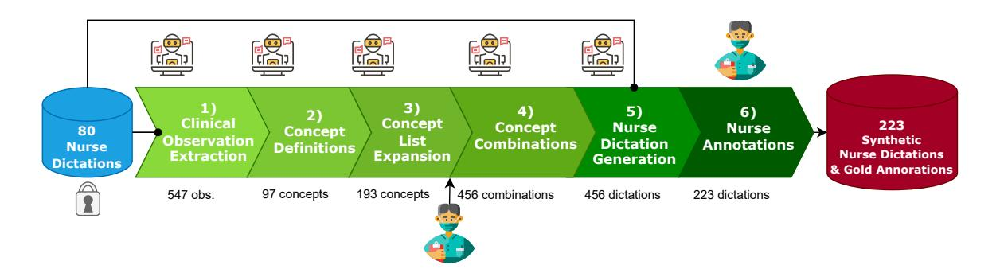
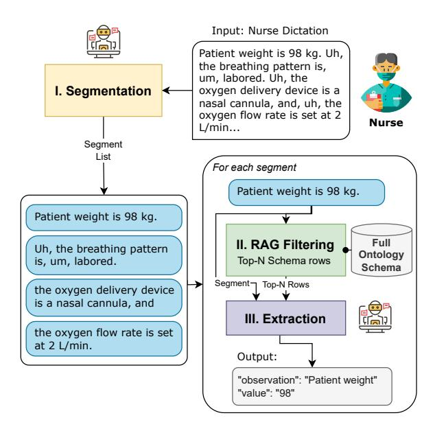

# Empowering Healthcare Practitioners with Language Models: Structuring Speech Transcripts in Two Real-World Clinical Applications

Jean-Philippe Corbeil, Asma Ben Abacha, George Michalopoulos, Phillip Swazinna, Miguel Del-Agua, Jérôme Tremblay, Akila Jeeson Daniel, Cari Bader, Yu-Cheng Cho, Pooja Krishnan, Nathan Bodenstab, Thomas Lin, Wenxuan Teng, Francois Beaulieu, Paul Vozila

Microsoft Healthcare & Life Sciences

Correspondence: [{jcorbeil,abenabacha,georgemi}@microsoft.com](mailto:jcorbeil@microsoft.com)

### Abstract

Large language models (LLMs) such as GPT-4o and o1 have demonstrated strong performance on clinical natural language processing (NLP) tasks across multiple medical benchmarks. Nonetheless, two high-impact NLP tasks — structured tabular reporting from nurse dictations and medical order extraction from doctor-patient consultations — remain underexplored due to data scarcity and sensitivity, despite active industry efforts. Practical solutions to these real-world clinical tasks can significantly reduce the documentation burden on healthcare providers, allowing greater focus on patient care. In this paper, we investigate these two challenging tasks using private and open-source clinical datasets, evaluating the performance of both open- and closed-weight LLMs, and analyzing their respective strengths and limitations. Furthermore, we propose an agentic pipeline for generating realistic, nonsensitive nurse dictations, enabling structured extraction of clinical observations. To support further research in both areas, we release SYNUR and SIMORD, the first open-source datasets for nurse observation extraction and medical order extraction.

### 1 Introduction

Large language models (LLMs), such as GPT-4o [\(Achiam et al.,](#page-6-0) [2023\)](#page-6-0), have rapidly advanced the state of the art across a broad range of natural language processing (NLP) tasks [\(Nori et al.,](#page-8-0) [2023,](#page-8-0) [2024;](#page-8-1) [Ben Abacha et al.,](#page-7-0) [2024\)](#page-7-0), including in the clinical domain. Benchmarks like MedQA [\(Jin](#page-7-1) [et al.,](#page-7-1) [2021\)](#page-7-1), PubMedQA [\(Jin et al.,](#page-7-2) [2019\)](#page-7-2), and MMLU-Medical [\(Hendrycks et al.,](#page-7-3) [2020\)](#page-7-3) have shown that LLMs can achieve strong performance on standardized tasks. However, these benchmarks only scratch the surface of the real-world needs of clinical practice.

Two high-impact clinical NLP tasks remain underexplored: 1) structured reporting from nursing

dictation, and 2) extraction of medical orders from long doctor-patient consultations. Both tasks are critically important in clinical workflows, where artificial intelligence can significantly reduce the documentation burden on healthcare providers and improve time-to-treatment for patients. Despite growing industry interest in this space, the lack of publicly available datasets and the inherent sensitivity of clinical data have limited progress and evaluation.

In this work, we examine the feasibility of LLMbased solutions for two key clinical information extraction tasks, leveraging both proprietary and newly open-source datasets. We provide a practical evaluation of their strengths and limitations using open- and closed-source LLMs, and highlight challenges such as handling long contexts, overflowing flowsheets, interpreting written representations of spoken language, and extracting complex structures. Furthermore, we introduce an agentic data generation pipeline that produces realistic, non-sensitive synthetic data for the nursing observation-extraction task, releasing the first open-source synthetic nursing dataset. Finally, we present the first medical order-extraction dataset, created through new annotations of existing doctorpatient conversations. These datasets offer valuable, realistic resources to complement existing clinical benchmarks and support further research.

This paper makes four key contributions:

- We release the SYNUR dataset, the first opensource SYnthetic NURsing dataset for extracting a wide range of structured observations from spoken nurse dictations[1](#page-0-0) .
- We release the SIMORD dataset, the first open-source SIMulated ORDer dataset for extracting medical orders from doctor-patient simulated transcripts[2](#page-0-1) .

<span id="page-0-1"></span><span id="page-0-0"></span><sup>1</sup> <https://hf.co/datasets/microsoft/SYNUR> 2 <https://hf.co/datasets/microsoft/SIMORD>

<span id="page-1-0"></span>

Figure 1: Examples of our two real-world unstructured-to-structured tasks in clinical settings on spoken transcriptions from healthcare practitioners: A) medical order extraction from doctor-patient dialog, and B) observation extraction from nurse dictation. *Icon attributions in Appendix [A.5](#page-11-0)*.

- On SIMORD, we show that the 3.8Bparameter MediPhi-Instruct attains parity with GPT-4o (two-shot vs. one-shot) and surpasses it on the *description* and *reason* metrics, demonstrating the viability of lightweight open-weight models for this task.
- Using SYNUR and proprietary nursing datasets, we conduct the first systematic study of nursing observation extraction, highlighting challenges posed by long, disfluent dialogues and overflowing flowsheet slots.

### 2 Previous Work

#### 2.1 Nursing

Speech interfaces promise faster, more complete nursing documentation but face challenges such as noise, privacy, and workflow disruption [\(Dinari](#page-7-4) [et al.,](#page-7-4) [2023\)](#page-7-4). Surveys show growing interest in NLP for both nursing notes [\(Mitha et al.,](#page-8-2) [2023\)](#page-8-2) and wider nursing tasks [\(Panchal and Thakur,](#page-8-3) [2024\)](#page-8-3). Yet nurses still chart mainly in electronic health record (EHR) flowsheets, which are large, multitab tables with hundreds of data rows. So, any automation must mesh with that structure.

LLMs can already translate clinical narratives into structured variables with little or no taskspecific training [\(Ling et al.;](#page-8-4) [Dagdelen et al.,](#page-7-5) [2024\)](#page-7-5). Yet their edge over fine-tuned encoder models remains debated [\(Gutiérrez et al.,](#page-7-6) [2022;](#page-7-6) [Ling et al.,](#page-7-7) [2023\)](#page-7-7). Consequently, no existing system simultaneously (i) ingests nurse dictations, (ii) conditions on the local flowsheet context, and (iii) outputs EHR-ready observations.

We target this gap by evaluating closed-weight LLMs in zero- and few-shot settings, trading finetuning for adaptability. The result is a dictationto-flowsheet pipeline that inserts structured observations directly into the nurse's existing charting interface without altering established routines.

### 2.2 Medical Order Extraction

Order extraction is typically framed as a combination of named entity recognition and relation extraction. Early approaches primarily relied on rule-based systems such as MedEx [\(Xu et al.,](#page-8-5) [2010\)](#page-8-5) or support vector machines [\(Doan and Xu,](#page-7-8) [2010\)](#page-7-8). With the advent of contextual word embeddings, fine-tuned encoder models based on pre-trained transformer models such as BERT [\(Devlin et al.,](#page-7-9) [2019\)](#page-7-9) and ClinicalBert [\(Alsentzer et al.,](#page-6-1) [2019\)](#page-6-1) have become the standard, achieving significant performance gains [\(Yang et al.,](#page-8-6) [2020;](#page-8-6) [Fabacher et al.,](#page-7-10) [2025\)](#page-7-10). More recently, the emergence of LLMs has led to a paradigm shift in how these tasks are approached. Instead of span tagging, LLMs enable reformulating the task as a form of reading comprehension. Prompting techniques [\(Peng et al.,](#page-8-7) [2023;](#page-8-7) [Cui et al.,](#page-7-11) [2023;](#page-7-11) [Peng et al.,](#page-8-8) [2024\)](#page-8-8) have demonstrated strong performance on benchmark datasets, including adverse drug events [\(Henry et al.,](#page-7-12) [2020\)](#page-7-12) and social determinants of health [\(Lybarger et al.,](#page-8-9)

<span id="page-2-0"></span>

Figure 2: SYNUR Dataset Creation Pipeline for generating realistic, synthetic nurse dictations with expert nurse annotations, comprising six steps: starting from 80 human-verified, fabricated dictations to final expert annotations. The number below each step represents the final amount of output elements generated at this specific step. The output of one step is the input of the next step, except for step 5 for which we also include 5 randomly sampled examples from the seed dictations. At step 6, the annotators also have access to the schema of step 3 along the synthetic dictation to produce its gold annotations.

[2023\)](#page-8-9). However, extracting orders from long patient–doctor dialogues is largely underexplored, especially the challenge of generating free-form fields (e.g. "description" and "reason") alongside structured ones (e.g. "order type").

## 3 Data Creation Methods

### 3.1 Nursing Datasets

#### 3.1.1 Proprietary Nursing Datasets

Hospital-specific flowsheet schemas contain a list of all rows (keys) in the flowsheet (e.g., pulse rate), the data type associated with the row (e.g. numeric, picklist, etc.), and a list of possible values for picklist rows. The flowsheet schema can include hundreds to thousands of rows and does not include any data specific to any individual patient. In this work, we use the schemas of three different partner hospitals and for each hospital we also use an internal test set. These three test sets total 149 transcripts of rounding remarks dictated by nurses, annotated with 1,788 observations in aggregate.

Finally, we leverage available multishot examples to more explicitly connect rows with their possible verbalizations at extraction time. Each example consists of a transcript and its gold-truth row(s) corresponding to extractable medical observations. We organize examples into a database for each hospital schema and aim to select the best examples at runtime for a given transcript in a retrievalaugmented generation (RAG) setting [\(Lewis et al.,](#page-7-13) [2020\)](#page-7-13).

## 3.1.2 SYNUR: Synthetic Nursing Dataset

We developed SYNUR, a synthetic nursing dataset, using 80 proprietary, fabricated seed dictations that

were reviewed by practicing nurses for realism. Figure [2](#page-2-0) summarizes the six-stage pipeline, which alternates between the domain experts and the *GPT-4o-0806* language model. We also provide all five prompts in Appendix [A.2.](#page-9-0)

Accurate nurse-observation extraction relies on comprehensive ontologies such as LOINC [\(Vree](#page-8-10)[man et al.,](#page-8-10) [2018;](#page-8-10) [McKnight et al.,](#page-8-11) [2019;](#page-8-11) [loi,](#page-6-2) [2025\)](#page-6-2), yet our seed notes did not align properly with LOINC. We therefore created an ontology before synthesizing new data:

- 1. Observation mining: The LLM iteratively extracted observation phrases (e.g., "dark yellow") and linked them to clinical concepts (e.g., "urine colour") from the 80 notes, yielding 547 unique observations.
- 2. Concept consolidation: We distilled these observations into 97 clinical concepts and assigned each a data type among boolean, integer, string, single-choice, or multi-choice.
- 3. Ontology expansion: Leveraging the model's medical knowledge, we asked it to propose additional concepts with example phrasings, expanding the ontology to 193 concepts, which an experienced nurse then validated and corrected.
- 4. Scenario generation: We prompted the LLM with the final concept set to craft coherent patient-case rationale and compatible observation combinations.
- 5. Dictation synthesis: Each scenario along with 5 randomly sampled seed dictations are passed to the LLM to generate a realistic nurse

dictation that includes natural speech disfluencies and on-the-fly corrections.

6. Gold-standard labeling: Expert nurse annotators verified the synthetic transcripts, and produced reference annotations using the ontology build at step 3 for a total of 223 dictations that contain 3000 observations.

The same expert annotators labeled the real hospital sets and SYNUR.

### 3.1.3 Quantitative Assessments of SYNUR

Statistics We compare the statistics of SYNUR to the hospital datasets in Table [1.](#page-3-0) We note that SYNUR is considerably larger at 223 samples, and its dictations tend to be longer — i.e., 185 tokens on average compared to a maximum of 88 tokens.

Table 1: Nursing dataset statistics.

<span id="page-3-0"></span>

|              | H1 | H2 | H3 | SYNUR |
|--------------|----|----|----|-------|
| Dataset Size | 49 | 50 | 50 | 223   |
| AVG length   | 88 | 28 | 61 | 185   |

LLM-as-a-Judge In Table [2,](#page-3-1) we compare our hospital datasets with SYNUR using LLM-as-ajudge [\(Zheng et al.,](#page-8-12) [2023\)](#page-8-12) based on two criteria: quality (1-4) and realism (1-4). We leverage GPT-5 for this assessment. We observe that all scores are close to 3 which is considered high quality and realistic. We provide the prompt in Appendix [A.3.](#page-10-0)

<span id="page-3-1"></span>Table 2: Average LLM-as-a-Judge scores to compare SYNUR to the three hospital datasets.

|         | H1   | H2   | H3   | SYNUR |
|---------|------|------|------|-------|
| Quality | 2.98 | 2.98 | 3.08 | 3.14  |
| Realism | 3.35 | 3.44 | 3.34 | 2.88  |
| AVG     | 3.16 | 3.21 | 3.21 | 3.01  |

Inter-Annotator Agreement We provided a random sample of 10% of the SYNUR dataset to two of our expert annotators, and we measured an accuracy of 86.8% with a Cohen's kappa of 0.634, which points at a significant agreement.

#### 3.2 Medical Order Dataset

### 3.2.1 Doctor-Patient Consultation Datasets

The long-form doctor-patient conversations used for the order-extraction task are primarily drawn from two datasets: ACI-Bench [\(Yim et al.,](#page-8-13) [2023\)](#page-8-13) and PriMock57 [\(Papadopoulos Korfiatis et al.,](#page-8-14) [2022\)](#page-8-14). The ACI-Bench corpus comprises 207 naturalistic conversations between physicians and patients, curated by domain experts to reflect realworld clinical interactions. Similarly, the Pri-Mock57 dataset contains 57 mock doctor-patient dialogues, designed to simulate clinical scenarios in a controlled setting. Recent works such as Notechat [\(Wang et al.,](#page-8-15) [2024\)](#page-8-15) has introduced large-scale synthetic dialogue datasets. While this corpus is the largest, we excluded it due to the prevalence of low-quality dialogues we observed.

### 3.2.2 SIMORD: Simulated Orders Dataset

We asked medically trained annotators to produce the gold-standard medical orders for the high-quality conversations of Primock57 and ACI-Bench. Annotation guidelines instructed to assess every medical order of type medication, imaging, lab, or follow-up within the conversation the way a doctor would create them in the EHR. This was intended to replicate doctors' current process executed at the end of a patient encounter. We measured an inter-annotator agreement of 0.768. We sampled 100 examples containing 255 medical orders across both data sources as a test set and kept the others as training set (64 samples) used for few-shot prompting. Using the same methodology, we constructed an additional test set, which was used in the MEDIQA-OE Shared Task to evaluate participants' systems [\(Corbeil et al.,](#page-7-14) [2025\)](#page-7-14).

### 4 Experiments & Results

### 4.1 Nurse Observation Extraction

<span id="page-3-2"></span>

Figure 3: Three-step method for the nurse observation extraction task.

<span id="page-4-2"></span>

| Table 3: Nursing results across hospitals (H) and SYNUR for closed-weight LLMs. Best values are in bold. |  |  |                |  |  |  |  |               |  |  |  |
|----------------------------------------------------------------------------------------------------------|--|--|----------------|--|--|--|--|---------------|--|--|--|
|                                                                                                          |  |  | Zero-Shot (f1) |  |  |  |  | Few-Shot (f1) |  |  |  |
|                                                                                                          |  |  |                |  |  |  |  |               |  |  |  |

|                  | Zero-Shot (f1) |      |      |      |      | Few-Shot (f1) |      |      |      |
|------------------|----------------|------|------|------|------|---------------|------|------|------|
| Dataset<br>Model | SYNUR          | H1   | H2   | H3   | Havg | H1            | H2   | H3   | Havg |
| 4o               | 88.3           | 85.4 | 86.6 | 88.4 | 86.8 | 90.7          | 91.6 | 89.6 | 90.6 |
| 4o-mini          | 75.6           | 81.0 | 81.7 | 81.8 | 81.5 | 88.4          | 90.8 | 88.2 | 89.1 |
| 4.1              | 86.7           | 88.2 | 87.6 | 89.6 | 88.5 | 91.2          | 93.6 | 92.4 | 92.4 |
| 4.1-mini         | 84.5           | 84.1 | 84.7 | 88.4 | 85.7 | 88.9          | 93.0 | 90.4 | 90.8 |

### 4.1.1 Methodology

The schema of our nursing approach is displayed in Figure [3.](#page-3-2) It takes in a nurse's spoken assessment and then automatically populates the flowsheet by using an LLM to guide the extraction of key elements. Since flowsheets overflow most LLMs' context windows[3](#page-4-0) , our approach contains three sub-tasks: (i) Segmentation: The segmentation step splits the streaming nurse transcript into medically coherent, continuous and non-overlapping segments via an LLM — prompt in Appendix [A.1.](#page-9-1) (ii) RAG: We minimize the size of the schema by filtering potential rows to the top N candidates given the current segment based on cosine similarity. (iii) Extraction: Finally, we use this prompt in Appendix [A.1](#page-9-1) with an LLM to extract the relevant text from the transcript segment and canonicalize it based on the (now reduced) schema.

# 4.1.2 Results

To identify how different language models affect the performance of our nursing approach, we experimented with four closed-weight LLMs[4](#page-4-1) : (i) GPT-4o (ii) GPT-4o-mini (iii) GPT-4.1 (iv) GPT-4.1-mini. For all models we use the same prompt and we evaluate the ability of each model to correctly extract the flowsheet-relevant clinical facts from each transcript. In particular, we calculate the f1 score for each experiment.

In Table [3,](#page-4-2) we can observe that the GPT-4.1 model consistently outperforms all other models across all proprietary datasets. However, it seems that GPT-4o achieved the best performance in the synthetic experiments, possibly because we use the same model to generate SYNUR. Furthermore, these experiments highlight the positive effect of including examples in the extraction prompt, as all models can achieve a higher f1.

Error Analysis By examining misclassifications, we can identify two error categories. In particular, models struggle with (i) identifying the value on a medical scale that corresponds to a given situation (ii) inferring a missing medical identifier.

For SYNUR, we observe comparable performances except for 4o-mini for which the variations might be caused by the coarser-grained schema, longer dictations and variations in the speech style, e.g. more hesitations. Thus, future works could leverage real nurse dictations and build a large nursing observation ontology. Nonetheless, human verifications of SYNUR's schema and synthetic dictations mentioned high quality as well as high similarity to real data.

#### 4.2 Medical Order Extraction

### 4.2.1 Methodology

The goal of the medical order-extraction task is to evaluate the performance of various language models in extracting structured orders from conversations between a patient and a physician. Each system is provided with a prompt that describes in detail the instructions to follow to generate a set of orders (see Appendix [A.1\)](#page-9-1). Each order must contain the following four attributes: i) Description: A concise summary of the order. ii) Reason (optional): The motivation behind the order. iii) Type: A categorical label indicating the nature of the order: medication, laboratory, follow-up, or imaging. iv) Provenance: The source or origin of the order. It is made up of a list of conversation line numbers where the order was prescribed. The output format is standardized as JSON, ensuring consistency and ease of downstream processing.

We tested five closed-weight LLMs for this task: i) GPT-4o, OpenAI's multimodal flagship model [\(Achiam et al.,](#page-6-0) [2023\)](#page-6-0). ii) GPT-4.1, a refined version of GPT-4. iii) o1-mini, a lightweight reasoning model optimized for speed and cost. iv) o1 prev, the preview version of o1. v) o3-mini, a newer compact model with enhanced reasoning. Also, we experimented with open-weight language

<span id="page-4-0"></span><sup>3</sup>With related issues such as lost-in-the-middle [\(Liu et al.,](#page-8-16) [2024\)](#page-8-16).

<span id="page-4-1"></span><sup>4</sup>Open-weight models were excluded because of compatibility considerations.

models including Phi3.5-mini-instruct (3.8B) (Abdin et al., 2024) and its medical variant Mediphi-Instruct (Corbeil, 2024) as well as Llama3-8B-instruct (Dubey et al., 2024) and its medical variant Llama3-Med42-8B (Christophe et al., 2024)

Each model was prompted with identical inputs in both zero-shot and few-shot settings, and evaluated on the quality, completeness, and consistency of the extracted orders.

#### 4.2.2 Evaluation Metrics

We evaluate model performance across five key metrics: Match, Description, Reason, Type, and **Provenance**. Results are reported after matching for each transcript reference and hypothesis orders based on description word overlap — necessary to compare orders with each other. The Match score is computed from this alignment process as the F1 between reference and predicted orders without looking at the content, thus specifically accounting for the amount of fabricated or omitted orders. For **Description** and **Reason**, we compute unigram overlap F1 score using ROUGE (Lin, 2004). Type is evaluated using micro F1 score due to its finite set of discrete labels, and Provenance is assessed via F1 score over provenance indices<sup>5</sup>. The match score is the upper bound of the other metrics that are penalized by our precision/recall aggregation method accounting for empty values as demonstrated in Appendix A.4.

#### 4.2.3 Results for Closed-Weight LLMs

As shown in Table 4, no single closed-weight model consistently outperforms others across all metrics and settings. For instance, in the zeroshot setting, model 40 achieves the highest score in **Description** (38.5%) and **Type** (66.1%), while o1-mini leads in **Provenance** (43.2%). When examples are introduced, 40 again performs best in **Description** (42.8%), o1-mini in **Reason** (26.6%), and o3-mini in **Type** (66.8%). If we compare the **Type** scores to their upper-bound **Match** scores, we note that the gaps across closed-weight models are only of a couple percentage points indicating the ease of attributing a type. When we observe the **Description** scores in relation to the **Match** scores, we generally note a gap of more than 30% suggesting room for improvement in **Description** generation. Similarly, the **Match** scores are also more than 30% below a perfect extraction indicating the presence of fabricated or omitted orders. We observed one

<span id="page-5-1"></span>Table 4: Results on SIMORD for open- and closed-weight LLMs with reasoning and few-shot variants. *Desc* and *Prov* are short for *Description* and *Provenance*, respectively. Best values in **bold**.

|        | Model            | Match | Desc     | Reason  | Type | Prov |  |  |
|--------|------------------|-------|----------|---------|------|------|--|--|
|        | zero shot        |       |          |         |      |      |  |  |
|        | Phi3.5           | 56.0  | 26.3     | 11.5    | 51.9 | 18.3 |  |  |
| oben   | MP-Inst          | 42.2  | 28.4     | 17.6    | 39.6 | 11.2 |  |  |
| ор     | Llama3           | 61.8  | 41.8     | 21.5    | 59.3 | 9.5  |  |  |
|        | Med42            | 55.1  | 36.5     | 25.4    | 54.0 | 14.3 |  |  |
|        | 4o               | 68.2  | 38.5     | 17.4    | 66.1 | 1.1  |  |  |
| ಶ್     | 4.1              | 67.0  | 30.7     | 12.1    | 65.2 | 1.1  |  |  |
| closed | o1-mini          | 66.5  | 30.2     | 23.3    | 64.1 | 43.2 |  |  |
| ਾ      | o1-prev          | 55.0  | 28.1     | 17.0    | 53.8 | 13.4 |  |  |
|        | o3-mini          | 66.5  | 30.8     | 9.7     | 64.9 | 24.1 |  |  |
|        | with one example |       |          |         |      |      |  |  |
|        | Phi3.5           | 64.5  | 41.4     | 20.7    | 60.6 | 8.6  |  |  |
| oben   | MP-Inst          | 61.0  | 45.7     | 32.6    | 59.3 | 9.8  |  |  |
| ор     | Llama3           | 56.9  | 40.8     | 29.2    | 55.3 | 8.2  |  |  |
|        | Med42            | 65.2  | 48.3     | 35.8    | 64.4 | 9.7  |  |  |
|        | 4o               | 67.9  | 42.8     | 21.8    | 66.1 | 0.5  |  |  |
| 덩      | 4.1              | 67.6  | 33.0     | 12.7    | 66.0 | 1.2  |  |  |
| closed | o1-mini          | 66.1  | 35.8     | 26.6    | 64.2 | 37.8 |  |  |
| ਾਹ     | o1-prev          | 65.2  | 40.2     | 24.6    | 63.5 | 14.8 |  |  |
|        | o3-mini          | 69.2  | 39.3     | 12.4    | 66.8 | 26.9 |  |  |
|        |                  | wi    | th two e | xamples |      |      |  |  |
|        | Phi3.5           | 62.2  | 43.5     | 25.3    | 60.4 | 6.3  |  |  |
| oben   | MP-Inst          | 66.3  | 51.9     | 35.7    | 65.4 | 8.7  |  |  |
| ob     | Llama3           | 62.8  | 47.6     | 30.8    | 61.5 | 4.5  |  |  |
|        | Med42            | 63.2  | 49.2     | 37.9    | 62.4 | 9.6  |  |  |

phenomenon that occurs occasionally — especially for lab orders — in which models tend to aggregate orders into one unique order leading to a perceived omission, because doctors often mentioned them sequentially in one dialogue turn.

<span id="page-5-2"></span>Table 5: Average improvements on SIMORD for experiments on closed-weight models between zero-shot base models against one example or reasoning variants.

| Metric    | Desc  | Reason | Type  | Prov  |
|-----------|-------|--------|-------|-------|
| Example   | 6.6%  | 3.8%   | 2.5%  | -0.3% |
| Reasoning | -2.2% | 2.9%   | -3.0% | 25.7% |

Table 5 summarizes the average improvements across metrics when using examples or reasoning closed-weight models. Including a single randomly drawn example from the training set yields modest gains in **Description** (+6.6%), **Reason** (+3.8%), and **Type** (+2.5%). This suggests that examples help models better contextualize and generalize, particularly for free-text fields. A dynamic RAG-based approach (Lewis et al., 2020) could likely further improve on this baseline.

Closed-weight reasoning models show a substantial improvement in **Provenance** (+25.7%), indicating that this task benefits from deeper inference capabilities. However, these models do not show consistent advantages in other metrics, with

<span id="page-5-0"></span><sup>&</sup>lt;sup>5</sup>Turn numbers where the order originates in the transcript.

slight declines in Description and Type, and only a marginal gain in Reason.

A notable practical issue is the variability in parsing reliability across models. Some models, particularly o1-preview and GPT-4.1, frequently produce malformed outputs — especially due to run-on sequences in Provenance predictions which prevent successful JSON parsing. In contrast, models such as 4o, o1-mini, and o3-mini maintain parsing error rates between 0-1%, making them more reliable in deployment scenarios. As future work, constrained decoding [\(Willard and Louf,](#page-8-17) [2023;](#page-8-17) [Beurer-Kellner et al.,](#page-7-19) [2024\)](#page-7-19) might fix such errors with caveats [\(Tam et al.,](#page-8-18) [2024\)](#page-8-18).

### 4.2.4 Results for Open-Weight SLMs

Table [4](#page-5-1) also presents the results for four open-weight language models using greedy decoding with a temperature 0 and a maximum of 1024 tokens. In the zeroshot setting, Phi-3.5-mini-Instruct (Phi3.5), MediPhi-Instruct (MP-Inst), and Llama3-Med42-8B (Med42) display limited overall performances. Nonetheless, Phi-3.5 records the highest Provenance accuracy among the openweight systems, while Llama-3-8B-Instruct (Llama3) attains Description and Reason scores comparable to GPT-4o and GPT-4.1. Performance improves substantially with in-context learning. With two examples from the training set, MP-Inst achieves the top Description score surpassing GPT-4o and leads the open-weight group on the Match and Type metrics. Under the two-shot configuration, Llama3 attains the highest Reason score.

Overall, we also notice parsing issues across open-weight models. While the zero-shot setting is affected at 10-20%, the few-shot setting is more reliable at 1-4%. Moreover, Provenance remains problematic for open-weight models also because of run-on sequences, highlighting the need for a multi-system solution.

Although comparing GPT-4o with one example to open-weight models with two examples is not strictly equivalent, the contrast remains informative given the large differences in parameter scale, model transparency, and inference latency.

### 5 Conclusion

We explored two clinically relevant NLP tasks: observation extraction from nurse dictations, and order extraction from doctor-patient conversations.

Using both proprietary and open datasets, we evaluated the performances of open- and closed-weight LMs, identifying key strengths and bottlenecks. We introduced both SYNUR, the first synthetic nursing dataset, and SIMORD, the first medical order-extraction dataset. Our results demonstrate that LMs can reduce documentation burden in clinical workflows. These insights support the design and deployment of scalable, LLM-driven solutions in real-world healthcare settings.

## Limitations

While SYNUR helps mitigate data scarcity and sensitivity issues in nurse dictations, synthetic data cannot fully capture the richness and variability of real clinical language. On the methodological side, the nursing codebase — including its two core prompts — cannot be shared in full; however, simplified versions of the segmentation and extraction prompts are provided in Appendix [A.1.](#page-9-1)

The SIMORD dataset is relatively small, with 64 training samples, which constrains its applicability for finetuning. Future work may address this by expanding the dataset or integrating synthetic examples. Although inter-annotator agreement is high, some variability remains in the annotations (e.g., span boundaries and informal conversational phrasing rather than formal writing). Such variation introduces natural noise that may bound achievable performance.

### References

<span id="page-6-2"></span>2025. [LOINC®: Logical observation identifiers names](https://loinc.org/) [and codes.](https://loinc.org/)

<span id="page-6-3"></span>Marah Abdin, Jyoti Aneja, Hany Awadalla, Ahmed Awadallah, Ammar Ahmad Awan, Nguyen Bach, Amit Bahree, Arash Bakhtiari, Jianmin Bao, Harkirat Behl, and 1 others. 2024. Phi-3 technical report: A highly capable language model locally on your phone. *arXiv preprint arXiv:2404.14219*.

<span id="page-6-0"></span>Josh Achiam, Steven Adler, Sandhini Agarwal, Lama Ahmad, Ilge Akkaya, Florencia Leoni Aleman, Diogo Almeida, Janko Altenschmidt, Sam Altman, Shyamal Anadkat, and 1 others. 2023. Gpt-4 technical report. *arXiv preprint arXiv:2303.08774*.

<span id="page-6-1"></span>Emily Alsentzer, John Murphy, William Boag, Wei-Hung Weng, Di Jin, Tristan Naumann, and Matthew McDermott. 2019. [Publicly available clinical BERT](https://doi.org/10.18653/v1/W19-1909) [embeddings.](https://doi.org/10.18653/v1/W19-1909) In *Proceedings of the 2nd Clinical Natural Language Processing Workshop*, pages 72–78, Minneapolis, Minnesota, USA. Association for Computational Linguistics.

- <span id="page-7-0"></span>Asma Ben Abacha, Wen-wai Yim, Yujuan Fu, Zhaoyi Sun, Meliha Yetisgen, Fei Xia, and Thomas Lin. 2024. Medec: A benchmark for medical error detection and correction in clinical notes. *arXiv preprint arXiv:2412.19260*.
- <span id="page-7-19"></span>Luca Beurer-Kellner, Marc Fischer, and Martin Vechev. 2024. Guiding llms the right way: fast, non-invasive constrained generation. In *Proceedings of the 41st International Conference on Machine Learning*, pages 3658–3673.
- <span id="page-7-17"></span>Clément Christophe, Praveen K Kanithi, Tathagata Raha, Shadab Khan, and Marco AF Pimentel. 2024. Med42-v2: A suite of clinical llms. *arXiv preprint arXiv:2408.06142*.
- <span id="page-7-15"></span>Jean-Philippe Corbeil. 2024. Iryonlp at mediqa-corr 2024: Tackling the medical error detection & correction task on the shoulders of medical agents. In *Proceedings of the 6th Clinical Natural Language Processing Workshop*, pages 570–580.
- <span id="page-7-14"></span>Jean-Philippe Corbeil, Asma Ben Abacha, Jérôme Tremblay, Phillip Swazinna, Akila Jeeson Daniel, Miguel Del-Agua, and François Beaulieu. 2025. Overview of the mediqa-oe 2025 shared task on medical order extraction from doctor-patient conversations. In *Proceedings of the 7th Clinical Natural Language Processing Workshop*. Association for Computational Linguistics.
- <span id="page-7-11"></span>Yang Cui, Lifeng Han, and Goran Nenadic. 2023. Medtem2. 0: Prompt-based temporal classification of treatment events from discharge summaries. In *Proceedings of the 61st Annual Meeting of the Association for Computational Linguistics (Volume 4: Student Research Workshop)*, pages 160–183.
- <span id="page-7-5"></span>John Dagdelen, Alexander Dunn, Sanghoon Lee, Nicholas Walker, Andrew S. Rosen, Gerbrand Ceder, Kristin A. Persson, and Anubhav Jain. 2024. [Struc](https://doi.org/10.1038/s41467-024-45563-x)[tured information extraction from scientific text with](https://doi.org/10.1038/s41467-024-45563-x) [large language models.](https://doi.org/10.1038/s41467-024-45563-x) *Nature Communications*, 15(1):1418.
- <span id="page-7-9"></span>Jacob Devlin, Ming-Wei Chang, Kenton Lee, and Kristina Toutanova. 2019. Bert: Pre-training of deep bidirectional transformers for language understanding. In *Proceedings of the 2019 conference of the North American chapter of the association for computational linguistics: human language technologies, volume 1 (long and short papers)*, pages 4171–4186.
- <span id="page-7-4"></span>Fatemeh Dinari, Kambiz Bahaadinbeigy, Somayyeh Bassiri, Esmat Mashouf, Saiyad Bastaminejad, and Khadijeh Moulaei. 2023. Benefits, barriers, and facilitators of using speech recognition technology in nursing documentation and reporting: A crosssectional study. *Health science reports*, 6(6):e1330.
- <span id="page-7-8"></span>Son Doan and Hua Xu. 2010. Recognizing medication related entities in hospital discharge summaries using support vector machine. In *Proceedings of COLING. International conference on computational linguistics*, volume 2010, page 259.

- <span id="page-7-16"></span>Abhimanyu Dubey, Abhinav Jauhri, Abhinav Pandey, Abhishek Kadian, Ahmad Al-Dahle, Aiesha Letman, Akhil Mathur, Alan Schelten, Amy Yang, Angela Fan, and 1 others. 2024. The llama 3 herd of models. *arXiv preprint arXiv:2407.21783*.
- <span id="page-7-10"></span>Thibaut Fabacher, Erik-André Sauleau, Emmanuelle Arcay, Bineta Faye, Maxime Alter, Archia Chahard, Nathan Miraillet, Adrien Coulet, and Aurélie Névéol. 2025. [Efficient extraction of medication information](https://arxiv.org/abs/2502.03257) [from clinical notes: an evaluation in two languages.](https://arxiv.org/abs/2502.03257) *Preprint*, arXiv:2502.03257.
- <span id="page-7-6"></span>Bernal Jiménez Gutiérrez, Nikolas McNeal, Clayton Washington, You Chen, Lang Li, Huan Sun, and Yu Su. 2022. Thinking about gpt-3 in-context learning for biomedical ie? think again. In *Findings of the Association for Computational Linguistics: EMNLP 2022*, pages 4497–4512.
- <span id="page-7-3"></span>Dan Hendrycks, Collin Burns, Steven Basart, Andy Zou, Mantas Mazeika, Dawn Song, and Jacob Steinhardt. 2020. Measuring massive multitask language understanding. In *International Conference on Learning Representations*.
- <span id="page-7-12"></span>Sam Henry, Kevin Buchan, Michele Filannino, Amber Stubbs, and Ozlem Uzuner. 2020. 2018 n2c2 shared task on adverse drug events and medication extraction in electronic health records. *Journal of the American Medical Informatics Association*, 27(1):3–12.
- <span id="page-7-1"></span>Di Jin, Eileen Pan, Nassim Oufattole, Wei-Hung Weng, Hanyi Fang, and Peter Szolovits. 2021. What disease does this patient have? a large-scale open domain question answering dataset from medical exams. *Applied Sciences*, 11(14):6421.
- <span id="page-7-2"></span>Qiao Jin, Bhuwan Dhingra, Zhengping Liu, William Cohen, and Xinghua Lu. 2019. Pubmedqa: A dataset for biomedical research question answering. In *Proceedings of the 2019 Conference on Empirical Methods in Natural Language Processing and the 9th International Joint Conference on Natural Language Processing (EMNLP-IJCNLP)*, pages 2567–2577.
- <span id="page-7-13"></span>Patrick Lewis, Ethan Perez, Aleksandra Piktus, Fabio Petroni, Vladimir Karpukhin, Naman Goyal, Heinrich Küttler, Mike Lewis, Wen-tau Yih, Tim Rocktäschel, and 1 others. 2020. Retrieval-augmented generation for knowledge-intensive nlp tasks. *Advances in Neural Information Processing Systems*, 33:9459–9474.
- <span id="page-7-18"></span>Chin-Yew Lin. 2004. [ROUGE: A package for auto](https://aclanthology.org/W04-1013/)[matic evaluation of summaries.](https://aclanthology.org/W04-1013/) In *Text Summarization Branches Out*, pages 74–81, Barcelona, Spain. Association for Computational Linguistics.
- <span id="page-7-7"></span>Chen Ling, Xujiang Zhao, Jiaying Lu, Chengyuan Deng, Can Zheng, Junxiang Wang, Tanmoy Chowdhury, Yun Li, Hejie Cui, Xuchao Zhang, and 1 others. 2023. Domain specialization as the key to make large language models disruptive: A comprehensive survey. *arXiv preprint arXiv:2305.18703*.

- <span id="page-8-4"></span>Chen Ling, Xujiang Zhao, Xuchao Zhang, Yanchi Liu, Wei Cheng, Haoyu Wang, Zhengzhang Chen, Mika Oishi, Takao Osaki, Katsushi Matsuda, and 1 others. Improving open information extraction with large language models: A study on demonstration uncertainty. In *ICLR 2024 Workshop on Reliable and Responsible Foundation Models*.
- <span id="page-8-16"></span>Nelson F Liu, Kevin Lin, John Hewitt, Ashwin Paranjape, Michele Bevilacqua, Fabio Petroni, and Percy Liang. 2024. Lost in the middle: How language models use long contexts. *Transactions of the Association for Computational Linguistics*, 11:157–173.
- <span id="page-8-9"></span>Kevin Lybarger, Meliha Yetisgen, and Özlem Uzuner. 2023. The 2022 n2c2/uw shared task on extracting social determinants of health. *Journal of the American Medical Informatics Association*, 30(8):1367– 1378.
- <span id="page-8-11"></span>Jacob McKnight, Michael L Wilson, Pamela Banning, Chris Paton, Felix Bahati, Mike English, and Ken Fleming. 2019. Effective coding is key to the development and use of the who essential diagnostics list. *The Lancet Digital Health*, 1(8):e387–e388.
- <span id="page-8-2"></span>Shazia Mitha, Jessica Schwartz, Mollie Hobensack, Kenrick Cato, Kyungmi Woo, Arlene Smaldone, and Maxim Topaz. 2023. Natural language processing of nursing notes: an integrative review. *CIN: Computers, Informatics, Nursing*, 41(6):377–384.
- <span id="page-8-0"></span>Harsha Nori, Yin Tat Lee, Sheng Zhang, Dean Carignan, Richard Edgar, Nicolo Fusi, Nicholas King, Jonathan Larson, Yuanzhi Li, Weishung Liu, and 1 others. 2023. Can generalist foundation models outcompete special-purpose tuning? case study in medicine. *Medicine*, 84(88.3):77–3.
- <span id="page-8-1"></span>Harsha Nori, Naoto Usuyama, Nicholas King, Scott Mayer McKinney, Xavier Fernandes, Sheng Zhang, and Eric Horvitz. 2024. From medprompt to o1: Exploration of run-time strategies for medical challenge problems and beyond. *arXiv preprint arXiv:2411.03590*.
- <span id="page-8-3"></span>S. Panchal and P. Thakur. 2024. [Harnessing the](https://doi.org/10.21474/IJAR01/18697) [power of natural language processing in nursing ser](https://doi.org/10.21474/IJAR01/18697)[vices.](https://doi.org/10.21474/IJAR01/18697) *International Journal of Advanced Research*, 12(5):154–156.
- <span id="page-8-14"></span>Alex Papadopoulos Korfiatis, Francesco Moramarco, Radmila Sarac, and Aleksandar Savkov. 2022. [Pri-](https://doi.org/10.18653/v1/2022.acl-short.65)[Mock57: A dataset of primary care mock consul](https://doi.org/10.18653/v1/2022.acl-short.65)[tations.](https://doi.org/10.18653/v1/2022.acl-short.65) In *Proceedings of the 60th Annual Meeting of the Association for Computational Linguistics (Volume 2: Short Papers)*, pages 588–598, Dublin, Ireland. Association for Computational Linguistics.
- <span id="page-8-8"></span>Cheng Peng, Xi Yang, Kaleb E Smith, Zehao Yu, Aokun Chen, Jiang Bian, and Yonghui Wu. 2024. [Model](https://doi.org/10.1016/j.jbi.2024.104630) [tuning or prompt tuning? a study of large language](https://doi.org/10.1016/j.jbi.2024.104630) [models for clinical concept and relation extraction.](https://doi.org/10.1016/j.jbi.2024.104630) *Journal of Biomedical Informatics*, 153:104630.

- <span id="page-8-7"></span>Cheng Peng, Xi Yang, Zehao Yu, Jiang Bian, William R Hogan, and Yonghui Wu. 2023. Clinical concept and relation extraction using prompt-based machine reading comprehension. *Journal of the American Medical Informatics Association*, 30(9):1486–1493.
- <span id="page-8-18"></span>Zhi Rui Tam, Cheng-Kuang Wu, Yi-Lin Tsai, Chieh-Yen Lin, Hung-yi Lee, and Yun-Nung Chen. 2024. [Let me speak freely? a study on the impact of format](https://doi.org/10.18653/v1/2024.emnlp-industry.91) [restrictions on large language model performance.](https://doi.org/10.18653/v1/2024.emnlp-industry.91) In *Proceedings of the 2024 Conference on Empirical Methods in Natural Language Processing: Industry Track*, pages 1218–1236, Miami, Florida, US. Association for Computational Linguistics.
- <span id="page-8-10"></span>Daniel J Vreeman, Swapna Abhyankar, Kenneth C Wang, Christopher Carr, Beverly Collins, Daniel L Rubin, and Curtis P Langlotz. 2018. The loinc rsna radiology playbook-a unified terminology for radiology procedures. *Journal of the American Medical Informatics Association*, 25(7):885–893.
- <span id="page-8-15"></span>Junda Wang, Zonghai Yao, Zhichao Yang, Huixue Zhou, Rumeng Li, Xun Wang, Yucheng Xu, and Hong Yu. 2024. [NoteChat: A dataset of synthetic patient](https://doi.org/10.18653/v1/2024.findings-acl.901)[physician conversations conditioned on clinical notes.](https://doi.org/10.18653/v1/2024.findings-acl.901) In *Findings of the Association for Computational Linguistics: ACL 2024*, pages 15183–15201, Bangkok, Thailand. Association for Computational Linguistics.
- <span id="page-8-17"></span>Brandon T Willard and Rémi Louf. 2023. Efficient guided generation for large language models. *arXiv preprint arXiv:2307.09702*.
- <span id="page-8-5"></span>Hua Xu, Shane P Stenner, Son Doan, Kevin B Johnson, Lemuel R Waitman, and Joshua C Denny. 2010. [Medex: a medication information extraction system](https://doi.org/10.1197/jamia.M3378) [for clinical narratives.](https://doi.org/10.1197/jamia.M3378) *Journal of the American Medical Informatics Association*, 17(1):19–24.
- <span id="page-8-6"></span>Xi Yang, Jiang Bian, William R Hogan, and Yonghui Wu. 2020. Clinical concept extraction using transformers. *Journal of the American Medical Informatics Association*, 27(12):1935–1942.
- <span id="page-8-13"></span>Wen-wai Yim, Yujuan Fu, Asma Ben Abacha, Neal Snider, Thomas Lin, and Meliha Yetisgen. 2023. Acibench: a novel ambient clinical intelligence dataset for benchmarking automatic visit note generation. *Scientific data*, 10(1):586.
- <span id="page-8-12"></span>Lianmin Zheng, Wei-Lin Chiang, Ying Sheng, Siyuan Zhuang, Zhanghao Wu, Yonghao Zhuang, Zi Lin, Zhuohan Li, Dacheng Li, Eric Xing, and 1 others. 2023. Judging llm-as-a-judge with mt-bench and chatbot arena. *Advances in Neural Information Processing Systems*, 36:46595–46623.

### A Appendix

### <span id="page-9-1"></span>A.1 Prompts for Methods

#### Simplified Nursing Segmentation Prompt

Given an input TRANSCRIPT of a nurse's observations about a patient, your task is to divide the input TRANSCRIPT into contiguous SEGMENTS, based on clinical facts.

A clinical fact refers to specific, verifiable information related to the health of a patient.

TRANSCRIPT: %TRANSCRIPT% SEGMENTS:

### Simplified Nursing Extraction Prompt

You are an expert at medical electronic health record flowsheet analysis.

Below is a TRANSCRIPT from a nurse dictation along with a flowsheet SCHEMA. Please extract the clinical observations from the TRANSCRIPT in strict, parsable JSON adhering to SCHEMA.

... SCHEMA: %SCHEMA% TRANSCRIPT: %TRANSCRIPT%

OUTPUT:

#### Order Extraction Prompt

Act as if you are an experienced medical scribe. Based on the provided transcript, you must document the orders that are being placed for the patient.

You must provide as output an array of json objects where each object is an order from the doctor. Each order object should have keys for: description, order\_type, reason, provenance.

An example order json object is: {'description': 'CT of Chest', 'order\_type': 'imaging', 'reason':'infection',

'provenance': [45, 46]}

The description is a textual description related to one specific order mentioned by the doctor. It is the concatenation of doctor's text spans related to the order. The order\_type options are "medication", "lab", "followup", "imaging". The reason is one sentence explaining the diagnosis leading to that order. The provenance is a list of line numbers where the different text spans in the order are extracted from.

The output must be a list of json objects. If there are no orders in the transcript, you should provide an empty array as output. You absolutely need to limit your output to 4000 tokens.

===CURRENT ORDER EXTRACTION===

—DOCTOR TRANSCRIPT—

#### <span id="page-9-0"></span>A.2 SYNUR Generation Prompts

### Step 1 - Clinical Observation Extraction

You are top entity extractor in clinical documents, very precise and very thorough in its work.

You will receive a speech description of a patient case as input. Your task is to extract a JSON array of fine-grained entity names. You must extract the finegrained concept names from the speech description in JSON array with JSON objects containing two keys: concept and text\_span. You have a pool of encountered concepts from other speech description. You must use these concepts from the CONCEPT POOL or create a new concept that defines better an observation from a text span. Examples of concepts are provided to make you understand the level of abstraction overall. It should be fine-grained, i.e. small groups of possible values encompass by one concept.

–EXAMPLE OF CONCEPTS–

Here are examples of concepts with potential observation forms.

%EXAMPLES%

–EXAMPLE JOB–

SPEECH DESCRIPTION

Patient abdomen is soft rounded and tenderness is present. All other body systems within defined limits. Blood pressure is 127/66.

OUTPUT

[

{ "concept": "Abdomen exam", "span": "abdomen is soft rounded and tenderness is present" },

{ "concept": "General physical exam", "span": "All other body systems within defined limits" },

{ "concept": "Blood pressure", "span": "Blood pressure is 127/66" }

]

–CONCEPT POOL–

%CONCEPT\_POOL%

–CURRENT JOB–

SPEECH DESCRIPTION

%CONCEPT\_POOL%

OUTPUT

#### Step 2 - Concept Definitions

You are top clinical semantic expert in medical and clinical knowledge, very precise and very thorough in its work. You will receive a concept with obsversations of this concept from real clinical documentations. You task is to clean observations into actual set of values for the concept. Concept a have a type in: boolean, numeric, multiple\_selection, single\_selection, and string. If the concept type is one of the selection types, you must create a set of valid values and coherent among themselves for the concept. You can fill missing possible values from observations. If the concept type is boolean, numeric or string, you must simply return concept and type. Be careful, you must not consider numeric classification systems like pain, orientation, etc. These are single selection type. You must return a JSON object with concept (required), type (required) and values

(optional). CONCEPT %CONCEPT% OBSERVATIONS %OBSERVATIONS% OUTPUT

### Step 3 - Concept List Expansion

Here's a list of concepts in clinical documents. % CONCEPTS %

Are there missing concepts?

#### Step 4 - Concept Combinations

You are top clinical semantic expert in medical and clinical knowledge, very precise and very thorough in its work. You will receive a set of possible clinical concepts in a JSON array. Your job is to create a JSON object as output containing a rationale and a concept\_list. The rationale is a description of a realistic clinical case about a patient. The concept\_list is a JSON array which represents a realistic patient case of a combination of concepts which would be contained a note coming from a nurse's complete speech transcription. You must provide from a few up to several concepts with "concept" and "value" as keys, which are concept along their actual observed value respectively. You must be creative, making unique combinations while maintaining a strong rigor by focusing solely on giving set of concepts.

EXAMPLE OF OUTPUT

OUTPUT

"rationale": "1) This clinical case brings together a realistic and medically coherent set of findings that reflect a plausible presentation of nephrolithiasis with associated complications. The inclusion of right flank pain rated 7 out of 10, described as stabbing, aligns well with typical symptoms of renal colic, particularly from a 2 mm urinary stone, ...",

```
"concept_list": [
{"concept": "Pain severity", "value": "7 out of 10"},
{"concept": "Pain description", "value": "stabbing pain"},
{"concept": "Urinary stone", "value": "True"}
SET OF CONCEPTS
%CONCEPT_SET%
```

#### Step 5 - Nurse Dictation Generation

You are a professional medical writer which is an expert in clinical documents and transcripts with deep understanding of nurse speaking patterns and mindset. I will give you five examples of nurse speech transcripts as examples of style to consider in your creation. I will also provide you a list of concepts that are present in the speech transcript. You must output in plain text a highly realistic nurse speech transcript which is a dictation about a patient state. You must comply with the concept list and include all of the concepts in natural speech as mentions by the nurse. You must from time to time introduce realistic speech patterns like hesitations, speech phrasing, live revisions of words, etc. To keep the realism, you must avoid long, unnatural explanations if not needed since the speech transcripts are notes, but you can introduce natural and necessary ones.

EXAMPLE NURSE SPEECH TRANSCRIPT % TRANSCRIPT % CONCEPT LIST IN SPEECH % CONCEPT LIST % OUTPUT

#### <span id="page-10-0"></span>A.3 SYNUR LLM-as-a-Judge Validation

#### SYNUR LLM-as-a-Judge Prompt

You are an expert at medical EHR Flowsheet data analysis who answers in strict, parsable JSON.

You will be given a transcript that a nurse could have created.

Your task is to give a critical assessment of the transcript as a nested JSON object.

For each criteria as a key, the value is a JSON object containing a "rationale" along a "score" on a scale of 1 to 4.

The criteria are: quality and realism.

You will be provided with instructions and examples to complete the task.

Instructions:

Quality

- 1: The transcript is very low quality and is incoherent. The intended clinical content cannnot be inferred.
- 2: The transcript is of medium quality and is somewhat coherent. The intended clinical content can be partially inferred.
- 3: The transcript is high quality and is generally coherent. The intended clinical content can be mostly inferred.
- 4: The transcript is of very high quality, high clarity and is fully coherent. The intended clinical content can be inferred.

#### Realism

- 1: The transcript is not realistic, presenting a situation that is not feasible in a real-world context.
- 2: The transcript is somewhat realistic, but some aspects may be overly simplified or neglect real-world constraints.
- 3: The transcript is realistic, but one or two minor aspects may not fully account for practical nuances.
- 4: The transcript is entirely realistic and likely to be created by a nurse. The style mirrors typical nursing flowsheet documentation.

The following Example Transcripts are real transcript that were provided by nurses. Example Transcripts: %EXAMPLE\_TRANSCRIPTS%

REMINDER:

The JSON answer should ALWAYS have the following format.

```
OUTPUT FORMAT:
```

```
{
"quality": {"rationale": "string", "score": "integer"},
"realism": {"rationale": "string", "score": "integer"}
}
```

This is really important for Healthcare worker, please do your best to accomplish this task!

Transcript:

%TRANSCRIPT%

Now it's time to complete the task. Remember valid scores are: 1, 2, 3 and 4.

OUTPUT:

## <span id="page-10-1"></span>A.4 Aggregation Method of Evaluation Metrics used for SIMORD

We evaluate the Description, Reason, Type, and Provenance metrics at the order level. To do this, we first align reference orders with predicted orders at the transcript level maximizing the unigram overlap. Any reference or predicted order that

does not find a match is assigned a generic *missing order*. Finally, we combine all matched reference–prediction pairs into a single list and compute precision and recall, treating the *missing orders* as errors. We formalize this computation in the equations below.

Let  $O_{\mathrm{ref}}$  and  $O_{\mathrm{pred}}$  be the sets of reference and predicted orders. Let  $M \subseteq O_{\mathrm{ref}} \times O_{\mathrm{pred}}$  be the set of matched order pairs with  $|M| = TP_o$ . Let  $U_p$  be unmatched predicted orders  $(FP_o = |U_p|)$  and  $U_r$  unmatched reference orders  $(FN_o = |U_r|)$ .

Let's first consider the **Description** and **Reason** based on ROUGE-1 (Lin, 2004), but the same derivation is also valid for both **Type** and **Provenance** metrics. For each matched pair  $m \in M$ , define the unigram precision and recall on the corresponding sentence pair:

$$P_m = \frac{TP_m}{TP_m + FP_m}, \ R_m = \frac{TP_m}{TP_m + FN_m}$$
 (1)

and the F1 score is defined as

$$F1_m = \frac{2P_m R_m}{P_m + R_m}. (2)$$

Define the aggregated precision and recall as

$$P_o = \frac{\sum_{m \in M} P_m}{TP_o + FP_o} = \frac{\sum_{m \in M} P_m}{|M|} \cdot \frac{TP_o}{TP_o + FP_o}$$
(3)

$$R_{o} = \frac{\sum_{m \in M} R_{m}}{TP_{o} + FN_{o}} = \frac{\sum_{m \in M} R_{m}}{|M|} \cdot \frac{TP_{o}}{TP_{o} + FN_{o}}$$
(4)

considering  $|M|=TP_o$ . The second formula highlights that our metrics are also the product of two terms: average of sentence-level precision (or recall) of matched orders, and the match precision (or recall) computed from *missing order*. It follows that

$$F1_o = \frac{2P_oR_o}{P_o + R_o} \tag{5}$$

Since  $0 \le P_m \le 1$ , we conclude that  $\sum_{m \in M} P_m \le |M|$ , and similarly  $\sum_{m \in M} R_m \le |M|$ . Therefore,

$$P_o \le \frac{TP_o}{TP_o + FP_o}, \ R_o \le \frac{TP_o}{TP_o + FN_o} \tag{6}$$

which demonstrates that our match scores are the upper bounds of our aggregated metrics. The bound for  $F1_o$  follows by the monotonicity of the harmonic mean.

#### <span id="page-11-0"></span>A.5 Icons in Figures

Icons included in Figures 1, 2 and 3 are from *Icon-Finder* (https://www.iconfinder.com/) without any modification. Here are the creators' attributions:

• Nurse icon: BZZRICON

• Doctor icon: iconify

• Patient icon: KonKapp

• Hospital bed icon: Fauzicon

• LLM icon: Eucalyp Studio