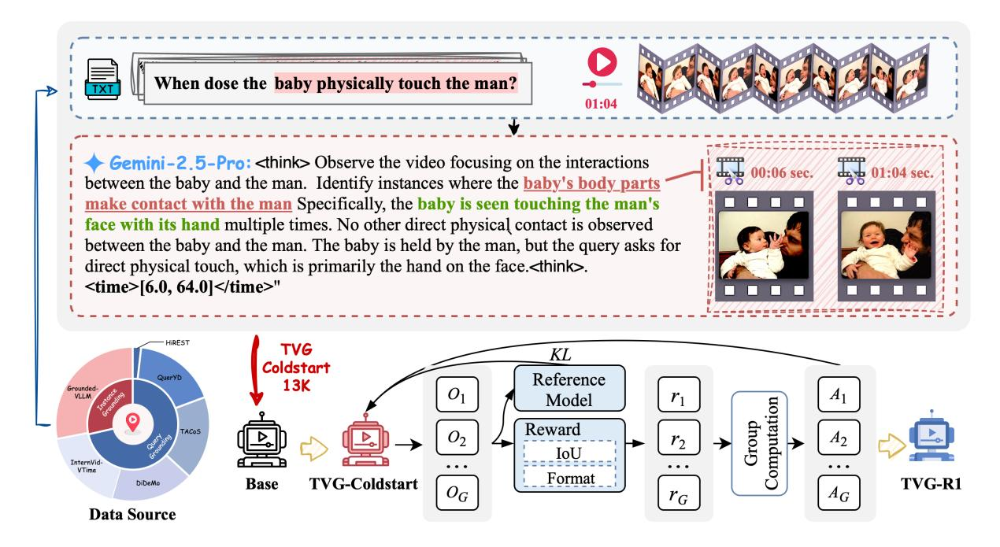
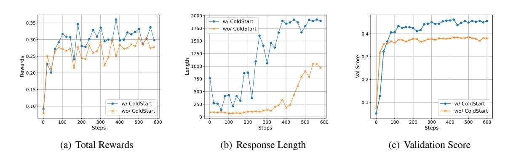
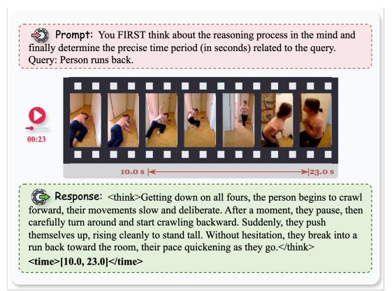
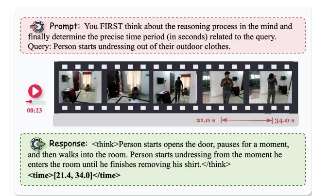
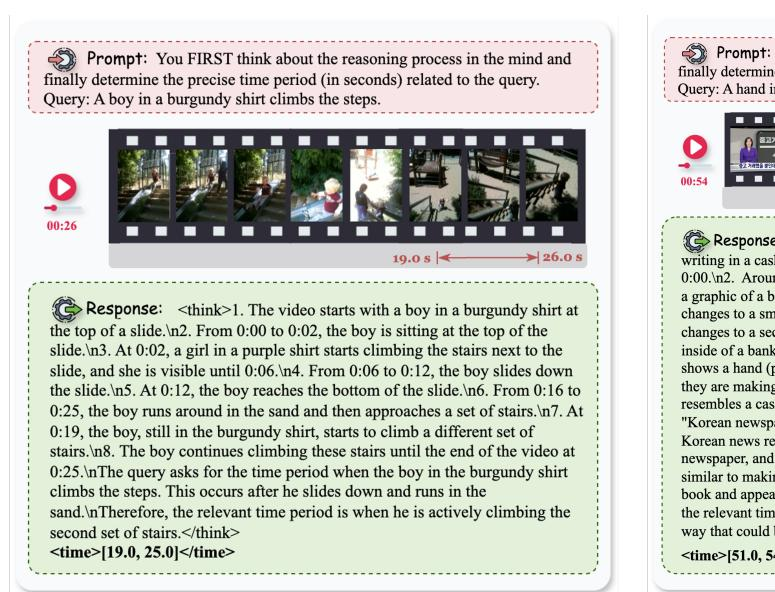

# Datasets and Recipes for Video Temporal Grounding via Reinforcement Learning

Ruizhe Chen1,2‡ Tianze Luo1∗ Zhiting Fan2 Heqing Zou1 Zhaopeng Feng2 Guiyang Xie1 Hansheng Zhang1 Zhuochen Wang1 Zuozhu Liu2 Huaijian Zhang1†

1TikTok 2Zhejiang University

{tianze.luo, heqing.zou, guiyang.xie, zhanghansheng, wangzhuochen, huaijian.zhang}@bytedance.com, {ruizhec.21, zhiting.23, zhaopeng.23, zuozhuliu}@intl.zju.edu.cn

## Abstract

Video Temporal Grounding (VTG) aims to localize relevant temporal segments in videos given natural language queries. Despite recent progress with large vision-language models (LVLMs) and instruction-tuning, existing approaches often suffer from limited temporal awareness and poor generalization. In this work, we introduce a two-stage training framework that integrates supervised fine-tuning with reinforcement learning (RL) to improve both the accuracy and robustness of VTG models. Our approach first leverages high-quality curated cold start data for SFT initialization, followed by difficulty-controlled RL to further enhance temporal localization and reasoning abilities. Comprehensive experiments on multiple VTG benchmarks demonstrate that our method consistently outperforms existing models, particularly in challenging and opendomain scenarios. We conduct an in-depth analysis of training strategies and dataset curation, highlighting the importance of both highquality cold start data and difficulty-controlled RL. To facilitate further research and industrial adoption, we release all intermediate datasets, models, and code to the community.

## 1 Introduction

With the proliferation of social media platforms, video content has become the most informationrich and diverse medium for capturing and conveying daily experiences. As a result, efficiently identifying specific moments within videos based on user queries—a task known as *Video Temporal Grounding* (VTG)—has emerged as a core capability for a range of industrial applications, from intelligent video retrieval to workflow optimization [and au](#page-6-0)tomated event m[onitorin](#page-6-1)[g](#page-6-2) [\(Grauman et al.,](#page-6-0) 2022; Hendricks et al., 2017a; Li et al., 2023a).

VTG enables practitioners to swiftly pinpoint relevant segments in massive videos, significantly reducing manual review wor[kloads and empoweri](#page-7-0)ng real-time decision-making (Sultani et al., 2018).

Recent advances in large vision-language models (LVLMs) have led to the development of end-toend temporal grounding frameworks[. Instruction](#page-7-1)[tuned](#page-7-1) models such [as TimeChat \(Ren e](#page-6-3)t al., 2024), [VTimeLLM \(Huan](#page-6-4)g et al., 2024a), and LITA (Huang et al., 2024b) reformulate temporal grounding as a text [generation task, w](#page-7-2)hile models li[ke Momentor \(Qi](#page-6-5)an et al., 2024) and VTG-LLM (Guo et al., 2024) introduce specialized modules or vocabulary to improve temporal perception. Despite notable progress, existing approaches are still constrained by the inherent limitations of supervised fine-tuning, struggling with precise temporal awareness and generalization.

To address these challenges, we propose a novel two-stage training framework that integrates supervised fine-tuning (SFT) with reinforcement learning (RL) to significantly improve the performance and generalization of open-source models for VTG tasks. Our framework first leverages high-quality curated data to provide the model with a robust *coldstart* initialization via SFT, followed by a difficulty-controlled RL stage that further enhances temporal grounding abilities and reasoning.

We conduct extensive experiments across multiple VTG benchmarks, systematically evaluating the contributions of each training stage. Our findings highlight the critical importance of highquality cold-start data and controlled RL training, providing actionable insights for practical deployment in real-world industrial scenarios. Furthermore, to facilitate future research and application, we release all intermediate results and code as open-source resources.

The main contributions of this work are:

∗ [Core Contributor.](#page-6-1)

‡ Work done during an internship at TikTok, and serves as the primary contributor.

† Corresponding author.

Figure 1: Overview of the proposed training pipeline for Video Temporal Grounding (VTG-R1). The framework first performs supervised fine-tuning (SFT) with curated high-quality cold-start data to initialize the base model, followed by reinforcement learning (RL) to further enhance temporal localization abilities.

- We introduce a two-stage training framework that combines SFT and RL to advance opensource LVLMs for video temporal grounding.
- We conduct comprehensive evaluations across multiple benchmarks, validating the effectiveness and scalability of our approach.
- We open-source all intermediate datasets, models, and code to support further research and industrial adoption.

# 2 Related Works

Video Temporal Grounding (VTG) aims to localize relevant temporal segments within [untrimmed](#page-6-0) [videos given](#page-6-0) [natural language queries](#page-6-6) ([Grauman](#page-6-2) [et al.,](#page-6-2) [2022;](#page-6-7) He[ndrick](#page-6-7)[s et al.,](#page-7-3) 201[7b;](#page-7-3) Li et al., 2023a; Dai et al., 2023; Wang et al., 2022). Early efforts, such as CTRL and MCN, introduced foundational approaches that leveraged sliding windows and dual-stream networks to gen[erate candi](#page-6-8)[date s](#page-6-8)[egments for text-video mat](#page-6-1)ching (Gao et al., 2017; Hendricks et al., 2017a), which laid the groundwork for subsequent advancements.

With the emergence of large vision-language models (LVLMs), recent research has shifted towards end-to-end VTG frameworks that leverage instruction-tuning and te[xtual gener](#page-7-1)[ation.](#page-7-1) Models suc[h as TimeChat \(Ren](#page-6-3) et al.,

2024), [VTimeLLM \(Huan](#page-6-4)g et al., 2024a), and LITA (Huang et al., 2024b) reformulate temporal grounding [as a sequence gen](#page-7-2)eration task, while Momentor (Qian et al., 2024) addresses temporal quantization errors by introducing temporal-aware modules. Other approaches, i[ncluding Grounded-](#page-7-4)[VideoLLM and V](#page-6-5)TG-LLM (Wang et al., 2024; Guo et al., 2024), expand model vocabularies to facilitate the learning of temporal embeddings, further improving grounding precision.

VTG technology has shown practical value in diverse domains. In manufacturing, VTG supports automated workflow analysis and anom[aly detec](#page-6-9)[tion t](#page-6-9)o improve operational efficiency (Li et al., 2021). For security surveillance, VTG enables fast retrieval of critical events, supporting both real-[time monitoring an](#page-7-0)d retrospective investigation (Sultani et al., 2018). In healthcare, VTG facilitates efficient identification of key procedures in large-scale surgical vid[eos, benefiting both clin](#page-7-5)ical analysis and education (Twinanda et al., 2017).

Despite these advances, the predominant reliance on supervised fine-tuning (SFT) often restricts the model's temporal awareness and generalization capabilities, especially in open-domain or challenging scenarios. To address these limitations, we propose a two-stage training framework that integrates supervised fine-tuning with reinforcement learning, aiming to enhance both

the accuracy and generalization of VTG models. To support further research and application, we release all intermediate data, models, and code as open-source resources.

# 3 Datasets and Recipes

In this section, we present the detailed process for constructing VTG-R1 via a two-stage training pipeline, encompassing data collection, curation, and specific training procedures.

## 3.1 Data Collection and Curation

High-quality coldstart and RL datasets are essential for enhancing the temporal video grounding capabilities of MLLMs. Here, we describe our approach to collecting source data and curating the TVG-RL-18K dataset for RL training and the TVG-Coldstart-13K dataset for SFT-based coldstart.

Data Collection. We aggregate data from various public datasets, including those for moment retrieval and query grounding tasks, carefully sampling and balancing the proportion of each subset. The distributions of the r[aw](#page-3-0) source data for TVG-RL-18K and TVG-Coldstart-13K are categorized and summarized in Table 1.

CoT Annotation and Data Filtering. To enable effective supervised fine-tuning (SFT) cold-start, we employ Gemini-2.5-Pro to generate chain-ofthought (CoT) rationales for the source samples. The prompt template used for CoT generation is provided below and is consistently applied during both the SFT and RL stages. We then filter the annotated samples according to their final Intersection-over-Union (IoU) scores: samples with IoU > ϵ1 are regarded as high-quality and their CoT rationales are retained for cold-start, forming the TVG-Coldstart-13K subset. In contrast, source samples with IoU < ϵ2 are considered low-quality—often due to excessive difficulty or annotation errors—and are excluded from the RL stage. The remaining samples constitute the TVG-RL-18K subset.

### 3.2 Supervised Fine-Tuning (SFT) Stage

In the first stage of our training pipeline, we employ supervised fine-tuning (SFT) to provide the model with a high-quality initialization, referred to as the *cold start* phase. This process equips the model with robust multimodal alignment and structured reasoning capabilities from the outset, laying a solid foundation for the subsequent reinforcement learning stage.

### Prompt Template for TVG-R1

system You MUST reason based on the temporal changes and visual evidence in the video to determine the precise time period related to the query. The reasoning MUST reflect how the content evolves over time, not general logic. The reasoning process MUST BE enclosed within <think> </think> tags. The specific time period MUST BE in the format [start time, end time] in seconds enclosed within <time> </time> tags.

user {query / instance}

## 3.3 Reinforcement Learning (RL) Stage

### 3.3.1 Reward Modeling

The reward ri plays a crucial role in guiding the model's learning objective. To promote effective temporal grounding with explicit reasoning, we employ a composite reward function consisting of two components: the IoU reward rtIoU and the reasoning format reward rform.

Timestamp-aware IoU Reward rtIoU(·) In the TVG task, the quality of a predicted temporal segment [ts, te] is primarily evaluated using the Intersection-over-Union (IoU) metric, which measures the overlap between the predicted segment and the ground-truth segment [t ′ s , t′ e ]. The IoU is computed as:

$$r_{\text{tIoU}} = \frac{[t_s, t_e] \cap [t'_s, t'_e]}{[t_s, t_e] \cup [t'_s, t'_e]}$$

where ∩ and ∪ denote the intersection and union of the predicted and ground-truth intervals.

Reasoning Format Reward rform(·) To explicitly encourage the model to generate responses with structured reasoning, we introduce a formatbased reward rform, which verifies whether the output follows the expected reasoning format. Specifically, we require the model to enclose the reasoning process within <think>...</think> tags and the final answer within <answer>...</answer> tags. The reward is defined as:

rform = 1{<think>,</think>,<answer>,</answer>}⊆output

where 1· denotes the indicator function.

| Task                                     | # Original Samples | Source Datasets                                                                                                                                                                                         | # Coldstart Samples | # RL Samples |
|------------------------------------------|--------------------|---------------------------------------------------------------------------------------------------------------------------------------------------------------------------------------------------------|---------------------|--------------|
| Instance Grounding (Moment Retrieval) | 40K                | HiREST (Zala et al., 2023) (1K), QuerYD (Oncescu et al., 2021) (10K), TACoS (Gan et al., 2023) (10K), DiDeMo (Anne Hendricks et al., 2017) (10K), InternVid-VTime (Wang et al., 2023) (10K) | 10K                 | 13K          |
| Query Grounding                          | 16K                | Grounded-VLLM (Wang et al., 2024) (16K)                                                                                                                                                                 | 3K                  | 5K           |
| Total                                    | 56K                | -                                                                                                                                                                                                       | 13K                 | 18K          |

Table 1: Statistics of the source datasets and filtered coldstart and RL datasets.

**Final Reward**  $r_i$  The final reward  $r_i$  is defined as a weighted sum of the two components:

$$r_i = \lambda_{\text{tIoU}} \cdot r_{\text{tIoU}} + \lambda_{\text{form}} \cdot r_{\text{form}}$$

where  $\lambda_{tIoU}$  and  $\lambda_{form}$  are hyperparameters.

#### 3.3.2 GRPO Training

We adopt Group Relative Policy Optimization (GRPO) (Shao et al., 2024) for reinforcement learning, which is a variant of Proximal Policy Optimization (PPO) (Schulman et al., 2017). Unlike PPO, which relies on a learned critic, GRPO directly compares a group of candidate responses, removing the need for a critic model and thereby reducing computational overhead.

Given a query q, GRPO samples G distinct candidate responses  $o = \{o_1, \ldots, o_G\}$  from the policy. Rewards for each response are assigned as described in Sec. 3.3.1, yielding  $\{r_1, \ldots, r_G\}$ . These scores are then normalized within the group, and the advantage of each response is defined as:

$$A_i = \frac{r_i - \mu}{\sigma}$$
, where 
$$\mu = \frac{1}{G} \sum_{j=1}^G r_j, \sigma = \sqrt{\frac{1}{G} \sum_{j=1}^G (r_j - \mu)^2}.$$

Here,  $A_i$  denotes the normalized advantage of the i-th response. GRPO encourages the model to assign higher probabilities to relatively better responses within the group. The final training objective also includes a KL-divergence regularization term to prevent the updated policy  $\pi_{\theta}$  from deviating significantly from a reference policy  $\pi_{\text{ref}}$ . The complete objective is given by:

$$\mathcal{L}_{\text{GRPO}} = \mathbb{E}_{o \sim \pi_{\theta_{\text{old}}}(p)} \left[ \sum_{i=1}^{G} \frac{\pi_{\theta}(o_i)}{\pi_{\theta_{\text{old}}}(o_i)} \cdot A_i - \beta \cdot D_{\text{KL}} \left( \pi_{\theta} \parallel \pi_{\text{ref}} \right) \right],$$

where  $\beta$  is a regularization coefficient controlling the divergence from the reference policy.

### 4 Experiment

#### 4.1 Experimental Setups

Benchmarks and Evaluation Metrics We conduct comprehensive experiments on three benchmarks to evaluate the effectiveness of our approach. Specifically, we report results on the ReX-Time (Huang and et al., 2024), NExT-GQA (Li et al., 2023b), and Charades-STA (Hendricks et al., 2017c) datasets. For evaluation, we adopt the R1@m metric for temporal video grounding (TVG). R1@m denotes the percentage of instances where the top-1 predicted segment achieves an Intersection-over-Union (IoU) greater than a threshold m, where  $m \in 0.3, 0.5, 0.7$ . Additionally, we report the mean IoU (mIoU) across all samples as an overall indicator of TVG accuracy.

Baselines We compare our approach with several strong baselines, including instruction-tuned temporal localization models such as VTimeLLM (Huang et al., 2024a), TimeChat (Ren et al., 2024), and VideoChat-TPO (Yan et al., 2025), as well as general-purpose multimodal large models like Qwen2.5-VL 7B and 32B (Bai et al., 2025). For models marked with "thinking," we employ the TVG-R1 prompt template to guide temporal grounding.

**Training Details.** All experiments are conducted on 16 NVIDIA H100 (80GB) GPUs. For both training and inference, we limit the number of video frames to 64, with each frame processed at a resolution of  $128 \times 28 \times 28$  pixels. The backbone model is Qwen2.5-VL-7B (Bai et al., 2025). The hyperparameters  $\epsilon_1$  and  $\epsilon_2$  are set to 0.8 and 0.4, respectively. We first perform supervised fine-tuning (SFT) on the TVG-Coldstart-13K dataset for one epoch to obtain the TVG-cold start model. Next,

| Madal                  | NExTGQA |       |       |       | RexTime |       |       |       |
|------------------------|---------|-------|-------|-------|---------|-------|-------|-------|
| Model                  | R@0.3   | R@0.5 | R@0.7 | mIoU  | R@0.3   | R@0.5 | R@0.7 | mIoU  |
| Qwen2.5-VL-7B thinking | 25.81   | 14.73 | 8.72  | 17.74 | 12.16   | 7.17  | 2.71  | 10.17 |
| Qwen2.5-VL-7B          | 31.60   | 18.06 | 7.46  | 20.87 | 10.31   | 6.08  | 3.04  | 8.10  |
| Qwen2.5-VL-32B         | 37.96   | 22.26 | 9.98  | 25.35 | 16.83   | 9.99  | 5.10  | 13.02 |
| VTimeLLM               | 37.90   | 20.20 | 9.71  | 24.40 | 28.84   | 17.41 | 7.19  | 20.14 |
| TimeChat               | 34.10   | 17.90 | 6.24  | 20.60 | 14.42   | 7.61  | 3.06  | 11.65 |
| VideoChat-TPO          | 41.20   | 23.40 | 8.15  | 27.70 | 34.53   | 19.26 | 9.81  | 25.23 |
| TVG-ColdStart          | 21.74   | 11.54 | 5.24  | 15.09 | 13.57   | 7.82  | 4.34  | 10.18 |
| TVG-R1                 | 41.65   | 20.78 | 10.01 | 29.25 | 41.04   | 24.54 | 11.07 | 28.20 |

Table 2: Performance comparison on NExTGQA and RexTime benchmarks. It can be observed that VTG-R1 outperforms existing SFT-based methods trained with large-scale data.

Figure 2: Comparison of RL training curves with high-quality cold start and without cold start. TVG-R1, with a high-quality cold start, converges to higher scores, demonstrating the benefit of cold start in unlocking the model's potential and enhancing its reasoning abilities, as indicated by the increased response length during training.

we apply reinforcement learning (RL) on the TVG-RL-18K dataset to obtain the final TVG-R1 model, where the hyperparameter  $\beta$  in the KL divergence term of the GRPO algorithm is set to 0.0. The maximum response length is set to 2048 tokens, and the loss weights  $\lambda_{\text{tIoU}}$  and  $\lambda_{\text{form}}$  are set to 0.9 and 0.1, respectively. Due to computational resource constraints, RL training is limited to 600 steps. Additional details can be found in the Appendix.

#### 4.2 Main Results

As shown in Tables 2 and 5, our experiments across three different benchmarks demonstrate the effectiveness of VTG-R1 on video temporal grounding tasks. Two key observations can be drawn.

Outstanding Performance of VTG-R1: VTG-R1 consistently outperforms previous models on most benchmarks, highlighting the importance of explicit reasoning in addressing video temporal grounding challenges. These results further underscore the impact of reinforcement learning in boosting model performance.

Importance of Reinforcement Learning: The SFT-based model, TVG-ColdStart, does not consistently yield performance gains and even exhibits a slight decrease after SFT, possibly due to overfitting or limited generalization to unseen scenarios. In contrast, after reinforcement learning, VTG-R1 achieves substantial improvements, strongly suggesting that RL is essential for developing robust reasoning capabilities that generalize effectively.

#### 4.3 Analysis

To gain deeper insights into the impact of different variants, we present experimental results under additional configurations. Specifically, we analyze variants associated with cold start process and RL data selection.

**Finding 1: High-Quality cold start data is crucial.** As shown in Fig. 2, we compare the RL training curves of TVG-R1 and TVG-R1-Zero, where TVG-R1-Zero refers to skipping the SFT cold start and directly performing RL training. It

| Model                     | Filter       | NExTG. | RexT. | Charad. |  |  |
|---------------------------|--------------|--------|-------|---------|--|--|
| TVG-Coldstart-13k Dataset |              |        |       |         |  |  |
| Qwen2.5-VL-7B             | -            | 20.87  | 8.10  | 46.14   |  |  |
| TVG-ColdStart             | -            | 26.14  | 26.26 | 42.19   |  |  |
| TVG-R1-U                  | ×            | 23.92  | 29.14 | 29.57   |  |  |
| TVG-R1                    | $\checkmark$ | 30.41  | 26.38 | 48.78   |  |  |
| TVG-R1-Zero               | -            | 27.76  | 26.00 | 48.75   |  |  |

Table 3: Validation of the effectiveness of high-quality cold start data. TVG-R1-U refers to performing the cold start on unfiltered data. The results show that TVG-R1 outperforms TVG-R1-U, highlighting that high-quality SFT data is more effective than increasing data quantity.

| Model         | R@0.3 | R@0.5 | R@0.7 | mIoU  |
|---------------|-------|-------|-------|-------|
| Base          | 68.98 | 48.18 | 22.87 | 46.14 |
| Base thinking | 36.48 | 21.83 | 9.76  | 23.48 |
| VTimeLLM      | 55.3  | 34.3  | 14.7  | 34.6  |
| TimeChat      | 51.5  | 32.2  | 13.4  | -     |
| VideoChat-TPO | 58.3  | 40.2  | 18.4  | 38.1  |
| TVG-ColdStart | 42.23 | 29.38 | 14.95 | 28.91 |
| TVG-R1        | 70.75 | 50.46 | 23.92 | 46.73 |

Table 5: Performance comparison on Charades dataset

can be observed that, in terms of both total rewards during training and test set performance, TVG-R1 converges to higher scores, suggesting that a high-quality cold start helps unlock the model's potential in the RL phase. Furthermore, as illustrated in Fig. 2(b), the model initialized with a cold start exhibits a higher response length at the outset, with a more pronounced increase throughout training. This indicates that the cold start enhances the model's reasoning ability, enabling it to derive correct answers through more detailed reasoning.

We further examine the impact of cold start response length on model performance by limiting the maximum output length of Gemini-2.5-Pro. We re-annotate different cold start datasets, and the final results after RL training are reported in Table 6. The results indicate that longer response lengths during the cold start phase are more beneficial for model optimization.

Additionally, as shown in Table 3, we compare TVG-R1 and TVG-R1-U, where TVG-R1-U denotes using the unfiltered 56K dataset for cold start followed by RL. Note that all RL is performed on the TVG-RL-18K dataset. The results show that TVG-R1 significantly outperforms TVG-R1-U, demonstrating that selecting high-quality cold start data is more effective for learning robust rea-

| Model         | Filter       | NExTG. | RexT. | Charad. |
|---------------|--------------|--------|-------|---------|
| TVG-RL-18k Da | taset        |        |       |         |
| Qwen2.5-VL-7B | -            | 20.87  | 8.10  | 46.14   |
| TVG-R1        | ×            | 27.88  | 25.91 | 46.96   |
| TVG-R1        | $\checkmark$ | 30.41  | 26.38 | 48.78   |
| TVG-R1-Zero   | ×            | 5.49   | 24.18 | 20.32   |
| TVG-R1-Zero   | $\checkmark$ | 27.76  | 26.00 | 48.75   |

Table 4: Validation of the effectiveness of RL data. TVG-R1-Zero refers to skipping the SFT cold start and directly conducting RL training. The results show that RL data filtering improves model performance, particularly in the absence of cold start.

| Max Length | NExTGQA | RexTime | Charades |
|------------|---------|---------|----------|
| 2048       | 30.41   | 26.38   | 48.78    |
| 1024       | 21.80   | 25.71   | 41.38    |
| 512        | 24.09   | 24.91   | 46.31    |

Table 6: Impact of cold start length on performance. The results after RL training show that longer response lengths during cold start are more beneficial for the model's optimization.

soning abilities than simply increasing the quantity of training data.

Finding 2: Controlling the difficulty of RL training data is necessary. As shown in Table 4, we compare the results of RL training with and without data filtering under both the TVG-R1 and TVG-R1-Zero settings. Note that TVG-R1 is initialized with the TVG-Coldstart-13K dataset. The results indicate that, without cold start, models trained on unfiltered data struggle to learn, whereas data filtering leads to substantial performance improvements. Moreover, for models initialized with cold start, filtering the RL data further benefits model optimization. These findings suggest that if the training data is too challenging or confusing in the early stages, the model may have difficulty learning and achieving convergence.

### 5 Conclusion

In this work, we present a novel two-stage training framework for Video Temporal Grounding (VTG) to enhance the capabilities of large vision-language models. Extensive experiments on multiple benchmarks demonstrate that high-quality cold-start data and difficulty-controlled RL training are both crucial for improving model performance and generalization. Our approach is shown to be scalable and effective for real-world deployment.

# Limitations

While our proposed framework demonstrates significant improvements for Video Temporal Grounding (VTG), several limitations remain. First, the approach relies heavily on high-quality, curated cold-start data, which may be difficult to obtain in certain domains or low-resource scenarios. Second, the reinforcement learning stage introduces considerable computational overhead, potentially limiting accessibility for smaller organizations or academic users with constrained resources. Future work should explore ways to improve data efficiency, optimize RL for resource-limited settings, and broaden the applicability of this training paradigm to more complex or diverse multimodal tasks.

## References

- Lisa Anne Hendricks, Oliver Wang, Eli Shechtman, Josef Sivic, Trevor Darrell, and Bryan Russell. 2017. Localizing moments in video with natural language. In *Proceedings of the IEEE/CVF International Conference on Computer Vision (ICCV)*.
- Shuai Bai, Keqin Chen, Xuejing Liu, Jialin Wang, Wenbin Ge, Sibo Song, Kai Dang, Peng Wang, Shijie Wang, Jun Tang, and 1 others. 2025. Qwen2. 5-vl technical report. *arXiv preprint arXiv:2502.13923*.
- Wenliang Dai, Junnan Li, Dongxu Li, Anthony M. H. Tiong, Junqi Zhao, Weisheng Wang, Boyang Li, Pascale Fung, and Steven C. H. Hoi. 2023. Instructblip: Towards general-purpose vision-language models with instruction tuning. *arXiv preprint arXiv:2305.06500*.
- Tian Gan, Xiao Wang, Yan Sun, Jianlong Wu, Qingpei Guo, and Liqiang Nie. 2023. Temporal sentence grounding in streaming videos. In *Proceedings of the 31st ACM International Conference on Multimedia*, pages 4637–4646.
- Jiyang Gao, Chen Sun, Zhenheng Yang, and Ram Nevatia. 2017. [Tall: Temporal activity localization via](https://doi.org/10.1109/ICCV.2017.563) [language query.](https://doi.org/10.1109/ICCV.2017.563) In *Proceedings of the IEEE International Conference on Computer Vision (ICCV)*, pages 5277–5285. IEEE.
- Kristen Grauman, Andrew Westbury, Eugene Byrne, Zachary Chavis, Antonino Furnari, Rohit Girdhar, Jackson Hamburger, Hao Jiang, Miao Liu, and Xingyu Liu *et al.* 2022. Ego4D: Around the world in 3,000 hours of egocentric video. In *Proceedings of the IEEE/CVF Conference on Computer Vision and Pattern Recognition (CVPR)*, pages 18995–19012.
- Yongxin Guo, Jingyu Liu, Mingda Li, Dingxin Cheng, Xiaoying Tang, Dianbo Sui, Qingbin Liu, Xi Chen, and Kevin Zhao. 2024. VTG-LLM: Integrating

- timestamp knowledge into video LLMs for enhanced video temporal grounding. *arXiv preprint arXiv:2405.13382*.
- Lisa Anne Hendricks, Oliver Wang, Eli Shechtman, Josef Sivic, Trevor Darrell, and Bryan C. Russell. 2017a. Localizing moments in video with natural language. In *Proceedings of the IEEE International Conference on Computer Vision (ICCV)*, pages 5804– 5813. IEEE.
- Lisa Anne Hendricks, Oliver Wang, Eli Shechtman, Josef Sivic, Trevor Darrell, and Bryan C. Russell. 2017b. Localizing moments in video with natural language. In *Proceedings of the IEEE International Conference on Computer Vision (ICCV)*, pages 5804– 5813.
- Lisa Anne Hendricks, Oliver Wang, Eli Shechtman, Josef Sivic, Trevor Darrell, and Bryan C. Russell. 2017c. Localizing moments in video with natural language. In *Proceedings of the IEEE International Conference on Computer Vision (ICCV)*, pages 5804– 5813.
- Bin Huang and et al. 2024. Rextime: Temporal grounding benchmark for reasoning-intensive videos. In *Proceedings of the IEEE/CVF Conference on Computer Vision and Pattern Recognition (CVPR)*, pages 14313–14323.
- Bin Huang, Xin Wang, Hong Chen, Zihan Song, and Wenwu Zhu. 2024a. Vtimellm: Empower llm to grasp video moments. In *Proceedings of the IEEE/CVF Conference on Computer Vision and Pattern Recognition (CVPR)*, pages 14271–14280.
- De-An Huang, Shijia Liao, Subhashree Radhakrishnan, Hongxu Yin, Pavlo Molchanov, Zhiding Yu, and Jan Kautz. 2024b. Lita: Language instructed temporal-localization assistant. In *Computer Vision – ECCV 2024, Part XXX (Proc. 18th European Conference on Computer Vision)*, pages 202–218. Springer.
- Hao Li, Shuhui Wang, Ying Zhou, and et al. 2021. [Vision-based abnormal event detection in industrial](https://doi.org/10.1016/j.compind.2021.103469) [manufacturing processes: A review.](https://doi.org/10.1016/j.compind.2021.103469) *Computers in Industry*, 130:103469.
- Kunchang Li, Yinan He, Yi Wang, Yizhuo Li, Wenhai Wang, Ping Luo, Yali Wang, Limin Wang, and Yu Qiao. 2023a. Videochat: Chat-centric video understanding. *arXiv preprint arXiv:2305.06355*.
- Kunchang Li, Yinan He, Yi Wang, Yizhuo Li, Wenhai Wang, Ping Luo, Yali Wang, Limin Wang, and Yu Qiao. 2023b. Videochat: Chat-centric video understanding. In *arXiv preprint arXiv:2305.06355*.
- Ye Liu, Kevin Qinghong Lin, Chang Wen Chen, and Mike Zheng Shou. 2025. Videomind: A chain-oflora agent for long video reasoning. *arXiv preprint arXiv:2503.13444*.

- Andreea-Maria Oncescu, Joao F Henriques, Yang Liu, Andrew Zisserman, and Samuel Albanie. 2021. Queryd: A video dataset with high-quality text and audio narrations. In *ICASSP 2021-2021 IEEE International Conference on Acoustics, Speech and Signal Processing (ICASSP)*, pages 2265–2269. IEEE.
- Long Qian, Juncheng Li, Yu Wu, Yaobo Ye, Hao Fei, Tat-Seng Chua, Yueting Zhuang, and Siliang Tang. 2024. Momentor: Advancing video large language model with fine-grained temporal reasoning. In *Proceedings of the 41st International Conference on Machine Learning (ICML)*.
- Shuhuai Ren, Linli Yao, Shicheng Li, Xu Sun, and Lu Hou. 2024. Timechat: A time-sensitive multimodal large language model for long video understanding. In *Proceedings of the IEEE/CVF Conference on Computer Vision and Pattern Recognition (CVPR)*, pages 14313–14323.
- John Schulman, Filip Wolski, Prafulla Dhariwal, Alec Radford, and Oleg Klimov. 2017. [Proximal policy](https://arxiv.org/abs/1707.06347) [optimization algorithms.](https://arxiv.org/abs/1707.06347) *CoRR*, abs/1707.06347. A simpler and effective first-order alternative to TRPO via surrogate objective and clipping.
- Zhihong Shao and 1 others. 2024. Deepseekmath: Pushing the limits of mathematical reasoning in open language models. *arXiv preprint arXiv:2402.03300*. Introduces Group Relative Policy Optimization (GRPO) as a PPO variant enhancing reasoning ability and memory efficiency.
- Waqas Sultani, Chen Chen, and Mubarak Shah. 2018. Real-world anomaly detection in surveillance videos. In *Proceedings of the IEEE Conference on Computer Vision and Pattern Recognition (CVPR)*, pages 6479– 6488.
- Ap Twinanda, Sherif Shehata, Didier Mutter, Jacques Marescaux, Michel de Mathelin, and Nicolas Padoy. 2017. [Endonet: A deep architecture for recognition](https://doi.org/10.1109/TMI.2016.2593957) [tasks on laparoscopic videos.](https://doi.org/10.1109/TMI.2016.2593957) *IEEE Transactions on Medical Imaging*, 36(1):86–97.
- Haibo Wang, Zhiyang Xu, Yu Cheng, Shizhe Diao, Yufan Zhou, Yixin Cao, Qifan Wang, Weifeng Ge, and Lifu Huang. 2024. Grounded-videollm: Sharpening fine-grained temporal grounding in video large language models. *arXiv preprint arXiv:2410.03290*.
- Yi Wang, Yinan He, Yizhuo Li, Kunchang Li, Jiashuo Yu, Xin Ma, Xinhao Li, Guo Chen, Xinyuan Chen, Yaohui Wang, and 1 others. 2023. Internvid: A large-scale video-text dataset for multimodal understanding and generation. *arXiv preprint arXiv:2307.06942*.
- Zhenzhi Wang, Limin Wang, Tao Wu, Tianhao Li, and Gangshan Wu. 2022. Negative sample matters: A renaissance of metric learning for temporal grounding. In *Proceedings of the AAAI Conference on Artificial Intelligence*, volume 36, pages 2613–2623.

- Ziang Yan, Zhilin Li, Yinan He, Chenting Wang, Kunchang Li, Xinhao Li, Xiangyu Zeng, Zilei Wang, Yali Wang, Yu Qiao, and 1 others. 2025. Task preference optimization: Improving multimodal large language models with vision task alignment. In *Proceedings of the Computer Vision and Pattern Recognition Conference*, pages 29880–29892.
- Abhay Zala, Jaemin Cho, Satwik Kottur, Xilun Chen, Barlas Oguz, Yashar Mehdad, and Mohit Bansal. 2023. Hierarchical video-moment retrieval and stepcaptioning. In *Proceedings of the IEEE/CVF Conference on Computer Vision and Pattern Recognition*, pages 23056–23065.
- Yaowei Zheng, Junting Lu, Shenzhi Wang, Zhangchi Feng, Dongdong Kuang, and Yuwen Xiong. 2025. Easyr1: An efficient, scalable, multi-modality rl training framework. [https://github.com/](https://github.com/hiyouga/EasyR1) [hiyouga/EasyR1](https://github.com/hiyouga/EasyR1).

# A Implementation Details

# A.1 Recipes

TVG-Coldstart Dataset We use gemini-2.5-propreview-05-06 API for annotation and set the max length to 8192. Samples with IoU larger than 0.8 are selected for coldstart.

Coldstart Stage We finetune the base model on the TVG-Coldstart dataset. The finetuning is performed on 8 H100 GPUs with batch size 8 for 1 epoch. The learning rate is set to 1e-6.

RL Stage We perform RL training base on Easy-R1 [\(Zheng et al.,](#page-7-12) [2025\)](#page-7-12) implementations. The maximum response length is set to 2048. The batch size is set to 128 and trained for 600 steps. The number of GRPO samples G is set to 8.

### A.2 Experiments

Evaluations are conducted using the official Video-Mind [\(Liu et al.,](#page-6-16) [2025\)](#page-6-16) implementation. The maximum response length is set to 2048 tokens, and all other inference hyperparameters are kept at their default values as provided by the transformers library.

# B Qualitative Result

### B.1 TVG-R1 Evaluation Cases

We provide qualitative cases for TVG-R1 in Fig. [3.](#page-9-0) These comprehensive data document the reasoning process and prediction results of temporal localization models in video segment understanding and localization tasks. Each data entry includes basic video information, the query, the annotated time span, the model's step-by-step reasoning process, and the predicted time span. The reasoning content typically provides a detailed description of the sequence of key events and action nodes in the video, helping the model clarify the start and end points of the target segment. The prediction results are evaluated by comparing them with the ground-truth spans using metrics such as IoU. This type of data not only highlights the combination of multi-step reasoning and temporal cues, but also reflects the model's localization capability in concrete cases, providing a solid basis for performance evaluation and analysis.

# B.2 TVG-Coldstart Dataset Cases

We provide qualitative cases for TVG-Coldstart Dataset in Fig. [4.](#page-9-1) These cold-start data samples

employ step-by-step reasoning to document the model's decision-making process for temporal localization tasks. The data cover the identification of key actions and event nodes within video segments, clearly illustrating how the model analyzes each segment and filters events to pinpoint the exact time period required by the query. This type of data emphasizes multi-step reasoning combined with temporal cues, providing high-quality reasoning samples for the subsequent training and evaluation of video understanding models.

Figure 3: TVG-R1 Evaluation Cases.

Figure 4: TVG-Coldstart Dataset Cases.