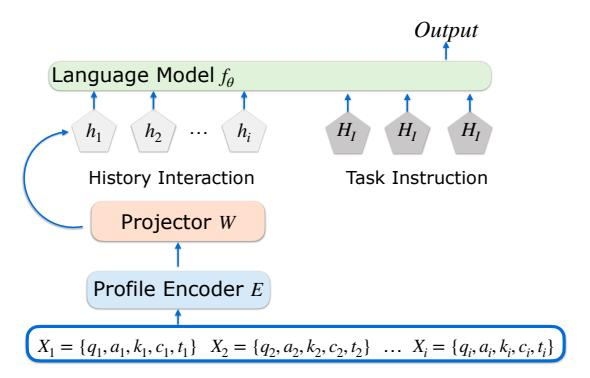
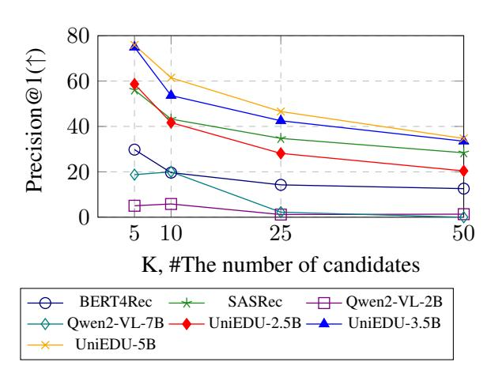
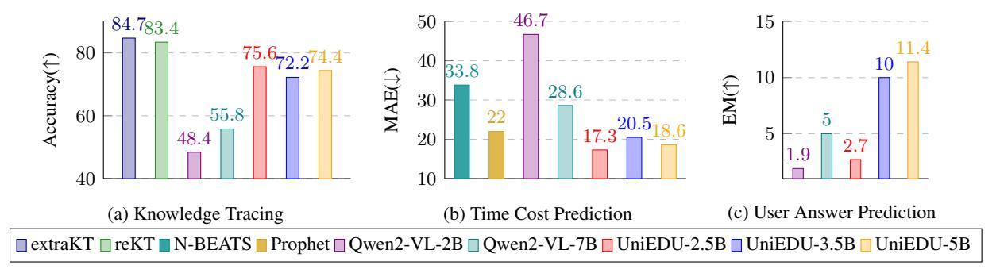
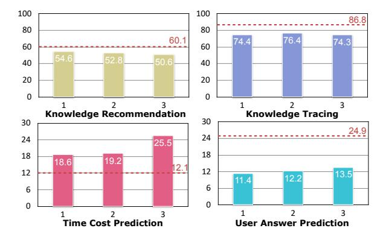

# <span id="page-0-0"></span>UniEDU: Toward Unified and Efficient Large Multimodal Models for Educational Tasks

Zhendong Chu♡[\\*](#page-0-0), Jian Xie♠\*, Shen Wang♡, Zichao Wang<sup>σ</sup>[†](#page-0-0) , Qingsong Wen♡ ♡Squirrel Ai Learning ♠Fudan University <sup>σ</sup>Adobe Research {zc9uy@virginia.edu, qingsongedu@gmail.com}

## Abstract

Education materials for K-12 students often consist of multiple modalities, such as text and images, posing challenges for models to fully understand nuanced information in these materials. In this paper, we propose a unified and efficient large multimodal model UniEDU designed for various educational applications, including knowledge recommendation, knowledge tracing, time cost prediction, and user answer prediction, all within a single model. Unlike conventional task-specific models, UniEDU offers a unified solution that excels across multiple educational tasks while maintaining strong generalization capabilities. Its adaptability makes it well-suited for realworld deployment in diverse learning environments. Furthermore, UniEDU is optimized for industry-scale deployment by significantly reducing computational overhead—achieving approximately a 3× increase in efficiency—while maintaining competitive performance with minimal degradation compared to fully fine-tuned models. This work represents a significant step toward creating versatile AI systems tailored to the evolving demands of education.

## 1 Introduction

The incorporation of artificial intelligence (AI) significantly enhances the quality of K-12 education by enabling more personalized learning experiences, improving student engagement [\(Chen and](#page-6-0) [Leitch,](#page-6-0) [2024;](#page-6-0) [Adetayo et al.,](#page-6-1) [2024\)](#page-6-1), and providing educators with valuable insights to tailor instruction to individual needs [\(Bhowmik et al.,](#page-6-2) [2024;](#page-6-2) [Zheng et al.,](#page-8-0) [2025\)](#page-8-0). For example, knowledge recommendation systems leverage AI to suggest relevant learning materials based on students' past performance and preferences [\(Wang et al.,](#page-7-0) [2024b;](#page-7-0) [Chu](#page-6-3)

[et al.,](#page-6-3) [2025\)](#page-6-3), while knowledge tracing techniques track students' understanding over time, allowing for real-time adjustments to learning paths [\(Li et al.,](#page-7-1) [2024;](#page-7-1) [Shen et al.,](#page-7-2) [2024;](#page-7-2) [Yang et al.,](#page-8-1) [2024b\)](#page-8-1).

Despite these advancements, previous research has primarily focused on plain text modality, while real-world K-12 scenarios often involve multimodal data, such as text and images in question stems. Furthermore, the significant differences between tasks pose a challenge in designing a unified model that can effectively handle diverse input types. However, since user profiles remain consistent across tasks, a unified approach could facilitate seamless knowledge transfer among them. For example, while knowledge recommendation is typically framed as a ranking problem and knowledge tracing as a binary classification task, both rely on a shared understanding of student learning behaviors and knowledge states. These disparities underscore the need for a unified model capable of handling the complexities of multimodal scenarios and supporting diverse task types within the context of educational AI assistance.

Large Multimodal Models (LMMs) [\(Liu et al.,](#page-7-3) [2023b,](#page-7-3)[a;](#page-7-4) [Chen et al.,](#page-6-4) [2024\)](#page-6-4) emerge as a promising solution due to their proficiency in handling multimodal data. Furthermore, by leveraging the flexibility of natural language, LMMs can reframe tasks in a generative format and tailor input descriptions to effectively support a wide range of distinct tasks. However, the computational cost of processing long input contexts remains a significant challenge. Since user interaction histories often span extended periods—up to 300 interactions in our study, with a maximum length reaching 45,000 tokens—retaining all interactions would substantially increase token costs, thereby escalating both training and inference expenses. A detailed analysis of these computational costs is provided in Section [3.4.](#page-3-0) While directly truncating such data may risk losing important information, educational

<sup>\*</sup>[Equal contribution.](#page-6-3)

<sup>†</sup>[ZW's contribution to this paper was limited to advising](#page-6-3) [on the task set up and evaluation. ZW did not participate in](#page-6-3) [the experiments or model development.](#page-6-3)

user profiles are largely constructed from interaction histories, which makes them more amenable to compression. Unlike other domains that may require precise memory of all events, educational contexts often tolerate approximate representations, as not all historical details are equally critical for capturing learning behaviors and knowledge states (Rendle and Zhang, 2023; Purificato et al., 2024; Chu et al., 2024).

To address these challenges and accommodate the unique demands of educational settings, we propose UniEDU—a unified large multimodal model optimized for efficient deployment in educational assistant systems. UniEDU compresses student interaction histories into a compact set of tokens for efficient feature extraction and reformulates diverse real-world educational tasks within a generative framework. Comprehensive experiments demonstrate that UniEDU achieves strong performance across real-world tasks, outperforming task-specific models while delivering approximately a 300% improvement in computational efficiency.

### 2 Related Work

To provide students with support tailored to their abilities and preferences, it is essential to develop an effective AI assistant for K-12 learning. At the outset of AI integration in education, improving e-learning quality was a primary focus (Murtaza et al., 2022; Rahayu et al., 2022; Xu et al., 2025b), with techniques such as recommendation systems for personalized learning and adaptive learning platforms playing a central role in tailoring educational content to individual student needs (Zaiane, 2002; Ali et al., 2022). While these systems are effective, most are designed for specific tasks, such as knowledge tracing (Li et al., 2024; Shen et al., 2024), and lack generalization across diverse educational contexts.

With the development of LLMs (OpenAI, 2022, 2023; Dubey et al., 2024; Yang et al., 2024a), which leverage superior understanding and generation capabilities, e-learning assistants have made significant strides in expanding their generalization. These assistants can now serve both as teaching assistants (Xu et al., 2024; Guo et al., 2024; Abu-Rasheed et al., 2024; Xu et al., 2025a) and student support (Park et al., 2024; Liu et al., 2024; Scarlatos et al., 2025; Yan et al., 2024), reducing teachers' workloads while offering personalized responses tailored to each student's needs. However, since

<span id="page-1-0"></span>

Figure 1: The architecture of UniEDU. The profile encoder processes history interactions with multimodal information, while the language model integrates compressed history interactions and task instructions to generate the output.

LLMs are typically trained on general-domain data, they often struggle to adapt to the multimodal inputs and long-context scenarios common in modern e-learning environments. This highlights the need for a unified model capable of effectively handling these complexities.

## <span id="page-1-1"></span>3 Methodology

### <span id="page-1-2"></span>3.1 Model Architecture

UniEDU comprises two main modules: the **Profile Encoder** and the **Language Model**. As illustrated in Figure 1, the **Profile Encoder** is for extracting features from the user's interaction history, while the **Language Model** is used to generate task-specific responses.

The **Profile Encoder** is designed for compressing the user's interaction history into a compact representation that the Language Model can efficiently process. Formally, let S = $\{X_1, X_2, \dots, X_n\}$  represent a sequence of user interactions, where each interaction  $X_i$  is defined as  $X_i = \{q_i, a_i, k_i, c_i, t_i\}$ . These components are chosen for their relevance to downstream tasks and are representative of common inputs in real-world educational systems (See Section 4.1). Each component of  $X_i$  is characterized as follows:  $q_i$  denotes the question stem,  $a_i$  represents the user's response,  $k_i$  corresponds to the knowledge concept associated with the question,  $c_i$  indicates the correctness of the user's response, and  $t_i$  denotes the time taken by the user to complete the interaction.  $q_i$  could be multimodal, encompassing both visual information (e.g., figures associated with the question) and textual content. Please refer to Appendix A.2 for the demonstration of interaction history. Given the se-

<span id="page-2-0"></span>

| Variable       | Definition                   |
|----------------|------------------------------|
| $\overline{a}$ | number of attention heads    |
| b              | batch size                   |
| d              | hidden dimension size        |
| l              | number of transformer layers |
| s              | sequence length              |
| t              | tensor parallel size         |
| v              | vocabulary size              |

Table 1: Definitions of the variables.

quence S, the **Profile Encoder** compresses it into a feature matrix of shape  $|S| \times m \times h$ , where |S| is the sequence length, m is a hyperparameter that determines the number of tokens used to represent each interaction, and h is the hidden state dimension expected by the language model. To ensure compatibility, we apply a **Projector**—a linear layer that projects the encoder output to the hidden size of the **Language Model**.

By processing S through the **Profile Encoder** and **Projector**, we obtain  $|S| \times m$  compressed profile embeddings, denoted as  $H_p = \{h_1, \ldots, h_{m|S|}\}$ . These embeddings, together with the uncompressed task instruction embeddings  $H_i$ , are then processed by the **Language Model**, which generates responses for different tasks.

### 3.2 Training Objective

To enable multi-task learning, UniEDU is trained to generate task-specific outputs conditioned on the user's interaction history and task instructions. In particular, given a sequence of user interactions S and a task instruction  $\mathbf{X}_{inst}$ , the model generates the corresponding target output  $\mathbf{X}_t$ . The training process employs the standard auto-regressive training objective, formally defined as:

$$p(\mathbf{X}_{t} \mid S, \mathbf{X}_{inst}) = \prod_{i=1}^{|\mathbf{X}_{t}|} p_{\theta}(x_{i} \mid S, \mathbf{X}_{inst}, \mathbf{X}_{t, < i}), \quad (1)$$

where  $\theta$  represents the trainable parameters, and  $\mathbf{X}_{\text{inst}}$  and  $\mathbf{X}_{t,< i}$  denote the instruction tokens and the generated target tokens preceding the current prediction token  $x_i$ , respectively. In Section 4, we discuss the education tasks we considered in detail.

## 3.3 VRAM Computation

In this section, we provide a detailed analysis of why UniEDU is VRAM-efficient for both training and inference. We compare UniEDU's VRAM requirements with general fine-tuning demands, focusing on two key components: parameters-loaded VRAM ( $VRAM_{para}$ ) and activation memory ( $VRAM_{activation}$ ). In Table 1, we list all the definitions of the variables used in this section.

Assuming both model parameters and activations are stored in a 16-bit floating point format, each element requires 2 bytes of storage. During the training stage, in addition to  $S_{\rm model}$  for model loading, additional memory is required for storing optimizer states and gradients. Specifically, the Adam optimizer maintains two sets of moment estimates—first-order (mean of past gradients) and second-order (variance of past gradients)—for each model parameter, effectively doubling the memory required for optimization. As a result, the optimizer states require  $2S_{model}$ . Additionally, gradient storage requires  $S_{model}$ . Thus, the total VRAM for loading the parameters in the training stage is:

$$VRAM_{para}^{train} = 4 \times 2S_{model} = 8S_{model}.$$
 (2)

During inference, the only VRAM requirement is for loading the model itself, as no optimizer states or gradient storage are needed. Therefore, the VRAM required for inference is given by:

$$VRAM_{model}^{\text{infer}} = 2S_{model}.$$
 (3)

Following the VRAM computation from NVIDIA, the activation memory required for Transformer is given by:

$$VRAM_{activation-blocks} = \frac{sbdl}{t} \left( 34 + 5\frac{as}{d} \right).$$
 (4)

In addition to activations within Transformer blocks, there are activation memory requirements before and after these blocks. The token and position embeddings before the first block require:

$$VRAM_{activation-embedding} = 4bsd.$$
 (5)

After passing through the Transformer blocks, the output tensors are typically stored in float32, even if the model was loaded at lower precision, as it often casts outputs to float32 by default (Smirnov, 2023). During training, probabilities that are the same size as the output tensor also need to be stored, contributing additional memory overhead. This results in the following VRAM usage:

$$VRAM_{activation-output} = \begin{cases} 8bsv, & \text{training} \\ 4bsv, & \text{inference} \end{cases}$$
 (6)

To further optimize VRAM consumption, we employ Flash Attention (Dao et al., 2022), which reduces attention memory complexity from quadratic

<span id="page-3-3"></span>

|             | Model Size | V RAMpara | V RAMactivation |         |        | V RAMtotal |
|-------------|------------|-----------|-----------------|---------|--------|------------|
|             |            |           | Embedding       | Blocks  | Output |            |
| Training    |            |           |                 |         |        |            |
| Qwen2-VL-2B | 2B         | 14.9GB    | 0.3GB           | 61.3GB  | 50.9GB | 127.4GB    |
| Qwen2-VL-7B | 7B         | 52.2GB    | 0.3GB           | 143.0GB | 50.9GB | 246.4GB    |
| UniEDU-5B   | 5B         | 37.3GB    | 1.8MB           | 1.1GB   | 0.4GB  | 38.8GB     |
| Inference   |            |           |                 |         |        |            |
| Qwen2-VL-2B | 2B         | 3.7GB     | 0.1GB           | 2.2GB   | 25.5GB | 31.5GB     |
| Qwen2-VL-7B | 7B         | 13GB      | 0.3GB           | 5.1GB   | 25.5GB | 43.9GB     |
| UniEDU-5B   | 5B         | 9.3GB     | 1.8MB           | 25MB    | 0.2GB  | 9.5GB      |

Table 2: VRAM Usage Comparison Across Different Models. The results assume b = 1 and t = 1, with other parameters set according to their respective models. For UniEDU, s = 300 due to compression, while for the other models, s = 45, 000, representing the maximum number of history interaction tokens. For clarity, token counts for task instructions are omitted, resulting in slight discrepancies in real VRAM usage.

to linear with respect to the sequence length. Given that the sequence length in our setting (up to 45K) is significantly larger than the number of attention heads a, the activation memory in the training stage can be approximated as:

$$VRAM_{activation} \approx 34 \frac{sbdl}{t} + (4d + 8v)bs.$$
 (7)

For inference, the activation memory cost depends on the maximum single activation memory in blocks (i.e., the activation memory of each layer), as intermediate parameters for updates are not stored. Therefore, the inference cost is:

$$VRAM_{activation} \approx 34 \frac{sbd}{t} + 4bsv.$$
 (8)

### <span id="page-3-0"></span>3.4 Efficiency Analysis

In Table [2,](#page-3-3) we present the VRAM requirements for Qwen2-VL-2B and 7B [\(Wang et al.,](#page-7-19) [2024a\)](#page-7-19), as well as our UniEDU. Due to the long context required for recommendation tasks (up to 45K tokens in our dataset) and the large vocabulary size of modern LLMs, activation memory consumes a substantial amount of VRAM, leading to high computational costs during both training and inference. However, after compression, UniEDU significantly reduces VRAM usage compared to traditional models, achieving over a 3× reduction even relative to the smaller Qwen2-VL-2B in both training and inference stages. This substantial decrease in memory consumption offers a significant advantage for real-world deployment, enabling the model to process larger batches and handle more data within the same timeframe.

# <span id="page-3-2"></span><span id="page-3-1"></span>4 Experiments

### 4.1 Education Tasks

Our system primarily focuses on the subject of mathematics. During training, we use the [same](#page-8-4) user interaction history across tasks while varying task instructions to avoid data leakage. Below, we detail the formulation of each task, with corresponding training examples provided in Appendix A.2.

Knowledge Recommendation. This task aims to recommend relevant knowledge concept based on a user's interaction history. In the educational assistant context, the model identifies a student's weak areas and provides targeted recommendations, including both foundational knowledge to address weaknesses and advanced knowledge for further development. For example, if a student consistently struggles with questions involving quadratic equations, the model may recommend reviewing the fundamentals of factoring and completing the square. Conversely, if the student performs well on basic algebraic manipulation, the system might suggest more advanced t[opic](#page-1-1)s such as functions or inequalities to support continued growth. Specifically, we define the data format as a triplet (S, Y, C), where S represents the user's interaction history (as detailed in Section 3), Y denotes the ground truth knowledge concepts that reflect the student's weak areas, obtained from real-world exam history. C comprises candidate knowledge concepts, including both the ground truth concepts Y and distractors. To construct C, we sample K candidate concepts, where K ∈ {5, 10, 25, 50}, including one

ground truth and K − 1 distractors. The model needs to rank the candidate set C based on its modeling of the student's ability. Task performance is measured using Precision@1, where a prediction is considered correct only if the ground truth concept is ranked first among the K candidates.

Knowledge Tracing. This task aims to predict whether a student can correctly answer a given question. The model must capture the user's profile, identifying both strengths and weaknesses, to make an accurate prediction. Specifically, given a sequence of the user's interaction history S and a question Q, the model is expected to predict a binary outcome: [True] or [False], where the ground truth is derived from the student's actual answer. The performance of this task is evaluated based on prediction accuracy.

Time Cost Prediction. The goal of this task is to predict the time a student needs to solve a given question. The task requires the model to understand both the student's learning path and the inherent difficulty of the task. Specifically, similar to Knowledge Tracing, given a sequence of the user's interaction history S and a question Q, the model is expected to predict an integer value representing the time required, with the ground truth derived from the student's actual time spent. We evaluate the model's performance using Mean Absolute Error (MAE).

User Answer Prediction. The User Answer Prediction task aims to predict the user's possibl[e an](#page-7-20)[swer to a giv](#page-7-20)en question based on their interaction history and learning profile. If the model thinks that the student can successfully answer the question, it needs to predict the correct answer (Liu et al., 2022). However, if the student is unlikely to succeed, the model needs to predict an answer that aligns with the student's profile, reflecting a potentially incorrect response. This task requires the model to capture the student's strengths, weaknesses, and learning paths to generate realistic answers. Specifically, given a sequence of the user's interaction history S and a question Q, the model predicts the most probable answer, with the ground truth being the student's actual response. We use exact match (EM) to evaluate the performance.

## 4.2 Implementation Details

Datasets. We collect our dataset from real student exercise data on a widely used e-learning platform and construct the training data for each task. The statistics of the dataset are shown in Table 3. Each

<span id="page-4-0"></span>

Figure 2: Performance comparison of seven models on the Knowledge Recommendation task.

| # of students     | 13,239    |
|-------------------|-----------|
| # of knowledge    | 8,247     |
| # of questions    | 235,687   |
| # of interactions | 3,892,084 |
|                   |           |

Table 3: Dataset statistics.

student's history sequence exceeding 300 interactions is truncated into multiple segments. As a result, although we processed 13,239 students, the total number of se[quences exceeds this count.](#page-6-11)

Baselines. [To assess UniED](#page-7-21)U's effectiveness, we compare it against two represent[ative baselines](#page-7-1) for each t[ask. Specifically](#page-7-2), for knowledge recommendation, we evaluat[e two widely adopted](#page-7-22) models: SAS[Rec \(Kang an](#page-7-23)d McAuley, 2018) and Bert4Rec (Sun et al., 2019). For the knowledge tracing task, we consider extraKT (Li et al., 2024) and reKT (Shen et al., 2024). For tim[e cost predic](#page-7-19)[tion, w](#page-7-19)e utilize N-BEATS (Oreshkin et al., 2020) and Prophet (Meta, 2023). For user answer prediction, a generative task requiring the model to produce responses in natural language, we employ Qwen2-VL-2B and Qwen2-VL-7B (Wang et al., 2024a). Additionally, these two models, without fine-tuning, are included as baselines for the three aforementioned tasks.

All experiments are conducted using the same training and test sets. The maximum length of interaction history is 300, with a maximum token cost of 45,000, based on the Qwen [toke](#page-3-1)nizer. For baseline models that require indexing specific users and items, we follow their official guidelines to complete this process.

Backbone Models. We fine-tune UniEDU on

<span id="page-5-0"></span>

Figure 3: Performance comparison of UniEDU and baseline models on Knowledge Tracing, Time Cost Prediction, and User Answer Prediction.

the four tasks outlined in Section 4.1. For each task, we use 24,504 sequences for training, with 5% of the data randomly selected as a validation set, and 2,784 sequences for testing. For UniEDU, we fix the encoder model as Qwen2-VL-2B and vary the language model size by using Qwen2.5-0.5B, Qwen2.5-1.5B, and Qwen2.5-3B. These configurations form UniEDU-2.5B, UniEDU-3.5B, and UniEDU-5B, enabling us to assess the impact of model size on performance.

#### 4.3 Results

We compare the performance of baselines and UniEDU with various parameter sizes on four tasks. The results are reported in Figure 2 and Figure 3.

First, UniEDU demonstrates strong performance across four tasks. Except for knowledge tracing, UniEDU outperforms task-specific models in Knowledge Recommendation, Time Cost Prediction, and User Answer Prediction. Notably, it achieves performance gains of approximately 30% and 20% over the best baselines in knowledge recommendation and time cost prediction, respectively. While UniEDU performs competitively in knowledge tracing, it slightly lags behind specialized models like extraKT and reKT, which are better suited for simpler discriminative tasks. However, these models struggle with unseen items, whereas UniEDU handles them effectively through natural language descriptions.

Second, model size significantly affects generative tasks but has limited impact on discriminative ones. For Knowledge Tracing and Time Cost Prediction, performance remains relatively stable across model sizes. In contrast, for Knowledge Recommendation and User Answer Prediction, larger models like UniEDU-5B show clear advantages over smaller variants. This suggests that tasks requiring longer or more complex generation benefit more from increased language model capacity.

<span id="page-5-1"></span>

Figure 4: Performance of UniEDU-5B with different numbers of compression tokens. The red dashed line indicates Qwen2-VL-2B with full fine-tuning.

### 4.4 Analysis of Compression Tokens

To evaluate the impact of compression ratio on performance, we vary the number of compression tokens (i.e., m, as defined in Section 3.1) to 1, 2, 3, meaning each history interaction  $X_i$  is compressed into 1, 2, 3 hidden states. We conduct this analysis on UniEDU-5B and use Qwen2-VL-2B as an upper bound, excluding the 7B variant due to its high computational cost.

Results in Figure 4 show that increasing the number of compression tokens slightly degrades performance in Knowledge Recommendation and Knowledge Tracing, likely due to noise from excessive historical context. In contrast, User Answer Prediction benefits from additional context, as it requires modeling both historical interactions and candidate questions. Overall, our compression approach provides substantial efficiency gains with minimal performance loss, except in the more complex generative setting of User Answer Prediction. Furthermore, compared to the fully fine-tuned model, our compression technique achieves significant improvements in training and inference efficiency with minimal performance degradation, except for the User Answer Prediction task.

# 5 Conclusion

In this paper, we propose UniEDU, a unified generative model for education that effectively handles various multimodal tasks while being computationally efficient. Unlike task-specific models, UniEDU not only achieves better performance but also generalizes well across different educational challenges, making it suitable for real-world deployment. Extensive experiments validate its effectiveness, showing that compared to fully fine-tuned models, UniEDU reduces computation costs by approximately 300% while incurring minor performance drops. Overall, UniEDU represents a promising step toward integrating LMMs into industrial education applications, offering a scalable and efficient approach to personalized learning.

## Limitations

While UniEDU shows strong performance and efficiency across multiple educational tasks, several limitations remain. First, its generalizability beyond mathematics to other subjects and task types (e.g., essay grading) has not been explored. Second, the compression strategy, though effective for reducing VRAM, introduces minor performance drops in complex generative tasks, with trade-offs between efficiency and fidelity requiring further study. Third, the interaction-history-based profile modeling may overlook latent learner traits like motivation or learning style; incorporating richer signals could improve personalization.

# Broader Impact Statement

UniEDU has the potential to significantly improve personalized learning by providing targeted knowledge recommendations based on students' interaction histories. This can enhance student engagement, support educators in curriculum design, and scale AI-driven education to a wider audience. Furthermore, our computationally efficient design in UniEDU makes it accessible to institutions and companies with limited computational resources, while maintaining competitive performance with minimal trade-offs.

<span id="page-6-9"></span>However, training large models on student data poses potential risks to student privacy. To mitigate these concerns, our dataset is constructed from real student interactions, but all personally identifiable information is strictly anonymized. Only interaction data relevant to learning behaviors is retained, while sensitive details such as names, user IDs, and

other personal attributes are carefully masked to ensure privacy and compliance with ethical data usage standards.

# <span id="page-6-1"></span>References

- <span id="page-6-6"></span>Hasan Abu-Rasheed, Mohamad Hussam Abdulsalam, Christian Weber, and Madjid Fathi. 2024. Supporting student decisions on learning recommendations: An llm-based chatbot with knowledge graph contextualization for conversational explainability and mentoring. *arXiv preprint arXiv:2401.08517*.
- <span id="page-6-2"></span>Adebowale Jeremy Adetayo, Mariam Oyinda Aborisade, and Basheer Abiodun Sanni. 2024. Microsoft copilot and anthropic claude ai in education and library service. *Library Hi Tech News*.
- <span id="page-6-0"></span>Sadia Ali, Yaser Hafeez, Mamoona Humayun, Nor Shahida Mohd Jamail, Muhammad Aqib, and Asif Nawaz. 2022. Enabling recommendation system architecture in virtualized environment for e-learning. *Egyptian Informatics Journal*, 23(1):33–45.
- <span id="page-6-4"></span>Saptarshi Bhowmik, Luke West, Alex Barrett, Nuodi Zhang, Chih-Pu Dai, Zlatko Sokolikj, Sherry Southerland, Xin Yuan, and Fengfeng Ke. 2024. Evaluation of an llm-powered student agent for teacher training. In *European Conference on Technology Enhanced Learning*, pages 68–74. Springer.
- <span id="page-6-3"></span>Celia Chen and Alex Leitch. 2024. Llms as academic reading companions: Extending hci through synthetic personae. *arXiv preprint arXiv:2403.19506*.
- <span id="page-6-5"></span>Zhe Chen, Jiannan Wu, Wenhai Wang, Weijie Su, Guo Chen, Sen Xing, Muyan Zhong, Qinglong Zhang, Xizhou Zhu, Lewei Lu, et al. 2024. Internvl: Scaling up vision foundation models and aligning for generic visual-linguistic tasks. In *Proceedings of the IEEE/CVF conference on computer vision and pattern recognition*, pages 24185–24198.
- <span id="page-6-10"></span>Zhendong Chu, Shen Wang, Jian Xie, Tinghui Zhu, Yibo Yan, Jinheng Ye, Aoxiao Zhong, Xuming Hu, Jing Liang, Philip S Yu, et al. 2025. Llm agents for education: Advances and applications. *arXiv preprint arXiv:2503.11733*.
- <span id="page-6-7"></span>Zhendong Chu, Zichao Wang, Ruiyi Zhang, Yangfeng Ji, Hongning Wang, and Tong Sun. 2024. Improve temporal awareness of llms for domain-general sequential recommendation. In *ICML 2024 Workshop on In-Context Learning*.
- <span id="page-6-8"></span>Tri Dao, Dan Fu, Stefano Ermon, Atri Rudra, and Christopher Ré. 2022. Flashattention: Fast and memory-efficient exact attention with io-awareness. *Advances in Neural Information Processing Systems*, 35:16344–16359.
- <span id="page-6-11"></span>Abhimanyu Dubey, Abhinav Jauhri, Abhinav Pandey, Abhishek Kadian, Ahmad Al-Dahle, Aiesha Letman, Akhil Mathur, Alan Schelten, Amy Yang, Angela

- <span id="page-7-24"></span>Fan, et al. 2024. The llama 3 herd of models. *arXiv preprint arXiv:2407.21783*.
- Shuchen Guo, Ehsan Latif, Yifan Zhou, Xuan Huang, and Xiaoming Zhai. 2024. Using generative ai and multi-agents to provide automatic feedback. *arXiv preprint arXiv:2411.07407*.
- <span id="page-7-1"></span>Wang-Cheng Kang and Julian McAuley. 2018. Selfattentive sequential recommendation. In *2018 IEEE international conference on data mining (ICDM)*, pages 197–206. IEEE.
- <span id="page-7-4"></span>Vijay Anand Korthikanti, Jared Casper, Sangkug Lym, Lawrence McAfee, Michael Andersch, Mohammad Shoeybi, and Bryan Catanzaro. 2023. Reducing activation recomputation in large transformer models. *Proceedings of Machine Learning and Systems*, 5:341–353.
- <span id="page-7-20"></span><span id="page-7-3"></span>Xueyi Li, Youheng Bai, Teng Guo, Ying Zheng, Mingliang Hou, Bojun Zhan, Yaying Huang, Zitao Liu, Boyu Gao, and Weiqi Luo. 2024. Extending context window of attention based knowledge tracing models via length extrapolation. In *ECAI 2024*, pages 1479–1486. IOS Press.
- <span id="page-7-15"></span>Haotian Liu, Chunyuan Li, Yuheng Li, and Yong Jae Lee. 2023a. I[mproved baselines with visual instruc](https://doi.org/10.18653/v1/2024.emnlp-main.37)[tion tuning.](https://doi.org/10.18653/v1/2024.emnlp-main.37)
- Haotian Liu, Chunyuan Li, Qingyang Wu, and Yong Jae Lee. 2023b. Visual instruction tuning. In *NeurIPS*.
- <span id="page-7-23"></span>Naiming Liu, Zichao Wang, Richard Baraniuk, and Andrew Lan. 2022. Open-ended knowledge tracing for computer science education. In *Proceedings of the 2022 Conference on Empirical Methods in Natural Language Processing*.
- <span id="page-7-10"></span><span id="page-7-7"></span>Zhengyuan Liu, Stella Xin Yin, Geyu Lin, and Nancy F. Chen. 2024. Personality-aware student simulation for conversational intelligent tutoring systems. In *Proceedings of the 2024 Conference on Empirical Methods in Natural Language Processing*, pages 626– 642, Miami, Florida, USA. Association for Computational Linguistics.
- <span id="page-7-22"></span><span id="page-7-11"></span>Meta. 2023. Prophet.
- Mir Murtaza, Yamna Ahmed, J[awwad Ahmed Shamsi,](https://openreview.net/forum?id=r1ecqn4YwB) [Fahad Sherwani, and Mariam Usman. 2022. Ai](https://openreview.net/forum?id=r1ecqn4YwB)[based p](https://openreview.net/forum?id=r1ecqn4YwB)ersonalized e-learning systems: Issues, challenges, and solutions. *IEEE access*, 10:81323– 81342.
- <span id="page-7-14"></span>OpenAI. 2022. Chatgpt.
- OpenAI. 2023. Gpt-4 technical report. *arXiv preprint arXiv:2303.08774*.
- <span id="page-7-6"></span>Boris N. Oreshkin, Dmitri Carpov, Nicolas Chapados, and Yoshua Bengio. 2020. N-beats: Neural basis expansion analysis for interpretable time series forecasting. In *International Conference on Learning Representations*.

- <span id="page-7-8"></span>Minju Park, Sojung Kim, Seunghyun Lee, Soonwoo Kwon, and Kyuseok Kim. 2024. Empowering personalized learning through a conversation-based tutoring system with student modeling. In *Extended Abstracts of the CHI Conference on Human Factors in Computing Systems*, pages 1–10.
- <span id="page-7-16"></span><span id="page-7-5"></span>Erasmo Purificato, Ludovico Boratto, and Ernesto William De Luca. 2024. User modeling and user profiling: A comprehensive survey. *arXiv preprint arXiv:2402.09660*.
- <span id="page-7-2"></span>Nur W Rahayu, Ridi Ferdiana, and Sri S Kusumawardani. 2022. A systematic review of ontology use in e-learning recommender system. *Computers and Education: Artificial Intelligence*, 3:100047.
- Steffen Rendle and Li Zhang. 2023. On reducing user interaction data for personalization. *ACM Transactions on Recommender Systems*, 1(3):1–28.
- <span id="page-7-21"></span><span id="page-7-18"></span>A[lexander S](https://asmirnov.xyz/vram)carlatos, Ryan S Baker, and Andrew Lan. 2025. Exploring knowledge tracing in tutor-student dialogues using llms. In *Proceedings of the 15th International Learning Analytics and Knowledge Conference*, pages 249–259.
- <span id="page-7-19"></span>Xiaoxuan Shen, Fenghua Yu, Yaqi Liu, Ruxia Liang, Qian Wan, Kai Yang, and Jianwen Sun. 2024. Revisiting knowledge tracing: A simple and powerful model. In *Proceedings of the 32nd ACM International Conference on Multimedia*, pages 263–272.
- Alex Smirnov. 2023. Breaking down gpu vram consumption.
- <span id="page-7-0"></span>Fei Sun, Jun Liu, Jian Wu, Changhua Pei, Xiao Lin, Wenwu Ou, and Peng Jiang. 2019. Bert4rec: Sequential recommendation with bidirectional encoder representations from transformer. In *Proceedings of the 28th ACM international conference on information and knowledge management*, pages 1441–1450.
- <span id="page-7-13"></span><span id="page-7-12"></span>Peng Wang, Shuai Bai, Sinan Tan, Shijie Wang, Zhihao Fan, Jinze Bai, Keqin Chen, Xuejing Liu, Jialin Wang, Wenbin Ge, et al. 2024a. Qwen2-vl: Enhancing vision-language model's perception of the world at any resolution. *arXiv preprint arXiv:2409.12191*.
- <span id="page-7-9"></span>Shen Wang, Tianlong Xu, Hang Li, Chaoli Zhang, Joleen Liang, Jiliang Tang, Philip S Yu, and Qingsong Wen. 2024b. Large language models for education: A survey and outlook. *arXiv preprint arXiv:2403.18105*.
- <span id="page-7-17"></span>Songlin Xu, Xinyu Zhang, and Lianhui Qin. 2024. Eduagent: Generative student agents in learning. *arXiv preprint arXiv:2404.07963*.
- Tianlong Xu, Yi-Fan Zhang, Zhendong Chu, and Qingsong Wen. 2025a. Multimodal ai teacher: Integrating edge computing and reasoning models for enhanced student error analysis. *AI Magazine*, 46(3):e70030.

<span id="page-8-3"></span>Tianlong Xu, YiFan Zhang, Zhendong Chu, Shen Wang, and Qingsong Wen. 2025b. Ai-driven virtual teacher for enhanced educational efficiency: Leveraging large pretrain models for autonomous error analysis and correction. In *Proceedings of the AAAI Conference on Artificial Intelligence*, volume 39, pages 28801–28809.

<span id="page-8-1"></span>Yibo Yan, Shen Wang, Jiahao Huo, Hang Li, Boyan Li, Jiamin Su, Xiong Gao, Yi-Fan Zhang, Tianlong Xu, Zhendong Chu, et al. 2024. Errorradar: Benchmarking complex mathematical reasoning of multimodal large language models via error detection. *arXiv* preprint arXiv:2410.04509.

<span id="page-8-2"></span>An Yang, Baosong Yang, Binyuan Hui, Bo Zheng, Bowen Yu, Chang Zhou, Chengpeng Li, Chengyuan Li, Dayiheng Liu, Fei Huang, et al. 2024a. Qwen2 technical report. *arXiv preprint arXiv:2407.10671*.

<span id="page-8-0"></span>Kaiqi Yang, Yucheng Chu, Taylor Darwin, Ahreum Han, Hang Li, Hongzhi Wen, Yasemin Copur-Gencturk, Jiliang Tang, and Hui Liu. 2024b. Content knowledge identification with multi-agent large language models (llms). In *International Conference on Artificial Intelligence in Education*, pages 284–292. Springer.

Osmar R Zaiane. 2002. Building a recommender agent for e-learning systems. In *International Conference on Computers in Education*, 2002. *Proceedings*., pages 55–59. IEEE.

Longwei Zheng, Fei Jiang, Xiaoqing Gu, Yuanyuan Li, Gong Wang, and Haomin Zhang. 2025. Teaching via llm-enhanced simulations: Authenticity and barriers to suspension of disbelief. *The Internet and Higher Education*, 65:100990.

### <span id="page-8-4"></span>A Appendix

### A.1 VRAM Calculation

In the NVIDIA paper (Korthikanti et al., 2023), the hidden size is increased to 4h and then reduced back to h across layers. This varies in models like Qwen2-VL-7B, where the hidden size is 1,576, and the intermediate size is 8,960. For consistency, we adopt the evaluation strategy provided by NVIDIA, which may introduce a minor discrepancy in the real memory costs for models with different configurations.

### A.2 Example Demonstration

We provide examples of the four tasks mentioned in Section 4.1. Let  $S = \{X_1, X_2, \dots, X_n\}$  denote a sequence of user interactions, where each interaction is defined as  $X_i = \{q_i, a_i, k_i, c_i, t_i\}$ , consisting of the question  $q_i$ , the user's response  $a_i$ , associated knowledge  $k_i$ , response correctness  $c_i$ , and response time  $t_i$ . The question  $q_i$  may be

multimodal, incorporating both textual content and visual elements (e.g., figures).

Interaction History:

```
Interaction 1:
Question: The difference between 4.6
and 3.26 is ___ less than their sum.
User's Response: ["6.52"]
Correct: True
Response Time: 61s
Knowledge Concept: Three-step word
problems with decimal addition and
subtraction
Interaction 2:
Question: Shape A is translated ___
by ___ units to get Shape B.
Image: <image>
User Answer: ["down", "5"]
Correct: True
Response Time: 22s
Knowledge Concept: Identifying the
direction and distance of translation
Interaction 3:
Question: Xiao Pang's electricity
usage in the first quarter was: 105
kWh, 150 kWh, and 99 kWh. The average
monthly electricity usage in the
first quarter is _
                     kWh.
User Answer: ["118"]
Correct · True
Response Time: 71s
Knowledge Concept: Calculating
average basic level
Interaction n.
Question: Teacher Hu rode a bicycle
to the library and crossed a 1500-
meter bridge. On the way there, it
took 300 seconds to cross the bridge,
and on the way back, it took 200
seconds. Then the average speed over
the round trip on the bridge is ___
meters/second.
User Answer: ["6"]
Correct: True
Response Time: 69s
Knowledge Concept: Calculating
average speed round trip
```

### Knowledge Recommendation:

Based on the user's past problemsolving history, select 1 knowledge
concept from the following list that
the user is likely to make mistakes
on.

Candidate Knowledge Concepts:
Properties of opposite numbers,
absolute values, and reciprocals-\nevaluating algebraic expressions,
Solving average problems using\nequations, Decomposition and

composition of numbers within 10 ( including 0) , Midpoint of a line segment - identifying relationships involving sum , difference , and multiples , Applications of ratio given the total , Figures obtained by rotation followed by translation , Translation of figures in coordinate systems , Calculations of the form (\ alpha + \ beta ) /2 , Applications of linear equations - relationships between points on a number line , Calculating averages - pie chart interpretation , Finding the value represented by a point given the distance between two points , Simplified decimal addition and subtraction , Weighted averages weights in percentage form , Identifying rotated figures - pattern problems , Weighted averages - weights in ratio form , Corresponding elements of congruent triangles - methods of geometric transformation , Translation drawing on a grid , Translating the rectangular coordinate system , Applications of common factors finding the number in each group , Word problems with two - digit divisors - constant total amount ✝ ✆

### Knowledge Tracing:

✞ ☎ Based on the user ' s past problem solving history , determine whether the following question can be answered correctly . Question : Based on the picture , write two complete equations : \_\_\_ ( separate with a comma ) Knowledge Concept : Addition and subtraction within 10 Image : < image >

✝ ✆

## Time Cost Prediction

✞ ☎ Based on the user ' s past problem solving history , estimate how long the user will take to answer the following question ( in seconds ) . Question : The area of the figure below [is](#page-9-0) \_\_\_ square meters . Knowledge Concept : Area units comparing sizes Image : < image > ✝ ✆

## User Answer Prediction:

✞ ☎ Based on the user ' s past problem solving history , predict the answer the user is likely to give for the following question . Question : Look at the picture and write the equation . The complete equation is \_\_\_ . Knowledge Concept : Advanced addition with carrying - adding to 7 Image : < image > ✝ ✆

| Hyperparameter             | Value      |  |
|----------------------------|------------|--|
| Encoder Layers             | 28         |  |
| Encoder Heads              | 12         |  |
| Encoder Hidden Size        | 1536       |  |
| Projector Hidden Size      | 1536->2048 |  |
| Language Model Layers      | 36         |  |
| Language Model Heads       | 16         |  |
| Language Model Hidden Size | 2048       |  |
| Max History Window         | 300        |  |
| # Compression Tokens       | 1/2/3      |  |
| Optimizer                  | AdamW      |  |
| Learning Rate              | 2.0e-6     |  |
| Scheduler                  | Cosine     |  |
| Batch Size per GPU         | 4          |  |
| Training Steps             | 6000       |  |

<span id="page-9-0"></span>Table 4: Hyperparameter setting for UniEDU-5B.

## A.3 Training Details

In Table 4, we introduce the hyperparameter configuration used to train UniEDU-5B.