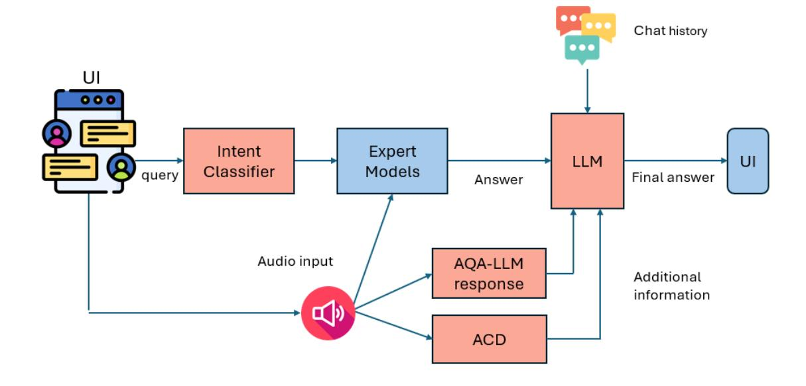

# Audio Query Handling System with Integrated Expert Models and Contextual Understanding

#### Vakada Naveen1 , Arvind Krishna Sridhar2 , Yinyi Guo2 , Erik Visser2

1Qualcomm India Private Limited, Hyderabad, India 2Qualcomm Technologies Inc., San Diego, CA, USA nvakada@qti.qualcomm.com, arvisrid@qti.qualcomm.com, yinyig@qti.qualcomm.com, evisser@qti.qualcomm.com

# Abstract

This paper presents an audio chatbot system designed to handle a wide range of audio-related queries by integrating multiple specialized audio processing models. The proposed system uses an intent classifier, trained on a diverse audio query dataset, to route queries about audio content to expert models such as Automatic Speech Recognition (ASR), Speaker Diarization, Music Identification, and Text-to-Audio generation. A novel audio intent classification dataset is developed for building the intent classifier. A 3.8 B LLM model then takes inputs from an Audio Context Detection (ACD) module extracting audio event information from the audio and post processes text domain outputs from the expert models to compute the final response to the user. We evaluated the system on custom audio tasks and MMAU sound set benchmarks. The custom datasets were motivated by target use cases not covered in industry benchmarks. We proposed ACD-timestamp-QA (Question Answering) as well as ACDtemporal-QA datasets to evaluate timestamp and temporal reasoning questions, respectively. First, we determined that a BERT based Intent Classifier outperforms LLM-fewshot intent classifier in routing queries. Experiments further show that our approach significantly improves accuracy on some custom tasks compared to state-of-the-art Large Audio Language Models and outperforms models in the 7B parameter size range on the sound testset of the MMAU benchmark, thereby offering an attractive option for on device deployment.

# 1 Introduction

The rapid advancement of LLMs has significantly transformed the capabilities of chatbot systems, particularly in handling text-based queries [\(Kumar](#page-7-0) [et al.,](#page-7-0) [2023\)](#page-7-0). However, the domain of audio content related queries remains relatively underexplored, with existing chatbots often limited to specific audio tasks [\(Microsoft,](#page-8-0) [2015;](#page-8-0) [Google,](#page-7-1) [2010;](#page-7-1) [AWS,](#page-7-2) [2017;](#page-7-2) [Chu et al.,](#page-7-3) [2023;](#page-7-3) [Tang et al.,](#page-8-1) [2023\)](#page-8-1). There is an increasing demand for intelligent systems capable of processing and understanding audio data in various contexts [\(Zhao et al.,](#page-8-2) [2019\)](#page-8-2). Whether it is recognizing music tracks, transcribing spoken language, or identifying speakers in a conversation, the ability to accurately interpret audio inputs is crucial for enhancing user interaction and satisfaction. Traditional chatbots like LUIS [\(Microsoft,](#page-8-0) [2015\)](#page-8-0), DialogFlow [\(Google,](#page-7-1) [2010\)](#page-7-1) and Lex [\(AWS,](#page-7-2) [2017\)](#page-7-2) , which primarily focus on speech or text, fail to meet these needs, highlighting the necessity for a more comprehensive approach. Even the latest multimodal LLMs are targeted towards specific speech and general audio related tasks [\(Tang et al.,](#page-8-1) [2023;](#page-8-1) [Chu et al.,](#page-7-3) [2023;](#page-7-3) [Gong et al.,](#page-7-4) [2023;](#page-7-4) [Wu et al.,](#page-8-3) [2023\)](#page-8-3) fail to answer diverse audio queries.

This paper[1](#page-0-0) introduces a novel chatbot system designed to address a broad spectrum of audiorelated queries by integrating multiple specialized audio processing models. Our goal is to create a versatile and robust solution that surpasses the limitations of current systems. To this end, we first developed an intent classifier that effectively routes user queries to the appropriate audio expert models. This classifier was trained on a diverse dataset of audio-related questions, ensuring it can handle a wide range of queries with high accuracy. By leveraging advanced models such as Automatic Speech Recognition (ASR) [\(Malik et al.,](#page-8-4) [2021\)](#page-8-4), Speaker Diarization [\(Park et al.,](#page-8-5) [2022\)](#page-8-5) , Music Identification [\(Chaouch et al.,](#page-7-5) [2020\)](#page-7-5), and Text to Audio generation [\(Huang et al.,](#page-7-6) [2023\)](#page-7-6), our system can process and respond to complex audio queries that require a combination of one or more of these expert models. Moreover, our system incorporates language models to provide coherent and contextually relevant responses. These models integrate

1This work was previously made available as a preprint on [arXiv:2412.03980.](https://arxiv.org/abs/2412.03980)

text outputs from the audio expert models with additional context from the Audio Context Detection (ACD) model [\(Kong et al.,](#page-7-7) [2020\)](#page-7-7), which predicts audio events present in an audio along with their timestamps. This integration is particularly beneficial for handling multifaceted queries that require a deep understanding of the audio context.

To our knowledge, we are the first to propose a comprehensive solution for audio-related queries by integrating specialized audio processing and advanced language models. In addition we introduce a novel audio intent dataset for training a BERT based query intent classifier and assess system performance on two new benchmark datasets for temporal reasoning tasks beyond what is covered in MMAU sound set.

## 2 Related Works / Background

#### 2.1 Large Audio Language Models

Recent studies have explored the integration of speech signals into large language models (LLMs), enabling them to directly process and understand general audio inputs. SALMONN [\(Tang et al.,](#page-8-1) [2023\)](#page-8-1) is a speech audio language music open neural network that integrates a pre-trained text-based LLM with speech and audio encoders into a single multimodal model, achieving competitive performance on various speech and audio tasks. Similarly, the Qwen-Audio [\(Chu et al.,](#page-7-3) [2023\)](#page-7-3) model scales up pre-training to cover over 30 tasks and various audio types, enhancing interaction capabilities with Qwen-Audio-Chat for multi-turn dialogues. The LTU (Listen, Think, and Understand) model [\(Gong et al.,](#page-7-4) [2023\)](#page-7-4) introduces a new approach by combining audio perception with reasoning abilities, trained on the OpenAQA-5M dataset to exhibit strong performance on classification and captioning tasks, as well as emerging audio reasoning and comprehension abilities. GAMA, a general purpose Large Audio-Language Model (LALM) [\(Ghosh et al.,](#page-7-8) [2024\)](#page-7-8) , integrates multiple audio representations and fine-tunes on a large-scale audiolanguage dataset, augmented with complex reasoning abilities through instruction-tuning with a synthetically generated CompA-R (Instruction-Tuning for Complex Audio Reasoning) dataset, demonstrating advanced audio understanding and reasoning capabilities.

Another approach to integrating speech signals into LLMs is the use of decoder-only architectures, such as Speech-LLaMA [\(Wu et al.,](#page-8-3) [2023\)](#page-8-3). This model leverages a decoder-only architecture

to map compressed acoustic features to the continuous semantic space of the LLM, demonstrating a significant improvement over strong baselines on multilingual speech-to-text translation tasks. Furthermore, LauraGPT [\(Du et al.,](#page-7-9) [2023\)](#page-7-9) is a unified audio-and-text GPT-based LLM that can process both audio and text inputs and generate outputs in either modalities.These advances in audio-text integration demonstrate the potential of LLMs in handling audio-related tasks.

#### 2.2 Chatbot Systems

Our work builds upon the recent advances in large language models (LLMs) and their applications in various domains, particularly in the area of multimodal reasoning and action. Recent studies have shown that multimodal LLMs can be used for various audio and vision tasks, such as audio generation and editing [\(Liang et al.,](#page-8-6) [2024\)](#page-8-6), speech recognition [\(Huang et al.,](#page-7-10) [2024\)](#page-7-10), and image generation [\(Surís et al.,](#page-8-7) [2023\)](#page-8-7). Additionally, the concept of generalist agents, which aim to combine basic skills to solve complex tasks [\(Ge et al.,](#page-7-11) [2024\)](#page-7-11), has been explored in the context of LLMs. Furthermore, the use of LLMs to execute computer tasks guided by natural language [\(Kim et al.,](#page-7-12) [2024\)](#page-7-12) has been demonstrated, and open-source AGI platforms that integrate LLMs with domain-specific expert models to solve complex tasks [\(Deng et al.,](#page-7-13) [2024\)](#page-7-13) have been proposed. However, these works do not specifically address the challenge of handling diverse audio-related queries, which is the focus of our paper.

# 2.3 Intent classification

Intent classification entails identifying the main objective or intent of a particular text. There are several datasets used for this task. Specifically, SNIPS [\(Coucke et al.,](#page-7-14) [2018\)](#page-7-14) dataset covers various domains like music, weather, and booking services, while ATIS [\(Hemphill et al.,](#page-7-15) [1990\)](#page-7-15) is focused on the air travel domain. The Banking dataset [\(Casanueva et al.,](#page-7-16) [2020\)](#page-7-16) is specific to banking and finance, and the Massive dataset [\(FitzGerald et al.,](#page-7-17) [2022\)](#page-7-17) spans multiple languages and domains. The SLURP dataset [\(Bastianelli et al.,](#page-7-18) [2020\)](#page-7-18) is a large and diverse multi-domain dataset for end-to-end spoken language understanding, featuring around audio recordings annotated with scenarios and actions. Studies [\(Larson et al.,](#page-8-8) [2019\)](#page-8-8) have shown that transformer based BERT based models give the best performance. Recently LLM based approaches [\(Benayas et al.,](#page-7-19) [2024;](#page-7-19) [Parikh et al.,](#page-8-9) [2023;](#page-8-9)

Figure 1: Proposed chatbot system

Loukas et al., 2023) have also been proposed which involves various methods of few shot prompting.

#### 2.4 Expert Audio Models

A variety of expert models have been deployed for specialized audio tasks and we narrow the description here to a few models explored and aligned with the use cases targeted in this work. Whisper (Radford et al., 2023) is utilized for Automatic Speech Recognition (ASR), while the ACRCloud API (ACRCloud, 2024) is applied for music identification and recommendation tasks. Pvannote (Bredin, 2023) is used for speaker diarization, and the VoiceFilter model (Wang et al., 2018) is implemented for personalized speech separation and removal. Additionally, the Audio Question Answering (AQA)-LLM (Sridhar et al., 2024) is deployed for answering general audio event-related questions. The Audio Context Detection(ACD) model is based on CNN10 PANN (Kong et al., 2020; Mahfuz et al., 2023) pretrained for audio tagging. The detected audio events and timestamps are determined after applying thresholds on the frame-level probabilities of the model output.

#### 3 Proposed Method

The proposed chatbot is illustrated by Figure 1 and is based on determining the intent contained in audio related text queries to then route them to the appropriate audio models. The User Interface (UI) captures audio input and user queries, then displays the responses in natural language. Its individual modules are described in the following sections.

#### 3.1 Intent Classifier

| Class                             | <b>Training Count</b> | <b>Test Count</b> | <b>Total Count</b> |
|-----------------------------------|-----------------------|-------------------|--------------------|
| Audio/Text to Audio               | 1909                  | 478               | 2387               |
| LLM                               | 1893                  | 473               | 2366               |
| Music recommendation              | 917                   | 230               | 1147               |
| ASR whisper                       | 778                   | 194               | 972                |
| Music identification              | 643                   | 161               | 804                |
| Speaker ID, Diarization, counting | 602                   | 150               | 752                |
| Source separation/removal         | 243                   | 61                | 304                |
| Unsupported                       | 2343                  | 586               | 2929               |
| Total                             | 10328                 | 2333              | 12661              |

Table 1: Proposed Dataset for audio intent classification

To build an intent classifier for handling audio queries, we conducted a survey to collect a diverse set of questions related to audio. These questions were then classified to create a robust dataset, which was used to train the intent classifier. Our question crowd sourced dataset was acquired through a survey involving 150 participants. This approach was chosen to ensure the data reflects reallife questions people may ask, rather than relying on potentially less authentic open-source datasets. Notably, there are no open-source human generated datasets available for audio intent classifications that cover the queries for the wide range of expert models mentioned in the previous section, making our dataset unique. Sample queries for each class in the intent classification dataset is shown in Appendix A.The dataset is divided into training and test sets, as detailed in Table 1, with a total of 12,661 entries, including 10,328 for training and 2,333 for testing. Table 2 shows a comparison with other intent classification datasets.

| Dataset             | # Training | # Testing | # Intents |
|---------------------|------------|-----------|-----------|
| SNIPS               | 13084      | 1400      | 7         |
| ATIS                | 4455       | 1373      | 17        |
| Banking             | 10003      | 3080      | 77        |
| Massive             | 11514      | 3974      | 60        |
| SLURP               | 11514      | 2974      | 18        |
| Audio-Intent (Ours) | 10382      | 2333      | 8         |

Table 2: Intent Classification Datasets

The intent classes include Audio/Text to Audio, LLM, Music recommendation, ASR whisper, Music identification, Speaker ID, Diarization, counting, Source separation/removal, and Unsupported (to classify unsupported tasks). We evaluated the performance of two models: a Bert-based intent classifier and a LLM-Fewshot intent classifier. We use modern-BERT [\(Warner et al.,](#page-8-15) [2024\)](#page-8-15) for our expertiments as it shows better performance than the orginal versions for various NLP tasks. Even though using LLMs for intent classification can be resource-intensive for relatively simple tasks and may not be suitable for real world applications. we evaluated a fewshot classification approach using the Phi-3.5 model [\(Abdin et al.,](#page-6-1) [2024\)](#page-6-1) to ensure a comprehensive evaluation.

The evaluation metrics include Precision, Recall, and F1-score for each class. Table [3](#page-4-0) presents the detailed performance metrics for both models. The results show that the Bert-based intent classifier gives better results over all these metrics when compared to the fewshot LLM intent classifier. Hence, we use the Bert-based intent classifier which is also much smaller than the LLM intent classifier in the proposed system. LLM based intent classifiers [\(Benayas et al.,](#page-7-19) [2024;](#page-7-19) [Parikh et al.,](#page-8-9) [2023;](#page-8-9) [Loukas et al.,](#page-8-10) [2023\)](#page-8-10) that use various methods of prompting and fine-tuning that can give better performance than the few-shot approach was proposed. Since the focus of this paper is to develop a system that can be deployed on edge devices, we constrain ourselves to smaller models like BERT instead of using LLMs for the same task. Using LLMs for intent classification is costly in terms of efficiency and inference speed.

#### 3.2 Expert models

The trained BERT intent classifier next routes queries to expert audio task models. Our system incorporates several such models.The Automatic Speech Recognition (ASR) model, exemplified by Whisper [\(Radford et al.,](#page-8-11) [2023\)](#page-8-11), converts spoken language into text, enabling the system to understand and process verbal queries. The Speaker Di-

arization model, such as Pyannote [\(Bredin,](#page-7-20) [2023\)](#page-7-20), identifies and segments different speakers in an audio file, which is particularly useful in multispeaker environments. For music-related queries, the Music Identification model, like ACRcloud [\(ACRCloud,](#page-6-0) [2024\)](#page-6-0), recognizes and provides information about music tracks. Additionally, the Text to Audio model generates audio content from text inputs, facilitating the creation of audio responses [\(Huang et al.,](#page-7-6) [2023\)](#page-7-6). The Audio Question Answering Large Language Model (AQA-LLM) [\(Sridhar](#page-8-13) [et al.,](#page-8-13) [2024\)](#page-8-13) is designed to answer questions related to audio events, while the VoiceFilter model [\(Wang et al.,](#page-8-12) [2018\)](#page-8-12) handles target source separation and removal tasks. Details of the expert model complexities and the deployment can be found in Appendix D and E.

## 3.3 Response generation with RAG based LLM

In the final stage, an LLM combines answers from the expert models with chat history and additional inputs from the Audio Context Detection (ACD) model and the AQA-LLM. The chat history consists of the all the conversation happened till the previous turn. We limit the chat history to the last 10 turns since the context length since we have seen degradation of the model performance as the input tokens increases. We chose Phi-3.5 LLM because of its competitive performance on various NLP benchmarks and a 3.8-B parameter model can be deployed on edge devices like mobile phones after further optimizations [\(Abdin et al.,](#page-6-1) [2024\)](#page-6-1).

The Audio Context Detection (ACD) model [\(Kong et al.,](#page-7-7) [2020;](#page-7-7) [Mahfuz et al.,](#page-8-14) [2023\)](#page-8-14) provides meta data containing detailed event and timestamp information. This model enhances the understanding of the audio environment, allowing the system to generate more accurate and contextually appropriate responses, particularly for queries that require precise timestamp-related information.

To ensure robustness and user satisfaction, our system includes a fallback mechanism. When the expert models are unable to address a query, the AQA-LLM model generates generic answers. This fallback mechanism ensures that the system can handle a wide range of queries, maintaining a high level of user satisfaction even in scenarios where specific expert models may not have the required information. Some examples generated by the proposed chatbot can be found in Figure [2.](#page-6-2)

| Class Name                        | Bert-based Intent Classifier |        | Phi 3.5 - Fewshot Intent Classifier |           |        |          |
|-----------------------------------|------------------------------|--------|-------------------------------------|-----------|--------|----------|
|                                   | Precision                    | Recall | F1-score                            | Precision | Recall | F1-score |
| Music identification              | 0.98                         | 1.00   | 0.99                                | 0.63      | 0.84   | 0.72     |
| Music recommendation              | 0.80                         | 0.91   | 0.85                                | 0.88      | 0.61   | 0.72     |
| ASR whisper                       | 0.86                         | 0.86   | 0.86                                | 0.36      | 0.54   | 0.43     |
| Speaker ID, Diarization, counting | 0.97                         | 0.87   | 0.92                                | 0.72      | 0.68   | 0.70     |
| Audio/Text to Audio               | 0.95                         | 1.00   | 0.97                                | 0.86      | 0.37   | 0.52     |
| Source separation/removal         | 0.98                         | 0.74   | 0.84                                | 0.20      | 0.89   | 0.32     |
| LLM                               | 0.87                         | 0.88   | 0.88                                | 0.09      | 0.09   | 0.09     |
| Unsupported                       | 0.84                         | 0.83   | 0.85                                | 0.18      | 0.17   | 0.18     |
| Overall accuracy                  |                              | 0.90   |                                     |           | 0.37   |          |

Table 3: Performance metrics for Bert-based and LLM-Fewshot intent classifiers.

## 4 Experimental validation

#### 4.1 Custom audio benchmark task datasets

The two proposed temporal benchmark datasets have two primary applications. Firstly, these datasets are valuable for evaluating Retrieval Augmented Generation (RAG) based approaches, where audio information is represented in text format and text-only LLMs are used to answer audio queries [\(Sakshi et al.,](#page-8-16) [2024\)](#page-8-16). This is facilitated by providing the ground truth ACD metadata in text format along with the QA pairs. Secondly, these datasets are used to directly assess explicit timestamp retrieval and temporal understanding capabilities required for audio scene understanding in security and monitoring applications for example [\(Sridhar et al.,](#page-8-13) [2024\)](#page-8-13).

An essential category of questions in our audio chatbot system pertains to timestamp inquiries based on ACD metadata or speaker diarization. To address this, we developed the ACD-timestamp-QA dataset, which comprises 960 entries generated using GPT-4 data augmentation techniques [\(Gong et al.,](#page-7-4) [2023\)](#page-7-4) to create QA pairs from ground truth audio events data about timestamp information. We used two different representations for the ACD metadata. The first representation is an explicit string format, where the event name, start time, and duration are provided in natural language sentences. The second representation uses JSON entries, which include the audio event name, start time, end time, duration, and the order of the event, with end time, duration, and order explicitly inserted. Our experiments, detailed in the subsequent section, demonstrate that the JSON format with additional explicit information significantly enhances performance compared to the string format. We also developed the ACD-temporal-QA benchmark

to evaluate the temporal audio skills of our approach. Using the GPT-4 model, we generated 1,500 temporal QA pairs from the ground audio events of the Audioset dataset [\(Gemmeke et al.,](#page-7-21) [2017\)](#page-7-21) as proposed in [\(Gong et al.,](#page-7-4) [2023\)](#page-7-4). These questions encompass queries about the chronological order of audio events. We present the results of our experiments in the next section. The ACDtemporal-QA dataset, on the other hand, consists of QA pairs that demand reasoning about the chronological order and temporal nature of audio events, with answers being either "yes" or "no."

We utilized the timestamp dataset to derive better representations for ACD metadata and employed the temporal benchmark to evaluate zero-shot, fewshot, and chain-of-thought (CoT) based methods. We present the results of our experiments in section 4.3.1. More details of the proposed custom benchmark tasks can be found in Appendix B and C.

#### 4.2 MMAU sound set benchmark

Our datasets differ from the MMAU benchmark [\(Sakshi et al.,](#page-8-16) [2024\)](#page-8-16) as they include ground truth audio events and their timestamps as metadata, which is crucial for assessing the performance of textonly LLMs in temporal and timestamp reasoning. While the MMAU benchmark also features temporal questions, they are multiple-choice and lack the ground truth audio metadata. We use the MMAU benchmark for comparison with other LALMs only. Sample queries for these proposed datasets can be found in Appendix B and C.

## 4.3 Results and Discussion 4.3.1 Phi+ACD configuration comparisons

We first evaluated the performance of different models using various ACD metadata types on the

| <b>Model Name</b> | Metadata Type | Accuracy % |
|-------------------|---------------|------------|
| AQA-LLM           | String format | 74.27      |
| AQA-LLM           | JSON format   | 80.21      |
| Phi-3.5           | String format | 89.75      |
| Phi-3.5           | JSON format   | 96.35      |

Table 4: Accuracy of different models with various ACD - Metadata types.

| Method         | Additional Input | Accuracy (%) |
|----------------|------------------|--------------|
| Zeroshot       | Ground truth     | 71.6         |
| Zeroshot + CoT | Ground truth     | 73.66        |
| Fewshot + CoT  | Ground truth     | 65           |
| Zeroshot       | ACD predictions  | 50.34        |
| Zeroshot + CoT | ACD predictions  | 48.54        |
| Fewshot + CoT  | ACD predictions  | 46.12        |

Table 5: System configuration comparisons on custom datasets

| Model   | Size (Billion Parameters) | Dataset          | Accuracy |
|---------|---------------------------|------------------|----------|
| Phi+ACD | 3.8                       | ACD-temporal-QA  | 50.34    |
| Qwen    | 8.4                       | ACD-temporal-QA  | 44.87    |
| GAMA    | 7                         | ACD-temporal-QA  | 57.53    |
| Phi+ACD | 3.8                       | ACD-timestamp-QA | 37.57    |
| Qwen    | 8.4                       | ACD-timestamp-QA | 30.66    |
| GAMA    | 7                         | ACD-timestamp-QA | 28.56    |

Table 6: Model Performance on Different Datasets

ACD-timestamps-QA dataset. Specifically, we compared the AQA-LLM model and the Phi-3.5 model using both string format and JSON format with extra information. The results, shown in Table 4, indicate that the JSON format with additional explicit information significantly improves accuracy. Note that we used the ground truth ACD data as the inputs while evaluating these models. The prompts used for the experiments in Table 5 are presented in Appendix F.

Table 5 presents the evaluation results of the Phi model using different prompting methods (Kojima et al., 2022) and additional inputs on the ACD-temporal-QA dataset. The highest accuracy of 73.66% was achieved using the Zeroshot + CoT method with ground truth audio events. CoT method involves prompting the model to provide explanations along with the answers. This indicates that combining the Chain of Thought (CoT) approach with zeroshot method significantly improves performance when accurate audio event data is available. In contrast, the Fewshot + CoT method with ground truth audio events resulted in a lower accuracy of 65%, suggesting that the Fewshot ap-

| Name                              | Size | Accuracy (%) |
|-----------------------------------|------|--------------|
| Random Guess                      |      | 26.72        |
| Most Frequent Choice              | -    | 27.02        |
| 1                                 | -    | 86.31        |
| Human (test-mini)                 | _    | 80.31        |
| Pengi                             | 323M | 6.1          |
| Audio Flamingo Chat               | 2.2B | 23.42        |
| LTU                               | 7B   | 22.52        |
| LTU AS                            | 7B   | 23.35        |
| MusiLingo                         | 7B   | 23.12        |
| MuLLaMa                           | 7B   | 40.84        |
| M2UGen                            | 7B   | 3.6          |
| GAMA *                            | 7B   | 41.44        |
| GAMA-IT                           | 7B   | 43.24        |
| Qwen-Audio-Chat                   | 8.4B | 55.25        |
| Qwen2-Audio                       | 8.4B | 7.5          |
| Qwen2-Audio-Instruct *            | 8.4B | 54.95        |
| SALMONN                           | 13B  | 41           |
| Gemini Pro v1.5                   | -    | 56.75        |
| GPT4o + weak cap.                 | -    | 39.33        |
| GPT4o + strong cap.               | -    | 57.35        |
| Llama-3-Instruct + weak cap.      | 8B   | 34.23        |
| Llama-3-Ins. + strong cap.        | 8B   | 50.75        |
| Phi-3.5 + ACD (proposed approach) | 3.8B | 50.75        |

Table 7: Results on MMAU Sound Test Split. The entries marked with \* are reproduced by our experiments and the other values are taken from MMAU paper (Sakshi et al., 2024) for comparison.

proach may not be as effective in this context. The fewshot method has 2 example QA pairs in the prompt. Detailed prompts for these approaches can be found in Appendix F.

When using ACD predictions as additional input, all methods showed a notable decrease in accuracy. The Zeroshot method achieved 50.34%, while the Zeroshot + CoT and Fewshot + CoT methods resulted in even lower accuracies of 48.54% and 46.12%, respectively. This decline highlights the challenges of using predicted data, which may introduce errors that negatively impact the model's performance. Overall, the results suggest that assuming the ACD model predictions are reliable, Zeroshot + CoT is the best prompting method for accurate answers and is henceforth referred to as Phi+ACD in the following subsection.

#### 4.3.2 Comparison with SOTA models

Table 6 presents the performance comparison between SOTA Large Audio Language Models, and our proposed approach, Phi+ACD, across the two proposed datasets: ACD-temporal-QA and ACD-timestamp-QA. The 7B GAMA model (Ghosh et al., 2024) achieved the highest accuracy on the ACD-temporal-QA dataset with 57.53%, followed

by the 3.8 B Phi+ACD at 50.34%, and Qwen at 44.87%. On the ACD-timestamp-QA dataset, Phi+ACD leads with 37.57% accuracy, while Qwen [\(Chu et al.,](#page-7-3) [2023\)](#page-7-3) and GAMA scored 30.66% and 28.56%, respectively. These results indicate that the GAMA model performs best on temporal question answering tasks, while Phi+ACD shows better performance on timestamp-related questions.

Table [7](#page-5-3) summarizes the results of various models on the MMAU benchmark sound test split. The entries marked with \* are reproduced by our experiments and the other values are taken from MMAU paper [\(Sakshi et al.,](#page-8-16) [2024\)](#page-8-16) for comparison. Our Phi-3.5 + ACD model achieved an accuracy of 50.75% and hence outperforms many of the 7B param range models and gives similar performance to the 8B param range Llama-3Instruct + strong cap [\(Sak](#page-8-16)[shi et al.,](#page-8-16) [2024\)](#page-8-16) . However it is outperformed by much larger models such as GPT-4o + strong cap. (57.35%) and Gemini Pro v1.5 (56.75%).

Human performance on the test-mini split is significantly higher at 86.31%, highlighting the gap between current models and human-level understanding. Among the models, Qwen-Audio-Chat (55.25%) and Qwen-2-Audio-Instruct (54.95%) also show strong performance, at the expense of larger model sizes and requiring specialized instruction tuning.

# 4.3.3 Human evaluation

we conducted a human evaluation across 161 multiturn audio queries. Annotators categorized responses into error types and correctness. The system produced 43 satisfactory answers, while 35 challenges were raised where users disagreed with the system's interpretation. The most frequent error was "Does not hear something" (29 instances), followed by "Hears something not there" (24) and "Flip flops from agreed facts" (21).

#### 4.3.4 Qualitative examples

We also show two qualitative results from the chatbot in Figure [2](#page-6-2) where our chatbot leverages various expert models to answer diverse audio queries.

## 5 Conclusion

This paper introduces a comprehensive chatbot system that integrates multiple specialized audio processing models and advanced language models to handle a wide range of audio-related queries. Our approach demonstrates competitive performance on custom and MMAU sound set benchmarks when

Figure 2: Qualitative examples generated by the proposed chatbot

compared against similar sized (3-7B param) models, showcasing its effectiveness in addressing complex audio queries with a tractable footprint. We intend to conduct further system optimizations in future work with the goal of deploying the models on devices with real time computational constraints.

## 6 Limitations

Misclassifying the intents by the intent classifier can lead to generation of irrelevant responses by the expert models, ultimately affecting the overall user experience. To mitigate the consequences of this limitation we will flag responses with low confidence during intent classification or audio event detection to alert users of potential inaccuracies. Additionally, the general purpose AQA-LLM module serves as a fallback option in case of intent classification or ACD detection errors, ensuring that users receive a relevant response. Our evaluation primarily focused on custom audio tasks and the MMAU sound set benchmarks. However, these metrics may not fully capture the system's performance across all potential use cases.

## References

Marah Abdin, Jyoti Aneja, Hany Awadalla, Ahmed Awadallah, Ammar Ahmad Awan, Nguyen Bach, Amit Bahree, Arash Bakhtiari, Jianmin Bao, Harkirat Behl, et al. 2024. Phi-3 technical report: A highly capable language model locally on your phone. *arXiv preprint arXiv:2404.14219*.

ACRCloud. 2024. Acrcloud: Audio recognition platform. <https://www.acrcloud.com/>. Available at: <https://www.acrcloud.com/>.

- Inc. AWS. 2017. [Amazon lex – build conversation bots.](https://docs.aws.amazon.com/lex/latest/dg/what-is.html) [cited 30/11/2024].
- Emanuele Bastianelli, Andrea Vanzo, Pawel Swietojanski, and Verena Rieser. 2020. Slurp: A spoken language understanding resource package. *arXiv preprint arXiv:2011.13205*.
- Alberto Benayas, Sicilia Miguel-Ángel, and Marçal Mora-Cantallops. 2024. Enhancing intent classifier training with large language model-generated data. *Applied Artificial Intelligence*, 38(1):2414483.
- Hervé Bredin. 2023. pyannote. audio 2.1 speaker diarization pipeline: principle, benchmark, and recipe. In *24th INTERSPEECH Conference (INTER-SPEECH 2023)*, pages 1983–1987. ISCA.
- Iñigo Casanueva, Tadas Temcinas, Daniela Gerz, ˇ Matthew Henderson, and Ivan Vulic. 2020. Efficient ´ intent detection with dual sentence encoders. *arXiv preprint arXiv:2003.04807*.
- Chakib Chaouch, Murtadha Arif Bin Sahbudin, Marco Scarpa, Salvatore Serrano, et al. 2020. Audio fingerprint database structure using k-modes clustering. *Journal of Advanced Research in Dynamical and Control Systems*, 12(4):1545–1554.
- Yunfei Chu, Jin Xu, Xiaohuan Zhou, Qian Yang, Shiliang Zhang, Zhijie Yan, Chang Zhou, and Jingren Zhou. 2023. Qwen-audio: Advancing universal audio understanding via unified large-scale audiolanguage models. *arXiv preprint arXiv:2311.07919*.
- Alice Coucke, Alaa Saade, Adrien Ball, Théodore Bluche, Alexandre Caulier, David Leroy, Clément Doumouro, Thibault Gisselbrecht, Francesco Caltagirone, Thibaut Lavril, et al. 2018. Snips voice platform: an embedded spoken language understanding system for private-by-design voice interfaces. *arXiv preprint arXiv:1805.10190*.
- Xiang Deng, Yu Gu, Boyuan Zheng, Shijie Chen, Sam Stevens, Boshi Wang, Huan Sun, and Yu Su. 2024. Mind2web: Towards a generalist agent for the web. *Advances in Neural Information Processing Systems*, 36.
- Zhihao Du, Jiaming Wang, Qian Chen, Yunfei Chu, Zhifu Gao, Zerui Li, Kai Hu, Xiaohuan Zhou, Jin Xu, Ziyang Ma, et al. 2023. Lauragpt: Listen, attend, understand, and regenerate audio with gpt. *arXiv preprint arXiv:2310.04673*.
- Jack FitzGerald, Christopher Hench, Charith Peris, Scott Mackie, Kay Rottmann, Ana Sanchez, Aaron Nash, Liam Urbach, Vishesh Kakarala, Richa Singh, et al. 2022. Massive: A 1m-example multilingual natural language understanding dataset with 51 typologically-diverse languages. *arXiv preprint arXiv:2204.08582*.
- Yingqiang Ge, Wenyue Hua, Kai Mei, Juntao Tan, Shuyuan Xu, Zelong Li, Yongfeng Zhang, et al. 2024. Openagi: When llm meets domain experts. *Advances in Neural Information Processing Systems*, 36.

- Jort F Gemmeke, Daniel PW Ellis, Dylan Freedman, Aren Jansen, Wade Lawrence, R Channing Moore, Manoj Plakal, and Marvin Ritter. 2017. Audio set: An ontology and human-labeled dataset for audio events. In *2017 IEEE international conference on acoustics, speech and signal processing (ICASSP)*, pages 776–780. IEEE.
- Sreyan Ghosh, Sonal Kumar, Ashish Seth, Chandra Kiran Reddy Evuru, Utkarsh Tyagi, S Sakshi, Oriol Nieto, Ramani Duraiswami, and Dinesh Manocha. 2024. Gama: A large audio-language model with advanced audio understanding and complex reasoning abilities. *arXiv preprint arXiv:2406.11768*.
- Yuan Gong, Hongyin Luo, Alexander H Liu, Leonid Karlinsky, and James Glass. 2023. Listen, think, and understand. *arXiv preprint arXiv:2305.10790*.
- Google. 2010. [Dialogflow.](https://dialogflow.com/) [cited 30/11/2024].
- Charles T Hemphill, John J Godfrey, and George R Doddington. 1990. The atis spoken language systems pilot corpus. In *Speech and Natural Language: Proceedings of a Workshop Held at Hidden Valley, Pennsylvania, June 24-27, 1990*.
- Rongjie Huang, Jiawei Huang, Dongchao Yang, Yi Ren, Luping Liu, Mingze Li, Zhenhui Ye, Jinglin Liu, Xiang Yin, and Zhou Zhao. 2023. Make-an-audio: Textto-audio generation with prompt-enhanced diffusion models. In *International Conference on Machine Learning*, pages 13916–13932. PMLR.
- Rongjie Huang, Mingze Li, Dongchao Yang, Jiatong Shi, Xuankai Chang, Zhenhui Ye, Yuning Wu, Zhiqing Hong, Jiawei Huang, Jinglin Liu, et al. 2024. Audiogpt: Understanding and generating speech, music, sound, and talking head. In *Proceedings of the AAAI Conference on Artificial Intelligence*, volume 38, pages 23802–23804.
- Geunwoo Kim, Pierre Baldi, and Stephen McAleer. 2024. Language models can solve computer tasks. *Advances in Neural Information Processing Systems*, 36.
- Takeshi Kojima, Shixiang Shane Gu, Machel Reid, Yutaka Matsuo, and Yusuke Iwasawa. 2022. Large language models are zero-shot reasoners. *Advances in neural information processing systems*, 35:22199– 22213.
- Qiuqiang Kong, Yin Cao, Turab Iqbal, Yuxuan Wang, Wenwu Wang, and Mark D Plumbley. 2020. Panns: Large-scale pretrained audio neural networks for audio pattern recognition. *IEEE/ACM Transactions on Audio, Speech, and Language Processing*, 28:2880– 2894.
- Vimal Kumar, Priyam Srivastava, Ashay Dwivedi, Ishan Budhiraja, Debjani Ghosh, Vikas Goyal, and Ruchika Arora. 2023. Large-language-models (llm)-based ai chatbots: Architecture, in-depth analysis and their performance evaluation. In *International Conference on Recent Trends in Image Processing and Pattern Recognition*, pages 237–249. Springer.

- Stefan Larson, Anish Mahendran, Joseph J Peper, Christopher Clarke, Andrew Lee, Parker Hill, Jonathan K Kummerfeld, Kevin Leach, Michael A Laurenzano, Lingjia Tang, et al. 2019. An evaluation dataset for intent classification and out-of-scope prediction. *arXiv preprint arXiv:1909.02027*.
- Jinhua Liang, Huan Zhang, Haohe Liu, Yin Cao, Qiuqiang Kong, Xubo Liu, Wenwu Wang, Mark D Plumbley, Huy Phan, and Emmanouil Benetos. 2024. Wavcraft: Audio editing and generation with natural language prompts. *arXiv preprint arXiv:2403.09527*.
- Lefteris Loukas, Ilias Stogiannidis, Odysseas Diamantopoulos, Prodromos Malakasiotis, and Stavros Vassos. 2023. Making llms worth every penny: Resource-limited text classification in banking. In *Proceedings of the Fourth ACM International Conference on AI in Finance*, pages 392–400.
- Rehana Mahfuz, Yinyi Guo, and Erik Visser. 2023. Improving audio captioning using semantic similarity metrics. In *ICASSP 2023-2023 IEEE International Conference on Acoustics, Speech and Signal Processing (ICASSP)*, pages 1–5. IEEE.
- Mishaim Malik, Muhammad Kamran Malik, Khawar Mehmood, and Imran Makhdoom. 2021. Automatic speech recognition: a survey. *Multimedia Tools and Applications*, 80:9411–9457.
- Microsoft. 2015. [Microsoft cognitive services: Luis.](https://www.luis.ai/home) [cited 30/11/2024].
- Soham Parikh, Quaizar Vohra, Prashil Tumbade, and Mitul Tiwari. 2023. Exploring zero and few-shot techniques for intent classification. *arXiv preprint arXiv:2305.07157*.
- Tae Jin Park, Naoyuki Kanda, Dimitrios Dimitriadis, Kyu J Han, Shinji Watanabe, and Shrikanth Narayanan. 2022. A review of speaker diarization: Recent advances with deep learning. *Computer Speech & Language*, 72:101317.
- Alec Radford, Jong Wook Kim, Tao Xu, Greg Brockman, Christine McLeavey, and Ilya Sutskever. 2023. Robust speech recognition via large-scale weak supervision. In *International conference on machine learning*, pages 28492–28518. PMLR.
- S Sakshi, Utkarsh Tyagi, Sonal Kumar, Ashish Seth, Ramaneswaran Selvakumar, Oriol Nieto, Ramani Duraiswami, Sreyan Ghosh, and Dinesh Manocha. 2024. Mmau: A massive multi-task audio understanding and reasoning benchmark. *arXiv preprint arXiv:2410.19168*.
- Arvind Krishna Sridhar, Yinyi Guo, and Erik Visser. 2024. Enhancing temporal understanding in audio question answering for large audio language models. *arXiv preprint arXiv:2409.06223*.
- Dídac Surís, Sachit Menon, and Carl Vondrick. 2023. Vipergpt: Visual inference via python execution for

- reasoning. In *Proceedings of the IEEE/CVF International Conference on Computer Vision*, pages 11888– 11898.
- Changli Tang, Wenyi Yu, Guangzhi Sun, Xianzhao Chen, Tian Tan, Wei Li, Lu Lu, Zejun Ma, and Chao Zhang. 2023. Salmonn: Towards generic hearing abilities for large language models. *arXiv preprint arXiv:2310.13289*.
- Quan Wang, Hannah Muckenhirn, Kevin Wilson, Prashant Sridhar, Zelin Wu, John Hershey, Rif A Saurous, Ron J Weiss, Ye Jia, and Ignacio Lopez Moreno. 2018. Voicefilter: Targeted voice separation by speaker-conditioned spectrogram masking. *arXiv preprint arXiv:1810.04826*.
- Benjamin Warner, Antoine Chaffin, Benjamin Clavié, Orion Weller, Oskar Hallström, Said Taghadouini, Alexis Gallagher, Raja Biswas, Faisal Ladhak, Tom Aarsen, et al. 2024. Smarter, better, faster, longer: A modern bidirectional encoder for fast, memory efficient, and long context finetuning and inference. *arXiv preprint arXiv:2412.13663*.
- Jian Wu, Yashesh Gaur, Zhuo Chen, Long Zhou, Yimeng Zhu, Tianrui Wang, Jinyu Li, Shujie Liu, Bo Ren, Linquan Liu, et al. 2023. On decoder-only architecture for speech-to-text and large language model integration. In *2023 IEEE Automatic Speech Recognition and Understanding Workshop (ASRU)*, pages 1–8. IEEE.
- Yuanjun Zhao, Xianjun Xia, and Roberto Togneri. 2019. Applications of deep learning to audio generation. *IEEE Circuits and Systems Magazine*, 19(4):19–38.

## A Intent classification dataset examples

A few sample questions for each class of the intent classification dataset can be found in Figure [3.](#page-9-0)

## B ACD-timestamp-QA dataset examples

Sample queries along with the ground truth ACD metadata for the ACD-timestamp-QA are presented in Figure [4.](#page-10-0)

## C ACD-temporal-QA dataset examples

Sample queries along with the ground truth ACD metadata for the ACD-temporal-QA are shown in Figure [5.](#page-10-1)

## D On-device and Cloud deployment

In future , based on resource availability, we propose to deploy the Whisper, ACD, Phi and Voice-Filter models on-device and all other remaining models in the cloud. Our approach of using various expert models gives us the flexibility to adopt such hybrid deployment framework.

| Question                                                                      | Intent Classifier    |  |
|-------------------------------------------------------------------------------|----------------------|--|
| Who is responsible for composing this piece?                                  | Music identification |  |
| Whose phone is this?                                                          | Unsupported          |  |
| Could you list more songs by this artist or composer?                         | Music recommendation |  |
| Get a list of classic novels written by Jane Austen.                          | Unsupported          |  |
| Is it conceivable for me to escalate the loudness of specific sound pitches?  | Audio/Text to Audio  |  |
| Is it possible for you to gauge the size of the crowd in this room?           | LLM                  |  |
| What was the title of the track that was playing?                             | Music identification |  |
| Can you identify the voices present in this audio file?                       | Unsupported          |  |
| Can you tell me the name of the person who wrote the music for this song?     | Music identification |  |
| What are the names of the musicians on this album?                            | Music identification |  |
| At what time do we hear the crowd booing?                                     | LLM                  |  |
| Which books or sources does the podcast reference?                            | ASR whisper          |  |
| May we consider playing the song in a key that's different from the original? | Audio/Text to Audio  |  |
| At what time did the glass shatter occur?                                     | LLM                  |  |
| Can you specify where this audio was recorded?                                | LLM                  |  |
| Can I control the audio to heighten the volume of selected sounds?            | Audio/Text to Audio  |  |
| Do you have recommendations for other tracks that vibe like this one?         | Music recommendation |  |

Figure 3: Sample queries from the proposed intent classification dataset

## E Model complexities

We have customized the expert models with our in-house training data and architectures, hence the model complexity may vary from the open-source implementations. The approximate number of parameters for the expert models we used is shown in Table [8](#page-9-1)

| Model       | Size |
|-------------|------|
| ACD         | 5.5M |
| ACR-cloud   | -    |
| Pyannote    | 31M  |
| VoiceFilter | 6.8M |
| AQA-LLM     | 7B   |
| Whisper     | 39M  |

Table 8: Model Sizes

## F Prompts used for various methods

Prompts used for Zero-shot, Chain of Thought and Few-shot methods can be found in Figure [6](#page-11-0)

#### Time-QA audio sample 1:

**Audio description:** Male speech begins at 4.8 seconds and lasts for 1.0 seconds. Then Tick occurs at 6.9 seconds and continues for 0.1 seconds. Then Wind noise (microphone) occurs at 8.5 seconds and persisting for 0.6 seconds. The background sound is Buzz.

Question 1: When does the Tick occur?

**Answer 1:** 6.9

Question 2: How long does the Wind noise (microphone)

last?

**Answer 2:** 0.6

#### Time-QA audio sample 2:

**Audio description:** Tick occurs at 8.0 seconds and lasts for 0.2 seconds. The background sound is Hair dryer.

**Question 1:** At what second does the tick occur in the audio file?

**Answer 1:** 8.0

Question 2: "How long does the tick last in the audio file?

Answer 2: 0.2

Figure 4: Sample queries from ACD-timestamp-QA dataset

#### Temporal-QA audio sample 1:

**Audio description:** Cheering occurs at 2.6 seconds and persisting for 4.6 seconds. Then Crowd starts at 2.6 seconds and persisting for 6.6 seconds. Then Whistling begins at 5.6 seconds and persisting for 1.0 seconds. Then Clapping starts at 7.2 seconds and persisting for 1.4 seconds. Then Whistling starts at 8.1 seconds and continues for 1.1 seconds. The background sound is Music.

**Question 1:** Did the first instance of Whistling occur before Clapping started?

Answer 1: True

**Question 2:** Is this sequence of audio events correct - Cheering, Clapping, Whistling?

Answer 2: False

#### Temporal-QA audio sample 2:

**Audio description:** Human voice occurs at 2.3 seconds and lasts for 0.3 seconds. Followed by Female speech begins at 2.8 seconds and continues for 1.1 seconds. Then Static occurs at 3.5 seconds and lasts for 0.2 seconds. Then Static occurs at 4.0 seconds and continues for 0.8 seconds. Then Animal begins at 4.9 seconds and lasts for 3.0 seconds. Then Static begins at 8.0 seconds and continues for 0.3 seconds. The background sound is Music.

**Question 1:** Did the static at 4.0 seconds occur before the animal sound?

Answer 1: True

**Question 2:** Is this sequence of audio events correct: Female speech, Human voice, Animal?

Answer 2: False

Figure 5: Sample queries from ACD-temporal-QA dataset

Figure 6: Prompts used for various methods