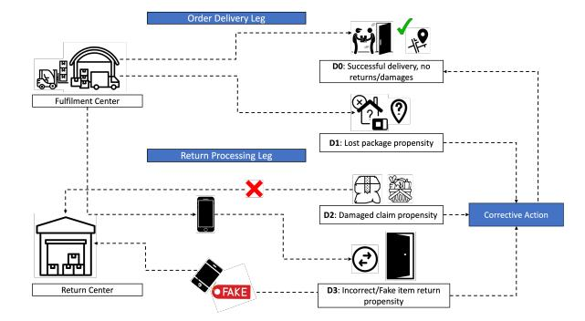
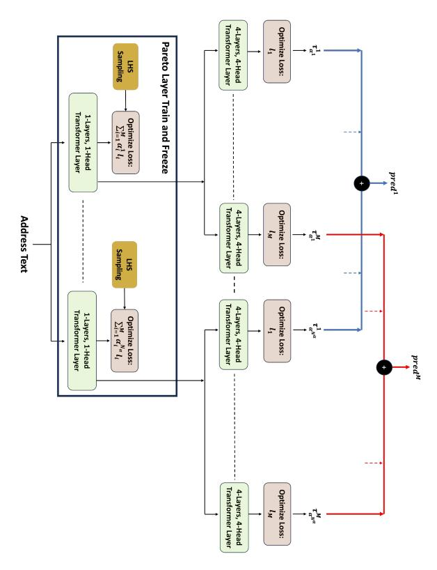
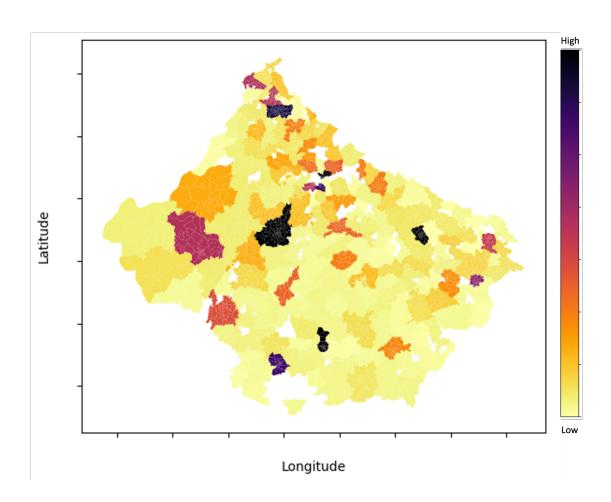

# **An Address Intelligence Framework for E-commerce Deliveries**

## **Gokul Swamy, Aman Gulati, Srinivas Virinchi, Anoop Saladi**

{swagokul, amangula, virins, saladias}@amazon.com

## **Abstract**

For an e-commerce domain, the address is the single most important piece of data for ensuring accurate and reliable deliveries. In this two-part study, we first outline the construction of a language model to assist customers with address standardization and in the latter part, we detail a novel Pareto-ensemble multi-task prediction algorithm that derives critical insights from addresses to minimize operational losses arising from a given geographical area. Finally, we demonstrate the potential benefits of the proposed address intelligence system for a large e-commerce domain through large scale experiments on a commercial system.

# **1 Introduction**

A physical address is an important touch point between an e-commerce domain and its customers. While a majority of the customers enter valid addresses, a fraction of them enter incomplete or incorrect addresses that precludes the address from being locatable. In an emerging market like India, an incomplete or incorrect address may stem from lack of knowledge of one's own address (addresses in some rural regions may not be fully mapped), limited knowledge of the English language, unfamiliarity with using a smart phone, and also intent on the part of customer to mask their identity to facilitate filing of multiple fraudulent claims (e.g., claiming a lost or damaged product).

An automated system that helps customers enter complete, structured addresses can mitigate delivery problems and significantly improve the overall customer delivery experience.

Beyond their primary role in enabling successful deliveries, addresses also serve as valuable indicators of potential operational risks. These risks include package loss or damage, and fraudulent activities such as receiving or returning counterfeit items. Such issues may arise from either localized logistics problems or deliberate misconduct

by bad actors. By identifying geographical areas prone to these problems, preventive measures can be implemented to minimize operational losses.

This paper presents a two-part study addressing these distinct but interconnected challenges. The first part focuses on developing a robust address validation system, while the second part leverages validated addresses to predict operational losses. Given these objectives, the major contributions of our work are:

- 1. We develop a comprehensive address validation framework incorporating:
  - a real-time address completion system comprising of a novel geographical attention mechanism to mitigate hallucinated address completions.
  - a spell correction routine to correct for egregious spelling mistakes in customer entered address text.
  - a novel address standardization algorithm to re-structure address terms to comply with a natural hierarchy (e.g., house number→street name →locality)
- 2. Given an address, we detail the construction of a novel multi-task algorithm for predicting the geographical likelihood of various operational defects that can help improve the logistic efficiency and drive operational cost savings.
- 3. We conduct large scale experiments of the proposed system on real-world data from an e-commerce domain.

We delve into each of these contributions in later sections, with the rest of the paper being organized as follows: Section 2 details the related work in this domain. In Section 3, we detail the proposed approach for a real-time address validation system. Section 4 details a novel multi-task Pareto optimal

transformer (MTPOT) network model for operational loss prediction. The experimental evaluation of the address intelligence framework is detailed in Section 5, which includes a discussion on the compute requirements and business impact. Finally, we outline the conclusions and future work in section 6. The address data used in this study is fully disassociated from customer identities, ensuring that the model cannot link any address to a specific individual. Furthermore, there is no possibility of reverse-engineering the addresses to re-identify or trace them back to any customer.

### 2 Related Work

While a few end-to-end address intelligence systems have been documented in published literature (Briggs, 2008) (Pipe17, 2024), these reports lack detailed descriptions of their underlying methodologies. This absence of technical specifics makes it difficult to draw meaningful comparisons with our proposed system. The majority of existing research has instead focused on addressing specific components of the problem, such as address standardization (Giachetta et al., 2012) (Küçük Matci and Avdan, 2018), matching (Shan et al., 2020) (Lin et al., 2020), named-entity-recognition (Sahay et al., 2023), and geocoding (Zhang et al., 2023) (Yin, 2025). However, these component-specific approaches have several limitations: 1) They primarily focus on deriving secondary address attributes rather than addressing real-time address validation, 2) they heavily depend on labeled training data (e.g., geocodes, named entity labels, etc), which is both resource-intensive and challenging to obtain at scale and 3) their scope has been largely limited to structured addresses from developed markets, leaving the unique challenges of unstructured addresses in emerging markets largely unexplored. Our research specifically addresses these gaps by developing a comprehensive solution that works with unstructured addresses and incorporates novel standardization approaches not previously considered in the literature.

Turning to the second aspect of our study—geographical risk prediction—existing research has predominantly focused on geographical crime prediction and hotspot analysis (Yarlagadda, 2024) (Wang et al., 2020). While recent studies (Swamy et al., 2024) have explored operational loss prediction in e-commerce, they have largely relied on order-level tabular features, overlooking

the valuable insights embedded in geographical risk patterns.

Multi-task learning (MTL), first introduced by Caruana (Caruana, 1997), has emerged as a powerful paradigm that leverages shared information across related tasks to improve overall model performance. This approach has shown remarkable success across various domains, including computer vision (Gao et al., 2019) and text classification (Schuster et al., 2023). Existing MTL approaches typically fall into two categories: loss scalarization methods (Liu et al., 2019) (Misra et al., 2016) nd Pareto-based optimization techniques (Sener and Koltun, 2018) (Lin et al., 2019). While loss scalarization methods struggle with the challenge of determining appropriate task weights, Paretobased solutions like MGDA (Désidéri, 2009) often converge to arbitrary points on the Pareto front.

Our research addresses these limitations by developing a novel Pareto-based multi-task approach that comprehensively explores the solution space while maintaining focus on operational risk prediction. When compared with strong baselines, our approach achieves state-of-the-art performance in predicting e-commerce operational losses while capturing the complex interrelationships between different risk factors.

### 3 Address Validation

Accurate address validation is crucial for successful e-commerce operations, directly impacting delivery success rates and logistical planning. Our comprehensive address validation system consists of three key components: address auto-completion, spell correction, and sequence standardization. Each component plays a vital role in transforming raw, potentially erroneous address inputs into standardized formats. The system is trained on a robust dataset of millions of successfully delivered addresses, represented as a set  $A = [X_1, X_2, ..., X_m]$ . Each address  $X_i$  is structured as a sequence of tokens  $[x_1, x_2, ..., x_p]$ , where tokens may represent elements such as street names, building numbers, postal codes, or locality information. Our address corpus encompasses approximately 2K unique tokens per zip code, all mapped to a standardized vocabulary (V). This extensive training dataset ensures our system can handle diverse address formats and regional variations while maintaining high accuracy.

In the following subsections, we provide a de-

tailed examination of each component's architecture, methodology, and specific role in the address validation pipeline.

### 3.1 Address Completion

For the address completion task, we implement a 6layer, 8-head transformer decoder architecture that generates contextually relevant completions from partial address inputs. The model employs Word-Piece tokenization, with its vocabulary derived from our address corpus to capture address-specific patterns and components. During inference, the model auto-regressively generates address tokens, with each prediction conditioned on both the partial input and previously generated sequence. We use beam search with width k = 5 to maintain diverse, high-probability completion candidates. To enhance prediction quality, we incorporate geographical constraints through a modified attention mechanism. For each token  $x_i$  in the input sequence, we compute attention scores that take into account both semantic and geographical relationships. The geographical attention score  $\alpha_{ii}^{geo}$  between tokens  $x_i$  and  $x_i$  is computed as:

$$\alpha_{ij}^{geo} = \frac{\exp(s_{ij} + \lambda c_{ij})}{\sum_{k=1}^{n} \exp(s_{ik} + \lambda c_{ik})}$$

where  $s_{ij} = \frac{(W_q x_i)(W_k x_j)^T}{\sqrt{d_k}}$  is the standard scaled dot-product attention score, and  $c_{ij}$  is the co-occurrence frequency of tokens in the same postal region:

$$c_{ij} = \log(\frac{count(x_i, x_j, r)}{count(x_i, r) \cdot count(x_j, r)} + \epsilon)$$

The parameter  $\lambda$  controls the influence of geographical constraints, and  $\epsilon$  is a small smoothing constant. The final attention output  $h_i$  for token  $x_i$  is computed as:

$$h_i = \sum_{i=1}^n \alpha_{ij}^{geo}(W_v x_j)$$

where  $W_q$ ,  $W_k$ ,  $W_v$  are the query, key, and value projection matrices respectively. This mechanism effectively increases attention weights between tokens that frequently co-occur within the same postal regions, leading to more geographically consistent address completions.

The model is fine-tuned on our vast address corpus using teacher forcing and a binary cross-entropy loss function.

### 3.2 Spell Correction

Customer entered address misspellings can make it challenging for delivery agents to locate the address leading to delays and increased operational costs. We address this challenge through a modified noisy channel model (Jurafsky and Martin, 2025) that handles both spelling and white-space errors in real-time as exemplified by the entered address Adobetower prestge platinatechpark outerring road and the corrected address Adobe tower prestige platina tech park outer ring road. The details of our methodology are presented in Appendix A.

### 3.3 Address Sequence Standardization

We address the problem of standardizing inconsistently ordered address inputs through a transformer-based sequence reordering approach. Given an input address sequence  $X = [x_1, x_2, ..., x_n]$ , our model computes pairwise ordering preferences between tokens and constructs a permutation matrix to generate the standardized sequence.

The architecture consists of a transformer encoder to generate contextual token embeddings, followed by a pairwise scoring mechanism:

$$S_{ij} = v^T \tanh(W_h[h_i; h_j]) \tag{1}$$

where  $S_{ij}$  represents whether token i should precede token j. These scores are aggregated into position preferences and converted to a permutation matrix using Sinkhorn normalization. The final reordered address is produced by applying this permutation to the input sequence. (See Appendix B for the complete model architecture and mathematical details.)

For example, our model transforms the unstructured address "Whitefield Kannamangala 999 Sobha Amethyst Bangalore" into the standardized form "999 Sobha Amethyst Kannamangala Whitefield Bangalore", correctly placing the house number first, followed by property name, locality, and city.

The integrated address validation pipeline combines auto-completion, spell correction, and sequence standardization to transform inconsistent address inputs into standardized, delivery-optimized formats for e-commerce systems. While ensuring accurate validation is critical, this processed address information can also serve downstream applications, such as predicting operational losses from geographical hotspots which we explore in the next section.

Figure 1: Schematic depicting e-commerce operational defects.

## 4 Multi-task Operational Loss Prediction

Logistics operations for e-commerce domains involve shipping millions of orders and processing returns through an intricate network of warehouses to and from the customer doorstep. As depicted schematically in Figure 1, while a large majority of the logistics operation is carried out seamlessly, a small fraction could result in defects/losses primarily stemming from:

D1: packages being reported as lost or stolen,

- D2: damage claim for items deemed non-returnable (e.g., grocery items), and
- D3: fake items being returned in-lieu of the genuine item that was shipped out.

The reasons for these defects could be due to supply-chain inefficiencies (e.g., improper handling) or fraudulent activity at any point across the supply-chain up till the end-customer.

While the exact reason for these defects might be more nuanced, the geographical location to which these packages are shipped could provide a strong indicator as to the likelihood of the defect. It is therefore prudent to use the final delivery location to predict the propensity of these defects and trigger appropriate remedial actions to prevent these operational losses.

These defects are expected to share strong synergistic relationships for several reasons:

1. Common supply-chain vulnerabilities: Areas with poor last-mile delivery infrastructure or inadequate security measures are likely to experience higher rates of all three defects due to increased opportunities for theft, damage, and fraudulent activities.

- 2. Coordinated fraudulent behavior: Bad actors often exploit multiple defect types simultaneously - for example, falsely claiming packages as lost (D1) and also engaging in return fraud (D3).
- Geographical risk factors: Certain locations may have environmental or socioeconomic characteristics that contribute to multiple defect types, such as areas with higher crime rates or challenging delivery conditions.

Given these complex interactions between defects, we expect the defect labels to share a high degree of synergistic relationship. A well-designed modeling architecture that can harness these synergies could potentially lead to significant performance gain as opposed to training separate models for each of these defect types. To this end, we develop a novel multi-task pareto optimal transformer (MTPOT) model for predicting the likelihood of the three major defect types basis an input address text. In the next subsection we detail the architecture of the proposed MTPOT model.

# **4.1** Multi-task Pareto Optimal Transformer (MTPOT)

Consider a problem with M binary loss objectives:

$$L = [l_1, l_2, ..., l_M]$$
 (2)

A common approach towards multi-task construction is to define a scalarization loss as  $l = \sum_{i=1}^{M} w_i l_i$  where  $w_i$  is the chosen weight for the  $i^{th}$  loss. Choosing these weights is however non-trivial and may require significant domain expertise. In a more generalized setting, the objective is to generate a common parametric representation  $\theta$  and define the minimization problem as:

$$\min_{\theta} L(\theta) = \min_{\theta} l_1(\theta), l_2(\theta), \dots, l_M(\theta)$$
 (3)

Eq (8) can be optimized by finding a descent direction for the parameter  $\theta$ , at each iteration, such that each of the objectives is simultaneously minimized *i.e.* 

$$l_i(\theta^{k+1}) < l_i(\theta^k), \forall i \in [1, M]$$
(4)

When no such descent direction can be found, the solution is said to be Pareto stationary. A necessary condition for a solution to be Pareto stationary is (Peitz and Dellnitz, 2017):

$$\sum_{i=1}^{M} \alpha_i \nabla l_i(\theta) = 0, \alpha_i \ge 0 \mid_{i=1...M}; \sum_{i=1}^{M} \alpha_i = 1$$
(5)

Figure 2: Architecture showing the Pareto layer followed by task-specific layers and ensemble prediction.

Such a solution is not unique and the set of all Pareto stationary solutions constitutes what is known as a Pareto front.

The intuitive basis for our approach is to leverage task synergies by systematically exploring solutions along the Pareto front through efficient weight space sampling, and then extending these solutions towards task-specific predictions. This allows us to capture shared representations while maintaining task-specific specialization. The overall MTPOT architecture, which is a framework and model-agnostic, is illustrated in Figure 2 with the key modelling steps described in Appendix C.

### 5 Results

### 5.1 Address Validation

We tested our address validation framework using offline historical data as well through end-user studies. The details of the experimentation are presented in the following subsections.

### **5.1.1** Address Auto-completion

We trained our model on 1M addresses using the architecture from Section 3.1, with AdamW optimizer ( $lr = 5e^{-5}$ ) for 5 epochs. Inference employs beam search (width = 3). Our model achieved

BLEU-1 of 0.67, BLEU-2 of 0.61, and a Suggestion Acceptance Rate (SAR) of 71.9% (percentage of users selecting one of the top three completions). The model delivered a P90 latency of 30ms on an NVIDIA T4 GPU.

Ablation Study: Removing our geographical attention mechanism caused BLEU-2 to decrease from 0.61 to 0.53 and SAR from 71.9% to 67.3%. This confirms geographical attention is essential for maintaining local coherence, preventing the model from suggesting geographically inconsistent but syntactically valid completions.

# 5.1.2 Address Spell-correction & Sequence Standardization

The spell-correction module achieved 96% correction accuracy in a manual audit of 10k randomly sampled addresses containing errors and serves as a pre-processing step. The sequence standardization module, trained using NER techniques on properly formatted addresses with randomly permuted components, achieved 91% accuracy in restoring addresses to their standard format (house number  $\rightarrow$  street name  $\rightarrow$  locality  $\rightarrow$  city). Standardized addresses are computed at creation time and stored as canonical inputs for *all* downstream systems (not limited to MTPOT), where they enable reliable keypoint mappings (e.g., building and locality name) that are critical for delivery-zone mapping.

**Impact on MTPOT.** Address normalization is a core component of our representation pipeline across systems. We quantify its downstream effect on MTPOT via an ablation in which we train/evaluate with and without standardization. Removing address standardization degrades AUC-ROC by approximately 70–120 basis points (bps) across the three tasks (Table 1), underscoring the importance of this step.

Table 1: Ablation: Impact of address standardization on MTPOT (AUC-ROC)

| Task | Standardization | W/O Standardization |
|------|-----------------|---------------------|
| D1   | 61.39±1.62      | 60.66±1.15          |
| D2   | 71.31±1.50      | $70.08 \pm 1.42$    |
| D3   | 51.61±1.42      | $50.89 \pm 1.31$    |

### 5.2 MTPOT Evaluation and Impact

To evaluate MTPOT, we used training data from July 2024, with each delivery address assigned binary labels for *D*1, *D*2, and *D*3 tasks based on encountered loss-types. We tested on the subsequent

month's data to assess out-of-time performance. These defects are infrequent (<5% incidence rate), with 3 having the largest label imbalance.

We compared MTPOT against scalarizationbased multi-task models like DistilBERT, XLM-RoBERTa, BERT, and others using the ROC-AUC metric (Table 2). All models were fine-tuned on the same data with optimal task weights. MTPOT demonstrated superior performance, particularly for the D2 task, leveraging shared label synergies to better target coordinated fraud. All experiments were repeated 10 times to ensure reliability.

Table 2: ROC-AUC for models

| Model      | D1         | D2         | D3         |
|------------|------------|------------|------------|
| DistilBERT | 57.95±1.03 | 50.05±0.53 | 50.39±0.36 |
| XLM-R      | 56.74±1.24 | 52.37±0.74 | 51.39±0.10 |
| BERT       | 58.78±0.32 | 52.61±0.33 | 49.51±1.37 |
| ELECTRA    | 56.13±6.21 | 51.98±1.17 | 50.42±0.78 |
| BART       | 59.03±0.34 | 52.57±0.49 | 52.54±1.95 |
| DeBERTa    | 57.95±1.03 | 50.05±0.53 | 50.39±0.36 |
| RoBERTa    | 59.30±1.72 | 67.17±1.96 | 49.84±2.15 |
| MTPOT      | 61.39±1.62 | 71.31±1.50 | 51.61±1.42 |

Our address validation system has significantly improved delivery accuracy through real-time address completion and standardization. The MTPOT geographic risk prediction model identifies potential operational issues before they occur, enabling preventive measures. Operating at full e-commerce scale, this system [has](#page-5-0) generated annual cost savings in the millions by streamlining deliveries and minimizing logistics errors.

MTPOT's Pareto architecture identifies operational hotspots by calculating average attention weights for address tokens within geographical zones. As shown in the transformed visualization in Figure 3, these hotspots provide logistics experts with actionable insights to resolve significant operational challenges.

# **6 Conclusion**

This paper introduces an end-to-end address intelligence framework with three key innovations: a geographical attention mechanism that contextualizes address completion by incorporating spatial constraints, an address standardization algorithm that restructures address sequences while preserving their natural hierarchy, and the Multi-task Pareto Optimal Transformer (MTPOT) architecture that efficiently discovers synergies between multiple operational objectives through systematic exploration of the Pareto front. Beyond its immed[iat](#page-5-1)e

Figure 3: Hotspots identified through attention-based attribution for operational defects.

application in e-commerce logistics, this framework demonstrates how transformer architectures can be effectively adapted for specialized domains while maintaining interpretability, opening avenues for similar applications in other fields requiring multi-objective optimization of textual data.

## **References**

Linda L. Briggs. 2008. Aaa drives up data quality with address validation. *Business Intelligence Journal*, 13(2). Case study of AAA Missouri's large-scale address validation system for policy processing and data quality management.

Rich Caruana. 1997. Multitask learning. *Machine Learning*, 28:41–75.

Jean-Antoine Desid ´ eri. 2009. Multiple-gradient descent ´ algorithm (MGDA). Res[ear](#page-5-2)ch Report RR-6953, IN-RIA.

Yuan Gao, Jiayi Ma, Mingbo Zhao, Wei Liu, and Alan L. Yuille. 2019. Nddr-cnn: Layerwise feature fusing in multi-task cnns by neural discriminative dimensionality reduction. In *2019 IEEE/CVF Conference on Computer Vision and Pattern Recognition (CVPR)*, pages 3200–3209.

Roberto Giachetta, Tibor Gregorics, Zoltan Istenes, and ´ Sandor Sike. 2012. Address standardization. ´ *Zoltan´ Csornyei (Ed.) ¨* , page 46.

Daniel Jurafsky and James H. Martin. 2025. *Speech and Language Processing: An Introduction to Natural Language Processing, Computational Linguistics, and Speech Recognition with Language Models*, 3rd edition. Online manuscript released January 12, 2025.

Dilek K¨uc¸¨uk Matci and Ugur Avdan. 2018. Address standardization using the natural language process for improving geocoding results. *Computers, Environment and Urban Systems*, 70.

- Xi Lin, Hui-Ling Zhen, Zhenhua Li, Qingfu Zhang, and Sam Kwong. 2019. Pareto multi-task learning. *Advances in Neural Information Processing Systems*, 32:12037–12047.
- Yue Lin, Mengjun Kang, Yuyang Wu, Qingyun Du, and Tao Liu. 2020. A deep learning architecture for semantic address matching. *International Journal of Geographical Information Science*, 34:559–576.
- Xiaodong Liu, Pengcheng He, Weizhu Chen, and Jianfeng Gao. 2019. Multi-task deep neural networks for natural language understanding. In *Proceedings of the 57th Annual Meeting of the Association for Computational Linguistics*, pages 4487–4496.
- Ishan Misra, Abhinav Shrivastava, Abhinav Gupta, and Martial Hebert. 2016. Cross-stitch networks for multitask learning. *Proceedings of the IEEE Conference on Computer Vision and Pattern Recognition*, pages 3994–4003.
- Sebastian Peitz and Michael Dellnitz. 2017. Gradientbased multiobjective optimization with uncertainties. In *Studies in Computational Intelligence*, pages 159– 182. Springer.
- Pipe17. 2024. Address verification systems: How to create a seamless path to accurate deliveries. https: //pipe17.com/blog/address-verification-s ystems/. Overview o[f address verification systems,](https://tdwi.org/~/media/tdwi/tdwi/article%20content/2008/06/bij_v13n2_cs_aaa%20pdf.ashx) [their implementation, and](https://tdwi.org/~/media/tdwi/tdwi/article%20content/2008/06/bij_v13n2_cs_aaa%20pdf.ashx) benefits for e-commerce checkout and delivery accuracy.
- Rishav Sahay, Anoop Saladi, and Prateek Sircar. 2023. Multi-task student teacher based unsupervised domain adaptation f[ornbsp;address parsin](https://doi.org/10.1023/A:1007379606734)g. page 186–197, Berlin, Heidelberg. Springer-Verlag.
- Florian Schuster et al. 2023. Getml: Pareto-based feature learning for machine learning applications. *arXiv preprint arXiv:XXXX.XXXXX*.
- Ozan Sener and Vladlen Koltun. 2018. Multi-task learning as multi-objective optimization. *[Advances in](https://doi.org/10.1109/CVPR.2019.00332) [Neural Information Processing Systems](https://doi.org/10.1109/CVPR.2019.00332)*, 31:527–538.
- S[huangli Shan, Zhixu Li, Qiang Yang, An Liu,](https://doi.org/10.1109/CVPR.2019.00332) Lei Zhao, Guanfeng Liu, and Zhigang Chen. 2020. Geographical address representation learning for address matching. *World Wide Web*, 23(3):2005–2022.
- Gokul Swamy, Anoop Saladi, Arunita Das, and Shobhit Niranjan. 2024. Pembot: Pareto-ensembled multitask boosted trees. In *Proceedings of the 30th ACM SIGKDD Conference on Knowledge Discovery and Data Mining*[, KDD '24, page 5752–5761, New York,](https://web.stanford.edu/~jurafsky/slp3/) [NY, USA. Association for Computing Machinery.](https://web.stanford.edu/~jurafsky/slp3/)
- Ti[an Wang, Matthew S. Gerber, and Daniel E. Brown.](https://web.stanford.edu/~jurafsky/slp3/) 2020. A systematic review on spatial crime forecasting. *PLoS ONE*, 15(5):e0232392.
- S[ai Bharath Yarlagadda. 2024. Crime data prediction](https://doi.org/10.1016/j.compenvurbsys.2018.01.009) [based on geographical location using machin](https://doi.org/10.1016/j.compenvurbsys.2018.01.009)e learning. Master's thesis, California State University, San

- Bernardino. Available at ScholarWorks, California State University, San Bernardino.
- Zhengcong Yin. 2025. Toward building next-generation geocoding systems: a systematic review. arXiv preprint arXiv:2503.18888.
- C[hen Zhang, Biao He, Renzhong Guo, and Ding Ma.](https://doi.org/10.1080/13658816.2019.1681431) 2023. A graph-based approach for representing addresses in geocoding. *Computers, Environment and Urban Systems*, 100:101937.

## **A** Spell Correction

For a given address term  $(x_i)$ , potential corrections from vocabulary set V are evaluated using:

$$argmax_{w \in V} P_C(x_i|w) P_I(w)$$
 (6)

The channel model  $P_c(x_i|w)$  combines Levenshtein edit distance  $(d_1)$  and phonetic distance  $(d_2)$ :

$$P_{c}(x_{i}|w) = exp(-(d_{1} + d_{2})) \tag{7}$$

The language model  $P_l(w)$  incorporates contextual information using skip-grams, making it invariant to address term ordering:

$$P_l(w) = \sum_{x_j \in S \ j \neq i} \lambda_j \left[ \frac{C(w, x_j)}{C(x_j) + \epsilon} \right]$$
 (8)

where  $\lambda_j$  is the TF-IDF weight of term  $x_j$ , and  $C(w, x_j)$ ,  $C(x_j)$  are empirical skip-gram counts.

To handle non-standard white-space usage (e.g., "Adobetower"  $\rightarrow$  "Adobe tower"), we treat white-space as an additional character and allow single insertion/deletion operations. A corrected sequence R is accepted if its probability exceeds the input sequence probability by threshold  $\phi$ .

## **B** Address Standardization Model

#### **B.1** Model Architecture Details

Our address standardization model transforms inconsistently ordered address sequences into a standard format using the following detailed approach:

Given an input address sequence  $X = [x_1, x_2, ..., x_n]$ , we utilize a 6-layer, 8-head transformer encoder to obtain contextual embeddings:

$$H = [h_1, h_2, ..., h_n] \in \mathbb{R}^{n \times d}$$
 (9)

For each pair of tokens (i, j), we compute a score  $S_{ij}$  that represents whether token i should precede token j in the standardized sequence:

$$S_{i,i} = v^T \tanh(W_h[h_i; h_i]) \tag{10}$$

where [;] denotes concatenation,  $W_h \in \mathbb{R}^{d \times 2d}$  and  $v \in \mathbb{R}^d$  are learnable parameters.

### **B.2** Position Score Computation

The model learns to output  $S_{ij} > S_{ji}$  if token i should precede token j in the standardized format. These pairwise preferences are converted into position scores:

$$M_{ij} = \frac{1}{n} \sum_{k=1}^{n} \left[ \mathbf{1}_{S_{ik} > S_{ki}} \cdot \mathbf{1}_{j > k} + \mathbf{1}_{S_{ki} > S_{ik}} \cdot \mathbf{1}_{j < k} \right]$$
(11)

where  $M_{ij}$  represents the propensity of token i to be assigned to position j and  $\mathbf{1}$  is the indicator function.

### **B.3** Permutation Generation and Training

These scores are converted into a valid permutation matrix using Sinkhorn normalization:

$$P = Sinkhorn(M/\tau, N_{iter})$$
 (12)

where  $\tau$  is a temperature parameter and  $N_{\text{iter}}$  is the number of normalization iterations. The reordered sequence is obtained through matrix multiplication:

$$\hat{X} = P \cdot X \tag{13}$$

The model is trained using supervised pairs of (unstructured, structured) addresses with cross-entropy loss:

$$\mathcal{L} = -\sum_{i=1}^{n} \sum_{j=1}^{n} Y_{ij} \log(P_{ij})$$
 (14)

where  $Y_{ij} \in \{0, 1\}$  is the ground truth permutation matrix.

## C MTPOT Modelling Steps

- 1. Weight Selection via Latin Hypercube Sampling: We generate a set of weight vectors  $\alpha^j|_j = 1^{N\alpha}$  using Latin hypercube sampling in the M-dimensional simplex (where  $\sum_{i=1}^{M} \alpha_i^j = 1, \alpha_i^j \ge 0$ ). Latin hypercube sampling (LHS) is a statistical method for generating near-random samples that provides better coverage of the sample space compared to pure random sampling. The key idea is to divide the sampling space into equal probability intervals along each dimension and sample exactly once from each interval. Specifically, for our M-dimensional weight space:
  - (a) We divide each dimension into  $N_{\alpha}$  equally sized intervals
  - (b) For each dimension i, we randomly sample one value from each interval, giving us  $N_{\alpha}$  samples
  - (c) These samples are then randomly paired across dimensions to create M-dimensional points

This stratification ensures that each interval along each dimension has exactly one sample, giving a probability of  $\frac{1}{N_{\alpha}}$  for each interval.

To ensure the sampled weights lie on the probability simplex (i.e., sum to 1 and are nonnegative), we project the LHS samples onto the simplex through normalization.

2. **Pareto Layer Training**: For each sampled weight vector  $\alpha^{j}$ , we train a single-head single-layer transformer model (referred to as the Pareto layer) using the scalarized loss:

$$l^{\alpha^{j}} = \sum_{i=1}^{M} \alpha_{i}^{j} l_{i}(\theta)$$
 (15)

At convergence, this solution satisfies  $l^{\alpha^j} \approx 0$  which implies  $\sum_{i=1}^M \alpha_i \nabla l_i(\theta) \approx 0$ , which is the very condition for Pareto stationarity as outlined in Eq (13).

## 3. Task-Specific Model Extension

After training, we freeze the Pareto layer weights and append task-specific learnable layers for each individual task. Let  $\tau^i_{\alpha^j}$  represent the output of the task-specific model for the  $i^{th}$  task using the Pareto layer trained with weight vector  $\alpha^j$ .

## 4. Ensemble Prediction

The final prediction for each task is obtained by ensembling the predictions across all sampled weight configurations:

$$pred^{i} = \sum_{i=1}^{N_{\alpha}} \tau_{\alpha^{j}}^{i} \mid_{i=1...M}$$
 (16)