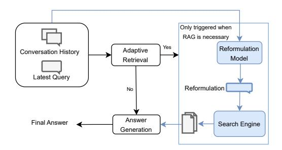

# LLM-Based Dialogue Labeling for Multiturn Adaptive RAG

# Zhiyu Chen, Biancen Xie, Sidarth Srinivasan, Qun Liu, Manikandarajan Ramanathan, Rajashekar Maragoud

Amazon.com Inc, Seattle, USA {zhiyuche,biancen,srinisid}@amazon.com {qunliu,mramnat,maragoud}@amazon.com

# Abstract

Customer service often relies on human agents, which, while effective, can be costly and slower to scale. Recent advancements in intelligent chatbots, particularly Retrieval-Augmented Generation (RAG) models, have significantly enhanced efficiency by integrating large language models with external knowledge retrieval. However, developing a multi-turn RAG-based chatbot for real-world customer service presents additional complexities, requiring components like adaptive retrieval and query reformulation. These components typically require substantial annotated data, which is often scarce. To overcome this limitation, we propose methods to automatically generate labels for these components using real customeragent dialogue data. Specifically, we introduce two labeling strategies for adaptive retrieval: an intent-guided strategy and an explanationbased strategy, along with two query reformulation strategies: natural language query reformulation and keyword-based reformulation. Our experiments reveal that the explanation-based strategy yields the best results for adaptive retrieval, while the keyword-based reformulation improves document retrieval quality. Our findings offer valuable insights for practitioners working on multi-turn RAG systems.

# 1 Introduction

Traditional customer service operations rely on human agents to handle inquiries, leading to high operational costs and response time delays. In recent years, intelligent customer service chatbots [\(Cui](#page-7-0) [et al.,](#page-7-0) [2017;](#page-7-0) [Qi et al.,](#page-7-1) [2021;](#page-7-1) [Cui et al.,](#page-7-0) [2017;](#page-7-0) [Benita](#page-7-2) [et al.,](#page-7-2) [2024\)](#page-7-2) have reshaped customer support by automating responses and improving efficiency. Among these advancements, Retrieval-Augmented Generation (RAG) [\(Smith et al.,](#page-8-0) [2023\)](#page-8-0) has emerged as a powerful technique for enhancing questionanswering (QA) ability of customer service chatbots. By integrating large language models (LLMs)

with external knowledge retrieval, RAG-based chatbots generate more accurate and contextually relevant responses [\(Ding et al.,](#page-7-3) [2022;](#page-7-3) [Lewis et al.,](#page-7-4) [2020\)](#page-7-4).

Compared to single-turn RAG-based QA systems, building multi-turn RAG-based chatbots [\(Roy et al.,](#page-8-1) [2024;](#page-8-1) [Katsis et al.,](#page-7-5) [2025\)](#page-7-5) for real-world customer service requires two additional components. The adaptive retrieval component determines when retrieval is necessary, reducing both latency and context length by fetching documents only when needed. The query reformulation component processes conversation history to generate precise queries for the retrieval module, ensuring contextually relevant responses.

Building these two components typically requires a significant amount of annotated data. To address this, we develop methods to automatically generate labels for both adaptive retrieval and query reformulation models using customer-agent service dialogues collected in compliance with data handling policies. We demonstrate that models trained on non-bot conversations and automatically generated labels can effectively support the development of a fully functional multi-turn RAG-based chatbot for customer service.

To generate labels for adaptive retrieval, we propose two labeling strategies using LLMs. The first, an intent-guided labeling strategy, leverages pre-defined intents to direct the labeling process. The second, an explanation-based strategy, directly prompts the LLM to label whether retrieval is needed and generate reasonable explanations for the decision. We also propose two strategies for natural language query reformulation and keyword formulation. The former rewrites the customer utterance into a self-contained, decontextualized, and well-structured question, while the latter generates a keyword-based query. Through experiments, we find that the explanation-guided strategy generates the highest quality labels for adaptive retrieval. Additionally, we observe that the keyword-based strategy retrieves higher quality documents.

We summarize the contributions of our paper as follows:

- We propose two adaptive retrieval labeling strategies and two reformulation labeling strategies for building adaptive retrieval and query reformulation models to support multi-turn RAG systems.
- Our offline experiments and human study demonstrate that the explanation-guided labeling strategy is the most effective for generating adaptive retrieval labels.
- We also show that the keyword-based reformulation labeling strategy is more effective for training query reformulations that retrieve higherquality documents, even though the reformulations may not be as fluent as natural language query (NLQ) reformulations.
- Our labeling strategies and experimental results provide valuable insights and guidance for practitioners in the industry working to build multi-turn RAG systems.

# 2 Related Work

## 2.1 Retrieval-Augmented Generation (RAG)

Retrieval-Augmented Generation Integrated with retrieval mechanisms [\(Lewis et al.,](#page-7-4) [2020\)](#page-7-4), RAG improves factual grounding and reduce hallucination in question answering systems [\(Smith et al.,](#page-8-0) [2023\)](#page-8-0). In single-turn settings, systems like DPR [\(Karpukhin et al.,](#page-7-6) [2020\)](#page-7-6) retrieve documents using dense embeddings, while Fusion-in-Decoder (FiD) [\(Izacard and Grave,](#page-7-7) [2021\)](#page-7-7) processes multiple passages in parallel for improved answer quality. However, indiscriminate retrieval in such systems introduces latency and risks distracting the generator with irrelevant context [\(Shi et al.,](#page-8-2) [2023\)](#page-8-2).

Adaptive Retrieval in RAG A key challenge for RAG in real-time applications is balancing retrieval quality with computational efficiency. Studies such as [Mallen et al.](#page-7-8) [\(2023\)](#page-7-8) revealed that indiscriminate retrieval increases latency and can degrade performance when irrelevant passages overwhelm the generator. To address this, recent work focuses on adaptive retrieval strategies. For example, [Yao et al.](#page-8-3) [\(2024\)](#page-8-3) proposed confidence-based retrieval, where the LM triggers retrieval only when its internal uncertainty exceeds a threshold. In conversational settings, [Roy et al.](#page-8-1) [\(2024\)](#page-8-1) designed self-multi-RAG, where an LLM determines when retrieval is needed given the dialogue context, then rewrites the conversation into a query if needed and filters the retrieved

passages before answering. [Su et al.](#page-8-4) [\(2024\)](#page-8-4) proposes Dynamic RAG named DRAGIN, which actively decides when to trigger retrieval and what to retrieve during generation. Unlike static one-shot retrieval, DRAGIN monitors the LLM's internal information needs across the generation process to decide the optimal moment to retrieve and to craft an appropriate query.

# 2.2 Query Reformulation

Query reformulation plays a crucial role in Conversational Question Answering (CQA) and Conversational Search (CS) by refining user queries to improve retrieval effectiveness and response relevance.

In CQA and CS, users often ask follow-up questions [\(Senel et al.,](#page-8-5) [2024;](#page-8-5) [Kuzi et al.,](#page-7-9) [2025\)](#page-7-9) that omit context from previous turns, necessitating reformulation into explicit, self-contained queries. Traditional methods rely on rule-based heuristics or query expansion [\(Anick,](#page-7-10) [2003\)](#page-7-10), while neural approaches [\(Anantha et al.,](#page-7-11) [2021;](#page-7-11) [Vakulenko et al.,](#page-8-6) [2021;](#page-8-6) [Mo et al.,](#page-7-12) [2023,](#page-7-12) [2024;](#page-7-13) [Chen et al.,](#page-7-14) [2023\)](#page-7-14) use sequence-to-sequence models to incorporate contextual information. Reinforcement learningbased methods [\(Buck et al.,](#page-7-15) [2018;](#page-7-15) [Chen et al.,](#page-7-16) [2022;](#page-7-16) [Wu et al.,](#page-8-7) [2022\)](#page-8-7) further optimize reformulation by maximizing downstream QA performance.

RAG-based frameworks have recently emerged as powerful QA solutions. Since RAG pipelines rely on retrieved documents to generate responses, refining input queries is crucial for retrieving highquality evidence [\(Ma et al.,](#page-7-17) [2023;](#page-7-17) [Li et al.\)](#page-7-18). This becomes even more critical as we move toward conversational QA with RAG-based approaches [\(Roy](#page-8-1) [et al.,](#page-8-1) [2024\)](#page-8-1).

While existing research focuses primarily on single-turn RAG, multi-turn RAG remains underexplored due to the lack of benchmarks. Scaling multi-turn RAG for industry applications presents additional challenges, including adaptive retrieval prediction and conversational query reformulation, as discussed in [§3.](#page-2-0) Instead of proposing new models, this paper introduces a method for leveraging existing dialogues between human agents and customers to generate labels for adaptive retrieval and query reformulation, which can then be used to train various models.

Figure 1: An overview of the adaptive retrieval and reformulation component integrated into RAG for multi-turn conversations.

## 3 Preliminary

In this section, we describe how adaptive retrieval and query reformulation are integrated into a RAG system to support multi-turn conversations. The overall framework is illustrated in Figure 1.

First, given the conversational history C and a customer's current utterance q as input, the adaptive retrieval model  $\mathcal{M}_s$  first decides on whether to initiate an information retrieval process:

$$p_s = \mathcal{M}_s(\mathcal{C}, q) \tag{1}$$

where  $p_s=1$  indicates retrieval is necessary otherwise  $p_s=0$ . Here the input can be the concatenation of  $\mathcal{C}$  and q.

If retrieval is not necessary, then the answer generation model directly generates the answer given  $\mathcal{C}$  and q. If a retrieval is needed (the blue workflows in Figure 1), the reformulation model  $\mathcal{M}_r$  will then rewrite the query:

$$q' = \mathcal{M}_r(\mathcal{C}, q) \tag{2}$$

The reformulated query q' improves retrieval by resolving conversational dependencies and clarifying ambiguity with added context.

Considering the latency requirement, we use a foundation model such as Claude 3.5 Sonnet1 only for the answer generation module in production, while keeping the other components as smaller models to minimize overall latency. Training  $\mathcal{M}_s$  and  $\mathcal{M}_r$  requires a large amount of data, which can be labor-intensive. However, as an e-commerce company, we have access to millions of real customer service transcripts containing dialogues between human agents and customers. In this work,

we focus on a single key challenge: how to effectively leverage this valuable data to train critical components (i.e.,  $\mathcal{M}_s$  and  $\mathcal{M}_r$ ) for a multi-turn RAG chatbot capable of answering customer questions at scale.

## 4 Method

In real conversations, either the agent or the customer may consecutively input several utterances. However, the dialogue between a customer and a RAG-based chatbot is typically conducted in an alternating manner. To construct data that aligns with the chatbot format, we merge consecutive utterances from the same role into a single unit, resulting in a dialogue  $d=[q_1,a_1,...,q_n,a_n]$  where  $q_i$  represents the user's query and  $a_i$  represents the agent's response. For a query  $q_i$ , we define its context or conversation history as  $C_i=[q_1,a_1,...,q_{i-1},a_{i-1}]$ . In the following, we propose different label generation strategies for adaptive retrieval and query reformulation using LLMs with  $d \in D$ .

## 4.1 Labeling Strategy for Adaptive Retrieval

We consider two prompt strategies for adaptive retrieval labeling.

Intent-guided Labeling We instruct the LLM to classify the customer's intent before determining whether retrieval is necessary. The intent labeling is not directly used for model training. We defined 12 intents for customer queries which can be found in the prompt in Table 7. The underlying assumption is that the need for retrieval is strongly dependent on the query intent, and we hypothesize that prompting the LLM to reason through the query intent will enable it to more accurately assess whether retrieval is required.

**Explanation-guided Labeling** Instead of using pre-defined intents to guide the LLM annotation, we prompt the LLM to freely explain why it makes the decision that a retrieval is needed or not, and then generate the final label of  $p_s$ .

For both strategies above, we experiment with two annotation approaches. In turn-level annotation, we provide the dialogue context and the current query to the LLM for labeling each turn independently. In dialogue-level annotation, given a dialogue  $d \in D$  with n customer utterances, we provide the entire dialogue to the LLM and ask it to output labels for all customer utterances at once. Interestingly, we find that dialogue-level annotation

1https://www.anthropic.com/news/
claude-3-5-sonnet

leads to higher accuracy compared to turn-level annotation ([§6.1\)](#page-4-0), likely because it allows the LLM to better understand the overall conversation flow. The prompt templates for the two proposed strategies are shown in Table [7](#page-9-0) and Table [8,](#page-10-0) respectively.

# 4.2 Labeling Strategy for Query Reformulation

To generate reformulation labels, we prompt an LLM with context and a customer query. We explore two annotation strategies.

NLQ Reformulation The first approach focuses on Natural Language Query (NLQ) reformulation, where the LLM generates a fully unambiguous query in natural language. This involves resolving any ambiguities in the original utterance, ensuring grammatical correctness, and addressing challenges such as co-reference resolution and omissions. During reformulation, we also prompt the LLM to explain the actions or edits it performed to generate the revised query.

Keywords Reformulation The second approach focuses on generating relevant keywords given the conversational context and user query. Compared to NLQ reformulation, keywords reformulation is not required to produce a fully structured natural language question. Instead, it extracts and prioritizes key terms that capture the essential intent of the user's query. We also prompt the LLM to explain the importance of the generated keywords for downstream retrieval.

While NLQ reformulations are commonly used in CQA [\(Anantha et al.,](#page-7-11) [2021;](#page-7-11) [Vakulenko et al.,](#page-8-6) [2021;](#page-8-6) [Chen et al.,](#page-7-16) [2022\)](#page-7-16), we find that they are not always necessary. Instead, keyword reformulation is sufficient to retrieve high-quality documents within the RAG framework. We present our findings in Section [6.3.](#page-6-0) The prompt templates for the two proposed strategies are shown in Table [9](#page-11-0) and Table [10,](#page-12-0) respectively.

# 5 Experimental Setup

# 5.1 Datasets

We synthesized 10,000 dialogues based on typical customer service interactions, drawing inspiration from common e-commerce support scenarios. These synthetic conversations span over 20 product categories, including consumer electronics and digital services. All company names, product details, and customer information were anonymized to protect privacy. Each dialogue contains an average

of approximately 12 customer utterances and 22 agent utterances.

We use Claude-Sonnet-3 to generate labels for the training data using the methods proposed in Section [4.](#page-2-3) To protect customer privacy, all transcripts are scrubbed to exclude any personally identifiable information. We split the dataset into three parts: 70% for training, 10% for validation, and 20% for testing. The test set was held out strictly for final evaluation.

| Input Type      | Labeling Strategy  | Accuracy |
|-----------------|--------------------|----------|
| full dialogue   | Intent-guided      | 89%      |
| full dialogue   | Explanation-guided | 92%      |
| context + query | Intent-guided      | 85%      |
| context + query | Explanation-guided | 87%      |

Table 1: Accuracy of LLM's annotation for adaptive retrieval.

| Labeling Strategy  | Accuracy | AUC    | Ground Truth |
|--------------------|----------|--------|--------------|
| Intent-guided      | 83.27%   | 92.49% | LLM          |
|                    | 74.27%   | 86.16% | Human        |
| Explanation-guided | 86.49%   | 93.76% | LLM          |
|                    | 83.39%   | 92.00% | Human        |

Table 2: Evaluation result for adaptive retrieval.

## 5.2 Implementation Details

We use RoBERTa-base for adaptive retrieval and BART-base/FLAN-T5-base for query reformulation, optimizing with cross-entropy and the Adam optimizer. Models are trained for 10 epochs on 4 NVIDIA A10 GPUs, with learning rates of 2e-6 (adaptive retrieval) and 1e-5 (reformulation), batch sizes of 30 and 10 respectively, and early stopping (patience = 5) to prevent overfitting. We also experimented with larger backbones (RoBERTa-large, BART-large, FLAN-T5-large), but observed only marginal gains (0.5–2%), with consistent conclusions across labeling strategies. For simplicity, we report results with the smaller models.

## 5.3 Evaluation Strategies

Adaptive Retrieval To evaluate the accuracy of the LLM in labeling for adaptive retrieval, we first assess different annotation strategies by manually examining 500 sampled test set. For adaptive retrieval models trained on labels from various annotation strategies, we report accuracy and AUC against LLM-generated labels, measuring how well the model distills knowledge from the labeled data. To further validate performance, we also evaluate the model on human-annotated data.

**Reformulation** To evaluate the performance of the query reformulation model, we first assess its accuracy using automatic metrics, including BLEU, METEOR and ROUGE, by comparing its reformulated queries against those generated by the LLM.

To evaluate keywords reformulation quality, we manually annotated 500 test samples, labeling each generated keyword as relevant or not based on whether it preserves the original query intent and key information from both the query and context. NLQ reformulations have stricter requirements, as they must be well-formed sentences that resolve ellipses and co-references. To assess the quality of NLQ reformulations generated by the foundation LLMs or models trained on LLM-labeled data, we conduct a human evaluation on the same 500 sampled test set. For this evaluation, we propose and assess three key metrics:

- **Grammatical Correctness**: Evaluates whether the reformulation is grammatically correct.
- Context Carryover Completeness: Assesses
  whether the reformulation is self-contained and\nunderstandable without requiring reference to the
  dialogue history.
- Context Carryover Accuracy: Determines whether omissions and co-references in the reformulation are resolved correctly.

Additionally, we examine how query reformulation impacts retrieval effectiveness, analyzing whether reformulated queries lead to improved retrieval quality in Section 6.3.

### 6 Results

### 6.1 Evaluation on Adaptive Retrieval

First, we evaluate the accuracy of different prompting strategies for generating adaptive retrieval labels on our manually annotated 500-sample validation set (described in §5.3), with results presented in Table 1. This human-annotated subset serves as ground truth to assess the quality of LLM-generated labels. As shown, for the same input type, the explanation-guided method outperforms the intent-guided method, as some intents encompass both retrieval-needed and retrieval-not-needed cases. Additionally, dialogue-level annotation surpasses query-level annotation. We hypothesize that this improvement occurs because the LLM can better comprehend the queries when provided with the

complete context of the dialogue, including future utterances.

To evaluate the effectiveness of the adaptive retrieval model, we train the model using labels generated with different strategies and input types, then test it on both LLM-generated and humanannotated labels. Based on the results in Table 2, we find that the accuracy gap between the synthetic dataset (generated by LLM) and the humanlabeled dataset ranges from 1% to 6%, with higher accuracy on the synthetic dataset, likely due to the models being trained on synthetic data. On the human annotated test set, the explanation-guided labeling strategy outperforms intent-guided labeling, as it avoids predefined intents and instead allows the LLM to freely explain its predictions. Finally, models trained on LLM-generated data perform well on both synthetic and human-labeled datasets, with the best accuracy and AUC on human-labeled data achieved by the model trained using the explanation-guided labeling strategy.

| Query Type             | Model        | Top-1 | Top-5 |
|------------------------|--------------|-------|-------|
| Over                   | -            | 0.76  | 1.07  |
| Query                  | -            | 0.94  | 1.28  |
| NLQ Reformulation      | BART-base    | 1.26  | 1.43  |
|                        | FLAN-T5-base | 1.19  | 1.39  |
|                        | Claude       | 1.31  | 1.5   |
|                        | BART-base    | 1.3   | 1.5   |
| Keywords Reformulation | FLAN-T5-base | 1.36  | 1.51  |
|                        | Claude       | 1.34  | 1.59  |
|                        |              |       |       |

Table 3: The relevance scores for the Top-1 and Top-5 retrieval results using different reformulation strategies.

## 6.2 Evaluation on Query Reformulation

**Automatic Evaluation** We present the automatic evaluation metrics in Table 4. Both models achieve comparable results across NLP and Keywords Reformulation. However, a notable trend emerges in NLP Reformulation: BLEU, METEOR, and ROUGE-2 scores are higher, while ROUGE-1 is lower compared to Keywords Reformulation. This suggests that NLP Reformulation produces more fluent and semantically coherent outputs, leading to higher BLEU and METEOR scores. The higher ROUGE-2 further indicates that the generated text better preserves key bigram relationships. However, the lower ROUGE-1 score suggests that some surface-level word matches may be reduced, possibly due to slight paraphrasing or rewording that enhances fluency but alters lexical choices. In contrast, Keywords Reformulation

| Reformulation Type     | Model        | BLEU  | METEOR | ROUGE-1 | ROUGE-2 | ROUGE-L |
|------------------------|--------------|-------|--------|---------|---------|---------|
| NLP Reformulation      | BART-base    | 0.312 | 0.548  | 0.547   | 0.373   | 0.517   |
|                        | FLAN-T5-base | 0.305 | 0.546  | 0.550   | 0.372   | 0.520   |
| Keywords Reformulation | BART-base    | 0.209 | 0.511  | 0.590   | 0.315   | 0.518   |
|                        | FLAN-T5-base | 0.204 | 0.501  | 0.592   | 0.314   | 0.520   |

Table 4: Automatic evaluation result for query reformulation.

| Example 1                                                     | _                                                                                                                                                                                                                |
|---------------------------------------------------------------|------------------------------------------------------------------------------------------------------------------------------------------------------------------------------------------------------------------|
| Original Query NLQ Reformulation Keywords Reformulation       | the screen is stuck The Pluto TV app screen is frozen on my [BRAND_NAME] TV device [BRAND_NAME] tv stuck screen pluto tv app remote not working                                                                  |
| Example 2                                                     |                                                                                                                                                                                                                  |
| Original Query NLQ Reformulation Keywords Reformulation | 4k I am having issues with the remote for my [DEVICE_NAME] 4K (Max) [DEVICE_NAME] 4k remote issues batteries not working                                                                                         |
| Example 3                                                     |                                                                                                                                                                                                                  |
| Original Query NLQ Reformulation Keywords Reformulation | how do I activate it? Activate my [SERVICE_NAME] membership activate [SERVICE_NAME] membership issue accessing membership not active                                                                             |
| Example 4                                                     |                                                                                                                                                                                                                  |
| Original Query NLQ Reformulation Keywords Reformulation | Still did not fixed the streak Updating the [SOFTWARE_NAME] still did not fix the streak [SOFTWARE_NAME] streak not updating reading log issue streak not fixed after app update escalate reading streak problem |
| Example 5                                                     |                                                                                                                                                                                                                  |
| Original Query NLQ Reformulation Keywords Reformulation | I'm wondering if you could please help me remove the ads? Help me remove the ads from my [DEVICE_NAME] lock screen. remove ads [DEVICE_NAME] lock screen children's bedtime story                                |
| Example 6                                                     |                                                                                                                                                                                                                  |
| Original Query NLQ Reformulation Keywords Reformulation | How many times was I charged for it? How many charges were made for the [SERVICE_NAME] subscription? [SERVICE_NAME] subscription charges number times                                                            |
| Example 7                                                     |                                                                                                                                                                                                                  |
| Original Query NLQ Reformulation Keywords Reformulation | How do I access photos on an [DEVICE_NAME]? How do I access photos on my [BRAND_NAME] [DEVICE_NAME]? [DEVICE_NAME] access photos display pictures                                                                |

Table 5: Examples of original queries and their corresponding NLQ and keyword reformulations.

yields higher ROUGE-1 scores, indicating better word-level matching, likely because the reformulations retain key terms more explicitly, though at the cost of reduced fluency and syntactic variation.

Human Evaluation For NLQ reformulation, we further evaluate the reformulation quality based on 500 sampled testing set. The numbers are reported in Table 6. Overall, all models perform well across the three evaluation criteria. Claude achieves the highest scores in all metrics, demonstrating its strong capability in NLQ reformulation under our proposed labeling strategy. FLAN-T5-base outperforms BART-base in grammatical correctness (GC) compared to BART-base, indicating its strength in producing well-formed outputs.

However, BART-base shows slightly better performance in context carryover accuracy (CCA) and context carryover completeness (CCC), suggesting that it more effectively preserves contextual information during reformulation. In contrast, all keyword reformulations are labeled as relevant, as the criterion only requires preserving intent and key information, without enforcing grammatical correctness. In Table 5, we present examples of NLQ and keyword reformulations. To protect privacy and prevent disclosure of sensitive information, certain spans such as brand names, device names, personal identifiers, and specific product details have been replaced with special tokens.

| Model        | CCA | CCC | GC  |
|--------------|-----|-----|-----|
| BART-base    | 94% | 94% | 95% |
| FLAN-T5-base | 91% | 91% | 97% |
| Claude       | 96% | 96% | 97% |

Table 6: Human evaluation on query reformulation results.

# 6.3 Evaluation on Retrieval Performance

To evaluate the impact of reformulation on retrieval performance, we use various input types in our internal search engine to retrieve documents and employ LLM-based evaluation to measure the relevance of the top-k retrieved document to the context given a query. The reformulation model used in this evaluation is based on BART-base. LLMbased evaluation details are described in Table [11](#page-12-1) in Appendix.

Table [3](#page-4-1) presents the retrieval performance (Top-1 and Top-5) across different query types and models. While Claude was used to generate the reformulation ground-truth, our fine-tuned models based on those labels achieve competitive retrieval results. In fact, FLAN-T5-base outperforms Claude in Top-1 retrieval, demonstrating that our fine-tuned models can generate reformulations that yield better retrieval results in certain cases. Keywords reformulation consistently shows higher retrieval performance compared to NLQ reformulation across different models. This is likely because NLQ reformulations must be well-formed and closely aligned with the original query, while keyword reformulations can freely include additional context. For example, in Table [5](#page-5-1) (Example 1), the keyword reformulation adds "remote not working", a useful detail omitted in the NLQ version for fluency. This flexibility makes keywords reformulation sufficient and often more effective in a multiturn RAG setting.

# 7 Online Deployment

At Amazon Customer Service, we deployed a multi-turn RAG chatbot powered by an adaptive model (RoBERTa-base) and a reformulation model (BART-base), both trained with the labeling methodology introduced in this paper using real customer-agent conversation transcripts. These models are now integrated into our production system handling live customer queries. With the adaptive model, we save latency costs for approximately 20% of traffic by bypassing the retrieval

process. Supported by the reformulation model, high-quality documents are retrieved and used for answer generation by Claude-Sonnet 3.5. During a one-week online A/B test, the automation rate for resolving customer inquiries doubled, showing a 107% increase compared to the baseline.

# 8 Conclusion

In this paper, we addressed the challenges of developing a multi-turn RAG-based chatbot for customer service by focusing on two critical components: adaptive retrieval and query reformulation. To overcome the scarcity of annotated data for these components, we developed LLM-based labeling methods that automatically generate highquality training data from existing customer-agent dialogues. Our experiments demonstrated that the explanation-guided labeling strategy significantly outperformed the intent-guided approach for adaptive retrieval. For query reformulation, we found that while NLQ reformulation produced more fluent and grammatically correct outputs, keywordbased reformulation yielded better document retrieval quality, with FLAN-T5-base achieving the highest Top-1 relevance score of 1.36. These findings provide valuable insights for practitioners developing multi-turn RAG systems in real-world customer service environments, offering a practical approach to leverage existing dialogue data for building efficient and responsive chatbots without requiring extensive manual annotation.

# 9 Limitations

Our LLM-based labeling approach for training adaptive retrieval and query reformulation models has shown promise but faces several key limitations. The training data derived from customer-agent dialogues may contain inherent biases that could be addressed through more balanced sampling strategies. While we evaluated various product types within ecommerce, our focus on a single platform limits insights about generalizability to other domains (like healthcare or finance) or interaction styles. Additionally, our heavy dependence on LLM quality for label generation means results may vary across different models or as the technology evolves, suggesting a need for more robust labeling methods. Future work should explore ways to mitigate these limitations and improve the system's overall reliability.

# References

- Raviteja Anantha, Svitlana Vakulenko, Zhucheng Tu, Shayne Longpre, Stephen Pulman, and Srinivas Chappidi. 2021. [Open-domain question answering](https://doi.org/10.18653/v1/2021.naacl-main.44) [goes conversational via question rewriting.](https://doi.org/10.18653/v1/2021.naacl-main.44) In *Proceedings of the 2021 Conference of the North American Chapter of the Association for Computational Linguistics: Human Language Technologies*, pages 520–534, Online. Association for Computational Linguistics.
- Peter Anick. 2003. Using terminological feedback for web search refinement: a log-based study. In *Proceedings of the 26th annual international ACM SIGIR conference on Research and development in informaion retrieval*, pages 88–95.
- J Benita, Kosireddy Vivek Charan Tej, E Vinay Kumar, G Venkata Subbarao, and CH Venkatesh. 2024. Implementation of retrieval-augmented generation (rag) in chatbot systems for enhanced real-time customer support in e-commerce. In *2024 3rd International Conference on Automation, Computing and Renewable Systems (ICACRS)*, pages 1381–1388. IEEE.
- Christian Buck, Jannis Bulian, Massimiliano Ciaramita, Wojciech Gajewski, Andrea Gesmundo, Neil Houlsby, and Wei Wang. 2018. [Ask the right ques](https://openreview.net/forum?id=S1CChZ-CZ)[tions: Active question reformulation with reinforce](https://openreview.net/forum?id=S1CChZ-CZ)[ment learning.](https://openreview.net/forum?id=S1CChZ-CZ) In *International Conference on Learning Representations*.
- Zhiyu Chen, Jason Choi, Besnik Fetahu, Oleg Rokhlenko, and Shervin Malmasi. 2023. [Generate](https://doi.org/10.18653/v1/2023.acl-industry.73)[then-retrieve: Intent-aware FAQ retrieval in product](https://doi.org/10.18653/v1/2023.acl-industry.73) [search.](https://doi.org/10.18653/v1/2023.acl-industry.73) In *Proceedings of the 61st Annual Meeting of the Association for Computational Linguistics (Volume 5: Industry Track)*, pages 763–771, Toronto, Canada. Association for Computational Linguistics.
- Zhiyu Chen, Jie Zhao, Anjie Fang, Besnik Fetahu, Oleg Rokhlenko, and Shervin Malmasi. 2022. [Reinforced](https://doi.org/10.18653/v1/2022.emnlp-industry.36) [question rewriting for conversational question an](https://doi.org/10.18653/v1/2022.emnlp-industry.36)[swering.](https://doi.org/10.18653/v1/2022.emnlp-industry.36) In *Proceedings of the 2022 Conference on Empirical Methods in Natural Language Processing: Industry Track*, pages 357–370, Abu Dhabi, UAE. Association for Computational Linguistics.
- Lei Cui, Shaohan Huang, Furu Wei, Chuanqi Tan, Chaoqun Duan, and Ming Zhou. 2017. Superagent: A customer service chatbot for e-commerce websites. In *Proceedings of ACL 2017, system demonstrations*, pages 97–102.
- N. Ding, X. Xie, and Y. Feng. 2022. A survey on retrieval-augmented generation. *arXiv preprint arXiv:2202.01110*.
- Gautier Izacard and Edouard Grave. 2021. [Lever](https://arxiv.org/abs/2007.01282)[aging passage retrieval with generative models](https://arxiv.org/abs/2007.01282) [for open domain question answering.](https://arxiv.org/abs/2007.01282) *Preprint*, arXiv:2007.01282.
- Vladimir Karpukhin, Barlas Oguz, Sewon Min, Patrick Lewis, Ledell Wu, Sergey Edunov, Danqi Chen, and

- Wen-tau Yih. 2020. [Dense passage retrieval for open](https://doi.org/10.18653/v1/2020.emnlp-main.550)[domain question answering.](https://doi.org/10.18653/v1/2020.emnlp-main.550) In *Proceedings of the 2020 Conference on Empirical Methods in Natural Language Processing (EMNLP)*, pages 6769–6781, Online. Association for Computational Linguistics.
- Yannis Katsis, Sara Rosenthal, Kshitij Fadnis, Chulaka Gunasekara, Young-Suk Lee, Lucian Popa, Vraj Shah, Huaiyu Zhu, Danish Contractor, and Marina Danilevsky. 2025. [MTRAG: A Multi-Turn](https://arxiv.org/abs/2501.03468) [Conversational Benchmark for Evaluating Retrieval-](https://arxiv.org/abs/2501.03468)[Augmented Generation Systems.](https://arxiv.org/abs/2501.03468)
- Saar Kuzi, Zhiyu Chen, and Shervin Malmasi. 2025. Shoppers also asked: Generating related questions for e-commerce search.
- P. Lewis, E. Perez, A. Piktus, F. Petroni, V. Karpukhin, N. Goyal, ..., and S. Riedel. 2020. Retrievalaugmented generation for knowledge-intensive nlp tasks. In *Advances in Neural Information Processing Systems*.
- Zhicong Li, Jiahao Wang, Hangyu Mao, ZhiShu Jiang, Zhongxia Chen, Du Jiazhen, Fuzheng Zhang, Di ZHANG, and Yong Liu. Dmqr-rag: Diverse multiquery rewriting in retrieval-augmented generation.
- Xinbei Ma, Yeyun Gong, Pengcheng He, Hai Zhao, and Nan Duan. 2023. Query rewriting for retrievalaugmented large language models. *arXiv preprint arXiv:2305.14283*.
- Alex Mallen, Akari Asai, Victor Zhong, Rajarshi Das, Daniel Khashabi, and Hannaneh Hajishirzi. 2023. [When not to trust language models: Investigating](https://doi.org/10.18653/v1/2023.acl-long.546) [effectiveness of parametric and non-parametric mem](https://doi.org/10.18653/v1/2023.acl-long.546)[ories.](https://doi.org/10.18653/v1/2023.acl-long.546) In *Proceedings of the 61st Annual Meeting of the Association for Computational Linguistics (Volume 1: Long Papers)*, pages 9802–9822, Toronto, Canada. Association for Computational Linguistics.
- Fengran Mo, Abbas Ghaddar, Kelong Mao, Mehdi Rezagholizadeh, Boxing Chen, Qun Liu, and Jian-Yun Nie. 2024. [CHIQ: Contextual history enhancement for](https://doi.org/10.18653/v1/2024.emnlp-main.135) [improving query rewriting in conversational search.](https://doi.org/10.18653/v1/2024.emnlp-main.135) In *Proceedings of the 2024 Conference on Empirical Methods in Natural Language Processing*, pages 2253–2268, Miami, Florida, USA. Association for Computational Linguistics.
- Fengran Mo, Kelong Mao, Yutao Zhu, Yihong Wu, Kaiyu Huang, and Jian-Yun Nie. 2023. [ConvGQR:](https://doi.org/10.18653/v1/2023.acl-long.274) [Generative query reformulation for conversational](https://doi.org/10.18653/v1/2023.acl-long.274) [search.](https://doi.org/10.18653/v1/2023.acl-long.274) In *Proceedings of the 61st Annual Meeting of the Association for Computational Linguistics (Volume 1: Long Papers)*, pages 4998–5012, Toronto, Canada. Association for Computational Linguistics.
- Haode Qi, Lin Pan, Atin Sood, Abhishek Shah, Ladislav Kunc, Mo Yu, and Saloni Potdar. 2021. [Bench](https://doi.org/10.18653/v1/2021.naacl-industry.38)[marking commercial intent detection services with](https://doi.org/10.18653/v1/2021.naacl-industry.38) [practice-driven evaluations.](https://doi.org/10.18653/v1/2021.naacl-industry.38) In *Proceedings of the 2021 Conference of the North American Chapter of the Association for Computational Linguistics: Human Language Technologies: Industry Papers*, pages

- 304–310, Online. Association for Computational Linguistics.
- Nirmal Roy, Leonardo F. R. Ribeiro, Rexhina Blloshmi, and Kevin Small. 2024. [Learning when to retrieve,](https://arxiv.org/abs/2409.15515) [what to rewrite, and how to respond in conversational](https://arxiv.org/abs/2409.15515) [QA.](https://arxiv.org/abs/2409.15515)
- Lütfi Kerem Senel, Besnik Fetahu, Davis Yoshida, Zhiyu Chen, Giuseppe Castellucci, Nikhita Vedula, Jason Ingyu Choi, and Shervin Malmasi. 2024. [Gen](https://doi.org/10.18653/v1/2024.acl-long.295)[erative explore-exploit: Training-free optimization](https://doi.org/10.18653/v1/2024.acl-long.295) [of generative recommender systems using LLM opti](https://doi.org/10.18653/v1/2024.acl-long.295)[mizers.](https://doi.org/10.18653/v1/2024.acl-long.295) In *Proceedings of the 62nd Annual Meeting of the Association for Computational Linguistics (Volume 1: Long Papers)*, pages 5396–5420, Bangkok, Thailand. Association for Computational Linguistics.
- Freda Shi, Xinyun Chen, Kanishka Misra, Nathan Scales, David Dohan, Ed H. Chi, Nathanael Schärli, and Denny Zhou. 2023. Large language models can be easily distracted by irrelevant context. In *International Conference on Machine Learning*, pages 31210–31227. PMLR. ICML 2023.
- John Smith, Emily Johnson, and Michael Lee. 2023. Retrieval-augmented generation with knowledge graphs for customer service question answering. In *Proceedings of the 2023 Conference on Empirical Methods in Natural Language Processing*, pages 1235–1245, Online and In-Person. Association for Computational Linguistics.
- Weihang Su, Yichen Tang, Qingyao Ai, Zhijing Wu, and Yiqun Liu. 2024. [DRAGIN: Dynamic retrieval](https://doi.org/10.18653/v1/2024.acl-long.702) [augmented generation based on the real-time informa](https://doi.org/10.18653/v1/2024.acl-long.702)[tion needs of large language models.](https://doi.org/10.18653/v1/2024.acl-long.702) In *Proceedings of the 62nd Annual Meeting of the Association for Computational Linguistics (Volume 1: Long Papers)*, pages 12991–13013, Bangkok, Thailand. Association for Computational Linguistics.
- Svitlana Vakulenko, Shayne Longpre, Zhucheng Tu, and Raviteja Anantha. 2021. Question rewriting for conversational question answering. In *Proceedings of the 14th ACM international conference on web search and data mining*, pages 355–363.
- Zeqiu Wu, Yi Luan, Hannah Rashkin, David Reitter, Hannaneh Hajishirzi, Mari Ostendorf, and Gaurav Singh Tomar. 2022. [CONQRR: Conversational](https://doi.org/10.18653/v1/2022.emnlp-main.679) [query rewriting for retrieval with reinforcement learn](https://doi.org/10.18653/v1/2022.emnlp-main.679)[ing.](https://doi.org/10.18653/v1/2022.emnlp-main.679) In *Proceedings of the 2022 Conference on Empirical Methods in Natural Language Processing*, pages 10000–10014, Abu Dhabi, United Arab Emirates. Association for Computational Linguistics.
- Zijun Yao, Weijian Qi, Liangming Pan, Shulin Cao, Linmei Hu, Weichuan Liu, Lei Hou, and Juanzi Li. 2024. Seakr: Self-aware knowledge retrieval for adaptive retrieval augmented generation. *arXiv preprint arXiv:2406.19215*.

# Appendix

# A Prompts

### System Prompt

#### Instruction

Your task is to annotate a conversation between a customer and an agent with pre-defined intents and whether retrieval is needed to answer the customer utterance. The transcript is made up of multiple turns and each turn has the format of "Turn\_ID.Role: utterance". For example, "24.customer: But I bought the whole album." means in the 24th turn, the customer said "But I bought the whole album." Please read the transcript carefully, as I will ask you to label the intent of each customer utterance and whether it requires an API call to a search engine to obtain more information from a knowledge base in order to answer the query.

For every customer utterance, select one from the following intents:

- a: DESCRIBE AN ISSUE. the customer is describing the issue.
- b: ASK AN ISSUE RELATED QUESTION. the customer asks an issue-related question.
- c: ANSWER A QUESTION. the customer is answering a question asked by the agent.
- d: CONFRIMATION. the customer is simply confirming or recognizing information without making a specific request or inquiry.
- e: REPORT STATUS. customer is reporting his or her current status, The customer has received instructions and is providing an update on the current issue status based on those instructions.
- f: REQUEST. customer is making a request such as refund.
- g: GRATITUDE. the turn is spoken by the customer, and customer is showing gratitude to the agent or bot the customer is expressing appreciation or thanks
- h: COMPLAIN. the customer is expressing frustration about a product, service, experience.
- i: ASK AGENT STATUS. the customer is asking about the availability or status of a agent.
- j: FAREWELL. a customer's intention to end or conclude the conversation.
- k: GREETINGS. the turn is spoken by the customer.
- l: OTHERS.

After labeling each customer turn's intent, you will also label whether that turn will trigger a RAG based on the following criteria:

Yes: the current turn is spoken by the customer and the current utterance mentioned about useful details about the issue and the knowledge bank should be updated by a retrieval action based on current utterance information and previous conversation history. For example, RAG should be triggered when the customer describes an issue or asks an issue-related question. Additionally, RAG may also be necessary when the customer provides more details in response to a question or reports their status. However, in cases where no valuable information is provided, RAG should not be triggered.

No: There is no need to update the knowledge bank since the utterance does not contain any issue-related information. Overall, for each turn, you will first give an intent label(a-l) and then give a RAG label You should note that the intent label is closely related to RAG, RAG probably needs to be triggered. Follow the example below to format your answers.

## #### Format Examples

Transcript in the format of:

<Transcript> 1.agent: Hello, welcome back. How can I help with? 2.customer: my remote is not working. 3.agent:Thanks, I apologize for the inconvenience, can you try restarting your tv 4.customer: Sure.</Transcript>

Output in the format of:

<Labels for intent and RAG>: 2.a,Yes,4.d,No </Labels for intent and RAG>

#### User Prompt

<Transcript>: {Dialogue} <Labels for intent and RAG>:

Table 7: Prompt for intent-guided adaptive retrieval labeling.

## System Prompt

#### Instruction

Your task is to understand a conversation between a customer and an agent and predict, for each customer utterance, whether it should trigger an API call to a search engine to retrieve more information from a knowledge base to answer the customer query. You should also provide an explanation for your decision. I will provide you with a conversation transcript between a customer and an agent. The transcript is made up of multiple turns and each turn has the format of "Turn\_ID.Role: utterance". For example, "24.customer: But I bought the whole album." means in the 24th turn, the customer said "But I bought the whole album."

### 1. Explain the reason why an API call to trigger retrieval is needed or not needed for the utterance.

- Specifically, a search engine API call is needed if:

The utterance is an description about the issue. The utterance provides context regarding the issue, such as device, or subscription information. The utterance provides answers to an issue-related question or clarification question asked by the agent. The utterance confirms details or status regarding the device, plan or issue. The utterance asks questions (usually start with "how")regarding how to resolve a problem or how to complete certain steps. The utterance provides the status of the issue after trying something. The utterance is a continuation of the previous turn where retrieval is needed or recommended. Remember, if the mentioned issue details or context is not new, you could also consider retrieval is needed.

- A search engine API call is not needed if the utterance does not contain any issue-related information. For example, the utterance is a greeting, a farewell, a complain regarding the issue. confirming the issue is resolved.

### 2. Select a label from [Yes, No] to indicate whether an API call to retrieval is required for the utterance.

#### Format Examples

Transcript in the format of

<Transcript> 1.agent: Hello, welcome back. How can I help with? 2.customer: my remote is not working. 3.agent: Thanks, I apologize for the inconvenience, can you try restarting your tv 4.customer: Sure.</Transcript> Output in the format of:

<Turn>[2,4]</Turn>

<explain> [2.The customer is describing an issue and retrieval is needed 4.the customer is expressing acknowledgement and the retrieval is not needed] </explain>

<label>[2.Yes,4.No]</label>

User Prompt

<Transcript>: {Dialogue}

<Annotation>

Table 8: Prompt for explanation-guided adaptive retrieval labeling

#### System Prompt

### #### Instruction

I will provide you with a user query along with a conversation history between a customer and an agent. The conversation history consists of multiple turns, each numbered sequentially (e.g., 1 for turn 1, 2 for turn 2). Each turn begins with an indication of the speaker (e.g., if the agent is speaking, the turn will start with "agent:").

Your task is to analyze the entire conversation history along with the user query and generate a well-structured, clear, and optimized query that facilitates retrieving the most relevant information for a QA system. The reformulated query should be concise, precise, and designed to yield high-quality results. You can edit the query and perform the following action when reformulating the query:

Recover: Add missing context from previous conversation turns, such as resolving co-references.

Correction: Fix any grammatical or structural errors in the query.

Simplification: Exclude irrelevant information.

Before generating the reformulation, you need to first:

- 1. understand the query and describe the intent of the query.
- 2. explain what actions should be performed (Recover, Correction, Simplification) and why.
- 3. generate the reformulation.

#### #### Format Examples

Input in the format of

<Conversation history> 1.agent: What do you need help with? 2.customer: My Music App 3.agent: Sure, how can I help you with that?</Conversation history>

<Query>It does not work on my speakers</Query>

Output in the format of:

<Intent>issue description</Intent>

<Actions> replace the pronoun "it" with "Music App" mentioned in turn 2.</Actions>

<Reformulation>Music App does not work on my speakers.</Reformulation>

### ####Final Instruction

Do not change the intent of the original query. Do not change the query type of the original query. If the original query is a statement rather than a question, the reformulation should also be a statement. Keep the same tone, and make sure the reformulation sounds like something spoken by the customer to an agent. Make sure the reformulation is self-contained and can be understood without the conversation history.

## User Prompt

<Conversation history>: {Context} <Query>: {Customer Query}

<Output>:

Table 9: Prompt for NLQ reformulation generation

### System Prompt

#### Instruction

I will provide you a user query along with a conversation history between a customer and an agent. The conversation history is made up of multiple turns, each numbered at the start. Your task is to take into account the entire conversation history along with the query to generate a new keywords query that will help retrieve the most relevant information. The reformulated query should be focus on core key phrases mentioned of the current turn and previous turns. Before generating the reformulation, you need to first:

- 1. understand the conversation history and current query, and then describe the intent of the query
- 2. explain why those keywords are generated, which turn are they coming from
- 3. generate the new keywords query

### #### Format Examples

Input in the format of

<Conversation history>1.agent: What do you need help with? 2.customer: My Music App 3.agent: Sure, how can I help you with that?</Conversation history>

<Query>It does not work on my speakers</Query>

Output in the format of:

<Intent>issue description</Intent>

<Reason>The customer is mentioning that the music App is not working well on the speaker. Therefore the key information in the issue is music App, not work and Speakers</Reason>

<Reformulation> music App not work on speakers</Reformulation>

### #### Final Instruction

Remember,

- The reformulation should be keywords.
- Each keyword could either be directly extracted from the conversation history and the current query, or relevant new keywords that could provide complementary information.

#### User Prompt

<Conversation history>: {Context} <Query>: {Customer Query}

<Output>:

Table 10: Prompt for keywords reformulation generation.

#### System Prompt

#### Instruction

Given a list of documents, assess their relevance to a customer query and previous chat history between an agent and a customer. Each document consists of two fields: title and content. Rate the relevance on a scale from 0 to 2 based on its connection to the dialogue:

0: irrelevant, the document is irrelevant to the issues, product or services discussed in the dialogue

- 1: somewhat relevant, the document is related to the issues, product or services discussed in the dialogue
- 2: Perfectly relevant, the document contains critical information to address the query with comprehensive information

### #### Format Examples

Input in the format of

<Chat History>[Here is the chat history]</Chat History>:

<Query>[Here is the customer query]</Query>:

Document:

<title>[Title of the document]</title>

<content>[Content of the document]</content>

Output in the format of:

<Score> select from 0-2

<Explanation>Provide a brief explanation of why you give this rating. Point out any specific areas where the document succeeds or fails in addressing the query.

## User Prompt

<Chat History>: {Context}</Chat History>

<Query>{Query}</Query>:

Document:

<title>{title}</title>

<content>{content}</content>

Output:

Table 11: Prompt for LLM-based relevance judgment of the top-1 search result. The prompt for the top-5 results follows a similar structure but includes five documents.