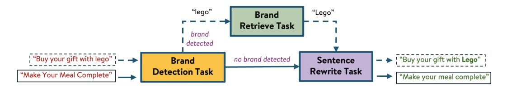
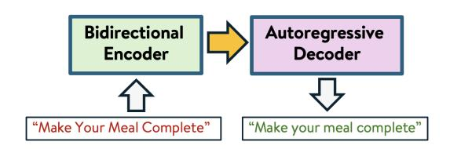
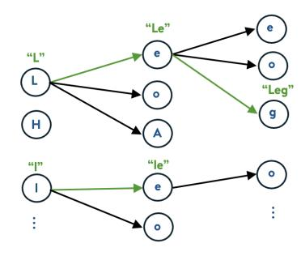

# Learning from LLM Agents: In-Context Generative Models for Text Casing in E-Commerce Ads

Yingxue Zhou, Tan Zhu, Tao Zeng, Zigeng Wang, Wei Shen,

Walmart Global Technology, Sunnyvale, USA {yingxue.zhou, tan.zhu, tao.zeng, zigeng.wang0, wei.sheng}@walmart.com

### Abstract

E-commerce ad platforms enforce content policies and review created ads before publication, with casing requirements playing a critical role in maintaining readability and brand consistency. Existing NER-based transformer models have been widely used for casing correction, but they process characters independently in a classification-based manner, failing to capture sentence level contextual dependencies, making them less reliable when handling unseen or ad-specific terms, e.g., brand names. LLMs like ChatGPT offer better generalization to proper nouns, but they are expensive and have high latency. Besides, generative model can suffer from hallucination. To address these challenges, we propose a two-stage approach: (1) an LLM-based Agent leveraging Chain-of-Actions (CoA) to enforce casing policies while accurately handling ads-specific terms, such as brand names, and (2) a lightweight generative model that preserves the LLM Agent's knowledge while significantly reducing latency and costs. We design a novel in-context decoding strategy, which avoids hallucinations. Our approach outperforms NER-based methods and achieves near-LLM Agent performance, making it a scalable and efficient solution for realworld ad compliance automation.

### 1 Introduction

E-commerce advertising platforms, such as Amazon, Target and Walmart, enforce various content policies to ensure consistency, readability, and compliance with platform standards for publishing ads. One such policy is sentence casing for text content, including headlines and calls to action (CTAs) (see Figure [1\)](#page-0-0). Sentence casing requires capitalizing only the first letter of a sentence while preserving proper nouns and specific terms, such as brand names. To enforce this policy, ad platforms review content submitted by ad creators. For example, an ad creator might submit the headline "Nourish

<span id="page-0-0"></span>

Figure 1: Example of an e-commerce ad which contains text in multiple sections, including the headline, subheadline, and call-to-action (CTA), along with an accompanying ad image.

Your Hair", which needs to be modified to *"Nourish your hair"*. Similarly, "Buy your gift with lego" should be rewritten as *"Buy your gift with Lego"*, as *"Lego"* is the brand name. However, enforcing sentence casing is challenging due to variations in brand names, domain-specific terms, and contextdependent capitalization rules. Manual review is expensive, time-consuming, and unscalable, making automated solutions essential for ensuring accuracy and efficiency.

Existing solutions, such as statistical language models [\(Pauls and Klein,](#page-7-0) [2011;](#page-7-0) [Lita et al.,](#page-6-0) [2003;](#page-6-0) [Mikheev,](#page-6-1) [1999\)](#page-6-1), have limited capacity, failing to capture context and semantic meaning. Named Entity Recognition (NER)-based transformer models [\(Priya et al.,](#page-7-1) [2024;](#page-7-1) [Singhal et al.,](#page-7-2) [2021;](#page-7-2) [Devlin](#page-6-2) [et al.,](#page-6-2) [2019;](#page-6-2) [Liu et al.,](#page-6-3) [2019;](#page-6-3) [Conneau et al.,](#page-6-4) [2020\)](#page-6-4), which are primarily encoder-only architectures, tag tokens or characters sequentially, treating sentence casing as a classification problem. These models are typically trained on public datasets designed for general sentence casing correction and sentence splitting. While effective in general contexts, those approaches lack learning capacity and struggle to

generalize to unseen or specialized entities. Given these limitations, we reformulate the sentence casing problem as a generation task, enabling the model to produce well-structured, sentence-cased text while handling ad-specific domain terms, such as brand and product names. While commercial LLMs, such as ChatGPT [\(Ouyang et al.,](#page-6-5) [2022;](#page-6-5) [Achiam et al.,](#page-6-6) [2023\)](#page-6-6), offer better generalization, they are expensive, have high latency. Additionally, as generative models, they suffer from hallucination, occasionally generating entities not present in the original content, limiting their reliability.

To overcome these limitations, we propose a twostage approach. First, we introduce an LLM-based sentence casing agent built on a Chain-of-Actions (CoA) framework, which decomposes the task of sentence casing into a sequence of sub-tasks [\(Yao](#page-7-3) [et al.,](#page-7-3) [2023b;](#page-7-3) [Wei et al.,](#page-7-4) [2022;](#page-7-4) [Pan et al.,](#page-7-5) [2025\)](#page-7-5) to enhance awareness of domain-specific terms in advertising. Given the text content of an ad, the LLM CoA agent first identifies special terms, i.e., brand names, verifies their correct casing against a predefined reference library, and then generates sentence-cased text accordingly. In the second stage, we distill knowledge from the LLM CoA agent into a lightweight generative model [\(Vaswani](#page-7-6) [et al.,](#page-7-6) [2017;](#page-7-6) [Raffel et al.,](#page-7-7) [2020\)](#page-7-7), significantly reducing latency and computational costs while preserving the agent's domain-specific knowledge. Since the goal is to correct casing without rewriting or hallucinating new entities, we design an in-context decoding method that constrains the model to generate only characters present in the original input—allowing only casing changes. We conduct various experiments on both public datasets and real-world ad data, demonstrating that the proposed approach outperforms traditional NER-based methods—achieving near-LLM performance while remaining scalable and cost-effective for real-world ad text casing compliance automation.

## 2 Related Work

Text Casing Methods Truecasing is the task of restoring proper capitalization in text, has been widely studied in natural language processing. Early approaches primarily rely on statistical methods, such as n-gram language models [\(Pauls and](#page-7-0) [Klein,](#page-7-0) [2011\)](#page-7-0) trained on large corpora to predict the most likely casing for each token based on its context [\(Lita et al.,](#page-6-0) [2003;](#page-6-0) [Mikheev,](#page-6-1) [1999\)](#page-6-1). Later, sequence labeling models, such as Conditional Random Fields (CRFs) [\(Lafferty et al.,](#page-6-7) [2001;](#page-6-7) [Mayhew](#page-6-8) [et al.,](#page-6-8) [2020\)](#page-6-8) and transformer-based models such as BERT [\(Priya et al.,](#page-7-1) [2024\)](#page-7-1), NER-based models [\(Singhal et al.,](#page-7-2) [2021\)](#page-7-2) are introduced treating truecasing as a classification task where each token is assigned a casing label. However, these models lack contextual awareness at the sequence level and struggle with unseen or domain-specific terms, such as brand names. Generative models, particularly unified sequence to sequence architectures like T5 [\(Raffel et al.,](#page-7-7) [2020;](#page-7-7) [Vaswani et al.,](#page-7-6) [2017\)](#page-7-6) and large language models such as Chat-GPT [\(Ouyang et al.,](#page-6-5) [2022;](#page-6-5) [Achiam et al.,](#page-6-6) [2023\)](#page-6-6), have demonstrated superior performance in learning sentence-level dependencies and allowing for more flexible corrections. But they may still suffer from hallucinations and inconsistencies.

LLM Agent Recent advances in LLM agents leverage structured reasoning and tool use to improve task performance and interpretability. Chainof-Thought (CoT) prompting [\(Wei et al.,](#page-7-4) [2022\)](#page-7-4) improves multi-step reasoning by generating intermediate steps, while ReAct [\(Yao et al.,](#page-7-3) [2023b\)](#page-7-3) extends this by interleaving reasoning and actions, enabling LLMs to interact with tools and environments. Follow-up works such as Toolformer [\(Schick et al.,](#page-7-8) [2023\)](#page-7-8), AutoGPT, and LangChain have explored self-instructed tool use and modular agent design. Tree-of-Thoughts [\(Yao et al.,](#page-7-9) [2023a\)](#page-7-9) and Graph of Thoughts [\(Besta et al.,](#page-6-9) [2024\)](#page-6-9) further expand reasoning through structured exploration. Other efforts like Plan-and-Solve [\(Wang](#page-7-10) [et al.,](#page-7-10) [2023\)](#page-7-10) and CAMEL [\(Li et al.,](#page-6-10) [2023\)](#page-6-10) introduce planning and multi-agent collaboration for complex tasks. Building on these developments, we propose a simplified Chain-of-Actions (CoA) framework tailored for sentence casing correction. Unlike prior work that relies on complex reasoning, our CoA defines a standard, interpretable sequence of steps (e.g., identify, verify, generate) specific to the task, enabling effective knowledge distillation into a compact generative model.

## <span id="page-1-0"></span>3 Approaches

We formulate sentence casing correction as a generation task, where the model takes raw ad text submitted by ad creators as input and produces a properly cased output, ensuring compliance with platform policies while preserving domain-specific terms. For example, given the input "Buy gift with lego", the expected output is "Buy gift with Lego",

<span id="page-2-2"></span>

Figure 2: Illustration of the LLM CoA Agent framework. Given an input sentence (e.g., "Buy your gift with lego"), the agent first detects potential brand names. If a brand is identified, it retrieves the correct form from a brand hub library (e.g., "lego" → "Lego") and passes it to the Sentence Rewrite Task to generate sentence-cased text (dashed line). If no brand is detected, the agent directly trigger the Sentence Rewrite Task (solid line).

where "Lego" is correctly capitalized as a brand name. To achieve this, we propose a two-stage approach: first, we develop an LLM Agent specifically designed to generate sentence-cased text for ads content, and second, we train a lightweight seq2seq generation model that preserves the LLM Agent's knowledge while utilizing an in-context decoding method to avoid hallucinations.

LLM CoA Agent In the first stage, preliminary experiments with commercial LLMs such as GPT-4o [\(Ouyang et al.,](#page-6-5) [2022;](#page-6-5) [Achiam et al.,](#page-6-6) [2023\)](#page-6-6) demonstrated that while these models perform well in general cases, they often fail with brand names that are not popular or not always present in their training data. To address this limitation, we introduce an LLM Chain-of-Actions (CoA) Agent framework, explicitly designed to enforce brand name correctness in sentence casing [1](#page-2-0) . In the LLM Agent CoA method, given an ad's text content, the agent first identifies potential special terms, such as brand names. If a brand name is detected, the agent queries a Brand Hub Library—a structured repository containing a comprehensive set of brand names sponsored by the advertising platform—to retrieve the correct spelling and capitalization. The retrieved brand name is then incorporated into the LLM prompt [2](#page-2-1) , ensuring that the model correctly applies brand name casing while adhering to sentence casing conventions (see example in Figure [2\)](#page-2-2). This CoA approach effectively addresses LLM limitations in handling unseen entities. In the next stage, we distill knowledge from this LLM CoA Agent to train a lightweight generative model.

Distilled Generative Model In the second stage, we utilize a sequence-to-sequence (Seq2Seq) generation model [\(Vaswani et al.,](#page-7-6) [2017\)](#page-7-6) to learn and distill the knowledge from the LLM CoA Agent. Specifically we leverage the T5 model structure

[\(Raffel et al.,](#page-7-7) [2020\)](#page-7-7). The model architecture follows an encoder-decoder structure (Figure [3\)](#page-3-0), where the encoder processes the raw ad text input, and the decoder generates the sentence-cased output autoregressively. Since T5 was not originally designed for sentence casing correction, we adapt it to the sentence casing domain through a two-phrase training process.

In the first phrase, we pretrain the model on publicly available data to develop general sentence casing capabilities. We collect English news data from the News Crawl WMT corpus, which typically adheres to sentence casing rules, and augment it by randomly altering the casing to create a set of input–target sentence pairs M = {(x, y)}, where y is the properly cased target sentence, and x is a modified version with incorrect casing. An example pair is: x = "Welcome to My HOME" and y = "Welcome to my home". This augmentation allows the model to learn sentence casing correction as a text-to-text transformation task. The ultimate goal of the sentence case generation problem is to learn a probability distribution Pθ(·|x) over the variable-length text sequence x, where θ is the parameter of the T5. Typically, the maximum likelihood estimation (MLE) objective is used to train the language model. Given finite training examples, i.e., |M| pairs of (x, y) the model is trained by minimizing the empirical finite sample loss function:

$$\mathcal{L}_{\theta}(M) = -\frac{1}{|M|} \sum_{(\mathbf{x}, \mathbf{y}) \in M} \log \mathcal{P}_{\theta}(\mathbf{y}|\mathbf{x}) \quad (1)$$

Let θ<sup>P</sup> denote the model trained in the first stage. In the second phase, we fine-tune θ<sup>P</sup> on *adspecific content* to capture domain-specific knowledge from the LLM CoA Agent. We collect a set of raw ad texts {xa} from ads submitted in the most recent three months, covering headlines, subheadlines, and CTAs. The LLM CoA Agent is then used to generate sentence-cased

<span id="page-2-0"></span><sup>1</sup>Details of CoA can be found in Appendix [A.](#page-8-0)

<span id="page-2-1"></span><sup>2</sup> Prompt examples can be found in Appendix [D.](#page-10-0)

<span id="page-3-0"></span>

Figure 3: Illustration of the Seq2seq model architect for the sentence casing generation.

ground truth label, resulting in a set of sentence pairs  $N = \{\mathbf{x}_a, \mathbf{y}_a\}$ , where  $\mathbf{y}_a = \mathcal{A}(\mathbf{x}_a)$  and  $\mathcal{A}$  denotes the LLM CoA Agent. An example pair is:  $\mathbf{x}_a =$  "Make Your Meal Complete" and  $\mathbf{y} =$  "Make your meal complete". Then we use this dataset further fine-tune the T5 model, ensuring it adapts to ad-domain content while retaining the LLM CoA Agent's knowledge. Formally, the model  $\theta_P$  is further fine-tuned by minimizing the empirical finite-sample objective loss function defined on the ads dataset N:

$$\mathcal{L}_{\theta}(N) = -\frac{1}{|N|} \sum_{(\mathbf{x}_a, \mathbf{y}_a) \in N} \log \mathcal{P}_{\theta}(\mathbf{y}_a | \mathbf{x}_a) . \quad (2)$$

Once the model is fine-tuned, we design an incontext constrained decoding method during inference to prevent hallucination and ensure the generated text strictly adheres to the original content, allowing only casing modifications.

**In-context Decoding** The in-context decoding method is a constrained decoding algorithm (pesudocode in Appendix B) designed for character-level casing correction, where the model is restricted to generating tokens that follow the original input text sequence, allowing only casing changes. To achieve this, we construct a prefix trie  $\mathcal{T}$  over the model's token vocabulary  $\mathcal{V}$ , where each node represents a character and each path corresponds to a wordpiece (subword token).

At each decoding step, given a generated prefix p, we get the remaining ungenerated portion of the input text  $u = \mathbf{x}[|p|:]$ . We then perform depth-first search (DFS) over the trie  $\mathcal{T}$  to collect candidate token set C that satisfy the constraint

$$C = \{c \in \mathcal{V} \mid \text{lower}(c) = \text{lower}(u[:|c|])\} . \quad (3)$$

Figure 4 illustrates the trie structure and candidate selection process. For example, given input x = "Buy your gift with lego" and already

<span id="page-3-1"></span>

Figure 4: Illustration of the trie structure and the candidate token set during decoding for the phrase "Buy your gift with", where the next character is "l" or "L" from the input word "lego". After searching the trie, the constrained candidate set is ["L", "l", "le", "Le", "Leg"], i.e., marked in green in the trie.

generated prefix p= "Buy your gift", the remaining text u= "lego" yields candidate set C= ["L", "1", "le", "Le", "Leg"], which match substrings of the ungenerated segment. ia DFS over  $\mathcal{T}$ . Then beam search is applied over this dynamically generated candidate set rather than the full vocabulary, ensuring that the output preserves the original character sequence while allowing casing modification only.

#### 4 Experiments

We evaluate our proposed approach on both public datasets and real-world e-commerce ad data, comparing it against multiple baselines. We conduct two sets of experiments: (1) evaluating the performance of various LLMs with different model sizes—specifically GPT-40, GPT-4, Llama-2-13b-chat, and Llama-2-70b-chat, and comparing LLM-only with the LLM CoA Agent <sup>3</sup>; (2) comparing the LLM CoA Agent with the distilled lightweight model in terms of accuracy, latency and cost.

#### 4.1 Experimental Setup

**Datasets** We use two datasets in our experiments: public news data and real-world e-commerce ad data. For the public dataset, we extract approximately 3 million sentence-cased examples from the News Crawl WMT corpus and apply randomized augmentation to generate training pairs, each consisting of an input sentence and a target sentence. Each pair is labeled as either positive or negative: a positive sample indicates that the input is not

<span id="page-3-2"></span><sup>&</sup>lt;sup>3</sup>We choose the GPT and LLaMA series due to resource and access limitations.

<span id="page-4-2"></span>

| Dataset     | Type       | Size | Augmented | Pos/Neg   |
|-------------|------------|------|-----------|-----------|
| Public News | Train      | 6M   | Yes       | 50% / 50% |
|             | Evaluation | 4k   | Yes       | 50% / 50% |
| Real Ads    | Train      | 22k  | Yes       | 50% / 50% |
|             | Evaluation | 1k   | No        | 15% / 85% |

Table 1: Dataset Statistics

in sentence case and requires correction[4](#page-4-0) , while a negative sample indicates that the input already conforms to sentence casing and matches the target[5](#page-4-1) . To study the impact of both sample types, we construct a balanced training set of 6 million pairs (50% positive, 50% negative). For the ads dataset, we collect approximately 3,500 ads from historical ad platform data, resulting in 7,700 text samples (headlines, sub-headlines, CTAs). The LLM CoA Agent is used to annotate these samples with sentence-cased labels. After augmentation, we generate 22,000 training pairs, also with a balanced 50% positive and 50% negative distribution. Both datasets are split temporally, using older samples for training and newer samples for evaluation. For the ads evaluation set, to ensure valid evaluation, we use human annotators to provide the ground truth labels. This evaluation set preserves the natural distribution of the data, with no augmentation applied, and consists of 15% positive and 85% negative samples. Table [1](#page-4-2) summarizes the statistics of the training and evaluation datasets, including the distribution of positive and negative samples.

Model Setup and Baselines We first set up the LLM CoA Agent as described in Section [3.](#page-1-0) Then, we train the lightweight model in two stages. We choose Flan-T5-Small for efficiency, excluding mid-sized models like Flan-T5-Large and LLaMA-3B due to latency and cost constraints in real-time ad systems. In the first stage, we train Flan-T5- Small on the public news training data to adapt the model to the general sentence casing domain. To study the impact of positive and negative samples, we train two variants: T5-News-PN, trained on 6M sentence pairs with a 50%/50% positive/negative split, and T5-News-P, trained on 3M positive-only examples. In the second stage, we fine-tune the T5-News-PN model on the augmented 22k ads training set, where targets are labeled by the LLM

<span id="page-4-3"></span>

| Methods          | Public News Data |           |        |        |  |  |
|------------------|------------------|-----------|--------|--------|--|--|
|                  | FTR ↓            | Precision | Recall | F1     |  |  |
| GPT-4o           | 14.89%           | 77.68%    | 82.88% | 0.8019 |  |  |
| GPT-4            | 14.41%           | 80.44%    | 85.7%  | 0.8299 |  |  |
| Llama-2-13b-chat | 58.96%           | 29.77%    | 37.14% | 0.3305 |  |  |
| Llama-2-70b-chat | 48.55%           | 51.22%    | 62.55% | 0.5625 |  |  |
| NER              | 8.5%             | 48.53%    | 49.28% | 0.4891 |  |  |

| Methods          | Real Ads Data |           |        |        |  |  |
|------------------|---------------|-----------|--------|--------|--|--|
|                  | FTR ↓         | Precision | Recall | F1     |  |  |
| CoA Agent        | 2.93%         | 79.85%    | 89.92% | 0.8458 |  |  |
| GPT-4o           | 5.19%         | 57.71%    | 75.43% | 0.6539 |  |  |
| GPT-4            | 9.64%         | 48.4%     | 79.82% | 0.6026 |  |  |
| Llama-2-13b-chat | 63.71%        | 1.52%     | 7.43%  | 0.0252 |  |  |
| Llama-2-70b-chat | 46.13%        | 11.11%    | 44.62% | 0.1779 |  |  |
| GRMR-V3-G4B      | 14.42%        | 19.86%    | 25.21% | 0.2222 |  |  |
| GRMR-V3-Q1.7B    | 13.31%        | 26.84%    | 33.61% | 0.2985 |  |  |
| NER              | 6.61%         | 54.61%    | 64.71% | 0.5923 |  |  |

Table 2: Performance comparison of different LLMs on the Public News and Real Ads datasets. GPT-4 series outperforms other LLMs. The CoA Agent outperforms standalone LLMs, demonstrating the effectiveness of enforcing brand name awareness and task decomposition during generation.

<span id="page-4-4"></span>

| Methods       | Public News Data |           |        |        |  |  |
|---------------|------------------|-----------|--------|--------|--|--|
|               | FTR ↓            | Precision | Recall | F1     |  |  |
| Distil-Ads-PN | 4.38%            | 90.32%    | 94.27% | 0.9225 |  |  |
| T5-News-PN    | 0.36%            | 95.89%    | 96.08% | 0.9599 |  |  |
| T5-News-P     | 5.34%            | 90.77%    | 95.91% | 0.9327 |  |  |

Table 3: Ablation study on the impact of positive and negative samples in training on the Public News dataset.

CoA Agent with a balanced 50%/50% positive/negative distribution. This fine-tuned model, named Distil-Ads-PN, enables adaptation to real-world ad content and brand-specific terms. For ablation, we also fine-tune T5-News-P on 11k positive-only ads data, resulting in the model Distil-Ads-P, to analyze the effect of training with only positive samples. We consider the following baselines and proposed models.

- NER baselines: XLM-Roberta fine-tuned for Truecasing [\(Conneau et al.,](#page-6-4) [2020\)](#page-6-4).
- GEC baselines: GEC (grammar error correction) models fine-tuned from Gemma [\(Gemma Team et al.,](#page-6-11) [2025\)](#page-6-11) and Qwen models [\(Yang et al.,](#page-7-11) [2025\)](#page-7-11) such as GRMR-V3-G4B and GRMR-V3-Q1.7B.
- LLM baselines: GPT-4o, GPT-4, Llama-2- 13b-chat, and Llama-2-70b-chat.

<span id="page-4-0"></span><sup>4</sup> Positive example: {"input": "Shop for your Cozy Home", "target": "Shop for your cozy home."}

<span id="page-4-1"></span><sup>5</sup>Negative example: {"input": "shop for your cozy home", "target": "Shop for your cozy home."}

<span id="page-5-1"></span>

| Methods           | FTR ↓ | Precision | Recall | F1     | Latency (s/sample) | Cost (\$/sample) |
|-------------------|-------|-----------|--------|--------|--------------------|------------------|
| CoA Agent         | 2.93% | 79.85%    | 89.92% | 0.8458 | 1.7315s            | 0.000145         |
| GPT-4o            | 5.19% | 57.71%    | 75.43% | 0.6539 | 1.0756s            | 0.000082         |
| Distil-Ads-PN-ICD | 4.63% | 72.41%    | 86.77% | 0.7895 | 0.0042s            | 0.000003         |
| Distil-Ads-PN     | 4.63% | 71.03%    | 85.12% | 0.7744 | 0.0036s            | 0.000002         |
| Distil-Ads-P      | 7.14% | 62.28%    | 87.39% | 0.7273 | 0.0036s            | 0.000002         |
| NER               | 6.61% | 54.61%    | 64.71% | 0.5923 | 0.0018s            | 0.000001         |

Table 4: Comparison of the CoA Agent and distilled models on the Real Ads dataset. Distil-Ads-PN-ICD outperforms GPT-40, achieves performance close to the CoA Agent, with significantly reduced latency and cost.

- **CoA Agent**: CoA Agent as described in Section 3, with GPT-40 as the LLM backbone.
- **Distilled Models**: Distil-Ads-PN, Distil-Ads-P and Distil-Ads-PN-ICD (Distil-Ads-PN with in-context decoding).

**Evaluation Metrics** To assess the effectiveness of our approach, we evaluate the model's ability to correctly generate sentence-cased text using a set of diverse metrics. Since the evaluation data is imbalanced—we consider metrics that capture both correction accuracy and error sensitivity. False Trigger Rate (FTR) measures the proportion of negative samples (sentences already in correct sentence casing) where the model unnecessarily modifies the text. *Precision* is the percentage of modified samples where the generated sentence correctly matches the target label. Recall reflects the percentage of samples requiring correction for which the model produces the correct output. Finally, the F1 score, computed as the harmonic mean of Precision and Recall, provides a balanced summary of the model's performance.

#### 4.2 Experiment Results

The first set of experiments evaluates the performance of different LLMs, the LLM CoA Agent, and the NER model on the Public News and Real Ads datasets (Table 2). Among LLMs, the GPT-4 series outperforms LLaMA-2, particularly in instruction following and output control, with GPT-40 offering the best cost-performance balance. GPT-4 models also significantly outperform the NER model, which struggles with characterlevel casing errors, e.g., FDA → Fda (example in the Appendix). However, GPT-4 models still struggle with brand names, especially uncommon terms. For instance, GPT-40 fails to correct "babe" to Babe" which is a brand in the example "Bathtime routines from babe" (Example 1, Table 5). In contrast, the LLM CoA Agent (and the distilled

<span id="page-5-0"></span>

| Methods                                           | Brand  | Output                               |  |  |  |
|---------------------------------------------------|--------|--------------------------------------|--|--|--|
| Example 1: Input is "Bathtime routines from babe" |        |                                      |  |  |  |
| LLM CoA                                           | "Babe" | Bathtime routines from Babe          |  |  |  |
| GPT-40                                            | NA     | Bathtime routines from babe X        |  |  |  |
| Distil-Ads-PN                                     | NA     | Bathtime routines from Babe          |  |  |  |
| NER                                               | NA     | Bathtime routines from <b>babe</b> X |  |  |  |
| Example 2: Input is "Try our Tea Floater recipe"  |        |                                      |  |  |  |
| LLM CoA                                           | None   | Try our tea floater recipe ✓         |  |  |  |
| GPT-4o                                            | NA     | Try our tea floater recipe ✓         |  |  |  |
| Distil-Ads-PN                                     | NA     | Try our tea flosser recipe X         |  |  |  |
| Distil-Ads-PN-ICD                                 | NA     | Try our tea floater recipe ✓         |  |  |  |

Table 5: Ads example of different models on detecting and correcting brand names in sentence casing.

model Distil-Ads-PN), which integrate brand detection and retrieval, correctly capitalize brand names. GEC models underperform as they are designed for grammar correction rather than sentence casing, leading to errors with title case, brand names, and unnecessary rewrites (e.g., failing to rewrite "Elevate Your Routine Today," which remains in title case). As a result, the CoA Agent achieves the best performance across all evaluation metrics.

The second set of experiments evaluates the performance of the lightweight model. Table 3 reports results on the Public News dataset under different training strategies, showing that training with both positive and negative samples outperforms training with positive-only data. Incorporating negative samples helps reduce the false trigger rate and improve precision, leading to overall better performance. Distil-Ads-PN achieves competitive results on public news data, indicating it does not suffer from catastrophic forgetting. Table 4 further shows that both Distil-Ads-PN and Distil-Ads-PN-ICD outperform GPT-40, while significantly reducing cost and latency <sup>6</sup>, demonstrating the efficiency of the proposed two-stage approach. Although Distil-Ads-PN-ICD incurs slightly higher latency and cost due to in-context decoding, it offers improved reliability by preventing hallucination. Example 2

<span id="page-5-2"></span><sup>&</sup>lt;sup>6</sup>Latency is measured on NVIDIA A100 GPUs (batch size 256), and cost is estimated based on GPU host pricing.

in Table [5](#page-5-0) illustrates that in-context decoding effectively preserves brand-specific terms, enhancing correctness in domain-sensitive generation.

## 5 Conclusion

In this work, we present a two-stage approach for casing correction in e-commerce ad content, addressing challenges related to brand name and domain-specific terms. We first introduce an LLMbased Chain-of-Actions (CoA) Agent that incorporates brand detection and retrieval to guide sentence generation. To reduce latency and cost, we distill the CoA Agent's knowledge into a lightweight generative model with constrained decoding to prevent hallucination. Experiments on public and realworld ad datasets show that our approach outperforms traditional NER models and achieves near-LLM performance at a fraction of the cost, offering a scalable, efficient solution for ad text casing.

### Limitations

While our two-stage approach achieves strong performance with reduced latency and cost, it has several limitations. First, the system assumes the availability of an accurate brand name list for retrieval; incomplete or outdated brand data may affect casing quality. Second, the lightweight student model may underperform in handling rare linguistic patterns or ambiguous casing contexts compared to larger LLMs. Lastly, our evaluation focuses on English-language ads; adapting the system to multilingual content or languages with different casing rules requires further investigation.

## References

- <span id="page-6-6"></span>Josh Achiam, Steven Adler, Sandhini Agarwal, Lama Ahmad, Ilge Akkaya, Florencia Leoni Aleman, Diogo Almeida, Janko Altenschmidt, Sam Altman, Shyamal Anadkat, and 1 others. 2023. Gpt-4 technical report. *arXiv preprint arXiv:2303.08774*.
- <span id="page-6-9"></span>Maciej Besta, Nils Blach, Ales Kubicek, Robert Gerstenberger, Michal Podstawski, Lukas Gianinazzi, Joanna Gajda, Tomasz Lehmann, Hubert Niewiadomski, Piotr Nyczyk, and 1 others. 2024. Graph of thoughts: Solving elaborate problems with large language models. In *Proceedings of the AAAI Conference on Artificial Intelligence*, volume 38, pages 17682–17690.
- <span id="page-6-4"></span>Alexis Conneau, Kartikay Khandelwal, Naman Goyal, Vishrav Chaudhary, Guillaume Wenzek, Francisco Guzmán, Edouard Grave, Myle Ott, Luke Zettlemoyer, and Veselin Stoyanov. 2020. Unsupervised

- cross-lingual representation learning at scale. In *Proceedings of the 58th Annual Meeting of the Association for Computational Linguistics*, page 8440. Association for Computational Linguistics.
- <span id="page-6-2"></span>Jacob Devlin, Ming-Wei Chang, Kenton Lee, and Kristina Toutanova. 2019. Bert: Pre-training of deep bidirectional transformers for language understanding. In *Proceedings of the 2019 conference of the North American chapter of the association for computational linguistics: human language technologies, volume 1 (long and short papers)*, pages 4171–4186.
- <span id="page-6-11"></span>Gemma Team, Aishwarya Kamath, Johan Ferret, Shreya Pathak, Nino Vieillard, Ramona Merhej, Sarah Perrin, Tatiana Matejovicova, Alexandre Ramé, Morgane Rivière, Louis Rouillard, Thomas Mesnard, Geoffrey Cideron, Jean bastien Grill, Sabela Ramos, Edouard Yvinec, Michelle Casbon, Etienne Pot, Ivo Penchev, and 197 others. 2025. [Gemma 3 technical report.](https://arxiv.org/abs/2503.19786) *Preprint*, arXiv:2503.19786.
- <span id="page-6-7"></span>John D. Lafferty, Andrew McCallum, and Fernando C. N. Pereira. 2001. Conditional random fields: Probabilistic models for segmenting and labeling sequence data. In *Proceedings of the Eighteenth International Conference on Machine Learning*, ICML '01, page 282–289, San Francisco, CA, USA. Morgan Kaufmann Publishers Inc.
- <span id="page-6-10"></span>Guohao Li, Hasan Hammoud, Hani Itani, Dmitrii Khizbullin, and Bernard Ghanem. 2023. Camel: Communicative agents for" mind" exploration of large language model society. *Advances in Neural Information Processing Systems*, 36:51991–52008.
- <span id="page-6-0"></span>Lucian Vlad Lita, Abe Ittycheriah, Salim Roukos, and Nanda Kambhatla. 2003. Truecasing. In *Proceedings of the 41st Annual Meeting of the Association for Computational Linguistics*, pages 152–159.
- <span id="page-6-3"></span>Yinhan Liu, Myle Ott, Naman Goyal, Jingfei Du, Mandar Joshi, Danqi Chen, Omer Levy, Mike Lewis, Luke Zettlemoyer, and Veselin Stoyanov. 2019. Roberta: A robustly optimized bert pretraining approach. *arXiv preprint arXiv:1907.11692*.
- <span id="page-6-8"></span>Stephen Mayhew, Gupta Nitish, and Dan Roth. 2020. Robust named entity recognition with truecasing pretraining. In *Proceedings of the AAAI Conference on Artificial Intelligence*, volume 34, pages 8480–8487.
- <span id="page-6-1"></span>Andrei Mikheev. 1999. [A knowledge-free method for](https://doi.org/10.3115/1034678.1034710) [capitalized word disambiguation.](https://doi.org/10.3115/1034678.1034710) In *Proceedings of the 37th Annual Meeting of the Association for Computational Linguistics on Computational Linguistics*, ACL '99, page 159–166, USA. Association for Computational Linguistics.
- <span id="page-6-5"></span>Long Ouyang, Jeffrey Wu, Xu Jiang, Diogo Almeida, Carroll Wainwright, Pamela Mishkin, Chong Zhang, Sandhini Agarwal, Katarina Slama, Alex Ray, John Schulman, Jacob Hilton, Fraser Kelton, Luke Miller, Maddie Simens, Amanda Askell, Peter Welinder, Paul F Christiano, Jan Leike, and Ryan Lowe. 2022. [Training language models to follow instructions with](https://proceedings.neurips.cc/paper_files/paper/2022/file/b1efde53be364a73914f58805a001731-Paper-Conference.pdf)

- [human feedback.](https://proceedings.neurips.cc/paper_files/paper/2022/file/b1efde53be364a73914f58805a001731-Paper-Conference.pdf) In *Advances in Neural Information Processing Systems*, volume 35, pages 27730–27744. Curran Associates, Inc.
- <span id="page-7-5"></span>Zhenyu Pan, Haozheng Luo, Manling Li, and Han Liu. 2025. [Chain-of-action: Faithful and multimodal](https://openreview.net/forum?id=1BdPHbuimc) [question answering through large language models.](https://openreview.net/forum?id=1BdPHbuimc) In *The Thirteenth International Conference on Learning Representations*.
- <span id="page-7-0"></span>Adam Pauls and Dan Klein. 2011. Faster and smaller n-gram language models. In *Proceedings of the 49th annual meeting of the Association for Computational Linguistics: Human Language Technologies*, pages 258–267.
- <span id="page-7-1"></span>Sathi Krishna Priya, Senthil Kumar A, Selvaraj Kesavan, G R L M Tayaru, Kakarla Maanasa, and Vinod Babu. 2024. [Transformer based lightweight model](https://doi.org/10.1109/ICWITE59797.2024.10502420) [for punctuation restoration and truecasing.](https://doi.org/10.1109/ICWITE59797.2024.10502420) In *2024 IEEE International Conference for Women in Innovation, Technology Entrepreneurship (ICWITE)*, pages 340–344.
- <span id="page-7-7"></span>Colin Raffel, Noam Shazeer, Adam Roberts, Katherine Lee, Sharan Narang, Michael Matena, Yanqi Zhou, Wei Li, and Peter J Liu. 2020. Exploring the limits of transfer learning with a unified text-to-text transformer. *Journal of machine learning research*, 21(140):1–67.
- <span id="page-7-8"></span>Timo Schick, Jane Dwivedi-Yu, Roberto Dessì, Roberta Raileanu, Maria Lomeli, Eric Hambro, Luke Zettlemoyer, Nicola Cancedda, and Thomas Scialom. 2023. Toolformer: Language models can teach themselves to use tools. *Advances in Neural Information Processing Systems*, 36:68539–68551.
- <span id="page-7-2"></span>Shreya Singhal, Naman Modi, Ved Dandekar, and Sunil Mane. 2021. [Leveraging various transform](https://doi.org/10.1016/j.procs.2021.10.045)[ers based architectures for truecasing.](https://doi.org/10.1016/j.procs.2021.10.045) *Procedia Computer Science*, 193:432–441. 10th International Young Scientists Conference in Computational Science, YSC2021, 28 June – 2 July, 2021.
- <span id="page-7-6"></span>Ashish Vaswani, Noam Shazeer, Niki Parmar, Jakob Uszkoreit, Llion Jones, Aidan N Gomez, Ł ukasz Kaiser, and Illia Polosukhin. 2017. [Attention is all](https://proceedings.neurips.cc/paper_files/paper/2017/file/3f5ee243547dee91fbd053c1c4a845aa-Paper.pdf) [you need.](https://proceedings.neurips.cc/paper_files/paper/2017/file/3f5ee243547dee91fbd053c1c4a845aa-Paper.pdf) In *Advances in Neural Information Processing Systems*, volume 30. Curran Associates, Inc.
- <span id="page-7-10"></span>Lei Wang, Wanyu Xu, Yihuai Lan, Zhiqiang Hu, Yunshi Lan, Roy Ka-Wei Lee, and Ee-Peng Lim. 2023. Planand-solve prompting: Improving zero-shot chain-ofthought reasoning by large language models. In *Proceedings of the 61st Annual Meeting of the Association for Computational Linguistics (Volume 1: Long Papers)*, pages 2609–2634.
- <span id="page-7-4"></span>Jason Wei, Xuezhi Wang, Dale Schuurmans, Maarten Bosma, brian ichter, Fei Xia, Ed H. Chi, Quoc V Le, and Denny Zhou. 2022. [Chain of thought prompt](https://openreview.net/forum?id=_VjQlMeSB_J)[ing elicits reasoning in large language models.](https://openreview.net/forum?id=_VjQlMeSB_J) In *Advances in Neural Information Processing Systems*.

- <span id="page-7-11"></span>An Yang, Anfeng Li, Baosong Yang, Beichen Zhang, Binyuan Hui, Bo Zheng, Bowen Yu, Chang Gao, Chengen Huang, Chenxu Lv, Chujie Zheng, Dayiheng Liu, Fan Zhou, Fei Huang, Feng Hu, Hao Ge, Haoran Wei, Huan Lin, Jialong Tang, and 41 others. 2025. [Qwen3 technical report.](https://arxiv.org/abs/2505.09388) *Preprint*, arXiv:2505.09388.
- <span id="page-7-9"></span>Shunyu Yao, Dian Yu, Jeffrey Zhao, Izhak Shafran, Tom Griffiths, Yuan Cao, and Karthik Narasimhan. 2023a. Tree of thoughts: Deliberate problem solving with large language models. *Advances in neural information processing systems*, 36:11809–11822.
- <span id="page-7-3"></span>Shunyu Yao, Jeffrey Zhao, Dian Yu, Nan Du, Izhak Shafran, Karthik R Narasimhan, and Yuan Cao. 2023b. [React: Synergizing reasoning and acting](https://openreview.net/forum?id=WE_vluYUL-X) [in language models.](https://openreview.net/forum?id=WE_vluYUL-X) In *The Eleventh International Conference on Learning Representations*.

### <span id="page-8-0"></span>A LLM Chain-of-Action (CoA) Agent

In the first stage, we explore commercial LLMs such as GPT-40 (Ouyang et al., 2022; Achiam et al., 2023), and preliminary experiments demonstrate that while these models perform well on common sentence casing tasks, they often fail to correctly handle brand names that are rare, newly introduced, or not well represented in their training data. This limitation is critical in the e-commerce advertising domain, where accurate brand representation is essential for compliance and trust. To overcome this, we introduce a Chain-of-Actions (CoA) Agent framework, explicitly designed to ensure brand name correctness in sentence casing tasks.

Algorithm 1 gives pesudo code of the LLM Agent framework. In the LLM Agent CoA method, given an ad's text content  $\mathbf{x}$ , e.g.,  $\mathbf{x} =$  "Buy your gift with lego", the agent first identifies potential brand names within the input using a Brand Detection LLM:

$$B = \text{DetectBrands}(\mathbf{x}), \quad B \subseteq \mathbf{x}$$
 (4)

where B denotes the list of entities in  $\mathbf{x}$  that are likely to be brand mentions, e.g., B = ["lego"] for input  $\mathbf{x} = "Buy$  your gift with lego". In practice, since ad text typically contains at most one brand name, the size of B is usually either one or zero when no brand is mentioned in the input.

If brand names are detected, each candidate  $b \in B$  is queried against a structured Brand Hub Library, which serves as a mapping from surface forms to their canonical brand spellings and capitalizations. Then a list of corrected brand name is retrieved:

$$B_{\text{correct}} = \text{BrandRetrieve}(B)$$
. (5)

This produces a set of verified brand names  $B_{\rm correct}$ , which is then incorporated into the prompt of sentence case rewrite process. For example, given B = ["lego"],  $B_{\rm correct}$  is expected to be  $B_{\rm correct} = ["Lego"]$  (see example in Figure 2). The model prompt P is constructed conditionally as:

$$P(\mathbf{x}, B_{\text{correct}}) = \begin{cases} \text{ConstructPrompt}(\mathbf{x}, B_{\text{correct}}), & \text{if } B \neq \emptyset \\ \text{ConstructPrompt}(\mathbf{x}), & \text{otherwise} \end{cases}$$
(6)

The prompt constructed functions for different tasks and LLMs are given in Appendix D. The constructed prompt P is then passed to the Sentence Rewrite LLM, which generates the sentence-cased output:

$$y = SentenceRewrite(P)$$
. (7)

## <span id="page-8-2"></span>Algorithm 1 LLM CoA Agent for Sentence Casing

```
1: Input: Raw ad text \mathbf{x}
2: Output: Sentence-cased ad text \mathbf{y}
3: B \leftarrow \text{BrandDetection}(\mathbf{x})
4: if B \neq \emptyset then
5: B_{\text{correct}} \leftarrow \text{BrandRetrieve}(B)
6: P \leftarrow \text{ConstructPrompt}(\mathbf{x}, B_{\text{correct}})
7: else
8: P \leftarrow \text{ConstructPrompt}(\mathbf{x})
9: end if
10: \mathbf{y} \leftarrow \text{SentenceRewrite}(P)
11: return \mathbf{y}
```

This Chain-of-Actions (CoA) approach effectively addresses the limitations of LLMs in handling unseen or domain-specific entities. Once the CoA Agent is established, we evaluate its performance on a real-world ads dataset, incorporating human feedback to assess compliance with sentence casing policies. After the CoA Agent consistently meets the expected performance threshold, we treat it as a teacher model and distill its knowledge into a lightweight generative model. Note that the distilled model is intentionally kept small to satisfy the latency requirements of real-time inference and to control computational cost in large-scale production deployments.

#### <span id="page-8-1"></span>**B** In-context Decoding Algorithms

The in-context decoding method is a constrained generation technique designed for character-level casing correction, where the model is restricted to generating tokens that follow the original input text sequence, allowing only casing changes. To achieve this, at each decoding step, we perform a depth-first search (DFS) over a vocabulary token trie (Algorithm 3) to identify valid candidate tokens—i.e., subword units that match the remaining ungenerated portion of the input text, regardless of casing. For instance, given the input "Buy your gift with lego" and generated prefix "Buy your gift ", the ungenerated part "lego" yields candidates like ["L", "l", "le", "Le", "Leg"]. Then, beam search operates over this constrained candidate set instead of the full vocabulary, ensuring the output matches the original text content while allowing only casing modifications. Figure 4 illustrates the trie structure and candidate selection process. Below we present the details of the in-context decoding algorithm (Alorithm 2).

<span id="page-9-1"></span>**Algorithm 2** In-Context Constrained Decoding with Trie

```
    Input: Input text x, token vocabulary V, vocabulary trie T, model θ
    Output: Generated output y (sentence-cased)
    p ← ""
    while p is not the full length of x do
    u ← x[|p| :]
    C ← DFS_T(T, u, V)
    t ← arg max<sub>c∈C</sub> P<sub>θ</sub>(c|p)
    p ← p + t
    end while
    return p as final output y
```

Specifically, we construct a prefix trie  $\mathcal{T}$  over the model's token vocabulary  $\mathcal{V}$ , where each node represents a character and each path corresponds to a wordpiece (subword token). The algorithm 2 provides a complete overview of the decoding procedure.

At each decoding step, given a generated prefix p, we get the remaining ungenerated portion of the input text u:

$$u = \mathbf{x}[|p|:]. \tag{8}$$

We then perform **DFS\_T** (Algorithm 3), i.e., depth-first search (DFS) over the trie  $\mathcal{T}$  to collect candidate token set C that satisfy the constraint:

$$C = \{c \in \mathcal{V} \mid \text{lower}(c) = \text{lower}(u[:|c|])\}, \quad (9)$$

In other words, a token is valid if its case-insensitively character sequence matches the start of the remaining input substring u, preserving content while allowing casing variation. For example, given input  $\mathbf{x}=$  "Buy your gift with lego" and prefix p= "Buy your gift", the remaining text u= "lego" yields candidate set C= ["L", "1", "le", "Le", "Leg"] via DFS over  $\mathcal{T}$ .

Then we select the token with highest likelihood from the constrained candidate set C rather than the full vocabulary. Formally, the next token is chosen as:

$$t = \arg\max_{c \in C} \mathcal{P}_{\theta}(c|p), \tag{10}$$

where  $\mathcal{P}_{\theta}(\cdot|p)$  indicates the probability distribution over candidate tokens given the prefix p, as produced by the model trained in Section 3. Then prefix is updated  $p \leftarrow p + t$  and decoding proceeds until the full length of  $\mathbf{x}$  is generated. This

<span id="page-9-0"></span>Algorithm 3 DFS\_T: Depth-First Search over Trie to collect valid token candidates

```
1: Input: Trie \mathcal{T}, remaining string u, vocabulary
 2: Output: Candidate token set C
 3: C \leftarrow \emptyset
 4: function DFS(\mathcal{T}, prefix)
          if lower(prefix) = lower(u[: |prefix|]) and
     prefix \in \mathcal{V} then
               C \leftarrow C \cup \{\text{prefix}\}\
 6:
          end if
 7:
          for all child character node \ell of \mathcal{T} do
 8:
               if lower(\ell) matches next char in u then
 9:
                    \mathcal{T}_{\ell} \leftarrow \text{subtree of } \mathcal{T} \text{ rooted at } \ell
10:
                    DFS(\mathcal{T}_{\ell}, prefix + \ell)
11:
12.
13:
          end for
14: end function
15: DFS(T, "")
16: return C
```

method ensures that the output text strictly adheres to the original character sequence, allowing only casing transformations and preventing hallucinations. This in-context constrained decoding algorithm can be applied to any autoregressive generative model. It functions as a lightweight plug-in during inference and requires no additional training or model modification.

### C Additional Results

Table 6 compares the latency and projected cost per sample for each method. The CoA Agent has the highest latency (1.7315s) and cost (\$0.000145), as it involves two stages—brand detection (0.6559s) and sentence rewrite (1.0756s)—each contributing to both time and cost. The GPT-4o model, which performs only the rewrite step, shows reduced total latency (1.0756s) and cost (\$0.000082), but still requires significantly more resources compared to distilled models.

In contrast, Distil-Ads-PN-ICD and Distil-Ads-PN, our lightweight generative models, achieve sub-second latency and very low cost. Distil-Ads-PN-ICD incurs a slightly higher latency (0.0042s) and cost (\$0.00003) than Distil-Ads-PN (0.0036s, \$0.000002) due to in-context decoding, but still remains orders of magnitude more efficient than LLM-based approaches. These results demonstrate the computational efficiency of our proposed distilled models, making them highly suitable for real-

time, large-scale deployment.

Table [7](#page-11-1) presents a qualitative comparison of different models on a sentence containing a known acronym, FDA. While all methods receive the same input ("Easy set-up & FDA-registered"), their output quality varies. The LLM CoA and GPT-4o models correctly preserve the casing of FDA, producing accurate sentence-cased outputs. The Distil-Ads-PN model generates a nearly correct output but introduces a minor hallucination by appending an extra character ("FDA-registerede"). In contrast, the NER model misclassifies the acronym, incorrectly lowercasing it to "Fda-registered", which violates casing conventions and reduces output reliability. This example highlights the limitations of traditional NER-based models in handling acronyms and special terms and underscores the robustness of generative models, especially when guided by context or structured reasoning like in the LLM CoA method.

## <span id="page-10-0"></span>D Prompts for different LLMs and CoA Agent

Listing 1: Prompt formatting function for LLaMA

```
def get_llama_prompt ( instruction ) :
    B_INST , E_INST = "<s >[ INST ]", "[/
        INST ]"
    B_SYS , E_SYS = " <<SYS > >\n", "\n < </
        SYS > >\n\n"
    DEFAULT_SYSTEM_PROMPT = """
    You are a writing assistant .\n
    Your task is to check and rewrite
        the query so that the query is
        in sentence case writing style .
    You * only * capitalizes the first
        letter of the first word in the
        query , as well as the first
        letter of some special nouns .
        Other words in the query should
        be lowercased . \n
    Your response format should be: Sure
        ! Here is the rewrite : \n\n
        rewrite \n\n
    """
    SYSTEM_PROMPT = B_SYS +
        DEFAULT_SYSTEM_PROMPT + E_SYS
    prompt_template = B_INST +
        SYSTEM_PROMPT + instruction +
        E_INST + "\n Assistant : Sure !
        Here is the rewrite :"
    return prompt_template
instruction = f" Rewrite the input text :
    { query }"
prompt = get_llama_prompt ( instruction )
```

Listing 2: Prompt for Brand Dection with ChatGPT-4o and ChatGPT-4

```
prompt = f" Given the headline of an
    advertisement , extract the potential
     brand name and directly output the
    brand name . If no brand name found ,
    output 'None '. Here is the input
    headline : { query }"
```

Listing 3: Prompt for Sentence Rewrite with ChatGPT-4o and ChatGPT-4

```
prompt = f" Generate the sentence case
    for the input text . Follow spelling
    for entitiy in { brand_list }. Here is
     the input query : { query }"
```

<span id="page-11-0"></span>

| Method             | Latency (s/sample) |         | Projected Cost (\$/sample) |          | Total   |          |
|--------------------|--------------------|---------|----------------------------|----------|---------|----------|
|                    | brand detect       | rewrite | brand detect               | rewrite  | latency | cost     |
| CoA Agent          | 0.6559s            | 1.0756s | 0.000063                   | 0.000082 | 1.7315s | 0.000145 |
| GPT-4o             | -                  | 1.0756s | -                          | 0.000082 | 1.0756s | 0.000082 |
| Distill-Ads-PN-ICD | -                  | 0.0042s | -                          | 0.000003 | 0.0042s | 0.000003 |
| Distill-Ads-PN     | -                  | 0.0036s | -                          | 0.000002 | 0.0036s | 0.000002 |
| NER                | -                  | 0.0018s | -                          | 0.000001 | 0.0018s | 0.000001 |

Table 6: Latency and Projected Cost Comparison of Different Methods

<span id="page-11-1"></span>

| Method          | Input Text                         | <b>Detected Brand</b> | Output Text                                   |
|-----------------|------------------------------------|-----------------------|-----------------------------------------------|
| LLM CoA         |                                    | "Babe"                | Bathtime routines from Babe ✓                 |
| GPT-4o          | Bathtime routines from <b>babe</b> | NA                    | Bathtime routines from <b>babe</b> X          |
| ads_pos_neg     | Bathtime foutilies from babe       | NA                    | Bathtime routines from Babe 🗸                 |
| NER             |                                    | NA                    | Bathtime routines from <b>babe</b> X          |
| LLM CoA         |                                    | None                  | Easy set-up & FDA-registered ✓                |
| GPT-4o          | Easy set up & EDA registered       | NA                    | Easy set-up & FDA-registered ✓                |
| Distil-Ads-PN   | Easy set-up & FDA-registered       | NA                    | Easy set-up & FDA-registerede ✓               |
| NER             |                                    | NA                    | Easy set-up & <b>Fda</b> -registered <b>X</b> |
| LLM CoA         |                                    | None                  | Try our Tea Floater recipe ✓                  |
| GPT-4o          | Try our <b>Tea Floater</b> recipe  | NA                    | Try our Tea Floater recipe ✓                  |
| ads_pos_neg     |                                    | NA                    | Try our tea <b>flosser</b> recipe X           |
| ads_pos_neg-icm |                                    | NA                    | Try our tea floater recipe ✓                  |
| NER             |                                    | NA                    | Try our tea floater recipe ✓                  |

Table 7: Comparison of Different Methods for Final Output