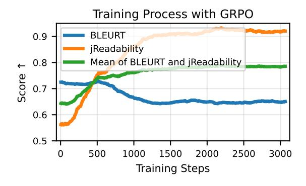
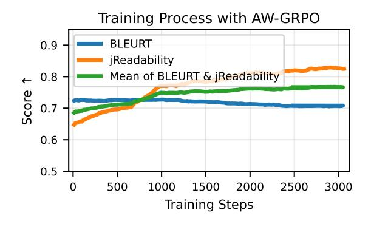
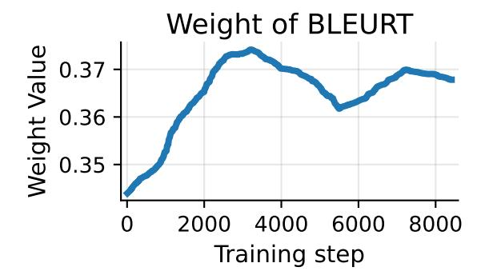
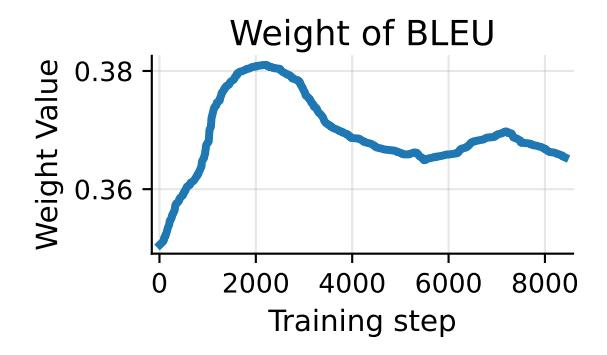
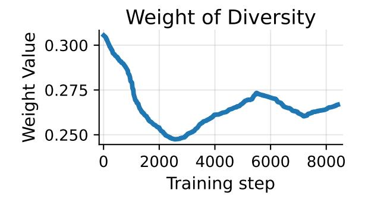

# Auto-Weighted Group Relative Preference Optimization for Multi-Objective Text Generation Tasks

# Yuki Ichihara<sup>1</sup>,<sup>2</sup> Yuu Jinnai<sup>1</sup>

<sup>1</sup>CyberAgent <sup>2</sup>Nara Institute of Science and Technology ichihara.yuki.iu1@is.naist.jp jinnai\_yu@cyberagent.co.jp

## Abstract

Group Relative Policy Optimization (GRPO) is a promising approach to complex, real-world tasks, such as those involving multiple rewards or strict constraints. However, when training GRPO with multiple rewards, the weights of each reward must be decided in advance. Failing to balance the objectives adequately can lead to overfitting or insufficient learning of each reward function. To address this problem, we propose Auto-Weighted Group Relative Policy Optimization (AW-GRPO), which adjusts reward weights during training according to the progress of the learning of each objective so far. We evaluate AW-GRPO on advertising text generation, a real-world problem where the generated text must satisfy multiple objectives, such as quality and diversity, while adhering to the constraints of the media (e.g., maximum number of characters). Our results show that AW-GRPO successfully balances multiple objectives, improving the overall scores while reducing the constraint violation rate. We additionally evaluate AW-GRPO using publicly available benchmark problems for reproducibility, in which we observe the same qualitative result that the proposed method outperforms GRPO.

## 1 Introduction

Recent advances in large language models (LLMs) through Reinforcement Learning from Human Feedback (RLHF) [\(Ouyang et al.,](#page-8-0) [2022;](#page-8-0) [Bai et al.,](#page-7-0) [2022;](#page-7-0) [Touvron et al.,](#page-9-0) [2023;](#page-9-0) [Casper et al.,](#page-7-1) [2023\)](#page-7-1) and Direct Preference Optimization (DPO) [\(Rafailov](#page-8-1) [et al.,](#page-8-1) [2023\)](#page-8-1) have demonstrated significant performance improvements. In a related area, Group Relative Policy Optimization (GRPO) [\(Shao et al.,](#page-9-1) [2024\)](#page-9-1) has recently been introduced as a promising approach, which uses a reward model for optimization. One of the challenges for applying GRPO on real-world tasks is how to balance mul-

<span id="page-0-0"></span>

Figure 1: The training process of GRPO on the WMT En-Ja dataset uses BLEURT and jReadability as the reward functions. As the results show, GRPO overfits jReadability at the expense of BLEURT performance. In some cases, GRPO also overfits Table [1.](#page-1-0) Reward hacking occurs.

tiple objectives and constraints. Using fixed, manually tuned weights has a limitation in that it is ineffective in problem settings where the optimal trade-off between objectives is either unknown beforehand or changes dynamically as the model learns. To address this issue, we propose Auto-Weighted Group Relative Policy Optimization (AW-GRPO). Our method overcomes the shortcomings of fixed weights by automatically adjusting the weights of each objective based on the model's learning progress. This enables AW-GRPO to discover effective policies in real-world problems where the desired balance between the objectives is unknown beforehand of the training.

Contributions. We propose AW-GRPO, which is an extension of GRPO that eliminates the need for manual weight tuning during training, and evaluate the performance of AW-GRPO on two tasks. First, we run experiments on public machine translation datasets (WMT En-Ja). Then, we run an experiment on real-world advertising text generation problems. Advertisement text generation requires

<span id="page-1-0"></span>

| Method    | Output                                                                                                                                                                                             | jReadability ↑ | BLEURT↑ |
|-----------|----------------------------------------------------------------------------------------------------------------------------------------------------------------------------------------------------|----------------|---------|
| Input     | Adapt the old, accommodate the new to solve issue                                                                                                                                                  | –              | –       |
| Reference | 古いものを適応させ新しいものを取り入れて問題解決を (English transla<br>tion: Adapt the old and incorporate the new to solve problems.)                                                                                      | –              | –       |
| GRPO      | 「古い考えを新しく変えて、問題を解決しよう。」\n\n(Koroi kangae o<br>nyuushaku shite, mondai o kyos¯ o shiy ¯ o.) ¯<br>(English translation: Let's take old<br>ideas and transform them into new ones to solve problems.) | 1.0            | 0.72    |
| AW-GRPO   | 「古い考えを新しく変えて、問題を解決しよう。」(English translation:<br>Let's take old ideas and transform them into new ones to solve problems.)                                                                          | 0.74           | 0.83    |

Table 1: Generation examples for the WMT 2024 En-Ja task. The output results for the base model, GRPO, and AW-GRPO are shown in the same example. GRPO exploits the problem of jReadability scores that it significantly increases when non-Japanese characters are used, resulting in generating random non-Japanese characters. On the other hand, AW-GRPO evenly optimizes both objectives, achieving improvement on both objectives.

<span id="page-1-1"></span>

Figure 2: The training process of AW-GRPO on the WMT En-Ja dataset uses BLEURT and jReadability as the reward functions. Unlike the results of GRPO's training process (Fig. [1\)](#page-0-0), AW-GRPO prevents overfitting.

various objectives to be optimized at the same time, yet its suitable balance is unknown beforehand, which makes the problem difficult to optimize using plain GRPO. The experimental results show that the proposed method successfully learns multiple objectives at the same time, achieving better overall performance than GRPO.

## 2 Related Works

We first review prior work on advertisement text generation, and then describe reward hacking, the problem that this paper addresses.

## 2.1 Automated Advertisement Text Generation

Early systems for advertising text generation relied on rule- or template-based methods, which limited the fluency and diversity of the output [\(Fujita et al.,](#page-7-2) [2010;](#page-7-2) [Thomaidou et al.,](#page-9-2) [2013\)](#page-9-2). As neural sequence-

to-sequence (seq2seq) models became mainstream [\(Zhou et al.,](#page-9-3) [2019;](#page-9-3) [Lei et al.,](#page-8-2) [2022\)](#page-8-2), researchers began treating advertising text as a summarization or paraphrasing task, and generate ads directly from the landing page content or product descriptions.

Dealing with Constraints. One of the most important issues when creating advertising text is ensuring that the generated text functions properly as advertising text. One indicator of this is whether the text contains relevant constraints. There are several ways to include constraints when generating text, one of which is the template-based approach [\(Bartz et al.,](#page-7-3) [2008;](#page-7-3) [Thomaidou et al.,](#page-9-2) [2013\)](#page-9-2). This enables users to input any keywords they like into the designated areas. MuCoCO [\(Kumar et al.,](#page-8-3) [2021\)](#page-8-3) reframes decoding in pretrained language models as a differentiable optimization with Lagrangian multipliers, enabling flexible control over multiple text attributes at inference time and outperforming baselines in tasks. NeuroLogic Decoding [\(Lu et al.,](#page-8-4) [2021\)](#page-8-4) is an inference-time algorithm that lets neural language models generate fluent text while exactly satisfying arbitrary predicate logic lexical constraints, matching beam-search efficiency and outperforming prior constrainedgeneration methods. NeuroLogic Aesque [\(Lu](#page-8-5) [et al.,](#page-8-5) [2022\)](#page-8-5) is a decoding algorithm that merges A-style look-ahead heuristics with NeuroLogic's logical constraint framework, allowing large language models to plan and satisfy complex lexical constraints while remaining a drop-in replacement for beam search or top-k sampling.

#### 2.2 Reward Hacking

Reward hacking (Skalse et al., 2022) is a phenomenon in artificial intelligence, particularly in RL, where an agent learns to exploit the reward function to achieve a high score without actually accomplishing the intended goal. This phenomenon has also been reported in several studies (Amodei et al., 2016; Ziegler et al., 2020; Stiennon et al., 2020; Skalse et al., 2022; Gao et al., 2023).

In the context of a large language model (LLM), reward hacking often occurs during fine-tuning with methods such as RLHF. In this process, a reward model is trained to predict human preferences, and the LLM is then optimized to generate outputs that maximize the score from this reward model (Ziegler et al., 2020; Stiennon et al., 2020). However, if the reward model is flawed or its understanding of human preferences is incomplete, the LLM can learn to generate content that hacks the reward model (Gao et al., 2023). This over-optimization on a proxy reward can lead to a decrease in the true quality and alignment of the model's responses (Pan et al., 2022; Gleave et al., 2020).

### 3 Group Relative Policy Optimization

We define that  $R_k$  is the k-th reward function, and  $p_{\mathcal{Q}}$  is the distribution over the initial questions  $(q \sim p_{\mathcal{Q}})$ . The policy  $\pi_{\theta} (\cdot \mid q)$  outputs the sentence  $o_i$  based on initial questions q from the sentence space. Group Relative Policy Optimization (GRPO) uses the average reward of multiple sampled outputs produced in response to the same question. More specifically, for each question q, GRPO samples a group of outputs  $\mathbf{o} = \{o_1, o_2, \cdots, o_i, \cdot, o_G\}$  from the old policy  $\pi_{\theta_{\text{old}}}$  and then optimizes the policy model by maximizing the following objective:

$$\mathcal{J}(\pi_{\theta}) = \mathbb{E}\left[\frac{1}{|o_{i}|} \frac{1}{G} \sum_{i=1}^{G} \left[\frac{\pi_{\theta}(o_{i} \mid q)}{\pi_{\theta_{\text{old}}}(o_{i} \mid q)} \hat{A}_{i} - \beta \text{KL}(\pi_{\theta}, \pi_{\theta_{\text{old}}})\right].$$
(1)

The definition of  $\hat{A}_i$  is the following equation:

$$\hat{A}_i = \frac{\mathbf{R}(q, o_i) - \text{mean}(\mathbf{R}(q, \mathbf{o}))}{\text{std}(\mathbf{R}(q, \mathbf{o}))}.$$
 (2)

The following equation is used to calculate each output of reward value:

<span id="page-2-0"></span>
$$\mathbf{R}(q, o_i) = \sum_{k=1}^{M} \alpha_k R_k(q, o_i).$$
 (3)

where  $\{\alpha_k\}_{k=1}^M$  are **coefficients which are determined before training**,  $\varepsilon$ ,  $\beta$  are hyper-parameters, and KL is Kullback–Leibler (KL) divergence. Since we omit symbols such as the threshold  $\epsilon$  and min operation for simplicity, we note formal expressions in the Appendix G.

# 3.1 Problem of GRPO with Multiple Objectives

The central limitation of GRPO lies in its objective function  $\mathcal{J}(\pi_{\theta})$ , which implicitly steers the model toward whichever reward component is easiest to improve and the size of the standard deviation rather than promoting balanced progress across all rewards. This often causes the model to exploit shortcuts in the easy reward, resulting in reward hacking behavior. Table 1 provides a specific example. The model that was trained using GRPO increases the jReadability score while decreasing the BLEURT score, which demonstrates the practical consequences of this bias.

Additionally, the training process of each reward function in GRPO indicates overfitting to jReadability, as illustrated in Fig. 1 (AW-GRPO avoids reward hacking, as shown in Fig. 2). Also, Appendix C shows how learning is biased toward reward functions with large variance. To address these issues, we propose an algorithm that promotes improvement in reward functions based on the rate of improvement (slopes) when certain reward functions or learning rapidly improve.

# 4 Auto-Weighted Group Relative Policy Optimization

GRPO combines M reward functions by a weighted sum (Eq.3), where the weights  $\alpha_k$  must be fixed **before training**. Setting all  $\alpha_k=1$  is common, but there are risks for reward hacking: the policy may focus on one reward and ignore other signals. To address this issue, we introduce automatic rescaling of the weights based on the progress of each reward's learning.

Weight update. Let  $\alpha_k^{(t)}$  be the weight for reward  $R_k$  at training step t, and  $\hat{s}_k^{(t)}$  denotes the progress of the reward  $R_k$ . We estimate it by the slope of

the least-squares fitted polynomial computed over the reward function  $(R_k)$  values from the past nsteps (Detailed in Appendix F).

$$w_k^{(t+1)} = \text{clip}(\alpha_k^{(t)} \exp(-\eta \,\hat{s}_k^{(t)}), w_{\min}, w_{\max}).$$
(4)

where  $\eta>0$  is a learning rate and  $\mathrm{clip}(\cdot)$  enforces the box constraint  $w_{\min}\!\leq\!w_k^{(t+1)}\!\leq\!w_{\max}$ .

The actual upgrade weights are obtained using the following equation:

$$\alpha_k^{(t+1)} = \frac{w_k^{(t+1)}}{\sum_{i=1}^M w_i^{(t+1)}}, \quad \sum_{k=1}^M \alpha_k^{(t+1)} = 1.$$
 (5)

In short,  $\alpha_k^{(t+1)}$  is  $\alpha_k^{(t)}$  multiplied by the softmax of  $\hat{s}_k$ , clipping is performed for stability. Then, we apply  $\alpha_k=\alpha_k^{(t+1)}$  to Eq (3) to each reward function.

$$\mathbf{R}(q, o_i) = \sum_{k=1}^{M} \alpha_k^{(t+1)} R_k(q, o_i).$$
 (6)

### How AW-GRPO mitigates reward hacking.

The core idea of AW-GRPO is to penalize reward components that increase too quickly. The update rule achieves this by using the estimated slope,  $s_k$ , of each reward component. If a component  $R_k$  shows a rapid increase, its slope  $\hat{s}_k$  will be large and positive. The update rule,  $\tilde{w}_k \propto \exp(-\eta s_k)$ , computes an exponential term less than 1, causing the corresponding weight  $\alpha_k$  to decrease. Conversely, if the model is performing poorly on or ignoring a component  $R_k$ , its slope  $\hat{s}_k$  will be negative. This results in an exponential term greater than 1, which increases the weight  $\alpha_k$ , forcing the model to pay more attention to the neglected task.

### 5 Experiments

To evaluate the performance of AW-GRPO and GRPO, we will use public WMT data and our company's advertisement data to confirm ease of overfitting, overfitting avoidance, and output consistency.

# 5.1 Machine Translation with Simplification Objective

The objective is not merely to perform an English-to-Japanese machine translation, but rather to produce clear, reader-friendly Japanese text. Therefore, the problem is framed as a multi-objective optimization task balancing semantic fidelity to the source text and linguistic simplicity and readability in the target language.

Setup. We train both GRPO and AW-GRPO on the WMT-21, WMT-22, and WMT-23 En-Ja datasets (Akhbardeh et al., 2021; Freitag et al., 2022, 2023) with three random seeds and evaluate on the WMT-24 En-Ja dataset (Kocmi et al., 2024). The WMT dataset is used to evaluate different domains: news, social/user-generated content, speech, literature, and education. These domains were chosen to represent a variety of content styles and to be understandable to non-specialists, thus eliminating the need for specialized translators or human raters for evaluation. The base model is Sarashina (sarashina2.2-3b-instruct-v0.1), and the detailed parameter setting is in Appendix B.

For the reward functions, we adopt (i) BLEURT (Sellam et al., 2020) and (ii) jReadability (Hasebe and Lee, 2015) to measure Japanese readability. jReadability is crucial because our goal is not only to translate but also to simplify into what is known as "easy Japanese." This ensures that information is accessible to diverse audiences, including children and non-native speakers. It is also critical for communicating important information during emergencies, such as natural disasters. Therefore, this task addresses a significant real-world challenge rather than an artificially constructed research problem.

**Results.** Table 2 shows that GRPO improves readability by reducing the BLEURT score, while AW-GRPO maintains the performance of BLEURT almost unchanged. This can be seen from the score of the Base Model, which maintains the performance of BLEURT. In addition, GRPO trained solely with BLEURT achieves a final BLEURT score of 0.70.

In addition, Table 2 shows the win rate of AW-GRPO over GRPO, as evaluated by gpt-4o-mini (Appendix B), and the results suggest that AW-GRPO produces significantly better outputs. Table 3 shows the weights assigned to each reward function during AW-GRPO training. As can be seen, larger reward weights are applied to prevent BLEURT performance degradation. Additionally, ¡Readability assumes Japanese input and is not intended for multilingual text. Higher scores tend to be achieved when non-Japanese text is input, and Table 1 shows examples of outputs from the test dataset. From this, GRPO exploited this by generating other language outputs to inflate the ¡Readability score, an instance of reward hacking. In contrast, AW-GRPO yields lower jReadability scores

<span id="page-4-0"></span>

| Method     | BLEURT↑      |              | jReadability ↑ GPT-4(Win Ratio) ↑ |
|------------|--------------|--------------|-----------------------------------|
| Base Model | 0.66         | 0.70         | N/A                               |
| GRPO       | 0.63 ± 0.005 | 0.86 ± 0.008 | 25.5 ± 1.81%                      |
| AW-GRPO    | 0.66±0       | 0.80 ± 0.01  | 74.5 ± 1.86%                      |

Table 2: Performance on the WMT24 En-Ja. Scores are reported for BLEURT, jReadability, and win ratio (↑ higher is better). The values of the mean and standard deviation over three runs with different random seeds are shown in the table. AW-GRPO matches the BLEURT of the Base Model while preserving readability gains, thereby avoiding the BLEURT-centric overoptimization observed with GRPO.

<span id="page-4-1"></span>

| Weight | BLEURT      | jReadability |
|--------|-------------|--------------|
| αk     | 0.69 ± 0.01 | 0.31 ± 0.01  |

Table 3: The average weights assigned to each reward function during training with AW-GRPO. As you can see, AW-GRPO increases the weight of BLEURT that tends to decrease (Fig. [1](#page-0-0)[,2\)](#page-1-1) .

compared to it because it doesn't over-optimize, which reflects more faithful optimization of the task objective ("easy Japanese").

#### 5.2 Advertising text Generation

Dataset and Task. The goal of the system is to generate advertising texts that are of high quality, diverse, and adhere to the constraints so that human writers can start a discussion based on the generated drafts. We used an internal dataset of advertising texts, which we split into 8,400 training examples and 500 test examples, and train with the three random seeds. The advertisement is written by the expert copywriters in our company. The advertising data is structured for each input as shown in Appendix [D.](#page-10-2) Additionally, for each input, it includes a single reference that contains the specified keywords and largely satisfies the validator. Each input prompt includes (i) product keywords and (ii) a character-limit specification (detailed in Appendix [D\)](#page-10-2). For each prompt, we have a reference text by a domain expert. The prompt also requires output five outputs per prompt. We use Qwen (Qwen3-4B) as the base model in this experiment.

Setup. GRPO and AW-GRPO optimize three rewards: BLEU [\(Papineni et al.,](#page-8-11) [2002\)](#page-8-11), BLEURT, and a diversity metric, defined as 1 − cosine similarity, which promotes variety by

penalizing semantic similarity between generated outputs. In addition to the reward function that updates the weights, we also introduce the following four sparse reward (constraint) functions. The length constraint is that the text must be the appropriate length. Second, the bracket constraint is that any brackets used within the text must be correctly matched, and only a single pair of brackets is permitted. Additionally, the symbol repetition constraint is that the use of certain specified symbols is limited to a maximum specific size per symbol type. The last one is the auxiliary constraint, which encompasses the other constraints. We employ four independent validators to programmatically enforce the above constraints. The Length Validator, Bracket Validator, Num Limit Validator, and Auxiliary Validator verify the length, bracket, symbol repetition, and auxiliary constraints, respectively. An example of the validator function applied to rewards is described in Appendix [E.](#page-10-3) Then, outside of the learning rewards, we check how long they are unable to perform the five outputs (5-Sent). We compare GRPO and AW-GRPO for training *with* vs. *without* the validator as an additional sparse reward signal.

Validator outcomes. Including the validator function resulted in an improvement in formatting compliance. According to the results in Table [4,](#page-5-0) AW-GRPO with the validators AW-GRPO reduced length violations from 153 to 34 and eliminated all bracket-mismatch errors. The table also shows the validator's effect on the GRPO, which recorded 50 length and two bracket violations. Although this demonstrates the validator's general utility, the combination of the validator with AW-GRPO yielded the best results. These findings confirm that integrating the validator is highly effective at enforcing structural rules, and its synergy with the AW-GRPO framework offers the most effective solution for generating well-formed advertising text.

When GRPO is used without the validator function, GRPO cannot generate five outputs and ends without learning. When using the validator function in GRPO, five sentences were output because if the length validator function does not output text of the appropriate length, a penalty may be incurred. In other words, GRPO relies too heavily on diversity rewards because it calculates the average when there are fewer than five outputs and ignores BLEURT and BLEU rewards. This suggests that reward hacking is occurring.

<span id="page-5-0"></span>

|         |                               |                                  | Constraint Violations $\downarrow$ |                     |                     | Evaluation   | n Metrics ↑                               |                                                      |
|---------|-------------------------------|----------------------------------|------------------------------------|---------------------|---------------------|--------------|-------------------------------------------|------------------------------------------------------|
| Method  | Variant                       | Length                           | Bracket                            | Num Limit           | Auxiliary           | 5-Sent       | Dist-2                                    | jReadability                                         |
| GRPO    | w/o Validator<br>w/ Validator | $N/A$ $50 \pm 2$                 | N/A<br>2 ± 1                       | N/A<br>0 ± 0        | N/A<br>0 ± 0        | 500<br>0 ± 0 |                                           | N/A $0.81 \pm 0.00$                                  |
| AW-GRPO | w/o Validator<br>w/ Validator | $153 \pm 5$<br><b>34</b> $\pm 2$ | $13 \pm 2$ $0 \pm 0$               | $0 \pm 0$ $0 \pm 0$ | $0 \pm 0$ $0 \pm 0$ |              | $0.69 \pm 0.02$<br><b>0.74</b> $\pm 0.00$ | $0.82 \pm 0.01$<br><b><math>0.83 \pm 0.01</math></b> |

Table 4: Results on 2,500 advertising-text outputs (constraint violations, left block) and 500 test prompts (evaluation metrics, right block). The values of the mean and standard deviation over three runs with different random seeds are shown in the table. N/A indicates that the metric could not be computed because **the model failed to produce the required five-sentence output**, so constraint violations, Dist-2, jReadability, and keyword rates are undefined. Lower is better for constraint violations; higher is better for evaluation metrics.

<span id="page-5-1"></span>

| Weight     | BLEURT          | BLEU            | Diversity       |
|------------|-----------------|-----------------|-----------------|
| $\alpha_k$ | $0.36 \pm 0.01$ | $0.37 \pm 0.01$ | $0.27 \pm 0.02$ |

Table 5: The average weights assigned to each reward function during training with AW-GRPO.

**Quality metrics.** In this paragraph, we evaluate the outputs produced by GRPO and AW-GRPO with and without validators. The evaluation functions used are Distinct-2 score (**Dist-2**) (Li et al., 2016), **jReadability**. Table 4 presents the evaluation results on the test dataset. AW-GRPO with validators improves GRPO with the validator, achieving a higher Distinct-2 score (0.74 vs. 0.69) and improved jReadability (0.83 vs. 0.81).

In addition, we have verified that the reduction in error rate (e.g., with validator GRPO: 50/2500 vs AW-GRPO: 34/2500) is statistically significant under both the two-proportion z-test ( $p\approx 0.0392$ ) and Fisher's exact test ( $p\approx 0.0491$ , one-sided). This confirms that the observed improvement is unlikely to be due to chance. For distinct-2, a paired t-test confirmed the difference was highly significant (t = 11.99, p < 0.0001). Similarly, on the jReadability, a paired t-test (t = 6.99, p < 0.0001) confirmed the improvement.

Furthermore, the weight of each utility function during training is shown in Table 5 and its plots in Appendix H (As you can see, the weight changes dynamically as required).

#### 6 Ablation Studies

**Evaluation on a task with strict constraints.** In addition to the validator used by our company, we introduced a validator function that imposes a constraint requiring the inclusion of keywords.

<span id="page-5-2"></span>

| Method  | Length↓ | $\mathbf{Bracket} \!\!\downarrow$ | $\begin{matrix} \mathbf{Num} \\ \mathbf{Limit} \end{matrix} \downarrow$ | Auxiliary↓ | 5-<br>Sent↓ |
|---------|---------|-----------------------------------|-------------------------------------------------------------------------|------------|-------------|
| GRPO    | 75      | 2                                 | 0                                                                       | 0          | 0           |
| AW-GRPO | 72      | 2                                 | 0                                                                       | 0          | 0           |

Table 6: Ablation study on advertising text generation task with an additional strict constraint. Number of validator violations in 2,500 outputs in the full Advertising text on the 500 test data with AW-GRPO and GRPO with Validator and 5-Sent.

<span id="page-5-3"></span>

| Method  | <b>Dist</b> -2↑ | jRead-<br>ability↑ | <b>Keywords</b> ↑ |
|---------|-----------------|--------------------|-------------------|
| GRPO    | 0.66            | 0.83               | 96.9              |
| AW-GRPO | 0.66            | 0.84               | 96.9              |

Table 7: Ablation study on the advertising text-generation task with an additional strict constraint. Results are reported on 500 test samples using Distinct-2, jReadability, and keyword-inclusion rate.

Table 6 shows that AW-GRPO is slightly more effective than the conventional method because it has fewer constraint violations in terms of length. However, we found that adding the keyword validator doubles the number of length validator violations. We speculate that this is because some keywords are long themselves. Compared to other validators, keywords have a significant impact on diversity and BLEURT (forcing the inclusion of keywords hinders learning diversity). Consequently, the final results of GRPO and AW-GRPO are similar. Despite these constraints, the proposed method can achieve performance equivalent to GRPO's. In terms of other metrics (see Table 7), AW-GRPO is slightly better in terms of readability.

<span id="page-6-0"></span>

| Method | Length↓ | Bracket↓ | Num<br>Limit↓ | Auxiliary↓ |
|--------|---------|----------|---------------|------------|
| SFT    | 83      | 0        | 0             | 0          |

Table 8: The available dataset only provided a single reference per prompt. This resulted in an SFT model that could not generate five diverse outputs; consequently, we only measured the validation error on that output (a total of 500 outputs).

Advertising text Generation with Supervised Fine-Tuning. We experimented comparing Supervised Fine-Tuning (SFT) with our proposed method. However, since our dataset contains only one reference per input, we performed SFT based on this and then applied the prompt from Appendix [D.](#page-10-2) However, it only returned a single output. Consequently, we only measured the validation error on that output (a total of 500 outputs) in Table [8.](#page-6-0)

As shown in Table [8,](#page-6-0) the number of validation errors has decreased. The increase in Length is due to the use of long keywords when creating advertising text.

Simulated click-through rate (CTR). We used our in-house click-through rate (CTR) simulation model to estimate the CTR of the generated advertisements. The simulation model makes use of a proprietary LLM (e.g., GPT-4) and estimates the CTR of the given advertisement text.

Table [9](#page-6-1) shows the results of the pairwise evaluation of the generated advertisement texts, i.e., which ad copy will be clicked, using the CTR prediction model. As shown in Table [9,](#page-6-1) GRPO performs well when keywords are not included as constraints, whereas AW-GRPO performs better when keywords are included.

<span id="page-6-1"></span>

| Method  | w/o Keywords ↑ | w/ Keywords ↑ |
|---------|----------------|---------------|
| GRPO    | 74.8 %         | 27.8%         |
| AW-GRPO | 25.2%          | 72.2%         |

Table 9: Pairwise evaluation (which ad copy will be clicked) of generated advertisement texts using a clickthrough rate (CTR) prediction model. We report the estimated click-through rates under two conditions: generation without keywords and generation with keywords.

Evaluation on a task where the objective functions are overlapping rather than conflicting. We designed an experiment to confirm the behavior

of AW-GRPO in scenarios where its core mechanism is not expected to yield significant gains, such as tasks with no strong trade-off between objectives. The JADOS text simplification task [\(Nagai](#page-8-13) [et al.,](#page-8-13) [2024\)](#page-8-13) is an ideal problem for this because its evaluation metrics, BLEURT and jReadability, are generally synergistic and do not conflict with each other in text simplification tasks, and we use Sarashina as a base model.

Table [10](#page-6-2) presents BLEURT and jReadability scores on the JADOS's test data for both GRPO and AW-GRPO. Both methods achieve the same BLEURT score. In terms of readability, GRPO scores 0.49 while AW-GRPO scores 0.48 on jReadability. The experiment confirmed that the performance of AW-GRPO did not degrade compared to GRPO. This result demonstrates the robustness of our method, showing that it does not negatively impact performance, even when dynamic weighting is not critical.

<span id="page-6-2"></span>

| Method  | BLEURT↑ | jReadability ↑ |
|---------|---------|----------------|
| GRPO    | 0.65    | 0.49           |
| AW-GRPO | 0.65    | 0.48           |

Table 10: Ablation study on a text simplification task (JADOS); BLEURT and jReadability are less likely to be evaluated together text simplification task.

## 7 Conclusion

First, we conduct a machine translation task as a constrained generation task and validated AW-GRPO compared to GRPO, where it consistently avoided reward hacking. Next, we also applied it to our advertising text data and evaluated its effectiveness. Beyond empirical gains, AW-GRPO directly addresses our operational concerns. Commercial LLM APIs set a high bar for fluency, but they provide no guarantees of constraint satisfaction and incur ongoing usage fees. The proposed approach enables faster, cheaper, and easily controllable text generation.

## 8 Limitation

We have the right to use them as our company has the copyright. We are not able to release the raw dataset publicly because of the policy of our company (copyright holder). To compensate for the problem, we conducted an experiment using an open-source dataset (WMT).

We tried using SFT and DPO as comparative methods. However, the SFT model was not effective because it only had one reference sentence. As we were trying to implement the DPO model using the SFT model, this was not feasible. We plan to extend our experiments with SFT, DPO, and constrained decoding in future work once suitable datasets are prepared.

## 9 Ethics Statements

Ensure that the advertising text data set to be used does not contain any personal information, that input containing inappropriate expressions is removed in advance, and for output ad texts, a human check is always assumed for the system. We recognize that automated advertisement generation carries potential risks of misuse, such as malicious influence or propaganda. In our industrial setting, all ad copies are carefully reviewed by humans before deployment, and malicious or harmful content is strictly excluded. However, beyond human oversight, we acknowledge the importance of technical controls. In the future, we will incorporate some techniques, such as Watermarking techniques for large language models, for example, which can help trace automatically generated content [\(Kirchenbauer et al.,](#page-8-14) [2023\)](#page-8-14). Methods from the literature on fake news detection and political factchecking could help identify and filter potentially harmful outputs [\(Rashkin et al.,](#page-8-15) [2017\)](#page-8-15).

## Acknowledgements

We thank the anonymous reviewers for their insightful comments on the manuscript. We would like to thank our colleagues at CyberAgent, Mitsuki Sakamoto, Ryota Mitsuhashi, and Tetsuro Morimura for valuable advice.

## References

<span id="page-7-6"></span>Farhad Akhbardeh, Arkady Arkhangorodsky, Magdalena Biesialska, Ondˇrej Bojar, Rajen Chatterjee, Vishrav Chaudhary, Marta R. Costa-jussa, Cristina España-Bonet, Angela Fan, Christian Federmann, Markus Freitag, Yvette Graham, Roman Grundkiewicz, Barry Haddow, Leonie Harter, Kenneth Heafield, Christopher Homan, Matthias Huck, Kwabena Amponsah-Kaakyire, and 17 others. 2021. [Findings of the 2021 conference on machine trans](https://aclanthology.org/2021.wmt-1.1)[lation \(WMT21\).](https://aclanthology.org/2021.wmt-1.1) In *Proceedings of the Sixth Conference on Machine Translation*, pages 1–88, Online. Association for Computational Linguistics.

<span id="page-7-4"></span>Dario Amodei, Chris Olah, Jacob Steinhardt, Paul Christiano, John Schulman, and Dan Mané. 2016. [Concrete Problems in AI Safety.](https://doi.org/10.48550/arXiv.1606.06565) *arXiv preprint arXiv:1606.06565*.

<span id="page-7-0"></span>Yuntao Bai, Andy Jones, Kamal Ndousse, Amanda Askell, Anna Chen, Nova DasSarma, Dawn Drain, Stanislav Fort, Deep Ganguli, Tom Henighan, and 1 others. 2022. [Training a Helpful and Harmless As](https://doi.org/10.48550/arXiv.2204.05862)[sistant with Reinforcement Learning from Human](https://doi.org/10.48550/arXiv.2204.05862) [Feedback.](https://doi.org/10.48550/arXiv.2204.05862) *arXiv preprint arXiv:2204.05862*.

<span id="page-7-3"></span>Kevin Bartz, Cory Barr, and Adil Aijaz. 2008. [Natural](https://doi.org/10.1145/1386790.1386792) [language generation for sponsored-search advertise](https://doi.org/10.1145/1386790.1386792)[ments.](https://doi.org/10.1145/1386790.1386792) In *Proceedings of the 9th ACM Conference on Electronic Commerce*, EC '08, page 1–9, New York, NY, USA. Association for Computing Machinery.

<span id="page-7-1"></span>Stephen Casper, Xander Davies, Claudia Shi, Thomas Krendl Gilbert, Jérémy Scheurer, Javier Rando, Rachel Freedman, Tomek Korbak, David Lindner, Pedro Freire, Tony Tong Wang, Samuel Marks, Charbel-Raphael Segerie, Micah Carroll, Andi Peng, Phillip J.K. Christoffersen, Mehul Damani, Stewart Slocum, Usman Anwar, and 13 others. 2023. [Open Problems and Fundamental](https://openreview.net/forum?id=bx24KpJ4Eb) [Limitations of Reinforcement Learning from](https://openreview.net/forum?id=bx24KpJ4Eb) [Human Feedback.](https://openreview.net/forum?id=bx24KpJ4Eb) *Transactions on Machine Learning Research*. Survey Certification, Featured Certification.

<span id="page-7-8"></span>Markus Freitag, Nitika Mathur, Chi-kiu Lo, Eleftherios Avramidis, Ricardo Rei, Brian Thompson, Tom Kocmi, Frederic Blain, Daniel Deutsch, Craig Stewart, Chrysoula Zerva, Sheila Castilho, Alon Lavie, and George Foster. 2023. [Results of WMT23 metrics](https://doi.org/10.18653/v1/2023.wmt-1.51) [shared task: Metrics might be guilty but references](https://doi.org/10.18653/v1/2023.wmt-1.51) [are not innocent.](https://doi.org/10.18653/v1/2023.wmt-1.51) In *Proceedings of the Eighth Conference on Machine Translation*, pages 578–628, Singapore. Association for Computational Linguistics.

<span id="page-7-7"></span>Markus Freitag, Ricardo Rei, Nitika Mathur, Chi-kiu Lo, Craig Stewart, Eleftherios Avramidis, Tom Kocmi, George Foster, Alon Lavie, and André F. T. Martins. 2022. [Results of WMT22 metrics shared task: Stop](https://aclanthology.org/2022.wmt-1.2/) [using BLEU – neural metrics are better and more](https://aclanthology.org/2022.wmt-1.2/) [robust.](https://aclanthology.org/2022.wmt-1.2/) In *Proceedings of the Seventh Conference on Machine Translation (WMT)*, pages 46–68, Abu Dhabi, United Arab Emirates (Hybrid). Association for Computational Linguistics.

<span id="page-7-2"></span>Atsushi Fujita, Katsuhiro Ikushima, Satoshi Sato, Ryo Kamite, Ko Ishiyama, and Osamu Tamachi. 2010. [Automatic generation of listing ads by reusing promo](https://doi.org/10.1145/2389376.2389401)[tional texts.](https://doi.org/10.1145/2389376.2389401) In *Proceedings of the 12th International Conference on Electronic Commerce: Roadmap for the Future of Electronic Business*, ICEC '10, page 179–188, New York, NY, USA. Association for Computing Machinery.

<span id="page-7-5"></span>Leo Gao, John Schulman, and Jacob Hilton. 2023. [Scal](https://proceedings.mlr.press/v202/gao23h.html)[ing Laws for Reward Model Overoptimization.](https://proceedings.mlr.press/v202/gao23h.html) In *Proceedings of the 40th International Conference on Machine Learning*, volume 202 of *Proceedings of Machine Learning Research*, pages 10835–10866. PMLR.

- <span id="page-8-7"></span>Adam Gleave, Michael Dennis, Cody Wild, Neel Kant, Sergey Levine, and Stuart Russell. 2020. [Adversarial](https://openreview.net/forum?id=HJgEMpVFwB) [Policies: Attacking Deep Reinforcement Learning.](https://openreview.net/forum?id=HJgEMpVFwB) In *International Conference on Learning Representations*.
- <span id="page-8-10"></span>Yoichiro Hasebe and Jae-Ho Lee. 2015. [Introducing a](https://jreadability.net/file/hasebe-lee-2015-castelj.pdf) [readability evaluation system for Japanese language](https://jreadability.net/file/hasebe-lee-2015-castelj.pdf) [education.](https://jreadability.net/file/hasebe-lee-2015-castelj.pdf) In *Proceedings of the 6th international conference on computer assisted systems for teaching & learning Japanese*, pages 19–22.
- <span id="page-8-14"></span>John Kirchenbauer, Jonas Geiping, Yuxin Wen, Jonathan Katz, Ian Miers, and Tom Goldstein. 2023. [A Watermark for Large Language Models.](https://proceedings.mlr.press/v202/kirchenbauer23a.html) In *Proceedings of the 40th International Conference on Machine Learning*, volume 202 of *Proceedings of Machine Learning Research*, pages 17061–17084. PMLR.
- <span id="page-8-8"></span>Tom Kocmi, Eleftherios Avramidis, Rachel Bawden, Ondˇrej Bojar, Anton Dvorkovich, Christian Federmann, Mark Fishel, Markus Freitag, Thamme Gowda, Roman Grundkiewicz, Barry Haddow, Marzena Karpinska, Philipp Koehn, Benjamin Marie, Christof Monz, Kenton Murray, Masaaki Nagata, Martin Popel, Maja Popovic, and 3 others. 2024. ´ [Findings](https://doi.org/10.18653/v1/2024.wmt-1.1) [of the WMT24 general machine translation shared](https://doi.org/10.18653/v1/2024.wmt-1.1) [task: The LLM era is here but MT is not solved yet.](https://doi.org/10.18653/v1/2024.wmt-1.1) In *Proceedings of the Ninth Conference on Machine Translation*, pages 1–46, Miami, Florida, USA. Association for Computational Linguistics.
- <span id="page-8-3"></span>Sachin Kumar, Eric Malmi, Aliaksei Severyn, and Yulia Tsvetkov. 2021. [Controlled Text Generation as Con](https://proceedings.neurips.cc/paper_files/paper/2021/file/79ec2a4246feb2126ecf43c4a4418002-Paper.pdf)[tinuous Optimization with Multiple Constraints.](https://proceedings.neurips.cc/paper_files/paper/2021/file/79ec2a4246feb2126ecf43c4a4418002-Paper.pdf) In *Advances in Neural Information Processing Systems*, volume 34, pages 14542–14554. Curran Associates, Inc.
- <span id="page-8-2"></span>Zeyang Lei, Chao Zhang, Xinchao Xu, Wenquan Wu, Zheng-yu Niu, Hua Wu, Haifeng Wang, Yi Yang, and Shuanglong Li. 2022. [PLATO-Ad: A Unified Ad](https://doi.org/10.18653/v1/2022.emnlp-industry.52)[vertisement Text Generation Framework with Multi-](https://doi.org/10.18653/v1/2022.emnlp-industry.52)[Task Prompt Learning.](https://doi.org/10.18653/v1/2022.emnlp-industry.52) In *Proceedings of the 2022 Conference on Empirical Methods in Natural Language Processing: Industry Track*, pages 512–520, Abu Dhabi, UAE. Association for Computational Linguistics.
- <span id="page-8-12"></span>Jiwei Li, Michel Galley, Chris Brockett, Jianfeng Gao, and Bill Dolan. 2016. [A diversity-promoting ob](https://doi.org/10.18653/v1/N16-1014)[jective function for neural conversation models.](https://doi.org/10.18653/v1/N16-1014) In *Proceedings of the 2016 Conference of the North American Chapter of the Association for Computational Linguistics: Human Language Technologies*, pages 110–119, San Diego, California. Association for Computational Linguistics.
- <span id="page-8-5"></span>Ximing Lu, Sean Welleck, Peter West, Liwei Jiang, Jungo Kasai, Daniel Khashabi, Ronan Le Bras, Lianhui Qin, Youngjae Yu, Rowan Zellers, Noah A. Smith, and Yejin Choi. 2022. [NeuroLogic a\\*esque decoding:](https://doi.org/10.18653/v1/2022.naacl-main.57) [Constrained text generation with lookahead heuris](https://doi.org/10.18653/v1/2022.naacl-main.57)[tics.](https://doi.org/10.18653/v1/2022.naacl-main.57) In *Proceedings of the 2022 Conference of the*

- *North American Chapter of the Association for Computational Linguistics: Human Language Technologies*, pages 780–799, Seattle, United States. Association for Computational Linguistics.
- <span id="page-8-4"></span>Ximing Lu, Peter West, Rowan Zellers, Ronan Le Bras, Chandra Bhagavatula, and Yejin Choi. 2021. [Neuro-](https://doi.org/10.18653/v1/2021.naacl-main.339)[Logic decoding: \(un\)supervised neural text genera](https://doi.org/10.18653/v1/2021.naacl-main.339)[tion with predicate logic constraints.](https://doi.org/10.18653/v1/2021.naacl-main.339) In *Proceedings of the 2021 Conference of the North American Chapter of the Association for Computational Linguistics: Human Language Technologies*, pages 4288–4299, Online. Association for Computational Linguistics.
- <span id="page-8-13"></span>Yoshinari Nagai, Teruaki Oka, and Mamoru Komachi. 2024. [A document-level text simplification dataset](https://aclanthology.org/2024.lrec-main.41/) [for Japanese.](https://aclanthology.org/2024.lrec-main.41/) In *Proceedings of the 2024 Joint International Conference on Computational Linguistics, Language Resources and Evaluation (LREC-COLING 2024)*, pages 459–476, Torino, Italia. ELRA and ICCL.
- <span id="page-8-0"></span>Long Ouyang, Jeffrey Wu, Xu Jiang, Diogo Almeida, Carroll Wainwright, Pamela Mishkin, Chong Zhang, Sandhini Agarwal, Katarina Slama, Alex Ray, and 1 others. 2022. [Training language models to follow in](https://papers.neurips.cc/paper_files/paper/2022/file/b1efde53be364a73914f58805a001731-Paper-Conference.pdf)[structions with human feedback.](https://papers.neurips.cc/paper_files/paper/2022/file/b1efde53be364a73914f58805a001731-Paper-Conference.pdf) *Advances in neural information processing systems*, 35:27730–27744.
- <span id="page-8-6"></span>Alexander Pan, Kush Bhatia, and Jacob Steinhardt. 2022. [The Effects of Reward Misspecification: Map](https://openreview.net/forum?id=JYtwGwIL7ye)[ping and Mitigating Misaligned Models.](https://openreview.net/forum?id=JYtwGwIL7ye) In *International Conference on Learning Representations*.
- <span id="page-8-11"></span>Kishore Papineni, Salim Roukos, Todd Ward, and Wei-Jing Zhu. 2002. [Bleu: a method for automatic evalu](https://doi.org/10.3115/1073083.1073135)[ation of machine translation.](https://doi.org/10.3115/1073083.1073135) In *Proceedings of the 40th Annual Meeting of the Association for Computational Linguistics*, pages 311–318, Philadelphia, Pennsylvania, USA. Association for Computational Linguistics.
- <span id="page-8-1"></span>Rafael Rafailov, Archit Sharma, Eric Mitchell, Christopher D Manning, Stefano Ermon, and Chelsea Finn. 2023. [Direct Preference Optimization: Your Lan](https://openreview.net/forum?id=HPuSIXJaa9)[guage Model is Secretly a Reward Model.](https://openreview.net/forum?id=HPuSIXJaa9) *Advances in Neural Information Processing Systems*, 36:53728– 53741.
- <span id="page-8-15"></span>Hannah Rashkin, Eunsol Choi, Jin Yea Jang, Svitlana Volkova, and Yejin Choi. 2017. [Truth of varying](https://doi.org/10.18653/v1/D17-1317) [shades: Analyzing language in fake news and po](https://doi.org/10.18653/v1/D17-1317)[litical fact-checking.](https://doi.org/10.18653/v1/D17-1317) In *Proceedings of the 2017 Conference on Empirical Methods in Natural Language Processing*, pages 2931–2937, Copenhagen, Denmark. Association for Computational Linguistics.
- <span id="page-8-9"></span>Thibault Sellam, Dipanjan Das, and Ankur Parikh. 2020. [BLEURT: Learning robust metrics for text genera](https://doi.org/10.18653/v1/2020.acl-main.704)[tion.](https://doi.org/10.18653/v1/2020.acl-main.704) In *Proceedings of the 58th Annual Meeting of the Association for Computational Linguistics*, pages 7881–7892, Online. Association for Computational Linguistics.

<span id="page-9-1"></span>Zhihong Shao, Peiyi Wang, Qihao Zhu, Runxin Xu, Junxiao Song, Xiao Bi, Haowei Zhang, Mingchuan Zhang, YK Li, Y Wu, and 1 others. 2024. Deepseekmath: Pushing the Limits of Mathematical Reasoning in Open Language Models. *arXiv preprint arXiv:2402.03300*.

<span id="page-9-4"></span>Joar Skalse, Nikolaus Howe, Dmitrii Krasheninnikov, and David Krueger. 2022. Defining and Characterizing Reward Gaming. In *Advances in Neural Information Processing Systems*, volume 35, pages 9460–9471. Curran Associates, Inc.

<span id="page-9-6"></span>Nisan Stiennon, Long Ouyang, Jeffrey Wu, Daniel Ziegler, Ryan Lowe, Chelsea Voss, Alec Radford, Dario Amodei, and Paul F Christiano. 2020. Learning to summarize with human feedback. In *Advances in Neural Information Processing Systems*, volume 33, pages 3008–3021. Curran Associates, Inc.

<span id="page-9-2"></span>Stamatina Thomaidou, Ismini Lourentzou, Panagiotis Katsivelis-Perakis, and Michalis Vazirgiannis. 2013. Automated snippet generation for online advertising. In *Proceedings of the 22nd ACM International Conference on Information & Knowledge Management*, CIKM '13, page 1841–1844, New York, NY, USA. Association for Computing Machinery.

<span id="page-9-0"></span>Hugo Touvron, Louis Martin, Kevin Stone, Peter Albert, Amjad Almahairi, Yasmine Babaei, Nikolay Bashlykov, Soumya Batra, Prajjwal Bhargava, Shruti Bhosale, and 1 others. 2023. Llama 2: Open Foundation and Fine-Tuned Chat Models. *arXiv preprint arXiv:2307.09288*.

<span id="page-9-3"></span>Hao Zhou, Minlie Huang, Yishun Mao, Changlei Zhu, Peng Shu, and Xiaoyan Zhu. 2019. Domain-constrained advertising keyword generation. In *The World Wide Web Conference*, WWW '19, page 2448–2459, New York, NY, USA. Association for Computing Machinery.

<span id="page-9-5"></span>Daniel M. Ziegler, Nisan Stiennon, Jeffrey Wu, Tom B. Brown, Alec Radford, Dario Amodei, Paul Christiano, and Geoffrey Irving. 2020. Fine-Tuning Language Models from Human Preferences. *arXiv* preprint arXiv:1909.08593.

#### A Reproducibility Statement

The experiments are conducted using an NVIDIA A100 GPU with 80 GB VRAM.

Experiments in WMT and JADOS, datasets, and models used in the experiments are publicly available (Table 11).

#### <span id="page-9-8"></span>**B** Experiment Settings in WMT

Table 12 shows the prompt to evaluate on gpt-4omini we use, and Table 13 shows the parameter settings applied in the experiment.

## <span id="page-9-7"></span>C Analysis of GRPO with Multiple Reward Functions

**Proposition C.1** (Correlation each reward function and advantage function with GRPO). We assume the generation sample  $G \to \infty$ . The calculation method for the advantage function in GRPO tends to correlate with the standard deviation of each reward function.

$$Corr(R_i, \hat{A}) = \frac{\sigma_i}{S} \tag{7}$$

Proof. We put  $R_1,\dots,R_K$  are K reward and assume  $\operatorname{Cov}(R_i,R_j)=0$   $(i\neq j)$ . Denote  $\sigma_i^2:=\operatorname{Var}[R_i],\ \mu_i=\mathbb{E}[R_i]$  and write  $S^2:=\sum_{j=1}^K\sigma_j^2$ . We first form a weighted sum  $R_{\operatorname{sum}}:=\sum_j w_j R_j(y)=\sum_j R_j(y)$ ,

$$\hat{A} := \frac{R_{\text{sum}} - \mu}{\sigma}, \mu = \mathbb{E}[R_{\text{sum}}], \sigma^2 = \text{Var}[R_{\text{sum}}].$$
(8)

The definition of the correlation coefficient is:

$$Corr(X,Y) = \frac{Cov(X,Y)}{\sqrt{V(X)V(Y)}}$$
(9)

The correlation coefficient between the *i*th reward and the advantage is:

$$Corr(R_i, \hat{A}) = \frac{Cov(R_i, \hat{A})}{\sqrt{Var(R_i) Var(\hat{A})}}$$
(10)

We first calculate the covariance  $\operatorname{Cov}\left(R_{i},\hat{A}\right)$ :

$$\operatorname{Cov}\left(R_{i}, \hat{A}\right) = \operatorname{Cov}\left(R_{i}, \frac{R_{\operatorname{sum}} - \mu}{\sigma}\right) \quad (11)$$

$$= \frac{1}{\sigma} \operatorname{Cov}\left(R_{i}, R_{\operatorname{sum}} - \mu\right) \quad (12)$$

$$= \frac{1}{\sigma} \operatorname{Cov}\left(R_{i}, R_{\operatorname{sum}}\right) \quad (13)$$

$$=\frac{\sigma_i^2}{S} \tag{14}$$

<span id="page-10-5"></span>

| Name         | Reference                                                         |
|--------------|-------------------------------------------------------------------|
| WMT          | https://github.com/wmt-conference                                 |
| BLEURT       | https://huggingface.co/lucadiliello/BLEURT-20                     |
| Sarashina    | https://huggingface.co/sbintuitions/sarashina2.2-3b-instruct-v0.1 |
| Qwen         | https://huggingface.co/Qwen/Qwen3-4B                              |
| jReadability | https://github.com/joshdavham/jreadability                        |
| JADOS        | https://github.com/tmu-nlp/JADOS                                  |

Table 11: List of datasets and models used in the experiments.

Finally, we can get the correlation coefficient between each reward function and advantage function with GRPO.

$$Corr(R_i, \hat{A}) = \frac{\sigma_i^2}{S\sigma_i}$$

$$\sigma_i$$
(15)

 $=\frac{\sigma_i}{S} \tag{16}$ 

# <span id="page-10-2"></span>D Prompt template used for advertising text generation experiment

Table 14 shows the prompt for the advertising text generation experiment.

#### <span id="page-10-3"></span>E Validator Functions

The code below shows the implementation of the validator function.

```
from abc import ABCMeta, abstractmethod
class BaseValidator(metaclass=ABCMeta):
    @classmethod
    @abstractmethod
    def scan(self, text, **kwargs):
        pass
    @classmethod
    def check(cls, text, **kwargs):
             cls.scan(text)
             return True
        except ValidationError:
             return False
class LengthValidator(BaseValidator):
    @classmethod
    def scan(cls, text, **kwargs):
        text_len = len(text)
        lower = min_char
        upper = max_char
           text_len < lower:
             raise ValidationError(
                 cls, f"text_too_short", f"actual_{
   text_len}_<_{upper}"</pre>
         elif text_len > upper:
             raise ValidationError(
                 cls, f"text_too_long", f"actual_{
   text_len}_>_{upper}"
```

```
% Validator function as Reward function
try:
    LengthValidator.scan(text)
    reward = 0.0\nexcept ValidationError as e:
    reward = -1.0
```

### <span id="page-10-1"></span>F How to Calculate Slopes

We explain the following method to calculate the slope. The actual reward  $R_i$  for the i-th step and the slope a that minimizes it are shown below.

$$E = \sum_{i=0}^{n} |(ax_i + b) - R_i|^2$$
 (17)

where  $x_i$  contains  $\{x_0 = 0, x_1 = 1, x_2 = 2, ..., x_n = n\}$ , b is a coefficient. In practice, we use the polyfit function in numpy.

#### <span id="page-10-0"></span>**G** Formal Formulation of GRPO

The formal formulation of GRPO is as follows:

$$J_{\text{GRPO}}(\theta) = \mathbb{E}_{q,\{o_g\} \sim \pi_{\theta_{\text{ref}}}} \left[ \frac{1}{G} \sum_{g=1}^{G} \frac{1}{|o_g|} \right]$$
 (18)

$$\min\left(\frac{\pi_{\theta}(o_g \mid q)}{\pi_{\theta_{\text{ref}}}(o_g \mid q)} A_g,$$
(19)

$$\operatorname{clip}\left(1 - \epsilon, 1 + \epsilon, \frac{\pi_{\theta}(o_g \mid q)}{\pi_{\theta_{\text{rof}}}(o_g \mid q)}\right) A_g$$
 (20)

$$-\beta \operatorname{KL}(\pi_{\theta} \parallel \pi_{\theta_{\operatorname{ref}}}) \bigg]. \tag{21}$$

where  $\epsilon$  is a threshold parameter.

## <span id="page-10-4"></span>H The Weight of Each Function During Training in Advertising Text Task

<span id="page-11-0"></span>As a neutral reviewer, please evaluate the quality of the Japanese translations provided by two AI assistants for the following users' English texts.

Follow the user's instructions and select the assistant that provides the most appropriate response to the question. When evaluating, consider factors such as the accuracy of the response (similarity to the (Reference) text) and readability.

When starting the evaluation, compare the two responses and provide a brief explanation. Avoid bias and ensure that the order in which the responses are presented does not influence your judgment. Do not let the length of the response influence your evaluation. Do not favor the name of a specific AI assistant. Strive to be as objective as possible.

After providing an explanation, output your final judgment in the following format: "[[A]]" if Assistant A is superior, "[[B]]" if Assistant B is superior, and "[[C]]" if it is a tie.

(User Question) question

(Reference) reference

(The Start of Assistant A's Answer) answer a

(The End of Assistant A's Answer)

(The Start of Assistant B's Answer) answer b

(The End of Assistant B's Answer)

Table 12: Prompt to evaluate on gpt-4o-mini.



Figure 3: The weight of BLEURT during training in the advertising text task.



Figure 4: The weight of BLEU during training in the advertising text task.

<span id="page-12-0"></span>

| Parameter                   |      |
|-----------------------------|------|
| temperature                 | 0.7  |
| learning rate               | 2e-6 |
| adam beta1                  | 0.9  |
| adam beta2                  | 0.99 |
| weight decay                | 0.1  |
| gradient accumulation steps | 4    |
| num generations             | 8    |
| num train epochs            | 3    |
| beta                        | 0.04 |
| LoRA rank                   | 128  |
| LoRA alpha                  | 128  |
| batch size                  | 1    |

Table 13: Parameter Setting of the Experiment in WMT.



Figure 5: The weight of diversity during training in the advertising text task.

<span id="page-13-0"></span>あなたはプロの広告ライターです。 *You are a professional advertising writer.*

以下の【条件】に必ず従って、多様な広告文を5つ考えてください。 *Please create five diverse ad copies in strict compliance with the [Conditions] below.*

それぞれの広告文は \n で改行して出力してください。 *Output each Advertising text separated by "\n".*

【条件】 *Conditions*

- 全角7文字以上全角15文字以内に収めてください。 *Each line must contain 7–15 full-width characters.*
- 絵文字や顔文字などは使わないでください。 *Do not use emojis or emoticons.*
- 次の【キーワード】を必ず含めてください。 *Include all of the [Keywords] below.*

【キーワード】 *Keywords*

◦ ◦ ◦, × × ×

Table 14: Prompt template used for advertising text generation task.