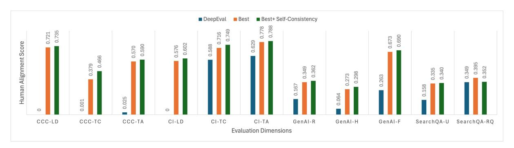
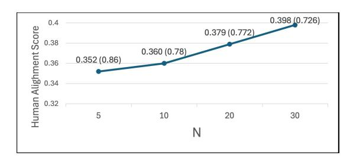

# INSTAJUDGE: Aligning Judgment Bias of LLM-as-Judge with Humans in Industry Applications

Myeongjun Erik Jang<sup>1</sup> Fran Silavong<sup>1</sup> 1 J.P. Morgan Chase

myeongjun.jang@jpmchase.com fran.silavong@jpmchase.com

## Abstract

Automated evaluation using LLM-as-Judge offers significant practical benefits for industrial applications. However, the commonly recognized misalignment of judgment biases between humans and LLM-as-Judge hinders its usage in real-world businesses. Although preference-finetuning could be a potential solution, it is often impractical for industrial usecases due to the scarcity of business-specific data and the infeasibility of applying it to closed models. In this paper, we propose IN-STAJUDGE, an LLM-as-Judge library that improves alignments of judgment biases through automatic prompt optimization (APO). Our library not only integrates recent APO methods within a unified framework but also introduces a novel APO approach called distributionpreserving few-shot sampling (DPFS). Experimental results verify demonstrate DPFS significantly outperforms existing LLM-as-Judge libraries, like DeepEval, and APO methods by a large margin, while being more cost efficient.

## 1 Introduction

In light of recent notable achievements of large language models (LLMs), LLM-as-Judge [\(Zheng](#page-9-0) [et al.,](#page-9-0) [2023;](#page-9-0) [Li et al.,](#page-8-0) [2024b;](#page-8-0) [Gao et al.,](#page-7-0) [2025\)](#page-7-0) has emerged as a compelling alternative to human evaluation, offering potential benefits to the industry by significantly lowering the costs associated with assessing the quality of AI applications. To ensure successful replacement of human evaluation with LLM-as-Judge, particularly for industrial purposes, it is an essential prerequisite to align the judgment bias of LLM-as-Judge with that of humans. However, numerous studies have demonstrated that the judgment biases of LLMs are often misaligned with those of humans [\(Koo et al.,](#page-8-1) [2024;](#page-8-1) [Chen et al.,](#page-7-1) [2024\)](#page-7-1), and they possess undesirable biases, which can be detrimental to reliable decisionmaking [\(Jang and Lukasiewicz,](#page-7-2) [2023;](#page-7-2) [Wang et al.,](#page-8-2) [2024;](#page-8-2) [Wataoka et al.,](#page-9-1) [2024;](#page-9-1) [Levy et al.,](#page-8-3) [2024b\)](#page-8-3).

The most widely utilized and straightforward remedy to align judgment biases between LLMs and humans is fine-tuning with human-preference dataset, where many algorithms have been proposed for efficient fine-tuning [\(Go et al.,](#page-7-3) [2023;](#page-7-3) [Rafailov et al.,](#page-8-4) [2023;](#page-8-4) [Meng et al.,](#page-8-5) [2024;](#page-8-5) [Etha](#page-7-4)[yarajh et al.,](#page-7-4) [2024;](#page-7-4) [Xiong et al.,](#page-9-2) [2024;](#page-9-2) [Kim et al.,](#page-8-6) [2025\)](#page-8-6). Nonetheless, these approaches are hardly applicable to industrial contexts. Firstly, industrial use-cases require business-oriented and taskspecific judgment biases, necessitating the involvement of highly skilled annotators who possess indepth business understanding to accurately annotate the data. Ultimately, this makes the collection of human-preference datasets significantly more costly. Secondly, preference fine-tuning algorithms require open models that allow access to logits and parameters. However, in industry applications, closed LLMs are also widely used because of the convenience of simply calling their APIs. For these models, preference fine-tuning is rarely feasible.

In this paper, we introduce a Python library named INSTAJUDGE, developed to address the alignment of judgment biases between humans and LLM-as-Judges in industrial applications. Instead of fine-tuning with a curated human-preference dataset, we employ automatic prompt optimization (APO) to learn judgment bias, in light of studies indicating that prompt engineering can contribute to the injection of biases into LLMs [\(Dwivedi et al.,](#page-7-5) [2023;](#page-7-5) [Torres et al.,](#page-8-7) [2024\)](#page-8-7). Specifically, our library supports the automatic discovery of the best task instructions and few-shot demonstrations, aiming to maximize human alignment by using a small amount of human-annotated dataset. To achieve this, we integrate DSPy [\(Khattab et al.,](#page-7-6) [2024;](#page-7-6) [Opsahl-Ong et al.,](#page-8-8) [2024\)](#page-8-8) and AdalFlow [\(Yin and](#page-9-3) [Wang,](#page-9-3) [2025\)](#page-9-3) into our INSTAJUDGE framework, enabling users to access both distinct libraries within our unified schema by simply specifying an option. Additionally, we introduce a novel method

called Distribution Preserving Few-shot Sampling (DPFS), a cost efficient approach to identify suitable few-shot demonstrations and can be employed alongside the task instruction optimization methods of both DSPy and AdalFlow.

INSTAJUDGE offers significant advantages over existing representative LLM-as-Judge libraries, such as DeepEval [\(Confidential-AI,](#page-7-7) [2025\)](#page-7-7) and Opik [\(Comet,](#page-7-8) [2024\)](#page-7-8), by providing APO to enhance human-alignment and allowing for a customized evaluation.[1](#page-1-0) Experimental results on various realbusiness datasets also reveal that the proposed DPFS method significantly improves the human alignment across many industrial use-cases compared to DSPy and AdalFlows. It also achieves approximately a 64% improvement in alignment with human preferences compared to zero-shot LLM-as-Judges without utilizing APO.

### 2 INSTAJUDGE Library

Building upon prior research regarding APO, we conceptualize a prompt as a combination of task instructions and few-shot demonstrations.

#### 2.1 Supported Functionalities

Our library supports three types of APO methods, allowing users to run both existing approaches and our own contribution with just a few lines of code. Note that a certain amount of human-annotated training data, usually between 20 to 50, is required.

DSPy [\(Khattab et al.,](#page-7-6) [2024\)](#page-7-6) can be characterized as an APO algorithm that operates in a grid search manner. The algorithm initiates the process by generating potential candidates for improved task instructions and few-shot demonstrations using LLMs. Subsequently, it seeks to determine the optimal combination of task instruction and fewshot demonstrations that maximizes performance based on predefined evaluation criteria, such as accuracy on the training dataset. While grid search is ideal for finding the optimal solution, its computational cost is prohibitively high. Therefore, DSPy employs Bayesian optimization as a more efficient alternative.

AdalFlow [\(Yin and Wang,](#page-9-3) [2025\)](#page-9-3) is an algorithm that utilizes TextGrad [\(Yuksekgonul et al.,](#page-9-4) [2024\)](#page-9-4) for APO. As clarified in the original paper, the term 'gradient' in TextGrad is metaphorical rather than

mathematical, referring to textual feedback generated by LLMs. The process consists of two steps: a forward pass and a backward pass. During the forward pass, an LLM generates a prediction based on an initial prompt and an input instance, followed by a feedback generation step, in which the LLM produces evaluative feedback on the prediction considering the corresponding ground-truth label and a predefined evaluation criterion. The backward pass then begins with the improvement suggestion stage, where the LLM generates suggestions to refine the prediction based on the previously generated evaluative feedback. Finally, the LLM prompted to generate an updated prompt based on the original prediction and the improvement suggestions, with the goal of improving subsequent predictions.

DPFS Based on the recent study that shows the impact of accurate human-written reference [\(Krumdick et al.,](#page-8-9) [2025\)](#page-8-9), we introduce DPFS for constructing optimal few-shot demonstrations. Unlike DSPy and AdalFlow, which incorporates LLM-generated examples, DPFS only employs human-written data. It is worth mentioning that DPFS can be applied independently or integrated with the task instruction optimization methods of DSPy or AdalFlow.

#### <span id="page-1-1"></span>Algorithm 1 SAMPLING process of DPFS.

Input: labeled dataset *D* = {(*x*1*, y*1)*, ...,*(*xM, yM*)}, *Y* = (*y*1*, ..., yM*), the number of few-shot examples *N*

Output: Extracted few-shot example set *S*

- 1: *S* = [] *▷* Initialize an empty list
- 2: for *i* = 1, ..., |UniqueSet(Y)| do
- 3: *P<sup>Y</sup>* <sup>=</sup>*<sup>i</sup>* = Dist(D) *▷* Compute probability of label *i* from *D*
- 4: *n*ˆ = min(int(*N* × *P<sup>Y</sup>* <sup>=</sup>*i*), 1) *▷* Determine the number of samples to extract for label *i*
- 5: *S<sup>i</sup>* = RandSample(*D<sup>Y</sup>* <sup>=</sup>*<sup>i</sup>* , *n*ˆ) *▷* Random sample *n*ˆ examples with label *i*
- 6: *S* += *S<sup>i</sup>*
- 7: end for
- 8: return *S*

Our approach consists of two processes, SAM-PLING and SELECTION. The human label distribution reflects certain biases existing in human judgment [\(Haliburton et al.,](#page-7-9) [2024\)](#page-7-9). For example, consider an annotation task with label scales ranging from 1 to 5, where the higher scores imply better quality. Provided an annotator has strict judgment

<span id="page-1-0"></span><sup>1</sup>DeepEval and Opik only provide zero-shot inference and numerical evaluation scores within a fixed range.

biases, more training examples are likely to receive lower scores. Conversely, more lenient judgment biases will lead to a higher frequency of high-score labels. Therefore, the SAMPLING process is crafted to select few-shot examples while preserving the label distribution of the training data, aiming to better align the evaluation criteria of LLMs with those of human annotators. The detail of SAMPLING process is demonstrated in Algorithm 1. It is easy to find that the SAMPLING process is similar to the stratified sampling of the scikit-learn Python package, with the key difference being that the SAMPLING process guarantees at least one sample is selected for each label.

While the SAMPLING process preserves the ground-truth label distribution, it only reflects superficial judgment biases. Also, it can produce multiple few-shot sets with no clear indication of which set is optimal. The SELECTION process is thus implemented to determine which candidate few-shot set might be optimal. We established the guideline that the most effective set is the one where the LLM makes the most errors, allowing the model to correct its judgment bias with more accurate information. The entire process of DPFS method is demonstrated in Algorithm 2.

#### <span id="page-2-0"></span>Algorithm 2 The entire DPFS process.

**Input:** labeled dataset  $D = \{(x_1, y_1, ), ..., (x_K, y_M, )\}, Y = (y_1, ..., y_M)$ , the number of few-shot examples N, the number of few-shot example set to investigate K, an LLM  $\mathcal{M}$  **Output:** Optimized few-shot example set O

- 1: C = []
- 3: **for** j = 1, ..., K **do**
- 4:  $O_j = \text{SAMPLING}(D, N)$   $\triangleright \text{Run}$  Algorithm 1
- 5:  $X_j, Y_j = \text{DividePairs}(O_j) \Rightarrow \text{Divide } O_j$  into inputs and labels
- 6:  $\hat{X}_j = \mathcal{M}(X_j)$  > Generate predictions of  $X_j$  with the LLM
- 7:  $A_j = Alignment(\hat{X}_j, Y_j) \triangleright Compute the alignment score with human annotations$
- 8:  $C.append(O_i)$
- 9:  $S.append(A_i)$
- 10: **end for**
- 11: idx = argmin(S)
- 12: O = C[idx]
- 13: **return** *O*

DPFS provides a great advantage in terms of

computational cost. Let n denotes the number of few-shot examples, N represents the size of the training set, I indicates the number of iterations for APO, and K signifies the number of few-shot sets to be examined. As both DSPy and AdalFlow involve generating few-shot examples and making predictions on training examples to calculate the evaluation criterion for each iteration, the number of LLM calls is proportional to  $O(n \times N \times I)$ . In contrast, DPFS invokes LLM only  $O(n \times K)$ times. Given that I and K are relatively small and often have similar values (e.g., 10), DPFS requires significantly few LLM calls compared to DSPy and AdalFlow, thereby reducing the optimization time. In practice, the APO time of DPFS was 2.2 and 5.1 times fewer than DSPy and AdalFlow on average, respectively.

**Self-consistency decoding** (Wang et al., 2023) is a strategy that involves generating multiple reasoning paths (N) and their corresponding outputs, then aggregating these outputs to arrive at the final answer. Our library supports this decoding strategy to ensure more robust and precise predictions.

#### 2.2 Overview of Basic Usage

**Prompt Configuration.** The initial and fundamental step in utilizing our library involves defining the prompt configuration in JSON format, which consists of InputFields, OutputFields, and Instruction. The InputFields and OutputFields demonstrate all the variables necessary for conducting a task that we intent LLMs to perform. For example, if an intended task is to evaluate the relevance of a QA model's response to a user's question, the InputFields would encompass variables such as 'user\_question' and 'model\_response', whereas the OutputFields would include a 'relevance score' variable. The Instruction, as implied by its name, outlines a free-text description detailing the specifics of the objective task. The categories or scales of the evaluation can be demonstrated within task instruction. Figure 3 in Appendix C illustrates an example of the prompt configuration. The created prompt configuration will automatically converted into the necessary prompt-related components, such as Signature for DSPy and AdalFlowBaseData for AdalFlow.

**INSTAJUDGE Navigator.** In INSTAJUDGE, the entire process is facilitated by the InstaJudgeNavigator. In addition to the

prompt configuration and LLM client, specifying the APO options is needed as outlined below.

```
1 from instajudge import InstaJudgeNavigator
2
3 navigator = InstaJudgeNavigator(
4 client=client,
5 config=prompt_config,
6 engine="dspy",
7 instruction_opt="dspy",
8 few_shot_opt="dist_preserve",
9 eval_type="exact_match",
10 )
```

APO options require three hyperparameters:

- 1. engine (dspy, adal): a backbone framework that LLM-as-Judge employs.
- 2. instruction\_opt (None, dspy, adal): a taskinstruction APO method.
- 3. few\_shot\_opt (dspy, adal, dist\_preserve): a few-shot demonstration APO method.
- 4. eval\_type: evaluation criterion option.

The instruction\_opt and few\_shot\_opt must be assigned identical values if configured to either 'dspy' or 'adal'. When the few\_shot\_opt is set to dist\_preserve (DPFS), the instruction\_opt can be configured as either 'dspy' or 'adal'. If the intention is to perform APO without including task instructions, the value can be assigned as None. The eval\_type serves an option to specify the evaluation criterion. We offer support for two basic metrics: exact-match and fuzzy-match, but customization is also possible.

Once the InstaJudgeNavigator is created, APO and inference can be easily conducted using the optimize and predict APIs, as shown in Figure [4](#page-13-2) in Appendix [C.](#page-13-1) Without running APO, the navigator will carry out zero-shot inference.

### 3 Experiment Design

For experiments, we applied INSTAJUDGE to two tasks, topic modeling evaluation and retrievalaugmented generation (RAG)-based question answering (QA) evaluation, across four real-world industrial use-cases. LLM-as-Judge was employed to evaluate the quality of model outputs.

## 3.1 Task and Dataset

For each use-case, 3 to 5 Anglophone annotators participated in the data annotation process, with the exact number varying depending on the individual use-case. Annotators received training based on detailed guidelines that outlined the annotation dimensions, corresponding labels, as well as examples. Each instance was annotated by a single annotator, who also provided a justification for the assigned label. After annotation, reviewers examined both the labels and their justifications. If a reviewer disagreed with a label, they returned the instance to the annotator along with the reason for rejection, and the instance was re-labeled. The average agreement rate between reviewers and the initial labels was 93%. Table [2](#page-4-0) shows the basic statistics for each dataset.

Topic modeling evaluation aims to evaluate the quality of our in-house topic modeling tool on two industrial use-case dataset. The Customer Chatbot Conversation (CCC) dataset consists of conversation logs from a customer banking chatbot application. The Customer Issue dataset provides brief summaries of issues raised by customers during their daily banking activities. Our in-house topic modeling tool assigns a topic for each text, which is then evaluated by human evaluators to create ground-truth scores according to the evaluation dimensions described in Table [1.](#page-4-1) These are excellent industrial use-cases that demonstrate how even similar tasks can exhibit distinctive human judgment biases depending on the annotation guidelines and business needs.

RAG QA evaluation focuses to assess the quality of responses of our in-house RAG-based QA models considering user questions. The Generative-AI (GenAI) provides users' questions along with their corresponding HTML-formatted response. The SearchQA dataset includes users' questions, their respective responses, and the citations retrieved to answer those questions. Analogous to the topic modeling evaluation task, human evaluators annotated the ground-truth labels for each evaluation dimensions outlined in Table [1.](#page-4-1)

### 3.2 Experiment Framework and Settings

For each evaluation dimension, LLM-as-Judge takes inputs and outputs of the model, and predicts the assessment results. These predicted results are then compared with human-annotated ground-truth to calculate the human alignment. In accordance with previous studies, we used the F1-score (F*w*) for categorical dimensions and Pearson correlation (P*r*) for numerical dimensions as measures of human alignment [\(Bai et al.,](#page-7-10) [2023;](#page-7-10) [Liu et al.,](#page-8-11) [2024;](#page-8-11) [Thakur et al.,](#page-8-12) [2024\)](#page-8-12). Regarding initial prompt designs, task instructions outlined in Appendix [B](#page-10-0) are used without any few-shot examples. This prompt

<span id="page-4-1"></span>

| Dataset  | Dimension               | Description                                                                                                                                             |
|----------|-------------------------|---------------------------------------------------------------------------------------------------------------------------------------------------------|
|          | Level of detail (LD)    | categorical; evaluate whether the topic offers enough detail for the text under<br>four categories: Not applicable, Optimal, Too broad, Too detailed.   |
| CCC & CI | Topic completeness (TC) | numerical; evaluate whether there are any additional topics present in the<br>given text but missing, using an integer scoring from 1 to 4.             |
|          | Topic accuracy (TA)     | numerical; evaluate how accurate the topic is and well represented in the<br>given text, using an integer scoring from 1 to 4.                          |
|          | Relevance (R)           | numerical; evaluate the relevance of the response to the user's question, using<br>an integer scale from 0 to 4                                         |
| GenAI    | Helpfulness (H)         | numerical; evaluate how helpful the response is the user's question, using an<br>integer scale from 0 to 4.                                             |
|          | Formatting (F)          | numerical; evaluate the response for adherence to HTML format, using an<br>integer scale from 0 to 4.                                                   |
| SearchQA | Usefulness (U)          | numerical; evaluate the overall usefulness of the response considering the<br>user's question, using an integer scale from 1 to 3                       |
|          | Retrieval quality (RQ)  | numerical; evaluate the quality of the retrieved citations, ensuring they are<br>sufficient to answer the question, using an integer scale from 1 to 4. |

Table 1: Business-defined demonstrations of the evaluation dimensions for each industrial use-cases.

<span id="page-4-0"></span>

| Dataset         | CCC  | CI  | GenAI | SearchQA    |
|-----------------|------|-----|-------|-------------|
| # of data       | 1250 | 120 | 111   | 100         |
| Avg # of tokens | 120  | 21  | 220   | 6.1K (1.5K) |

Table 2: The basic statistics of industry datasets. The parenthesis in SearchQA implies the average number of tokens without retrieved documents.

design is either updated following APO or used as-is for zero-shot inference. Throughout the experiments, gpt-4o-2024-05-13 was used as the backbone LLM. Performance was measured using 5-fold cross-validation, with the average score of the five folds is reported.

We evaluated the performance of four different APO methods for both DSPy and AdalFlow engine:

- Inst\_only: focuses solely on optimizing the the task instruction.
- Inst\_demos: optimizes both the task instruction and few-shot demonstrations.
- DPFS: exclusively utilizes the proposed DPFS approach.
- Inst\_DPFS: combines DPFS with task instruction optimization using the selected engine.

All methods are applied using equivalent hyperparameter settings, with detailed information available in Appendix [A.1.](#page-10-1) For baseline approaches, we selected zero-shot LLM-as-Judge without APO for each of DSPy and AdalFlow engines, and included DeepEval as an existing library baseline. Opik was omitted because both DeepEval and Opik employ G-Eval method [\(Liu et al.,](#page-8-13) [2023\)](#page-8-13). DeepEval's performance is only measured solely on numerical dimensions, as it is designed to generate only numerical outputs.

### 4 Experimental Results

The experimental results are presented in Table [3.](#page-5-0)

Comparison with DeepEval The experimental results confirm the advantage of INSTAJUDGE APO over DeepEval, showing an immeasurable improvement in the CCC dataset and an average performance gain of 110% in other use-cases. The performance gap is statistically significant across all dimensions (p-value < 0.05, t-test), except for the RQ dimension in the SearchQA use-case. Even without APO, zero-shot INSTAJUDGE for both engines generally outperforms DeepEval, which highlights the importance of aligning the scale of the evaluation dimension. Moreover, INSTAJUDGE enables customization of the evaluation dimension schema, offering a practical benefit for applying it to categorical evaluation dimensions-a feature that DeepEval does not offer.

Performance gain through APO The results show that all the APO methods are effective in enhancing human alignments across all our industrial use-cases. The greatest of performance is achieved by Inst\_DPFS, with an average increase of 64% compared to zero-shot Judge, followed by DPFS, which exhibits an average improvement of 56%. The average improvement of Inst\_demos and Inst\_only is 36% and 27%, respectively. Table [3](#page-5-0) also reveals that, in most cases, Inst\_DPFS consistently ranks as the top performer for each engine, closely followed by DPFS with only marginal differences. It is worth emphasizing that using only DPFS not only outperforms Inst\_demos and Inst\_only, but also requires three times less running time for APO. The simplicity and cost efficiency of our proposed approach offer practical advantages over the existing APO algorithms. However, no significant improvements was observed in the RQ dimension of the SearchQA use-case. We

<span id="page-5-0"></span>

|          |            | CCC   |       | CI    |       |       | GenAI |      |       | SearchQA |       |      |
|----------|------------|-------|-------|-------|-------|-------|-------|------|-------|----------|-------|------|
| Engine   | Method     | LD    | TC    | TA    | LD    | TC    | TA    | R    | H     | F        | U     | RQ   |
|          |            | Fw    | Pr    | Pr    | Fw    | Pr    | Pr    | Pr   | Pr    | Pr       | Pr    | Pr   |
| DeepEval | zero-shot  | -     | .001  | .025  | -     | .588  | .629  | .167 | .064  | .263     | .158  | .349 |
| DSPy     | zero-shot  | .408  | .244  | .393  | .536  | .530  | .722  | .259 | .184  | .394     | .213  | .395 |
|          | Inst-only  | .648  | .248  | .409  | .547  | .545  | .725  | .245 | .184  | .394     | .252  | .356 |
|          | Inst-demos | .589  | .186  | .438  | .564  | .629  | .737  | .347 | .176  | .529     | .256  | .341 |
|          | DPFS       | .634  | .352* | .570* | .576  | .716* | .775* | .272 | .235* | .637*    | .311* | .349 |
|          | Inst-DPFS  | .667* | .379* | .565* | .575* | .715* | .778* | .349 | .273* | .646*    | .335* | .385 |
| Adal     | zero-shot  | .455  | .045  | .387  | .440  | .499  | .661  | .182 | .090  | .464     | .093  | .296 |
|          | Inst-only  | .673  | .154  | .409  | .533  | .526  | .700  | .212 | .101  | .532     | .236  | .293 |
|          | Inst-demos | .705  | .131  | .397  | .574  | .633  | .751  | .274 | .102  | .627     | .317  | .303 |
|          | DPFS       | .664  | .272* | .424* | .557  | .631  | .763* | .235 | .099  | .670*    | .284  | .278 |
|          | Inst-DPFS  | .721* | .261* | .440* | .572  | .691* | .763* | .236 | .112  | .673*    | .328  | .300 |

Table 3: The results from the experiments conducted on industrial use-cases. F*<sup>w</sup>* and P*<sup>r</sup>* denote weighted F1-score and Pearson correlation, respectively. The best performance for each evaluation dimension is highlighted in bold, while the top performance for each engine (DSPy, AdalFlow) is underlined. The performance of DPFS or Inst-DPFS show a statistically significant difference compared to that of the best-performing baseline APO method with p-value < 0.05 (\*) using the t-test.

will discuss this further in the following section.

Self-consistency decoding We applied selfconsistency decoding to the top-performing models for each evaluation dimension to ascertain if it could further enhance the human alignment scores. The results are illustrated in Figure [1.](#page-6-0) With *N* set to 5, the results show an average performance improvement of 6%, indicating the positive impact of the decoding strategy. However, the SearchQA-RQ dimension showed no improvement, consistent with the pattern observed in the APO experiments. We hypothesized that a primary reason of this phenomenon is the lengthy inputs of the task.[2](#page-5-1) It is widely accepted that lengthy inputs elevate the level of task difficulty, which rapidly degrades LLMs' reasoning ability [\(Bai et al.,](#page-7-11) [2024;](#page-7-11) [Li et al.,](#page-8-14) [2024a\)](#page-8-14), even on input length of 3K tokens [\(Levy et al.,](#page-8-15) [2024a\)](#page-8-15). To assess the task difficulty, we calculated the entropy of *N* outputs from self-consistency decoding, since the answers should be diverse for ambiguous and challenging tasks. Interestingly, the entropy of SearchQA-RQ was the highest at 0.86, while the others averaged 0.36 ± 0.19. This supports our claim that SearchQA-RQ is far more challenging than others due to its lengthy inputs.

To investigate further, we examined whether increasing *N*, the number of distinct reasoning paths in self-consistency decoding, would improve performance. The experiment was focused on SearchQA-RQ dimension, as it was the only dimension where APO showed a negative performance gain. The results are presented in Figure [2.](#page-6-1) The results indicate that the human alignment score increases directly proportional to *N*. Additionally, as *N* increases, the entropy of the multiple responses decreases, suggesting that the decision-making process becomes less ambiguous.

DSPy vs. AdalFlow The results in Table [3](#page-5-0) show that DSPy and AdalFlow exhibit significant performance differences, even in the zeroshot setting, that is, when given identical task instructions. This can be attributed to differences in their underlying prompt structures. For example, AdalFlow enforces strict output formats (e.g., JSON or YAML), whereas DSPy generates natural language responses. In general, DSPy outperforms AdalFlow in most evaluation dimensions, consistent with previous research [\(Tam et al.,](#page-8-16) [2024\)](#page-8-16) that ascertains the negative impact of format restrictions on LLM performance. However, AdalFlow outperforms DSPy in the GenAI-Format and CCC-LD dimensions, and demonstrates comparable performance in the CI-LD dimensions. We believe that these results are largely influenced by the difficulty of the tasks. Consider a simple optimization task in which the loss function is defined over a perfectly convex space. In such a scenario, the SGD optimizer can easily converge to the optimal solution. However, in more complex landscapes characterized by numerous saddle points, SGD becomes less effective, whereas grid search may more reliably identify the optimal solution. Similarly, for straightforward tasks where TextGrad can provide constructive feedback to guide prompt updates, AdalFlow demonstrates advantages. Conversely, DSPy, which utilizes Bayesian optimization, is better suited for challenging tasks where obtaining reliable feedback for prompt updates is difficult.

<span id="page-5-1"></span><sup>2</sup>An average of 6.1K tokens and a maximum 13K tokens.

<span id="page-6-0"></span>

<span id="page-6-2"></span>Figure 1: Self-consistency decoding (*N* = 5) performance on the best model for each evaluation dimension.

| Method     | Knowledge Acc.<br> Tr =30 /  Test =124 | Reasoning Acc.<br> Tr =10 /  Test =41 | Math Acc.<br> Tr =6 /  Test =28 | Coding Acc.<br> Tr =6 /  Test =25 | Overall |
|------------|----------------------------------------|---------------------------------------|---------------------------------|-----------------------------------|---------|
| zero-shot  | .361                                   | .600                                  | .400                            | .500                              | .465    |
| Inst-only  | .361                                   | .600                                  | .400                            | .500                              | .465    |
| Inst-demos | .467                                   | .600                                  | .333                            | .444                              | .461    |
| DPFS       | .565                                   | .636                                  | .333                            | .500                              | .509    |
| Inst-DPFS  | .565                                   | .636                                  | .333                            | .500                              | .509    |

Table 4: Experimental results on JudgeBench dataset. |Tr| and |Test| represents the size of training and testing set, respectively. The best performances are highlighted in bold. The number of few-shot examples was set to 4.

<span id="page-6-1"></span>

Figure 2: Self-consistency decoding performance with different *N* on SearchQA-RQ dimension. The value in parentheses indicates the entropy of *N* answers.

We validated our assumption by measuring the entropy of self-consistency decoding outputs. Tasks where AdalFlow performed better or comparably had an average entropy of 0.152, versus 0.5 for others, indicating its suitability for less-challenging tasks.

### 5 JudgeBench Evaluation

As our industrial experiments focused on our in-house dataset, we additionally conducted an experiment on publicly available JudgeBench dataset [\(Tan et al.,](#page-8-17) [2025\)](#page-8-17). In brief, the task involves selecting the better response from two LLMgenerated candidates when presented with a question. There are two types of datasets the responses are generated by claude-3-5-sonnet-20240620 and gpt-4o-2024-05-13. We used the former to avoid egocentric bias [\(Koo et al.,](#page-8-1) [2024\)](#page-8-1), as gpt-4o-2024-05-13 was the backbone LLM for our experiments. Basically, we followed the identical experiment settings as outlined in the paper, with the only difference being that we used 20% of

data as a training set to run APO.

The results are presented in Table [4.](#page-6-2) As in the industrial experiments, our proposed approaches achieved the best overall performance. However, when looking at each individual domain, an interesting trend emerges: the performance gain is directly proportional to the size of the training set, with a substantial improvement observed in Knowledge domain, but no improvement in Math and Coding. This trend was not observed in the aforementioned industrial experiments discussed, where at least 20 examples were used for the training set. The results indicate that it is essential to collect sufficient training set for running APO effectively.

## 6 Conclusion

In industrial applications, the judgment biases of LLM-as-Judge and humans are more likely to diverge due to domain specificity, necessitating alignment to ensure fair evaluations and facilitate practical deployments. In this paper, we propose IN-STAJUDGE, an LLM-as-Judge library that supports APO by integrating DSPy and AdalFlow within a unified framework. It also offers DPFS, which outperforms existing APO methods despite its costefficiency, and self-consistency decoding to enable more robust evaluations. Our library offers practical benefits over existing LLM-as-Judge libraries, like DeepEval, by improving human alignment performance APO and enabling flexible evaluation schema customization.

## Limitations

While the proposed DPFS and existing APO methods exhibited promising improvements in human alignment scores across various industrial usecases and evaluation dimensions, they made only modest enhancements in challenging tasks involving lengthy text inputs. Future work should focus on developing more advanced approaches to address this issue. Regarding self-consistency decoding, we ascertained that it contributes to generating more robust and precise evaluation results, where the improvements are more promising with large *N*. However, this also leads to an increase in the number of LLM calls, which can be resource-intensive. Utilizing more resource-efficient decoding strategies, such as adaptive self-consistency [\(Aggarwal](#page-7-12) [et al.,](#page-7-12) [2023\)](#page-7-12) can enhance the practical efficiency of our library. Additionally, our proposed DPFS approach has a limitation related to randomness, particularly when the initial prompt performs poorly. A major factor contributing to this phenomenon is the algorithm's approach of selecting instances where LLMs make incorrect predictions as fewshot examples. As a result, if LLMs perform poorly with the initial prompt design, a large number of candidate sets for few-shot examples can be generated, increasing the randomness. Future work should aim to minimize this randomness issue in order to achieve more consistent performance. Finally, the experimental results on the JudgeBench dataset suggest the importance of having a sufficient amount of training data.

## References

- <span id="page-7-12"></span>Pranjal Aggarwal, Aman Madaan, Yiming Yang, and Mausam. 2023. [Let's sample step by step: Adaptive](https://doi.org/10.18653/v1/2023.emnlp-main.761)[consistency for efficient reasoning and coding with](https://doi.org/10.18653/v1/2023.emnlp-main.761) [LLMs.](https://doi.org/10.18653/v1/2023.emnlp-main.761) In *Proceedings of the 2023 Conference on Empirical Methods in Natural Language Processing*, pages 12375–12396, Singapore. Association for Computational Linguistics.
- <span id="page-7-11"></span>Yushi Bai, Xin Lv, Jiajie Zhang, Hongchang Lyu, Jiankai Tang, Zhidian Huang, Zhengxiao Du, Xiao Liu, Aohan Zeng, Lei Hou, Yuxiao Dong, Jie Tang, and Juanzi Li. 2024. [LongBench: A bilingual, multi](https://doi.org/10.18653/v1/2024.acl-long.172)[task benchmark for long context understanding.](https://doi.org/10.18653/v1/2024.acl-long.172) In *Proceedings of the 62nd Annual Meeting of the Association for Computational Linguistics (Volume 1: Long Papers)*, pages 3119–3137, Bangkok, Thailand. Association for Computational Linguistics.
- <span id="page-7-10"></span>Yushi Bai, Jiahao Ying, Yixin Cao, Xin Lv, Yuze He, Xiaozhi Wang, Jifan Yu, Kaisheng Zeng, Yijia Xiao,

- Haozhe Lyu, and 1 others. 2023. [Benchmarking foun](https://proceedings.neurips.cc/paper_files/paper/2023/hash/f64e55d03e2fe61aa4114e49cb654acb-Abstract-Datasets_and_Benchmarks.html)[dation models with language-model-as-an-examiner.](https://proceedings.neurips.cc/paper_files/paper/2023/hash/f64e55d03e2fe61aa4114e49cb654acb-Abstract-Datasets_and_Benchmarks.html) *Advances in Neural Information Processing Systems*, 36:78142–78167.
- <span id="page-7-1"></span>Guiming Hardy Chen, Shunian Chen, Ziche Liu, Feng Jiang, and Benyou Wang. 2024. [Humans or llms](https://arxiv.org/abs/2402.10669) [as the judge? a study on judgement biases.](https://arxiv.org/abs/2402.10669) *arXiv preprint arXiv:2402.10669*.
- <span id="page-7-8"></span>Comet. 2024. [Opik: Open-source llm evaluation plat](https://www.comet.com/docs/opik/)[form.](https://www.comet.com/docs/opik/)
- <span id="page-7-7"></span>Confidential-AI. 2025. [Deepeval: The llm evaluation](https://deepeval.com/) [framework.](https://deepeval.com/)
- <span id="page-7-5"></span>Satyam Dwivedi, Sanjukta Ghosh, and Shivam Dwivedi. 2023. [Breaking the bias: Gender fairness in llms](https://rupkatha.com/V15/n4/v15n410.pdf) [using prompt engineering and in-context learning.](https://rupkatha.com/V15/n4/v15n410.pdf) *Rupkatha Journal on Interdisciplinary Studies in Humanities*, 15(4).
- <span id="page-7-13"></span>Aparna Elangovan, Lei Xu, Jongwoo Ko, Mahsa Elyasi, Ling Liu, Sravan Babu Bodapati, and Dan Roth. 2025. [Beyond correlation: The impact of human uncer](https://openreview.net/forum?id=E8gYIrbP00)[tainty in measuring the effectiveness of automatic](https://openreview.net/forum?id=E8gYIrbP00) [evaluation and llm-as-a-judge.](https://openreview.net/forum?id=E8gYIrbP00) In *The Thirteenth International Conference on Learning Representations*.
- <span id="page-7-4"></span>Kawin Ethayarajh, Winnie Xu, Niklas Muennighoff, Dan Jurafsky, and Douwe Kiela. 2024. [Kto: Model](https://arxiv.org/abs/2402.01306) [alignment as prospect theoretic optimization.](https://arxiv.org/abs/2402.01306) *arXiv preprint arXiv:2402.01306*.
- <span id="page-7-0"></span>Mingqi Gao, Xinyu Hu, Xunjian Yin, Jie Ruan, Xiao Pu, and Xiaojun Wan. 2025. [Llm-based nlg evalua](https://direct.mit.edu/coli/article/doi/10.1162/coli_a_00561/128807)[tion: Current status and challenges.](https://direct.mit.edu/coli/article/doi/10.1162/coli_a_00561/128807) *Computational Linguistics*, pages 1–28.
- <span id="page-7-3"></span>Dongyoung Go, Tomasz Korbak, Germán Kruszewski, Jos Rozen, Nahyeon Ryu, and Marc Dymetman. 2023. [Aligning language models with preferences](https://dl.acm.org/doi/abs/10.5555/3618408.3618871) [through f-divergence minimization.](https://dl.acm.org/doi/abs/10.5555/3618408.3618871) In *Proceedings of the 40th International Conference on Machine Learning*, pages 11546–11583.
- <span id="page-7-9"></span>Luke Haliburton, Jan Leusmann, Robin Welsch, Sinksar Ghebremedhin, Petros Isaakidis, Albrecht Schmidt, and Sven Mayer. 2024. [Uncovering labeler bias in](https://link.springer.com/article/10.1007/s43681-024-00572-w) [machine learning annotation tasks.](https://link.springer.com/article/10.1007/s43681-024-00572-w) *AI and Ethics*, pages 1–14.
- <span id="page-7-2"></span>Myeongjun Jang and Thomas Lukasiewicz. 2023. [Con](https://doi.org/10.18653/v1/2023.emnlp-main.991)[sistency analysis of ChatGPT.](https://doi.org/10.18653/v1/2023.emnlp-main.991) In *Proceedings of the 2023 Conference on Empirical Methods in Natural Language Processing*, pages 15970–15985, Singapore. Association for Computational Linguistics.
- <span id="page-7-6"></span>Omar Khattab, Arnav Singhvi, Paridhi Maheshwari, Zhiyuan Zhang, Keshav Santhanam, Sri Vardhamanan, Saiful Haq, Ashutosh Sharma, Thomas T. Joshi, Hanna Moazam, Heather Miller, Matei Zaharia, and Christopher Potts. 2024. [Dspy: Compiling](https://openreview.net/forum?id=sY5N0zY5Od) [declarative language model calls into self-improving](https://openreview.net/forum?id=sY5N0zY5Od) [pipelines.](https://openreview.net/forum?id=sY5N0zY5Od) In *The Twelfth International Conference on Learning Representations*.

- <span id="page-8-6"></span>Dongyoung Kim, Kimin Lee, Jinwoo Shin, and Jaehyung Kim. 2025. [Spread preference annotation:](https://openreview.net/forum?id=BPgK5XW1Nb) [Direct preference judgment for efficient llm align](https://openreview.net/forum?id=BPgK5XW1Nb)[ment.](https://openreview.net/forum?id=BPgK5XW1Nb) In *The Thirteenth International Conference on Learning Representations*.
- <span id="page-8-1"></span>Ryan Koo, Minhwa Lee, Vipul Raheja, Jong Inn Park, Zae Myung Kim, and Dongyeop Kang. 2024. [Bench](https://doi.org/10.18653/v1/2024.findings-acl.29)[marking cognitive biases in large language models as](https://doi.org/10.18653/v1/2024.findings-acl.29) [evaluators.](https://doi.org/10.18653/v1/2024.findings-acl.29) In *Findings of the Association for Computational Linguistics: ACL 2024*, pages 517–545, Bangkok, Thailand. Association for Computational Linguistics.
- <span id="page-8-9"></span>Michael Krumdick, Charles Lovering, Varshini Reddy, Seth Ebner, and Chris Tanner. 2025. [No free labels:](https://arxiv.org/abs/2503.05061) [Limitations of llm-as-a-judge without human ground](https://arxiv.org/abs/2503.05061)[ing.](https://arxiv.org/abs/2503.05061) *arXiv preprint arXiv:2503.05061*.
- <span id="page-8-15"></span>Mosh Levy, Alon Jacoby, and Yoav Goldberg. 2024a. [Same task, more tokens: the impact of input length](https://doi.org/10.18653/v1/2024.acl-long.818) [on the reasoning performance of large language mod](https://doi.org/10.18653/v1/2024.acl-long.818)[els.](https://doi.org/10.18653/v1/2024.acl-long.818) In *Proceedings of the 62nd Annual Meeting of the Association for Computational Linguistics (Volume 1: Long Papers)*, pages 15339–15353, Bangkok, Thailand. Association for Computational Linguistics.
- <span id="page-8-3"></span>Sharon Levy, William Adler, Tahilin Sanchez Karver, Mark Dredze, and Michelle R Kaufman. 2024b. [Gen](https://doi.org/10.18653/v1/2024.findings-emnlp.331)[der bias in decision-making with large language mod](https://doi.org/10.18653/v1/2024.findings-emnlp.331)[els: A study of relationship conflicts.](https://doi.org/10.18653/v1/2024.findings-emnlp.331) In *Findings of the Association for Computational Linguistics: EMNLP 2024*, pages 5777–5800, Miami, Florida, USA. Association for Computational Linguistics.
- <span id="page-8-14"></span>Jiaqi Li, Mengmeng Wang, Zilong Zheng, and Muhan Zhang. 2024a. [LooGLE: Can long-context language](https://doi.org/10.18653/v1/2024.acl-long.859) [models understand long contexts?](https://doi.org/10.18653/v1/2024.acl-long.859) In *Proceedings of the 62nd Annual Meeting of the Association for Computational Linguistics (Volume 1: Long Papers)*, pages 16304–16333, Bangkok, Thailand. Association for Computational Linguistics.
- <span id="page-8-0"></span>Zhen Li, Xiaohan Xu, Tao Shen, Can Xu, Jia-Chen Gu, Yuxuan Lai, Chongyang Tao, and Shuai Ma. 2024b. [Leveraging large language models for NLG evalua](https://doi.org/10.18653/v1/2024.emnlp-main.896)[tion: Advances and challenges.](https://doi.org/10.18653/v1/2024.emnlp-main.896) In *Proceedings of the 2024 Conference on Empirical Methods in Natural Language Processing*, pages 16028–16045, Miami, Florida, USA. Association for Computational Linguistics.
- <span id="page-8-13"></span>Yang Liu, Dan Iter, Yichong Xu, Shuohang Wang, Ruochen Xu, and Chenguang Zhu. 2023. [G-eval:](https://doi.org/10.18653/v1/2023.emnlp-main.153) [NLG evaluation using gpt-4 with better human align](https://doi.org/10.18653/v1/2023.emnlp-main.153)[ment.](https://doi.org/10.18653/v1/2023.emnlp-main.153) In *Proceedings of the 2023 Conference on Empirical Methods in Natural Language Processing*, pages 2511–2522, Singapore. Association for Computational Linguistics.
- <span id="page-8-11"></span>Yinhong Liu, Han Zhou, Zhijiang Guo, Ehsan Shareghi, Ivan Vulic, Anna Korhonen, and Nigel Collier. 2024. ´ [Aligning with human judgement: The role of pair](https://openreview.net/forum?id=9gdZI7c6yr)[wise preference in large language model evaluators.](https://openreview.net/forum?id=9gdZI7c6yr) In *First Conference on Language Modeling*.

- <span id="page-8-5"></span>Yu Meng, Mengzhou Xia, and Danqi Chen. 2024. [Simpo: Simple preference optimization with a](https://proceedings.neurips.cc/paper_files/paper/2024/hash/e099c1c9699814af0be873a175361713-Abstract-Conference.html) [reference-free reward.](https://proceedings.neurips.cc/paper_files/paper/2024/hash/e099c1c9699814af0be873a175361713-Abstract-Conference.html) *Advances in Neural Information Processing Systems*, 37:124198–124235.
- <span id="page-8-8"></span>Krista Opsahl-Ong, Michael J Ryan, Josh Purtell, David Broman, Christopher Potts, Matei Zaharia, and Omar Khattab. 2024. [Optimizing instructions and demon](https://doi.org/10.18653/v1/2024.emnlp-main.525)[strations for multi-stage language model programs.](https://doi.org/10.18653/v1/2024.emnlp-main.525) In *Proceedings of the 2024 Conference on Empirical Methods in Natural Language Processing*, pages 9340–9366, Miami, Florida, USA. Association for Computational Linguistics.
- <span id="page-8-4"></span>Rafael Rafailov, Archit Sharma, Eric Mitchell, Christopher D Manning, Stefano Ermon, and Chelsea Finn. 2023. [Direct preference optimization: Your lan](https://proceedings.neurips.cc/paper_files/paper/2023/file/a85b405ed65c6477a4fe8302b5e06ce7-Paper-Conference.pdf)[guage model is secretly a reward model.](https://proceedings.neurips.cc/paper_files/paper/2023/file/a85b405ed65c6477a4fe8302b5e06ce7-Paper-Conference.pdf) *Advances in Neural Information Processing Systems*, 36:53728– 53741.
- <span id="page-8-16"></span>Zhi Rui Tam, Cheng-Kuang Wu, Yi-Lin Tsai, Chieh-Yen Lin, Hung-yi Lee, and Yun-Nung Chen. 2024. [Let me speak freely? a study on the impact of format](https://doi.org/10.18653/v1/2024.emnlp-industry.91) [restrictions on large language model performance.](https://doi.org/10.18653/v1/2024.emnlp-industry.91) In *Proceedings of the 2024 Conference on Empirical Methods in Natural Language Processing: Industry Track*, pages 1218–1236, Miami, Florida, US. Association for Computational Linguistics.
- <span id="page-8-17"></span>Sijun Tan, Siyuan Zhuang, Kyle Montgomery, William Yuan Tang, Alejandro Cuadron, Chenguang Wang, Raluca Popa, and Ion Stoica. 2025. [Judgebench: A benchmark for evaluating llm-based](https://openreview.net/forum?id=G0dksFayVq) [judges.](https://openreview.net/forum?id=G0dksFayVq) In *The Thirteenth International Conference on Learning Representations*.
- <span id="page-8-12"></span>Aman Singh Thakur, Kartik Choudhary, Venkat Srinik Ramayapally, Sankaran Vaidyanathan, and Dieuwke Hupkes. 2024. [Judging the judges: Evaluating align](https://arxiv.org/abs/2406.12624)[ment and vulnerabilities in llms-as-judges.](https://arxiv.org/abs/2406.12624) *arXiv preprint arXiv:2406.12624*.
- <span id="page-8-7"></span>Nicolas Torres, Catalina Ulloa, Ignacio Araya, Matias Ayala, and Sebastian Jara. 2024. [Injecting bias](https://doi.org/10.1109/SCCC63879.2024.10767653) [through prompts: Analyzing the influence of lan](https://doi.org/10.1109/SCCC63879.2024.10767653)[guage on llms.](https://doi.org/10.1109/SCCC63879.2024.10767653) In *2024 43rd International Conference of the Chilean Computer Science Society (SCCC)*, pages 1–8.
- <span id="page-8-2"></span>Peiyi Wang, Lei Li, Liang Chen, Zefan Cai, Dawei Zhu, Binghuai Lin, Yunbo Cao, Lingpeng Kong, Qi Liu, Tianyu Liu, and Zhifang Sui. 2024. [Large lan](https://doi.org/10.18653/v1/2024.acl-long.511)[guage models are not fair evaluators.](https://doi.org/10.18653/v1/2024.acl-long.511) In *Proceedings of the 62nd Annual Meeting of the Association for Computational Linguistics (Volume 1: Long Papers)*, pages 9440–9450, Bangkok, Thailand. Association for Computational Linguistics.
- <span id="page-8-10"></span>Xuezhi Wang, Jason Wei, Dale Schuurmans, Quoc V Le, Ed H Chi, Sharan Narang, Aakanksha Chowdhery, and Denny Zhou. 2023. [Self-consistency improves](https://openreview.net/forum?id=1PL1NIMMrw) [chain of thought reasoning in language models.](https://openreview.net/forum?id=1PL1NIMMrw) In *The Eleventh International Conference on Learning Representations*.

- <span id="page-9-1"></span>Koki Wataoka, Tsubasa Takahashi, and Ryokan Ri. 2024. [Self-preference bias in llm-as-a-judge.](https://arxiv.org/abs/2410.21819) In *Neurips Safe Generative AI Workshop 2024*.
- <span id="page-9-2"></span>Wei Xiong, Hanze Dong, Chenlu Ye, Ziqi Wang, Han Zhong, Heng Ji, Nan Jiang, and Tong Zhang. 2024. [Iterative preference learning from human](https://dl.acm.org/doi/abs/10.5555/3692070.3694322) [feedback: bridging theory and practice for rlhf un](https://dl.acm.org/doi/abs/10.5555/3692070.3694322)[der kl-constraint.](https://dl.acm.org/doi/abs/10.5555/3692070.3694322) In *Proceedings of the 41st International Conference on Machine Learning*, pages 54715–54754.
- <span id="page-9-3"></span>Li Yin and Zhangyang Wang. 2025. [Llm-autodiff: Auto](https://arxiv.org/abs/2501.16673)[differentiate any llm workflow.](https://arxiv.org/abs/2501.16673) *arXiv e-prints*, pages arXiv–2501.
- <span id="page-9-4"></span>Mert Yuksekgonul, Federico Bianchi, Joseph Boen, Sheng Liu, Zhi Huang, Carlos Guestrin, and James Zou. 2024. [Textgrad: Automatic" differentiation" via](https://arxiv.org/abs/2406.07496) [text.](https://arxiv.org/abs/2406.07496) *arXiv preprint arXiv:2406.07496*.
- <span id="page-9-0"></span>Lianmin Zheng, Wei-Lin Chiang, Ying Sheng, Siyuan Zhuang, Zhanghao Wu, Yonghao Zhuang, Zi Lin, Zhuohan Li, Dacheng Li, Eric Xing, and 1 others. 2023. [Judging llm-as-a-judge with mt-bench and](https://proceedings.neurips.cc/paper_files/paper/2023/hash/91f18a1287b398d378ef22505bf41832-Abstract-Datasets_and_Benchmarks.html) [chatbot arena.](https://proceedings.neurips.cc/paper_files/paper/2023/hash/91f18a1287b398d378ef22505bf41832-Abstract-Datasets_and_Benchmarks.html) *Advances in Neural Information Processing Systems*, 36:46595–46623.

### A Appendix

#### <span id="page-10-1"></span>A.1 Hyperparameters for APO

DSPy and AdalFlow The two approaches share identical hyperparameters for few-shot demonstration optimization, which are configured as follows:

- n\_raw\_shots: the number of demonstrations to be drawn from training data.
- n\_bootstrap\_shots: the number of demonstrations to be generated by LLMs.

Both hyperparameters were set to a value of 4. AdalFlow requires two additional hyperparameters, train\_batch\_size and n\_steps, which are akin to the concept of batch-size and epochs in gradient descent. The values were set to 8 and 10, respectively. Similarly, DSPy also requires n\_steps, which represents the number of iterations for running Bayesian optimization. Additionally, n\_candidates must be specified for task instruction optimization, indicating the number of potential candidates to be generated by the LLM for Bayesian optimization. We set both n\_steps and n\_candidates for DSPy to 10.

Hyperparameters for DPFS Two hyperparameters need to be specified to run DPFS. The first one is n\_shots. As DPFS only employs the raw training examples and does not utilize LLM-generated demonstrations, the value is set to 8, which is the sum of n\_raw\_shots and n\_bootstrap\_shots of DSPy and AdalFlow. The second hyperparameter is K, the number of candidate few-shot sets for the selection process. We set the value to 10.

#### A.2 Binned-JSD Metric Results

Relying on a single aggregate correlation metric can dilute significant differences between human labels and those generated by automatic evaluation [\(Elangovan et al.,](#page-7-13) [2025\)](#page-7-13). Therefore, it is important to compare not just a single aggregate correlation scores, but also the overall correlation between human labels and machine-generated labels. In this regard, we additionally measured Binned-JSD score [\(Elangovan et al.,](#page-7-13) [2025\)](#page-7-13), where the lower scores are the better.

The results are presented in Table [5.](#page-11-0) Overall, we observed a similar trend to the results in Table [3.](#page-5-0) Apart from the SearchQA-RQ dimension, DPFS and Inst-DPFS achieve the best performance, showing significant improvements over zero-shot method in most of dimensions across the use-cases. However, a different pattern emerges, with the

best performance mostly achieved by the Adal engine, in contrast to Table [3,](#page-5-0) where DSPy outperformed the Adal engine. The results provide further supports to the claim made by [Elangovan et al.](#page-7-13) [\(2025\)](#page-7-13), highlighting the importance of measuring both single-aggregate and overall correlation metrics.

## <span id="page-10-0"></span>B Prompt Designs

This section presents the task instructions utilized to create the initial prompt designs. The instructions were proposed by our business teams. For the DeepEval experiments, we modified the section regarding evaluation scores to align with DeepEval's scale (0 - 1).

#### B.1 CCC and CI Datasets Task Instructions

The CCC and CI datasets share the same evaluation dimensions. Therefore, we employed the same task instructions.

#### B.1.1 Level of Detail

We will show you a topic assigned to the given text. Your task is to evaluate whether the topic covers the appropriate amount of detail of the text

You should evaluate the level of detail in four levels: Not applicable, Optimal level of detail, Too broad, and Too detailed. The definitions of each level are as follows:

- Not applicable: The topic assigned to the text is completely incorrect.
- Optimal level of detail: The amount of detail present in the topic matches the level of detail that is desired by the business OR The topic category is broader than the desired level of detail, but it maximally leverages the amount of detail present in the text.
- Too broad: The amount of detail present in the topic is lacking, and there exists more detail that could have been leveraged in the text.
- Too detailed: The amount of detail present in the topic exceeds the amount of detail that is desired by the business.

#### B.1.2 Topic Completeness

We will show you a topic assigned to the given text. Your task is to evaluate the

<span id="page-11-0"></span>

|        |            | CCC  |      | CI   |      |      | GenAI |      |      | SearchQA |      |      |
|--------|------------|------|------|------|------|------|-------|------|------|----------|------|------|
| Engine | Method     | LD   | TC   | TA   | LD   | TC   | TA    | R    | H    | F        | U    | RQ   |
|        | zero-shot  | .582 | .564 | .511 | .509 | .505 | .439  | .476 | .533 | .361     | .194 | .536 |
|        | Inst-only  | .389 | .539 | .461 | .509 | .502 | .445  | .485 | .536 | .351     | .188 | .552 |
| DSPy   | Inst-demos | .448 | .610 | .397 | .506 | .477 | .468  | .454 | .532 | .338     | .193 | .567 |
|        | DPFS       | .396 | .524 | .362 | .414 | .451 | .403  | .466 | .517 | .320     | .182 | .557 |
|        | Inst-DPFS  | .386 | .491 | .362 | .416 | .435 | .406  | .448 | .519 | .227     | .180 | .536 |
|        | zero-shot  | .486 | .628 | .506 | .516 | .456 | .438  | .464 | .502 | .458     | .596 | .557 |
| Adal   | Inst-only  | .326 | .533 | .501 | .443 | .444 | .428  | .440 | .504 | .425     | .538 | .553 |
|        | Inst-demos | .336 | .573 | .422 | .408 | .422 | .385  | .451 | .501 | .222     | .491 | .554 |
|        | DPFS       | .351 | .473 | .404 | .422 | .425 | .380  | .430 | .411 | .192     | .491 | .551 |
|        | Inst-DPFS  | .266 | .500 | .355 | .417 | .411 | .380  | .417 | .500 | .191     | .462 | .550 |

Table 5: The Binned-JSD metric scores generated from the experiments conducted on industrial use-cases. The best performance for each evaluation dimension is highlighted in bold, while the top performance for each engine (DSPy, AdalFlow) is underlined.

completeness of the topic, indicating the extent to which all necessary and relevant information is included. The complete topic means:

- 1) The topic covers all the necessary information presented in the text, suggesting that there are no missing topics.
- 2) The topic delivers an optimal level of information, meaning that the scope it covers does not contain unrelated information in relation to the text.

You should evaluate the topic completeness using four level of scores: 1 (Not covered), 2 (Minorly covered), 3 (Mostly covered), and 4 (Complete).

## B.1.3 Topic Accuracy

We will show you a topic assigned to the given text. Your task is to evaluate the accuracy of the topic over the given text; how accurate the topic is and well represented in the given text.

You can ignore the level of granularity / detail. Please just assess if the topic is accurate given the text in any level of detail.

You should evaluate the topic accuracy in four level of scores: 1 (Incorrect), 2 (Partially Correct), 3 (Mostly Correct), and 4 (Completely Correct). The definitions of each level are as follows:

- 1 (Incorrect): The details in the topic is not represented in the text in any way. The topic label is completely wrong or directly contradicting the text.

- 2 (Partially correct): The details of the topic is partially represented in the text. There is some relevance of the topic label to the contents in the text.
- 3 (Mostly correct): The details of the topic is mostly represented in the text.
- 4 (Completely correct): All the details of the topic are represented in the text.

### B.2 GenAI Task Instruction

## B.2.1 Relevance

We will give you a question from a user and a corresponding response, which is written in HTML format. Evaluate the relevance of a given HTML-formatted response to a user's question on a scale from 0 to 4.

### # Steps

- 1. Read the user's question.
- 2. Read the HTML-formatted response.
- 3. Assign a score from 0 to 4 based on the relevance of the response.

#### # Notes

- A score of 0 means the response is not relevant to the question.
- A score of 4 means the response is very relevant to the question.

## B.2.2 Helpfulness

We will give you a question from a user and a corresponding response, which is written in HTML format. Evaluate the helpfulness of a given HTML-formatted response to a user's question on a scale from 0 to 4.

# Steps

- 1. Read the user's question.
- 2. Read the HTML-formatted response.
- 3. Assign a score from 0 to 4 based on the helpfulness of the response.

#### # Notes

- A score of 0 means the response is not helpful at all.
- A score of 4 means the response is very helpful.
- Consider the accuracy, completeness, and clarity of the response when assigning a score.

#### B.2.3 Formatting

We will give you a response for a question, which is written in HTML format. Evaluate the given response for adherence to HTML format on a scale from 0 to 4.

Consider the following criteria when evaluating:

- Proper use of HTML tags.
- Correct nesting of tags
- Proper closing of tags.
- Valid attribute usage.
- Overall structure and syntax.

#### # Steps

- 1. Analyze the HTML response for proper use of HTML tags.
- 2. Check for correct nesting of tags.
- 3. Ensure all tags are properly closed.
- 4. Verify the validity of attribute usage.
- 5. Assess the overall structure and syntax of the HTML.

#### # Notes

- A score of 0 indicates very poor adherence to HTML format, while a score of 4 indicates perfect adherence.
- Consider edge cases such as self-closing tags and special characters.

#### B.3 SearchQA Task Instruction

## B.3.1 Overall Usefulness

We will show you a question and its corresponding HTML-formatted response. Your task is to evaluate whether the

response is useful enough to share with an external client considering the question.

You should evaluate the overall usefulness in three levels of scores: 1 (LESS\_USEFUL), 2 (AS\_USEFUL), and 3 (MORE\_USEFUL).

The definitions of each level are as follows:

- 1 (LESS\_USEFUL): The response was lacking critical details, had outdated information, or contained severe hallucination issues.
- 2 (AS\_USEFUL): The response may need some modifications to improve quality.
- 3 (MORE\_USEFUL): The response is fully useful and can be shared with external clients without modification.

#### B.3.2 Retrieval Quality

We will show you a question, its corresponding response, and a list of retrieved citations, which were used for generating the response.

Your task is to evaluate the quality of the retrieved citations, implying that the citations are sufficient enough to answer the question.

You should evaluate the retrieval quality in four levels of scores: 1 (ALL\_CITATIONS\_IRRELEVANT\_USELESS), 2 (ALL\_CITATIONS\_INSUFFICIENT), 3 (CITATIONS\_CAN\_ANSWER), 4 (SOME\_CITATIONS\_PARTIALLY\_ANSWER).

The definitions of each level are as follows:

- 1 (ALL\_CITATIONS\_IRRELEVANT\_USELESS): All documents are irrelevant and useless.
- 2 (ALL\_CITATIONS\_INSUFFICIENT): All documents are insufficient to answer the question.
- 3 (SOME\_CITATIONS\_PARTIALLY\_ANSWER): Some documents contain details that can partly answer the question.
- 4 (CITATIONS\_CAN\_ANSWER): Documents can answer the question completely.

## <span id="page-13-1"></span>C Examples

```
prompt_config = {
    " InputFields ": {
         " question ": {
             " prefix ": " Question :",
             " description ": " A question given by a user ."
         },
         " response ": {
             " prefix ": " Response :"
             " description ": " A response generated by a model ."
         }
    },
    " OutputFields ": {
         " score ": {
             " prefix ": " Score :",
         }
    },
    " Instruction ": " Evaluate the relevance of the provided response
        to the user 's question using a scale ranging from 0 to 5."
}
```

Figure 3: An example of INSTAJUDGE prompt configuration for a response evaluation of a QA model.

```
1 # Run APO
2 train_data = [
3 {"input_1": "", "input_2": "", ..., "output_1": ""},
4 {"input_1": "", "input_2": "", ..., "output_1": ""},
5 ...
6 ]
7
8 navigator.optimize(
9 train_dataset=train_data,
10 **train_kwargs
11 )
12
13 # Run Inference
14 pred_instance = {"input_1": "", "input_2": "", ...}
15 prediction = navigator.predict(input_dict=pred_instance)
16
17 # Self-consistency Decoding
18 prediction = navigator.predict(input_dict=pred_instance, n_completions=10)
```

Figure 4: An example of running optimize and predict APIs of InstaJudge.

```
prompt_config = {
    " InputFields ": {
        " question ": {
             " prefix ": " Question :",
             " description ": " A question given by a user ."
        },
        " response ": {
             " prefix ": " Response :"
             " description ": " A response generated by a model ."
        }
    },
    " OutputFields ": {
        " relevance ": {
             " prefix ": " Relevance :",
        },
        " accuracy ": {
             " prefix ": " Accuracy :",
        }
    },
    " Instruction ": " Your task is to assess the relevance and accuracy
         of the provided response to the user 's question . Relevance
       measures how well the response aligns with the given question ,
         while accuracy evaluates whether the response contains
       factually correct information . Use a scale from 0 to 5 to
       evaluate each dimension ."
}
```

Figure 5: An example of INSTAJUDGE prompt configuration for multi-dimension evaluation of a response evaluation of a QA model.