# L4: Mutual Learning Helps Lifelong Language Learning

## Jiyong Li1 Dilshod Azizov2 Shangsong Liang1[\\*](#page-0-0)

1School of Computer Science and Engineering, Sun Yat-sen University, China 2Mohamed bin Zayed University of Artificial Intelligence, United Arab Emirates

Correspondence: [lijy373@oldmailx.sysu.edu.cn,](lijy373@oldmailx.sysu.edu.cn) <liangshangsong@gmail.com>

## Abstract

Adapting language models to learn continuously from data streams while retaining previous knowledge is a key challenge in artificial intelligence (AI), particularly in lifelong language learning. Existing distillation methods are based on offline techniques, limiting their ability to update in real-time and adapt to dynamic environments. To address this, we propose *online dynamic mutual distillation* – a novel framework that enables continuous mutual learning from task streams without relying on domain-specific teachers. To our knowledge, this is the first application of mutual learning in lifelong language learning, providing dynamic knowledge transfer without domain-specific teachers. Moreover, our extensive experiments demonstrate that the proposed method reduces catastrophic forgetting, while improving task performance on various benchmark datasets making it suitable for real-world, dynamic natural language processing (NLP) applications such as adaptive chat-bots and personalized language systems. Our code is available in <https://github.com/sssrlll/L4>.

## 1 Introduction

Catastrophic forgetting, a common challenge in deep learning, refers to the difficulty faced by neural networks in retaining proficiency in previously learned tasks after being exposed to new ones [\(Goodfellow et al.,](#page-8-0) [2013\)](#page-8-0). This issue poses significant obstacles, particularly in dynamic environments where models are expected to continuously learn from new data. Lifelong learning has been proposed as a promising solution, designed to enable models to sequentially learn new tasks while preserving knowledge from previous tasks [\(Chen et al.,](#page-7-0) [2018\)](#page-7-0). Among the various techniques applied to address catastrophic forgetting, distillation methods have emerged as highly effective

in maintaining knowledge across tasks [\(Hinton,](#page-8-1) [2015\)](#page-8-1). These methods have been widely adopted in lifelong learning, particularly in NLP, due to their ability to transfer and preserve knowledge from previous models [\(Sun et al.,](#page-8-2) [2019\)](#page-8-2). Other studies, such as [De Lange et al.](#page-7-1) [\(2021\)](#page-7-1); [Parisi et al.](#page-8-3) [\(2019\)](#page-8-3); [Li et al.](#page-8-4) [\(2024\)](#page-8-4), have further explored continual learning techniques that aim to balance learning efficiency and memory retention on various tasks.

However, despite the broad application of distillation techniques, most approaches still rely on independently trained domain-specific teachers, a requirement that limits their flexibility and applicability in general lifelong learning scenarios [\(Shin](#page-8-5) [et al.,](#page-8-5) [2017\)](#page-8-5). The need for domain-specific teachers can be impractical, especially when dealing with diverse or constantly evolving tasks, as it imposes significant computational overhead and complexity. In fact, for many application scenarios, such as on-device deployment or online-serving language models, resource constraints often make it impractical to employ teacher models with excessively large parameter counts. For example, in real-world applications, such as customer service chatbots, models must continuously adapt to evolving user queries and the information they have to provide without retraining on static teacher models. As a result, traditional knowledge distillation methods that rely on large teacher models may face significant challenges in these settings.

To this end, we introduce L4, which integrates mutual Learning into Lifelong Language Learning so that student models distill knowledge from each other, improving performance without relying on a large teacher. Unlike traditional methods, our approach eliminates the dependency on domainspecific teachers by enabling models to engage in peer-to-peer distillation, dynamically improving each other's performance. By doing so, L4 addresses the limitations of existing techniques and broadens the scope of lifelong learning.

\*Corresponding author.

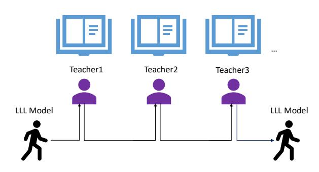

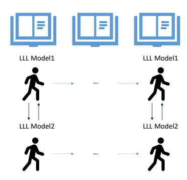

(a) Lifelong Learning with Normal Knowledge Distillation.

(b) Lifelong Learning with Mutual Distillation.

Figure 1: Comparison between L2KD and L4: L2KD relies on domain-specific teachers, while L4 introduces peer-to-peer distillation, enhancing flexibility and performance.

Our key contributions are as follows:

- We introduce a novel mutual learning mechanism into the lifelong language learning paradigm, enabling models to collaborate and enhance each other knowledge without relying on predefined domain teachers.
- We demonstrate through extensive experiments that our method not only mitigates forgetting, but also achieves performance that rivals or even surpasses most baseline methods on standard benchmark datasets, showcasing robustness across diverse tasks.

## 2 Related Work

Lifelong Language Learning. Catastrophic forgetting is a major challenge in Lifelong Language Learning (LLL), particularly in NLP. One of the pioneering methods, *LAMOL* [\(Sun et al.,](#page-8-2) [2019\)](#page-8-2), used generative replay to alleviate forgetting by using language models to generate data from previous tasks, avoiding the need for stored samples. Building on this, *L2KD* introduced domain teacher distillation, using pre-trained models to guide learning and further enhance performance by incorporating domain-specific knowledge [\(Chuang](#page-7-2) [et al.,](#page-7-2) [2020\)](#page-7-2). Recently, with increasing attention to large language models, some studies have explored the performance of lifelong learning in such models [\(Zheng et al.,](#page-8-6) [2025\)](#page-8-6). Some works [\(Wang and Li,](#page-8-7) [2024;](#page-8-7) [Yang et al.,](#page-8-8) [2024\)](#page-8-8) propose using Mixture-of-Experts (MOE) models in lifelong learning scenarios, leveraging multiple experts to store knowledge from different tasks, which can effectively alleviate the problem of catastrophic forgetting. Other

works [\(Gao et al.,](#page-8-9) [2024\)](#page-8-9) suggest that large language models can enhance their ability to resist forgetting by retrieving task-relevant knowledge, thus improving performance in lifelong learning settings.

However, most of these methods rely on domainspecific teachers, specific model architectures (*e.g.,* MOE) or require storing knowledge repositories from past tasks, limiting their flexibility in broader applications. Our method focuses on more general scenarios and language models, aiming to improve the performance of lifelong learning systems without storing past task samples or relying on domainspecific teachers.

### Knowledge Distillation and Mutual Learning.

Knowledge distillation has been widely explored in lifelong learning, mainly in computer vision. Methods such as *Learning without Forgetting (LwF)* [\(Li](#page-8-10) [and Hoiem,](#page-8-10) [2017\)](#page-8-10), *Generative Replay with Distillation* [\(Shin et al.,](#page-8-5) [2017\)](#page-8-5), *Replay-through-Feedback (RtF)* [\(Van de Ven and Tolias,](#page-8-11) [2018\)](#page-8-11), and *Lifelong GAN* [\(Zhai et al.,](#page-8-12) [2019\)](#page-8-12) have successfully applied distillation to retain knowledge over time. More recent work [\(Cha et al.,](#page-7-3) [2021\)](#page-7-3) has explored contrastive continual learning. However, most efforts focus on computer vision, with little exploration in NLP. Moreover, mutual learning, where student models learn from each other, has shown promising results, outperforming traditional teacher-student setups [\(Zhang et al.,](#page-8-13) [2018\)](#page-8-13).

## 3 Method

#### 3.1 LAMOL

The training objective of normal language modeling is to minimize the negative log likelihood

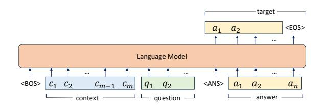

(a) Question answering (QA). Lifelong model is trained to solve target task.

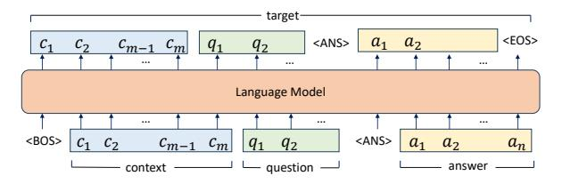

(b) Language modeling (LM). Lifelong model is trained to generate pseudo data.

Figure 2: Illustration of QA and LM learning architectures.

(NLL) of the model predicting the next word:

$$L_{NLL} = -\sum_{t=t_0}^{T} \log(P(x_t|x_{< t};\theta)), \qquad (1)$$

where  $x_t$  represents the t-th word in the sentence,  $x_{< t}$  represents all words before  $x_t$ , and  $\theta$  is a parameter of the language model.

Typically, language datasets comprise three components: context, question, and answer. In conventional training, the model generates the correct answer based on the context and question provided, as shown in Figure 2(a). Formally, the supervised training loss is represented as follows:

$$L_{NLL}^{QA} = L_{NLL}(X; \theta; t_0 = a_1),$$
 (2)

where  $a_1$  is the first token of the answer text.

However, the direct application of the aforementioned supervised loss for training often leads to catastrophic forgetting under non-stationary data stream settings. To better adapt to the continual learning scenario, *LAMOL* introduces an innovative strategy that mitigates forgetting by generating pseudo-samples from previous tasks and concurrently training them with new tasks, thereby eliminating the need to store old task data. Specifically, the model not only generates answers for a given question but also learns to model the entire training sample simultaneously, as illustrated in Figure 2(b). Formally, to equip the model with the ability to generate pseudo training samples for each token,

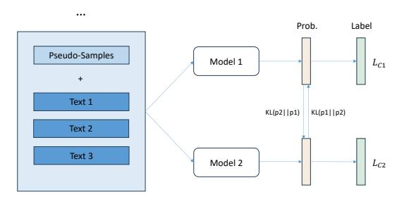

Figure 3: Illustration of our L4 framework. While a new task is arriving, we train two models in parallel with mutual learning on both the pseudo-samples generated from past tasks and the data from the current task, and employ cross-entropy loss to optimize the prediction of each model, thereby enabling the models to enhance each other performance mutually.

including content, questions, and answers, the training loss is designed as follows:

$$L_{NLL}^{LM} = L_{NLL}(X; \theta; t_0 = 0),$$
 (3)

which is computed from the first token.

This approach enables the LLL model to effectively generate pseudo-samples from past tasks for joint training with samples from the current task. Given that *LAMOL* outperforms memory-based methods such as those proposed by (Lopez-Paz and Ranzato, 2017) and (Yogatama et al., 2019), as well as regularization-based methods, we build on its foundation by applying our **L4** algorithm to further enhance its performance.

#### 3.2 Knowledge Distillation

**Vanilla KD.** In traditional knowledge distillation, the cross-entropy between the output distributions of the student and teacher models is minimized, particularly when predicting the next word in a sequence:

$$L_{KD}(x; \theta_S, \theta_T) = \sum_{t,k} -P(y_k|x_{1:t-1}; \theta_T) \log P(y_k|x_{1:t-1}; \theta_S),$$

where  $x_{1:t-1}$  is the input sequence up to time step t-1, and  $y_k$  represents the k-th word in the vocabulary. Here,  $\theta_{S_1}$  and  $\theta_{S_2}$  are the parameters of the student and teacher models, respectively. By learning from these soft targets, the student model can capture nuanced patterns and generalize better, leading to more efficient knowledge transfer.

Further, we obtain two different word-level distillation losses based on the starting token position of the loss calculation, just as Equations 2 and 3:

$$L_{KD}^{QA} = L_{KD}(X; \theta; t_0 = a_0)$$

$$L_{KD}^{LM} = L_{KD}(X; \theta; t_0 = 0).$$
(4)

**Mutual Learning.** In mutual learning, we typically consider two models,  $\theta_1$  and  $\theta_2$ , initialized identically. We train models on the data (x,y) using two components: cross-entropy loss, which aligns their predictions with the true labels, and distillation loss, which aligns their outputs with each other. With denoting  $p_1 := p(\hat{y}_1|X;\theta_1)$  and  $p_2 := p(\hat{y}_2|X;\theta_2)$ , the cross-entropy losses for the models are defined as:

$$L_{C_1} = -\log(p_1(\hat{y}_1 = y))$$

$$L_{C_2} = -\log(p_2(\hat{y}_2 = y)).$$
(5)

Moreover, mutual learning framework incorporates a Kullback-Leibler (KL) divergence loss  $D_{KL}$  to ensure that both models learn from each other. Following (Zhang et al., 2018), the final loss functions for both models are a combination of crossentropy loss and distillation loss:

$$L_1 = L_{C_1} + \lambda * D_{KL}(p_2||p_1)$$
  

$$L_2 = L_{C_2} + \lambda * D_{KL}(p_1||p_2).$$
(6)

By iteratively training the models with these combined loss functions, both models benefit from each other predictions, allowing them to achieve better performance without the need for a pretrained teacher.

#### 3.3 L4

In previous studies, distillation was generally applied directly to the lifelong learning setting, requiring the training of a separate teacher model for each task. This approach is often difficult to implement in data flow settings. To avoid the need for pre-training a teacher model while still achieving or surpassing the performance of simple distillation, we introduce mutual learning into lifelong learning for the first time and our architecture is shown in Figure 3. Using another network  $\theta_{S_2}$  with the same initialization, the two models  $\theta_{S_1}$  and  $\theta_{S_2}$  can learn from each other, improving performance while avoiding the need for a separately trained teacher model.

To introduce mutual learning in lifelong learning, we combine supervised loss and distillation loss. Firstly, by combining QA loss (2) and LM loss (3) on the current task in the following way,

we can obtain supervised losses for both models separately:

$$L_{C1} = L_{NLL}^{QA}(X_0; \theta_{S_1}) + L_{NLL}^{LM}(X_0; \theta_{S_1})$$

$$L_{C2} = L_{NLL}^{QA}(X_0; \theta_{S_2}) + L_{NLL}^{LM}(X_0; \theta_{S_2}).$$
(7)

Furthermore, as before, we define distillation losses based on QA and LM separately and then obtain the distillation losses of two models:

$$L_{KD1} = L_{KD1}^{QA} + L_{KD1}^{LM}$$

$$L_{KD2} = L_{KD2}^{QA} + L_{KD2}^{LM}.$$
(8)

Finally, we obtained the required training loss on a single task:

$$L_{\theta_{S_1}} = L_{C1}(X_0; \theta_{S_1}) + \lambda \cdot L_{KD1}(X_0; \theta_{S_1}) L_{\theta_{S_2}} = L_{C2}(X_0; \theta_{S_2}) + \lambda \cdot L_{KD2}(X_0; \theta_{S_2}),$$
(9)

where  $\lambda$  is the trade-off hyperparameters.

In the tasks that arrived later, we need to adjust the losses to mitigate the Catastrophic Forgetting. In order to avoid interference between the supervised loss and the distillation loss under the lifelong learning setting, supervised loss is applied only to the generated pseudo-samples, while distillation loss is applied to the samples from the current task. Similarly, by combining QA and LM losses in the following way, we can obtain the supervised losses of these two models separately. Note that we only calculate this loss on past pseudo samples:

$$L_{past}(X^{past}; \theta_{S_1})$$

$$= L_{past}^{QA}(X^{past}; \theta_{S_1}) + L_{past}^{LM}(X^{past}; \theta_{S_1})$$

$$L_{past}(X^{past}; \theta_{S_2})$$

$$= L_{past}^{QA}(X^{past}; \theta_{S_2}) + L_{past}^{LM}(X^{past}; \theta_{S_2}).$$
(10)

In addition, as mentioned earlier, we define the distillation losses on the basis of QA and LM, respectively. Here we can obtain the distillation losses of two models separately, and we only calculate this loss on the current task sample:

$$L_{cur}(X^{cur}; \theta_{S_1}) = L_{cur}^{QA}(X^{cur}; \theta_{S_1}) + L_{cur}^{LM}(X^{cur}; \theta_{S_1})$$
$$L_{cur}(X^{cur}; \theta_{S_2}) = L_{cur}^{QA}(X^{cur}; \theta_{S_2}) + L_{cur}^{LM}(X^{cur}; \theta_{S_2})$$
(11)

In the end, the respective losses and update methods for the two models are obtained as follows:

$$L_{\theta_{S_1}} = L_{past}(X^{past}; \theta_{S_1}) + \lambda \cdot L_{cur}(X^{cur}; \theta_{S_1})$$

$$L_{\theta_{S_2}} = L_{past}(X^{past}; \theta_{S_2}) + \lambda \cdot L_{cur}(X^{cur}; \theta_{S_2}).$$
(12)

In this way, both models can learn to correctly predict the true labels of the training instances while matching the probability estimates of their peer model.

|          | woz  | CNN  | SQL  | ACC  | CNN  | SQL  | woz  | ACC  | SQL  | woz  | CNN  | ACC  |
|----------|------|------|------|------|------|------|------|------|------|------|------|------|
| Finetune | 0.0  | 26.3 | 64.3 | 30.2 | 6.8  | 2.1  | 84.6 | 31.2 | 0.0  | 0.1  | 26.0 | 8.7  |
| LAMOL    | 67.6 | 27.3 | 62.5 | 52.4 | 27.8 | 60.8 | 83.0 | 57.2 | 55.0 | 76.1 | 26.0 | 52.4 |
| L2KD*    | 82.4 | 27.6 | 65.0 | 58.3 | 27.5 | 63.2 | 86.1 | 59.0 | 59.6 | 79.5 | 26.2 | 55.1 |
| L4       | 84.6 | 28.9 | 63.9 | 59.1 | 21.7 | 61.6 | 87.4 | 56.9 | 54.0 | 83.5 | 26.4 | 54.6 |
|          | woz  | SQL  | CNN  | ACC  | CNN  | woz  | SQL  | ACC  | SQL  | CNN  | woz  | ACC  |
| Finetune | 0.0  | 0.0  | 25.8 | 8.6  | 24.5 | 3.6  | 64.0 | 30.7 | 0.0  | 7.3  | 85.0 | 30.8 |
| LAMOL    | 76.1 | 59.3 | 26.3 | 53.9 | 27.3 | 79.8 | 64.1 | 57.0 | 58.7 | 27.2 | 84.0 | 56.6 |
| L2KD*    | 81.4 | 59.6 | 26.7 | 55.9 | 28.6 | 83.7 | 64.8 | 59.0 | 58.8 | 26.2 | 84.7 | 56.6 |
| L4       | 83.7 | 56.7 | 26.7 | 55.7 | 27.7 | 86.2 | 62.0 | 58.6 | 51.1 | 27.2 | 88.9 | 55.8 |

Table 1: Experimental results with different lifelong learning orders on MultiWOZ (WOZ), CNN/DailyMail (CNN), and WikiSQL (SQL). The order of datasets presented in the table corresponds to the order in which the tasks are fed forward to the model. "\*" represents the method using pretrained teacher models. **Bold** values indicate the best scores for each category.

#### 3.3.1 Optimization

We implement a mutual learning strategy throughout the entire training process, executing it at each epoch. In every epoch, the predictions of the two models are calculated separately, and the parameters of both networks are iteratively updated based on the predictions of the other model until convergence. The optimization process is described in the Algorithm 1 (Appendix A).

#### 4 Experiments & Results

### 4.1 Evaluation Measures

Table 4 (Appendix A) summarizes the evaluation measures used in this study: dsEM (Dialog State Exact Match), ROUGE (Recall-Oriented Understudy for Gisting Evaluation) (Lin, 2004), IfEM (Interaction-Level Exact Match) (Zhong et al., 2017) and Forgetting Metric (Chaudhry et al., 2018).

The dsEM evaluates dialogue systems by checking if the predicted dialogue state  $\hat{y}_i$  exactly matches the ground truth  $y_i$  across all intents and slots:

$$dsEM = \frac{\sum_{i=1}^{N} \mathbb{1}(\hat{y}_i = y_i)}{N},$$
 (13)

where N is the total number of dialogue states.

ROUGE measures summarization quality by assessing *n*-gram overlap between generated and reference summaries:

$$ROUGE_n = \frac{A}{B}, \tag{14}$$

where A is the overlap of n-grams and B is the total number of n-grams in the reference summaries.

The IfEM evaluates query generation tasks by checking if the predicted query  $\hat{Q}_i$  matches the

| Method                  | E2E  | REST | HOT  | TV   | LAPTOP | AVG  |
|-------------------------|------|------|------|------|--------|------|
| Single OA    | 48.8 | 64.0 | 65.4 | 70.8 | 73.0   | 64.4 |
| Single QA+LM | 48.8 | 64.2 | 65.5 | 71.0 | 72.8   | 64.5 |
| Multi OA     | 49.2 | 65.6 | 67.2 | 72.7 | 74.8   | 65.9 |
| Multi QA+LM  | 49.5 | 65.2 | 66.7 | 73.4 | 74.6   | 65.9 |
| LAPTOP-TV-HOT-REST-E2E  |      |      |      |      |        |      |
| LAMOL                   | 50.1 | 58.7 | 61.5 | 73.7 | 72.0   | 63.2 |
| L2KD*                   | 44.9 | 60.0 | 62.8 | 76.7 | 73.3   | 63.5 |
| L4                      | 53.5 | 66.4 | 68.1 | 71.5 | 72.4   | 66.4 |
| E2E-REST-HOT-TV-LAPTOP  |      |      |      |      |        |      |
| LAMOL                   | 49.8 | 65.0 | 65.9 | 75.8 | 77.0   | 66.7 |
| L2KD*                   | 49.3 | 67.6 | 68.7 | 76.8 | 77.7   | 68.0 |
| L4                      | 49.2 | 54.5 | 50.9 | 77.5 | 78.6   | 62.1 |

Table 2: Experimental results across five domains for lifelong learning tasks in two training orders: most difficult to simplest (LAPTOP  $\rightarrow$  E2E) and simplest to most difficult (E2E  $\rightarrow$  LAPTOP). " \* " represents the method using pretrained teacher models. **Bold** values indicate the best scores.

ground truth  $Q_i$ :

IfEM = 
$$\frac{\sum_{i=1}^{M} \mathbb{1}(\hat{Q}_i = Q_i)}{M}$$
, (15)

where M is the total number of interactions.

The Forgetting Metric(FM) is used to measure a model's ability to alleviate forgetting in lifelong learning. Formally, the forgetting measure of the model on the i-th task is the difference between the model's highest performance a on that task and its final performance a on the task after training on all the k tasks:

$$f_i = \max_{i=1,\dots,k} a_i - a_k.$$
 (16)

Then the Average Forgetting can be calculated as follows:

$$FM = \frac{1}{k-1} \sum_{i=1}^{k} f_i.$$
 (17)

#### 4.2 Dataset

To evaluate the effectiveness of our approach in mitigating catastrophic forgetting, we performed experiments using a dataset (more details can be seen in Table 4 (Appendix A)) spanning three distinct domains: MultiWOZ (WOZ), CNN/DailyMail (CNN), and WikiSQL (SQL). WikiSQL is a dataset designed for developing natural language interfaces for relational databases, where models generate structured queries from natural language inputs. CNN/DailyMail comprises a collection of online news articles aimed at text summarization tasks. MultiWOZ is a multi-domain wizard-of-oz dataset tailored for task-oriented dialogue modeling, where models are required to generate semantic state sequences based on partial dialogues.

|                    | Finetune | LAMOL | L2KD | L4 Student 1 | L4 Student 2 |
|--------------------|----------|-------|------|-------------------------|-------------------------|
| WOZ                | 85.5     | 6.0   | 5.3  | 3.3                     | 2.9                     |
| SQL                | 62.7     | 4.2   | 4.8  | 4.9                     | 3.1                     |
| Average Forgetting | 74.1     | 5.1   | 5.1  | 4.1                     | 3.0                     |

Table 3: Forgetting metric (lower is better) under the WOZ-SQL-CNN order in Lifelong Learning.

Following methodologies similar to LAMOL (Sun et al., 2019) and L2KD (Chuang et al., 2020), we performed sequential training on these datasets, utilizing generative replay.

However, in real-world scenarios, lifelong learning models are more commonly trained to solve tasks in different domains of the same problem, which evolve over time. To simulate this, we also performed experiments on natural language generation (NLG) datasets across five domains. These include the E2E-NLG dataset (Novikova et al., 2017), which focuses on end-to-end natural language generation in the restaurant industry, and RNNLG (Wen et al., 2015), a dataset tailored for spoken dialogue systems. RNNLG consists of four domains: San Francisco restaurant search (REST), San Francisco hotel search (HOT), television sale/search (TV), and laptop sale/search (LAPTOP). To maintain balance across domains, we use the complete datasets for the first three domains and a reduced dataset for the laptop domain.

### 4.3 Experimental Setup

Our approach employs the L2KD implementation to ensure comparable results. For our experiments, we used the same pre-trained small GPT-2 model (Radford et al., 2019) across all Lifelong Learning (LLL) models. Following the methodology of L2KD (Chuang et al., 2020), the GPT-2 model was fine-tuned for 9 epochs on each dataset, and we used task-specific tokens as [bos] tokens and set the pseudo-data sampling rate to 0.2. The following evaluation measures used in this study: dsEM (Dialog State Exact Match), ROUGE (Recall-Oriented Understudy for Gisting Evaluation) (Lin, 2004), IfEM (Interaction-Level Exact Match) (Zhong et al., 2017) and Forgetting Metric (Chaudhry et al., 2018).

#### 4.4 Results

In this subsection, we present and analyze our experimental results. We evaluated the effectiveness of our method across two main settings: different sequence generation tasks and the same task applied across varying domains. These settings were specifically designed to test the robustness of our proposed approach in mitigating catastrophic for-

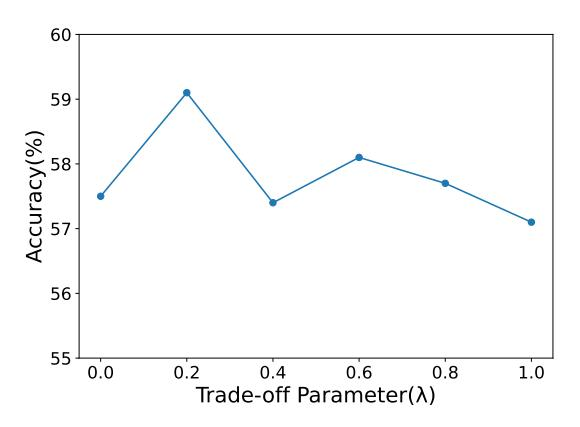

Figure 4: Performance variant with the trade-off parameter  $\lambda$  under the WOZ-CNN-SQL order.

getting, a key challenge in lifelong learning. All results have been subjected to significance testing.

### **4.4.1** Results for Sequence Generation Tasks

For the sequence generation experiments, we performed lifelong learning on three diverse datasets: WikiSQL (SQL), CNN/DailyMail (CNN), and MultiWOZ (WOZ). These datasets were selected to represent different types of sequence generation tasks, including structured query generation, summarization, and task-oriented dialogue. We trained the models using various permutation orders and evaluated their performance at the end of each training stream. The results, as shown in Table 1, report the average scores for the three tasks, with normalized values ranging from 0 to 100 for a fair comparison. The performance of L4 shown in the Table 1 comes from the Student 1 model.

As observed in Table 1, fine-tuning the model directly leads to severe forgetting of tasks learned earlier in the sequence. In contrast, both LAMOL and L2KD demonstrate a strong ability to mitigate catastrophic forgetting. However, the experimental results highlight that our proposed method consistently matches and in many cases surpasses the performance of both LAMOL and L2KD, especially in scenarios where the task order was challenging. More importantly, for models that utilize pre-trained teachers (marked with an asterisk), our model is also able to achieve comparable performance. This shows that L4 is particularly effective in retaining knowledge and adapting to new tasks without compromising past learning.

#### 4.4.2 Results for Different Domains

To further validate the generalizability of our approach, we test in different domains under the same task conditions. Specifically, we conducted experi-

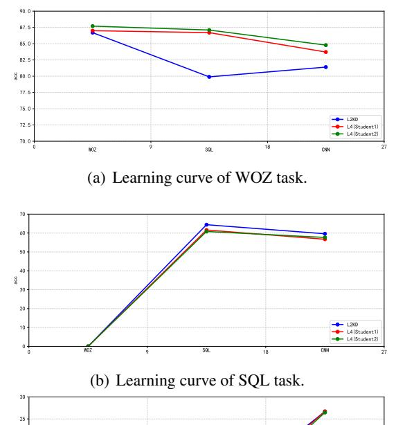

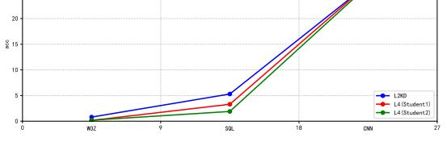

(c) Learning curve of CNN task.

Figure 5: Learning curves of different methods during training in the order of WOZ-SQL-CNN.

ments on five distinct domains, including four subdomains from E2E-NLG to RNNLG, which span different language generation contexts. As shown in Table [2,](#page-4-1) we provide results for two training settings: one in which tasks are ordered from the most difficult to the simplest (left → right), and the other in reverse order (right → left), in order to analyze the impact of task difficulty on lifelong learning performance. The performance of L4 shown in the Table [2](#page-4-1) comes from the Student 1 model.

The results indicate that our method consistently achieves high performance in both settings, matching or surpassing the results of LAMOL and L2KD. In particular, in the left → right setting, where tasks progress from the most difficult to the simplest, our approach shows a clear advantage, demonstrating the robustness of L4 in challenging environments. Under this setting, our method even significantly outperforms the training approaches that use pretrained teachers. This suggests that our method is capable of handling domain variations while effectively mitigating catastrophic forgetting, making it a versatile solution for lifelong language learning in multiple domains.

### 4.5 Ablation Study

Average Forgetting. To verify whether our method can truly alleviate the forgetting phenomenon in lifelong language learning, we present the forgetting metrics of the first two tasks and the average forgetting after model training under the task sequence WOZ-SQL-CNN in the Table [3.](#page-5-0) Experimental results demonstrate that both student models trained with our method show fewer forgetting compared to traditional baselines, effectively mitigating catastrophic forgetting. More detailed performance variations of different methods during training can be found in the Appendix [A.](#page-9-1)

Trade-off Parameter λ. As shown in the Figure [4,](#page-5-1) to further analyze the impact of the hyperparameter λ on the performance of the lifelong learning model, we conducted experiments with different settings of λ in the range from 0.0 to 1.0, and present the results for Student 1. The experimental results indicate that when λ is set to 0.2, our model achieves the best performance, suggesting a good balance between the supervised learning loss and the mutual learning loss at this point.

Learning Curves. To more intuitively compare the differences between our method and other strong baseline approaches, we plot the learning curves for L2KD and our method. As shown in the Figure [5,](#page-6-0) our method demonstrates a better ability to prevent forgetting. For example, on the WOZ task in the Figure [5\(a\),](#page-6-1) the performance of L2KD significantly degrades as training progresses, while our method effectively maintains its original performance. Through this ablation study, we observe that our method successfully alleviates the forgetting phenomenon during training, reducing the performance drop on previous tasks when adapted to new ones.

## 5 Conclusion

We proposed L4, a lifelong language learning algorithm that utilizes mutual learning, which enhances the performance of lifelong language models without requiring pre-trained teacher models. By allowing dynamic knowledge transfer between models, our approach eliminates the need for pre-trained teachers, reducing both the computational overhead and training time. Our experimental results across various tasks and domains demonstrate that our approach achieves strong performance in mitigating catastrophic forgetting, making it a robust and efficient solution for lifelong learning.

## Limitations

As part of our limitations, our aim is to optimize the memory efficiency of mutual learning, making it more suitable for deployment in memoryconstrained environments such as mobile and embedded systems. Furthermore, while our approach improves model performance, it does not explicitly address concerns related to fairness or bias, critical factors in real-world applications. Future research should explore the integration of fairnessbased mechanisms to ensure both accuracy and equity in lifelong learning models, preventing unintended biases from influencing model outputs. Moreover, exploring how L4 can be applied to different modalities (*e.g.,* reinforcement learning or speech processing) will help to assess its generalizability and unlock its potential for broader crossdomain applications. In addition, our goal is to explore methods that enhance the model's ability to retain task-specific knowledge through sequential edits. Moreover, due to limited computing resources, we are currently only able to train the mutual learning algorithm on GPT-2.

Our method demonstrates clear advantages in mitigating catastrophic forgetting, there are several limitations that must be acknowledged. First, mutual learning, although effective, can require significantly more memory and computational resources, especially during training, as multiple models must be trained simultaneously. This could present a challenge in memory-limited environments or when scaling the model for larger datasets. Second, the effectiveness of our approach relies on well-defined tasks and sufficient data for each task. In real-world, where data may be scarce or noisy, the performance of mutual learning and lifelong language learning methods may be degraded.

Moreover, while our method generalizes well in certain NLP tasks, its applicability to more complex, cross-domain learning scenarios remains to be fully explored. Lastly, our experiments have focused mainly on benchmarking tasks in NLP, and the effectiveness of the method in other domains, for example, reinforcement learning or speech processing, remains untested. Future work should explore the adaptability of our approach across different modalities and consider optimizing its computational efficiency for practical deployment. Furthermore, robustness to noisy and low-resource settings requires further experimentation to confirm its general applicability.

## Ethical Statement & Bias

Our work uses publicly available datasets, which can inherently contain biases, such as underrepresentation of certain demographic groups or skewed language patterns. Models trained on these datasets could unintentionally perpetuate these biases, leading to unfair or harmful outcomes in real-world applications. For example, in automated decision making or conversational agents, biased predictions may disproportionately affect certain groups or reinforce harmful stereotypes.

The risks are particularly significant in sensitive domains such as healthcare, recruitment, or law enforcement, where biased results could have profound ethical and social implications. To mitigate these risks, developers and users of these models must take proactive steps to assess fairness and address bias in both the data and the predictions of the model. Future work should incorporate fairnesssensitive learning objectives into mutual learning frameworks, ensuring that the models are effective and impartial. This may involve applying debiasing techniques during training or employing post hoc methods to identify and correct biases in output. In addition, interpretability techniques should be utilized to ensure transparent and equitable decision making in diverse applications.

## References

Hyuntak Cha, Jaeho Lee, and Jinwoo Shin. 2021. Co2l: Contrastive continual learning. In *Proceedings of the IEEE/CVF International conference on computer vision*, pages 9516–9525.

Arslan Chaudhry, Puneet K Dokania, Thalaiyasingam Ajanthan, and Philip HS Torr. 2018. Riemannian walk for incremental learning: Understanding forgetting and intransigence. In *Proceedings of the European conference on computer vision (ECCV)*, pages 532–547.

Zhiyuan Chen, Nianzu Ma, and Bing Liu. 2018. Lifelong learning for sentiment classification. *arXiv preprint arXiv:1801.02808*.

Yung-Sung Chuang, Shang-Yu Su, and Yun-Nung Chen. 2020. [Lifelong language knowledge distillation.](https://doi.org/10.18653/v1/2020.emnlp-main.233) In *Proceedings of the 2020 Conference on Empirical Methods in Natural Language Processing (EMNLP)*, pages 2914–2924, Online. Association for Computational Linguistics.

Matthias De Lange, Rahaf Aljundi, Marc Masana, Sarah Parisot, Xu Jia, Aleš Leonardis, Gregory Slabaugh, and Tinne Tuytelaars. 2021. A continual learning survey: Defying forgetting in classification tasks. *IEEE*

- *transactions on pattern analysis and machine intelligence*, 44(7):3366–3385.
- Jinglong Gao, Xiao Ding, Yiming Cui, Jianbai Zhao, Hepeng Wang, Ting Liu, and Bing Qin. 2024. Selfevolving gpt: A lifelong autonomous experiential learner. *arXiv preprint arXiv:2407.08937*.
- Ian J Goodfellow, Mehdi Mirza, Da Xiao, Aaron Courville, and Yoshua Bengio. 2013. An empirical investigation of catastrophic forgetting in gradient-based neural networks. *arXiv preprint arXiv:1312.6211*.
- Geoffrey Hinton. 2015. Distilling the knowledge in a neural network. *arXiv preprint arXiv:1503.02531*.
- Jiyong Li, Dilshod Azizov, LI Yang, and Shangsong Liang. 2024. Contrastive continual learning with importance sampling and prototype-instance relation distillation. In *Proceedings of the AAAI Conference on Artificial Intelligence*, pages 13554–13562.
- Zhizhong Li and Derek Hoiem. 2017. Learning without forgetting. *IEEE transactions on pattern analysis and machine intelligence*, 40(12):2935–2947.
- Chin-Yew Lin. 2004. Rouge: A package for automatic evaluation of summaries. In *Text summarization branches out*, pages 74–81.
- David Lopez-Paz and Marc'Aurelio Ranzato. 2017. Gradient episodic memory for continual learning. *Advances in neural information processing systems*, 30.
- Jekaterina Novikova, Ondˇrej Dušek, and Verena Rieser. 2017. The e2e dataset: New challenges for end-toend generation. *arXiv preprint arXiv:1706.09254*.
- German I Parisi, Ronald Kemker, Jose L Part, Christopher Kanan, and Stefan Wermter. 2019. Continual lifelong learning with neural networks: A review. *Neural networks*, 113:54–71.
- Alec Radford, Jeffrey Wu, Rewon Child, David Luan, Dario Amodei, and Ilya Sutskever. 2019. Language models are unsupervised multitask learners. *OpenAI Blog*, 1(8):9.
- Hanul Shin, Jung Kwon Lee, Jaehong Kim, and Jiwon Kim. 2017. Continual learning with deep generative replay. *Advances in neural information processing systems*, 30.
- Fan-Keng Sun, Cheng-Hao Ho, and Hung-Yi Lee. 2019. Lamol: Language modeling for lifelong language learning. *arXiv preprint arXiv:1909.03329*.
- Gido M Van de Ven and Andreas S Tolias. 2018. Generative replay with feedback connections as a general strategy for continual learning. *arXiv preprint arXiv:1809.10635*.
- Renzhi Wang and Piji Li. 2024. Lemoe: Advanced mixture of experts adaptor for lifelong model editing of large language models. *arXiv preprint arXiv:2406.20030*.

- Tsung-Hsien Wen, Milica Gasic, Nikola Mrksic, Pei-Hao Su, David Vandyke, and Steve Young. 2015. Semantically conditioned lstm-based natural language generation for spoken dialogue systems. *arXiv preprint arXiv:1508.01745*.
- Shu Yang, Muhammad Asif Ali, Cheng-Long Wang, Lijie Hu, and Di Wang. 2024. Moral: Moe augmented lora for llms' lifelong learning. *arXiv preprint arXiv:2402.11260*.
- Dani Yogatama, Cyprien de Masson d'Autume, Jerome Connor, Tomas Kocisky, Mike Chrzanowski, Lingpeng Kong, Angeliki Lazaridou, Wang Ling, Lei Yu, Chris Dyer, et al. 2019. Learning and evaluating general linguistic intelligence. *arXiv preprint arXiv:1901.11373*.
- Mengyao Zhai, Lei Chen, Frederick Tung, Jiawei He, Megha Nawhal, and Greg Mori. 2019. Lifelong gan: Continual learning for conditional image generation. In *Proceedings of the IEEE/CVF international conference on computer vision*, pages 2759–2768.
- Ying Zhang, Tao Xiang, Timothy M Hospedales, and Huchuan Lu. 2018. Deep mutual learning. In *Proceedings of the IEEE conference on computer vision and pattern recognition*, pages 4320–4328.
- Junhao Zheng, Shengjie Qiu, Chengming Shi, and Qianli Ma. 2025. Towards lifelong learning of large language models: A survey. *ACM Computing Surveys*, 57(8):1–35.
- Victor Zhong, Caiming Xiong, and Richard Socher. 2017. Seq2sql: Generating structured queries from natural language using reinforcement learning. *arXiv preprint arXiv:1709.00103*.

### **Appendix**

### A Additional Experiments.

#### Performance Changes during Training Process.

To more intuitively demonstrate performance during training, we present in the Figure 6 a line graph showing the model's performance at different training stages. Through this analysis experiment, we can observe that our method effectively alleviates the phenomenon of forgetting during the training process, reduces the performance drop on previous tasks when adapting to new ones, and successfully retains the textual knowledge acquired during previous training.

Comparison between L4 Models. To verify that the mutual learning method in continual learning is effective, we further need to confirm that the models trained through mutual learning are not entirely identical, in order to demonstrate that our method does not lead to the problem of model collapse. As shown in Table 6, the models trained using the mutual learning framework exhibit different performances in various settings. This indicates that, although their performances are relatively close, they have learned a wide range of knowledge, which enables them to improve each other's performance through mutual learning.

Comparison Between Models with Different Parameter Sizes. To further explore the upper bound of our method, we aim to verify the performance difference between training two models with smaller parameter sizes using mutual learning and training a single model with a larger parameter size using conventional continual learning methods. To this end, we compare the L4 framework trained on two smaller GPT-2-S models with the LAMOL framework trained on a GPT-2-M model with nearly double the number of parameters.

As shown in the Table 5, training with a model that has more parameters generally achieves better performance than improving multiple smaller models through mutual learning. This result suggests that larger-parameter models may have better resistance to forgetting compared to ensembles of smaller models. However, in many practical scenarios, pre-trained large-parameter models may not always be available. In such cases, our mutual learning approach can help train smaller models to achieve better results.

Computational Resources Analysis. To further analyze the resource consumption of our algo-

| Dataset        | <b>Evaluation Measures</b> | Train | Test   |
|----------------|----------------------------|-------|--------|
| MultiWOZ       | dsEM                       | 2,536 | 1,646  |
| CNN/DailyMail  | ROUGE                      | 6,604 | 2,250  |
| WikiSQL        | IfEM                       | 6,525 | 15,878 |
| E2E NLG        |                            | 6,000 | 2,000  |
| RNNLG (REST)   |                            | 6,228 | 1,039  |
| RNNLG (HOT)    | ROUGE                      | 6,446 | 1,075  |
| RNNLG (TV)     |                            | 8,442 | 1,407  |
| RNNLG (LAPTOP) |                            | 7,944 | 2,649  |
|                |                            |       |        |

Table 4: Dataset details and the evaluation measures.

Algorithm 1 Mutual Learning helps Lifelong Language Learning (L4).

**Require:** Dataset  $\{D_k\}_{k=1}^K$ , model  $f_{\theta_{S_1}}$  and  $f_{\theta_{S_2}}$ , hyper-parameter  $\lambda_1$  and  $\lambda_2$ , learning rate  $\eta_1$  and  $\eta_2$ 

- 1: Initialize model parameters  $\theta_{S_1}$  and  $\theta_{S_2}$
- 2: **for** k = 1, ..., K **do**
- 3: Construct  $D_{prev}$  by sampling  $\gamma * |D_k|$  pseudo-data from  $\theta_{S_1}$
- 4: **for** epoch  $e = 1, \ldots, N$  **do**
- 5: optimize  $\theta_{S_1}$  to minimize  $L_{\theta_{S_1}}(D_{prev} \cup D_k; \theta_{S_1}, \theta_{S_2})$
- 6: optimize  $\theta_{S_2}$  to minimize  $L_{\theta_{S_2}}(D_{prev} \cup D_k; \theta_{S_2}, \theta_{S_1})$
- 7: end for
- 8: end for

|                                | woz  | CNN  | SQL  | ACC  |
|--------------------------------|------|------|------|------|
| GPT2-s+L4 Student 1 | 84.6 | 28.9 | 63.9 | 59.1 |
| GPT2-s+L4 Student 2 | 85.1 | 28.6 | 63.6 | 59.1 |
| GPT2-m+LAMOL                   | 87.2 | 30.4 | 68.5 | 62.0 |

Table 5: Ablation results on models with lifelong learning orders on MultiWOZ (WOZ), CNN/DailyMail (CNN), and WikiSQL (SQL).

rithm, we compare our method L4 with the existing pre-trained teacher distillation framework L2KD in terms of peak GPU memory usage and total training time. We primarily measure the maximum GPU memory occupied throughout the entire training process, as well as the total time required to complete training under the assumption that the teacher model can be trained in advance and in parallel. As shown in the Table 8, our method exhibits higher maximum GPU memory usage than the existing pre-trained teacher distillation framework L2KD. This is because our approach requires two models to perform mutual knowledge distilla-

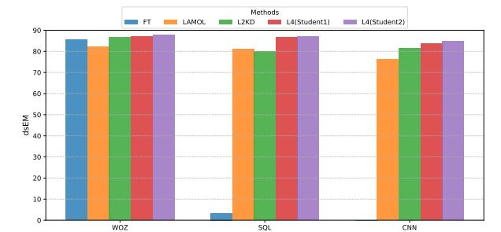

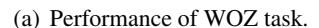

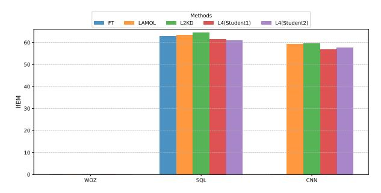

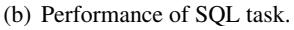

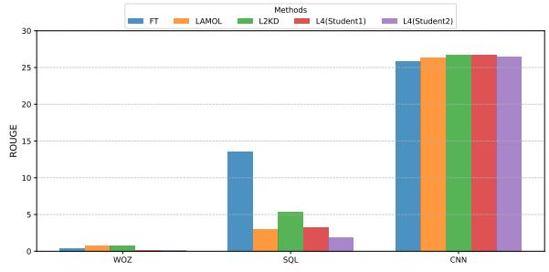

(c) Performance of CNN task.

Figure 6: The overall performance of different methods during training in the order of WOZ-SOL-CNN.

tion, whereas L2KD freezes the teacher model for inference and trains only the student model, thus consuming less GPU memory. However, L2KD inevitably requires pre-training the teacher model, making it less adaptable to certain online application scenarios. In contrast, our method, despite a larger memory footprint, achieves better adaptability to online settings. In terms of training time, our method outperforms L2KD. This advantage arises because L2KD needs to repeatedly load datasets and pre-train the teacher model, while our method can train the model online. Compared to distillation frameworks like L2KD that require a pre-trained teacher, our approach better accommodates realworld applications while maintaining a comparable total training time.

**Error Analysis.** Although our experimental results approach or even surpass baseline methods in most experimental settings, our method still under-

|                         | woz  | CNN  | SQL  | ACC  | CNN  | SQL  | woz  | ACC  | SQL  | woz   | CNN  | ACC  |
|-------------------------|------|------|------|------|------|------|------|------|------|-------|------|------|
| L4 Student 1 | 84.6 | 28.9 | 63.9 | 59.1 | 21.7 | 61.6 | 87.4 | 56.9 | 54.0 | 83.5  | 26.4 | 54.6 |
| L4 Student 2 | 85.1 | 28.6 | 63.6 | 59.1 | 21.5 | 62.1 | 87.2 | 56.9 | 53.9 | 85.6  | 26.5 | 55.3 |
|                         | woz  | SQL  | CNN  | ACC  | CNN  | woz  | SQL  | ACC  | SQL  | CNN   | woz  | ACC  |
| L4 Student 1 | 83.7 | 56.7 | 26.7 | 55.7 | 27.7 | 86.2 | 62.0 | 58.6 | 51.1 | 27.2  | 88.9 | 55.8 |
| L4 Student 2 | 848  | 57.7 | 26.5 | 563  | 27.0 | 87.2 | 61.0 | 58.7 | 50.6 | 26.17 | 88.3 | 55.0 |

Table 6: Performance comparison between Student 1 and Student 2 in the L4 Method. **Bold** values indicate the best scores for each category.

| Correct | Generation |
|---------|------------|
| COLLECT | Other anon |

- Q \_woz.en\_ how about chinese? what is the change in state?
- A food : chinese :

#### **Incorrect Generation**

- Q \_\_woz.en\_\_ the table has columns player, position, college, school, hometown, record and key words max, min, count, sum, avg, =, >, <, op, select, where, and, col, table, caption, page, section, op, cond, question, agg, aggops, condops which college has two players from the houston city hall team? what is the translation from english to sql?

- A select college from table where hometown = houston city hall

Table 7: Examples of the model generation. For the correct generation, the model generates the WOZ task's question-answer pair successfully, which helps mitigate forgetting. For the incorrect generation, the model generates examples with SQL format, which indicates that model suffers from catastrophic forgetting.

performs in certain scenarios. Here, we conduct an error analysis of our approach. Firstly, through analysis of the results of the model testing, we observed that the majority of the model responses adhered to the required formats during the answer to the test questions. Most errors stemmed from direct inaccuracies in the answers. This suggests that while our method demonstrates strong format compliance capabilities, it remains insufficient in alleviating knowledge forgetting issues. Furthermore, we present examples generated by models trained under the "WOZ-CNN-SQL" task sequence. As shown in the Table 7, there may be instances

Table 8: Comparison of peak memory usage and training time during training, where L2KD is the distillation framework using a pre-trained teacher, and L4 is our algorithmic framework based on mutual learning. Hours - hs.

|      | Peak Memory Usage | Training Time |
|------|-------------------|---------------|
| L2KD | 19.3G             | 7hs           |
| L4   | 21.2G             | 6.5hs         |

where tokens generated for the WOZ task produce outputs in SQL format. This inconsistency could lead to catastrophic forgetting, as the reduced availability of generation examples from previous tasks (*e.g.,* "WOZ") can cause the model to forget related knowledge during subsequent training phases.