# TTD-SQL: Tree-Guided Token Decoding for Efficient and Schema-Aware SQL Generation

Chetan Sharma and Kalidas Yeturu Department of Computer Science & Engineering IIT Tirupati, Tirupati, India **{cs21d501, ykalidas}@iittp.ac.in**

Ramasuri Narayanam and Soumyabrata Pal and Shiv Kumar Saini and Koyel Mukherjee Adobe Research India Bangalore, India **{rnarayanam, soumyabratap, shsaini, komukher}@adobe.com**

## Abstract

Natural language interfaces (NLIs) democratize data analytics by enabling non-technical users to query relational databases via Textto-SQL systems. While large language models (LLMs) have achieved state-of-the-art accuracy on benchmarks like Spider and BIRD, two critical challenges persist for real-time deployment: (1) inference latency due to sequential autoregressive decoding (e.g., average inference latency on BIRD (Minidev) is 14.3 seconds per query for Qwen2.5-Coder-32B and 22.86 seconds for Llama-70B.), and (2) schema hallucinations (e.g., invalid column references like customer\_ids instead of cust\_id). (2) schema hallucinations (e.g., Qwen2.5-Coder-32B Instruct generated ... COUNT(users.UserId) ... = users.Id ..., using users.Id correctly in JOIN but hallucinating users.UserId in COUNT). To address these, we propose *Tree-Guided Token Decoding (TTD-SQL)*, a lightweight framework that integrates SQL grammar and database schema constraints into the decoding process without modifying the underlying LLM. TTD precomputes token-level decision trees over SQL keywords, table names, and column identifiers, enabling deterministic "auto-fill" transitions for uniquely determined tokens (e.g., "Song\_" → "ID") while retaining flexibility for unconstrained reasoning. Across five LLMs (CodeLlama, Phi-4, Qwen2.5, Granite, Llama-70B), TTD achieves up to 19.96% token-rate speedups by eliminating redundant forward passes (e.g., CodeLlama: 8.97→10.76 tokens/s on Spider) and reduces schema hallucinations by +17.7% in executable-SQL rates (e.g., CodeLlama on BIRD). By bridging rigid parserbased methods and flexible LLM generation, TTD offers a practical path toward reliable, high-performance SQL generation in both public benchmarks and enterprise settings.

## 1 Introduction

Natural language interfaces (NLIs) to relational databases have the potential to democratize data analytics by enabling non-technical users to query datab[ases th](#page-6-0)rough conversational English [\(Liu](#page-6-0) [et al.,](#page-6-0) 2024; [Li et al.,](#page-6-1) [2024a\)](#page-6-1). Text-to-SQL systems, which translate natural language queries into executable SQL statements, are central to this vision [\(Deng et al.,](#page-6-2) [2022;](#page-6-2) [Katsogiannis-Meimarakis](#page-6-3) [and Koutrika,](#page-6-3) [2023\)](#page-6-3). Recent advances in large language models (LLMs) have pushed state-of-the[art ac](#page-7-0)curacy on b[enchmarks like S](#page-6-4)pider [\(Yu et al.,](#page-7-0) 2018) and BIRD (Li et al., 2024b). However, realtime deployment in high-stakes domains—such as finance, healthcare, and enterprise analytics—faces two persistent challenges:

- Inference Latency: Autoregressive LLMs process tokens sequentially, requiring a full forward pass per token. On BIRD Minidev, Qwen2.5-Coder-32B and Llama-3.3- 70B-Instruct take 14.3s and 22.86s per query under autoregressive decoding (AR), respectively. Such delays hinder applications like conversational assistants or real-time dashboards.
- Schema Hallucinations: Models often generate invalid SQL constructs (e.g., Qwen2.5-Coder-32B Instruct generated ... COUNT(users.UserId) ... = users.Id ..., using users.Id correctly in JOIN but hallucinating users.UserId in COUNT.), leading to incorrect data retrieval. These errors undermine trust in NLIs, particularly in regulated domains where schema validity is critical (e.g., financial reporting, clinical databases).

<span id="page-1-0"></span>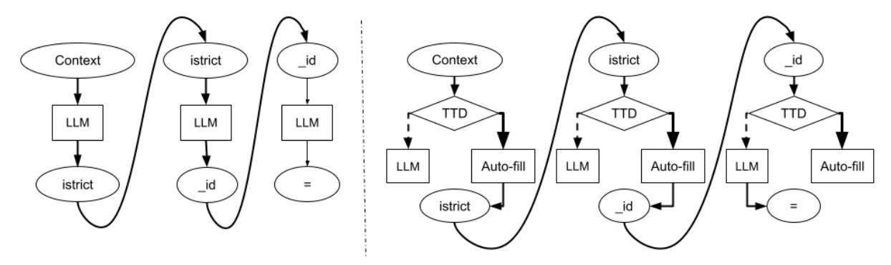

Figure 1: Overview of TTD. Left: Autoregressive decoding requires 3 forward passes for tokens "istrict", "\_id", and "=" (sequential processing). Right: TTD deterministically auto-fills "istrict" and "\_id" via precomputed schema trees (solid lines), eliminating redundant LLM calls. For ambiguous tokens like "=", TTD reverts to standard autoregressive generation (dashed line).

Existing solutions trade off between efficiency and correctness. Grammar-constrained decoding methods [\(Ugare et al.,](#page-6-5) [2024;](#page-6-5) [Torsten Scholak,](#page-6-6) [2021\)](#page-6-6) eliminate invalid generations but incur parser overhead. Schema linking [\(Wang et al.,](#page-6-7) [2019\)](#page-6-7) reduces hallucinations at the cost of fine-tuning, while prompting strategies like chain-of-thought [\(Wei et al.,](#page-7-1) [2022\)](#page-7-1) increase token usage and latency. No prior work simultaneously optimizes both metrics under resource constraints—a gap we address with *Tree-Guided Token Decoding (TTD-SQL)*, a lightweight framework that integrates schemaaware constraints into LLM decoding without modifying the model itself.

## 1.1 Core Innovation: Schema-Aware Token Trees

TTD enhances SQL generation by precomputing domain-specific token-level decision trees over SQL keywords, table names, and column identifiers. Given context like "Song\_" (tokenized as ["Song", "\_"]), TTD deterministically fills schemavalid continuations (e.g., "ID" for "Song\_ID") while retaining flexibility for unconstrained reasoning. This hybrid strategy bridges the gap between rigid parser-based methods and flexible LLM generation, offering two key advantages:

1. Latency Reduction: By skipping forward passes for schema-determined tokens, TTD achieves speedups upto 19.96% in token rate. For example, CodeLlama 7B reaches 8.97→10.76 tokens/s on Spider (Table [2\)](#page-5-0), reducing query latency by ≥1s in 51% of BIRD

queries (Qwen2.5-Coder-32B).

2. Hallucination Mitigation: Schema-aligned pruning increases executable-SQL rates by +17.7% (CodeLlama on BIRD), critical for domains requiring strict schema validity.

Figure [1](#page-1-0) illustrates TTD's mechanism: deterministic transitions (solid lines) eliminate redundant LLM calls, while ambiguous contexts (dashed lines) retain autoregressive generation.

## 1.2 Technical Breadth and Model Compatibility

TTD's design ensures broad applicability across LLMs and deployment scenarios:

Model Agnosticism: Evaluated across 7B–70B parameter models (CodeLlama, Phi-4, Qwen2.5, Granite, Llama-3.3) from diverse training paradigms (code-specialized, multilingual).

Tokenization Sensitivity: Performance gains correlate with subtoken granularity. CodeLlama's split of cust\_id into [cust, \_, id] enables deeper decision paths (16.1% auto-fill on Spider) versus coarser tokenization (Llama-70B: [cust, \_id] → 7.4% auto-fill on BIRD).

Enterprise Scalability: Anticipated benefits amplify in proprietary schemas with complex identifiers (e.g., "tbl\_usr\_dtl"), where deeper token trees enable more deterministic predictions than public benchmarks.

#### 1.3 Paper Organization

Section 3 details TTD's schema-aware decoding algorithm. Sections 4–7 present experimental results, discussion, and limitations. Appendices provide implementation details (e.g., tree construction) and supplementary analyses. By addressing both latency and hallucination challenges in a unified framework, TTD offers a practical path toward reliable, high-performance SQL generation for public benchmarks and enterprise applications alike.

#### 2 Relevant Work

We categorize prior work into two streams:

Category 1: Grammar-Constrained Decoding Grammar-constrained decoding enforces syntactic validity during LLM generation. Recent approaches include:

**In-Context Learning:** Grammar rules as few-shot examples guide decoding (Wang et al., 2023). Lightweight but limited in handling complex SQL schemas (e.g., nested queries).

#### **Finite-State Machines (FSMs):**

*Black-box methods:* Sketch-guided decoding (Geng et al., 2024) and iterative constraints (Beurer-Kellner et al., 2023) enforce grammar without modifying LLMs.

White-box methods: Syncode (Ugare et al., 2024) restricts token selection via grammar-aware logits but adds parser overhead. Grammar-agnostic APIs (Zhang et al., 2023; Wang et al., 2024) improve flexibility.

**Speculative Decoding:** Fast approximate token prediction using draft models (Yaniv Leviathan, 2023) accelerates generation but lacks schema awareness.

Category 2: Constrained Decoding for SQL Generation Key innovations in SQL generation include:

**Schema Linking:** RAT-SQL (Wang et al., 2019) uses relation-aware transformers to align utterances with schema elements. Synchromesh (Poesia et al., 2022) adds **22**% overhead for schema validation.

**Incremental Parsing:** PICARD (Torsten Scholak, 2021) enforces SQL grammar via restricted beam search, though parser integration slows inference (Arcadinho et al., 2022).

#### **Prompting Strategies:**

Chain-of-Thought (CoT) (Wei et al., 2022): Boosts reasoning but harms execution accuracy (e.g.,

Codellama's EX% drops from 23.2% to 12.0% on BIRD; Table 3).

Chain-of-Draft (CoD) (Xu et al., 2025): Prioritizes speed at the cost of Exec% (e.g., Phi-4's Exec% drops from 98.8% to 98.4% on Spider; Table 2).

**Hybrid Approaches:** DIN-SQL (Pourreza and Rafiei, 2023) combines dynamic reasoning with schema linking, while SQLGen (Pourreza et al., 2024) uses grammar-guided fine-tuning for schema alignment.

#### 2.1 TTD's Distinctive Advantages

- Minimal Overhead: Avoids parser integration (Syncode (Ugare et al., 2024), PICARD (Torsten Scholak, 2021)) or beam-search modifications.
- Token-Level Efficiency: Auto-fill rates (e.g., 16.1% for Codellama on Spider) reduce latency without schema-linking overhead (Poesia et al., 2022).
- <span id="page-2-0"></span>• **Plug-and-Play Design:** Operates post-training, unlike SQLGen (Pourreza et al., 2024), which require fine-tuning.

## 3 TTD-SQL: Our Proposed Approach

We propose *Tree-Guided Token Decoding for SQL generation (TTD-SQL)*, a framework that embeds domain-specific SQL syntax and schema constraints into LLM decoding through a token-level decision tree, enabling deterministic predictions where possible while preserving generative flexibility.

#### 3.1 Formal Framework

Let D denote the SQL domain vocabulary containing SQL keywords (e.g., SELECT) and schema elements (e.g., table/column names). We define a domain-aware token set  $T \subseteq V$  (LLM vocabulary), where each  $t \in T$  matches a substring of some  $a_i \in D$  that aligns with LLM tokenization (e.g., "Singer\_ID" decomposed into "Singer", "\_", "ID").

<span id="page-2-1"></span>**Token Chain Transition Tree** We build a directed tree over T where nodes represent *token chains* (prefixes of schema elements/keywords). For a token chain  $c = [t_1, t_2, \ldots, t_k]$ , its children in the tree are defined as in Equation 1.

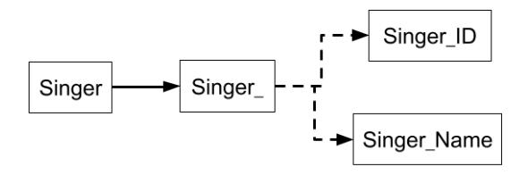

Figure 2: Token transition tree example. Solid lines show deterministic paths (e.g., "Singer" \rightarrow","), dashed lines allow ambiguity resolution (e.g., "Singer\_" \rightarrow" ID" vs "Name").

$$\operatorname{Next}(c) = \begin{cases} \{ \ t' \in \mathcal{T} \}, & \text{if } \exists a_i \in D \text{ such that} \\ c \circ t' \text{ is a prefix of } a_i, \\ \mathcal{V}, & \text{otherwise.} \end{cases}$$

Context-sensitive transitions resolve ambiguities by considering preceding tokens: For token chains like ["Song", "\_"] or ["Stadium", "\_"], the system deterministically selects valid schema continuations ("Name" or "ID" respectively), ensuring adherence to defined database structures.

#### 3.2 Tree-Guided Decoding Algorithm

Our hybrid strategy combines deterministic transitions with LLM sampling:

$$h(S, \mathcal{V}^*) = \begin{cases} t, & \text{if } |\mathcal{V}^*| = 1\\ f_{\text{LLM}}(S, \mathcal{V}^*), & \text{otherwise} \end{cases}$$

where S is the token sequence,  $\mathcal{V}^* = Next(c)$ , c is the last word's token chain (e.g., ["Singer","\_"]), and  $f_{LLM}$  is standard sampling (e.g., greedy decoding).

Algorithm 1 formalizes this process. Key advantages:

- 1. *Efficiency*: Eliminates 19.9% LLM passes via deterministic token selection (Section 4)
- Coherence: Schema-constrained branches reduce hallucinations (e.g., ["Stadium","\_"] only permits "ID", not "Name")

#### 3.3 Tree Invocation Rules

word tree

Trees activate during decoding based on context: **Keyword Trees**: Auto-complete SQL keywords (e.g., "ORDER" \rightarrow" BY") when prefixes exist in key-

**Schema Table Trees**: Trigger after "FROM", "JOIN", or "ON" to prevent hallucinated tables

## <span id="page-3-1"></span>Algorithm 1 Tree-Guided Token Decoding

**Require:**  $S = [t_1, \dots, t_i]$ : Initial token sequence; N: Maximum generation length

- 1: while not terminated and len(S) < N do
- 2:  $c \leftarrow \text{ExtractLastWord}(S)$  {Find tokens forming the last word/sub-word}
- 3: V\* ← Next(c) {Retrieve valid continuations for the word}
- 4: **if**  $|V^*| = 1$  **then**
- 5:  $t^* \leftarrow \mathcal{V}^*$  {Deterministic token selection}
- 6: **else**
- 7:  $t^* \leftarrow f_{\text{LLM}}(S, \mathcal{V}^*)$  {LLM-guided sampling}
- 8: end if
- 9:  $S \leftarrow S \circ t^*$  {Append new token}
- 10: end while

**Schema Column Trees**: Activate when "." follows non-numeral tokens (e.g., "table."→column names)

## 3.4 Offline Tree Construction

Three-stage pipeline creates domain-specific trees:

**Schema Augmentation**: Generate case variants, quoted forms, and whitespace-padded versions of schema elements (Appendix A)

<span id="page-3-0"></span>**Tokenization-Aware Decomposition**: Tokenize augmented strings using LLM tokenizer

**Tree Assembly**: Build prefix tree from token chains and valid transitions

#### 4 Experiments

We evaluate TTD on two text-to-SQL benchmarks using 1–4 NVIDIA A100 40GB GPUs. This section details datasets, models, evaluation metrics, and implementation details. All experiments operate in a **zero-shot regime** with **no error correction—SQL** outputs are generated directly from prompts without iterative refinement, re-ranking, or post-hoc validation.

## 4.1 Datasets

We use two standard benchmarks:

**Spider** (Yu et al., 2018): Development split with 992 questions from 19 databases.

**BIRD** (Minidev) (Li et al., 2024b): Lightweight dataset with 500 high-quality pairs from 11 databases.

## 4.2 Model[s and Baselines](#page-6-5)

Table 1 shows the five LLMs evaluated. We compare three decoding strategies:

- AR: Standard autoregressive decoding
- GCD [\(Ugare et al](#page-7-1)., 2024): Grammarconstrained decoding
- TTD: [Our tree-guided](#page-7-5) method (Section 3)

For reasoning-based generation, we also test:

- CoT (Wei et al., 2022): Chain-of-thought with "'sql marker
- <span id="page-4-0"></span>• CoD (Xu et al., 2025): Minimal-step drafts (5 words/step)

Due to resource constraints, the 70B model was only tested with AR/GCD/TTD.

## 4.3 Prompts

All methods use a shared base prompt template tailored to SQL generation, with dataset-specific adaptations:

BIRD Prompt : Identical to Spider's structure but includes additional schema-aware evidence (provided in the dataset) to guide complex query generation.

For reasoning-based strategies (CoT/CoD), we extend the base prompt with:

- "Let's think step by step" for chainof-thought (CoT) and chain-of-draft (CoD) generation.
- "[Kee](#page-7-7)p drafts to 5 words" for CoD's minimal-step drafts.

For GCD, we add "\n\n" as an additional stop token to enforce valid SQL output termination.

Full prompt templates, are provided in Appendix B.

# 4.4 Evaluation Metrics

We measure:

- Execution Accuracy (EX): Matches groundtruth results using Spider framework
- Token Rate (TR): Tokens per second during generation (higher=better)
- Executable SQL %: Valid SQL queries %
- Auto-fill Rate: Proportion of tokens deterministically predicted by TTD (no LLM decoding required)

## 5 Results

We evaluate TTD across five LLMs and four decoding strategies on Spider/BIRD benchmarks. Key findings:

- Execution Accuracy (EX%): TTD matches/exceeds AR baseline. GCD achieves highest Spider accuracy for Qwen2.5 (82.1%) but underperforms on BIRD (50.2% vs AR's 54.6%).
- Token Rate (TR): TTD delivers largest speedups (Codellama: +19.96% over AR). Marginal slowdown only for Phi-4 on BIRD (8.24 vs AR's 8.31 tokens/s).
- Executable SQL (Exec%): TTD significantly improves valid SQL generation. Codellama's exec rate rises +17.7% on BIRD (57.6% → 67.8%), Granite improves +6.3% on BIRD.
- CoT/CoD Trade-offs: CoT reduces EX% by –48.3% (Codellama on BIRD), while CoD shows mixed accuracy impa[cts.](#page-5-3)
- Actual inference latency: TTD achieves ≥ 1.0 s gains [in 51 % and 60](#page-6-16) % of queries for Qwen2.5 and Llama-70B, respectively, over BIRD Minidev vs AR (Table 5).

## 5.1 Statistical Significance

Friedman tests (Friedman, 1937) reject equal median token rates χ 2 (df=4) and p<0.001 for all models). Wilcoxon tests confirm TTD's superiority:

- TTD vs AR: All models significant (p<10−<sup>4</sup> )
- GCD vs [AR:](#page-9-0) Significant for all except Granite (p=0.0923 )
- CoT/CoD vs AR: Significant in all but Granite CoD (p=0.1685 )

See Appendix C for details.

# 6 Discussion

We introduced *Tree-Guided Token Decoding (TTD)*, a structured decoding framework that integrates schema-aware constraints during SQL generation. Key benefits:

• Inference Speedups: Deterministic token prediction yields improvements in token-rate (TR) upto 19.96% over autoregressive decoding (Tables 2, 3), with stronger gains for higher auto-fill rates (e.g., Llama-70B: +12.3% TR with 10.9% auto-fill on Spider).

Table 1: LLM models used in experiments.

<span id="page-5-2"></span>

| Model                        | Size | URL                                        |
|------------------------------|------|--------------------------------------------|
| CodeLlama 7B-Instruct        | 7B   | https://huggingface.co/meta-llama/         |
|                              |      | CodeLlama-7b-Instruct-hf                   |
| Microsoft Phi-4              | 13B  | https://huggingface.co/microsoft/phi-4     |
| Qwen2.5-Coder-32B-Instruct   | 32B  | https://huggingface.co/Qwen/Qwen2.         |
|                              |      | 5-Coder-32B-Instruct                       |
| Granite-34B-Code-Instruct-8K | 34B  | https://huggingface.co/ibm-granite/        |
|                              |      | granite-34b-code-instruct-8k               |
| Llama-3.3-70B-Instruct       | 70B  | https://huggingface.co/meta-llama/Llama-3. |
|                              |      | 3-70B-Instruct                             |

<span id="page-5-0"></span>Table 2: Spider dataset results. Metrics: EX% (execution accuracy), TR (tokens/sec), Exec% (executable SQL). Baselines: AR, GCD, CoT, CoD. TTD matches/exceeds baseline accuracy while improving token rates by >12% over AR. GCD underperforms on Llama-70B (8% slower than TTD).

| Method | CodeLlama<br>Phi-4 |       |      | Qwen2.5 |      |      | Granite |      |      | Llama-70B |      |      |      |      |      |
|--------|--------------------|-------|------|---------|------|------|---------|------|------|-----------|------|------|------|------|------|
|        | EX                 | TR    | Exec | EX      | TR   | Exec | EX      | TR   | Exec | EX        | TR   | Exec | EX   | TR   | Exec |
| AR     | 59.5               | 8.97  | 91.8 | 72.2    | 7.75 | 98.8 | 80.5    | 4.1  | 98.6 | 68.8      | 5.04 | 96.2 | 80.9 | 2.76 | 99.5 |
| GCD    | 60.6               | 9.53  | 93.4 | 65.7    | 8.97 | 98.8 | 82.1    | 4.21 | 99.1 | 69.4      | 5.16 | 96.1 | 59.2 | 2.85 | 76.8 |
| CoD    | 48.2               | 10.27 | 81.8 | 73.1    | 8.64 | 98.4 | 80.4    | 3.99 | 98.4 | 71.1      | 4.94 | 96.1 | -    | -    | -    |
| CoT    | 47.0               | 10.31 | 80.2 | 69.6    | 8.63 | 98.7 | 79.2    | 4.03 | 99.2 | 69.7      | 5.00 | 96.6 | -    | -    | -    |
| TTD    | 59.5               | 10.76 | 93.7 | 72.9    | 8.81 | 98.9 | 80.7    | 4.65 | 98.6 | 69.2      | 5.78 | 96.9 | 80.9 | 3.1  | 99.5 |

<span id="page-5-1"></span>Table 3: BIRD dataset results. TTD matches/exceeds baseline accuracy with >6% token-rate gains over AR (except Phi-4).

| Method |      | CodeLlama |      | Phi-4 |      | Qwen2.5 |      | Granite |      |      | Llama-70B |      |      |      |      |
|--------|------|-----------|------|-------|------|---------|------|---------|------|------|-----------|------|------|------|------|
|        | EX   | TR        | Exec | EX    | TR   | Exec    | EX   | TR      | Exec | EX   | TR        | Exec | EX   | TR   | Exec |
| AR     | 23.2 | 8.83      | 57.6 | 42.6  | 8.31 | 92.8    | 54.6 | 3.94    | 94.6 | 27.0 | 4.84      | 65.2 | 56.6 | 2.70 | 97.4 |
| GCD    | 21.8 | 8.89      | 51.2 | 36.8  | 8.64 | 80.0    | 50.2 | 4.05    | 84.0 | 26.0 | 4.92      | 63.8 | 36.4 | 2.78 | 75.0 |
| CoD    | 19.0 | 9.11      | 45.4 | 43.8  | 8.50 | 93.0    | 54.2 | 3.91    | 94.8 | 27.4 | 4.77      | 67.2 | -    | -    | -    |
| CoT    | 12.0 | 8.95      | 49.4 | 41.2  | 8.35 | 91.8    | 49.6 | 4.02    | 95.2 | 25.8 | 4.80      | 64.8 | -    | -    | -    |
| TTD    | 24.2 | 9.41      | 67.8 | 43.0  | 8.24 | 93.4    | 54.6 | 4.31    | 95.4 | 27.2 | 5.19      | 69.6 | 56.6 | 2.90 | 97.2 |

Table 4: TTD auto-fill rates (%).

<span id="page-5-4"></span>

| Model   | Codellama |      | Phi-4  |      | Qwen2.5 |      | Granite |      | Llama-70B |      |
|---------|-----------|------|--------|------|---------|------|---------|------|-----------|------|
| Dataset | Spider    | BIRD | Spider | BIRD | Spider  | BIRD | Spider  | BIRD | Spider    | BIRD |
| TTD     | 16.1      | 10.3 | 12.0   | 7.8  | 14.2    | 8.6  | 14.7    | 7.2  | 10.9      | 7.4  |

Table 5: Actual inference latency

<span id="page-5-3"></span>

| Model     | % Queries (≥1s faster) |
|-----------|------------------------|
| CodeLlama | 23.69 %                |
| Phi-4     | 2.81 %                 |
| Qwen2.5   | 51 %                   |
| Granite   | 27.11 %                |
| Llama-70B | 60.04 %                |

• Hallucination Reduction: Schema-aligned pruning improves executable-SQL rates upto 10.2% on c[omp](#page-5-4)lex BIRD queries, enhancing deployment reliability.

## 6.1 Speedup Mechanism

TTD achieves efficiency through deterministic token filling (Table 4):

• Auto-fill rates (7.2–16.1%) directly correlate with TR gains.

• Tokenization sensitivity: Finer tokenization (e.g., CodeLlama splits "cust\_id" into 3 tokens) enables deeper decision paths (16.1% auto-fill, +19.96% TR), while coarser tokenization (e.g., Llama-70B's "cust\_id"→2 tokens) yields smaller gains (7.4% auto-fill, +7.4% TR).

## 6.2 Enterprise Schema Potential

TTD's benefits may amplify in enterprise settings:

- Deeper token trees: Complex identifiers (e.g., "tbl\_usr\_dtl") tokenize into longer sequences, enabling more deterministic predictions than public benchmarks (max 16.1%).
- Stronger hallucination prevention: Strict enforcement reduces invalid generations beyond BIRD's +17.7% gain for CodeLl[am](#page-7-6)a.

<span id="page-6-8"></span>• Scalability: The cost of constructing the schema trees scales linearly with the schema elements, detailed results in Appendix A.

# 7 Conclusion

TTD enhances SQL generation through schemaaware decoding, delivering consistent speedups (up to 19.96% TR) and reduced hallucinations (+17.7% executable SQL) across five LLMs. By bridging parser rigidity and LLM flexibility, TTD offers reliable performance for public benchmarks and enterprise applications, with straightforward extension to domain-specific schemas.

# 8 Limitations

Static schema requirement: TTD relies on precomputed decision trees for fixed schemas; dynamic or evolving databases require efficient incremental updates. Designing of algorithms for incremental tree updates to handle schema changes without full recomputation will be part of the future work.

Tokenization sensitivity: Auto-fill rates and resultant speedups depend heavily on how schema items are tokenized by each model's tokenizer (e.g., CodeLlama vs. Phi-4 vs. Granite).

## 9 Acknowledgments

We acknowledge support from the Department of Computer Science and Engineering for providing access to a High Performance Computing facility based on Nvidia DGX equipment. We also thank the anonymous reviewers for their valuable comments and suggestions, which helped improve the quality of this work.

## <span id="page-6-13"></span><span id="page-6-11"></span>References

- S. Arcadinho, D. Aparício, H. Veiga, and A. Alegria. 2022. T5ql: Taming language models for sql generation. In *CoRR abs/2209.10254*.
- <span id="page-6-2"></span>L. Beurer-Kellner, M. Fischer, and M. Vechev. 2023. Prompting is programming: A query language for large language models. In *Proceedings of the ACM on Programming Languages, (PLDI)*, pages 1946– 1969.
- <span id="page-6-16"></span><span id="page-6-10"></span>N. Deng, Y. Chen, and Y. Zhang. 2022. Recent advances in text-tosql: A survey of what we have and what we expect. In *Proceedings of the 29th International Conference on Computational Linguistics*, pages 2166—-2187.

- Milton Friedman. 1937. The use of ranks to avoid the assumption of normality implicit in the analysis of variance. *Journal of the american statistical association*, 32(200):675–701.
- <span id="page-6-18"></span><span id="page-6-3"></span>S. Geng, B. Döner, C. Wendler, M. Josifoski, and R. West. 2024. Sketch-guided constrained decoding for boosting blackbox large language models without logit access. In *Proceedings of ACL (Short Papers)*, pages 234–245.
- <span id="page-6-1"></span>Sture Holm. 1979. A simple sequentially rejective multiple test procedure. *Scandinavian journal of statistics*, pages 65–70.
- <span id="page-6-4"></span>George Katsogiannis-Meimarakis and Georgia Koutrika. 2023. A survey on deep learning approaches for textto-sql. *VLDB Journal*, 32(4):905–936.
- B. Li, Y. Luo, C. Chai, G. Li, and N. Tang. 2024a. The dawn of natural language to sql: Are we fully ready? *VLDB Endow.*, 17(11):3318–3331.
- <span id="page-6-0"></span>Jinyang Li, Binyuan Hui, Ge Qu, Jiaxi Yang, Binhua Li, Bowen Li, Bailin Wang, Bowen Qin, Ruiying Geng, Nan Huo, and 1 others. 2024b. Can llm already serve as a database interface? a big bench for large-scale database grounded text-to-sqls. *Advances in Neural Information Processing Systems*, 36.
- <span id="page-6-12"></span>X. Liu, S. Shen, B. Li, P. Ma, R. Jiang, Y. Luo, Y. Zhang, J. Fan, G. Li, and N. Tang. 2024. A survey of nl2sql with large language models: Where are we, and where are we going? In *CoRR, abs/2408.05109*.
- <span id="page-6-14"></span>Gabriel Poesia, Alex Polozov, Vu Le, Ashish Tiwari, Gustavo Soares, Christopher Meek, and Sumit Gulwani. 2022. Synchromesh: Reliable code generation from pre-trained language models. In *In Proceedings of 10th International Conference on Learning Representations (ICLR)*.
- <span id="page-6-15"></span>Mohammadreza Pourreza and Davood Rafiei. 2023. Din-sql: Decomposed in-context learning of textto-sql with self-correction. *Advances in Neural Information Processing Systems*, 36:36339–36348.
- <span id="page-6-17"></span>Mohammadreza Pourreza, Ruoxi Sun, Hailong Li, Lesly Miculicich, Tomas Pfister, and Sercan O Arik. 2024. Sql-gen: Bridging the dialect gap for text-to-sql via synthetic data and model merging. *arXiv preprint arXiv:2408.12733*.
- <span id="page-6-6"></span>Samuel Sanford Shapiro and Martin B Wilk. 1965. An analysis of variance test for normality (complete samples). *Biometrika*, 52(3-4):591–611.
- <span id="page-6-5"></span>Dzmitry Bahdanau Torsten Scholak, Nathan Schucher. 2021. Picard: Parsing incrementally for constrained auto-regressive decoding from language models. In *Proceedings of the Conference on Empirical Methods in Natural Language Processing (EMNLP)*, pages 9895–9901.
- <span id="page-6-9"></span>Shubham Ugare, Tarun Suresh, Hangoo Kang, Sasa Misailovic, and Gagandeep Singh. 2024. Improving llm code generation with grammar augmentation. In *CoRR abs/2403.01632*.
- <span id="page-6-7"></span>B. Wang, Z. Wang, X. Wang, Y. Cao, R.A. Saurous, and Y. Kim. 2023. Grammar prompting for domainspecific language generation with large language models. In *NeurIPS*.

- <span id="page-7-3"></span>Bailin Wang, Richard Shin, Xiaodong Liu, Oleksandr Polozov, and Matthew Richardson. 2019. Rat-sql: Relation-aware schema encoding and linking for textto-sql parsers. *arXiv preprint arXiv:1911.04942*.
- <span id="page-7-1"></span>Z. Wang, L.F.R. Ribeiro, A. Papangelis, R. Mukherjee, T.-Y. Wang, X. Zhao, A. Biswas, J. Caverlee, and A. Metallinou. 2024. Fantastic sequences and where to find them: Faithful and efficient api call generation through state-tracked constrained decoding and reranking. In *CoRR abs/2407.13945*.
- <span id="page-7-5"></span>Jason Wei, Xuezhi Wang, Dale Schuurmans, Maarten Bosma, Fei Xia, Ed Chi, Quoc V Le, Denny Zhou, and 1 others. 2022. Chain-of-thought prompting elicits reasoning in large language models. *Advances in neural information processing systems*, 35:24824– 24837.
- <span id="page-7-4"></span>Silei Xu, Wenhao Xie, Lingxiao Zhao, and Pengcheng He. 2025. Chain of draft: Thinking faster by writing less. *arXiv preprint arXiv:2502.18600*.
- <span id="page-7-0"></span>Yossi Matias Yaniv Leviathan, Matan Kalman. 2023. Fast inference from transformers via speculative decoding. In *Proceedings of International Conference on Machine Learning (ICML)*, pages 19274–19286.
- <span id="page-7-2"></span>T. Yu, R. Zhang, K. Yang, M. Yasunaga, D. Wang, Z. Li, J. Ma, I. Li, Q. Yao, S. Roman, Z. Zhang, and D.R. Radev. 2018. Spider: A large-scale human-labeled dataset for complex and cross-domain semantic parsing and text-to-sql task. In *Proceedings of EMNLP*, pages 3911–3921.
- <span id="page-7-6"></span>K. Zhang, H. Chen, L. Li, and W.Y. Wang. 2023. Syntax error-free and generalizable tool use for llms via finite-state decoding. In *CoRR abs/2310.07075*.

# A Implementation Details of Tree Construction

We implement tree construction using Python's networkx library, with three core components:

## A.1 Schema Augmentation

For each schema element s, we generate variations via:

- Case transformations: s.lower(), s.upper(), s.capitalize()
- Delimiters: "s", 's'
- Whitespace padding: s + , + s, etc.
- SQL-specific syntax: Parentheses, aliases (e.g., AS t1)

## A.2 Tree Assembly with NetworkX

Prefix trees are built using networkx.DiGraph:

```
def tree_generator(input_list):
   G = nx.DiGraph()
   for i in input_list:
       for j in range(1, len(i)+1):
           G.add_edge(str(i[:j-1]),
               str(i[:j]))
```

Table 6: Time taken to construct schema trees

| Tokenizer                    | Time (s) |
|------------------------------|----------|
| CodeLlama 7B-Instruct        | 0.43     |
| Microsoft Phi-4              | 0.28     |
| Qwen2.5-Coder-32B-Instruct   | 0.27     |
| Granite-34B-Code-Instruct-8K | 0.28     |
| Llama-3.3-70B-Instruct       | 0.37     |

## **return** G

# A.3 SQL Grammar Special Cases

We explicitly handle:

- Nested queries: Allow ( after FROM/JOIN
- Column references: Enforce column after "." (non-numeric context)
- Aliases: Support AS table\_alias patterns

## A.4 Cost for constructing schema trees

<span id="page-7-7"></span>Schema tree construction is a one-time offline step. Time [tak](#page-5-3)en for constructing schema trees for each tokenizer used in the experiments is reported in Table 5.

## B Prompts

## B.1 Spider

## B.1.1 Basic prompt

### Task

Generate a SQL query to answer the given user question.

### Instructions

- If you cannot answer the question with the available database schema, return 'I do not know'
- Do not use "ilike" or "ILIKE" command, as it's not supported in sqlite database.
- Do not generate any text other than SQL, no explanation nothing.
- Use complete table name before all the columns to be used in the generated SQL, like table\_name.column\_name

### Database Schema

The query will run on a sqlite database with the following schema: {table\_metadata\_string}

### Question {user\_question} ### SQL

This [prom](#page-4-0)pt was used for AR, GCD, as well as TTD. For CoT and COD methods additions are made to the basic prompt above as mentioned in Section 4.3.

# B.1.2 CoT prompt

### Task

Generate a SQL query to answer the given user question.

## ### Instructions

- If you cannot answer the question with the available database schema, return 'I do not know'
- Do not use "ilike" or "ILIKE" command, as it's not supported in sqlite database.
- Use complete table name before all the columns to be used in the generated SQL, like table\_name.column\_name
- Let's think step by step. Return the answer (final SQL query) at the end of the response after a separator ```sql.

### Database Schema

The query will run on a sqlite database with the following schema: {table\_metadata\_string}

### Question {user\_question}

### SQL

## B.1.3 CoD prompt

### Task

Generate a SQL query to answer the given user question.

## ### Instructions

- If you cannot answer the question with the available database schema, return 'I do not know'
- Do not use "ilike" or "ILIKE" command, as it's not supported in sqlite database.

- Use complete table name before all the columns to be used in the generated SQL, like table\_name.column\_name
- Think step by step, but only keep a minimum draft for each thinking step, with 5 words at most. Return the answer (final SQL query) at the end of the response after a separator ```sql.

### Database Schema

The query will run on a sqlite database with the following schema:

{table\_metadata\_string}

### Question {user\_question}

### SQL

## B.2 BIRD (Minidev)

## B.2.1 Basic prompt

Prompt used for the BIRD (Minidev) dataset is just addition of *Extra knowledege*, i.e., evidence, to the basic prompt of the Spider dataset provided above.

### Task

Generate a SQL query to answer the given user question.

## ### Instructions

- If you cannot answer the question with the available database schema, return 'I do not know'
- Do not use "ilike" or "ILIKE" command, as it's not supported in sqlite database.
- Do not generate any text other than SQL, no explanation nothing.
- Use complete table name before all the columns to be used in the generated SQL, like table\_name.column\_name

### Database Schema

The query will run on a database with the following schema:

{table\_metadata\_string}

### Extra knowledge

```
Make use of the following information
   if needed:
{evidence}
### Question
{user_question}
### SQL
```

# <span id="page-9-0"></span>C Statistical tests

## Background on Statistical Tests

To assess whether the differences in decoding speed (token rate per question) across [prompting strate](#page-6-16)gies are statistically meaningful, we employ a suite of well-established non-parametric tests suitable for repeated-measures designs.

We first use the Friedman test (Friedman, 1937) to detect overall differences in token rates across the five decoding strategies: AR, TTD, GCD, CoT, and CoD. The Friedman test is a non-parametric alternative to the repeated-measures ANOVA, designed for comparing more than two related samples when the normality assumption may not hold. It tests the null hypothesis that the median ranks of all groups are equal. A significant result indicates that at least one method differs from the others in terms of performance.

Following a significant Friedman test, we conduct pairwise comparisons between the baseline AR strategy and each alternative method. Since token rate differences are computed per question (i.e.[, paired\), we test the nul](#page-6-17)l hypothesis that the median of differences between paired observations is zero. To determine whether to use a parametric or non-parametric test, we apply the Shapiro–Wilk test (Shapiro and Wilk, 1965) on each set of paired differences. If the data is approximately normal, we use the paired t-test; otherwise, we use the [Wilcoxon sig](#page-6-18)ned-rank test, a non-parametric test for paired samples that does not assume normality.

Because we conduct multiple pairwise comparisons, we apply the Holm–Bonferroni correction (Holm, 1979) to control the family-wise error rate. This method sequentially adjusts p-values, providing more statistical power than the standard Bonferroni correction while still guarding against Type I error.

These tests provide rigorous evidence as to whether any observed token-rate improvements are statistically robust across the evaluation datasets.

The CoT and CoD prompts addition are same as that in case of Spider dataset.

## Sample code

```
import numpy as np
from scipy.stats import shapiro,
   ttest_rel, wilcoxon,
   friedmanchisquare
from statsmodels.stats.multitest import
   multipletests
# Suppose these are your per-question
   token rates:
rates_AR = np.array([...])
rates_TTD = np.array([...])
rates_GCD = np.array([...])
rates_CoT = np.array([...])
rates_CoD = np.array([...])
# 1) Overall Friedman test
stat, p = friedmanchisquare(rates_AR,
   rates_TTD, rates_GCD, rates_CoT,
   rates_CoD)
print("Friedman:", stat, "p=", p)
# 2) Pairwise comparisons
methods = {"AR": rates_AR, "TTD":
   rates_TTD, "GCD": rates_GCD,
          "CoT": rates_CoT, "CoD":
              rates_CoD}
pairs = [("AR","TTD"), ("AR","GCD"),
   ("AR","CoT"), ("AR","CoD")]
p_vals = []
for m1, m2 in pairs:
   diffs = methods[m1] - methods[m2]
   if shapiro(diffs).pvalue > 0.05:
       _, pv = ttest_rel(methods[m1],
           methods[m2])
   else:
       _, pv = wilcoxon(methods[m1],
           methods[m2])
   p_vals.append(pv)
# 3) Correct for multiple comparisons
rej, p_corr, _, _ =
   multipletests(p_vals, alpha=0.05,
   method='holm')
for (m1,m2), pv, rc in zip(pairs,
   p_corr, rej):
   print(f"{m1} vs {m2}: p={pv:.3e},
       significant? {rc}")
```

Table 7: Statistical tests on per-question token rates over Spider. Friedman χ 2 (df=4) and p; pairwise Wilcoxon p-values vs. AR (Holm–Bonferroni–corrected).

| Model        | 2<br>χ | p (Friedman) | AR vs TTD | AR vs GCD | AR vs CoT | AR vs CoD |
|--------------|--------|--------------|-----------|-----------|-----------|-----------|
| Phi-4        | 3748.8 | < 10−3       | 4.10e-153 | 4.10e-153 | 2.68e-163 | 2.68e-163 |
| CodeLlama-7B | 2784.1 | < 10−3       | 2.30e-151 | 4.28e-17  | 3.23e-155 | 1.90e-154 |
| Qwen2.5-32B  | 3207.9 | < 10−3       | 1.16e-150 | 1.87e-12  | 3.46e-163 | 1.01e-155 |
| Granite-34B  | 1048.9 | < 10−3       | 1.43e-145 | 6.78e-18  | 1.99e-07  | 4.02e-02  |
| Llama-70B    | 847.5  | < 10−3       | 1.80e-161 | 1.36e-31  | –         | –         |

Table 8: Statistical tests on per-question token rates over BIRD (Minidev). Friedman χ 2 (df=4) and p; pairwise Wilcoxon p-values vs. AR (Holm–Bonferroni–corrected).

| Model        | 2<br>χ | p (Friedman) | AR vs TTD | AR vs GCD | AR vs CoT | AR vs CoD |
|--------------|--------|--------------|-----------|-----------|-----------|-----------|
| Phi-4        | 1765.6 | < 10−3       | 5.26e-22  | 9.79e-67  | 1.07e–82  | 1.07e–82  |
| CodeLlama-7B | 1295.8 | < 10−3       | 5.02e-10  | 2.03e-05  | 8.85e–74  | 2.62e–81  |
| Qwen2.5-32B  | 1621.2 | < 10−3       | 9.37e-80  | 2.48e–07  | 1.07e–82  | 3.47e–80  |
| Granite-34B  | 175.5  | < 10−3       | 3.33e-22  | 9.23e–02  | 1.56e–14  | 1.69e–01  |
| Llama-70B    | 493.2  | < 10−3       | 9.75e-81  | 6.38e–49  | –         | –         |

## D Query generation time distrib[utio](#page-1-0)n

This appendix presents detailed execution time distributions across models and query subsets to analyze TTD's latency behavior. Figure 1 visualizes the per-query token generation time for five LLMs (CodeLlama-7B, Phi-4, Qwen2.5-Coder-32B, Granite-34B, and Llama-3.3-70B) under two scenarios:

TTD Faster: Subsets where TTD outperforms autoregressive (AR) decoding (e.g., 93.4% of queries for Qwen2.5-Coder-32B and 94.2% for Llama-3.3-70B-Instruct).

TTD Slower: Subsets where TTD incurs overhead (e.g., 69.4% of queries for Phi-4 and 32.4% for Granite-34B).

The distributions highlight TTD's adaptive efficiency: deterministic auto-fills accelerate generation for structured patterns, while LLM sampling retains flexibility for complex reasoning.

Figure 3: Execution Time Distributions: TTD vs. Autoregressive Decoding (AR) Across Models

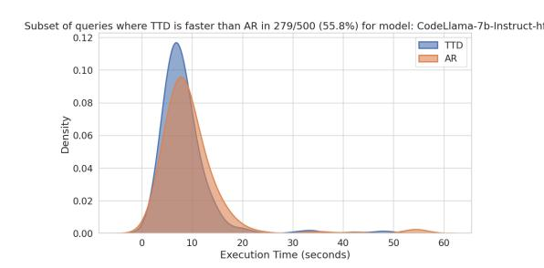

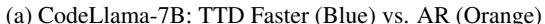

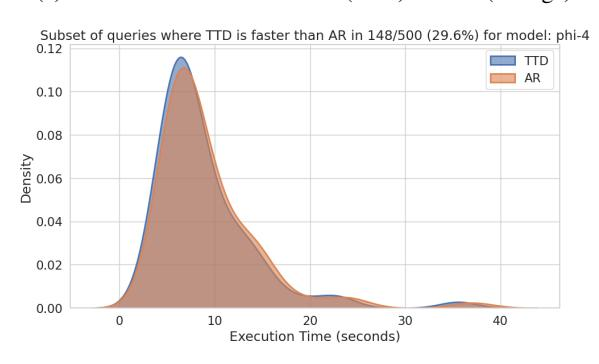

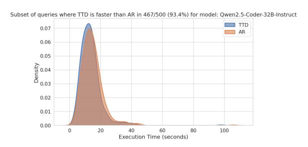

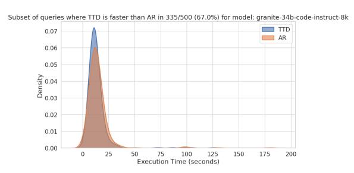

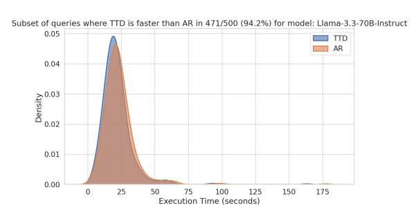

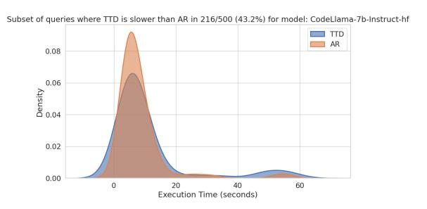

#### (a) CodeLlama-7B: TTD Faster (Blue) vs. AR (Orange) (b) CodeLlama-7B: TTD Slower (Blue) vs. AR (Orange)

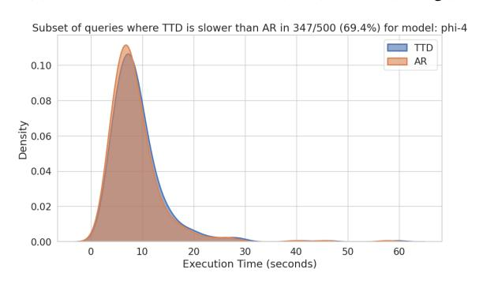

#### (c) Phi-4: TTD Faster (Blue) vs. AR (Orange) (d) Phi-4: TTD Slower (Blue) vs. AR (Orange)

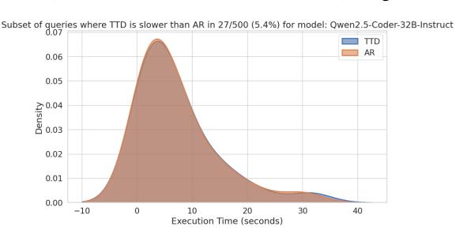

#### (e) Qwen2.5-32B: TTD Faster (Blue) vs. AR (Orange) (f) Qwen2.5-32B: TTD Slower (Blue) vs. AR (Orange)

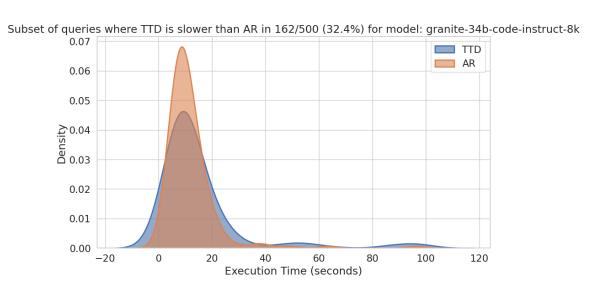

#### (g) Granite-34B: TTD Faster (Blue) vs. AR (Orange) (h) Granite-34B: TTD Slower (Blue) vs. AR (Orange)

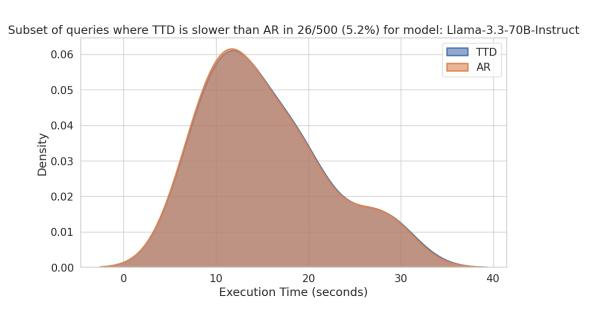

(i) Llama-70B: TTD Faster (Blue) vs. AR (Orange) (j) Llama-70B: TTD Slower (Blue) vs. AR (Orange)