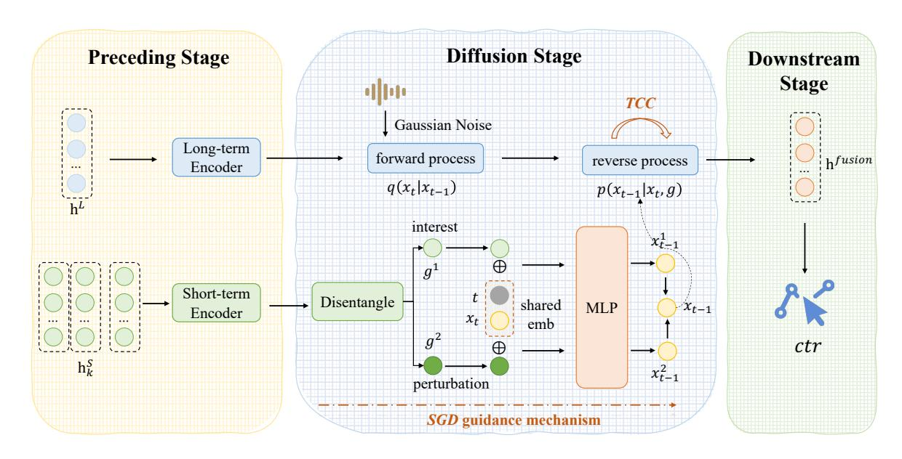
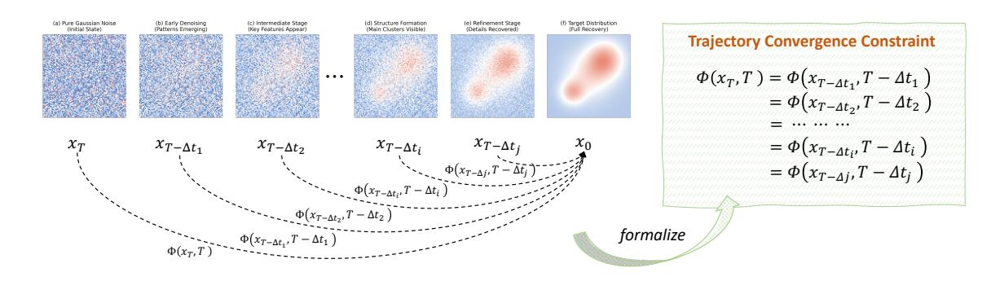

# HierDiffuse: Progressive Diffusion for Robust Interest Fusion in CTR Prediction

Ziheng Ni\* ,Congcong Liu\*†, Yuying Chen, Zhiwei Fang, Changping Peng, Zhangang Lin, Ching Law, Jingping Shao

Correspondence: [liucongcong25@jd.com](mailto:liucongcong25@jd.com)

# Abstract

Modern recommendation systems grapple with reconciling users' enduring preferences with transient interests, particularly in click-through rate (CTR) prediction. Existing approaches inadequately fuse long-term behavioral profiles (e.g., aggregated purchase trends) and short-term interaction sequences (e.g., realtime clicks), suffering from representational misalignment and noise in transient signals. We propose HierDiffuse, a unified framework that redefines interest fusion as a hierarchical denoising process through diffusion models. Our approach addresses these challenges via three innovations: (1) A cross-scale diffusion mechanism aligns long- and short-term representations by iteratively refining long-term interests using short-term contextual guidance; (2) A Semantic Guidance Disentanglement (SGD) mechanism explicitly decouples core interests from noise in short-term signals; (3) Trajectory Convergence Constraint (TCC) is proposed to accelerate diffusion model reasoning without reducing generation quality to meet the constraints of high QPS (Queries Per Second) and low latency for online deployment of recommendation or advertising systems. HierDiffuse eliminates ad-hoc fusion operators, dynamically integrates multi-scale interests, and enhances robustness to spurious interactions as well as improves inference speed. Extensive experiments on real-world datasets demonstrate state-of-the-art performance, with significant improvements in CTR prediction accuracy and robustness to noisy interactions. Our work establishes diffusion models as a principled paradigm for adaptive interest fusion in recommendation systems.

# 1 Introduction

Modern recommendation systems and advertising systems face a fundamental tension: how to reconcile users' enduring preferences with their momentary interests. This challenge manifests acutely in click-through rate (CTR) prediction[\(Zhou et al.,](#page-7-0) [2018;](#page-7-0) [Liu et al.,](#page-6-0) [2022a,](#page-6-0)[b,](#page-6-1) [2023;](#page-6-2) [Sang et al.,](#page-7-1) [2025a](#page-7-1)[,b\)](#page-7-2), where the interplay between long-term behavioral patterns and short-term contextual signals determines recommendation relevance [\(Zhou](#page-7-0) [et al.,](#page-7-0) [2018\)](#page-7-0). While existing approaches have made progress in modeling these temporal scales independently [\(Chen et al.,](#page-6-3) [2019\)](#page-6-3), their fusion remains an open problem with significant implications for real-world performance.

A critical limitation stems from representational misalignment: long-term models rely on aggregated behavioral profiles (e.g., monthly purchase trends), whereas short-term models process fine-grained interaction sequences (e.g., real-time clicks). This mismatch in feature granularity renders conventional late fusion operators ineffective [\(He et al.,](#page-6-4) [2023\)](#page-6-4). For instance, when a fitness enthusiast suddenly browses dessert recipes, the system fails to adapt recommendations because static long-term preferences dominate transient contextual signals. Moreover, the signal-tonoise trade-off in short-term behavior remains unresolved. While recent interactions provide valuable contextual cues, they also introduce spurious noise (e.g., accidental clicks or exploratory browsing). Without principled noise suppression, fusion mechanisms struggle to distinguish meaningful signals from ephemeral fluctuations [\(Hochreiter and](#page-6-5) [Schmidhuber,](#page-6-5) [1997\)](#page-6-5). These limitations highlight the need for a unified modeling framework that jointly optimizes multi-scale interest representation and adaptive fusion.

In this paper, we propose HierDiffuse, a framework that reconceptualizes interest fusion as a hierarchical denoising process. Our key insight is that the diffusion paradigm naturally addresses all challenges through its unique combination of iterative refinement and conditional generation: For

\*Equal contribution

†Corresponding author

representation alignment and joint modeling, we formulate a cross-scale diffusion process where short-term interests guide the gradual denoising of long-term representations through intermediate latent states. For noise robustness, Semantic Guidance Disentanglement (SGD) mechanism achieves interest perturbation decoupling through explicit decomposition of core interests and random noise. Meanwhile, it is well known that the diffusion model has a high computational cost, especially its reasoning process, which is contrary to the requirements of high QPS and low latency of online systems. We proposed **Trajectory Conver**gence Constraint (TCC) to accelerate reasoning without reducing production effects, thereby meeting the requirements of online deployment.

There are several contributions of our work:

- Unified Fusion Framework: By treating fusion as conditional generation, we eliminate the need for ad-hoc combination operators and their inherent linearity constraints.
- Interest-Perturbation Disentanglement: SGD realizes interest-perturbation decoupling regulation.
- Online Deployment Optimization: TCC significantly reduces the inference cost of HierDiffuse without compromising the generation effect.
- **Empirical Validation**: Comprehensive experiments have achieved better results than the baseline, demonstrating practical viability.

#### 2 Related Work

Traditional approaches to user behavior modeling typically bifurcate user behaviors into separate long-term and short-term sequences, employing distinct architectures for each. Long-term modeling has evolved from RNNs (Hidasi et al., 2016) to sophisticated attention mechanisms (Zhou et al., 2019) with noise handling capabilities (Cao et al., 2022), while short-term modeling leverages transformer variants (Xia et al., 2023) and graph networks (Wu et al., 2019) to capture session dynamics. However, this artificial separation creates a fundamental disconnect in modeling the continuous spectrum of user interests, where behaviors naturally transition between temporal scales.

Current interest fusion techniques attempt to bridge this gap through concatenation (Zhou et al.,

2018), cross-scale attention (Li et al., 2019), or gating networks (Lv et al., 2019). While these methods have advanced the field, they universally treat fusion as a post-hoc combination step constrained by linear interaction assumptions. This limitation becomes particularly apparent when handling misaligned feature spaces between temporal scales or disentangling meaningful signals from transient noise in short-term behaviors. Recent attempts to apply diffusion models in recommendations (Wang et al., 2023; Li et al., 2023) have shown promise in denoising user behaviors, but focus narrowly on single-scale sequences without addressing the core fusion challenge.

Meanwhile, existing studies of diffusion recommendation systems like DMCDR (Li et al., 2025) and DreamRec (Yang et al., 2023) overlook the online deployment challenges caused by the diffusion model's inherent computational complexity, despite its fundamental importance for real-world applications.

#### 3 Methodology

Fig.1 briefly illustrates the overall framework of the proposed **HierDiffuse**. It receives the output from the transformer-based long-term behavior sequence encoder and the short-term behavior sequence encoder, and uses the generated representation for the downstream CTR prediction task through the diffusion process. HierDiffuse introduces two new modules: **SGD** and **TCC**, which are used for interest perturbation decoupling of guidance and and diffusion reasoning acceleration, respectively.

#### 3.1 Preliminaries

We formalize user behavior sequence modeling through dual-sequence representation learning. Given a user's long-term behavior sequence  $\mathcal{B}^L = \{b_i^L\}_{i=1}^M$  and short-term session sequence  $\mathcal{B}^S = \{S_k\}_{k=1}^K$  where  $S_k = \{b_j^S\}_{j=1}^{n_k}$ , we construct long-term encoder  $\mathbf{h}^L = f_L(\mathcal{B}^L) \in \mathbb{R}^{d_L}$ , and short-term encoder:  $\{\mathbf{h}_k^S\}_{k=1}^K = f_S(\mathcal{B}^S) \in \mathbb{R}^{d_S}$ . The fusion objective learns  $\mathcal{F}_\theta : (\mathbf{h}^L, \{\mathbf{h}_k^S\}) \mapsto \mathbf{h}^{fusion}$  through a diffusion process. Our key innovation reformulates this as conditional denoising:

$$\mathbf{h}^{fusion} = \text{Denoise}(\mathbf{h}^L \oplus \epsilon_T, {\{\mathbf{h}_k^S\}})$$
 (1)

where  $\epsilon_T \sim \mathcal{N}(0, \mathbf{I})$  and  $\oplus$  denotes noise injection.

Figure 1: The framework of the proposed HierDiffuse.

Figure 2: The process of the proposed Trajectory Convergence Constraint (TCC).

# 3.2 Diffusion Process in User Interest Modeling

Our framework consists of a forward noising process and a conditional reverse process.

**Forward Process** Gradually adds Gaussian noise to the latent representation  $\mathbf{h}^L$  over T steps:

$$q(\mathbf{x}_t|\mathbf{x}_{t-1}) = \mathcal{N}(\mathbf{x}_t; \sqrt{1-\beta_t}\mathbf{x}_{t-1}, \beta_t\mathbf{I})$$
 (2)

where  $\mathbf{x}_0 = \mathbf{h}^L$  and  $\beta_t$  controls the noise scale.

**Reverse Process** In order to reduce computational overhead, we perform average pooling on the short-term interests of multiple sessions, as shown in Eq. (3).

$$\mathbf{h}^{S} = \text{AvgPooling}(\{\mathbf{h}_{k}^{S}\}) \tag{3}$$

Then we learn to denoise while conditioned on short-term behaviors  $h^S$ :

$$p_{\theta}(\mathbf{x}_{t-1}|\mathbf{x}_t, \mathbf{h}^S) = \mathcal{N}(\mu_{\theta}(\mathbf{x}_t, t, \mathbf{h}^S), \Sigma_t)$$
 (4)

The network  $\mu_{\theta}$  integrates current state  $\mathbf{x}_t$ , timestep t and short-term behaviors  $\mathbf{h}^S$ . In practice, we implement it through Multi-Layer Perceptron (MLP) based on computational complexity considerations. Starting from  $\mathbf{x}_T \sim \mathcal{N}(0, \mathbf{I})$ , the process performs T iterative refinements guided by behavioral contexts following the DDPM (Ho et al., 2020) paradigm, enabling joint modeling of long-term and short-term user patterns.

#### 3.3 Semantic Guidance Disentanglement

In CTR prediction systems, user behavior sequences often exhibit complex semantic patterns where different interactions carry varying levels of information reliability and predictive value. Traditional conditional guidance approaches, such as the CFG framework (Ho and Salimans, 2022), address this through a uniform scaling mechanism:

$$\hat{\epsilon}_{\theta}(x_t, t, g) = (1 - \omega)\epsilon_{\theta}(x_t, t) + \epsilon_{\theta}(x_t, t, g) \quad (5)$$

While effective in simple scenarios, this homogeneous scaling strategy fails to capture the semantic heterogeneity inherent in real-world user behaviors. We observe that user interactions naturally form distinct semantic categories, for example, niche item clicks that reflect strong personal preferences versus trend-driven clicks that indicate broader interests. These semantic categories exhibit different information densities and noise characteristics, necessitating differentiated treatment in the guidance process.

To address this semantic imbalance, we propose SGD (Semantic Guidance Disentanglement) that extends conditional guidance through semantic-aware decomposition. SGD is grounded in the insight that semantically independent guidance conditions where  $p(y_1,y_2 \mid x_t) = p(y_1 \mid x_t)p(y_2 \mid x_t)$  enable natural factorization of the conditional score function. This leads to our reformulated guidance mechanism:

$$\nabla_{x_t} \log p(x_t \mid y_1, y_2) = (1 - \omega_1 - \omega_2) \nabla_{x_t} \log p(x_t) + \omega_1 s_1(x_t, y_1) + \omega_2 s_2(x_t, y_2)$$
(6)

where  $s_i(x_t,y_i) = \nabla_{x_t} \log p(y_i \mid x_t)$  represents the semantic guidance direction for condition  $y_i$ , and  $\omega_i \geq 0$  denotes its adaptive scaling factor. SGD enable each guidance component  $s_i(x_t,y_i)$  to capture the distinct semantic characteristics of its corresponding behavior category. The scaling factors  $\omega_i$  dynamically adjust based on the information density and reliability of each semantic category. And the additive structure naturally accommodates multiple semantic conditions without interference.

#### 3.4 Trajectory Convergence Constraint

Diffusion models generate data through iterative denoising, requiring about 100 to 1000 neural function evaluations (NFEs). While methods like DDIM (Song et al., 2020) reduce steps via non-Markovian processes, they remain bound to sequential computation. We propose a novel **Trajectory Convergence Constraint** (**TCC**) method as shown in Figure 2 that accelerates generation by learning deterministic mappings from any noisy sample to the target distribution. The reverse diffusion trajectory inherently contains redundant steps due to Markovian assumptions. We hypothesize that a deterministic mapping from any noisy state  $x_t$  to the target  $x_0$  can be learned while preserving distributional fidelity.

Given a diffusion process  $\{x_t\}_{t=0}^T$ , we define the ideal trajectory  $\Gamma(x_0)$  terminating at  $x_0$ . For any  $x_t, x_{t'} \in \Gamma(x_0)$ , we enforce:

$$\Phi(x_t, t) = \Phi(x_{t'}, t') \quad \forall t, t' \in [0, T] \tag{7}$$

where  $\Phi$  is our learned mapping network. We parameterize  $\Phi$  as  $f_{\theta}(x_t, t)$  with loss:

$$\mathcal{L}(\theta) = \underbrace{\mathbb{E}_{x_0,t} \| f_{\theta}(x_t, t) - x_0 \|_2^2}_{\text{Reconstruction}} + \lambda \underbrace{\| f_{\theta}(x_t, t) - f_{\theta}(\hat{x}_{t-\Delta_t}, t - \Delta_t) \|_2^2}_{\text{Trajectory Regularizer}}$$
(8)

where  $\hat{x}_{t-\Delta_t}$  is the intermediate state obtained by forward diffusing from  $x_t$  to step  $t-\Delta_t$ , and the convergence of the trajectory is achieved by constraining the stability of adjacent mappings.

Under Lipschitz continuity  $(\|f_{\theta}(x) - f_{\theta}(y)\| \le L\|x - y\|)$ , the approximation error decays exponentially:

$$||x_0 - f_\theta(x_t)|| \le C \cdot e^{-\alpha t} \tag{9}$$

which shows that it is possible to approximate  $x_0$  by a finite-step mapping. TCC is equivalent to learning a deterministic probability flow ODE in Wasserstein space, whose solution curve is asymptotically consistent with the true reverse trajectory of the diffusion model, but skips the numerical integration process through explicit mapping.

#### 4 Experiment

In this section, we describe how we conduct our experiments of the proposed HierDiffuse for user interest modeling in CTR prediction task. Using the user feedback collected from a real-world online advertising platform, we train the CTR models and conduct offline experiments against various baselines.

#### 4.1 Experimental Settings

#### 4.1.1 Datasets

We performed experiments on several benchmark datasets, including the Amazon Book Dataset1 (McAuley et al., 2015) and Taobao Dataset2, both of which are extensively utilized in behavior sequence modeling studies. Additionally, we incorporated a real-world industrial dataset obtained from a major e-commerce platform. For public datasets, the Amazon Book dataset comprises

1http://jmcauley.ucsd.edu/data/amazon/

&lt;sup>2https://tianchi.aliyun.com/dataset/649

|  | Table 1: Model performance (AUC) on three datasets. The best results are highlighted in bold. |
|--|-----------------------------------------------------------------------------------------------|
|  |                                                                                               |

| Model           | Amazon | Taobao | Industrial |
|-----------------|--------|--------|------------|
| Avg-Pooling DNN | 0.7689 | 0.8539 | 0.7512     |
| DIN             | 0.7862 | 0.8995 | 0.7564     |
| DIEN            | 0.8377 | 0.9222 | 0.7611     |
| DiffuRec        | 0.8395 | 0.9258 | 0.7607     |
| DreamRec        | 0.8421 | 0.9286 | 0.7619     |
| HierDiffuse     | 0.8472 | 0.9327 | 0.7680     |

75,053 users, 358,367 items, and 150,016 interaction samples. In comparison, the Taobao dataset is significantly larger, containing 7,956,431 users, 34,196,612 items, and 7,956,431 samples. For the industrial dataset, we use real 14-day exposure samples for training and the 15th-day samples for evalution.

### 4.1.2 Evaluation Metrics

We use AUC as the evaluation metric, which is widely used in CTR estimation tasks [\(Pi et al.,](#page-6-15) [2020;](#page-6-15) [Zhou et al.,](#page-7-0) [2018\)](#page-7-0). Notably, in CTR prediction scenarios, even a 0.001 AUC gain is considered practically significant [\(Zhou et al.,](#page-7-0) [2018,](#page-7-0) [2019\)](#page-7-3). At the same time, we use the number of batches inferred per second to measure the model time consumption [\(Chang et al.,](#page-6-16) [2023;](#page-6-16) [Si et al.,](#page-7-9) [2024\)](#page-7-9).

#### 4.1.3 Implementation Details

We perform training and inference using A100 GPUs. For noise scheduling, we adopt a cosinebased approach to ensure stable and effective noise scaling throughout the process:

$$\bar{\alpha}_t = \frac{\cos\left(\frac{\pi}{2} \cdot \frac{t/T+s}{1+s}\right)}{\cos\left(\frac{\pi}{2} \cdot \frac{s}{1+s}\right)} \tag{10}$$

$$\alpha_t = \frac{\bar{\alpha}_t}{\bar{\alpha}_{t-1}}, \quad \beta_t = 1 - \alpha_t$$
 (11)

Meanwhile, we adopt a progressively increasing span sampling strategy to handle ∆t during TCC training: initially constrained to small spans (∆t ≤ 0.1T) to stabilize early learning, then gradually expanded to uniformly cover medium spans (∆t ∼ U(0.1T, 0.5T)) as training progresses. This curriculum learning approach ensures smooth initial convergence before tackling harder long-span predictions.

Concurrently, the trajectory regularizer loss weight λ follows a linear decay schedule from 1.0 to 0.2, prioritizing cross-step alignment in early phases while progressively shifting focus to singlestep accuracy. The complementary scheduling of ∆t and λ creates a balanced transition from strict trajectory preservation to final output quality optimization.

# 4.2 Baselines

We benchmark our model against prominent baseline algorithms including Avg-Pooling DNN, DIN [\(Zhou et al.,](#page-7-0) [2018\)](#page-7-0), DIEN [\(Zhou et al.,](#page-7-3) [2019\)](#page-7-3), DiffuRec [\(Li et al.,](#page-6-10) [2023\)](#page-6-10), and DreamRec [\(Yang](#page-7-7) [et al.,](#page-7-7) [2023\)](#page-7-7).

# 4.3 Offline Experiment

#### 4.3.1 Comparing to Baseline Methods

Table [1](#page-4-0) shows the comparisons of the proposed method with various baselines. From the table, we can see the proposed method HierDiffuse outperforms baseline methods by leveraging diffusion models for superior CTR prediction, capturing complex user dynamics and noise robustness, while its SGD module and trajectory convergence constraint design further enhance performance across diverse datasets.

# 4.3.2 Ablation Study

We conducted extensive ablation experiments to demonstrate the necessity of each component of HierDiffuse. Table [2](#page-5-0) illustrate the performance of each component including guidance method choice (ablation of SGD method, comparison between SGD and custom CFG [\(Ho and Salimans,](#page-6-13) [2022\)](#page-6-13)), reverse backbone choice for µθ, diffusion direction, loss function and using TCC method or falling back to DDPM [\(Ho et al.,](#page-6-12) [2020\)](#page-6-12) or DDIM [\(Song et al.,](#page-7-8) [2020\)](#page-7-8). It is clear to see that:

Table 2: Ablation Study on Industrial Dataset.  $\Delta$  shows relative AUC vs our method. Infer. shows the number of batches inferred per second.

#### (a) Guidance Method

# Variant AUC Δ Infer. w/ CFG 0.7663 ↓0.0017 16.9 w/ SGD (ours) 0.7680 16.1

#### (c) Loss Function

| Variant                   | AUC    | Δ                   | Infer. |
|---------------------------|--------|---------------------|--------|
| w/o $\mathcal{L}_{Recon}$ | 0.7629 | ↓0.0051             | 16.2   |
| w/o $\mathcal{L}_{TR}$    | 0.7669 | $\downarrow$ 0.0011 | 16.4   |
| ours                      | 0.7680 | -                   | 16.1   |

(b) Reverse Backbone

| Variant        | AUC    | Δ       | Infer. |
|----------------|--------|---------|--------|
| w/ Transformer | 0.7684 | ↑0.0004 | 14.8   |
| MLP (ours)     | 0.7680 | -       | 16.1   |

(d) TCC Method

| Variant | AUC    | Δ       | Infer. |  |
|---------|--------|---------|--------|--|
| w/ DDPM | 0.7682 | ↑0.0002 | 9.98   |  |
| w/ DDIM | 0.7681 | ↑0.0001 | 13.01  |  |
| ours    | 0.7680 | -       | 16.1   |  |

(e) Diffusion Direction

| Variant                          | AUC    | Δ                   | Infer. |
|----------------------------------|--------|---------------------|--------|
| +Short $\rightarrow \phi$        | 0.7640 | ↓0.0040             | 15.7   |
| +Long $\rightarrow \phi$         | 0.7644 | $\downarrow$ 0.0036 | 15.5   |
| +Short→Long                      | 0.7647 | $\downarrow$ 0.0033 | 16.0   |
| +Long $\rightarrow$ Short (ours) | 0.7680 | -                   | 16.1   |

- 1. **Guidance Method Choice**: *SGD* module outperforms CFG (Ho and Salimans, 2022) via effective perturbation-interest disentanglement.
- 2. Reverse Backbone Choice: Employing a transformer backbone for reverse process yields a marginal AUC gain but fails to compensate for the added computational overhead from extended training and inference. This likely stems from the fact that user interests have already been comprehensively modeled in preceding stages. Consequently, the diffusion stage only requires focus on interest fusion, where even the modest nonlinearity of a simple MLP proves sufficient.
- 3. **Diffusion Direction**: The *Long→Short* denoising paradigm (*the results of the Full Model in Table 2*) with hybrid losses yields optimal performance by progressively refining stable long-term interests with dynamic short-term guidance.
- 4. **Loss Function**: Both the reconstruction loss  $\mathcal{L}_{Recon}$  and trajectory regularizer loss  $\mathcal{L}_{TR}$  demonstrate statistically significant positive impacts on both user interest fusion and AUC performance enhancement.

5. Using of TCC Method: TCC method significantly accelerates inference. Removing this module and switching to a multi-step generation paradigm (e.g., DDPM (Ho et al., 2020) or DDIM (Song et al., 2020)) fails to deliver meaningful AUC gains while drastically degrading inference performance.

Overall, the ablation results show that removal of any component causes significant performance drops, confirming their complementary roles in modeling complex user behavior dynamics.

#### 5 Conclusion

We presented **HierDiffuse**, a unified framework that reformulates user interest fusion systems as a denoising process. By integrating **SGD** for noise-robust disentanglement and **TCC** for diffusion reasoning accelerating, our approach effectively bridges the gap between long-term preferences and short-term signals. Experiments demonstrate significant improvements over existing methods, offering both theoretical insights and practical benefits for adaptive interest fusion, while also providing a solution to the problem of reasoning constraints for diffusion models used for sequence modeling in production settings. Future work may explore extensions to multi-modal settings and finer-grained

interest decomposition. HierDiffuse provides a principled and scalable solution to a core challenge in modern user interest modeling.

# 6 Limitations

While HierDiffuse demonstrates strong performance in CTR prediction and offers a principled approach to interest fusion, several limitations remain to be addressed in future work. Computationally, the training phase remains resource-intensive despite our efficient TCC inference. The Semantic Guidance Disentanglement (SGD) may not fully capture the nuance in highly ambiguous user behaviors, and its performance in domains with extremely sparse data requires further validation. In terms of broader impact, as a data-driven model, it risks amplifying historical biases from the training data, potentially reinforcing filter bubbles without explicit fairness constraints.

# References

- Yue Cao, Xiaojiang Zhou, Jiaqi Feng, Peihao Huang, Yao Xiao, Dayao Chen, and Sheng Chen. 2022. Sampling is all you need on modeling long-term user behaviors for ctr prediction. In *Proceedings of the 31st ACM International Conference on Information & Knowledge Management*, pages 2974–2983.
- Jianxin Chang, Chenbin Zhang, Zhiyi Fu, Xiaoxue Zang, Lin Guan, Jing Lu, Yiqun Hui, Dewei Leng, Yanan Niu, Yang Song, and 1 others. 2023. Twin: Two-stage interest network for lifelong user behavior modeling in ctr prediction at kuaishou. In *Proceedings of the 29th ACM SIGKDD Conference on Knowledge Discovery and Data Mining*, pages 3785–3794.
- Qiwei Chen, Huan Zhao, Wei Li, Pipei Huang, and Wenwu Ou. 2019. Behavior sequence transformer for e-commerce recommendation in alibaba. In *Proceedings of the 1st international workshop on deep learning practice for high-dimensional sparse data*, pages 1–4.
- Zhicheng He, Weiwen Liu, Wei Guo, Jiarui Qin, Yingxue Zhang, Yaochen Hu, and Ruiming Tang. 2023. A survey on user behavior modeling in recommender systems. In *Proceedings of the Thirty-Second International Joint Conference on Artificial Intelligence*, pages 6656–6664.
- Balázs Hidasi, Alexandros Karatzoglou, Linas Baltrunas, and Domonkos Tikk. 2016. Session-based recommendations with recurrent neural networks. In *4th International Conference on Learning Representations (ICLR)*.
- Jonathan Ho, Ajay Jain, and Pieter Abbeel. 2020. Denoising diffusion probabilistic models. *Advances*

- *in neural information processing systems*, 33:6840– 6851.
- Jonathan Ho and Tim Salimans. 2022. Classifierfree diffusion guidance. *arXiv preprint arXiv:2207.12598*.
- Sepp Hochreiter and Jürgen Schmidhuber. 1997. Long short-term memory. *Neural Computation*, 9(8):1735– 1780.
- Chao Li, Zhiyuan Liu, Mengmeng Wu, Yuchi Xu, Huan Zhao, Pipei Huang, Guoliang Kang, Qiwei Chen, Wei Li, and Dik Lun Lee. 2019. Multi-interest network with dynamic routing for recommendation at tmall. In *Proceedings of the 28th ACM international conference on information and knowledge management*, pages 2615–2623.
- Xiaodong Li, Hengzhu Tang, Jiawei Sheng, Xinghua Zhang, Li Gao, Suqi Cheng, Dawei Yin, and Tingwen Liu. 2025. Exploring preference-guided diffusion model for cross-domain recommendation. *arXiv preprint arXiv:2501.11671*.
- Zihao Li, Aixin Sun, and Chenliang Li. 2023. Diffurec: A diffusion model for sequential recommendation. *ACM Transactions on Information Systems*, 42(3):1– 28.
- Congcong Liu, Yuejiang Li, Fei Teng, Xiwei Zhao, Changping Peng, Zhangang Lin, Jinghe Hu, and Jingping Shao. 2022a. On the adaptation to concept drift for ctr prediction. *arXiv preprint arXiv:2204.05101*.
- Congcong Liu, Yuejiang Li, Jian Zhu, Xiwei Zhao, Changping Peng, Zhangang Lin, and Jingping Shao. 2022b. Rethinking position bias modeling with knowledge distillation for ctr prediction. *arXiv preprint arXiv:2204.00270*.
- Congcong Liu, Fei Teng, Xiwei Zhao, Zhangang Lin, Jinghe Hu, and Jingping Shao. 2023. Always strengthen your strengths: a drift-aware incremental learning framework for ctr prediction. In *Proceedings of the 46th International ACM SIGIR Conference on Research and Development in Information Retrieval*, pages 1806–1810.
- Fuyu Lv, Taiwei Jin, Changlong Yu, Fei Sun, Quan Lin, Keping Yang, and Wilfred Ng. 2019. Sdm: Sequential deep matching model for online large-scale recommender system. In *Proceedings of the 28th ACM international conference on information and knowledge management*, pages 2635–2643.
- Julian McAuley, Christopher Targett, Qinfeng Shi, and Anton Van Den Hengel. 2015. Image-based recommendations on styles and substitutes. In *Proceedings of the 38th international ACM SIGIR conference on research and development in information retrieval*, pages 43–52.
- Qi Pi, Guorui Zhou, Yujing Zhang, Zhe Wang, Lejian Ren, Ying Fan, Xiaoqiang Zhu, and Kun Gai. 2020.

- Search-based user interest modeling with lifelong sequential behavior data for click-through rate prediction. In *Proceedings of the 29th ACM International Conference on Information & Knowledge Management*, pages 2685–2692.
- Yizhou Sang, Congcong Liu, Yuying Chen, Zhiwei Fang, Xue Jiang, Changping Peng, Zhangang Lin, Ching Law, and Jingping Shao. 2025a. [Post-event](https://doi.org/10.1145/3726302.3731942) [modeling via causal optimal transport for ctr predic](https://doi.org/10.1145/3726302.3731942)[tion.](https://doi.org/10.1145/3726302.3731942) SIGIR '25, page 4249–4253, New York, NY, USA. Association for Computing Machinery.
- Yizhou Sang, Congcong Liu, Yuying Chen, Zhiwei Fang, Xue Jiang, Changping Peng, Zhangang Lin, Ching Law, and Jingping Shao. 2025b. [Stream nor](https://doi.org/10.1145/3705328.3748093)[malization for ctr prediction.](https://doi.org/10.1145/3705328.3748093) In *Proceedings of the Nineteenth ACM Conference on Recommender Systems*, RecSys '25, page 1086–1090, New York, NY, USA. Association for Computing Machinery.
- Zihua Si, Lin Guan, ZhongXiang Sun, Xiaoxue Zang, Jing Lu, Yiqun Hui, Xingchao Cao, Zeyu Yang, Yichen Zheng, Dewei Leng, and 1 others. 2024. Twin v2: Scaling ultra-long user behavior sequence modeling for enhanced ctr prediction at kuaishou. In *Proceedings of the 33rd ACM International Conference on Information and Knowledge Management*, pages 4890–4897.
- Jiaming Song, Chenlin Meng, and Stefano Ermon. 2020. Denoising diffusion implicit models. *arXiv preprint arXiv:2010.02502*.
- Wenjie Wang, Yiyan Xu, Fuli Feng, Xinyu Lin, Xiangnan He, and Tat-Seng Chua. 2023. Diffusion recommender model. In *Proceedings of the 46th International ACM SIGIR Conference on Research and Development in Information Retrieval*, pages 832–841.
- Shu Wu, Yuyuan Tang, Yanqiao Zhu, Liang Wang, Xing Xie, and Tieniu Tan. 2019. Dual attention network for session-based recommendation. In *Proceedings of the 28th ACM International Conference on Information and Knowledge Management*, pages 2161– 2164.
- Xue Xia, Pong Eksombatchai, Nikil Pancha, Dhruvil Deven Badani, Po-Wei Wang, Neng Gu, Saurabh Vishwas Joshi, Nazanin Farahpour, Zhiyuan Zhang, and Andrew Zhai. 2023. Transact: Transformer-based realtime user action model for recommendation at pinterest. In *Proceedings of the 29th ACM SIGKDD Conference on Knowledge Discovery and Data Mining*, pages 5249–5259.
- Zhengyi Yang, Jiancan Wu, Zhicai Wang, Xiang Wang, Yancheng Yuan, and Xiangnan He. 2023. Generate what you prefer: Reshaping sequential recommendation via guided diffusion. *Advances in Neural Information Processing Systems*, 36:24247–24261.
- Guorui Zhou, Na Mou, Ying Fan, Qi Pi, Weijie Bian, Chang Zhou, Xiaoqiang Zhu, and Kun Gai. 2019. Deep interest evolution network for click-through

- rate prediction. In *Proceedings of the AAAI conference on artificial intelligence*, volume 33, pages 5941–5948.
- Guorui Zhou, Xiaoqiang Zhu, Chenru Song, Ying Fan, Han Zhu, Xiao Ma, Yanghui Yan, Junqi Jin, Han Li, and Kun Gai. 2018. Deep interest network for clickthrough rate prediction. In *Proceedings of the 24th ACM SIGKDD international conference on knowledge discovery & data mining*, pages 1059–1068.