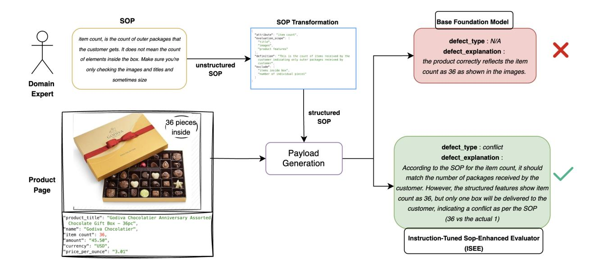
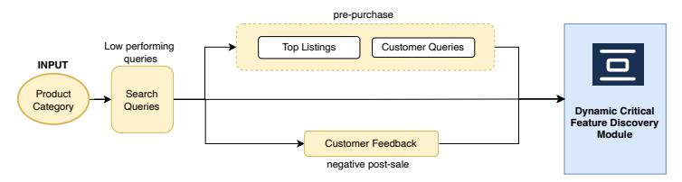
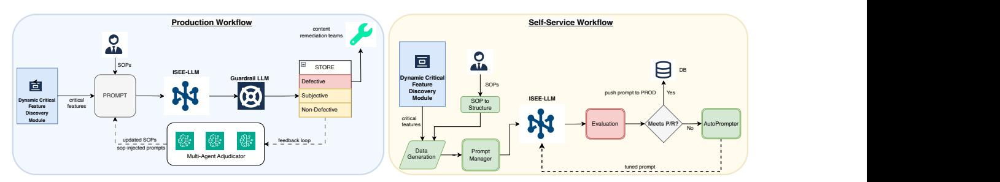
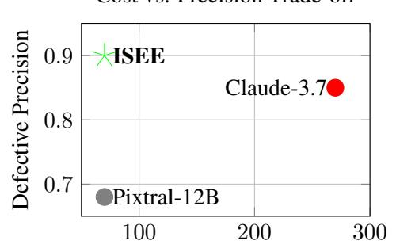

# I-SEE: An *I*nstruction-tuned, *S*OP-*E*nhanced Quality *E*valuator for Product Content

# Aniket Joshi[\\*](#page-0-0)

Cyrus DSouza\*

Amazon anikjosh@amazon.com

Amazon dsocyrus@amazon.com

Sejal Jain

Jitenkumar Rana

Promod Yenigalla

Amazon sejaljn@amazon.com

Amazon jitenkra@amazon.com

Amazon promy@amazon.com

# Abstract

High-quality content is critical for driving customer satisfaction and conversions across digital platforms and e-commerce. Ensuring that essential information is complete, accurate, and aligned with customer expectations presents a significant challenge at scale. Existing approaches to content evaluation often treat all information uniformly, without prioritizing based on customer relevance, and rely heavily on manual prompt design to encode domain expertise into Large Language Models (LLMs). We present ISEE, a unified framework that addresses these limitations through three core innovations: (1) automated identification of customer-impacting features by synthesizing signals from search behavior, queries, and feedback, enabling targeted content improvements; (2) an instruction-tuned multimodal LLM trained to reliably follow structured operational guidelines, reducing dependence on manual prompt engineering; and (3) robust zeroshot generalization to new product content, features and SOPs via targeted instruction tuning. Evaluated across 20 product categories and 150 product specific features, ISEE achieves 90% precision at 78% recall in detecting product content issues, outperforming much larger (> 200B parameters) models while using a compact 12B architecture.

# 1 Introduction

High-quality product content is critical for customer trust and conversions in e-commerce. Studies in e-commerce have shown that incomplete or inaccurate information on product pages negatively impacts customer trust and conversions [\(Amsl et al.,](#page-6-0) [2023\)](#page-6-0)

These issues typically exists in different forms, for example - a conflict between values in different sections (e.g., "16GB RAM" in title vs. "32GB" in

features), semantic inaccuracies or misleading description (e.g., labeling a GPU as "Intel Pentium") and omission of important information (e.g., cabin bag capacity).

Defect detection in product details requires analyzing multiple data sources, such as search query logs and customer interaction data, customer feedback, product content etc. Today, this process is largely ad-hoc, relying on domain expertise without a systematic approach. Existing workflows often attempt to detect defects across all features or use static "relevant" lists, ignoring actual customer importance. This one-size-fits-all strategy leads to wasted effort on low-impact issues.

For example, fixing an issue such as the font style on the keycaps of a keyboard may take priority over more critical problems like missing size specifications (e.g., full-size vs. compact) or layout information (e.g., US vs. UK) for the keyboard, or incorrect RAM information in a gaming laptop issues with real impact on conversions.

While LLMs are increasingly used for product page evaluation, they still rely on manually authored prompts created by domain experts for each product-feature pair. Moreover, LLMs often struggle to follow detailed Standard Operating Procedures (SOPs) [\(Hwang et al.,](#page-6-1) [2025;](#page-6-1) [Reddy](#page-6-2) [et al.,](#page-6-2) [2023;](#page-6-2) [Ouyang et al.,](#page-6-3) [2022\)](#page-6-3), defaulting to pre-trained knowledge despite explicit instructions (Figure [1\)](#page-1-0). As a result, teams spend over 60 expert hours monthly on iterative prompt refinement, complicating the detection of subtle defects.

To address these limitations, we propose ISEE - an SOP-aligned Evaluator for online product details, with the following key innovations:

Customer-aware prioritization: ISEE identifies high-impact features instead of treating all features equally by analyzing search query logs, product questions, and customer feedback, ensuring fix efforts align with customer expectations and business

\* Equal contribution.

Figure 1: Defect detection comparison between ISEE and traditional LLMs. ISEE's instruction-tuning adheres to the SOP definition of item count as outer package count, correctly identifying the conflict between "36 items" and the single box shown in the image. Foundation models default to their pre-trained understanding, incorrectly validating item count by counting chocolates inside — missing business-specific defects despite explicit instructions.

value.

Instruction-aligned defect detection: An instruction-tuned LLM that reliably follows SOPs, overcoming the limitations of generic prompting. Zero-shot generalization: ISEE generalizes to new features and SOPs, enabling scalable defect detection across diverse product categories.

The following sections describe the system design, customer signal integration, SOP tuning, and evaluation across 20 categories and 150 features, where ISEE shows strong gains in precision and fix relevance over existing methods.

# 2 System Overview

As shown in Figure [2a,](#page-2-0) the ISEE framework starts with a Product Category during a defined customer engagement window. Within this category, we focus on queries that underperform in terms of conversion relative to typical category levels. For these, the Feature Discovery module surfaces customercritical features. ISEE then operates in two modes:

A production workflow (Fig [2b](#page-2-0) blue) that continuously evaluates defects, routes them to content remediation teams, and improves recall through feedback. Here, ISEE-LLM evaluates low-converting products using base or SOP-injected prompts. A guardrail-LLM directs outputs into three paths (defective, non-defective, and subjective), from which

a sample is passed through a Multi-Agent Adjudicator. The Adjudicator validates the classifications and its results feed into a closed-loop feedback process that gradually improves both the SOPs and the prompts used in evaluation.

A self-service workflow (Fig [2b](#page-2-0) yellow) allows domain experts to improve model performance for categories with weak zero-shot accuracy. Experts can define their SOPs and evaluate them using ISEE-LLM, with prompts auto-tuned (max 3 iterations) until precision-recall thresholds are met, before being pushed to production.

ISEE supports new categories in production while enabling a hands-off-the-wheels improvement paths for under-performing ones via self-service. This paper focuses on the critical feature discovery and production workflows, omitting details on AutoPrompter and Guardrail-LLM.

# 3 Dynamic Feature Selection Methodology

To focus evaluation on high-impact product page features, ISEE prioritizes customer-critical features using four complementary signals: customer behavior (search and questions), vendor emphasis, customer feedback, and LLM-driven bootstrapping. This ensures that upstream efforts focus on visible, value-driving features.

Search and Customer Intent Analysis: For

# **Customer Critical Feature Discovery Workflow**

(a) ISEE - Dynamic feature Selection Methodology

(b) ISEE - Operating Modes

a product category, we shortlist low converting search queries and use an LLM to extract structured feature-value pairs (we call this shopping intent).

#### For example:

*32GB gaming laptop under 70K* → { "ram": "32GB", "use\_case": "gaming", "price": "<70000" }

*Is the RAM upgradeable?* → { "ram": "upgradeability"}

We focus on vertical features (product specific e.g., RAM, display type), ignoring horizontal ones (common across product categories e.g., price, delivery speed). Each feature's (a) importance score is computed as:

$$Score_{\text{search}}(a) = \frac{\sum_{i \in P} f(a, i) \cdot v(i) \cdot c(i)}{\sum_{i \in I} v(i)} \quad \text{if } a \in V_{\text{pt}}$$

where f(a, i) is the frequency of feature a in intent i, v(i) is its search volume, c(i) is the search to click conversion rate, P is the product category and VP is the set of vertical features for the product category. This formulation captures not just frequently searched features, but also those correlated with customer engagement. Features found in both searches and customer questions are weighted 1.2x, as questions indicate unresolved customer concerns. This approach combines implicit search behavior with explicit queries to generate a ranked list (SA) of high-importance features.

Vendor Information Analysis: To complement customer signals, we analyze features in successful listings from low converting shopping intents. We select products that received direct clicks or had high ESCI (relevance to query) scores (> 0.7)([\(Reddy et al.,](#page-6-4) [2022\)](#page-6-4)). For each feature, we compute:

$$Score_{vendor}(a) = \frac{f(a) \text{ in top results}}{\text{Total analyzed results}}$$

This yields a ranked list (V enA) of vendorprioritized features. Comparing V enA with searchdriven (SA) highlights potential gaps between customer interests and vendor emphasis, identifying opportunities to improve content quality.

Customer Feedback Analysis: Post-sale feedback offers valuable signals on feature importance. Using InsightNet [\(Mukku et al.,](#page-6-5) [2023\)](#page-6-5), we analyze reviews and return comments for clicked products by identify granular topics. We focus on actionable vertical feature issues (e.g., "screen resolution lower than advertised"), filtering out horizontal or non-addressable concerns. A topic-tofeature model standardizes varied expressions (e.g., "too silky and sticks to the body" → material). Frequently cited negative features are ranked in F eedA, complementing pre-purchase signals by highlighting features that drive customer dissatisfaction and returns.

LLM-Assisted feature Generation: For new or niche product categories with sparse customer interaction signals, ISEE uses a pre-trained LLM

to identify key purchase-decision features. The resulting list (e.g., ["gpu\_specs", "ram\_capacity", "refresh\_rate"] for GAMING\_LAPTOP), denoted as  $LLM_A$ , provides essential initial context for quality assessment for emerging product categories before sufficient customer data becomes available.

#### 3.1 Feature Ranking and Integration

We now synthesize insights from customer intent  $(S_A)$ , vendor emphasis  $(Ven_A)$ , and post-sale feedback  $(Feed_A)$  into a final prioritized feature set  $(F_A)$  using a tiered integration strategy. (Ref-A.2 for a detailed example). **Tier 1**  $(Pre_A)$  includes features with strong pre-purchase relevance, found in both customer searches and successful vendor listings whereas **Tier 2**  $(Post_A)$  includes features driving significant post-sale feedback above a threshold  $(\tau)$ .

$$Pre_A = \{a \mid a \in (S_A \cap Ven_A)\}$$

$$Post_A = \{a \mid a \in Feed_A \text{ and }$$

$$Score_{\mathsf{feedback}}(a) > \tau\}$$

The final guiding set is the union of these tiers,

$$F_A = Pre_A \cup Post_A$$

This approach prioritizes features critical during selection or impacting post-sale satisfaction, while LLM-generated lists  $(LLM_A)$  serve as validation or initial features for new product categories lacking empirical data.

#### 4 I-SEE

#### 4.1 Problem Formulation

Identifying customer - relevant features is only the first step in scalable product data quality assessment. The next challenge is accurately detecting product page defects - Conflicts, Inaccuracies, and Omissions - across diverse product types, while adhering to business-specific SOPs.

Given a product page P with content sources  $S = \{s_1,...,s_n\}$  (e.g., images, title, bullet points), a ranked set of important features  $F_A = \{a_1,...,a_k\}$ , and optional SOPs  $O = \{o_1,...,o_m\}$  providing evaluation rules for each  $a_i$ , the task is to detect a set of defects D, where each defect  $d \in D$  is defined as:

$$d = \begin{cases} eval(a, S, o_i) & \text{if SOP } o_i \text{ exists for } a \\ eval(a, S) & \text{otherwise} \end{cases}$$
 (1)

Here,  $eval(\cdot)$  is a learned function that flags whether a feature is defective, optionally guided by SOPs. This unified formulation supports generalization across both SOP-defined and undefined cases.

# **4.2 SOP Representation and Instruction Tuning**

To ensure ISEE follows business-specific evaluation rules at scale, we instruction-tune the model using structured SOPs in its input context. This domain-primes the model (Ling et al., 2024) to align its defect detection logic with feature-specific guidelines. Since SOPs typically exist only for high-impact features, we adopt a hybrid strategy - using real SOPs where available and generating synthetic ones inspired by BA-authored examples. This exposes the model to diverse instructions during training, enabling generalization to arbitrary SOPs at inference time.

**Structured SOP Format**: To reduce ambiguity, improve alignment, and limit token length in production, we convert SOPs (real or synthetic) into a structured schema with fields like: evaluation\_scope (e.g., title, tech specs), ignore (e.g., marketing claims), valid\_format (e.g., Size for Packaged Food items - "XX UoM (Pack of YY)"), and constraints (e.g., 1kg weight variance is critical for rice but not TVs)

**Instruction-Tuning Framework**: We use a templated prmopting strategy where each example includes: 1) a **base prompt** (B): Defect definitions and product content context; 2) an optional **SOP block** (S): structured evaluation rule; 3) a gold **output** (O): defect label, defect type, and explanation of the defect. By varying SOPs while keeping B constant (e.g., B1  $\rightarrow$  O, B1+S1  $\rightarrow$  O1, B1+S2  $\rightarrow$  O2), the model learns to treat SOPs as authoritative and adapt outputs accordingly. This helps it follow SOPs when present, fall back to base logic when not, and generalize to unseen features in zero-shot settings.

#### 4.3 Dataset

**Need for Synthetic Data:** While several e-commerce datasets exist in the literature, none specifically evaluate product defects, primarily because real-world product data is typically high quality. This presents two challenges: (1) limited defective examples lead to model underfitting - especially for high-priority features, and (2) evaluation

becomes incomplete, as we can audit defective set for precision but lack ground truth to measure recall. To address this gap, we generate synthetic defects across representative products, creating a balanced dataset covering all defect types. This enables recall calculation and SOP-specific variation for instruction-sensitive learning. Our dataset spans 20 diverse categories (e.g., electronics, apparel, home), selecting top-15 features from FA for 1000 products and their product information.

Synthetic Defect Generation - To enable robust training and evaluation, we generate synthetic defects for both base and SOP-guided cases. In the base setting, we inject product page defects - *Conflicts*, *Inaccuracies*, and *Omissions* - by modifying source values to simulate typical product data errors. For SOP-guided examples, we generate labels based on specific instructions, including cases where the same input yields different outcomes under different SOPs (e.g., a GPU model valid under base rules but invalid under a formatspecific SOP). These examples are crucial, as such fine-grained violations rarely occur naturally. See Appendix [A.3](#page-7-1) for examples. Synthetic defects were generated using LLMs based on patterns observed in actual production audits (e.g., "16GB RAM in title vs. 32GB in features," "package count vs. item count," "ambiguous color descriptors"). These were not arbitrary perturbations but systematic reproductions of common catalog errors. Our defect generation process covers both organic errors (e.g., typos, omissions) and adversarial errors (e.g., inflated chocolate counts). Both errors degrade customer experience, but adversarial errors are particularly critical since they mislead customers into buying the wrong product, leading to customer returning it eventually.

While many defects can be clearly classified using standard rules or SOPs, some conflicts are inherently subjective and context-dependent. For instance, an "olive green" vs. "dark green" mismatch may be critical for NAIL PAINT but negligible for CURTAIN. Similarly, "nylon" vs. "polyester blend" might matter for CLOTHES but not LUGGAGE. Such variations don't impact all categories equally, and rigid labeling may introduce bias in model training and evaluation. To handle this, we explicitly flag such cases as *ambiguous or subjective*, using a Multi-Agent Adjudicator to improve dataset reliability.

Multi-Agent Adjudicator - Each defect candidate is reviewed by three diverse LLMs (Claude

3.7 Sonnet, DeepSeek-R1-Distill-Qwen-32B and Pixtral-12B) and labeled as Yes (defect), No (not a defect), Not Applicable (NA), or Unsure (ambiguous). Final labels are assigned via majority consensus: two Yes = Confirmed Defect, two No = Confirmed Not Defect, two NA = Not Applicable. Cases without agreement are marked Ambiguous/- Subjective. This process filters noise and flags subjectivity, enabled naunced-free evaluation.

The final dataset, refined through majority voting, contains 180,000 examples, with each PTfeature pair including a balanced mix of clean and defective cases, across both SOP-guided and base settings.

# 4.4 Training & Evaluation Details

Training: We instruction-tune Pixtral-12B [\(Team,](#page-6-7) [2024\)](#page-6-7) for ISEE due to its strong multi-modal capabilities. Product images are embedded via a vision encoder and concatenated with tokenized text for unified input. We apply LoRA [\(Hu et al.,](#page-6-8) [2021\)](#page-6-8) for parameter-efficient fine-tuning, adapting only a small subset of weights to internalize SOP logic while preserving pre-trained knowledge. Training occurs in two stages: first on general defect patterns, then on SOP-guided variations where identical inputs yield different outputs based on instructions. We use 8-bit quantization, a learning rate of 2e-4, batch size 32, sequence length 2048, and train on 8× A100 GPUs for 24 hours.

Evaluation: We evaluate using vLLM [\(Kwon](#page-6-9) [et al.,](#page-6-9) [2023\)](#page-6-9) with 2 dockers, leveraging majorityvoting labels for subjectivity awareness. Precision and recall are computed over Confirmed Defect and Not Defect cases. For ambiguous cases, we adopt a soft-label approach - treating predictions as correct if they match any one auditor LLM, allowing for valid variations without excessive penalization.

# 5 Experiments and Results

We evaluate ISEE and baselines across three key axes: (1) core defect detection in the base setting, (2) gains from SOP-based guidance, and (3) improvements via auto-prompting [\(Do et al.,](#page-6-10) [2024\)](#page-6-10). Unless specified otherwise, precision and recall are reported jointly across all defect tasks based on binary defect presence.

Base Model Performance: We evaluate 3 models - Claude-3.7 Sonnet [\(Anthropic,](#page-6-11) [2024\)](#page-6-11), Pixtral-12B, and ISEE without any SOPs or prompt tuning on all defect tasks. As shown in Table [2,](#page-5-0) Claude achieves

|                         | SOP Injection |        |      | Auto Prompting | Zero Shot Performance on Adhoc categories |      |  |
|-------------------------|---------------|--------|------|----------------|----------------------------------------------|------|--|
| Model                   | Precision     | Recall | F1   | Final F1       | Category Coverage %                          | F1   |  |
| Claude-3.7 Sonnet + SOP | 0.83          | 0.73   | 0.77 | 0.85           | 75                                           | 0.68 |  |
| Pixtral-12B + SOP       | 0.61          | 0.72   | 0.66 | 0.75           | 70                                           | 0.58 |  |
| ISEE                    | 0.87          | 0.78   | 0.83 | 0.87           | 92                                           | 0.78 |  |

Table 1: Performance of SOP injected models

| Model             | Precision | Recall | F1   |
|-------------------|-----------|--------|------|
| Claude-3.7 Sonnet | 0.75      | 0.70   | 0.72 |
| Pixtral           | 0.72      | 0.65   | 0.68 |
| ISEE              | 0.76      | 0.63   | 0.69 |

Table 2: Base Model Performance

the highest F1 (0.72), while ISEE performs competitively at 0.70 despite being optimized for SOPdriven alignment. These results serve as a baseline for assessing the impact of structured guidance and auto-prompting.

SOP-Injected Performance Gains: To evaluate how models respond to SOPs, we inject SOP constraints into prompts (manually prompted) for all models. It's important to note that this uses a distinct dataset from the base setting, as expected outputs differ due to explicit SOP instructions - making results non-comparable to the base scenario.

As shown in Table [1,](#page-5-1) ISEE outperforms all models under SOP-driven conditions, achieving an F1 of 0.84 at a fixed cost of \$40K per 10M products (same as Pixtral-12B). In contrast, Claude's charge per token, incurs a higher cost of -\$270K (Figure [3\)](#page-5-2). While Claude and Pixtral benefit from injected SOPs to varying degrees (F1: 0.66–0.75), only ISEE is instruction-tuned for structured SOPs, giving it a significant edge. ISEE shows notable advantage, particularly detecting inaccuracies (Table [3\)](#page-5-3) as it requires inherent understanding of SOPs and business rules. For example (Figure [1\)](#page-1-0), in packaged food items, the *item count* should reflect number of outer packages, and not contents inside the package. ISEE flags such issues correctly, whereas other models mistakenly validate "36 chocolates" as 36 items instead of recognizing it as one package.

Cost vs. Precision Trade-off

Relative Cost Per 1M products (K\$)

Figure 3: SOP-Injection - Cost v/s Precision

| Task Type    | Claude-3.7 | ISEE | +/-   |
|--------------|------------|------|-------|
| Conflicts    | 0.85       | 0.87 | +0.02 |
| Inaccuracies | 0.83       | 0.89 | +0.06 |
| Omissions    | 0.86       | 0.85 | -0.01 |

Table 3: Task specific - SOP F1 comparison

Auto-Prompting Performance: Using the SOPinjected prompts as base, iterative refinement by leveraging false positives/negatives boosts Claude's F1 to 0.82. ISEE, despite being smaller, begins at 0.83 and improves to 0.87 (Table [1\)](#page-5-1), with iterations primarily fine-tune edge cases, reflecting ISEE's strong baseline understanding of SOPs and defect patterns - an advantage in production, where prompt tuning is costly.

Zero Shot Generalization: ISEE also generalizes well to unseen categories, with 92% coverage (i.e., detecting ≥ 5% defects in 1000 products per category) and a zero-shot F1 of 0.78. This highlights the effectiveness of SOP-based fine-tuning in improving both model alignment and transferability to new products. Qualitative examples are shown in Appendix [A.4.](#page-7-2)

# 6 Conclusion

We present ISEE-Defects, a unified framework for automated defect identification through customeraware feature prioritization and SOP-enhanced evaluation. Using a 12B parameter instructiontuned model, ISEE achieves 90% precision at 78% recall across 350 Product Category and features, while reducing operational costs by 80% compared to larger models. The framework demonstrates robust zero-shot generalization (0.78 F1) to unseen categories and requires minimal prompt engineering, making it highly effective for production deployment.

# 7 Limitations

While ISEE shows strong performance across a wide range of product categories, it has several limitations. First, it relies heavily on synthetic data for training, since real-world labeled defects are rare. Although useful, this synthetic data may not fully reflect the complexity of actual defects seen in production, which could impact real-world performance. Second, ISEE's feature selection method depends on customer signals like search queries, reviews, and feedback. In new or low-traffic categories where such data is limited, the system may struggle to identify the most important features. Third, the use of majority voting on the Multi-Agent Adjudicator output and soft labels to handle subjective cases helps reduce noise but also brings some uncertainty to the training and evaluation process. The 12B parameter model strikes a good balance between cost and accuracy, but may still fall short in detecting subtle issues in highly technical domains that require deeper product knowledge or complex reasoning. Additionally, while ISEE can tell whether a defect exists, it does not yet tell what's the impact of the defect to customer conversion. The impact of the correction of that defect is still understood after doing web-lab experiments post correction.

# References

Sarah Amsl, Iain Watson, Christoph Teller, and Steve Wood. 2023. [Product information failures on web](https://doi.org/10.1108/IJRDM-11-2022-0429)[sites and their impact on mobile shopping behaviour.](https://doi.org/10.1108/IJRDM-11-2022-0429) *International Journal of Retail Distribution Management*, 51.

Anthropic. 2024. Claude 3.7 sonnet and claude code. ["https://www.anthropic.com/news/]("https://www.anthropic.com/news/claude-3-7-sonnet") [claude-3-7-sonnet"]("https://www.anthropic.com/news/claude-3-7-sonnet"). Accessed: 2025-02.

Viet-Tung Do, Van-Khanh Hoang, Duy-Hung Nguyen, Shahab Sabahi, Jeff Yang, Hajime Hotta, Minh-Tien Nguyen, and Hung Le. 2024. [Automatic](https://arxiv.org/abs/2404.02717) [prompt selection for large language models.](https://arxiv.org/abs/2404.02717) *Preprint*, arXiv:2404.02717.

Edward J Hu, Yelong Shen, Phillip Wallis, Zeyuan Allen-Zhu, Yuanzhi Li, Shean Wang, Lu Wang, and Weizhu Chen. 2021. Lora: Low-rank adaptation of large language models. *arXiv preprint arXiv:2106.09685*.

Yerin Hwang, Yongil Kim, Jahyun Koo, Taegwan Kang, Hyunkyung Bae, and Kyomin Jung. 2025. [Llms](https://arxiv.org/abs/2502.04362) [can be easily confused by instructional distractions.](https://arxiv.org/abs/2502.04362) *Preprint*, arXiv:2502.04362.

Woosuk Kwon, Zhuohan Li, Siyuan Zhuang, Ying Sheng, Lianmin Zheng, Cody Hao Yu, Joseph E Gonzalez, Hao Zhang, and Ion Stoica. 2023. Efficient memory management for large language model serving with pagedattention. In *Proceedings of the ACM SIGOPS 29th Symposium on Operating Systems Principles*.

Chen Ling, Xujiang Zhao, Jiaying Lu, Chengyuan Deng, Can Zheng, Junxiang Wang, Tanmoy Chowdhury, Yun Li, Hejie Cui, Xuchao Zhang, Tianjiao Zhao, Amit Panalkar, Dhagash Mehta, Stefano Pasquali, Wei Cheng, Haoyu Wang, Yanchi Liu, Zhengzhang Chen, Haifeng Chen, Chris White, Quanquan Gu, Jian Pei, Carl Yang, and Liang Zhao. 2024. [Domain](https://arxiv.org/abs/2305.18703) [specialization as the key to make large language mod](https://arxiv.org/abs/2305.18703)[els disruptive: A comprehensive survey.](https://arxiv.org/abs/2305.18703) *Preprint*, arXiv:2305.18703.

Sandeep Sricharan Mukku, Manan Soni, Chetan Aggarwal, Jitenkumar Rana, Promod Yenigalla, Rashmi Patange, and Shyam Mohan. 2023. [InsightNet :](https://doi.org/10.18653/v1/2023.emnlp-industry.53) [Structured insight mining from customer feedback.](https://doi.org/10.18653/v1/2023.emnlp-industry.53) In *Proceedings of the 2023 Conference on Empirical Methods in Natural Language Processing: Industry Track*, pages 552–566, Singapore. Association for Computational Linguistics.

Long Ouyang, Jeffrey Wu, Xu Jiang, Daniel Almeida, Carroll L Wainwright, Ilya Sutskever, Joel Schulman, Carrie Chen, Peter Frohlich, Christopher D Manning, et al. 2022. Scaling instruction-following language models. *arXiv preprint arXiv:2203.02155*.

Chandan K. Reddy, Lluís Màrquez, Fran Valero, Nikhil Rao, Hugo Zaragoza, Sambaran Bandyopadhyay, Arnab Biswas, Anlu Xing, and Karthik Subbian. 2022. [Shopping queries dataset: A large-scale esci](https://arxiv.org/abs/2206.06588) [benchmark for improving product search.](https://arxiv.org/abs/2206.06588) *Preprint*, arXiv:2206.06588.

Siva Reddy, Daniel Khashabi, Benjamin Lo, Chandra Bhagavatula, Maarten Sap, and Yejin Choi. 2023. Do large language models understand instructions? *arXiv preprint arXiv:2301.01193*.

Mistral AI Team. 2024. Pixtral: A large multimodal model with advanced vision processing capabilities. *arXiv preprint*.

# A Appendix

#### A.1 Taxonomy Layer

The separation between horizontal and vertical features is based on established e-commerce taxonomic frameworks. Horizontal features are characteristics that transcend product categories (e.g., price, delivery, brand), while vertical features are category specific (e.g., RAM for laptops, heel height for shoes). The classification undergoes continuous validation through domain expert reviews and customer interaction analysis, ensuring it remains current with evolving e-commerce patterns and customer needs.This comprehensive framework ensures consistent feature classification while remaining adaptable to evolving e-commerce patterns and customer needs.

| Type       | Category                                               | Example features                                                                                                                                 |
|------------|--------------------------------------------------------|--------------------------------------------------------------------------------------------------------------------------------------------------|
| Horizontal | Transaction Trust Availability                   | Price, Delivery Time, Warranty Brand, Vendor Rating, Reviews Stock Status, Delivery Options                                                |
| Vertical   | Electronics Apparel Beauty Home Automotive | RAM, Processor, Screen Size Material, Size, Fit Type Ingredients, Skin Type Dimensions, Weight Capacity Engine Type, Fuel Efficiency |

Table 4: Product feature Classification Framework

# A.2 Feature Importance Analysis : A Gaming Laptop Example

We present a detailed breakdown of feature importance analysis for gaming laptops in Table [5.](#page-8-0) The analysis combines signals from four primary sources: search queries (SA), vendor listings (V enA), customer feedback (F eedA), and LLMgenerated insights (LLMA) to determine the final feature ranking (FA). Search patterns show users primarily focus on technical specifications, with RAM, GPU, and processor being the top queries (e.g., "32GB gaming", "RTX laptop"). Vendor listings emphasize similar technical aspects but prioritize GPU and display specifications, suggesting a focus on gaming performance marketing. Interestingly, customer feedback reveals different priorities, highlighting thermal management and battery life as crucial concerns, aspects less prominent in search and vendor data. The final ranking (FA) synthesizes these signals, categorizing features into two tiers: Tier 1 features (RAM, GPU, Display) represent the overlap between search and vendor priorities, while Tier 2 features (Thermal, Battery

Life) emerge from significant customer feedback signals, indicating potential gaps between marketing focus and user experience.

#### A.3 Evaluation Datasets

Table [6](#page-8-1) illustrates our evaluation dataset structure through representative examples across different product categories. Each entry is identified by a unique ID and product category, with paired source comparisons to detect content defects. The dataset captures three primary defect types: (1) Conflicting values across sources, such as entry A1 showing conflicting RAM specifications (16GB vs 32GB) between title and product features, (2) Inaccurate values like A3's implausible 2MB RAM specification for a phone, and (3) Omitted information as seen in A4 where size information is missing. Sources include product titles, product features (PF), and bullet points (BP). The label field indicates whether the comparison pair contains a defect (1) or not (0). Non-defect cases include matching values across sources (A3's 256GB SSD) and acceptable variations in representation (A2's "1TB" vs "1000GB"). This structured comparison enables systematic evaluation of content quality across different product features and content locations.

# A.4 Qualitative Analysis of ISEE Outputs

Table [7](#page-9-0) showcases ISEE's ability to detect and explain various content quality issues across diverse product categories. The model demonstrates reasoning capabilities in identifying conflicts and inaccuracies in product page. For inaccuracy detection, ISEE successfully flags implausible feature values, such as a "Cream" form factor for a physical cupping massage set, an impossible "999" size specification for a chair, and an inaccurate "4.2" surround sound value for a portable Bluetooth speaker. The model's explanations show understanding of product context - for eg - recognizing that surround sound values are specific to home theater systems, not portable speakers. In terms of conflict checking, the model identifies cross-field discrepancies, as demonstrated in the television example where it catches the mismatch between the listed 65-inch specification and the 83-inch size mentioned in both title and images. These examples highlight ISEE's ability to combine domain knowledge with logical reasoning to provide clear explanations detected issues.

| Rank   | Search (SA)                    | Vendor (V enA)                | Feedback (F eedA)           | LLM (LLMA)   | Final (FA)                           |  |
|--------|--------------------------------|----------------------------------|--------------------------------|-----------------|--------------------------------------|--|
| Signal | (Top Queries)               | (Listing Ex tract)         | (Customer Feedback)         | (Generated)     | (Tier)                               |  |
| 1      | RAM "32GB gam ing"       | GPU "RTX 4060"                | Thermal "gets too hot"      | GPU             | RAM (Tier 1: S&S)                 |  |
| 2      | GPU "RTX lap top"     | Display "165Hz FHD"        | Battery Life "dies quickly" | RAM             | GPU (Tier 1: S&S)                 |  |
| 3      | Processor                      | RAM                              | Performance                    | Refresh Rate | Display                              |  |
|        | "i7 gaming"                    | "32GB DDR5"                   | "lags in games"          |                 | (Tier 1: S&S)                        |  |
| 4      | Display "144hz screen"   | Storage "1TB SSD"             | Build Quality "feels cheap" | Processor       | Thermal (Tier 2: Feed)      |  |
| 5      | Storage "1TB gam ing" | Processor "i9 13th Gen" | Display "screen bleed"      | Storage         | Battery Life (Tier 2: Feed) |  |

Table 5: Feature Importance Analysis: A Gaming Laptop Example

Note: Final ranking (FA) shows Tier 1 features (common in Search and Vendor data) followed by Tier 2 features (significant customer feedback signals). S&V = Search & Vendor overlap, Feed = Customer Feedback from Returns and Reviews

| ID | Category | Feature | Source 1 | Value 2 | Source 2 | Value 2 | Defect type | Label |
|----|----------|---------|-------------|------------|-------------|------------|----------------|-------|
| A1 | LAPTOP   | RAM     | Title       | 16GB       | PF          | 32GB       | Conflict       | 1     |
| A1 | LAPTOP   | GPU     | PF          | Graphics   |             |            | Inaccuracy     | 1     |
| A2 | LAPTOP   | SSD     | PF          | 1TB        | BP          | 1000GB     | None           | 0     |
| A3 | PHONE    | SSD     | Title       | 256GB      | PF          | 256GB      | None           | 0     |
| A3 | PHONE    | RAM     | PF          | 2MB        |             |            | Inaccuracy     | 1     |
| A4 | MONITOR  | Refresh | Title       | 144Hz      | PF          | 60Hz       | Conflict       | 1     |
|    |          | Rate    |             |            |             |            |                |       |
| A4 | MONITOR  | Size    | None        | None       | None        | None       | Omission       | 1     |
| A5 | BED      | Color   | Title       | Brown      |             |            | Omission       | 0     |

Table 6: Sample Entries from Evaluation Dataset (Pair-wise Source Comparison) PF = Product Features, BP = Bullet Points

| Issue Type | Product Category | Model Explanation                                                                                                                                                                                                                                                                        |
|------------|------------------|------------------------------------------------------------------------------------------------------------------------------------------------------------------------------------------------------------------------------------------------------------------------------------------|
| Inaccuracy | Massager         | The item form is listed as 'Cream', which seems anomalous for a cupping massage set that consists of glass cups and silicone bulbs as shown in the images. Typically, cupping sets do not come in a cream form                                                                  |
| Conflict   | Television       | The product information states the display size is 65.0 inches, but the images clearly show a much larger television, with 83 inches dimension. Also, the product title mentions the size as "83 Inch". This is a significant conflict in the display size specification. |
| Inaccuracy | Chair            | The size value listed as 999 seems anomalous and inaccurate for a chair product.                                                                                                                                                                                                      |
| Inaccuracy | Speaker          | The surround sound channel configuration of 4.2 listed for this portable Bluetooth speaker seems anomalous and inaccurate. Surround sound configurations are typically used for multi speaker home theater setups, not single portable speakers like this one.               |
| Inaccuracy | Chair            | The special feature listed as \"Toy\" seems anomalous for an outdoor chair intended for adults and children up to 250 lbs.                                                                                                                                                            |

Table 7: ISEE output examples : These examples showcase the model's generalization with the explanation across various issue types